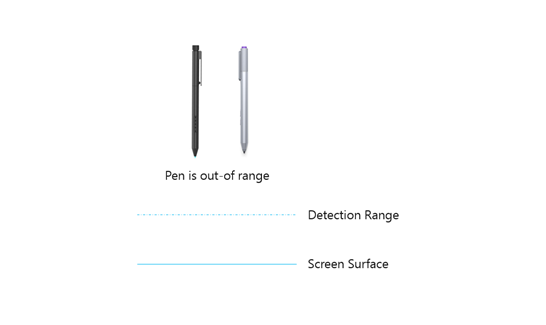
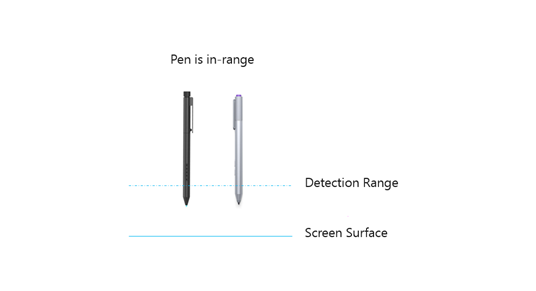
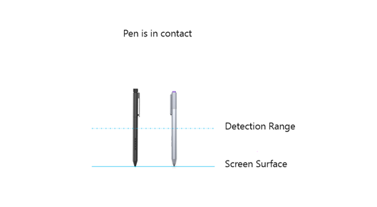
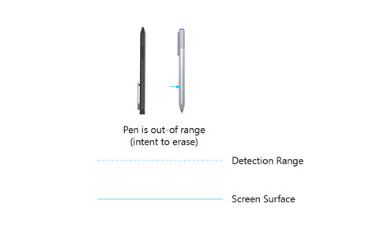
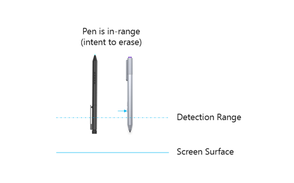
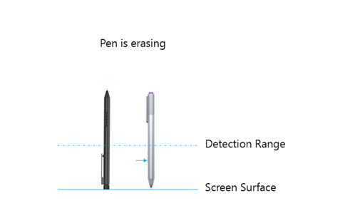
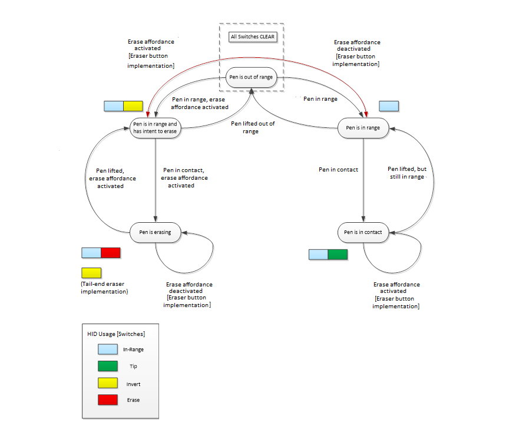
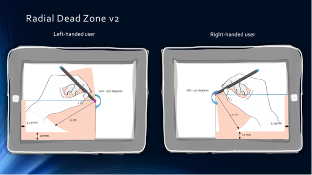
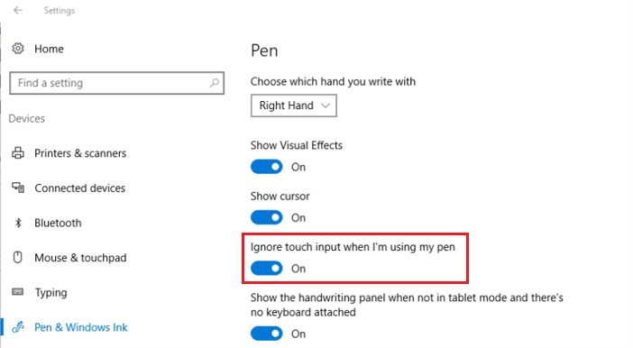

# Windows Pen States

This topic discusses the pen states for a Windows pen device in Windows 10 and later operating systems.

## The Main States

It is important to understand the various physical positions, or orientations in which the pen might be, the scenarios associated with these positions and how the transitions from position to position should be reported.

**Out of Range**

This is the simplest scenario for a Windows pen, and it occurs when the user is holding the pen out of the detection range of the digitizer.

In this state (shown in the preceding diagram), no input reports are delivered to the operating system.

**In Range**

This is a common scenario for a Windows pen, and it occurs when the user is holding the pen within the detection range of the digitizer.

In this state (shown in the preceding diagram), input reports are continuously delivered to the operating system with the pen's location and the in-range switch SET. The operating system and applications can display a cursor or other feedback in response to the pen being in range.

**In Contact**

This is the most common scenario for a Windows pen, and it occurs when the user is pressing the pen against the screen surface.

In this state (shown in the preceding diagram), input reports are continuously delivered to the operating system with the pen’s location, the in-range switch SET, tip switch SET, and the corresponding tip pressure. The operating system and applications can lay ink, or perform other actions in response to the pen being in contact with the screen surface.

**Out of Range (Intent to Erase)**

In this Windows pen scenario, the user has activated the erase capability of the pen, either by inverting it or by pressing (and holding) the erase button while the pen is out of the detection range of the digitizer. The erase capability of the pen is also referred to as the erase *affordance*.

In this state (shown in the preceding diagram), no input reports are delivered to the operating system.

**In Range (Intent to Erase)**

This is a common scenario for a Windows pen, and it occurs when the user is holding the pen within the detection range of the digitizer with the erase affordance activated, either by inverting the pen or by pressing (and holding) the erase button.

In this state (shown in the preceding diagram), input reports are continuously delivered to the operating system with the pen’s location, the in-range switch SET and the invert switch SET. The operating system and applications can display a cursor or other feedback in response to the pen being within the detection range, with an intent to erase.

**Erasing**

This is a common scenario for a Windows pen, and it occurs when the user is pressing the pen against the screen surface, with the erase affordance activated either by inverting the pen or by pressing (and holding) the erase button.

In this state (shown in the preceding diagram), input reports are continuously delivered to the operating system with the pen’s location, the in-range switch SET, and the eraser switch SET. For pens that use a tail-end erase implementation, the invert switch should also be SET in this state. The operating system and applications can erase ink or perform other actions related to erasing.

## Windows Pen State Transitions

The following diagram shows the set of valid transitions for a Windows pen (irrespective of eraser implementation). A single state is defined for out-of-range (regardless of whether the erase affordance is activated), given that the digitizer will not be sending reports to the operating system in this state.

**Non-Erase Transitions**

If the erase affordance is not activated (regardless of eraser implementation) when the pen enters the detection range of the digitizer, then the pen state transition that occurs, is shown in the diagram by the arc that goes from "Pen is out of range" to "Pen is in range." If the pen continues towards the screen surface and makes contact, with the erase affordance still not activated, then the diagram shows the pen state transition as going from "Pen is in range" to "Pen is in contact."

When the pen is lifted from the screen surface, and is within the detection range of the digitizer, then the arc that shows this state transition, goes from "Pen is in contact" to "Pen is in range." As part of this transition, a single input report should be delivered to the operating system, with the tip switch cleared and with the last location where the pen was in contact with the screen. As the pen continues to be lifted beyond the detection range of the digitizer, then the arc that shows this state transition, goes from "Pen is in range" to "Pen is out of range." As part of this transition, a single final input report should be delivered to the operating system with all switches cleared and with the last location where the pen was in range.

**Eraser Transitions**

If the erase affordance is activated (regardless of eraser implementation) when the pen enters the detection range of the digitizer, then the arc that shows this state transition, goes from "Pen is out of range" to "Pen is in range with intent to erase." If the pen continues towards the screen surface and makes contact, with the erase affordance still activated, then the arc that shows this state transition, goes from "Pen is in range with intent to erase" to "Pen is erasing."

When the pen is lifted from the screen surface and is within the detection range of the digitizer, then the arc that shows this state transition, goes from "Pen is erasing" to "Pen is in range with intent to erase." As part of this transition a single input report should be delivered to the operating system, with the eraser switch cleared and with the last location where the pen was in contact with the screen. As the pen continues to be lifted beyond the detection range of the digitizer, then the arc that shows this state transition, goes from "Pen is in range with intent to erase" to "Pen is out of range." As part of this transition, a single final input report should be delivered to the operating system, with all switches cleared and with the last location where the pen was in range.

**Special Notes for Eraser Button Implementations**

Unlike tail-end eraser implementations, button-based implementations can physically allow the user to activate/deactivate the erase affordance without the pen transitioning through the "out of range" state. However, this is not supported by the underlying protocol.

It is highly recommended that, while a pen with an eraser button is in contact with the screen, the eraser switch state be persisted until the pen is lifted, regardless of whether the button is pressed or released. Accidental eraser button presses during the "Pen is in contact" state, and accidental eraser button releases during the "Pen is erasing" state, are common occurrences for users, and the resulting transitions via the "Pen is out of range" state can result in a very jarring user experience.

While the pen is within detection range of the digitizer, but not in contact with the screen, activation/deactivation of the erase affordance should be honored. However, direct transitions between the "Pen is in range" and the "Pen is in range with intent to erase" states are not supported, and in this scenario, the pen states must always transition via "Pen is out of range."

For example, if the erase button is pressed while the pen is within detection range of the digitizer, but not in contact with the screen, a single input report should be delivered with all switches cleared and with the last location where the pen was in-range, followed by continuous reports where the invert switch is SET and the in-range switch is SET.

In a reverse example, if the erase button is released while the pen is within detection range of the digitizer, but not in contact with the screen, a single input report should be delivered with all switches cleared and with the last location where the pen was in-range, with the invert switch SET. This should then be followed by continuous reports where the invert switch is clear and the in-range switch is SET.

## Firmware Update Collection (Optional)

An integrated Windows pen device can use the HID protocol in Windows 10, to provide a vendor-specific top-level collection for performing device firmware and vendor configuration updates.

The vendor-specific firmware update collection could provide an output report for transferring the firmware payload from the host to the device. This is highly advantageous, as it allows for firmware updates to be performed without requiring a driver on the host.

It is mandatory for the HID I²C descriptor member, *wVersionID*, to be incremented after a firmware upgrade.

Integrated Windows pen devices should be able to recover from a firmware update that failed due to power loss (or some other error), by removing, and then reapplying its power supply. It is highly recommended that basic functionality be available even after a failed firmware update.

## Palm Rejection

Prior to Windows 10, upon receiving input from a pen device that was either in-range or in contact of the screen, the operating system would suppress all touch input (whether in inking or erase mode).

In Windows 10, version 1607, the dead-zone is more compact to aid with simultaneous pen and touch interaction. The modified dead-zone captures almost 95% of inadvertent touches while still providing great end-user experience.

For left-handed users, the dead-zone ranges from 100 - 270 degrees and spans up to 12 cm radially.

For right-handed users, the dead-zone ranges from 280 - 30 degrees and spans up to 12 cm radially.

The operating system accepts touch interactions either from the left or right of the pen tip, depending on the user’s setting for handedness. For right handed users, touch interactions are accepted from the left of the pen tip (as shown in the preceding diagram) and vice-versa for left handed users. By default, the pen is configured for right-handed users but can easily be changed by opening **Settings** clicking **Devices**, and then opening the **Pen** dialog window, shown below. However, some users have a preference for the palm rejection behavior found in Windows 8.1. To support this preference, Windows 10 also provides a setting to ignore all touch input when a pen comes in range.

> [!NOTE]
> Although legacy devices (specifically ones that suppress touch input when pen input is being delivered) will function in Windows 10, these devices will not deliver the functionality described above. Additionally, these devices will not deliver any future functionality that leverages simultaneous pen and touch reporting.

Starting in Windows 10, this setting can be hidden on systems that do not support simultaneous pen and touch reporting by using the following registry key. Setting the key to 0 will display the settings to the user, while setting it to 1 will hide them. 

| Registry key                                               | Type  | Units             |
|------------------------------------------------------------|-------|-------------------|
| HKEY_LOCAL_MACHINE\SOFTWARE\Microsoft\Windows\CurrentVersion\Pen\HideSPTSettings | DWORD | Boolean (1 or 0) |
 

**Touch Interactions with Pen In-Range**

As mentioned earlier, Windows 10 allows the user to perform touch interactions while the pen is in-range, on hardware that supports simultaneous touch/pen reporting. But once the pen transitions from being in-range to being in contact with the screen, all touch interactions are suppressed. This is the same behavior as in previous versions of Windows.

**Delayed Zooming on Inking Surfaces**

The built-in palm rejection feature in Windows 10, is most effective when the pen is detected in-range of the digitizer, prior to the palm arriving on the digitizer surface. However, depending on the speed at which the palm lands, and the limitation of the pen digitizer's detection threshold, it is possible that the palm will arrive before the pen is detected.

One of the most disruptive results of a palm being reported to the operating system as multiple touch contacts, prior to the pen location being reported is that, an inking surface may change zoom levels inadvertently. Windows 10 provides protection against this behavior by default, by applying a 250ms delay to all pinch/zoom interactions on inking surfaces, to allow additional time for pen detection. It should be noted that this delay will only be present for systems with an integrated pen.

This global delay value (default of 250ms) is configurable by the OEM, via the Windows registry. For pen digitizers that have a reduced detection threshold, where there is strong likelihood of a palm arriving before the pen is detected, it may be advisable to increase the delay value (up to a maximum of 500ms).

For pen digitizers with an improved detection threshold and/or have a touch solution with integrated palm rejection, it may be advisable to reduce this value (down to a minimum of 0ms).

Here's the registry key that can be used to set the pinch/zoom delay value.

| Registry key                                               | Type  | Units             |
|------------------------------------------------------------|-------|-------------------|
| HKLM\\SOFTWARE\\Microsoft\\Palm\\DelayManipulationDuration | DWORD | Milliseconds (ms) |

 

Note that this registry setting and the related delay zoom mechanism are only effective on Windows 10 systems which expose an integrated pen digitizer.
