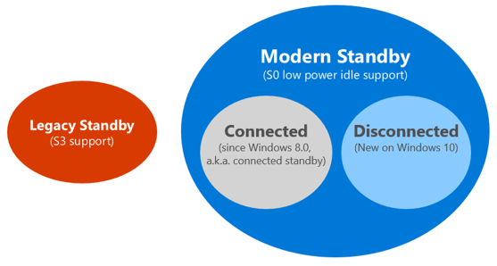

# Power models and the advantages of using Modern Standby

## Modern Standby and its connection to Connected Standby and S3

In Windows 10, there are two power models for PCs: S3 and Modern Standby. The S3 power model is an older standard and is not capable of the instant on that consumers expect from modern devices. Modern Standby is capable of leveraging all the capabilities of a modern chipset and can be integrated across the breadth of tablets and PCs today. The first iteration of Modern Standby was Connected Standby, which first shipped in Windows 8 and Windows 8.1. Modern Standby expands upon the Windows 8.x Connected Standby concept, allowing more flexibility in component selection.

The above figure illustrates the relationships between all models, and how CS can be considered as a special case of Modern Standby in Windows 10, as a connected state.

Modern Standby systems can be connected or disconnected while in standby. This behavior is dictated by the hardware and/or by configuration.

On any Modern Standby system (whether connected or disconnected), the system remains in S0 while in standby, allowing the following scenarios to work:

-   Background activity
-   Faster resume from a low power state

On systems that are connected while in standby, wakes based on specific network patterns may also be set by the operating system to enable apps to receive the latest content such as incoming email, VoIP calls, or news articles.

## Advantages of using Modern Standby over S3

### Instant On

Just like on a Windows 8.1 Connected Standby system, an instant on experience is a key value available in Modern Standby. Telemetry data indicates that resume time from the low power idle model is at least twice as fast as that from an S3 resume.

Users expect their PC and tablet devices to instantly power on, the same way their smartphones do. The time it takes for PCs and tablets to power on is greatly reducing and Windows devices need to have near instant-on capabilities.

### Background activity while the system is “off”

When Modern Standby-capable systems go into Standby, the system is still in S0 (a fully running state, ready and able to do work). Desktop apps are stopped by the Desktop Activity Moderator (DAM); however, background tasks from Windows Store apps are permitted to do work. On a connected Modern Standby system, the network is still active, and users can receive events such as VoIP calls in a Windows store app. While VoIP calls coming in over Wi-Fi wouldn’t be available on a disconnected Modern Standby system, real-time events such as reminders or a Bluetooth device syncing can still happen.

### Simplified wake story

Device wake, even in the S3 model, requires functionality integrated into the BIOS. This makes wake times slower and more cumbersome to develop. With Modern Standby a system stays in the S0 state and waking simply requires a hardware interrupt. Thus, it may eliminate any need for firmware interaction.

 

 

