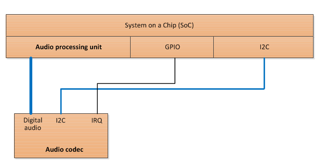
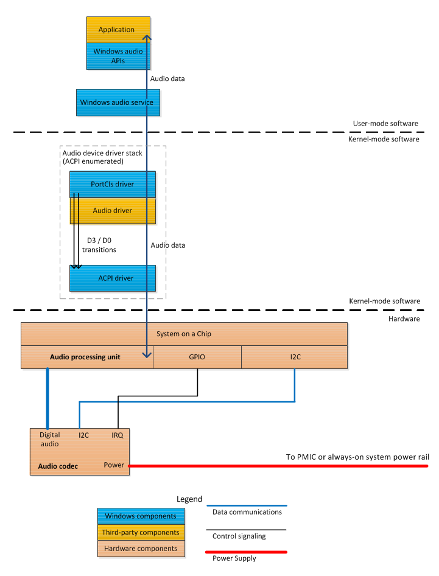
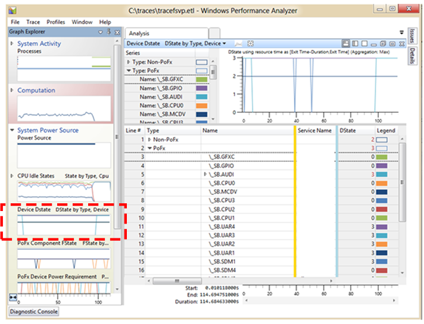
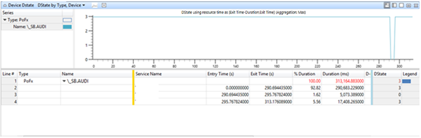

# Audio subsystem power management for modern standby platforms


Every Windows PC has an audio subsystem that enables the user to listen to and record high-quality sound in real-time. A hardware platform that supports the connected standby power model is typically built around a System on a Chip (SoC) integrated circuit that features built-in, low-power audio processing units.

The audio processing units offload audio processing from the main processor (or processors) on the SoC. Because these units can process audio data without using the main processor, the user can continue to listen to audio even after the main processor enters a low-power state to conserve battery power.

<iframe src="https://hubs-video.ssl.catalog.video.msn.com/embed/05790d60-09c4-4a00-8fa0-bd0fb5c4424e/IA?csid=ux-en-us&MsnPlayerLeadsWith=html&PlaybackMode=Inline&MsnPlayerDisplayShareBar=false&MsnPlayerDisplayInfoButton=false&iframe=true&QualityOverride=HD" width="720" height="405" allowFullScreen="true" frameBorder="0" scrolling="no">A video describing how to validate screen-off audio playback.</iframe>

This video shows how to use Windows Performance Analyzer (WPA) to verify that a computer enters the low-power state during screen-off audio playback (also known as low-power audio, or LPA).

The following article discusses audio subsystem power management for connected standby platforms. In the following discussion, the term *on-SoC* component describes a component that is integrated into the SoC chip. An *off-SoC* component is external to the SoC chip.

## <a href="" id="overview"></a>Audio subsystem overview


In addition to the SoC function blocks that do offloaded audio processing, each connected standby platform includes an off-SoC component, called a *codec*, that does the following:

-   Translates decoded digital streams into analog sounds.
-   Drives built-in speakers.
-   Drives externally attached analog headphones.

Like the [camera subsystem](camera-subsystem.md), the audio subsystem features both on-SoC and off-SoC components. However, Windows expects a single audio driver to manage both the on-SoC audio processing engines and the off-SoC codec. This single audio driver is responsible for managing both the components that are integrated into the SoC and the off-SoC components that can be selected by the system integrator. Therefore, the system integrator should work closely with the SoC silicon vendor on audio subsystem integration and power management.

The audio hardware vendor must implement the audio driver as a [Port Class](https://msdn.microsoft.com/library/windows/hardware/ff536829) (Portcls) miniport driver. The audio driver works in conjunction with the Portcls system driver, Portcls.sys, which is an inbox component of Windows.

Compared to other device classes, the audio subsystem is unique in the way that it does power management when the platform is in the connected standby power state (that is, when the screen is turned off). When the platform is connected standby, the system can generate audio sounds to notify the user of events (for example, the arrival of a new email) in real time. Additionally, the user can turn off the system display and then continue to listen to audio being played by an application. These capabilities cannot be achieved by a simple power management strategy in which the audio subsystem must be turned off when the system is in connected standby. Instead, power management of the audio subsystem must be performed on a run-time idle basis (so that it turns on only when required) at all times except when the system is in the ACPI Shutdown (S5) state.

The audio driver performs run-time idle power management in close cooperation with the Windows audio infrastructure and the PortCls system driver. PortCls monitors any accesses (such as I/O and property accesses) of the audio device and resets the idle timer on each access. If the idle timer expires, PortCls transitions the audio device (with help from the audio driver) to a low-power sleep (D3) state. PortCls returns the audio device to the active (D0) state in the event of new access activity.

PortCls also registers with the [Windows power framework](https://msdn.microsoft.com/library/windows/hardware/hh406637) (PoFx) so that the system power engine plug-in (PEP) can be notified of audio device power state changes. These notifications allow the PEP to know when it can safely turn off clocks and power rails that might be shared between the audio processing units and other SoC function blocks.

We recommend that when the audio subsystem is not being used, it should be in a sleep state in which a total of less than one milliwatt is consumed by the audio subsystem. This total includes the power consumed by the audio processing units, the off-SoC codec, and any additional audio circuitry (for example, amplifiers for speakers and headphones).

## <a href="" id="hwtop"></a>Audio subsystem hardware topology


The audio subsystem is comprised of multiple on-SoC and off-SoC components, but is presented to Windows as a single device in the ACPI namespace.

The audio processing units are located on the SoC. SoCs from different vendors have audio processing units that vary in their capabilities, power consumption, and performance. The audio processing units perform audio offloading—they process audio streams (for example, by mixing and applying audio effects) without using the main processor. For audio playback that is not latency sensitive, offloading audio from the main processor is preferred because the audio processing units use less power than the main processor.

For more information about offloaded audio, see [Hardware-Offloaded Audio Processing](https://msdn.microsoft.com/library/windows/hardware/dn302038).

The system also includes an off-SoC audio codec that converts the digital audio stream to analog output to drive built-in speakers or external headphones. The codec might include integrated analog amplifiers for speakers and headphones. Or, discrete amplifiers can be used instead. A typical codec has the following connections to the on-SoC audio processing unit:

-   A digital audio interface (I2S or similar serial bus).
-   A control interface (typically I2C or similar serial bus).
-   One or more GPIO pins to control power management circuitry and to interrupt the SoC when the codec state changes.

These connections are shown in the following block diagram.



From the point of view of Windows, the audio processing unit and the audio codec together comprise the audio device. The audio device must be enumerated in the ACPI namespace as a single device object.

Although the audio subsystem should be exposed to Windows through a single audio driver, the SoC vendor might, as an option, adopt a driver extension model in which the audio driver is decomposed into two or more separate drivers. For example, the control software that directly manages the audio codec might be placed in a codec driver that is separate from the main audio driver. The main audio driver then indirectly manages the codec by communicating with the codec driver. The details of this driver extension model are outside the scope of this document and are proprietary to the SoC vendor's audio driver. The system integrator should work directly with the SoC silicon vendor to implement such proprietary features in the audio subsystem.

## <a href="" id="modes"></a>Power management modes


The audio subsystem must support the following two power management modes:

-   An *active* mode in which audio is actively being streamed for the user.
-   A low-power *sleep* mode in which the audio processing unit is turned off, the off-SoC codec is placed in a low-power mode, and the combined audio subsystem components consume less than one milliwatt.

The following table describes these two power modes.

<table style="width:100%;">
<colgroup>
<col width="16%" />
<col width="16%" />
<col width="16%" />
<col width="16%" />
<col width="16%" />
<col width="16%" />
</colgroup>
<thead>
<tr class="header">
<th>Mode</th>
<th>Description</th>
<th>Device power state (Dx)</th>
<th>Average power consumption</th>
<th>Exit latency to active</th>
<th>Transition mechanism</th>
</tr>
</thead>
<tbody>
<tr class="odd">
<td>Active (streaming)</td>
<td>The audio processing units are actively streaming audio and the codec is providing analog or digital audio to an [audio endpoint](https://msdn.microsoft.com/library/windows/hardware/dd370793) such as headphones, built-in speakers, or a remote HDMI output device.</td>
<td>D0</td>
<td><p>&lt;= 100 milliwatts</p>
<p>(audio processing + codec)</p></td>
<td><p>N/A</p></td>
<td><p>Transition to D0 initiated by Portcls.</p>
<p>Occurs when an application or system service initiates audio streaming.</p></td>
</tr>
<tr class="even">
<td>Sleep</td>
<td>The audio processing units are not streaming audio and the codec is not operational except for standby power sufficient to detect jack insertion or removal.</td>
<td>D3</td>
<td><p>&lt;= 1 milliwatt</p>
<p>(Recommended.)</p></td>
<td><p>&lt;= 35 milliseconds or &lt;= 300 milliseconds, depending on system scenario.</p>
<p>(Required.)</p></td>
<td><p>Transition to D3 initiated by Portcls.</p>
<p>Occurs when all applications finish audio streaming and the driver-provided or system-provided idle time-out expires.</p></td>
</tr>
</tbody>
</table>

 

In some SoC designs, the audio processing units are multifunction blocks shared with video decoding and graphics processing. With these designs, there may be scenarios in which the audio processing units are powered on when audio is not actively streaming.

## <a href="" id="software"></a>Software power management mechanisms


The primary software power management mechanism for the audio subsystem is run-time idle detection that is built into PortCls. Run-time idle detection allows PortCls to observe the application audio streaming activity to determine when to switch the audio device between the active and sleep power modes. PortCls also enables a proprietary extension mechanism between the audio driver and the SoC vendor-provided power engine plug-in (PEP) to manage the performance state of the audio processing units.

### Run-time idle detection

The components in the audio subsystem enter the low-power sleep mode after the audio subsystem is idle for some specified time-out interval.

The audio driver that is provided by the SoC vendor must register the following two default idle time-out settings:

-   PerformanceIdleTime – Use this time-out interval when the hardware platform is plugged into AC power.
-   ConservationIdleTime – Use this time-out interval when the platform is running on battery power.

The idle time-out settings are stored in registry entries that are located under the audio driver's PowerSettings registry key. For more information, see [Audio Device Class Inactivity Timer Implementation](https://msdn.microsoft.com/library/windows/hardware/ff536193).

The following .inf directives must be used to set a PerformanceIdleTime time-out of one second and a ConservationIdleTime time-out of one second:

``` syntax
[MyAudioDevice.AddReg]
HKR,PowerSettings,ConservationIdleTime,1,01,00,00,00
HKR,PowerSettings,PerformanceIdleTime,1,01,00,00,00
HKR,PowerSettings,IdlePowerState,1,03,00,00,00
```

PortCls collaborates with the [Windows kernel power manager](https://msdn.microsoft.com/library/windows/hardware/ff565766) to automatically switch between the PerformanceIdleTime and ConservationIdleTime time-out values as the platform transitions between AC power and battery power.

When the system is in connected standby (that is, with the screen turned off) and audio playback is not initiated, PortCls always uses an idle time-out of one second, regardless of the time-out setting that the adapter driver specifies in its .inf file.

The audio driver provided by the SoC vendor must also register an IdlePowerState setting to specify the power state to transition to when the idle time-out expires. On all connected standby platforms, audio drivers must register D3 as the power state to enter when an idle time-out occurs. To specify the D3 state, the [**AddReg**](https://msdn.microsoft.com/library/windows/hardware/ff546320) directive in the preceding example sets the IdlePowerState value to 03.

When the idle time-out expires, PortCls calls the audio driver's [**IAdapterPowerManagement3::PowerChangeState3**](https://msdn.microsoft.com/library/windows/hardware/jj200332) method to tell the driver to prepare the audio device to enter the low-power sleep mode (*NewPowerState* = **PowerDeviceD3**). The audio driver must save context for the audio processing unit and place the codec into a low-power sleep mode that consumes less than one milliwatt, on average. In the low-power sleep mode, the codec must continue to have sufficient power to detect audio jack insertion/removal and generate a level-triggered interrupt to the main processor on the SoC.

When audio playback is required because of application streaming, system sound generation, or auditory notification during connected standby, PortCls calls the audio driver's **PowerChangeState3** method to tell the driver to configure the audio device to operate in the active (D0) power state (*NewPowerState* = **PowerDeviceD0**). The audio driver must restore context for the audio processing unit and re-enable the codec.

PortCls calls the audio driver's [**IAdapterPowerManagement3::D3ExitLatencyChanged**](https://msdn.microsoft.com/library/windows/hardware/jj200331) method to notify the driver of a change in the maximum latency that can be tolerated for transitions from the sleep (D3) state to the active (D0) state. PortCls calls the audio driver's **D3ExitLatencyChanged** method to set the maximum latency to either 35 milliseconds or 300 milliseconds. The audio driver must respect the maximum latency tolerance and not enter a low-power state that requires a resume latency larger than the value specified by PortCls in the **D3ExitLatencyChanged** method.

### Codec power management

The audio driver that is provided by the SoC vendor is also responsible for configuring and power-managing the off-SoC audio codec. The driver typically controls the audio codec through an I²C or other [simple peripheral bus](https://msdn.microsoft.com/library/windows/hardware/hh450903) (SPB) connection from the SoC. The driver must also handle interrupts from the codec device.

The audio driver must transition the codec to a low-power sleep mode when the audio subsystem enters the D3 (sleep) state.

The audio driver must transition the codec to the active power mode when the audio subsystem enters the D0 (active) state.

### Windows power framework (PoFx) and the power engine plug-in (PEP)

PortCls registers with the Windows[power management framework](https://msdn.microsoft.com/library/windows/hardware/hh406637) so that the SoC-vendor-provided PEP is notified of audio device transitions between the active (D0) and sleep (D3) power modes. In many SoC designs, the clock and power rails for the audio processing units are shared with other on-SoC functional blocks. The PEP provided by the SoC vendor is aware of the SoC-specific clock and power topologies and takes the appropriate action to stop clocks or to turn off power rails associated with the audio processing unit when it is in the sleep mode.

Additionally, PortCls supports a private mechanism called *context sharing* that allows the audio driver to communicate directly with the PEP to perform fine-grained power management. For example, an audio driver can use context sharing to inform the PEP of the current audio stream content type and bit rate. The PEP uses this information to scale the clock frequency for the audio processing unit down to the minimum that is required to process the current audio stream without glitching.

The context sharing interface is defined as a simple input/output buffer with a GUID identifier, and is similar to other extensible Windows power management interfaces. For more information about context sharing between the miniport driver and the PEP, see [PortCls Private PEP Context Sharing](https://msdn.microsoft.com/library/windows/hardware/dn265133).

## <a href="" id="supportedhw"></a>Supported hardware power configuration


In connected standby platforms, Windows supports a single hardware power management configuration for the audio subsystem.

In the expected configuration, the audio processing units are located on the SoC, and the external audio codec is connected to the SoC through a SoC-compatible digital audio interface, a [simple peripheral bus](../component-guidelines/simple-peripheral-bus--spb-.md) (SPB) such as I²C, and one or more GPIO pins. We recommend that the audio codec and external logic consume no more than one milliwatt in the sleep power mode.

The following block diagram shows the expected hardware configuration, the **Audio device driver stack**, and the user-mode components.



The audio subsystem can have components located behind the codec that are not visible to the operating system and its drivers. For example, these components might include amplifiers for the speakers and headphones. Such components are platform-specific and can be selected by the system integrator within the requirements outlined as part of the Windows Certification program.

The system integrator must enumerate the SoC audio device in the root of the [APCI namespace hierarchy](https://msdn.microsoft.com/library/windows/hardware/dn495659). All memory, I/O, GPIO, and I²C (or other SPB) resources required for the audio processing unit and the external codec must be listed in the \_CRS object under the device in the namespace. The system integrator and ACPI firmware developer must communicate with the audio driver developer to understand the conventions for ordering [hardware resources](https://msdn.microsoft.com/library/windows/hardware/ff547012), such as GPIO pins. For example, a driver that receives two GPIO resources distinguishes between them based on the order in which they appear in the resource list. For more information, see [GPIO-Based Hardware Resources](https://msdn.microsoft.com/library/windows/hardware/hh439476).

Although the [ACPI driver](https://msdn.microsoft.com/library/windows/hardware/ff540493) (Acpi.sys) can observe the active (D0) and sleep (D3) transitions as the device power IRPs flow through the audio stack, the system integrator must not describe the audio codec as part of a power resource or use the \_PS0 and \_PS3 ACPI control methods to change the codec power state. In sleep mode, the codec is expected to operate at sufficiently low power that it can be left on at all times to detect jack insertion and removal.

The audio codec and any external amplifiers must be placed on a power rail that is always powered on except when the system is in the ACPI Shutdown (S5) state. GPIO pins can be used to enable or disable the amplifiers on demand. The amplifiers can be controlled by using GPIO pins from either the codec or the SoC.

A key requirement is that the codec itself remains powered at all times—even when it's in a low-power sleep mode—so that jack insertion and removal can be detected. The codec must generate an interrupt that can wake the SoC from its deepest idle state to handle headphone jack insertion and removal.

## <a href="" id="wake"></a>Wake concerns (headphone and microphone jack detection)


The audio subsystem must handle changes in the state of the audio output device that can occur at any time. The most common audio device state changes are the insertion of an output device into the built-in headphone jack and the removal of this device from the jack. Jack insertion and removal must also be detected for any other attached audio ports, including microphone and digital signal ports.

At all times, the audio stack must be able to detect jack insertion and removal. The interrupt line from the audio codec must be connected to a GPIO pin that is always powered and always capable of waking the SoC from its deepest idle state. Jack detection enables Windows to maintain up-to-date information about the audio input and output devices in real-time, including all times when the system is in connected standby. For example, Windows is immediately notified when the user inserts a plug into the headphones jack. In response to this notification, any future connected standby notification alert sounds are routed to the headphones instead of to the platform's built-in speakers.

As previously described, the system firmware assigns a set of hardware resources to the audio device. These resources are described in the ACPI \_CRS object, and the operating system passes a list of these resources to the audio driver. This resource list includes all GPIO interrupts that are used to detect state changes in the audio output device (for example, headphone insertion). These interrupts must be marked in the system ACPI firmware as *wake sources*. The audio driver is expected to add interrupt handlers for each of these wake interrupts. The interrupt handlers must update the state of the audio device, the audio codec, and the audio driver, as appropriate, based on which interrupt was signaled.

The ordering of resources in the \_CRS object is based on a device-specific convention that is defined by the audio driver developer. For example, if the driver receives two interrupt resources, the driver distinguishes between them based on the order in which they occur in the resource list. The ACPI firmware developer must use the same ordering to describe these resources in the ACPI firmware.

Multiple hardware, firmware, and software subsystems must collaborate to make audio jack insertion and removal detection work correctly. The system integrator and audio driver developer must adhere to the following implementation guidelines:

**Hardware and SoC**

-   The audio codec hardware must detect headphone, microphone, and other jack insertion and removal events at all times that the system is powered on, including when the system is in connected standby.
-   The audio codec hardware must be able to detect jack insertion and removal while consuming very little power (less than one milliwatt average).
-   The audio codec interrupt must be connected to a GPIO pin on the SoC that is capable of waking the SoC from its deepest power state.

**ACPI firmware**

-   The audio device must be described in the ACPI namespace.
-   The GPIO lines used to detect jack insertion must be described by the ACPI firmware as exclusive and wake interrupts. Use the **GpioInt** descriptor macro and set the *Shared* argument to ExclusiveAndWake.
-   The audio device's hardware resources must be listed in the order that is expected by the audio driver.

**Audio driver software**

-   The audio driver must connect an interrupt handler to the GPIO wake interrupts.
-   When the audio driver handles the interrupt, it evaluates the state of the audio input/output devices and performs the appropriate actions.

## <a href="" id="testing"></a>Testing and validation


System integrators can use the [Windows Performance Analyzer](http://msdn.microsoft.com/library/windows/hardware/hh448170.aspx) (WPA) to verify that the audio device correctly performs run-time idle power management and transitions as expected between the active (D0) and sleep (D3) states. WPA is available on the Microsoft Connect website. Please contact your Microsoft representative for assistance in obtaining WPA and the WPA Power Management extensions. The system integrator should also obtain the WPA Power Management Analysis Tools package. This package includes extensions to WPA that enable system power management analysis.

WPA relies on [Event Tracing for Windows](https://msdn.microsoft.com/library/windows/hardware/ff545699) (ETW) instrumentation that is built into the Windows kernel and other Windows components, including PortCls. To use ETW tracing, a set of trace providers are enabled, and their events are recorded into a log file while a test scenario runs. When the scenario finishes, the trace providers are stopped. WPA enables post-processing and visual analysis of the log file that is generated by the scenario under test.

On a system that has WPA installed, a set of commands can be used to collect power management instrumentation to validate the power management of the audio device. The Xperf.exe tool is installed in the \\%Program Files%\\Windows Kits\\8.0\\Windows Performance Analyzer folder.

To start power management ETW tracing, open a Command Prompt window as Administrator, change to the directory that contains WPA, and run the following commands:

``` syntax
>xperf -start powertracesession -on Microsoft-Windows-Kernel-Power
>xperf -capturestate powertracesession Microsoft-Windows-Kernel-Power
```

These commands instruct Windows to enable the Microsoft-Windows-Kernel-Power ETW event provider and to capture the initial state of events from the Microsoft-Windows-Kernel-Power provider.

After the ETW tracing has started, the developer should exercise system scenarios to verify that the audio device correctly transitions between the active (D0) and sleep (D3) power modes. The developer should validate audio device in the following scenarios:

-   Launch an application that transitions the audio device from the D3 state to the D0 state.
-   One second after all audio applications are closed, the audio device transitions to D3 from the D0 state.
-   When the system is in connected standby, the audio device remains in the D3 state.
-   When an auditory notification is generated during connected standby, the audio device transitions from D3 to D0, plays audio, and then returns to D3 after one second.

After these test scenarios have completed, use the following command stop ETW trace collection:

``` syntax
>xperf -stop powertracesession -d trace.etl
```

Use WPA to open the resulting Trace.etl file. To launch WPA from the command line, enter the command `Wpa.exe`.

In the WPA tool, select the **Device Dstate** graph from the **Graph Explorer** list, and the following view should appear.



In this view, a device is identified either by its ACPI name (for example, \\\_SB.AUDI) or the device instance path (for example, ACPI\\MSFT0731\\4%ffff367&2). Both the ACPI name and the device instance path are listed in the summary table for the **Device Dstate** graph.

To view the D-state transitions made by the audio device, find the device name in the summary table, right-click on the name, and choose **Filter to Selection**. The resulting graph shows the D-state transitions of the audio device only, as shown in the following screenshot.



This example trace shows that the audio device was in the D3 state (indicated by coordinate **3** on vertical axis) for the entire trace duration except for one five-second period at approximately 290 seconds from the start of the trace.

## <a href="" id="checklist"></a>Power management checklist


System integrators and SoC vendors should use the following checklist to ensure that their audio subsystem power management design is compatible with Windows 8.1.

-   The system integrator should work closely with the SoC vendor to integrate audio subsystem devices.
-   The audio driver developed by the SoC vendor must do the following:

    -   Set run-time idle time-outs for when the system is running on AC power and on battery power. The audio driver must set both the PerformanceIdleTime value and ConservationIdleTime value to one second.
    -   Set the IdlePowerState value to D3.
    -   In the .inf file for the audio driver, set IdlePowerState, PerformanceIdleTime, and ConservationIdleTime to the following values:

        ``` syntax
        [MyAudioDevice.AddReg]
        HKR,PowerSettings,ConservationIdleTime,1,01,00,00,00
        HKR,PowerSettings,PerformanceIdleTime,1,01,00,00,00
        HKR,PowerSettings,IdlePowerState,1,03,00,00,00
        ```

    -   The audio driver must save all audio processing unit context and place the codec into a low-power sleep mode when PortCls calls the driver's [**IAdapterPowerManagement3::PowerChangeState3**](https://msdn.microsoft.com/library/windows/hardware/jj200332) method with a device power state of D3.
    -   The audio driver must restore all audio processing unit context and re-enable the codec when PortCls calls the driver's **PowerChangeState3** method with a device power state of D0.
    -   The audio driver must not use power states that violate the D3 exit latency requirement provided by PortCls in the [**IAdapterPowerManagement3:D3ExitLatencyChanged**](https://msdn.microsoft.com/library/windows/hardware/jj200331) method.
    -   The audio driver must handle configuration and power management of the external codec.
    -   The audio driver must handle level-triggered interrupts from the external codec when the codec detects jack insertion or removal.

-   The SoC vendor must provide a power engine plug-in (PEP) that does the following:

    -   Puts the audio processing units in a low-power state when the audio driver transitions to the sleep (D3) mode.
    -   Turns on any clock and power rails needed for the audio processing units when the audio driver transitions to the active (D0) power mode.
    -   Correctly scales the clock and voltage supplied to the audio processing unit according to the required level of processing activity, which depends on the audio format, content type, and bit rate.
-   To develop the hardware and firmware platform for the audio subsystem, the system integrator must do the following:

    -   Use a codec that, in sleep mode, consumes less than one milliwatt but can still detect jack insertion and removal events.
    -   Place the codec on a system power rail that is turned on at all times, except when the system is in the ACPI Shutdown (S5) state.
    -   Design the ACPI firmware to enumerate the audio subsystem as a single device in the root of the ACPI namespace hierarchy.
    -   Determine the memory, interrupt, I/O, GPIO, and I²C resource-ordering conventions expected by the audio driver and ensure that the resources are listed in the same order in the ACPI \_CRS object.
-   To test and validate the power management of the audio subsystem, the system integrator must do the following:

    -   Verify that the audio driver transitions to the D3 power state when no applications are using the audio subsystem or generating audio for the user.
    -   Verify that the audio driver transitions to the active (D0) power state when an application or the system is generating audio, including during audio playback when the screen is turned off.
    -   Verify that audio playback is performed in a glitch-free and error-free manner using the tests provided in the Windows Certification Test Suite (HCK).
    -   Ensure that jack detection works correctly when the system is in connected standby, and that audio is correctly routed to the headphones or speakers when the user inserts the plug in the headphones jack or removes the plug from the jack.
    -   Measure the power consumed by the audio processing unit, the external codec, and any additional analog amplification circuitry. Ensure that the entire audio subsystem consumes less than one milliwatt when it is in the sleep (D3) power state.

 

 


