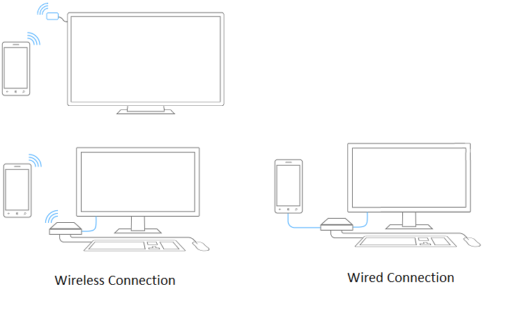
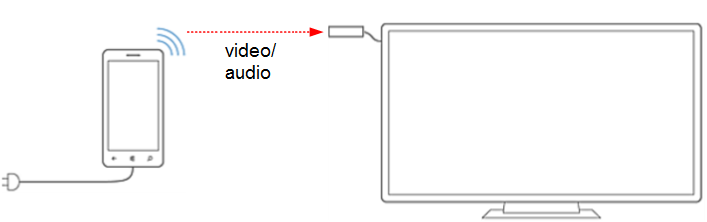
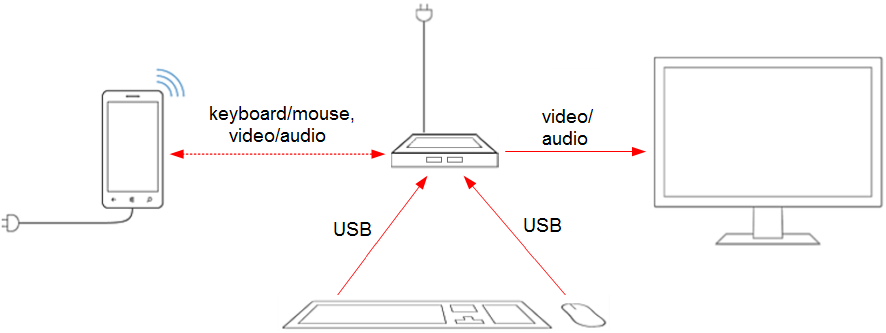
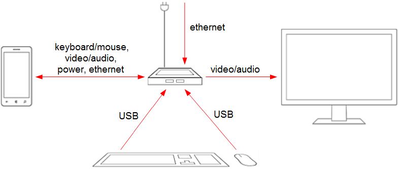

# Continuum

## Overview

Continuum is a new experience on compatible Windows 10 Mobile devices . With Continuum-compatible accessories\*, you can connect to a monitor and even to a mouse and keyboard to make your phone work like a laptop for getting things done. And whether you’re projecting Office apps for productivity or videos and games for entertainment, you can still use your phone for all the calls, texts, tweets, and things you do on your phone.\*\*

\*Accessories sold separately.

\*\*App availability and experience may vary by market. An Office 365 subscription may be required for some functionality.

Continuum takes full advantage of the Universal Windows app framework by allowing apps to optimize their appearance based on which display (such as the phone screen, monitor, big screen television or conference room projector) they are opened on.

This specification provides hardware requirements to support this feature. Microsoft will build and test Continuum features against these requirements.

## How it works?

When you dock (wired or wireless) your mobile device (phone/tablet) to an external display such as a monitor, television or projector, Windows 10 Mobile launches a separate tailored experience on the external display while maintaining the expected experience on your phone/tablet. Additionally, a mouse or a keyboard may be used with the external display similar to how they would with a PC.

The phone/tablet and monitor are managed as separate independent displays; a cursor or application windows cannot be dragged between and the desktop cannot be extended across them. An application can be launched on either monitor, and applications can choose to have a companion experience on the internal screen when the app is running on the extended screen. When a keyboard and mouse are paired to the phone/tablet their input is targeted only to the external screen. If a keyboard and mouse is not connected, your phone can be used to provide input to the external screen.

In the desktop environment, you have

-   Traditional desktop experience with Start Menu
-   Windows 10 apps scale to the external screen
-   Full keyboard and mouse support

In the mobile environment, you have

-   Full mobile functionality including communication and apps
-   Windows 10 apps scale to phone screen size

### Hardware Configuration

Continuum supports both wired and wireless configurations. This section includes some examples of hardware configurations that we believe could be built to support the Continuum feature; actual implementation and design is up to the OEM and/or hardware vendor.

### Wireless Dongle

Figure 1 shows a Miracast dongle in a media consumption configuration. The phone casts to a TV via Miracast. Bluetooth keyboard and mouse can be used to control the application on the external screen. Dongles that support the Miracast extensions included in Windows 10 will provide the best experience; Miracast dongles which do not support these extensions will provide a lesser experience due to increased latency and connection issues.

**Figure 1: Miracast-only dongle in productivity application configuration**

### Wireless Dock

Figure 2 shows a wireless dock configuration. The wireless dock is built around the same components as the wireless dongle with additional connections for USB keyboard and mouse. The wireless connection from the phone/tablet to the dock carries audio and video via Miracast. Dongles that support the Miracast extensions included in Windows 10 will provide the best experience; Miracast dongles that do not support these extensions will provide a lesser experience due to increased latency and connection issues. A Bluetooth keyboard and mouse can be used in this configuration, or a USB keyboard and mouse can be connected to the dock and its input routed back to the phone via the Miracast User Input Back Channel (UIBC) feature included in the Windows 10 Miracast extensions. UIBC keyboard and mouse requires that the dock support the Windows 10 Miracast extensions.

**Figure 2: Wireless dock configuration**

### Wired Dock

Figure 3 shows a wired dock configuration. The wired connection from the phone to the dock carries audio, video, USB, and power. A display cable connects the dock to the monitor. A keyboard and mouse can be connected to the dock either wired or wireless. This configuration will result in an improved dock experience due to the bandwidth provided by the wired connection. USB Type C is recommended, although not required, for a user-friendly and high quality single cable experience.

**Figure 3: Wired dock configuration**

## Hardware Requirements

This section defines the hardware requirements needed to support Continuum.

###  Continuum for phone and tablet requirements

A Continuum supported phone must meet all requirements stated in the [Windows 10 Minimum Hardware Requirements](https://msdn.microsoft.com/library/windows/hardware/dn915086.aspx). Additional requirements to support Continuum are shown in Table 1.

**Table 1: Continuum requirements**

|Component             |Minimum Requirements                                                                |Premium Recommendations                                                                        |
|----------------------|------------------------------------------------------------------------------------|-----------------------------------------------------------------------------------------------|
|Applications processor|Qualcomm MS8952, MS8992, MS8994                                                     |Dual SIM support                                                                               |
|RAM\*                 |2 GB RAM for phones with display resolution of 720p                                 |3 GB RAM for phones with display resolution of 1080p or more                                   |
|Flash storage         |16 GB nonremovable flash memory                                                     |                                                                                               |
|microSD               |Optional                                                                            |microSD card support                                                                           |
|Bluetooth             |Bluetooth 4.0 support is required                                                   |                                                                                               |
|Wi-Fi                 |Supports at least 802.11n dual band                                                 |802.11ac dual band recommended. 2x2 antenna recommended.                                       |
|Miracast              |Supports Windows 10 Miracast extensions.                                            |                                                                                               |
|USB                   |USB dual-role required to support wired dock configuration. USB 2.0 support required|USB 3.0 recommended. USB Type C connector strongly recommended to support wired configurations.|

\*Adding custom features to the phone, such as a high-end camera, may require adding additional RAM. Careful estimation of memory requirements for extra features is essential.

### Continuum wireless dongle requirements

A wireless dongle must meet the following requirements.

**Table 2: Continuum wireless dongle requirements**

| Component           | Minimum Requirements                             | Premium Requirements                                                                 |
|---------------------|--------------------------------------------------|--------------------------------------------------------------------------------------|
| Wi-Fi               | Supports at least 802.11n.                       | 802.11ac dual band recommended.                                                      |
| Miracast            | Required. See "Additional Requirements" section. | Miracast UIBC (HID Commands mode) is recommended to enable keyboard and mouse input. |
| USB                 | USB and AC adaptor recommended to power device.  |                                                                                      |
| Audio/video latency | ≤80 msec\*                                       |                                                                                      |
| Display resolution  | Minimum 720P @60 fps, 1080P @ 30fps              |                                                                                      |
| Display connector   | HDMI 1.4                                         |                                                                                      |

\*Not possible with current Miracast receivers.

### Continuum wireless dock requirements

The wireless dock must meet the following requirements.

**Table 3: Continuum wireless dock requirements**

| Component               | Minimum Requirement                                                                                                                                                                 | Premium Requirements                                                       |
|-------------------------|-------------------------------------------------------------------------------------------------------------------------------------------------------------------------------------|----------------------------------------------------------------------------|
| Wi-Fi                   | Supports at least 802.11n. Wi-Fi Direct Services (WFDS) required.                                                                                                                   | 802.11ac dual band recommended                                             |
| Miracast                | Supports Windows 10 Miracast extensions. Miracast UIBC (HID Commands mode) is required to enable keyboard and mouse input if the dock does not support WSB/USB-MA.                  |                                                                            |
| USB\*                    | Minimum 2 USB A sockets for keyboard, and mouse, a third if USB peripherals are supported via WSB/USB-MA. USB 2.0 support required. USB and AC adaptor recommended to power device. | 3.0 recommended.                                                           |
| Audio/video latency     | ≤80 msec                                                                                                                                                                            |                                                                            |
| Display resolution      | 720p minimum                                                                                                                                                                        |                                                                            |
| Display connector       | HDMI 1.4 required.                                                                                                                                                                  | DisplayPort 1.2 recommended. VGA support via adapter strongly recommended. |
| Wireless phone charging | Recommended                                                                                                                                                                         |                                                                            |

 

\*USB peripheral support is limited on the Windows 10 Mobile.

### Continuum wired dock requirements

A Continuum wired dock must meet the following requirements.

**Table 4: Continuum wired dock requirements**

| Component           | Minimum Requirement                                                                                                        | Premium Requirements                                                                                                                                                        |
|---------------------|----------------------------------------------------------------------------------------------------------------------------|-----------------------------------------------------------------------------------------------------------------------------------------------------------------------------|
| USB\*               | Minimum 3 USB A sockets for HID and USB storage. USB 2.0 support required. USB and AC adaptor recommended to power device. | 3.0 recommended; USB Type C connector strongly recommended for connection to phone; if micro USB is used then phone and dock may require additional components for USB A/V. |
| Audio/video latency | ≤40 msec                                                                                                                   |                                                                                                                                                                             |
| Display resolution  | 720p minimum                                                                                                               |                                                                                                                                                                             |
| Display connector   | HDMI 1.4 required.                                                                                                         | DisplayPort 1.2 recommended. VGA support via adapter strongly recommended.                                                                                                  |

 

\*USB peripheral support is limited on the Windows 10 Mobile.

## Additional Requirements

### Windows 10 Miracast extensions

Miracast receivers which support the Miracast extensions included in Windows 10 will provide the best experience; Miracast receivers which do not support these extensions will provide a lesser experience due to increased latency and connection issues. Partners must upgrade their existing Miracast devices to support the new extensions.

In addition to these Miracast improvements, support for the Miracast user input back channel (UIBC) is being added to Windows 10. Miracast UIBC is an optional Wi-Fi Direct feature for sending input commands from the Miracast receiver to the Miracast sender for processing. This enables Miracast receivers which contain USB ports and implement UIBC to be used as wireless “docks;” the user connects keyboard and mouse to the receiver and they can connect wirelessly to a full-sized keyboard, mouse, and monitor setup. Note that to support standard Windows keys (e.g., the Windows key, Ctrl, Alt, etc.) UIBC must be implemented on the Miracast receiver in HID Commands mode, as the alternate Generic mode implementation only provides support for ASCII keys.

For more information on the requirements of drivers and hardware to support Miracast displays, refer to the [Building best-in-class Miracast solutions with Windows 10](http://download.microsoft.com/download/3/F/9/3F9F0453-04AE-4E4B-87EF-729FF931C1F9/Building best-in-class Miracast solutions with Windows 10.docx) guide and the relevant [WHCK documentation]( http://go.microsoft.com/fwlink/p/?linkid=258342) at **Device.Graphics.WDDM13.DisplayRender.WirelessDisplay**.

## FAQ/Troubleshooting

This FAQ is designed to answer common questions about both the usage model, as well as building a device.

###Devices and hardware

**What phones will support Continuum?**

Any Windows 10 Mobile-based device that meets the minimum hardware requirements defined in this document, and on which the OEM desires to enable the feature, will support Continuum.

**Why do current retail devices not support this?**

The Continuum feature is an innovation that is enabled by new chipsets; older chipsets do not have all of the requirements needed to support the feature

**Will this work with my TV?**

-   If your TV has an HDMI input, you can use a wired or wireless accessory to connect.
-   Most likely, yes. If your TV, or any display type such as your monitor, supports HDMI or DisplayPort input, you can use a wired or wireless Continuum compatible accessory to connect.

**What is the difference between wired and wireless? Why would I not just use wireless?**

-   Wireless brings all the convenience of being wireless while being productive at a desk or connecting to your TV and navigating from your couch, but it does require a few short steps to connect to a display and is subject to potential interference. Light productivity, navigating presentations in a conference room and enjoying entertainment apps from your living room work well with a wireless setup.
-   A wired dock is simple: Plug your phone or tablet in, and you are immediately connected to your peripherals. Also, you can connect a keyboard, mouse, or mass storage device to a USB port. Wired dock has the benefit of charging your device. With apps like Microsoft PowerPoint, Microsoft Word, Excel, and File Explorer on your device, you can sit down and start working right away. Being productive in home office, kitchen office, and dorm room scenarios might work best with a wired setup.

**Which Miracast receivers will work with Continuum?**

All Miracast receivers will work, but those that implement the Windows 10 Miracast firmware extensions will provide a much better experience, including low-latency keyboard/mouse and faster connection times. In addition, Continuum compatible accessories with a USB port that support the User Input Back Channel (UIBC) can be used to connect a USB wireless keyboard and mouse, instead of taking the few extra steps needed to connect via Bluetooth for greater convenience.

**What is the wireless protocol? Is it standard or proprietary?**

Miracast with extensions. A number of third parties are already implementing extensions.

**How fast does the connection come up?**

Miracast connections will come up fastest on receivers that implement the Miracast "Fast IP Address Assignment" extension. On these receivers, we are seeing connections made in less than five seconds.

**What USB peripherals can I use with Continuum?**

The Windows 10 Mobile OS supports USB keyboard, mouse, audio, and storage, as well as USB hubs.

**Can I use an external camera with my phone?**

Not at this time.

**How do I connect a mouse and keyboard?**

Keyboards and mice that support Bluetooth can be paired by Bluetooth to the phone. Also, USB mice and keyboards can be paired by a wired dock, or wireless dongle that supports UIBC.

**What is the expected battery life when using Continuum?**

While this feature will of course consume more power than driving a single screen running a single app, we have not yet completed the testing to quantify that. With a wired connection, or a wireless charging pad, the phone can charge while you use Continuum.

**Will I need HDMI, DisplayPort, or something else to connect?**

That depends on the type of connection supported by your phone manufacturer. Wireless connections to Miracast receivers commonly have an HDMI connection from the receiver to the TV. A wired connection (for example, from a wired dock) would likely have either an HDMI or DisplayPort connection from the dock to the TV or monitor.

**Will this work with ChromeCast?**

No. Wireless connectivity is through Miracast, which Chromecast does not support. For a good productivity experience, the Miracast receiver must also support the Windows 10 Miracast extensions.

**Will this work with an Airplay-enabled device?**

No. Airplay does not support the technology required for Continuum.

**Do you support trackpads in addition to mice?**

Yes, the feature supports trackpads as a pointer if implemented over USB. Full precision touchpad support, including gestures, is under consideration for a future release.

**Can Continuum work over a mobile high-definition link (MHL) connection?**

Yes. The feature will work over any functional video-out connection.

**Does Continuum replace mirroring?**

Yes, although you may choose in the settings to use simple display mirroring, if you wish.

**Does Continuum support 4K monitors or TVs?**

The maximum resolution is limited by the capabilities of the device and the receiver. If a display supports a native resolution that is greater than the supported resolution of the device/receiver combination, the OS will fall back to the next best supported resolution.

###Developer environment

**What does Continuum mean for developers?**

Continuum brings a whole new value to your apps. Phone users will be able to have small and large screen experiences, and you can tailor those experiences through your Universal Windows app.

**When and how will a developer environment become available?**

Because Universal Windows apps run across all Windows devices, the easiest thing to do is to test your Universal Windows app on the Windows desktop and resize the app window. If you have separate mobile and desktop views, write test code to swap views on desktop as view size changes.

###Availability

**When will Continuum be available?**

Continuum is a feature of Windows 10 Mobile, and it will be available with new devices shipping this year.

###Scaling/building apps optimized for Continuum

**What is the difference between the Cast API and the Projection Manager API?**

The Cast API allows an app to move a media element to the external screen. The Projection Manager API allows the developer to create completely customized views on each screen.

**On Surface Hub, they recommend controls placed on bottom – why is this different?**

The physics are different between holding a phone in your hand versus standing in front of a large screen. Surface Hub and Continuum have optimized their recommendations uniquely for each device type. For Continuum for Phone apps running on an external screen, we recommend placing the controls on top to align with traditional desktop.

**Are pen and touch input supported?**

Pen and touch input are not supported at this time on the external screen.

**Can I get video on the external screen?**

Yes.

**Can I get audio on the external screen?**

Yes. All audio except for communication audio (for example, cellular phone calls) can go to the external audio end point. This is similar to behavior on Windows Phone today with a Bluetooth speaker attached. In this scenario, communication audio stays on the phone.

**What applications support Continuum?**

Windows 10 apps that run on Windows 10 Mobile and Universal Windows apps can be launched on the external screen.

**Can I make or take a phone call from my big screen?**

Calls will appear only on the phone screen, which is the same location as their audio. There will be things you can do from the big screen and the small screen, but there might be a natural usability preference for one over the other.

**Can I send or receive SMS messages on the big screen?**

Yes.

**Where do incoming text, phone call, or email notifications show up?**

We have developed the functionality assuming that the potential that other people may also be viewing the larger screen. To retain privacy, text messages and toast notifications are sent only to the phone screen.

**Can you run the same application on both screens?**

Not at the same time. An app can be written to provide a two-screen experience using the Cast or Projection Manager APIs, however.

**Why do I, as a game developer, care about this?**

This feature opens up exciting possibilities for keyboard and mouse-enabled games to be run on the big screen in a "docked phone" configuration. Developers can also take advantage of ProjectionManager API, which provides a unique opportunity to create multi-screen experiences powered by a phone.

**Can my app take advantage of a video camera on the big screen?**

No.

###Comparisons

**How is this different from other solutions on the Chromecast/AirPlay?**

-   Continuum is about productivity and getting things done by enabling your phone to be used like a PC.

-   Unlike Chromecast and AirPlay, the solution is not limited to a browser experience and a set of supported apps; it is your phone’s Start screen, Windows 10 apps, and services on your phone all scaled nicely to whatever size of screen that you are connected to.

-   Continuum has easy transitions between screens. For example, if you start typing an email on a phone using the email app and connect to a large screen, you can keep working on the same exact email but with a keyboard, a mouse, and a large screen.

-   Developers do not have to create special apps uniquely for Continuum. Universal Windows apps work on Windows PCs, tablets, and phones, and they support Continuum experiences.

-   Windows 10 Mobile phones come with Outlook, Word, Excel and PowerPoint Universal Windows apps for world-class productivity.

-   When you connect to peripherals, a connection to a local Wi-Fi network is not required. Requiring it to connect to local Wi-Fi creates usability, connectivity and expense challenges in some environments (for example, in enterprises, universities, and hotels).

**How is it different from Chromebit?**

-   With Continuum, it is not another OS in the dock/dongle with a different set of apps and a different set of local data. With Continuum, it is about the same Universal Windows apps, services, and data, but with accessibility from multiple screens. This offers an easy and accessible transition from screen to screen.

-   It is easier for you to manage: Update the OS and apps on the phone, and all screens see the benefit. You do not need to update multiple devices and install apps on multiple devices.

-   The Continuum accessories are less complex and are targeting lower price points since they do not require a full OS to be run on them.

**Could someone just use our apps on a big screen by plugging in a laptop to a TV?**

Yes, but this scenario adds an entirely separate PC into the mix. With Continuum, you are able to use your most personal device (your phone) for many of the tasks in which you might use a notebook or another full PC.

###Other

**Will this feature negatively impact the PC business?**

Consumers ultimately will decide which device type works best for them. We feel Continuum dramatically boosts the productivity of the device that you always have with you – your phone, however PCs are very powerful and uniquely suited to do many tasks.

**Does this support Windows desktop applications?**

Not directly. Windows desktop applications do not run on Windows 10 Mobile. However, with cloud streaming services such as Azure Remote Desktop, an organization could easily bring classic code to this experience, and Windows desktop applications will look great on the larger screen.

**Is not supporting Windows desktop applications a huge weakness?**

Universal Windows apps bring powerful capabilities to developers, including the ability to run across all devices. We are confident that developers will enable a robust ecosystem of apps with Continuum. For core scenarios that people care about, Microsoft is shipping Universal Windows apps such as the Microsoft Edge browser, Microsoft Office, Microsoft Outlook Mail and Calendar, Photos, Maps, Music, Movies & TV, and more. Enterprises that depend on one or two critical lines of business Windows desktop applications can use them through hosted solutions such as Azure RemoteApp.

**Why do you not just support full Windows?**

Continuum was designed to bring some of the best features of a PC to your phone, while protecting the simplicity and speed expected of your most personal device.

**Will you support all apps?**

We wanted to ensure consumers had a great experience, so we focused on Universal Windows apps, which rescale beautifully from smaller to larger screens. We also feel that we will have the most common scenarios supported with our universal applications. That said, we are listening to consumer feedback to shape our roadmap for the types of apps that we will support on the roadmap.

**How will the performance be relative to a full blown PC? What are the drawbacks?**

We will address performance concerns based on consumer feedback, but we believe we are covering the main use cases via Microsoft Edge, Office, email, photos app and other 1st and 3rd party Universal Windows apps running on a mobile OS with performance levels needed to be productive and entertained.
 

 

 

