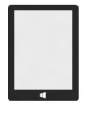
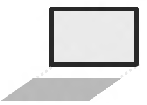
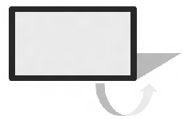
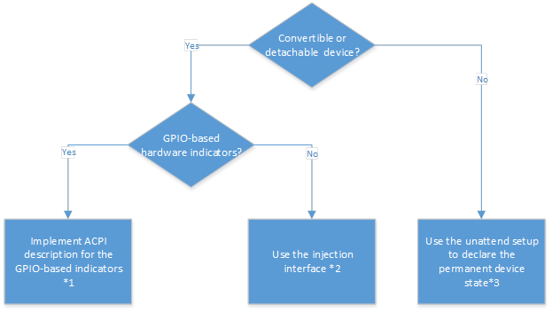
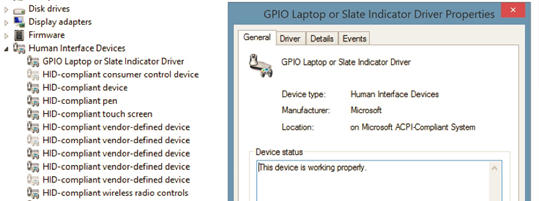
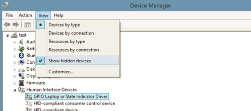
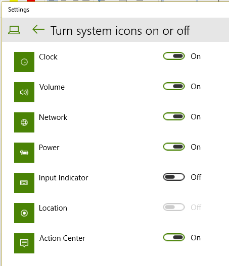
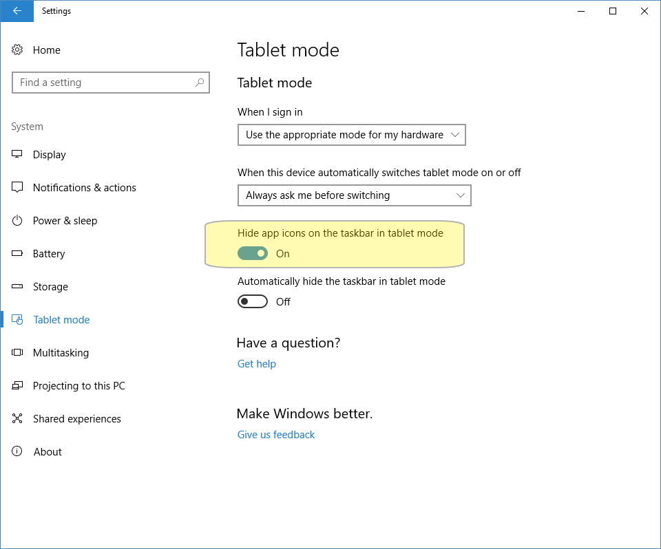

# Tablet mode


## Overview


Tablet mode is a new, adaptive user experience offered in Windows 10 that optimizes the look and behavior of apps and the Windows shell for the physical form factor and customer's usage preferences. This document describes how to implement tablet mode on 2-in-1 devices and tablets, specifically how to switch in and out of "tablet mode."

Tablet mode is a feature that switches your device experience from tablet mode to desktop mode and back. The primary way for a user to enter and exit "tablet mode” is manually through the Action Center. In addition, OEMs can report hardware transitions (for example, transformation of 2-in-1 device from clamshell to tablet and vice versa), enabling automatic switching between the two modes. However, a key promise of tablet mode is that the user remains in control of their experience at all times, so these hardware transitions are surfaced through a toast prompt that must be confirmed by the user. Users also have the option to set the default response.

**Target Devices**

|                                                                                |                                                                |                                                              |
|--------------------------------------------------------------------------------|----------------------------------------------------------------|--------------------------------------------------------------|
|                                          |                 |             |
| **Tablets**                                                                    | **Detachables**                                                | **Convertibles**                                             |
| Pure tablets and devices that can dock to external monitor + keyboard + mouse. | Tablet-like devices with custom designed detachable keyboards. | Laptop-like devices with keyboards that fold or swivel away. |

 

When the device switches to tablet mode, the following occur:

-   Start resizes across the entire screen, providing an immersive experience.
-   The title bars of Store apps auto-hide to remove unnecessary chrome and let content shine through.
-   Store apps and Win32 apps can optimize their layout to be touch-first when in tablet mode.
-   The user can close apps, even Win32 apps, by swiping down from the top edge.
-   The user can snap up to two apps side-by-side, including Win32 apps, and easily resize them simultaneously with their finger.
-   Apps can auto-launch side-by-side to create multitasking layouts without much user effort.
-   The taskbar transforms into a navigation and status bar that’s more appropriate for tablets.
-   The touch keyboard can be auto-invoked.

Of course, even in “tablet mode”, users can enjoy Windows 10 features such as Snap Assist, Task View and Action Center. On touch-enabled devices, customers have access to touch-friendly invocations for those features: they can swipe in from the left edge to bring up Task View, or swipe in from the right edge to bring up Action Center.

Tablet mode gives customers the flexibility to use their device in a way that is most comfortable for them. For example, a customer might want to use their 8” tablet in “tablet mode” exclusively until they dock it to an external monitor, mouse, and keyboard. At that point the customer will exit “tablet mode” and use all their apps as traditional windows on the desktop—the same way they have in previous versions of Windows. Similarly, a user of a convertible 2-in-1 device might want enter and exit “tablet mode” as they use their device throughout the day (for example, commuting on a bus, sitting at a desk in their office), using signals from the hardware to suggest appropriate transition moments.

## Designing your device for tablet mode


If you are designing a 2-in-1 device that is a convertible or detachable, we recommend you go through the following flow chart when designing your product. This will ensure you have the right implementation in place to allow the tablet mode prompt to show when the device’s state changes. Each of the boxes in the flow chart contain an implementation option.



### Method 1 - Implement ACPI description for the GPIO-based indicators

If your system is a 2-in-1 device that uses physical GPIOs to indicate state transitions, you can describe the state transition indicator in ACPI and Windows will automatically forward the GPIO interrupts fired by that indicator up to the operating system.

For more information, review the following resources on MSDN.

-   [Indicator implementation](https://msdn.microsoft.com/library/windows/hardware/dn457884) (https://msdn.microsoft.com/library/windows/hardware/dn457884.aspx)
-   [ACPI descriptor samples](https://msdn.microsoft.com/library/windows/hardware/dn457868) (https://msdn.microsoft.com/library/windows/hardware/dn457868.aspx)

### <a href="" id="method-2----use-the-injection-interface"></a>Method 2 - Use the injection interface

If your system is a 2-in-1 device that does not use physical GPIOs to indicate state transitions, then you must develop either a user or kernel mode driver that injects the state transition indication into Microsoft’s “GPIO Laptop and Slate indicator driver”.

The injection interface to the “GPIO Laptop and Slate indicator driver” is defined as the following:

`/* 317fc439-3f77-41c8-b09e-08ad63272aa3 */ DEFINE_GUID(GUID_GPIOBUTTONS_LAPTOPSLATE_INTERFACE, 0x317fc439, 0x3f77, 0x41c8, 0xb0, 0x9e, 0x08, 0xad, 0x63, 0x27, 0x2a, 0xa3);`

Calling WriteFile against the interface allows you to toggle the state of the indicator. A code sample for how a driver would use the injection interface can be found on the MSDN page here: https://msdn.microsoft.com/library/windows/hardware/dn457889.aspx

If you are creating a driver that uses the injection interface, you will still need to declare the ACPI description for the laptop/slate mode indicator to ensure Microsoft’s “GPIO Laptop and Slate indicator driver” loads. However, you will not need to add a GPIO resource to the ACPI declaration for the “laptop and slate indicator”.

**Note**  When the device boots, the “GPIO Laptop and Slate indicator driver” first initializes in “slate” mode. Thus, it’s important for your injection driver to check the operating system state to ensure that it is in sync with the system’s actual state immediately after the device boots.

 

Your SOC IHV partner may already offer a driver or other solution that injects the state transition into Microsoft’s inbox driver. If that’s the case, you can save time and effort by leveraging your IHV’s solution according to their particular guidelines.

### Method 3 - Use unattend setting to declare the permanent device state

If your device is not a 2-in-1 device, for example a regular laptop or desktop, you can disable prompting using the [ConvertibleSlateModePromptPreference](https://msdn.microsoft.com/windows/hardware/commercialize/customize/desktop/unattend/microsoft-windows-shell-convertibleslatemodepromptpreference) setting in your answer file. Set the value to 0 and the prompt will not show up and the UI will not switch. If no value is specified, the default value is 1, where the system will be prompted to switch modes.

**Note**  It is also recommended that you specify the type of form factor you are building using the [DeviceForm](https://msdn.microsoft.com/windows/hardware/commercialize/customize/desktop/unattend/microsoft-windows-deployment-deviceform) setting in your answer file.

 

## Test your device


### Verify your device implements ConvertibleSlateMode

If you are unsure if your device correctly implements [ConvertibleSlateMode](https://msdn.microsoft.com/windows/hardware/commercialize/customize/desktop/unattend/microsoft-windows-gpiobuttons-convertibleslatemode), check if the “GPIO Laptop or Slate Indicator Driver” exists in the Device Manager.



Make sure to enable the “Show hidden devices” from the Device Manager to confirm the presence of this driver:



There are two main ways to enter/exit “tablet mode”:

-   **Manually** - The user can enter/exit “tablet mode” manually by pressing the “tablet mode” button located in Action Center.
-   **Hardware action triggered** - The OS can ask the user if they would like to enter/exit “tablet mode” if the hardware has indicated the form factor has changed through [ConvertibleSlateMode](https://msdn.microsoft.com/windows/hardware/commercialize/customize/desktop/unattend/microsoft-windows-gpiobuttons-convertibleslatemode).

Using the presence of a Bluetooth keyboard as a tablet mode trigger is not supported. The primary issue with using Bluetooth as a trigger is that the Bluetooth events correlate to device pairing and proximity and those events do not reliably signal whether the keyboard is in use (for example, it may not even be near the customer) and thus do not reliably signal customer intent to enter or exit “tablet mode”.

If you are interested in making sure that a device that ships with a Bluetooth-enabled keyboard provides hardware-based hinting for the customer to change modes, we recommend implementing a sensor that would understand the current form factor and then signal to the OS through ConvertibleSlateMode.

Because the Windows prompt to enter/exit “tablet mode” is dependent on the implementation of ConvertibleSlateMode, it is important to ensure the firmware that toggles ConvertibleSlateMode is tested thoroughly. ConvertibleSlateMode implementations of lower quality can lead to a poor end user experience, such as asking the user to “enter ‘tablet mode’” multiple times.

In addition, when a 2-in-1 device changes from clamshell to tablet, the keyboard and touchpad can receive accidental presses from the user holding the tablet. Windows does not support ignoring input from the built-in keyboard and touchpad when a convertible changes into a tablet. We expect that device manufacturers do work in their hardware or software to avoid unintentional input during the form factor change, and test it thoroughly. The following table shows a few of the common errors that can occur, along with use cases that could cause them. These use cases should be tested to prevent the user from having a poor switching experience:

<table>
<colgroup>
<col width="50%" />
<col width="50%" />
</colgroup>
<thead>
<tr class="header">
<th>Error</th>
<th>Use cases that can cause the error</th>
</tr>
</thead>
<tbody>
<tr class="even">
<td>ConvertibleSlateMode switches even though there is no customer-observable reason (for example, a false firing).</td>
<td><ul>
<li>Mechanical/electrical issues</li>
<li>Technical reasons causing the switch to occur (for example, having to power down a component early as the system goes to sleep, causing a spurious transition)</li>
</ul></td>
</tr>
<tr class="odd">
<td>ConvertibleSlateMode thinks that the system is currently a slate form factor, when it’s actually a laptop form factor (or vice versa).</td>
<td><ul>
<li>Changing the device’s form factor while the device is in a power state transition (for example, powering up/down, going to sleep, etc).</li>
<li>Changing the system’s form factor very slowly</li>
<li>Changing the system’s form factor very quickly</li>
</ul></td>
</tr>
<tr class="even">
<td>ConvertibleSlateMode switches multiple times in rapid succession, causing the OS to repeatedly prompt the user to enter/exit “tablet mode”.</td>
<td><ul>
<li>Changing the system’s form factor very slowly</li>
<li>Changing the system’s form factor very quickly</li>
</ul></td>
</tr>
</tbody>
</table>

 

## Unattend Settings


The following unattend settings are useful if you are designing for a tablet mode-capable device:

<table>
<colgroup>
<col width="33%" />
<col width="33%" />
<col width="33%" />
</colgroup>
<thead>
<tr class="header">
<th>Unattend Setting</th>
<th>Description</th>
<th>Value</th>
</tr>
</thead>
<tbody>
<tr class="odd">
<td><p>[ConvertibleSlateMode](https://msdn.microsoft.com/windows/hardware/commercialize/customize/desktop/unattend/microsoft-windows-gpiobuttons-convertibleslatemode)</p></td>
<td><p>With the [ConvertibleSlateMode](https://msdn.microsoft.com/windows/hardware/commercialize/customize/desktop/unattend/microsoft-windows-gpiobuttons-convertibleslatemode) setting, you specify the physical ability of the device, which impacts physical behaviors of the device (such as rotation and onscreen keyboard), and you help define the appropriate first use experience that will be presented to an end user. If you specify laptop mode, an end user can type on a physical keyboard. If you specify tablet mode, an end user cannot type on a physical keyboard, because the keyboard is removed or the keyboard is flipped back so that it is inaccessible.</p></td>
<td><ul>
<li><p>0 – Tablet, convertible, or detachable (default)</p></li>
<li><p>1 – Laptop</p></li>
</ul></td>
</tr>
<tr class="even">
<td><p>[ConvertibleSlateModePromptPreference](https://msdn.microsoft.com/windows/hardware/commercialize/customize/desktop/unattend/microsoft-windows-shell-convertibleslatemodepromptpreference)</p></td>
<td><p>With the [ConvertibleSlateModePromptPreference](https://msdn.microsoft.com/windows/hardware/commercialize/customize/desktop/unattend/microsoft-windows-shell-convertibleslatemodepromptpreference) setting, you can specify whether to prompt the user to enter or exit tablet mode. The device form factor or product design will influence whether you choose to show the prompt. If you choose to hide the prompt, the mode is not switched. (That is, if tablet mode is on, it stays on, and if tablet mode is off, it stays off.) If you want the prompt to appear when the hardware event occurs, you need to implement a hardware or software solution to toggle this setting.</p></td>
<td><ul>
<li><p>0 – Disabled; the prompt does not appear, and the UI does not switch modes</p></li>
<li><p>1 – Enabled (default); the prompt appears, and the UI switches modes if the user consents</p></li>
</ul></td>
</tr>
<tr class="odd">
<td><p>[SignInMode](https://msdn.microsoft.com/windows/hardware/commercialize/customize/desktop/unattend/microsoft-windows-shell-signinmode)</p></td>
<td><p>You use the [SignInMode](https://msdn.microsoft.com/windows/hardware/commercialize/customize/desktop/unattend/microsoft-windows-shell-signinmode) setting to specify whether to set the display to tablet mode or to desktop mode after a user logs on. If you do not explicitly set this value, the default is tablet if the screen size is less than 10 inches and your preferred power management profile (power platform role) is slate (that is, a tablet form factor). Otherwise, the default is the last setting used. If there is no previous setting, the last setting used is considered to be desktop.</p></td>
<td><ul>
<li><p>0 – Tablet (default if the screen size is less than 10 inches and the power platform role is slate)</p></li>
<li><p>1 – Desktop</p></li>
<li><p>2 – Last setting used (default if the tablet default requirements are not met); if there is no actual last setting, desktop is considered the last setting</p></li>
</ul></td>
</tr>
<tr class="even">
<td><p>[DeviceForm](https://msdn.microsoft.com/windows/hardware/commercialize/customize/desktop/unattend/microsoft-windows-deployment-deviceform)</p></td>
<td><p>You specify the [DeviceForm](https://msdn.microsoft.com/windows/hardware/commercialize/customize/desktop/unattend/microsoft-windows-deployment-deviceform) setting so that a variety of apps (for example, Bing and Cortana) can determine the correct content for the specified device form factor. You also use this setting for features such as retail demo mode to specify the most suitable demo content for the device type.</p></td>
<td><p>There are 30 possible values. The primary values are listed below:</p>
<ul>
<li><p>0 – Unknown (default)</p></li>
<li><p>2 – Tablet</p></li>
<li><p>4 – Laptop</p></li>
<li><p>5 – Convertible</p></li>
<li><p>6 – Detachable</p></li>
</ul></td>
</tr>
</tbody>
</table>

 

## Behavior of "tablet mode"


To achieve a great tablet experience in Windows, the following desktop aspects of the taskbar are optimized for tablet mode:

-   **Showing running apps** - this suggests to people that they need to manage their running apps' life cycle.
-   **Several entry points to the Desktop** - a tablet user does not need easy access to the desktop in "tablet mode."
-   **A dense layout in the taskbar** - this can fit more items but in "tablet mode," touch is likely the primary input, and requires a less dense layout.
-   **Showing Deskbands and Win32 notification icons at the top level and the overflow level** - the majority of these are not intentionally placed there by the user and are not commonly used.


### Rotation lock


Rotation lock is set to enabled (or locked) by default. Unless OEMs set the rotation lock to unlocked, customers unboxing new tablets might be frustrated by OOBE not rotating to landscape or portrait according to how they hold their new devices. By disabling rotation lock, OEMs can make sure customers are delighted with the responsiveness of their new devices, even before they explore the ease of managing the rotation lock setting in the Quick Actions area of the Action Center.

To set rotation lock to disabled and enable rotation by default:

1. In Audit mode, set **HKLM\Software\Microsoft\Windows\CurrentVersion\AutoRotation\Enable** to 1, where 1 means rotation is enabled.
2. Use Sysprep to prepare the machine for the customer as you would normally.


### Notification area icons


When entering tablet mode, the notification area will go through several changes. The following icons will be shown:

-   Battery
-   Network 
-   Volume
-   Action Center

More specifically, if the user has demoted any of these four icons into the overflow, it will be brought back to the top level, or if the OEM has demoted the battery icon into the overflow, it will be brought back to the top level.

However, if the customer has disabled one of these in Settings under **Turn system icons on or off** (shown below), Windows will follow the customer's manual setting and not enable the icon.



OEM-pinned notification icons will be hidden, user-pinned notification icons will be hidden, and the overflow chevron will be hidden, effectively hiding the overflow window.

Auto-promotion of notification icons to the top level will be blocked, but apps should continue to be able to fire a toast notification, even if the icon cannot come to the top level. The one exception to this is the location services icon. When it is enabled under **Turn system icons on or off**, it  will be able to promote itself to the top level, to the left of the battery icon. However, if the user has manually chosen to disable the location services icon using the **Turn system icons on or off** setting, Windows will not force the icon to promote.

If customers select the **Always show all icons in the notification area** setting, the above behavior will turn off, and the notification area will revert to the same contents and behavior as if tablet mode were not being used.


### Touch keyboard button


When entering tablet mode, the Touch Keyboard button will be hidden. Its visibility can be controlled via the **Show touch keyboard button** setting in the tablet mode taskbar context menu.


### App icons


By default, app icons will be hidden on the taskbar in Tablet Mode. This is controlled by the **Hide app icons on the taskbar in tablet mode** setting:




### Creating an app that interacts with tablet mode APIs


You can take advantage of tablet mode by using Universal Windows Platform (UWP) and Classic Windows APIs in your apps. Using these APIs, you can tailor the user experience of your app to be touch-first for tablet mode or mouse-first for desktop usage. This section describes how to use both the UWP and Classic Windows APIs in your applications to detect and react to tablet mode.

The APIs allows both Windows desktop applications and Universal Windows apps to query for the current interaction mode and respond to changes to the mode, as described here.

**Classic Windows apps APIs**

|                                                                         |                                                                                                                                                                                 |
|-------------------------------------------------------------------------|---------------------------------------------------------------------------------------------------------------------------------------------------------------------------------|
| [**UIViewSettings**](https://msdn.microsoft.com/library/windows/hardware/dn708109)                          | Allows apps to query the current pointer device preference state of the system for a particular application. It is a non-activatable class that you get from GetForCurrentView. |
| [**UserInteractionMode**](https://msdn.microsoft.com/library/windows/hardware/dn708109_userinteractionmode) | Property of GetForWindow that takes a value in the Windows.UI.ViewManagement.UserInteractionMode enum, the allowed values of which are Touch and Mouse.                         |
| WM\_SETTINGSCHANGE                                                      | Apps are notified when the current input state changes by broadcasting WM\_SETTINGSCHANGE with “UserInteractionMode”.                                                           |

 

**Universal Windows apps APIs**

|                                                                         |                                                                                                                                                                                 |
|-------------------------------------------------------------------------|---------------------------------------------------------------------------------------------------------------------------------------------------------------------------------|
| [**UIViewSettings**](https://msdn.microsoft.com/library/windows/hardware/dn708109)                          | Allows apps to query the current pointer device preference state of the system for a particular application. It is a non-activatable class that you get from GetForCurrentView. |
| [**UserInteractionMode**](https://msdn.microsoft.com/library/windows/hardware/dn708109_userinteractionmode) | Property of UIViewSettings that takes a value in the Windows.UI.ViewManagement.UserInteractionMode enum, the allowed values of which are Touch and Mouse.                       |
| SizeChanged                                                             | Event is triggered when the current input state changes. Apps should query for this event.                                                                                      |

 

**Example 1: Optimize layout on app launch**

When an app launches it can query for the current state of the system and optimize its layout for the current interaction mode, as in the following example.

*Universal Windows App (C#) Sample*

``` syntax
using Windows.UI.Xaml;
using Windows.UI.ViewManagement;
 
    public sealed partial class MainPage : Page
    {
        public MainPage()
        {
            InitializeComponent();
            // Every view gets an initial SizeChanged, so we will do all our 
            // work there. This means that our view also responds to dynamic
            // changes in user interaction mode.
            Window.Current.SizeChanged += SizeChanged;
        }
 
        private void SizeChanged(object sender, RoutedEventArgs e)
        {
            switch(UIViewSettings.GetForCurrentView().UserInteractionMode)
            {
                case UserInteractionMode.Mouse:
                    VisualStateManager.GoToState(this, "MouseLayout", true);
                    break;
 
                case UserInteractionMode.Touch:
                default:
                    VisualStateManager.GoToState(this, "TouchLayout", true);
                    break;
            }
        }
     }
```

*Classic Windows App (C++) Sample*

``` syntax
using namespace Microsoft::WRL::Wrappers;
using namespace Microsoft::WRL;
HRESULT OnLayout()
{
    ComPtr<IUIViewSettingsInterop> uiViewSettingsInterop;
    HRESULT hr = GetActivationFactory(
        HStringReference(RuntimeClass_Windows_UI_ViewManagement_UIViewSettings).Get(), 
        &uiViewSettingsInterop);
    if (SUCCEEDED(hr))
    {
        ComPtr<IUIViewSettings> uiViewSettings; 
        hr = uiViewSettingsInterop->GetForWindow(hwndApp, IID_PPV_ARGS(&uiViewSettings)); 
        if (SUCCEEDED(hr))
        {
            Windows::UI::ViewManagement::UserInteractionMode mode;
            hr = uiViewSettings->get_UserInteractionMode(&mode);
            if (SUCCEEDED(hr))
            {
                switch (mode)
                {
                case UserInteractionMode_Mouse:
                    hr = LayoutForMouse(); 
                    break;
 
                case UserInteractionMode_Touch:
                default:
                    hr = LayoutForTouch();
                    break;
                }
            }
        }
    }
    return hr;
}
```

**Example 2: React to tablet mode entry/exit**

When your device enters or exits tablet mode, the shell prompts the user to switch modes. You can use this as a trigger to optimize your app for the current interaction mode. You must query for the current state of the system, as in the following examples.

*Universal Windows App (C#) Sample*

Same as Example 1.

*Classic Windows App (C++) Sample*

``` syntax
// WM_SETTINGCHANGE handler
void OnSettingsChange(LPARAM lParam)
{
    if (lParam != 0)
    {
        PCWSTR message = reinterpret_cast<PCWSTR>(lParam);
        if (CSTR_EQUAL == CompareStringOrdinal(message, -1,                                                                                                                                                  L“UserInteractionMode”, -1, TRUE))
        {
             OnLayout();
        }
    }
}
```

## Frequently Asked Questions (FAQ)


| \#  | **Question**                                                                                                                                                                                                                      | **Answer**                                                                                                                                                                                                                                                                                                                                   |
|-----|-----------------------------------------------------------------------------------------------------------------------------------------------------------------------------------------------------------------------------------|----------------------------------------------------------------------------------------------------------------------------------------------------------------------------------------------------------------------------------------------------------------------------------------------------------------------------------------------|
| 1   | Will any of the file association change when the device is in “tablet mode”?                                                                                                                                                      | No, Windows will not change any file associations as all apps are supported in “tablet mode”.                                                                                                                                                                                                                                                |
| 2   | Will the auto prompt to enter/exit “tablet mode” take place upon the insertion of an external USB keyboard?                                                                                                                       | No, the auto prompt will be triggered through the toggling of the ConvertibleSlateMode value, not the presence of any kind of keyboard.                                                                                                                                                                                                      |
| 3   | What triggers the "GPIO Laptop or Slate Indicator driver" to show up in Device Manager?                                                                                                                                           | Defining PNP0C60 (laptop/slate mode state indicator) will trigger the driver to show in Device Manager. You must choose “Show the hidden device” option from Device Manager to show this driver.                                                                                                                                             |
| 4   | Can we use pure All-in-ones (AiO) with external keyboard and mouse to enable the same scenario?                                                                                                                                   | Yes, AiOs can take advantage of “tablet mode” by implementing ConvertibleSlateMode toggling at the appropriate transition point for the hardware.                                                                                                                                                                                            |
| 5   | Is touch keyboard auto disabled while “tablet mode” is disabled?                                                                                                                                                                  | The touch keyboard only auto-invokes while in “tablet mode”. During Desktop usage, the touch keyboard must be invoked manually. If a user is not in "tablet mode", but they remove their keyboard from the device, the touch keyboard will appear.                                                                                           |
| 6   | Will a Bluetooth keyboard be considered as a “dock”?                                                                                                                                                                              | No, a Bluetooth keyboard will not be considered a “dock” as that scenario may not always be true. Tablet mode never uses the presence of a keyboard (USB, Bluetooth, etc.) to trigger a prompt. You can implement a Bluetooth detachable design by toggling ConvertibleSlateMode at the appropriate time.                                    |
| 7   | Win32 apps: For a Win32 app to take advantage of tablet mode, does the app need to be compiled with Universal Windows Platform (UWP) APIs?                                                                                        | Win32 apps will have a Win32-specific API that they can consume to adapt between touch-first and mouse-first usage.                                                                                                                                                                                                                          |
| 8   | For an application developer, do we need to call any API to handle tablet and desktop mode switching? Or will Windows handle it automatically?                                                                                    | If you want to change the layout inside your application, you will need to use either a UWP API or a Win32 API to indicate “tablet mode”. The actual resizing of the application when entering/exiting “tablet mode” is automatically handled.                                                                                               |
| 9   | My system implements ConvertibleSlateMode but state transitions don’t result in a prompt asking me to enter/exit “tablet mode”.                                                                                                   | If your 2-in-1 device toggles ConvertibleSlateMode correctly, but the system does not prompt you to enter/exit “tablet mode” the feature may be turned off. To turn tablet mode on, go to **Settings\\System\\Tablet Mode**. From the dropdown list, select “When my device wants to switch modes” and select “Always prompt me to confirm.” |
| 10  | For tablets, do we need a Virtual Driver if GPIO is supported? If GPIO is available do we need any BIOS changes?                                                                                                                  | You have a choice of using the physical GPIO or the injection driver approach. As long as you are properly toggling ConvertibleSlateMode, no changes are necessary. Important: Windows 10 implementation of ConvertibleSlateMode is different from Windows 8.1. You must thoroughly test your device to ensure correct behavior.             |
| 11  | Is there requirements or changes to UEFI BIOS to support tablet mode?                                                                                                                                                             | There are no inherent changes to the UEFI BIOS required to support tablet mode. You are free to toggle ConvertibleSlateMode by whatever means work best for you.                                                                                                                                                                             |
| 12  | Is screen rotation tied to tablet mode?                                                                                                                                                                                           | No, screen rotation is not necessarily related to tablet mode. Screen rotation is tied to your current device configuration which may or may not map to whether the device is in “tablet mode”.                                                                                                                                              |
| 13  | What happens when the taskbar is located on the left side?                                                                                                                                                                        | The taskbar stays where it was positioned.                                                                                                                                                                                                                                                                                                   |
| 14  | Are there plans for enabling a scenario where the system would have tablet mode enabled or disabled automatically based on the laptop or slate mode reported by the system, without showing any confirmation to the end customer? | Not supported. We always want users to be in control and choose whether they want to switch the mode. Users can override this if they wish.                                                                                                                                                                                                  |
| 15  | Will the UI that asks to "Enter tablet mode" be changed? Do you plan on adding a checkbox to let the user decide to "perform this action every time"?                                                                             | Yes, it will change from the current design. It should include a “Yes/No” button and a dropdown list to let a user choose what to do next time (such as “Always prompt”, and more).                                                                                                                                                          |
| 16  | Can you show where the Global Back Button is in tablet mode?                                                                                                                                                                      | It is next to the Start button.                                                                                                                                                                                                                                                                                                              |
