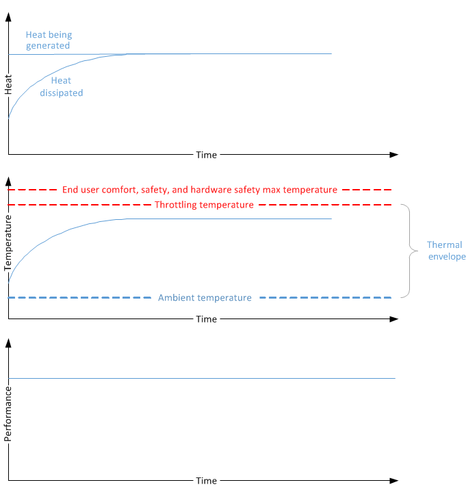
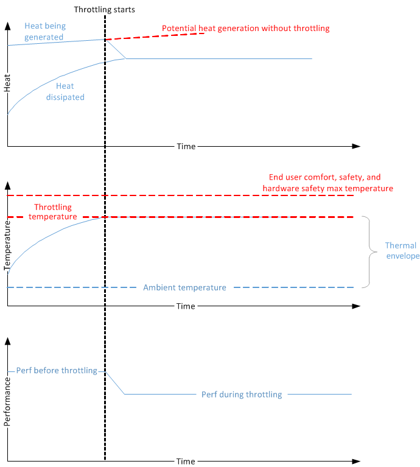
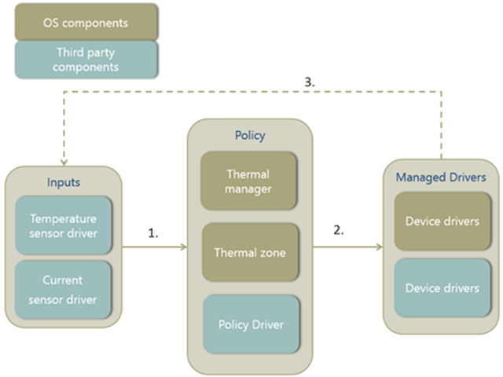
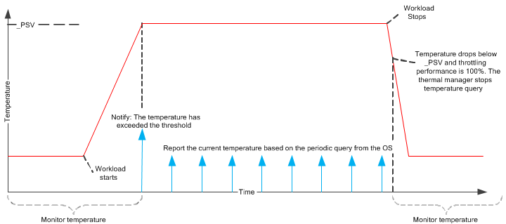
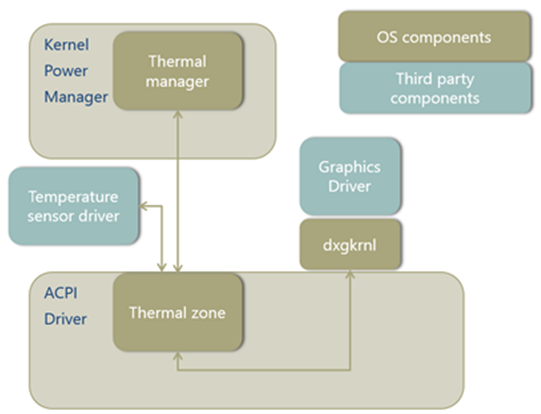
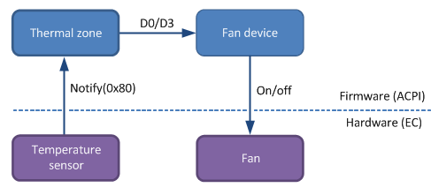
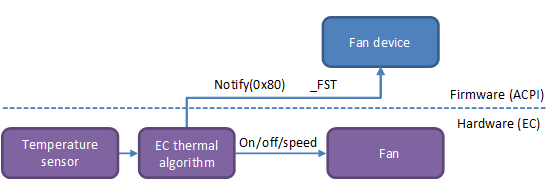
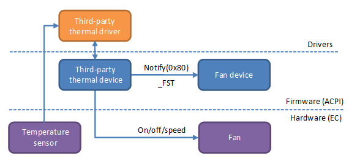

# Design Guide


This PC thermal management design guide provides information about how to determine the PC temperature values that are "too hot" and "too cold."

Making these determinations is a key requirement for a design that delivers a good PC user experience. And also, these thresholds help to choose the first mitigating action to take for PC components that reside in multiple thermal zones.

## Designing the temperature thresholds


**Variables and assumptions**

The following factors influence a PC's thermal behavior:

-   **Hardware design**

    The importance of good hardware design cannot be over-stressed. For more information, see [Hardware thermal modeling and evaluation](#hardware-thermal).

-   **Environment**

    These are external factors that contribute to the thermal behavior of the system. The software can only influence the environment by notifying the user that thermal constraints are an issue—for example, by displaying the thermal-failure-to-boot logo. The user must move to a different environment for these factors to change:

    -   **Sunlight radiation**

        The intensity and angle of the sunlight impacting the screen or any part of the system.

    -   **Ambient temperature**

        The temperature of the environment.

    -   **Airflow**

        With or without air circulation. Windy or in a computer case.

    -   **Humidity**

        Dry or humid.

-   **Workload and power consumption**

    The assumption here is that workload and power consumption are proportional to each other. In other words, the more work a PC or component does, the more power it consumes and the more heat it generates. Although this might not be true in all cases, this simplified model is more or less sufficient here. This is where software mitigations come in. By reducing the workload, less heat is generated and the PC keeps operating.

When designing and modeling the hardware, take into account the parameters mentioned in the preceding list. Please use worst-case values for the environment. The only parameter that can be directly controlled by software is the workload.

**Thermal fundamentals**

Consider a PC's thermal behavior when it is running a constant workload. As the workload starts, the PC's hardware components such as the CPU and GPU generate heat and increase the temperature. As the temperature increases relative to the ambient temperature, the PC starts to dissipate heat faster until eventually the heat generation is equal to the heat dissipation, and the temperature reaches steady state. For the entire duration of this constant workload, since there is no throttling involved, the performance and throughput are constant.

The following diagram shows the relationship between heat generation, temperature, and performance when no throttling is involved. Notice that the PC's temperature stays within the thermal envelope, as bounded by the ambient temperature and throttling temperature.



Now consider a PC's thermal behavior when it is running a different workload that is also constant but more resource intensive. As this workload executes, the heat generated is much higher than what the system is capable of dissipating to the ambient environment, and as a result the temperature rises steadily. Without passive cooling, the temperature will continue rise until eventually the system will become too hot and adversely impact end user comfort and safety. Hardware can be damaged as well at high temperatures. Thermal throttling helps ensures that the PC does not reach these high temperatures. When the temperature rises over a pre-defined throttling temperature trip point, the system starts throttling performance. As a result, the heat generation is reduced and gradually—after the heat generation and dissipation equalize—the system temperature reaches the steady state.

The following diagram shows the relationship between heat generation, temperature, and performance when performance is throttled to reduce heat generation.



In both cases shown in the preceding diagrams, the workloads must operate within a thermal envelope to ensure that the system temperature does not exceed safe limits. The envelope starts with the ambient temperature and ends with the throttling temperature. Also in both cases, the heat generation and dissipation eventually reach a balanced state, and the system temperature is stabilized.

### <a href="" id="thermal-envelope"></a>

**Defining a thermal envelope**

A well-designed PC should have as large of a thermal envelope as possible, providing users a long-lasting, mitigation-free experience. As shown in the preceding diagrams, the thermal envelope has a lower bound determined by the ambient temperature. It is bounded above by the throttling temperature. While the ambient temperature is not a variable that system designers can control, the upper bound can be pushed higher by good hardware design. For more information, see [Hardware thermal modeling and evaluation](#hardware-thermal). But even assuming that hardware is not the major limitation, other important factors must be considered when defining the thermal envelope.

The desired operating range should be as large as possible without encroaching on these limiting factors:

-   **Safety**

    Temperature of the system must first ensure that users do not suffer any injuries from using the system. This requirement applies mostly to the skin temperature sensor.

-   **Hardware protection**

    Temperature should prevent system components from "melting" or otherwise causing damage due to heat. This requirement applies mostly to component temperature sensors—for example, a sensor that sits on top of the processor.

-   **Government regulation**

    All systems should meet applicable industry standards (such as IEC 62368) for consumer electronics safety.

## <a href="" id="hardware-thermal"></a>Hardware thermal modeling and evaluation


**Software as complement to hardware design**

When designing hardware, it's of key importance to keep thermal management in mind. Selecting low-power parts, placing hot components far from one another, and incorporating thermal insulation are only a few examples of how hardware can greatly improve the thermal experience. These methods cannot be replaced in software. As such, the software solution only serves as a complement to the hardware design in the overall thermal experience.

*Hardware goal*

Typical workloads should not need any form of software thermal mitigation to run. The hardware thermal design should be able to disperse heat for these workloads by itself.

**Modeling**

Modeling is an iterative process to achieve the hardware goal previously described. In this process, do not factor in any software mitigations. Rely solely on the hardware capabilities and adjust as necessary.

1.  Define a typical workload. Depending on the platform of the system, from phone to server, each system should have a standard set of typical workloads. These should not be intense workloads such as HD video conferencing, but rather a more average workload like browsing the web or listening to music.

2.  Model system and individual component power consumption on typical workloads since heat will not be spread across the chassis uniformly. Pay particular attention to the components that consume most power, such as the processor.

3.  Based on the workload power consumption estimation, model the rise in component and skin temperature over time.

4.  Adjust the system's mechanical design to ensure that the component temperature is within the hardware safety limit and user comfort limit over all ambient temperatures. Some methods for addressing mechanical design issues are:

    1.  Improve the heat dissipation capability by adding better heat-conducting materials.
    2.  Increase the delta temperature between the skin and the internal temperature by adding isolation layers.

5.  Repeat steps 1 through 4 until satisfied.

6.  Build the hardware and evaluate.

**Evaluation**

For every hardware revision, a temperature and power measurement against representative workloads must be performed to evaluate the thermal behavior, and the mechanical design should be modified as needed.

The following steps are recommended to perform such thermal evaluation:

1.  Define a thermal measurement test matrix:

    1.  The matrix should cover both normal and maximum ambient temperature.
    2.  The matrix should include all typical workloads identified as part of the thermal modeling, and for every workload, data should be captured for at least one hour.
    3.  The matrix should be executed in multiple PCs multiple times to generate consistent results.

2.  For every workload defined in the test matrix, capture the following data:

    1.  System and component power consumption data.
    2.  Ambient, internal component, and skin temperature data.
    3.  Software traces to detect thermal throttling, performance metrics, and processor utilization.

The skin and component temperature data directly indicates the maximum skin temperature that the system might reach and whether this temperature is acceptable. Consider how much thermal headroom the system might have before critical shutdown. The performance metrics data will help determine whether the system is delivering the required performance. The trace data recorded by the thermal throttling software shows the thermal throttling percentage. The power consumption data and the CPU utilization data can help to determine what factors influence the temperature changes.

The following table provides an example of such data collection for a PC with the following configuration:

**Configuration**
-   Machine name: Thermal-Test-1
-   Average ambient temperature: 23<sup>o</sup>C
-   Thermal zone trip point (\_PSV): 80<sup>o</sup>C

<table style="width:100%;">
<colgroup>
<col width="14%" />
<col width="14%" />
<col width="14%" />
<col width="14%" />
<col width="14%" />
<col width="14%" />
<col width="14%" />
</colgroup>
<thead>
<tr class="header">
<th>Category</th>
<th>Subcategory</th>
<th>Video streaming</th>
<th>Casual gaming</th>
<th>Fishbowl</th>
<th>3D gaming</th>
<th>TDP</th>
</tr>
</thead>
<tbody>
<tr class="odd">
<td><strong>Workload setup</strong></td>
<td></td>
<td>Full-screen 720p H.264 video streaming through Wi-Fi</td>
<td><p>Game name</p>
<p>CPU utilization</p></td>
<td>Classic IE with 100 fish</td>
<td><p>Game name</p>
<p>CPU utilization</p></td>
<td>CPU and GPU 100%</td>
</tr>
<tr class="even">
<td><strong>Power consumption</strong></td>
<td>System power</td>
<td></td>
<td></td>
<td></td>
<td></td>
<td></td>
</tr>
<tr class="odd">
<td></td>
<td>SoC power</td>
<td></td>
<td></td>
<td></td>
<td></td>
<td></td>
</tr>
<tr class="even">
<td></td>
<td>Display power</td>
<td></td>
<td></td>
<td></td>
<td></td>
<td></td>
</tr>
<tr class="odd">
<td></td>
<td>Backlight power</td>
<td></td>
<td></td>
<td></td>
<td></td>
<td></td>
</tr>
<tr class="even">
<td><strong>Temperature</strong></td>
<td>Max SoC temperature</td>
<td></td>
<td></td>
<td></td>
<td></td>
<td></td>
</tr>
<tr class="odd">
<td></td>
<td>Max skin temperature</td>
<td></td>
<td></td>
<td></td>
<td></td>
<td></td>
</tr>
<tr class="even">
<td><strong>Performance metrics</strong></td>
<td></td>
<td>Average frame rate</td>
<td>Average frame rate</td>
<td>Average frame rate</td>
<td>Average frame rate</td>
<td></td>
</tr>
</tbody>
</table>

 

## <a href="" id="thermal-framework"></a>Windows thermal management framework


The Windows thermal management framework provides a comprehensive solution for software thermal management. The following examples show how to implement thermal management. With proper thermal modeling, validation, and effective thermal mechanical design, all systems should be able to deliver a smooth user experience on most workloads on most targeted ambient temperatures. Where thermal mitigation is required, Windows provides an effective and extensible thermal management architecture.

Windows thermal management supports both active and passive cooling. With active cooling, fans turn on to circulate air and help cool the system. With passive cooling, devices reduce device performance in response to excessive thermal conditions. Reducing performance lowers the power consumption, and thus generates less heat.

The Windows thermal management framework relies on the policies specified by system designers to enforce thermal management on the system. At a high level, designers must specify how the reading obtained from each thermal sensor is affected by each component. Without these specifications, Windows cannot thermally manage the system. Thus it is the responsibility of each system designer to characterize their system thermally in order to achieve a good thermal design.

Although systems are not required to use the Windows thermal management framework, it is the recommended solution because of its tight integration with the operating system. However, regardless of the thermal management solution used, all Modern Standby PCs must adhere to the HCK requirements for diagnostic purposes.

**Thermal management architecture**

The Windows thermal management architecture is based on the ACPI concept of *thermal zones*. The ACPI thermal zone model requires cooperation between the firmware, operating system, and drivers. This model abstracts the sensors and cooling devices from the central thermal management component through well-defined interfaces. The thermal management enhancements are based on Chapter 11 of the [ACPI 5.0 specification](http://www.acpi.info). The Windows thermal management framework implements a subset of the capabilities described in this chapter.

The essential components of the model are:

-   Platform **thermal zone** definitions described to Windows via the firmware. A thermal zone is an abstract entity that has an associated temperature value. The operating system monitors this temperature so that it can apply thermal mitigation to devices within the zone. The zone contains a set of functional devices that generate heat, and a subset of devices whose heat generation can be controlled by adjusting performance.
-   A **temperature sensor** that represents the region's temperature. The sensor must implement the Read Temperature interface to retrieve the temperature of a zone from firmware or a Windows temperature driver.
-   A **thermal cooling interface** to enable drivers for devices within thermal zones to implement passive-cooling actions. Each managed driver must have the cooling interface to participate in Windows thermal infrastructure.
-   A centralized **thermal manager** that orchestrates cooling by interpreting the thermal zone definitions and invoking the interfaces at the required times. The thermal manager is implemented in the Windows kernel and requires no work from system designers.

The following block diagram is an overview of the Windows thermal management architecture. The main components are the thermal manager, thermal zone, managed drivers, and temperature sensor. The thermal zone dictates the throttling behavior of its managed devices based on constraints provided by the thermal manager. The algorithm used by the thermal manager uses the temperature reading of the sensor for the thermal zone as its input parameter.


The thermal zones in the system must be described in ACPI firmware and exposed to the thermal manager through ACPI. With the configuration information, the thermal manager knows how many thermal zones need to be managed, when to start throttling each thermal zone, and which devices are a part of the zone. To monitor temperature, the system designer provides support in ACPI firmware for thermal notifications.

When the thermal manager is notified of a thermal event in an enumerated zone, it will start to periodically evaluate the temperature of the zone and determine the thermal throttling performance percentage to apply to devices in the thermal zone. This evaluation is done by the thermal throttling algorithm that is outlined in the ACPI specification. Then the thermal manager notifies all the devices in the zone to throttle performance by a specific percentage and the device drivers translate the throttling percentage to a device-class-specific action to reduce performance. The periodic evaluation and throttling will stop when the thermal zone temperature falls below the throttling threshold temperature and no more throttling is required.

**Feedback loop**

Another way to think of the thermal management architecture is in terms of inputs, policy director, and managed devices. In the following block diagram, the inputs to the feedback loop are the temperature and electrical current. These inputs are used to determine the thermal policy to implement. The thermal manager relies on the temperature input exclusively, and the policy driver may use whatever input it desires. The thermal zone then applies that policy to its managed drivers. After the policy is applied, the sensors will update their values and close the loop.

The following block diagram shows the three stages of the thermal response model. Inputs from temperature and electrical current sensors provide information to help determine what thermal policy to apply. This policy gets applied to the managed drivers, which then affects the readings on the sensors. The process repeats in a feedback loop.



**Responsibilities of system implementers**

As mentioned above, a number of components are required to have a complete Windows thermal solution. The architecture of the thermal framework is specifically designed so that the responsibilities of the hardware vendor and system integrator can be separated.

Required components for partners to implement are:

-   **Sensors**

    The temperature sensor drivers should be provided by the hardware vendor. Given that temperature sensors do not need knowledge of the thermal zones that rely on them, their functionalities should be standard across different platform designs. Custom sensors for policy drivers, such as current sensors, are also the responsibility of the hardware vendor.

-   **Thermal zones**

    The thermal zones can be defined by the hardware vendor and/or system integrator. All systems must have at least one thermal zone that implements a critical shutdown temperature (and hibernate temperature, if supported), which can be done by the hardware vendor or system integrator. However, for other thermal zones that monitor specific devices or the skin temperature for mitigation, it's common for the system integrator to have more specific knowledge of the thermal behavior of the system. Thus, these thermal zones are usually implemented by the system integrator.

-   **Thermal cooling interface for device drivers**

    The developer who writes the driver for the device that is to be thermally managed should also be the one to implement the cooling interface. The device driver uses this interface to opt into the thermal management framework. Device drivers have specific knowledge of the capabilities of their devices. These same drivers must implement the thermal cooling interface so that it can properly interpret the actions requested by the thermal zone.

## Sensors


Sensors provide inputs to determine what the thermal policy should be. Windows supports only temperature sensors as inputs to the thermal manager. However, a policy driver can additionally take inputs from custom drivers, such as a current sensor driver.

### <a href="" id="temp-sensor"></a>

**Temperature sensor**

The temperature sensor provides the following modes of functionality:

-   Continuously monitors temperature changes without the involvement of the thermal manager or thermal zone.
-   Notifies the thermal manager when the temperature crosses the threshold defined by \_PSV, \_HOT, or \_CRT.
-   Responds to temperature queries and returns the current temperature value.

The following diagram shows how the temperature monitoring functions during throttling. The ACPI firmware or the temperature sensor driver should notify the thermal manager when the temperature reaches a predefined threshold such as \_PSV, \_HOT or \_CRT, and then respond to the periodic queries from the thermal manager for the current temperature. The period of the temperature query is defined by \_TSP.



To make sure that the thermal manager will be always notified when the temperature exceeds the threshold, the temperature sensor interrupt should be always wake-able (even when the system is in Modern Standby and the SoC is in a low-power state). If the temperature sensor interrupt is not always wake-able, then at least the interrupt should be configured as level-triggered to avoid potential interrupt loses.

A thermal sensor can be used by multiple thermal zones, although there can be no more than one thermal sensor in a thermal zone.

We recommend that the sensor hardware to be accurate to +/- 2<sup>o</sup>C.

The temperature reported by \_TMP or a temperature sensor driver may be the actual value of a sensor, or an extrapolated value based on several sensors.

This is usually provided by the hardware vendor. Windows supports two implementations for monitoring temperature:

-   Temperature sensor driver
-   ACPI-based

*Implementation 1: Temperature sensor driver*

The *temperature sensor driver* simply reports the temperature of the sensor. The ACPI driver will issue one outstanding IOCTL with the sensor driver to detect a crossing of one of the trip points. In addition, ACPI may issue one IOCTL with no time-out to read the current temperature. The sensor driver should handle cancellation of the read IOCTL, if it is canceled while waiting for the time-out to expire. The temperature sensor must implement the following interface:

```ManagedCPlusPlus
typedef struct _THERMAL_WAIT_READ {  
    ULONG Timeout;  
    ULONG LowTemperature;  
    ULONG HighTemperature;  
} THERMAL_WAIT_READ, *PTHERMAL_WAIT_READ;

#define IOCTL_THERMAL_READ_TEMPERATURE\  
        CTL_CODE(FILE_DEVICE_BATTERY, 0x24, METHOD_BUFFERED, FILE_READ_ACCESS)
```

The following table describes the input and output parameters for the temperature-reading interface.

<table>
<colgroup>
<col width="50%" />
<col width="50%" />
</colgroup>
<thead>
<tr class="header">
<th>Parameter</th>
<th>Description</th>
</tr>
</thead>
<tbody>
<tr class="odd">
<td><strong>Timeout</strong></td>
<td><p>The time to wait before returning temperature data, in milliseconds.</p>
0 indicates the temperature should be read immediately, with no wait.
-1 indicates the read should not time out.</td>
</tr>
<tr class="even">
<td><strong>LowTemperature</strong></td>
<td><p>The lower threshold for returning the new temperature. As soon as the temperature drops below the low temperature threshold, the driver should complete the IOCTL. If the temperature is already below the low temperature, the IOCTL should be completed immediately.</p></td>
</tr>
<tr class="odd">
<td><strong>HighTemperature</strong></td>
<td><p>The upper threshold for returning the new temperature. As soon as the temperature rises above the high temperature threshold, the driver should complete the IOCTL. If the temperature is already above the high temperature, the IOCTL should be completed immediately.</p></td>
</tr>
<tr class="even">
<td>IOCTL return value</td>
<td><p>A ULONG-sized output buffer that will return the current temperature, in tenths of a degree Kelvin.</p></td>
</tr>
</tbody>
</table>

 

One temperature sensor can be used by one thermal zone or multiple thermal zones. To specify which temperature sensor should be used for a thermal zone, the thermal \_DSM should be specified on the thermal zone, and should implement function 2. (For backwards compatibility, the temperature sensor driver can be loaded on top of the thermal zone stack. However, the preferred implementation is to have the sensor driver separate from the thermal zone stack.) This \_DSM is defined as follows:

**Arguments**
*Arg0:* UUID = 14d399cd-7a27-4b18-8fb4-7cb7b9f4e500
*Arg1:* Revision = 0
*Arg2:* Function = 2
*Arg3:* An empty package
**Return**
A single Reference to the device that will return the temperature of the thermal zone.

The thermal zone must also specify a dependency on the temperature sensor device with \_DEP. Here's a simple example for \_DSM implementation of a sensor device.

``` syntax
Device(\_SB.TSEN) {
    Name(_HID, "FBKM0001")     // temperature sensor device
}

ThermalZone(\_TZ.TZ01) {
    Method(_DSM, 0x4, NotSerialized){
        Switch (ToBuffer(Arg0)) {
            Case (ToUUID("14d399cd-7a27-4b18-8fb4-7cb7b9f4e500")) {
                Switch (ToInteger(Arg2)) {
                    Case(0) {
                        // _DSM functions 0 and 2 (bits 0 and 2) are supported
                        Return (Buffer() {0x5})
                    }       
                    Case (2) {
                        Return ("\_SB.TSEN")
                    }
                }
            }
        }
    }

    Method(_DEP) {
        Return (Package() {\_SB.TSEN})
    }

    // Other thermal methods: _PSV, etc.

}
```

For more information, see [Device-Specific Method for Microsoft thermal extensions](https://msdn.microsoft.com/library/windows/hardware/dn495662.aspx).

*Implementation 2: ACPI-based*

The ACPI firmware should support \_TMP and Notify 0x80, as defined in the ACPI specification. The advantage of this approach is that it does not require any additional drivers be installed on the system. However, this approach is limited to interacting with resources that are accessible through ACPI operation regions.

## Thermal policy control


**Thermal zone**

A thermal zone is an individual thermal throttling entity. It has its own thermal throttling characteristics, such as trip points, throttling sample rate, and throttling equation constants. One thermal zone might include multiple thermal throttling devices, each of which can contribute to temperature increases in the thermal zone. All devices in the same thermal zone must follow the same constraints applied to the thermal zone.

To make sure thermal zones and their parameters are defined accurately, system designers should:

-   Identify hot spots in the system's chassis, and determine how these hot spots dissipate heat to the temperature sensors. (Ideally, thermal sensors are sitting at the hot spots on the system, except for skin temperature sensors.)
-   Characterize the system's temperature relationship. Map the temperature sensor readings to the component temperature and the skin temperature.

*Overthrottle threshold*

Starting with Windows 10, a new feature called a *thermal zone state*, has been introduced into Windows thermal management, along with one state: *overthrottled*. When a thermal zone exceeds the device’s designed throttle level, the thermal manager will notify the operating system components that the system is overthrottled. This notification allows the system to reduce workload to improve the thermal state.

The thermal manager maintains a global count of the number of thermal zones that are in the overthrottled state. When the count increases above zero (0), the thermal manager sends out a Windows Notification Facility (WNF) notification to the system, indicating that it is overthrottled. When the number of overthrottled zones returns to zero (0), the thermal manager sends out another WNF notification to the system, indicating there are no overthrottled zones.

To specify the overthrottle threshold for a thermal zone, the thermal \_DSM should be specified on the thermal zone, with function 3 implemented. This \_DSM is defined as follows:

**Arguments**
*Arg0:* UUID = 14d399cd-7a27-4b18-8fb4-7cb7b9f4e500
*Arg1:* Revision = 0
*Arg2:* Function = 3
*Arg3:* An empty package
**Return**
An Integer value with the current overthrottle threshold, expressed as a percentage.

Here's an example \_DSM which indicates that the zone is overthrottled, at throttle levels 0% through 49%.

``` syntax
 ThermalZone (TZ4) {
    Name (_HID, "QCOM24AE")
    Name (_UID, 0)
    Name(_TZD, Package (){\_SB.CPU4, \_SB.CPU5, \_SB.CPU6, \_SB.CPU7})
    Method(_PSV) { Return (3530) }
       Name(_TC1, 1)
       Name(_TC2, 1)
       Name(_TSP, 1)
       Name(_TZP, 0)
       // _DSM - Device Specific Method
       // Arg0: UUID Unique function identifier
       // Arg1: Integer Revision Level
       // Arg2: Integer Function Index (0 = Return Supported Functions)
       // Arg3: Package Parameters
       Method(_DSM, 0x4, NotSerialized) {
          Switch (ToBuffer(Arg0)) {
             Case (ToUUID("14d399cd-7a27-4b18-8fb4-7cb7b9f4e500")) {
                Switch (ToInteger(Arg2)) {
                   Case(0) {
                      // _DSM functions 0 and 3 (bits 0 and 3) are supported
                      Return (Buffer() {0x9})
                   }
                   Case (3) {
                      Return (50)  // overthrottled below 50%
                   }
                }
             }
          }
       }
 } // end of TZ4
```

The overthrottle threshold will be re-read when a Notify(0x81) is received in reference to the thermal zone.

*Implementing ACPI objects*

The following table lists all ACPI objects that need to be implemented in ACPI firmware to define a thermal zone.

<table>
<colgroup>
<col width="50%" />
<col width="50%" />
</colgroup>
<thead>
<tr class="header">
<th>Category</th>
<th>Control method</th>
</tr>
</thead>
<tbody>
<tr class="odd">
<td>Identify the devices contained within the zone</td>
<td><p></p>
<dl>
<dt><strong>_TZD</strong></dt>
<dd><p>Lists the devices in the thermal zone.</p>
</dd>
<dt><strong>_PSL</strong></dt>
<dd><p>(Optional) Lists the processors in the thermal zone. Processors may be included in _TZD instead—Windows supports both implementations.</p>
</dd>
</dl></td>
</tr>
<tr class="even">
<td>Specify thermal thresholds at which actions must be taken</td>
<td><p></p>
<dl>
<dt><strong>_PSV</strong></dt>
<dd><p>The temperature at which to start throttling. For more information, see [Defining a thermal envelope](#thermal-envelope).</p>
</dd>
<dt><strong>_HOT</strong></dt>
<dd><p>(Optional) The temperature at which the operating system hibernates the system. For systems that do not support hibernate, the operating system will initiate critical shutdown. This is highly recommended for at least one thermal zone for all x86/x64 systems because of the benefit of hibernate to save user data.</p>
</dd>
<dt><strong>_CRT</strong></dt>
<dd><p>The temperature at which the operating system initiates critical shutdown. No user-mode notification. At least one thermal zone on a system must have _CRT specified. If not, the system does not go through the shutdown path when the system reaches critical temperature. Instead, the firmware fail-safe trip point is reached and the power is likely pulled from under the operating system.</p>
</dd>
</dl></td>
</tr>
<tr class="odd">
<td>Describe passive cooling behavior</td>
<td><p></p>
<dl>
<dt><strong>_TC1</strong></dt>
<dd><p>Control how aggressively the thermal manager applies thermal throttling performance against temperature change.</p>
</dd>
<dt><strong>_TC2</strong></dt>
<dd><p>Control how aggressively the thermal manager applies thermal throttling performance against temperature delta between the current temperature and _PSV.</p>
</dd>
<dt><strong>_TSP</strong></dt>
<dd><p>Appropriate temperature sampling interval for the zone in tenths of a second. The thermal manager uses this interval to determine how often it should evaluate the thermal throttling performance. Must be greater than zero. For more information, see [Thermal throttling algorithm](#throttling-algorithm).</p>
</dd>
</dl></td>
</tr>
<tr class="even">
<td>Describe active cooling behavior</td>
<td><p></p>
<dl>
<dt><strong>_ACx</strong></dt>
<dd><p>(Optional) The temperature at which to turn on fan. Must be in order of greatest to least, with _AC0 being greatest.</p>
</dd>
<dt><strong>_ALx</strong></dt>
<dd><p>List of active cooling devices.</p>
</dd>
</dl></td>
</tr>
<tr class="odd">
<td>Set active / passive cooling policy</td>
<td><p></p>
<dl>
<dt><strong>_SCP</strong></dt>
<dd><p>(Optional) To set the user's preferred cooling policy, if both active and passive cooling are supported by a zone.</p>
</dd>
</dl></td>
</tr>
<tr class="even">
<td>Minimum Throttle Limit</td>
<td><p></p>
<dl>
<dt><strong>_DSM</strong></dt>
<dd><p>Use UUID: 14d399cd-7a27-4b18-8fb4-7cb7b9f4e500 to set minimum throttle limit. Note that this is custom to Windows thermal framework and is not defined in ACPI. For more information, see [Minimum throttle limit](#throttle-limit).</p>
</dd>
</dl></td>
</tr>
<tr class="odd">
<td>Report temperature</td>
<td><p></p>
<dl>
<dt><strong>_TMP</strong></dt>
<dd><p>Read the temperature of the thermal zone.</p>
</dd>
<dt><strong>_HID</strong></dt>
<dd><p>A vendor-unique hardware identifier to load the Windows temperature driver.</p>
</dd>
<dt><strong>_DTI</strong></dt>
<dd><p>(Optional) For notifying the platform firmware that one of the zone's thermal thresholds has been exceeded. This method enables the firmware to implement hysteresis by changing the zone's thresholds.</p>
</dd>
<dt><strong>_NTT</strong></dt>
<dd><p>(Optional)For specifying significant temperature changes that the platform firmware should also be notified of via _DTI.</p>
</dd>
</dl></td>
</tr>
<tr class="even">
<td>Notify the thermal manager</td>
<td><p></p>
<dl>
<dt><strong>Notify 0x80</strong></dt>
<dd><p>Notifies the operating system that the threshold (_PSV) has been exceeded. The Windows thermal manager will commence thermal control.</p>
</dd>
<dt><strong>Notify 0x81</strong></dt>
<dd><p>(Optional) Notifies the operating system that the threshold values of the zone have changed. The Windows thermal manager will update itself to use the new values. This method is typically used to implement hysteresis.</p>
</dd>
</dl></td>
</tr>
<tr class="odd">
<td>Specify temperature sensor device</td>
<td><p></p>
<dl>
<dt><strong>_DSM</strong></dt>
<dd><p>Use UUID: 14d399cd-7a27-4b18-8fb4-7cb7b9f4e500. For more information, see [Temperature sensor](#temp-sensor).</p>
</dd>
<dt><strong>_DEP</strong></dt>
<dd><p>Load a device that the temperature sensor refers to.</p>
</dd>
</dl></td>
</tr>
</tbody>
</table>

 

### <a href="" id="throttle-limit"></a>

*Minimum throttle limit*

The minimum throttle limit is a Microsoft thermal extension \_DSM method that creates a lower bound for \_PSV requested of a throttled device. In other words, it determines how much a thermal zone limits the performance of devices it controls. If present, the minimum throttle \_DSM will be read at boot and any time the thermal zone receives ACPI Notify (0x81). At every iteration of the passive cooling algorithm, the following is used to compute the change in performance limit (DP) that the thermal manager applies to devices in the zone:

DP \[%\] = \_TC1 × (Tₙ – Tₙ₋₁) + \_TC2 × (Tₙ – Tₜ)
We then use the following to compute the actual performance limit:

Pₙ = Pₙ₋₁ – DP
With the minimum throttle limit (MTL) implemented, this second equation changes to:

Pₙ = max(Pₙ₋₁ – DP, MTL)
To specify the minimum throttle limit for a thermal zone, the thermal \_DSM should be specified on the thermal zone, with function 1 implemented. This \_DSM is defined as follows:

**Arguments**
*Arg0:* UUID = 14d399cd-7a27-4b18-8fb4-7cb7b9f4e500
*Arg1:* Revision = 0
*Arg2:* Function = 1
*Arg3:* An empty package
**Return**
An Integer value with the current minimum throttle limit, expressed as a percentage.

Here's a simple example for \_DSM limiting throttle no less than 50 percent.

``` syntax
ThermalZone(\_TZ.TZ01) {
    Method(_DSM, 0x4, NotSerialized) {
        Switch (ToBuffer(Arg0)) {
            Case (ToUUID("14d399cd-7a27-4b18-8fb4-7cb7b9f4e500")) {
                Switch (ToInteger(Arg2)) {
                    Case(0) {
                        // _DSM functions 0 and 1 (bits 0 and 1) are supported
                        Return (Buffer() {0x3})
                    }       
                    Case (1) {
                        Return (50)
                    }
                }
            }
        }
    }
 
```

**Thermal manager in kernel**

The Windows thermal manager is implemented as part of the Windows kernel. It monitors the temperature of all thermal zones and applies thermal throttling as appropriate.

Every time the thermal manager queries the ACPI driver for the current temperature, it will perform a calculation on how much thermal throttling performance percentage it should apply to all thermal throttling devices in the thermal zone. The thermal limit is evaluated and applied when the passive cooling threshold (\_PSV) is exceeded, and at every temperature sampling interval (\_TSP) until the temperature is cooled below it and the thermal limit returns to 100 percent. The hardware must detect when the \_PSV has been exceeded and must signal that via a hardware ACPI event notification.

### <a href="" id="throttling-algorithm"></a>

*Thermal throttling algorithm*

The thermal throttling algorithm uses the following equation, which is defined in the ACPI specification:

DP \[%\] = \_TC1 × ( Tₙ – Tₙ₋₁ ) + \_TC2 × (Tₙ – Tₜ)
*where*

Tₙ = current temperature reading of the temperature sensor in the thermal zone in tenths of a degree Kelvin.
Tₙ₋₁ = temperature from the previous reading.
Tₜ = target temperature in tenths of a degree Kelvin (\_PSV).
DP = performance change required. This is a linear value between 0 (fully throttled) and 100 percent (unthrottled), which is to be applied to each cooling device in the zone.
This equation describes the feedback loop between the temperature changes and the throttling performance. In each iteration of the loop, the temperature delta between the current and previous temperature readings requires performance P to decrease by DP percent. The DP value is the amount of *thermal throttling* to apply. Many cooling devices do not have a linear thermal response to cooling mitigations. In these devices, the thermal limit is a hint to the device to indicate how much cooling is required. Each cooling device will have its own mapping of this linear value to device-specific thermal mitigations. Throttling device performance reduces power consumption and heat generation, which causes the temperature to decrease.

The two constants, \_TC1 and \_TC2, control how aggressively thermal throttling is applied in this feedback loop. The bigger \_TC1 is, the more aggressively thermal throttling is used to maintain a stable temperature. The bigger \_TC2 is, the more aggressively thermal throttling is used to push the temperature near the trip point.

The following table provides an example of how the thermal manager calculates and applies the DP. This example uses the following parameter values:

**Configuration**
-   \_PSV = 325<sup>o</sup>K
-   \_TC1 = 2
-   \_TC2 = 3
-   \_TSP = 5000 milliseconds
-   Assume the temperature continuously rises by 1 degree every 5 seconds.

The rightmost column in the following table (labeled P) indicates the throttled performance level that results from enforcing the constraints specified by these parameters.

| Iteration | Time       | Tₙ               | DP                    | P   |
|-----------|------------|------------------|-----------------------|-----|
| 1         | 0 seconds  | 326<sup>o</sup>K | = 2 × 1 + 3 × 1 = 5%  | 95% |
| 2         | 5 seconds  | 327<sup>o</sup>K | = 2 × 1 + 3 × 2 = 8%  | 87% |
| 3         | 10 seconds | 328<sup>o</sup>K | = 2 × 1 + 3 × 3 = 11% | 76% |
| 4         | 15 seconds | 320<sup>o</sup>K | = 2 × 1 + 3 × 4 = 14% | 62% |
| 5         | 20 seconds | 330<sup>o</sup>K | = 2 × 1 + 3 × 5 = 17% | 45% |
| ...       |            |                  |                       |     |

 

**Policy driver**

By default, the algorithm used to determine the throttling percentage as dictated by ACPI specs is used for all thermal zones. As previously described, this algorithm is a based solely on the temperature sensor attached to the thermal zone, which can be limiting.

If a different algorithm is preferred, the system designer can implemented a policy driver to embody the preferred algorithm. A policy driver sits on top of the thermal zone stack for the zone it controls. For this zone, the policy driver's algorithm can be used in place of the ACPI algorithm in the thermal manager. The policy driver's algorithm has the capability to consider any information it can access as input. The policy decisions made by the driver are passed to the thermal manager, which logs the information and passes it to the thermal zone to carry out.

Using a policy driver for a thermal zone means that the policy driver—not ACPI and not the operating system—is solely responsible for deciding when to throttle a zone and by how much.

If a policy driver is present, all trip points, all thermal constants, the minimum throttle limit, and so on, are completely ignored. The operating system has no insight into why the thermal zone is set at its current throttling level. Some benefits come with using a policy driver instead of a propriety solution. A policy driver leverages the built-in process of throttling devices. Anything that a thermal zone can do to provide thermal mitigation can be done by a policy driver. In addition, diagnostics for Windows thermal management are automatically inherited.

The thermal policy interface has been updated to include a new parameter to indicate whether or not the zone is overthrottled. This parameter is initialized to FALSE. Old policy drivers will be unaware of the new parameter, and new drivers will know that the new parameter is supported, when they detect a policy version of '2'.

```ManagedCPlusPlus
#define TZ_ACTIVATION_REASON_THERMAL      0x00000001  
#define TZ_ACTIVATION_REASON_CURRENT      0x00000002

#define THERMAL_POLICY_VERSION_1          1
#define THERMAL_POLICY_VERSION_2          2
  
typedef struct _THERMAL_POLICY {  
    ULONG           Version;  
    BOOLEAN         WaitForUpdate;  
    BOOLEAN         Hibernate;  
    BOOLEAN         Critical;  
    ULONG           ActivationReasons;  
    ULONG           PassiveLimit;  
    ULONG           ActiveLevel;
    BOOLEAN         OverThrottled;  
} THERMAL_POLICY, *PTHERMAL_POLICY;
```

The policy driver can indicate that the thermal zone is overthrottled, by completing the policy IOCTL with the *OverThrottled* parameter set to TRUE. When thermal conditions improve, the thermal policy driver can then complete the IOCTL with *OverThrottled* reset to FALSE, to indicate that the thermal zone has recovered. Windows will not require the policy driver to be throttling when the overthrottle flag is set.

## Thermally managed devices


Thermal zones control the thermal behavior of managed devices through their kernel mode drivers. One thermal throttling device might reside in multiple thermal zones. When multiple thermal zones requests different thermal throttling performance percentages, the thermal manager picks the minimal thermal throttling performance percentage to apply to the thermal throttling device.

Many cooling devices do not have linear thermal response to cooling mitigations. In these cases, the thermal limit is a hint to the device of the degree of cooling required. Each cooling device will have its own mapping of this linear value to its specific thermal mitigations.

As each device driver is loaded, ACPI will query for the Thermal Cooling Interface and register each responding device as a cooling device. Later, when passive cooling is in process and the thermal limit for a zone has changed, ACPI will call this interface on each cooling device in the zone. The cooling device will then map the provided thermal limit to its specific cooling characteristics, and implement appropriate cooling mitigations. Note that if the cooling device appears in multiple thermal zones, the thermal limit that constrains the device the most (that is, the lowest percentage) is passed to the device.

**Note**  Windows provides built-in implementations of thermal throttling for processors, backlight, and ACPI control method battery.

 

**Thermal cooling interface**

Windows provides the extension points for device drivers to register as thermal throttling devices and to receive the thermal throttling percentage request. The device is then responsible for translating that percentage to an action that makes sense for itself.

Devices that want to be added as a thermal throttling device should first add the \_HIDs into the thermal zone thermal device list and then implement the following set of interfaces. As each device driver is loaded, ACPI will query for this interface and register each responding device as a cooling device. Later, when passive cooling is in process and the thermal limit for a zone has changed, ACPI will call this interface on each cooling device in the zone. The cooling device will then map the provided thermal limit to its specific cooling characteristics, and implement appropriate cooling mitigations. Note that if the cooling device appears in multiple thermal zones, the thermal limit that constrains the device the most (that is, the lowest percentage) is passed to the device.

```ManagedCPlusPlus
//  
// Thermal client interface (devices implementing  
// GUID_THERMAL_COOLING_INTERFACE)  
//
  
typedef  
_Function_class_(DEVICE_ACTIVE_COOLING)  
VOID  
DEVICE_ACTIVE_COOLING (  
    _Inout_opt_ PVOID Context,  
    _In_ BOOLEAN Engaged  
    );  

typedef DEVICE_ACTIVE_COOLING *PDEVICE_ACTIVE_COOLING;  

typedef  
_Function_class_(DEVICE_PASSIVE_COOLING)  
VOID  
DEVICE_PASSIVE_COOLING (  
    _Inout_opt_ PVOID Context,  
    _In_ ULONG Percentage  
    );  

typedef DEVICE_PASSIVE_COOLING *PDEVICE_PASSIVE_COOLING;  

typedef struct _THERMAL_COOLING_INTERFACE {  
    //  
    // generic interface header  
    //  
    USHORT Size;  
    USHORT Version;  
    PVOID Context;  
    PINTERFACE_REFERENCE    InterfaceReference;  
    PINTERFACE_DEREFERENCE  InterfaceDereference;  
    //  
    // Thermal cooling interface  
    //  
    ULONG Flags;  
    PDEVICE_ACTIVE_COOLING ActiveCooling;  
    PDEVICE_PASSIVE_COOLING PassiveCooling;  
} THERMAL_COOLING_INTERFACE, *PTHERMAL_COOLING_INTERFACE;  

#define THERMAL_COOLING_INTERFACE_VERSION 1
```

**Processor**

For a processor, the thermal manager communicates the thermal throttling percentage to the processor power manager (PPM). Thermal throttling of processors is a built-in feature of Windows.

**Processor aggregator**

The processor aggregator device allows *core parking* as a thermal mitigation. Zones can specify core parking as a thermal mitigation if the processor aggregator device is a member of a thermal zone. Processors are not required to be throttled for core parking to occur. This implementation works in parallel with *logical processor idling* (LPI). Note that this is still subject to the caveats of core parking. In particular, any work affinitized to a parked core will cause the core to run.

``` syntax
Device(\_SB.PAGR) {
    Name(_HID, "ACPI000C")
}
ThermalZone(\_TZ.TZ01) {
    Name(_TZD, Package() {"\_SB.PAGR"})
    // Other thermal methods: _PSV, etc.
}
```

**Graphics**

In order for a third-party graphics miniport driver to be thermally managed, it must interact with the Windows graphics port driver, Dxgkrnl.sys. Dxgkrnl.sys has the thermal cooling interface and passes any throttle requests down the stack to the miniport driver. It is the responsibility of the miniport driver to translate the request to an action specific to its device.

The following block diagram shows the architecture of the thermal zone that controls the GPU.



**Backlight**

Reducing the backlight can dramatically improve thermal conditions on a mobile platform. Windows recommends that while operating, the system display brightness is never thermally limited to less than 100 nits.

For backlight control, the thermal manager communicates the thermal throttling percentage to the monitor driver, Monitor.sys. Monitor.sys will decide the actual backlight level setting based on this thermal input and other inputs in Windows. Then Monitor.sys will apply the backlight level setting through either ACPI or the display driver.

Note that if the thermal zone temperature that includes the backlight continues rising, the requested thermal throttling percentage might eventually drop to zero percent. The backlight level implementation in ACPI or display driver should ensure that the minimal brightness level available for performance controls is still visible for end users.

**Note**  While operating, the system display brightness is never thermally limited to less than 100 nits.

 

**Battery**

Another main heat source in the system is battery charging. From a user's perspective, charging should be reduced and even completely halted under constrained thermal conditions. However, battery charging should not be hindered under normal use cases.

**Note**  We recommend that battery charging is not throttled while the system is (1) idle and within the ambient temperature range below 35<sup>o</sup>C, or (2) under any conditions while the ambient temperature is below 25<sup>o</sup>C.

 

The Windows Control Method Battery miniclass driver, Cmbatt.sys, uses the Thermal Cooling Interface directly, as described above. Firmware is responsible for taking the current thermal limit into account when engaging charging. A new ACPI control method is necessary to set the thermal limit for charging. This method is implemented as a Device Specific Method (\_DSM), as defined in the [ACPI 5.0 specification](http://www.acpi.info), Section 9.14.1.

To apply the thermal throttling percentage, Cmbatt.sys will evaluate the Device Specific Method (\_DSM) control method to request the ACPI firmware to set the thermal limit for charging. Within the \_DSM control method, a GUID is defined to indicate the thermal limit.

| Arg \#       | Value                                | Description                                                                               |
|--------------|--------------------------------------|-------------------------------------------------------------------------------------------|
| Arg0         | 4c2067e3-887d-475c-9720-4af1d3ed602e | UUID                                                                                      |
| Arg1         | 0                                    | Revision                                                                                  |
| Arg2         | 1                                    | Function                                                                                  |
| Arg3         | Integer value from 0 to 100          | Thermal limit for battery charging. Equivalent to calculated percentage passive throttle. |
| Return value | N/A                                  | No return value                                                                           |

 

**Active cooling**

From the point of view of the operating system, a platform has two strategies that it can use to implement fan control:

-   **Implement one or more ACPI thermal zones with active trip points to engage/disengage the fan.**

    The Windows thermal framework supports active cooling devices at a very basic level. The only device supported inbox is an ACPI fan, and it can only be controlled with on/off signal.

-   **Implement a proprietary solution to control the fan (via drivers, an embedded controller, etc.).**

    While Windows does not control the behavior of proprietary solutions for fans, Windows does support fan notifications to thermal manager for all implementations including embedded controllers so that diagnostic information and telemetry can be collected. Thus fan exposure to the operating system is required for all Modern Standby PCs and strongly recommended for all others.

Note that the implementation for active cooling is completely separate from the passive cooling mitigations previously discussed.

### <a href="" id="fan-control"></a>

*Fan control by ACPI thermal zone*

Windows supports the ACPI 1.0 D-state-based fan definition. (For more information, see [the ACPI specification](http://www.acpi.info).) Thus, the control is limited to fan *on* and *off*. The driver for the fan is provided in the Windows ACPI driver, Acpi.sys.

1.  The temperature sensor reads the temperature has crossed a trip point and issues Notify(0x80) on the associated thermal zone.
2.  The thermal zone reads the temperature with the \_TMP control method and compares the temperature to the active trip points (\_ACx) to decide whether the fan needs to be on or off.
3.  The operating system puts the fan device in D0 or D3 which causes the fan to turn on or off.

The following block diagram shows the control flow for a fan controlled by an ACPI thermal zone.



``` syntax
Scope(\_SB) {
    Device(FAN) {
        Name(_HID, EISAID("PNP0C0B"))
        // additional methods to turn the fan on/off (_PR0, etc.)
    }

    ThermalZone(TZ0) {
        Method(_TMP) {...}
        Name(_AC0, 3200)
        Name(_AL0, Package() {\_SB.FAN})
    }
}
```

*Multiple-speed fan in ACPI*

To achieve multiple speeds for a fan using ACPI 1.0, there are two options:

-   The thermal zone can contain multiple "fans", when only one physical fan exists. Having more "fans" on at one time translates to faster fan speed. For more information, see the example of this option in Section 11.7.2 in the [ACPI 5.0 specification](http://www.acpi.info).
-   When the fan is on, it can decide for itself how fast to spin. Systems with embedded controllers, for example, can choose this option.

*Proprietary solution for fans*

Windows needs to be able to detect fan activity with either implementation. When a platform uses the ACPI thermal model, Windows is responsible for turning the fan on and off and therefore already knows when it is active. When a proprietary solution is used to control the fan, Windows needs notification that the fan is running. To enable this, Windows will support a partial subset of the ACPI 4.0 fan extensions, which are listed in the following table.

| Feature      | Description                               | Supported |
|--------------|-------------------------------------------|-----------|
| \_FST        | Returns the fan's status.                 | yes       |
| Notify(0x80) | Indicates the fan's status has changed.   | yes       |
| \_FIF        | Returns fan device information.           | no        |
| \_FPS        | Returns a list of fan performance states. | no        |
| \_FSL        | Sets the fan performance state (speed).   | no        |

 

Windows will use the \_FST object to determine if the fan is running (Control field is nonzero) or off (Control field is zero). Windows will also support Notify(0x80) on the fan device as an indication that \_FST has changed and needs to be reevaluated.

A fan that implements the \_FST object is not required to be in a thermal zone's \_ALx device list, but it can, as an option, be in this list. This option enables a hybrid solution in which a fan is typically controlled by a third-party driver, but can be controlled by the OS thermal zone if the third-party driver is not installed. If a fan is in an \_ALx device list and is engaged by the thermal zone (placed in D0), the \_FST object is required to indicate a nonzero Control value.

For all fans, Windows will use the following algorithm determine the state of the fan:

1.  If a fan is in D0 (as a result of a thermal zone's \_ACx trip point being crossed), it is engaged.
2.  If a fan is in D3 and does not support the ACPI 4.0 extensions, it is disengaged.
3.  If a fan is in D3 and supports the ACPI 4.0 extensions, the operating system will check \_FST's Control field for a nonzero value to see if the fan is engaged.

**Example 1:** Hardware fan control

In this example, a fan is controlled by an embedded controller.

1.  The embedded controller decides to start or stop the fan based on its own internal algorithm.
2.  After starting or stopping the fan, the embedded controller issues a Notify(0x80) on the fan device.
3.  The operating system evaluates \_FST and reads the new state of the fan.

The following block diagram shows the control flow for a fan controlled by an embedded controller.



The following ASL example defines a "FAN" device that can notify the operating system of changes in the fan state:

``` syntax
Scope(\_SB) {
    Device(FAN) {
        Name(_HID, EISAID("PNP0C0B"))
        Name(_FST, Package() {0, 0, 0xffffffff})
        
        // \_SB.FAN.SFST called by EC event handler upon fan status change
        Method(SFST, 1) {
            // Arg0 contains the new fan status
            Store(Arg0, Index(_FST, 1))
            Notify(\_SB.FAN, 0x80)
        }
    }

    // Omitted: EC event handler
}
```

**Example 2:** Driver fan control

In this example, a third-party driver is controlling the fan.

1.  The driver decides to start or stop the fan based on its own internal algorithm.
2.  The driver modifies the state of the fan and evaluates a custom control method (SFST) on its thermal device.
3.  The thermal device control method updates the fan device's \_FST contents and issues Notify(0x80) on the fan device.
4.  The operating system evaluates \_FST and reads the new state of the fan.

The following block diagram shows the control flow for a fan controlled by a third-party driver.



``` syntax
Scope(\_SB) {
    Device(FAN) {
        Name(_HID, EISAID("PNP0C0B"))
        Name(_FST, Package() {0, 0, 0xffffffff})
    }

    Device(THML) {
        Name(_HID, "FBKM0001")
        Method(SFST, 1) {
            // Arg0 contains the new fan status
            Store(Arg0, Index(\_SB.FAN._FST, 1))
            Notify(\_SB.FAN, 0x80)
        }
    }
}
```

## <a href="" id="fan-presence"></a>


*Fan presence*

A platform indicates that there is a fan on the system by including a fan device (PnP ID PNP0C0B) in the ACPI namespace. Windows will take the presence of this device as an indication that the system has a fan, and the absence of this device as an indication that the system has no fan.

## Guidance specific to Modern Standby


The Windows thermal management framework is a part of the kernel and ships with all Windows systems. Thus, the material above applies to all machines. However, various types of machines require additional guidance more specific to Modern Standby.

Modern Standby brings the smart phone power model to the PC. It provides an instant on, instant off user experience that users have come to expect on their phone. And just like on the phone, Modern Standby enables the system to stay fresh, up-to-date, and reachable whenever a suitable network is available. Windows 10 supports Modern Standby on low-power platforms that meet specific Windows certification requirements.

Modern Standby PCs are highly mobile devices in a thin and light form factor. Further, Modern Standby PCs are always on and in the ACPI S0 state. In order to deliver a robust and reliable customer experience, the entire system—from the mechanical design to firmware and software implementation—must be designed with critical attention to thermal characteristics. Thus, all Modern Standby PCs must adhere to thermal requirements.

**Modern Standby requirements**

All Modern Standby PCs must pass the following HCK tests:

-   All Modern Standby PCs must have at least one thermal zone for which a critical shutdown temperature (\_CRT) is defined. For x86 systems, we recommend defining a critical hibernate temperature (\_HOT) to trigger the saving of user data. \_HOT must be lower than \_CRT, and \_CRT should be lower than the firmware fail-safe thermal trip point.
-   Each thermal zone must report actual temperature on the sensor (\_TMP). The test runs a varying workload on the PC, and the temperature is expected to change.

In addition, we recommend that each PC includes at least one temperature sensor for the SoC.

*Active cooling requirements*

Modern Standby PCs that use fans must adhere to the following additional requirements, which are tested in HCK:

-   The fan must be exposed to the operating system. For more information, see [Fan presence](#fan-presence).
-   The operating system must know at all times whether the fan is on or off. Even while in idle resiliency in Modern Standby, any changes in fan activity must wake the SoC to update the status. For more information about implementing fan notifications, see [Fan control by ACPI thermal zone](#fan-control).
-   **The fan must not turn on while the PC is in Modern Standby.** With a realistic workload during Modern Standby, which is whenever the screen is off, the fan must not turn on.

From a user perspective, the PC appears to be turned off when it is in Modern Standby. Users expect a PC in Modern Standby to behave as though it is in the system "sleep" state. Thus, users expect the fan to never come on, just as in traditional PCs during sleep. If the fan does come on, users might hear it and/or feel the hot air circulating and think that the computer is not working correctly. Therefore, the fan should not turn on while in Modern Standby. For more information about the required behavior, see [HCK test requirements for modern standby PCs](examples--requirements-and-diagnostics.md#hck-test).

These requirements imply that the cooling policy when the screen is turned on might need to be different from when the screen turned off. The PC might use active cooling while the screen is on, but it must rely only on passive cooling when the screen is off. The active trip point for the fan might be much lower when the screen is on than when it's off. For the ACPI implementation, \_ACx would have to be updated on entry to Modern Standby. For proprietary solutions, please make sure to update the policy in the embedded controller.

**Processor throttling**

The PPM communicates the maximum, desired and minimal performance levels to the PEP. Under thermal throttling conditions, the maximum performance level should equal the throttling performance requested by the thermal manager. The PEP then sets the CPU's physical voltage and frequency based on the PPM's performance level requirements.

## Thermal Standby


Thermal Standby is a low power screen-off state introduced in Windows 10 Mobile, to mitigate the rise in temperature, on S0 Idle-capable systems. This low power state allows systems to cool down in a relatively short period of time, while preserving the users’ data from losses.

For Windows 10 for desktop editions (Home, Pro, Enterprise, and Education), Thermal Standby will be available in future Windows updates. OEMs/IHVs are still encouraged to implement the needed changes for enabling Thermal Standby on systems running Windows 10 for desktop editions, so that the systems can leverage Thermal Standby once the update is released.

**How Thermal Standby works**

When the system temperature rises significantly, users will be notified that the system needs to enter Thermal Standby in order to cool down. Users will have 3 options:

-   Consent to enter Thermal Standby immediately, by pressing the “Cool down” button.

-   Disregard the notification, and continue to use the system by pressing “Use anyway button”. The user will be notified that continued use of system may result in a thermal shutdown at any point, in case system temperature continues to rise.

-   Do nothing. In this case the system will enter Thermal Standby state after a specific timeout period.

When a system enters Thermal Standby, it will remain in that state until the user interacts with the system again, or until a call or a notification is received. If the system temperature is still too high for usage, the user will be made aware of this, and will then be given the following options:

-   Continue with the latest system interaction.

-   Use the system to address the received call or notification.

-   Allow the system to re-enter Thermal Standby.

**How to enable Thermal Standby**

There are two different methods for enabling Thermal Standby on a system, depending on the thermal framework on which the system relies for system thermal management.

For systems that rely on Windows Thermal Framework or an Embedded Controller for thermal management, OEMs need to implement an ACPI object called \_CR3, introduced in ACPI 6.0. The \_CR3 object specifies the threshold temperature at which Thermal Standby should be initiated.

For systems that rely on a 3rd party Thermal Framework for thermal management, Thermal Standby can be enabled by implementing a policy driver on top of the required Thermal Zone for S0 Idle-capable systems. In the thermal policy driver, the OEMs/IHVs must implement the following struct:

```ManagedCPlusPlus
typedef struct _THERMAL_POLICY {
    ULONG           Version;
    BOOLEAN         WaitForUpdate;
    BOOLEAN         Hibernate;
    BOOLEAN         Critical;
    BOOLEAN         ThermalStandby;
    ULONG           ActivationReasons;
    ULONG           PassiveLimit;
    ULONG           ActiveLevel;
} THERMAL_POLICY, *PTHERMAL_POLICY;
```

The OEM/IHV must use the *ThermalStandby* parameter to engage and disengage Thermal Standby, as the temperature of the system and/or components rises and drops respectively.

 

 


