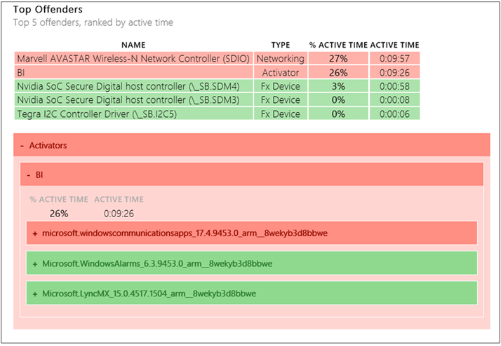
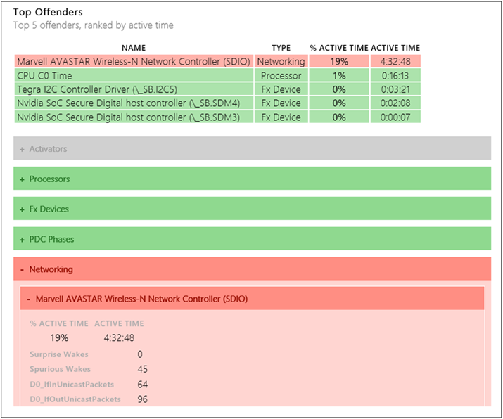
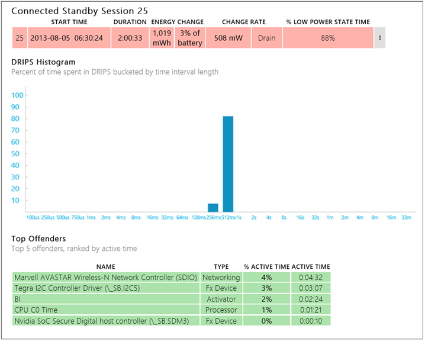
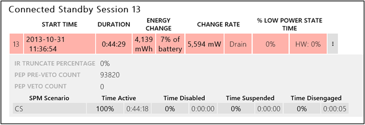

# Modern standby SleepStudy common problem examples

You can use the SleepStudy report to observe and diagnose common modern standby problems. The examples in this article show how to use the report to investigate problems such as high email or network activity, high battery drain, and inability to enter DRIPS.

## High email activity

This example shows how software can keep the wireless LAN (WLAN) device up. The cascading effect of email through the Windows communication app keeps the broker infrastructure (BI) system active. BI, in turn, keeps the WLAN network up so that the system stays up-to-date with emails.

In the following image, the SleepStudy report shows the relationships between the software and hardware components and how they collectively affect the battery.

## High network activity

This example shows how external events, such as WLAN environment, can keep the WLAN device up. The WLAN device might have a challenging radio environment and the Windows system might not be able to establish a reliable Internet connection. We see how these events affect the WLAN device, which, in turn, impacts the battery.

As shown in the following image, SleepStudy captures this device activity as a percentage of the modern standby session and warns of any durations that are over ten percent.

## High drain and obvious offender

In some cases, the SleepStudy report shows high battery drain but does not identify an obvious offender that is highlighted in red.

The example in the following image shows that the modern standby session had very high drain, but that no offender was over ten percent active. The deepest runtime idle platform state (DRIPS) histogram shows wake-up patterns. Typical low-power sessions have sleep time intervals that are close to 32 seconds, but this histogram shows that the sleep time interval is less than one second (closer to 512 milliseconds). This type of activity implies that frequent interrupts or some other hardware component causes the system to stay awake, which results in poor battery life.

For this example, a you can view a trace to identify the component that is causing the system to frequently exit the low-power state (DRIPS). For more information, see [Capture and View a WPA Trace for Modern Standby Issues](capture-and-view-a-wpa-trace-for-modern-standby-diagnostics.md).

## No software DRIPS or hardware DRIPS due to a missing driver

Some core silicon or System on a Chip (SoC) designs report both software DRIPS and hardware DRIPS. Software DRIPS refers to the Windows power manager's perception of when the SoC can be placed into the low-power state. It is based on device power state and CPU idle time.

Hardware DRIPS refers to the actual physical residency of the SoC in its lowest power state, as controlled by the on-SoC controller or microcode. Some SoC designs have an embedded controller or microcode that is responsible for actually transitioning the SoC to the lowest power state. The hardware might delay or prevent entry to the low-power state for reasons that are not perceptible to Windows.

A common reason for a modern standby session to have zero percent software and hardware DRIPS is that a critical driver is not loaded on the system. The summary table for the example modern standby session reports zero percent low-power state time for both software and hardware. When the summary details are expanded, as shown in the following screenshot, the value for PEP PRE-VETO COUNT is extremely high (it should nominally be zero). In this scenario, look for missing drivers in Device Manager.

 

 

