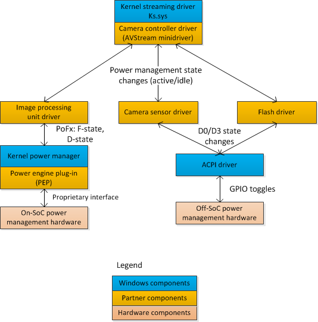

# Software power management mechanisms for cameras

Both the on-System on a Chip (SoC) image processing units and the off-SoC camera components are expected to consume no power (zero watts) when the system is in connected standby and the display is turned off. The primary software mechanism for power management is reference counting of the camera capture pin. This reference count is maintained by the camera controller driver, which is an [AVStream minidriver](https://msdn.microsoft.com/library/windows/hardware/ff554240). This basic power management mechanism can be used any time the system is turned on, including times when the system display is powered on.

The camera controller driver should forward power management state transitions to the drivers that control off-SoC components such as the camera sensor, auto-focuser, and flash. In response, the drivers that control these devices should take specific action to change power states and to remove or apply power.

## Recommended driver architecture

The camera subsystem should be exposed to Windows through a single AVStream minidriver called a *camera controller driver*. We recommend that the camera controller driver not access hardware directly and not directly power-manage hardware components. Instead, the camera controller driver should forward power management and hardware requests to other the drivers that comprise the camera subsystem.

The on-SoC image processing hardware should be power-managed by the SoC power engine plug-in (PEP). The image processing hardware should be managed by a [Windows Driver Frameworks (WDF)](https://msdn.microsoft.com/library/windows/hardware/ff557565) driver and this driver should enable cooperation with the PEP by setting the **IdleTimeout** member in the [**WDF\_DEVICE\_POWER\_POLICY\_IDLE\_SETTINGS**](https://msdn.microsoft.com/library/windows/hardware/ff551270) structure to **SystemManagedIdleTimeout**. This setting enables the PEP to control any clock and power-rail sharing topology that is unique to the SoC hardware. The driver that controls the image processing unit on the SoC should represent the entire image processing unit as a single power-managed component so that the default WDF capabilities for power management can be used.

The off-SoC camera subsystem components should be managed by one or more [Kernel-Mode Driver Framework (KMDF)](https://msdn.microsoft.com/library/windows/hardware/ff557565) drivers. The drivers for the off-SoC components must transition to the power-removed (D3) state when their components are no longer required for camera capture. Additionally, the drivers for the off-SoC components must enable D3cold, which allows the underlying ACPI subsystem to change the state of GPIO lines to apply and remove power. For more information, see [Supporting D3cold in a Driver](https://msdn.microsoft.com/library/windows/hardware/hh967717).

The following block diagram shows the recommended driver architecture.

All of the drivers that comprise the camera subsystem—including the camera controller driver, the image processing unit driver, and the drivers for the off-SoC camera components—must be enumerated in the same driver installation (.inf) file. All camera subsystem drivers must be members of the [imaging PnP device setup class](https://msdn.microsoft.com/library/windows/hardware/ff542682). The ClassGuid for imaging devices is {6bdd1fc6-810f-11d0-bec7-08002be2092f}.

Each driver that represents a single camera component should be enumerated as a single device in the ACPI namespace.

## Active and power-removed states

The camera controller driver must transition the camera devices to the power-removed state when no applications are streaming content from the camera device. An application may stop streaming because it has been closed by the user or is transitioned to the background and is suspended.

If an application initiates streaming from a camera whose devices are in the power-removed state, the camera controller driver must transition the camera devices back to the active state within 100 milliseconds.

To change the power states of the various camera subsystem components, camera controller drivers use proprietary interfaces to communicate with the other drivers that comprise the camera subsystem. To query for the appropriate interface, a camera subsystem driver should use the standard method, which is to send an [**IRP\_MN\_QUERY\_INTERFACE**](https://msdn.microsoft.com/library/windows/hardware/ff551687) I/O request that retrieves a set of function pointers.

The camera controller driver must place the camera device in the power-removed state when all of the streaming pins have entered the [**KSSTATE\_STOP**](https://msdn.microsoft.com/library/windows/hardware/ff566856) state. Windows automatically suspends foreground applications when the user presses the power button and the system enters connected standby. When a capture application is suspended, the camera capture APIs provided by the Windows Runtime are notified and will change the state of the camera capture pins, causing them to enter the **KSSTATE\_STOP** state.

When the first streaming pin enters the [**KSSTATE\_ACQUIRE**](https://msdn.microsoft.com/library/windows/hardware/ff566856) state, the camera controller driver must place the camera device—including the on-SoC image processing unit—in the active state.

## Associated camera functionality

The camera sensor and flash devices might have additional platform-level functions that must be managed by the driver. These functions can include the following:

-   Enabling, disabling, and configuring the camera sensor over the I2C bus.
-   Configuring the flash burst rate and brightness level over the I2C bus.
-   Detecting thermal conditions from the flash module through GPIO lines from the flash module to the SoC.

To implement these functions, camera device driver developers should use the methods and guidance summarized in the following table.

<table>
<colgroup>
<col width="25%" />
<col width="25%" />
<col width="25%" />
<col width="25%" />
</colgroup>
<thead>
<tr class="header">
<th>Function</th>
<th>Description</th>
<th>Hardware/firmware connection</th>
<th>Software mechanism</th>
</tr>
</thead>
<tbody>
<tr class="odd">
<td>Sensor configuration</td>
<td>Enumerate the capabilities of the camera sensor hardware or configure its current mode of operation.</td>
<td>Communication over I2C bus. I2C resources are described in the _CRS method under the camera device in the ACPI namespace.</td>
<td>
[Simple peripheral bus (SPB) input/output (I/O) request interface](https://msdn.microsoft.com/library/windows/hardware/hh698227) is used to communicate with I2C host controller and camera sensor device.
</td>
</tr>
<tr class="even">
<td>Sensor event detection</td>
<td>Raise events or indicate status using GPIO lines from the camera sensor to the SoC.</td>
<td>GPIO resources provided to the camera device. These resources are described in the _CRS method under the camera device in the ACPI namespace. GPIO pins that signal events must be described as GPIO interrupt resources.</td>
<td>
Interrupt is processed by driver in response to GPIO event.

SPB I/O request interface is used to communicate with sensor device to determine the cause of the interrupt.
</td>
</tr>
<tr class="odd">
<td>Flash configuration</td>
<td>Configure the flash device for burst rate, number of connected LEDs, or other properties.</td>
<td>Communication over I2C bus. I2C resources are described in the _CRS method under the camera device in the ACPI namespace.</td>
<td>
SPB I/O request interface is used to communicate with I2C host controller and camera sensor device.
</td>
</tr>
<tr class="even">
<td>Coordination with image processing unit driver</td>
<td>Initiate and coordinate capture with the image processing circuitry on the SoC.</td>
<td>N/A</td>
<td>
Private interface is exposed by the driver that manages the image processing units.
</td>
</tr>
</tbody>
</table>

 

## Camera device enumeration

To identify camera devices in the platform, applications typically query the Plug and Play (PnP) manager for instances of camera devices. Each PnP instance corresponds to a single camera device. To identify such an instance, the system integrator defines a camera device in the ACPI namespace. A camera device can stream content to only one application at a time. However, an application can stream from multiple camera devices simultaneously.

Each camera device that is represented by the camera controller driver (the AVStream minidriver) must be enumerated in the ACPI namespace as a separate device that is a child of the graphics driver.

As a special case, if the SoC platform is not capable of simultaneously streaming content from all camera devices in the platform at any combination of their reported resolutions or modes, a single camera device can be enumerated instead. However, this implementation requires careful consideration and should be undertaken only in direct collaboration with Microsoft.

The devices that represent the remainder of the camera subsystem—including the on-SoC image processing unit and the off-SoC camera sensor, auto-focuser, and flash—should be enumerated as one or more devices in the ACPI namespace. The on-SoC image processing unit should be enumerated as a device that is separate from the devices that represent the off-SoC components of the camera.

 

 

