# Speech Platform: Input Device Recommendations, version 2.0

 

 

**Microsoft Corporation Technical Documentation License Agreement (Standard)**

 

**READ THIS!** THIS IS A LEGAL AGREEMENT BETWEEN MICROSOFT CORPORATION ("MICROSOFT") AND THE RECIPIENT OF THESE MATERIALS, WHETHER AN INDIVIDUAL OR AN ENTITY ("YOU"). IF YOU HAVE ACCESSED THIS AGREEMENT IN THE PROCESS OF DOWNLOADING MATERIALS ("MATERIALS") FROM A MICROSOFT WEB SITE, BY CLICKING "I ACCEPT", DOWNLOADING, USING OR PROVIDING FEEDBACK ON THE MATERIALS, YOU AGREE TO THESE TERMS. IF THIS AGREEMENT IS ATTACHED TO MATERIALS, BY ACCESSING, USING OR PROVIDING FEEDBACK ON THE ATTACHED MATERIALS, YOU AGREE TO THESE TERMS.
1.  For good and valuable consideration, the receipt and sufficiency of which are acknowledged, You and Microsoft agree as follows:

    -   If You are an authorized representative of the corporation or other entity designated below ("**Company**"), and such Company has executed a Microsoft Corporation Non-Disclosure Agreement that is not limited to a specific subject matter or event ("**Microsoft NDA**"), You represent that You have authority to act on behalf of Company and agree that the Confidential Information, as defined in the Microsoft NDA, is subject to the terms and conditions of the Microsoft NDA and that Company will treat the Confidential Information accordingly;

    -   If You are an individual, and have executed a Microsoft NDA, You agree that the Confidential Information, as defined in the Microsoft NDA, is subject to the terms and conditions of the Microsoft NDA and that You will treat the Confidential Information accordingly; or

    -   If a Microsoft NDA has not been executed, You (if You are an individual), or Company (if You are an authorized representative of Company), as applicable, agrees: (a) to refrain from disclosing or distributing the Confidential Information to any third party for five (5) years from the date of disclosure of the Confidential Information by Microsoft to Company/You; (b) to refrain from reproducing or summarizing the Confidential Information; and (c) to take reasonable security precautions, at least as great as the precautions it takes to protect its own confidential information, but no less than reasonable care, to keep confidential the Confidential Information. You/Company, however, may disclose Confidential Information in accordance with a judicial or other governmental order, provided You/Company either (i) gives Microsoft reasonable notice prior to such disclosure and to allow Microsoft a reasonable opportunity to seek a protective order or equivalent, or (ii) obtains written assurance from the applicable judicial or governmental entity that it will afford the Confidential Information the highest level of protection afforded under applicable law or regulation. Confidential Information shall not include any information, however designated, that: (i) is or subsequently becomes publicly available without Your/Company's breach of any obligation owed to Microsoft; (ii) became known to You/Company prior to Microsoft's disclosure of such information to You/Company pursuant to the terms of this Agreement; (iii) became known to You/Company from a source other than Microsoft other than by the breach of an obligation of confidentiality owed to Microsoft; or (iv) is independently developed by You/Company. For purposes of this paragraph, "Confidential Information" means nonpublic information that Microsoft designates as being confidential or which, under the circumstances surrounding disclosure ought to be treated as confidential by Recipient. "Confidential Information" includes, without limitation, information in tangible or intangible form relating to and/or including released or unreleased Microsoft software or hardware products, the marketing or promotion of any Microsoft product, Microsoft's business policies or practices, and information received from others that Microsoft is obligated to treat as confidential.

2.  You may review these Materials only (a) as a reference to assist You in planning and designing Your product, service or technology ("Product") to interface with a Microsoft Product as described in these Materials; and (b) to provide feedback on these Materials to Microsoft. All other rights are retained by Microsoft; this agreement does not give You rights under any Microsoft patents. You may not (i) duplicate any part of these Materials, (ii) remove this agreement or any notices from these Materials, or (iii) give any part of these Materials, or assign or otherwise provide Your rights under this agreement, to anyone else.

3.  These Materials may contain preliminary information or inaccuracies, and may not correctly represent any associated Microsoft Product as commercially released. All Materials are provided entirely "AS IS." To the extent permitted by law, MICROSOFT MAKES NO WARRANTY OF ANY KIND, DISCLAIMS ALL EXPRESS, IMPLIED AND STATUTORY WARRANTIES, AND ASSUMES NO LIABILITY TO YOU FOR ANY DAMAGES OF ANY TYPE IN CONNECTION WITH THESE MATERIALS OR ANY INTELLECTUAL PROPERTY IN THEM.

4.  If You are an entity and (a) merge into another entity or (b) a controlling ownership interest in You changes, Your right to use these Materials automatically terminates and You must destroy them.

5.  You have no obligation to give Microsoft any suggestions, comments or other feedback ("Feedback") relating to these Materials. However, any Feedback you voluntarily provide may be used in Microsoft Products and related specifications or other documentation (collectively, "Microsoft Offerings") which in turn may be relied upon by other third parties to develop their own Products. Accordingly, if You do give Microsoft Feedback on any version of these Materials or the Microsoft Offerings to which they apply, You agree: (a) Microsoft may freely use, reproduce, license, distribute, and otherwise commercialize Your Feedback in any Microsoft Offering; (b) You also grant third parties, without charge, only those patent rights necessary to enable other Products to use or interface with any specific parts of a Microsoft Product that incorporate Your Feedback; and (c) You will not give Microsoft any Feedback (i) that You have reason to believe is subject to any patent, copyright or other intellectual property claim or right of any third party; or (ii) subject to license terms which seek to require any Microsoft Offering incorporating or derived from such Feedback, or other Microsoft intellectual property, to be licensed to or otherwise shared with any third party.

6.  Microsoft has no obligation to maintain confidentiality of any Microsoft Offering, but otherwise the confidentiality of Your Feedback, including Your identity as the source of such Feedback, is governed by Your NDA.

7.  This agreement is governed by the laws of the State of Washington. Any dispute involving it must be brought in the federal or state superior courts located in King County, Washington, and You waive any defenses allowing the dispute to be litigated elsewhere. If there is litigation, the losing party must pay the other party's reasonable attorneys' fees, costs and other expenses. If any part of this agreement is unenforceable, it will be considered modified to the extent necessary to make it enforceable, and the remainder shall continue in effect. This agreement is the entire agreement between You and Microsoft concerning these Materials; it may be changed only by a written document signed by both You and Microsoft.

 

## Section 0 | Document

**Disclaimer: This document is provided "as-is". Information and views expressed in this document, including URL and other Internet website references, may change without notice. Some information relates to pre-released products which may be substantially modified before commercially released. Microsoft makes no warranties, express or implied, with respect to the information provided here. You bear the risk of using it.**

Some examples depicted herein are provided for illustration only and are fictitious. No real association or connection is intended or should be inferred.

All recommendations and criteria within this document are approximate guidelines only, and not guarantees of speech recognition performance for all devices under real-world conditions. Speech recognition is a complex machine learning process, imperfect by nature. It is not guaranteed that Cortana and Speech Recognition will work well for your device, even if all premium recommendations are met.

## Definitions

For a comprehensive list of relevant terms, reference (ITU-p.10): <https://www.itu.int/rec/T-REC-P.10-200607-I/en>

<table>
<colgroup>
<col width="50%" />
<col width="50%" />
</colgroup>
<thead>
<tr class="header">
<th>TITLE</th>
<th>DEFINITION</th>
</tr>
</thead>
<tbody>
<tr class="odd">
<td>
<strong>ADC</strong>
</td>
<td>
Analog to Digital Converter (or A/D)
</td>
</tr>
<tr class="even">
<td>
<strong>AEC</strong>
</td>
<td>
Acoustic Echo Cancellation
</td>
</tr>
<tr class="odd">
<td>
<strong>AGC</strong>
</td>
<td>
Automatic Gain Control
</td>
</tr>
<tr class="even">
<td>
<strong>BPF</strong>
</td>
<td>
Band Pass Filtering
</td>
</tr>
<tr class="odd">
<td>
<strong>Capture (or Send)</strong>
</td>
<td>
The input (near-end) speech signal
</td>
</tr>
<tr class="even">
<td>
<strong>dB SPL</strong>
</td>
<td>
Decibel sound pressure level = 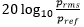 where <em>Pref</em>=20 micropascal. 1 Pa corresponds to 94 dBSPL.
</td>
</tr>
<tr class="odd">
<td>
<strong>dBFS (or dBov)</strong>
</td>
<td>
Decibel full scale = 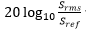 where <em>Sref</em> = the RMS of a full scale digital sine wave

The signal level of a digital signal relative to its overload or maximum level is given by dBov. This is also commonly referred to as dBFS (Full Scale).

For example, a rectangular function with only the positive or negative maximum number has a level of 0 dBov; For a maximum scale digital sine signal the peak level is 0 dBov and RMS is -3.01 dBov. (ITU-T G.100.1).
</td>
</tr>
<tr class="even">
<td>
<strong>DI</strong>
</td>
<td>
Directivity Index. (For more information, see [Directivity Index](#directivity-index) in Appendix A.)
</td>
</tr>
<tr class="odd">
<td>
<strong>DRC</strong>
</td>
<td>
Dynamic Range Compression
</td>
</tr>
<tr class="even">
<td>
<strong>DSP</strong>
</td>
<td>
Digital Signal Processing
</td>
</tr>
<tr class="odd">
<td>
<strong>DUT</strong>
</td>
<td>
Device Under Test
</td>
</tr>
<tr class="even">
<td>
<strong>DRP</strong>
</td>
<td>
Drum Reference Point. A point located at the end of the ear canal, corresponding to the eardrum position. Also the point at which the ear simulator used with a head and torso simulator (HATS) measures the sound pressure.
</td>
</tr>
<tr class="odd">
<td>
<strong>ERP</strong>
</td>
<td>
Ear Reference Point
</td>
</tr>
<tr class="even">
<td>
<strong>FIR</strong>
</td>
<td>
Finite Impulse Response
</td>
</tr>
<tr class="odd">
<td>
<strong>HATS</strong>
</td>
<td>
Head and Torso Simulator - described in ITU-T Recommendation P.58 [15]
</td>
</tr>
<tr class="even">
<td>
<strong>IHV</strong>
</td>
<td>
Independent Hardware Vendor
</td>
</tr>
<tr class="odd">
<td>
<strong>IIR</strong>
</td>
<td>
Infinite Impulse Response
</td>
</tr>
<tr class="even">
<td>
<strong>LRP</strong>
</td>
<td>
Listener Reference Point. A generic term representing the location at which the acoustic output from the receiver is to be determined or specified.
</td>
</tr>
<tr class="odd">
<td>
<strong>MRP</strong>
</td>
<td>
Mouth Reference Point is a point 25mm in front of the lip plane of the artificial mouth. This is a point where the speech level is calibrated before measurements for normal, loud and quiet speech
</td>
</tr>
<tr class="even">
<td>
<strong>NG</strong>
</td>
<td>
Ambient Noise Gain. (For more information, see [Ambient Noise Gain](#ambient-noise-gain) in Appendix A.)
</td>
</tr>
<tr class="odd">
<td>
<strong>NGA</strong>
</td>
<td>
A-Weighted Ambient Noise Gain. (For more information, see [A-Weighted Ambient Noise Gain](#a-weighted-ambient-noise-gain) in Appendix A.)
</td>
</tr>
<tr class="even">
<td>
<strong>Normal-band</strong>
</td>
<td>
Speech signal with a nominal pass-band of 300-3400 Hz (ITU-p.10 N-3)
</td>
</tr>
<tr class="odd">
<td>
<strong>Render (or Receive)</strong>
</td>
<td>
The output (far-end) speech and/or other rendered audio signal
</td>
</tr>
<tr class="even">
<td>
<strong>SLR</strong>
</td>
<td>
Send Loudness Rating
</td>
</tr>
<tr class="odd">
<td>
<strong>TCLw</strong>
</td>
<td>
Terminal Coupling Loss (weighted)
</td>
</tr>
<tr class="even">
<td>
<strong>THD+N</strong>
</td>
<td>
Total Harmonic Distortion including Noise = <em>(signal-ƒ₀)⁄ƒ₀ F</em>

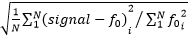 where the &quot;—&quot; is accomplished via notch filtering.
</td>
</tr>
<tr class="odd">
<td>
<strong>Wide-band</strong>
</td>
<td>
Speech signal with a nominal pass-band of 100-7000 Hz (ITU-p.10 W-3)
</td>
</tr>
<tr class="even">
<td>ƒ₀</td>
<td>
Fundamental frequency
</td>
</tr>
</tbody>
</table>

 

## Section 1 | Summary and Outline

The Speech Platform is used to power all of the speech experiences in Windows 10 such as Cortana and Dictation. This document provides guidance and recommendations for the design and development of audio input devices intended for use with Microsoft's Speech Platform.

Guidance provided in this document is limited to only those design parameters that have direct influence on:

-   speech recognition accuracy, and
-   behavior of the underlying speech processing algorithms.

The recommendations are intended as helpful guidelines and best practices for device design.

## Speech Recognition in Windows 10

Device manufacturers are encouraged to integrate and tune speech enhancement processing into their device in order to optimize performance relative to the Speech Recognition test criteria detailed in [Device.SpeechRecognition Recommendations](#section-2-device-speechrecognition-recommendations), later in this topic.

For devices without integrated speech enhancement processing, Microsoft provides default processing in Windows 10. The speech enhancement processing from Microsoft does not need device specific tuning by the IHV.

The Microsoft speech enhancement pipeline includes the following functionality — tuned for high-quality speech recognition.

-   Wideband Processing (16 kHz)
-   Echo Cancellation
-   Microphone Array support and Beamforming
-   Stationary Noise Suppression

The Microsoft speech enhancement pipeline will be used unless speech processing is correctly exposed by the driver. To utilize 3rd party enhancements the microphone geometry must be provided, support "speech" signal processing mode on the audio input, and ensure that the effects provided by the audio driver or its software APOs include at least noise suppression and echo cancellation.

## Device Recommendations

Recommendations within this document are discussed in four segments:

-   Device.SpeechRecognition ([Section 2](#section-2-device-speechrecognition-recommendations))
-   Device.VoiceActivation ([Section 2](#section-2-device-speechrecognition-recommendations))
-   Device.Audio ([Section 3](#section-3-device-audio-hlk-recommendations))
-   Device.Audio.Acoustics ([Section 4](#section-4-device-audio-acoustics-recommendations))

### Device.SpeechRecognition

This section defines the speech recognition performance metrics to ensure a high-quality speech experience. It is recommended that all devices are tested against these performance metrics.

### Device.VoiceActivation

This section defines the voice activation performance metrics to ensure that speech recognition executes appropriately using keyword spotting technologies. It is recommended that all devices are tested against these performance metrics.

### Device.Audio

This section provides guidelines in order to function optimally with the host OS in terms of software interfaces, communication protocols, and data formats. It is recommended that all devices are tested against these guidelines.

### Device.Audio.Acoustics

This section provides recommendations and best practices for acoustic and related properties of device design. This section is most relevant for devices that will use Microsoft's speech enhancement processing.

Good component selection, acoustic design and mechanical integration is important to capture the best possible audio to give a good experience rather than relying on the speech enhancement pipeline. Devices that do not perform speech enhancement processing on device (i.e., use the default speech enhancement pipeline provided in the OS) are recommended to follow Premium recommendations under Device.Audio.Acoustics in order to maximize chances of meeting the Device.SpeechRecognition experience requirements, and working well with the OS speech enhancement pipeline.

## Performance Levels

Functional guidelines within this document will at times be split into two levels, Standard and Premium. This distinction is made to acknowledge that there are a range of devices targeting speech functionality, spanning price targets and operational envelopes. Microsoft recommends that all devices target Premium guidelines when specified.

**Note**   A device must meet Premium recommendations in all categories in order to be considered a Premium device. The Premium and Standard categories are not part of a Logo program — rather informed best practices and guidelines

 

 Premium   
The device will work well at a distance and in more challenging conditions, such as increased noise levels. The device is expected to work from further away in challenging environments like a busy kitchen or a family room. As the user can interact with the device from a distance this will enable natural interactions using speech, such as "Hey Cortana, next track." It is highly recommended that the device support functionality in the Modern Standby power state.

 Standard   
Device meets basic functional guidelines for working with Speech Recognition. The device will work well in ambient conditions and at the typical 0.5m distance.

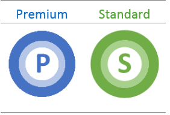

## Difference between Speech Recognition and Telephony

This document only contains recommendations for use of the speech platform, however many devices that target Speech Recognition functionality will also target Telephony usage. The similarities are evident — both scenarios use devices with microphones to pick up human speech, audio processing pipelines to remove noise from the environment and enhance human speech, and consuming applications that rely on a clear speech signal in order to understand the speech.

The differences lie in who or what consumes the speech signal. Telephony has a human consumer, for whom perceptual voice quality and speech intelligibility are paramount. Speech recognition has an algorithmic consumer, where machine learning trained on specific features of the speech signal determine what is recognized, and where those features do not necessarily align to perceptual norms.

Perceptual voice quality is often correlated with speech recognition accuracy, but this is not always the case. This document focuses on methods of evaluating and maximizing speech recognition accuracy. It is recommended to support the "speech" signal processing mode and to tune that mode specifically for speech recognition.

Passing Skype Lync audio certification, <http://technet.microsoft.com/office/dn788953>, is a strong indicator of good device audio performance.

## Section 2 | Device.SpeechRecognition Recommendations

Recommendations in this section are made regarding the target speech recognition and voice activation accuracy for devices in various environments. All recommendations represent the minimum bar for acceptable user experience in each scenario. Test conditions and steps are specified in the Speech Platform Input Device Test Setup. It is important that a device meets the recommendations in this section in order to:

-   Ensure the device will work well with speech recognition in various environments
-   Ensure the device will work within the operational boundaries of the Microsoft speech enhancement pipeline (for those devices not using their own speech enhancement pipeline)

## Scenario Definitions

The user scenario definitions described in the following table will be used in the test sections.

<table>
<colgroup>
<col width="25%" />
<col width="25%" />
<col width="25%" />
<col width="25%" />
</colgroup>
<thead>
<tr class="header">
<th>User Scenario</th>
<th>Representation</th>
<th>Ambient Level @DUT, dBSPL(A)</th>
<th>Music, dBSPL(A)</th>
</tr>
</thead>
<tbody>
<tr class="odd">
<td>
Quiet
</td>
<td>
Private Office, Living Room
</td>
<td>
≤ 35
</td>
<td>
0
</td>
</tr>
<tr class="even">
<td>
Noise (Medium)
</td>
<td>
Coffee Shop, Kitchen
</td>
<td>
57 to 69
</td>
<td>
0
</td>
</tr>
<tr class="odd">
<td>
Noise (Loud)
</td>
<td>
Busy Open Office, Car
</td>
<td>
≥ 70
</td>
<td>
0
</td>
</tr>
<tr class="even">
<td>
Echo
</td>
<td>
Listening to Music in Quiet Environment
</td>
<td>
≤ 35
</td>
<td>
70
</td>
</tr>
<tr class="odd">
<td>
Echo+Noise (Medium)
</td>
<td>
Listening to Music in Medium Noise
</td>
<td>
57 to 69
</td>
<td>
70
</td>
</tr>
</tbody>
</table>

 

Ambient noise test represent various levels and types of noisy environments, e.g., [Cafeteria & Pub](http://aka.ms/es202-396-1), and are measured at the DUT position — Cafeteria @ 57 dBSPL(A) is recommended as minimum bar for test. The quiet tests represent an ideal environment with minimal ambient noise (noise floor &lt; 35 dBA SPL). The music (echo) file is provided in the toolchain release. **Additionally, each test category should be tested at "on-axis" (0-degree device rotation) and "off-axis" (50-degree device rotation) to ensure that performance is acceptable at varied incidence angles**. The following table summarizes the test categories, against which the user scenarios above will be tested.

<table>
<colgroup>
<col width="20%" />
<col width="20%" />
<col width="20%" />
<col width="20%" />
<col width="20%" />
</colgroup>
<thead>
<tr class="header">
<th>Test Category</th>
<th>Test Distance</th>
<th>Device Angles (°)</th>
<th>Speech Level @MRP, dBSPL(A)</th>
<th>Echo Playback Level, dBSPL(A)</th>
</tr>
</thead>
<tbody>
<tr class="odd">
<td>
Head Mounted Devices (HMD)
</td>
<td>
-
</td>
<td>
-
</td>
<td>
89
</td>
<td>
70 @ LRP
</td>
</tr>
<tr class="even">
<td>
Standard Near Field
</td>
<td>
0.5 m
</td>
<td>
0 and 50
</td>
<td>
89
</td>
<td>
70 @ LRP
</td>
</tr>
<tr class="odd">
<td>
Premium Near Field
</td>
<td>
0.8 m
</td>
<td>
0 and 50
</td>
<td>
89
</td>
<td>
70 @ LRP
</td>
</tr>
<tr class="even">
<td>
Premium Far Field (Actual)
</td>
<td>
4 m
</td>
<td>
0 and 50
</td>
<td>
99
</td>
<td>
70 @ 0.8m
</td>
</tr>
<tr class="odd">
<td>
Premium Far Field (Simulated) *
</td>
<td>
2 m
</td>
<td>
0 and 50
</td>
<td>
95
</td>
<td>
70 @ 0.8m
</td>
</tr>
</tbody>
</table>

 

**\* Far-field is defined as a 4m experience in a semi-reverberant space. For 2017 tests, an acceptable equivalent is a 2m test in an average ETSI room with a reduced speech level of 95 dBSPL(A)** . This number was determined based on the average acoustic loss from 4m to 2m in rooms that met ETSI requirements for RT60.

More details regarding test positions are detailed in the Speech Platform Input Device Test Setup.

Devices should be tested with an echo level of 70 dBSPL(A) @ LRP for near field/HMDs and @ 0.8m for far field devices. If a device cannot reach 70 dBSPL(A) at the prescribed position, the maximum level must be used. However, if a device cannot reach 64 dBSPL(A) at maximum level, the test shall be marked as a fail.

## Device.SpeechRecognition

Testing a specific device for good speech recognition. Test data should be applied against the requirements for the applicable test category (all angles). A device only needs to be tested at one distance, i.e., HMDs in typical wearing position, Standard near field devices @ 0.5m, Premium near field @ 0.8m, Premium far-field @ 4m (or simulated 2m with reduced talker level as described earlier). Consult the test setup recommendations for further details.

<table>
    <tr>
        <th rowspan="2">Release</th>
        <th rowspan="2">People</th>
        <th rowspan="2">Scenario</th>
        <th colspan="2">Standard</th>
        <th colspan="3">Premium</th>
    </tr>
    <tr>
        <th>HMD</th>
        <th>Near-field (0.5m)</th>
        <th>HMD</th>
        <th>Near-field (0.8m)</th>
        <th>Far-field (4m)</th>
    </tr>
    <tr>
        <td rowspan="5">2017</td>
        <td rowspan="5">Male, Female, Children (5-12)</td>
        <td>Quiet</td>
        <td>95%</td>
        <td>95%</td>
        <td>95%</td>
        <td>95%</td>
        <td>95%</td>
    </tr>
    <tr>
        <td>Echo</td>
        <td>85%</td>
        <td>85%</td>
        <td>95%</td>
        <td>90%</td>
        <td>85%</td>
    </tr>
    <tr>
        <td>Noise (Medium)</td>
        <td>85%</td>
        <td>85%</td>
        <td>95%</td>
        <td>90%</td>
        <td>85%</td>
    </tr>
    <tr>
        <td>Echo+Noise (Medium)</td>
        <td>85%</td>
        <td>85%</td>
        <td>95%</td>
        <td>85%</td>
        <td>85%</td>
    </tr>
    <tr>
        <td>Noise (Loud)</td>
        <td>n/a</td>
        <td>n/a</td>
        <td>85%</td>
        <td>n/a</td>
        <td>n/a</td>
    </tr>
</table>

## Device.VoiceActivationOEM

Testing a specific device for good voice recognition accuracy (i.e., "Hey Cortana"). Test data should be applied against the requirements for the applicable test category (all angles). A device only needs to be tested at one distance/category. This test assumes that any OEM speech recognition technology meets the Device.SpeechRecognition requirements.

<table>
    <tr>
        <th rowspan="2">Release</th>
        <th rowspan="2">People</th>
        <th rowspan="2">Scenario</th>
        <th colspan="2">Standard</th>
        <th colspan="3">Premium</th>
    </tr>
    <tr>
        <th>HMD</th>
        <th>Near-field (0.5m)</th>
        <th>HMD</th>
        <th>Near-field (0.8m)</th>
        <th>Far-field (4m)</th>
    </tr>
    <tr>
        <td rowspan="5">2017</td>
        <td rowspan="5">Male, Female, Children (5-12)</td>
        <td>Quiet</td>
        <td>90%</td>
        <td>90%</td>
        <td>90%</td>
        <td>90%</td>
        <td>90%</td>
    </tr>
    <tr>
        <td>Echo</td>
        <td>90%</td>
        <td>90%</td>
        <td>90%</td>
        <td>90%</td>
        <td>90%</td>
    </tr>
    <tr>
        <td>Noise (Medium)</td>
        <td>90%</td>
        <td>90%</td>
        <td>90%</td>
        <td>90%</td>
        <td>90%</td>
    </tr>
    <tr>
        <td>Echo+Noise (Medium)</td>
        <td>90%</td>
        <td>90%</td>
        <td>90%</td>
        <td>90%</td>
        <td>90%</td>
    </tr>
    <tr>
        <td>Noise (Loud)</td>
        <td>n/a</td>
        <td>n/a</td>
        <td>85%</td>
        <td>n/a</td>
        <td>n/a</td>
    </tr>
</table>

 

## Device.VoiceActivation.CA.Platform

Testing a platform for voice recognition correct accepts. This test is not required to be run by OEMs. The Correct Accept test is run for every supported locale. Premium devices are required to support modern standby. The score is required to pass for each independent test using Male, Female and Children.

<table>
    <tr>
        <th rowspan="2">Release</th>
        <th rowspan="2">People</th>
        <th rowspan="2">Scenario</th>
        <th colspan="2">Standard</th>
        <th colspan="3">Premium</th>
    </tr>
    <tr>
        <th>HMD</th>
        <th>Near-field (0.5m)</th>
        <th>HMD</th>
        <th>Near-field (0.8m)</th>
        <th>Far-field (4m)</th>
    </tr>
    <tr>
        <td rowspan="5">2017</td>
        <td rowspan="5">Male, Female, Children (5-12)</td>
        <td>Quiet</td>
        <td rowspan="5">90%</td>
        <td rowspan="4">90%</td>
        <td rowspan="5">90%</td>
        <td rowspan="4">90%</td>
        <td rowspan="4">90%</td>
    </tr>
    <tr>
        <td>Echo</td>
    </tr>
    <tr>
        <td>Noise (Medium)</td>
    </tr>
    <tr>
        <td>Echo+Noise (Medium)</td>
    </tr>
    <tr>
        <td>Noise (Loud)</td>
        <td>n/a</td>
        <td>n/a</td>
        <td>n/a</td>
    </tr>
</table>

 

##  Device.VoiceActivation.FA.Platform

Testing a platform for voice recognition false accepts. This test is not required to be run by OEMs.

<table>
<colgroup>
<col width="50%" />
<col width="50%" />
</colgroup>
<thead>
<tr class="header">
<th>Release</th>
<th>People</th>
</tr>
</thead>
<tbody>
<tr class="odd">
<td>
2017
</td>
<td>
&lt;= 1 FA per 100 hours of continuous speech
</td>
</tr>
</tbody>
</table>

 

The False Accept test is run for every supported locale.

## Device.SpeechRecognition.DefaultMicGain

In order to ensure the best user experience and to maximize Windows speech accuracy, the microphone gain setting should be set to an optimal level used to pass the above tests. The resulting gain setting can then be set in a regkey as follows:

Name:

HKEY\_LOCAL\_MACHINE\\SOFTWARE\\Microsoft\\Speech\_OneCore\\AudioInput\\MicWiz\\DefaultDefaultMicGain

Type: REG\_DWORD

Data: 0-10 000 decimal, 0-0x2710 Hex

Description: Percentage of max gain multiplied by 100.

This key is to set by the IHV for devices that have an integrated mic array that meet or exceed the **Standard** metrics for all of the three tests above.

## Example

This example sets the MicGain as 42.00% which is 0x1068.

\[HKEY\_LOCAL\_MACHINE\\SOFTWARE\\Microsoft\\Speech\_OneCore\\AudioInput\\MicWiz\]

"DefaultDefaultMicGain"=dword:00001068

This example sets the MicGain as 64.50% which is 0x1932.

\[HKEY\_LOCAL\_MACHINE\\SOFTWARE\\Microsoft\\Speech\_OneCore\\AudioInput\\MicWiz\]

"DefaultDefaultMicGain"=dword:00001932

## Conditions

-   The regkey is only applicable to integrated microphones and should not be implemented when external mics are being used.

-   The regkey should not be implemented in devices that do not meet or exceed the **Standard** metrics for all of the three tests above.

## Section 3 | Device.Audio HLK Recommendations

Recommendations in this section are made regarding the software and hardware interfaces, communication protocols, and data formats of the device.

It is important that a device meets the recommendations in this section in order to

-   Ensure the device will work within the Windows Audio pipeline framework
-   Ensure the device will work within the operational boundaries of the Microsoft speech enhancement pipeline (for those devices not using their own speech enhancement pipeline)

Devices intended to use speech recognition functionality must meet all Device.Audio Requirements found under the Windows Hardware Certification Requirements:

<http://msdn.microsoft.com/library/windows/hardware/jj134354.aspx>

The most relevant Device.Audio requirements for Speech Recognition functionality will be called out in the following sections.

## Device.Audio.Base.AudioProcessing

Drivers must expose all audio effect via the FXStreamCLSID, FXModeCLSID, and FXEndpointCLSID APOs (or proxy APOs). The APOs must send an accurate list of effects that are enabled to the system when queried. Drivers must support APO change notifications and only notify the system when an APO change has occurred.

There should be no undiscoverable nor uncontrollable hardware, firmware or 3rd party software-based BPF, AGC, DRC, AEC, Beam Forming, Noise suppression or anything else that alters the audio samples (e.g., non-linear processing) from/to the device.

The Driver Configuration Verification tool can be used for verification on the device (OEM Verification Tool provided in the test toolchain).

## Device.Audio.Base.StreamingFormats

Speech recognition functions under all audio capture and render streaming formats defined in the StreamingFormats HLK, with the optimum being 16 kHz with 24-bit capture and mono render.

Note that whilst the mono render is optimal for echo cancellation performance it is understood that it is not ideal for media applications, so this recommendation is included for devices in which the primary or exclusive functionality is speech input. The echo canceller will work with all render formats and devices will typically have stereo or greater render capability.

## Device.Audio.Base.SamplePositionAccuracy

It is important that render and capture audio signals are both 1) sampled accurately and 2) time-stamped accurately.

Accurate sampling at the ADC and DAC ensure a faithful reproduction of the audio signal, which supports good speech quality (sample error adds noise to the signal) and accurate echo cancellation (sample error adds noise to the echo estimate and creates signal mis-alignment).

Accurate timestamps ensure that capture and render signals can be synchronized for echo cancellation.

All capture channels must be synchronized (t₀ sample aligned). This includes all ADCs initialized at the exact same point in time, as well as any buffers being aligned and free of data. This is critical for beamforming and sound source localizer performance, which relies on sub-sample alignment to estimate the location of a sound source(s).

*Drift* is defined in [Appendix A](#drift) as the absolute clock drift with reference to the ground truth clock. However, the drift as seen by the echo canceller is actually the relative drift between the capture and render paths.

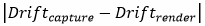

Devices with built in capture and render paths can negate this relative drift by deriving both capture and render clocks from the same master clock source. In this way, even in the presence of absolute drift in the master clock, the relative drift between the capture and render clocks is 0%.

## Device.Audio.USB

All USB audio input devices must properly set descriptor according to the USB spec: <http://www.usb.org/developers/docs/devclass_docs/termt10.pdf>

<table>
<colgroup>
<col width="25%" />
<col width="25%" />
<col width="25%" />
<col width="25%" />
</colgroup>
<thead>
<tr class="header">
<th>Terminal Type</th>
<th>Code</th>
<th>I/O</th>
<th>Description</th>
</tr>
</thead>
<tbody>
<tr class="odd">
<td>
<strong>Input Undefined</strong>
</td>
<td>
0x0200
</td>
<td>
I
</td>
<td>
Input Terminal, undefined Type.
</td>
</tr>
<tr class="even">
<td>
<strong>Microphone</strong>
</td>
<td>
0x0201
</td>
<td>
I
</td>
<td>
A generic microphone that does not fit under any of the other classifications.
</td>
</tr>
<tr class="odd">
<td>
<strong>Desktop Microphone</strong>
</td>
<td>
0x0202
</td>
<td>
I
</td>
<td>
A microphone normally placed on the desktop or integrated into the monitor.
</td>
</tr>
<tr class="even">
<td>
<strong>Personal microphone</strong>
</td>
<td>
0x0203
</td>
<td>
I
</td>
<td>
A head-mounted or clip-on microphone.
</td>
</tr>
<tr class="odd">
<td>
<strong>omni-directional microphone</strong>
</td>
<td>
0x0204
</td>
<td>
I
</td>
<td>
A microphone designed to pick up voice from more than one speaker at relatively long ranges.
</td>
</tr>
<tr class="even">
<td>
<strong>microphone array</strong>
</td>
<td>
0x0205
</td>
<td>
I
</td>
<td>
An array of microphones designed for directional processing using host-based signal processing algorithms.
</td>
</tr>
<tr class="odd">
<td>
<strong>processing microphone array</strong>
</td>
<td>
0x0206
</td>
<td>
I
</td>
<td>
An array of microphones with an embedded signal processor.
</td>
</tr>
</tbody>
</table>

 

## Driver Guidelines

Roadmap for developing WDM Audio Drivers: <http://www.microsoft.com/whdc/device/audio/wavertport.mspx>

## Device.Audio.Driver.MicSensitivity

The property value KS\_AUDIO\_MIC\_SENSITIVITY contains sensitivity information in decibels relative to FS units, for a given input sound pressure level. The sensitivity value uses the following scale:

-   The value uses fixed point decimal representation.
-   The data is stored as a 16.16 fixed point value. The upper 16 bits are used for the whole number of the value and the lower 16 bits are used for the fractional portion of the value.
-   The value should be in the range of -130 to 0.

The audio driver can obtain microphone sensitivity for each microphone. This property allows this information to be retrieved from driver.

For Windows 10 voice recognition experiences such as Cortana, the OS can calculate effective sensitivity and apply appropriate gain to enhance input signal, reduce noise, and enhance accuracy.

Similarly, the SNR value may be utilized within the property value KS\_AUDIO\_MIC\_SNR. The SNR value uses the same scale as KS\_AUDIO\_MIC\_SENSITIVITY, except the value should be in the range of 0 to 130.

For example, a device with a digital microphone sensitivity of -26 dBFS/Pa would use -26. A typical component datasheet will show both sensitivity (expressed as dBFS/Pa) and SNR in a specifications table.

More information can be found here: [KSPROPERTY\_AUDIO\_MIC\_SENSITIVITY](https://msdn.microsoft.com/windows/hardware/mt761741), [KSPROPERTY\_AUDIO\_MIC\_SNR](https://msdn.microsoft.com/windows/hardware/mt761742)

## Device.Audio.Driver.BigBuffer

Devices without any hardware support for a keyword detector use a software keyword spotter to open a continuous capture stream. By default, the audio engine runs every 10ms (default capture buffer size) which results in high power consumption. To reduce power consumption, a larger buffer can be used to allow a capture stream that wakes up the audio engine less often.

A new structure exists to enable expression of a maximum pocket size constraint. A driver expresses the buffer size constraint by specifying MaxPacketSizeInBytes in the DEVPKEY\_KSAUDIO\_PACKETSIZE\_CONSTRAINTS2 device property on the PnP interface of the KS filter that has the KS streaming pin(s).

**Premium devices should support audio capture periodicities of at least 100ms and up to 200ms**. This is detailed further in [KSAUDIO\_PACKETSIZE\_PROCESSINGMODE\_CONSTRAINT structure](https://msdn.microsoft.com/library/windows/hardware/dn965562%28v=vs.85%29.aspx) & [KSAUDIO\_PACKETSIZE\_CONSTRAINTS2 structure](https://msdn.microsoft.com/library/windows/hardware/mt761740%28v=vs.85%29.aspx).

## Section 4 | Device.Audio.Acoustics Recommendations

Recommendations in this section are made regarding the acoustic and related properties of the device e.g., microphone and loudspeaker placement, microphone responses, received noise from the device, etc. Microphone selection, placement, integration, and array design are some of the most important factors to support quality speech recognition performance.

The recommendations and tests are relative to the signal before the speech enhancement processing but after microphone equalization and fixed microphone gain.

It is important that a device meets the recommendations in this section in order to:

-   Ensure the device will work within the operational boundaries of the Microsoft speech enhancement pipeline (for those devices not using their own speech enhancement pipeline)
-   Ensure the device will work within the operational boundaries of Microsoft's speech recognition applications such as Cortana.
-   Ensure the device has similar characteristics to other speech input devices intended for use with speech recognition applications

## Device.Audio.Acoustics.MicArray

A microphone array plays a fundamental role in enabling the speech enhancement pipeline to remove localized noise in the form of:

-   ambient noise
-   receive (echo) noise
-   room reverberation
-   device generated self-noise (such as fans)

For a guide on creating microphone array geometry descriptors, please see Appendix C.

For **Standard** it is recommended to have a minimum of 2 microphones and for **Premium** devices it is recommended to have 4 microphones for directional use or 8 microphones for 360 degrees of use.

For devices that will use the Microsoft speech enhancement pipeline, the following array geometries are recommended and known to work well. However, the Microsoft speech enhancement is capable of working with any array type specified in the microphone array descriptor.

<table>
    <tr>
        <th><b>Linear 2-element, 45-170 mm</b></th>
        <th><b>Linear 4-element geometry, symmetrical</b></th>
    </tr>
    <tr>
        <td></td>
        <td></td>
    </tr>
    <tr>
        <td colspan="2">
<b>Linear 4-element geometry</b>
</td>
    </tr>
    <tr>
        <td colspan="2">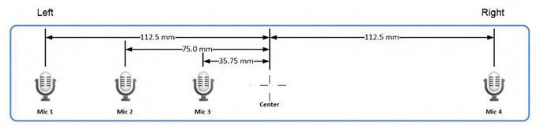</td>
    </tr>
</table>

 

When a different speech enhancement pipeline is used then alternative geometries may be recommended such as the L shape.

Devices that are designed for 360-degree operation are recommended to use an 8 mic circular array.

| L-Shape array                     | Circular array, 8 elements        |
|-----------------------------------|-----------------------------------|
|  |  |

 

## Device.Audio.Acoustics.MicLevel

The microphone level guideline can be used to assess if speech experiences would be noticeably impaired as a result of either clipping (input signal too high for scenario), or the input signal is too low. Active Speech Level per [ITU-T P.56](http://www.itu.int/rec/T-REC-P.56/e) is recommended as a means of measuring the captured microphone level.

The following framework may be useful to assess if the designed microphone sensitivity is appropriate for the intended user scenario. To assess or investigate any potential microphone sensitivity or OEM AGC tuning issues, the Clean Talk file supplied in the toolchain release can be captured by the DUT under two scenarios: the loudest expected input scenario and the quietest desired input scenario under Quiet conditions.

**Definition of Loudest Talker Input Scenario:**

-   Set the talker level to 95 dBSPL @ MRP
-   Position the mouth simulator in the closest position that the DUT is intended to support (e.g., for a laptop and most devices - 0.5m). This position is at the discretion of the IHV based on the intent of the product.
-   Play back the clean talk speech file from the recording toolchain, and simultaneously record on the DUT.

**Definition of Quietest Talker Input Scenario:**

-   Set the talker level to 79 dBSPL @ MRP
-   Position the mouth simulator in the furthest position that the DUT is intended to support (e.g., for a laptop this could be 1m). This position is at the discretion of the IHV based on the intent of the product.
-   Play back the clean talk speech file from the recording toolchain, and simultaneously record on the DUT.

<table>
<colgroup>
<col width="50%" />
<col width="50%" />
</colgroup>
<thead>
<tr class="header">
<th>Scenario</th>
<th>Captured Clean Talk Active Speech Level</th>
</tr>
</thead>
<tbody>
<tr class="odd">
<td>
Loud Talker
</td>
<td>
≤ -26 dBFS
</td>
</tr>
<tr class="even">
<td>
Quiet Talker
</td>
<td>
≥ -48 dBFS
</td>
</tr>
</tbody>
</table>

 

The clean talk speech recordings in the toolchain have a crest factors greater than 20 dB for some utterances. The speech engine also needs the lowest input level to be approximately at the recommendation above to process effectively.

If the received levels across the above scenarios do not fit within the Max and Min thresholds by simple linear gain adjustment, then device specific AGC should be included to adjust speech levels to fit within the thresholds.

Matching of microphone sensitivity across all microphones in the array is important, and should be within +/- 3 dB for **Standard** and +/- 1 dB for **Premium**. The system level performance in specified and tested in [Device.Audio.Acoustics.MicMagnitudeResponse](#device-audio-acoustics-micmagnituderesponse-a-href-ftn3-name-ftnref3-title-3-a). MEMS microphones have low manufacturing tolerances, and are recommended for best microphone-to-microphone matching characteristics.

Note that if MEMs microphones are not used then the sensitivity will change during assembly, it will also change during use due to environmental conditions.

## Device.Audio.Acoustics.MicIntegration

Careful mechanical integration of the microphone is important and is a common source of failure.

The microphones must be integrated to ensure a good acoustic seal between the microphone and the device chassis and if appropriate along the microphone porting tube. It is also important to minimize the acoustic noise and vibration between the system and the microphone. Two typical solutions are to use a rubber boot or a gasket.

Whichever method is chosen check that the acoustic seal is sufficient across all production tolerances and over both environmental and lifetime changes.

## Device.Audio.Acoustics.MicPlacement

In general, follow these guidelines for placing the microphone array:

-   As far as possible from noise sources such as loudspeakers, fans, keyboards, hard drives, and user's hands.
-   As close as possible to the speaker's mouth.

## Device.Audio.Acoustics.MicSelfNoise

Microphone components are also a source of noise, called self-noise or equivalent-noise, it can be caused by a variety of sources, but it is created internally in the microphone and is effectively independent of the SPL. The equivalent noise represents the lowest point of the microphone's dynamic range, and is particularly important for good beam-forming performance. Use of a high quality microphone will minimize the microphone internal noise.

Microphones with an SNR of at least 61 dB nominal is recommended for **Standard** and 63 dB for **Premium**.

## Device.Audio.Acoustics.MicReceivedNoise

The two main sources of received noise are acoustic noise and electrical noise. Acoustic noise may from outside the device, or be generated internally in the device due to fans, hard disks, etc. The acoustic noise can also be transmitted through the device mechanics.

Electrical noise can be minimized by using digital microphones rather than analog microphones.

##  Device.Audio.Acoustics.MicMagnitudeResponse

The microphone magnitude response tolerance mask is important for a couple of reasons:

-   Reduces variance between microphones in an array due to channel responses
-   Reduces variance between devices due to channel responses

Which leads to the following outcomes:

-   Less variability in data used to train speech acoustic models
-   More consistent beam-forming performance in the speech enhancement pipeline
-   Less energy from low frequency, lower SNR regions --&gt; less noise in signal and lower likelihood of saturation due to low frequency noise
-   More natural sounding voice for perceptual applications

With these considerations in place, Microsoft encourages meeting the below response masks (with "flat" being the ideal target) in order to drive response convergence across devices, vis-à-vis acoustic models over time.

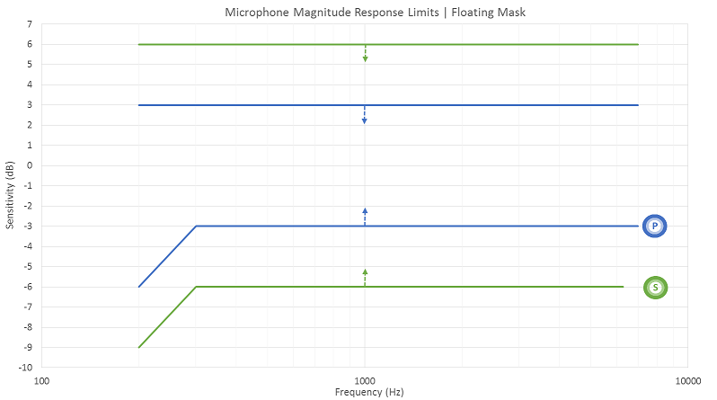

**Note**  
The Premium and Standard masks apply to all device tiers under Device.Audio.Acoustics.Bandwidth e.g., a device can have Standard bandwidth (narrow-band) and a Premium magnitude response within that band.

<table>
    <tr>
        <th rowspan="2">Frequency (Hz)</th>
        <th colspan="2">Premium</th>
        <th colspan="2">Standard</th>
    </tr>
    <tr>
        <th>Upper Limit (dB)</th>
        <th>Lower Limit (dB)</th>
        <th>Upper Limit (dB)</th>
        <th>Lower Limit (dB)</th>
    </tr>
    <tr>
        <td>200</td>
        <td>3</td>
        <td>-6</td>
        <td>6</td>
        <td>-9</td>
    </tr>
    <tr>
        <td>300</td>
        <td>3</td>
        <td>-3</td>
        <td>6</td>
        <td>-6</td>
    </tr>
    <tr>
        <td>5000</td>
        <td>3</td>
        <td>-3</td>
        <td>6</td>
        <td>-6</td>
    </tr>
    <tr>
        <td>6300</td>
        <td>3</td>
        <td>-3</td>
        <td>6</td>
        <td>-6</td>
    </tr>
    <tr>
        <td>7000</td>
        <td>3</td>
        <td>-3</td>
        <td>6</td>
        <td></td>
    </tr>
</table> 

 
All microphones must fit within the mask concurrently. The mask is floating — absolute gain is not a factor.

## Device.Audio.Acoustics.MicPhaseResponseMatching

The microphone phase response matching limit is important to ensure that the temporal relationship between signals received via microphone elements in an array is consistent with the physical geometry of the microphone elements in the array (with "zero matching" being the ideal target).

This is important for beam-former and sound source localizer processing in the Microsoft speech enhancement pipeline, which use the relative delay between speech signals from each microphone channel in order to:

-   Estimate the direction of localized sound
-   Suppress noises that do not come from the listening direction.

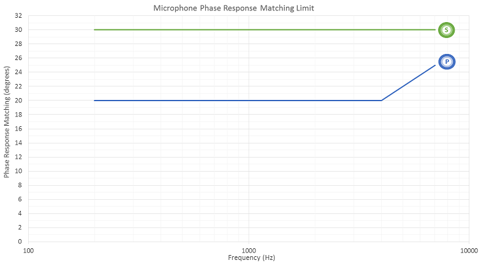

<table>
<colgroup>
<col width="33%" />
<col width="33%" />
<col width="33%" />
</colgroup>
<thead>
<tr class="header">
<th> </th>
<th>Premium</th>
<th>Standard</th>
</tr>
</thead>
<tbody>
<tr class="odd">
<td>Frequency (Hz)</td>
<td>Upper Limit

 

(deg)</td>
<td>Upper Limit

 

(deg)</td>
</tr>
<tr class="even">
<td>
200
</td>
<td>
20
</td>
<td>
30
</td>
</tr>
<tr class="odd">
<td>
1000
</td>
<td>
20
</td>
<td>
30
</td>
</tr>
<tr class="even">
<td>
4000
</td>
<td>
20
</td>
<td>
30
</td>
</tr>
<tr class="odd">
<td>
7000
</td>
<td>
25
</td>
<td>
30
</td>
</tr>
</tbody>
</table>

 

##  Device.Audio.Acoustics.MicDistortion

The mic distortion and noise limit is important to meet for a couple reasons

-   Ensure the voice is relatively undistorted before entering the speech recognizer
-   Keep non-linearities on the echo path minimal for good echo cancellation performance

The distortion is recommended to be measured using SDNR (pulsed noise signal-to-distortion-and-noise ratio), although THD targets are also given. More information about the SDNR test method can be found from IEEE 269-2010 Annex L.

<table>
    <tr>
        <th rowspan="2">Frequency</th>
        <th colspan="2">Premium</th>
        <th colspan="2">Standard</th>
    </tr>
    <tr>
        <th>THD</th>
        <th>SDNR</th>
        <th>THD</th>
        <th>SDNR</th>
    </tr>
    <tr>
        <td>250</td>
        <td>2.50%</td>
        <td>>=32</td>
        <td>3.20%</td>
        <td>>=30</td>
    </tr>
    <tr>
        <td>1000</td>
        <td>2.50%</td>
        <td>>=32</td>
        <td>3.20%</td>
        <td>>=30</td>
    </tr>
    <tr>
        <td>4000</td>
        <td>2.50%</td>
        <td>>=32</td>
        <td>3.20%</td>
        <td>>=30</td>
    </tr>
    <tr>
        <td>5000</td>
        <td>4.00%</td>
        <td>>=28</td>
        <td>4.00%</td>
        <td>>=28</td>
    </tr>
    <tr>
        <td>6000</td>
        <td>6.30%</td>
        <td>>=24</td>
        <td>6.30%</td>
        <td>>=24</td>
    </tr>
</table> 

 

**Note**   This requirement extends up to ½ the effective bandwidth, at which point the first harmonic is beyond the nyquist rate.

 

## Device.Audio.Acoustics.MicBandwidth

The sample rate of the capture signal is the primary factor in determining the effective bandwidth of the speech signal. As the speech platform uses 16 kHz acoustic models in the speech recognizer a 16 kHz minimum sample rate is recommended. 300 Hz is the effective lower end of the speech recognizer, however 200 Hz is the recommended acoustical limit for devices also targeting voice communications.

Filtering can also alter the effective bandwidth of the device; such as an analog FIR lowpass filter in the ADC, a digital band pass filter at a later stage in the pipeline, or even attenuation due to the response of the microphone element or electrical system. These factors should be considered during design.

The speech platform utilizes 8 kHz acoustic models only to provide support for legacy Bluetooth audio devices.

##  Device.Audio.Acoustics.RenderDistortion

The loudspeaker distortion limit is important to meet for the following reason:

-   Keep non-linearities on the echo path minimal for good echo cancellation performance

The distortion is recommended to be measured using SDNR (pulsed noise signal-to-distortion-and-noise ratio), although THD targets are also given. More information about the SDNR test method can be found from IEEE 269-2010 Annex L.

<table>
    <tr>
        <th rowspan="3">Frequency</th>
        <th colspan="4">Premium</th>
        <th colspan="4">Standard</th>
    </tr>
    <tr>
        <th colspan="2">Level: -22dBFS</th>
        <th colspan="2">Level: -16dBFS</th>
        <th colspan="2">Level: -22dBFS</th>
        <th colspan="2">Level: -16dBFS</th>
    </tr>
    <tr>
        <th>THD</th>
        <th>SDNR</th>
        <th>THD</th>
        <th>SDNR</th>
        <th>THD</th>
        <th>SDNR</th>
        <th>THD</th>
        <th>SDNR</th>
    </tr>
    <tr>
        <td>300</td>
        <td>6.3%</td>
        <td>>=24</td>
        <td>6.3%</td>
        <td>>=24</td>
        <td>N/A</td>
        <td>N/A</td>
        <td>N/A</td>
        <td>N/A</td>
    </tr>
    <tr>
        <td>500</td>
        <td>6.3%</td>
        <td>>=24</td>
        <td>6.3%</td>
        <td>>=24</td>
        <td>N/A</td>
        <td>N/A</td>
        <td>N/A</td>
        <td>N/A</td>
    </tr>
    <tr>
        <td>600</td>
        <td>5%</td>
        <td>>=26</td>
        <td>5%</td>
        <td>>=26</td>
        <td>10%</td>
        <td>>=20</td>
        <td>10%</td>
        <td>>=20</td>
    </tr>
    <tr>
        <td>800</td>
        <td>5%</td>
        <td>>=26</td>
        <td>5%</td>
        <td>>=26</td>
        <td>8%</td>
        <td>>=22</td>
        <td>8%</td>
        <td>>=22</td>
    </tr>
    <tr>
        <td>1000</td>
        <td>4%</td>
        <td>>=28</td>
        <td>5%</td>
        <td>>=26</td>
        <td>6.3%</td>
        <td>>=24</td>
        <td>6.3%</td>
        <td>>=24</td>
    </tr>
    <tr>
        <td>1500</td>
        <td>4%</td>
        <td>>=28</td>
        <td>5%</td>
        <td>>=26</td>
        <td>5%</td>
        <td>>=26</td>
        <td>6.3%</td>
        <td>>=24</td>
    </tr>
    <tr>
        <td>3000</td>
        <td>4%</td>
        <td>>=28</td>
        <td>5%</td>
        <td>>=26</td>
        <td>5%</td>
        <td>>=26</td>
        <td>6.3%</td>
        <td>>=24</td>
    </tr>
    <tr>
        <td>4000</td>
        <td>5%</td>
        <td>>=26</td>
        <td>5%</td>
        <td>>=26</td>
        <td>5%</td>
        <td>>=26</td>
        <td>6.3%</td>
        <td>>=24</td>
    </tr>
    <tr>
        <td>5000</td>
        <td>5%</td>
        <td>>=26</td>
        <td>5%</td>
        <td>>=26</td>
        <td>6.3%</td>
        <td>>=24</td>
        <td>6.3%</td>
        <td>>=24</td>
    </tr>
    <tr>
        <td>6000</td>
        <td>5%</td>
        <td>>=26</td>
        <td>5%</td>
        <td>>=26</td>
        <td>6.3%</td>
        <td>>=24</td>
        <td>6.3%</td>
        <td>>=24</td>
    </tr>
</table> 
 

**Note**  Only applies to devices with built-in loudspeakers.

 

## Device.Audio.Acoustics.RenderPlacement

To enable the acoustic echo canceller to work well the device speakers should be placed at a maximum distance from the microphones, or place directivity nulls towards loudspeakers.

## Appendix A | Calculations

## Jitter and Drift

## Jitter

We define jitter as the absolute range of observed samples (or reported timestamps) about the nominal sample (or timestamp).

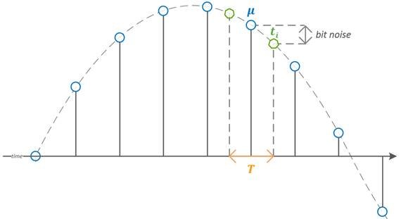

For example, in the case of a normal distribution of samples 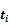 about the nominal sample , the absolute jitter  is defined as the following:

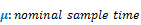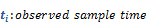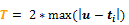

## Drift

We define drift as the percent difference between the nominal clock rate and the actual clock rate over a period of time sufficient to observe the drift.

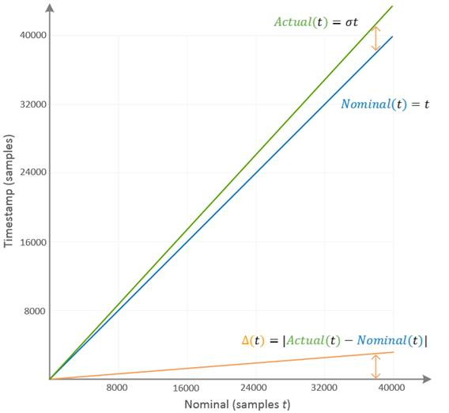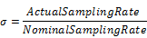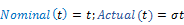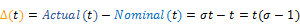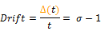

## Ambient Noise Gain

The isotropic ambient noise gain for a given frequency is the volume of the microphone array beam:

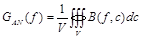

Where:

*V* is the microphone array work volume—that is, the set of all coordinates, 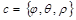 (direction, elevation, distance).

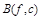 is the microphone array beam directivity pattern—that is, the gain as a function of the frequency and incident angle. An example for one frequency is shown on Figure 1. An example in one plane is shown on Figure 2.

The total ambient noise gain NG in decibels is given by:

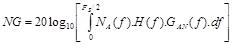

Where:

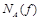 is the noise spectrum

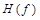 is the preamplifier frequency response (ideally flat between 200 and 7,000 Hz, with falling slopes from both sides going to zero at 80 and 7,500 Hz respectively).

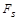 is the sampling rate (typically 16 kHz for voice applications).

Ambient noise gain gives the proportion of the noise floor RMS in relation to the output of the microphone array and to the output of an omnidirectional microphone. A lower value is better, and 0 dB means that the microphone array does not suppress ambient noise at all.

## A-Weighted Ambient Noise Gain

Because humans hear different frequencies differently, many acoustic parameters are weighted by using a standardized A-weighting function.

The A-weighted total ambient noise gain NGA in decibels is given by:

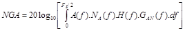

Where:

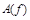 is the standard A-weighting function; other parameters are the same as above.

A-weighted ambient noise gain gives the proportion of the noise floor in relation to the output of the microphone array and to the output of an omnidirectional microphone as they would be compared by a human. In this case, -6 dB NGA means that a human would say that the noise on the output of a microphone array is half that of an omnidirectional microphone.

## Directivity Index

Another parameter to characterize the beamformer is the directivity index, *DI*.

In considering the following formula for calculating DI, note that cos *θ* is used when *θ* is defined to be -*π*/2 and *π*/2 at the poles, and 0 at the equator. These limits match the definitions of *φ* and *θ* in Appendix B of "How to Build and Use Microphone Arrays for Windows Vista," a companion document. And these limits also match the definitions for wHorizontalAngle (*φ*) and wVerticalAngle (*θ*) in the kernel streaming interface definitions.

This is the power function for a given frequency *f* and direction (*φ*, *θ*), with a fixed radius:

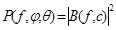, 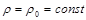

This is the average power over all directions (the whole sphere):

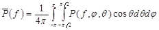

This is the power in the "best" direction, called the Main Response Axis:

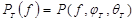

Dividing the power in the "best" direction by the average power gives an indication of directionality for a particular frequency. Averaging this ratio over all frequencies gives the Directivity Index.

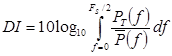

The directivity index characterizes how well the microphone array detects sound in the direction of the MRA while suppressing sounds that come from other directions, such as additional sound sources and reverberation. The DI is measured in decibels, where 0 dB means no directivity at all (omnidirectional microphone). A higher number means better directivity. An ideal cardioid microphone should have DI of 4.8 dB, but in practice cardioid microphones have a DI below 4.5 dB.

## Appendix B | References

<table>
<colgroup>
<col width="50%" />
<col width="50%" />
</colgroup>
<thead>
<tr class="header">
<th>Title</th>
<th>Link</th>
</tr>
</thead>
<tbody>
<tr class="odd">
<td>
<strong>Useful definitions and metrics</strong>
</td>
<td>
[http://www.rane.com/note145.html](http://www.rane.com/note145.mdl)
</td>
</tr>
<tr class="even">
<td>
<strong>Microphone Array Support in Windows</strong>
</td>
<td>
[http://msdn.microsoft.com/library/windows/hardware/dn613960.aspx](http://msdn.microsoft.com/library/windows/hardware/dn613960.aspx)
</td>
</tr>
<tr class="odd">
<td>
<strong>ITU-p.10 Reference Terms</strong>
</td>
<td>
[https://www.itu.int/rec/T-REC-P.10-200607-I/en](https://www.itu.int/rec/T-REC-P.10-200607-I/en)
</td>
</tr>
<tr class="even">
<td>
<strong>3GPPTerminal acoustic characteristics</strong>
</td>
<td>
[http://www.3gpp.org/DynaReport/26131.htm](http://www.3gpp.org/DynaReport/26131.md)
</td>
</tr>
<tr class="odd">
<td>
<strong>ETSI UMTS Speech telephony terminal acoustic test specification</strong>

(3GPP TS 26.132 version 11.4.0 Release 11)
</td>
<td>
[http://www.etsi.org/deliver/etsi_ts/126100_126199/126132/11.04.00_60/ts_126132v110400p.pdf](http://www.etsi.org/deliver/etsi_ts/126100_126199/126132/11.04.00_60/ts_126132v110400p.pdf)
</td>
</tr>
<tr class="even">
<td>
<strong>ETSI EG 202 396-1</strong>
</td>
<td>
[http://www.etsi.org/deliver/etsi_eg/202300_202399/20239601/01.02.02_60/eg_20239601v010202p.pdf](http://www.etsi.org/deliver/etsi_eg/202300_202399/20239601/01.02.02_60/eg_20239601v010202p.pdf)
</td>
</tr>
</tbody>
</table>

 

## Appendix C | MIC ARRAY GEOMETRY

This section describes the process in which one can develop a suitable microphone array geometry descriptor with a worked example. The content in this section is based on the following MSDN topics:

-   [Microphone Array Geometry Property](http://msdn.microsoft.com/library/windows/hardware/ff537516.aspx)
-   [Microphone Array Geometry Descriptor Format](https://msdn.microsoft.com/library/windows/hardware/ff537515.aspx)
-   [KSPROPERTY\_AUDIO\_MIC\_ARRAY\_GEOMETRY](https://msdn.microsoft.com/library/windows/hardware/ff537289.aspx)
-   [KSAUDIO\_MIC\_ARRAY\_GEOMETRY](https://msdn.microsoft.com/library/windows/hardware/ff537087.aspx) structure
-   [KSAUDIO\_MICROPHONE\_COORDINATES](https://msdn.microsoft.com/library/windows/hardware/ff537086.aspx) structure

Note that good mic array design is a function of many parameters other than just the number of mics, and is highly dependent on the device integration and usage. For design considerations and implementation guidelines (and many other very informative best practices), refer to Microphone Array Support in Windows <http://msdn.microsoft.com/library/windows/hardware/dn613960.aspx>.

The mic array descriptor is used to parameterize beamformer and sound source localizer behavior in the Microsoft, and 3rd party, speech enhancement pipelines. The audio driver must implement the [KSPROPERTY\_AUDIO\_MIC\_ARRAY\_GEOMETRY](https://msdn.microsoft.com/library/windows/hardware/ff537289.aspx) property. Then, the System.Devices.MicrophoneArray.Geometry property can be accessed via the Windows.Devices.Enumeration API. The USB audio driver will support this property for USB microphone arrays that have the appropriate fields set in the USB descriptor.

The Driver Configuration Verification tool can be used for verification on the device (OEMVerification tool provided in the toolchain).

## Example Application: Laptop with Front Facing, 2-Channel Mic Array

In this example, a laptop has two channels that are on the screen, near the top bezel and facing (ported) forwards:

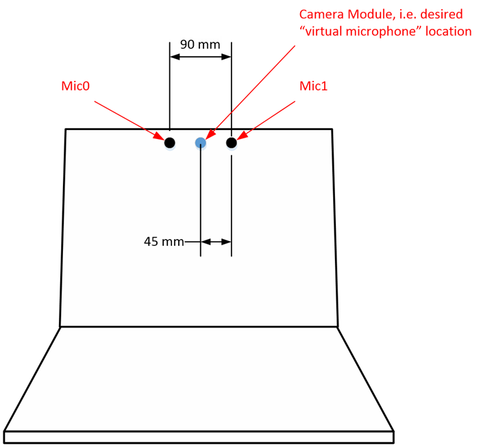

**Details:**

-   Mic0 is the leftmost microphone when facing the device and appears as Channel 1 in a multi-channel waveform. Note that this is applicable for this example and not necessarily required for all products.

-   Mic1 is the rightmost microphone when facing the device.

-   The microphones are separated by 90 mm physically on the device.

-   The desired "virtual microphone" is located at the camera position in this example (desired virtual microphone locations are at the discretion of IHVs). The virtual microphone is the origin around which beamforming and signal processing are defined. A general guideline would suggest placing this in the middle of the microphone array.

-   The microphone module is omni-directional, however when integrated and ported in this device, its polar response is closer to a sub-cardioid microphone type.

    <table>
    <colgroup>
    <col width="33%" />
    <col width="33%" />
    <col width="33%" />
    </colgroup>
    <thead>
    <tr class="header">
    <th>Value Name</th>
    <th>Polar Response</th>
    <th>Value for Geometry Descriptor</th>
    </tr>
    </thead>
    <tbody>
    <tr class="odd">
    <td>
KSMICARRAY_MICTYPE_OMNIDIRECTIONAL
</td>
    <td>
Omni directional
</td>
    <td>
0
</td>
    </tr>
    <tr class="even">
    <td>
KSMICARRAY_MICTYPE_SUBCARDIOID
</td>
    <td>
Sub cardioid
</td>
    <td>
1
</td>
    </tr>
    <tr class="odd">
    <td>
KSMICARRAY_MICTYPE_CARDIOID
</td>
    <td>
Cardioid
</td>
    <td>
2
</td>
    </tr>
    <tr class="even">
    <td>
KSMICARRAY_MICTYPE_SUPERCARDIOID
</td>
    <td>
Super cardioid
</td>
    <td>
3
</td>
    </tr>
    <tr class="odd">
    <td>
KSMICARRAY_MICTYPE_HYPERCARDIOID
</td>
    <td>
Hyper cardioid
</td>
    <td>
4
</td>
    </tr>
    <tr class="even">
    <td>
KSMICARRAY_MICTYPE_8SHAPED
</td>
    <td>
8-shaped
</td>
    <td>
5
</td>
    </tr>
    <tr class="odd">
    <td>
KSMICARRAY_MICTYPE_VENDORDEFINED
</td>
    <td>
0x0F
</td>
    <td>
0x0F
</td>
    </tr>
    </tbody>
    </table>

     

-   The microphones are all ported parallel to the x-axis (i.e., not pointing left or right, nor pointing up nor down). The coordinate system is illustrated below, where X points directly towards the user:

    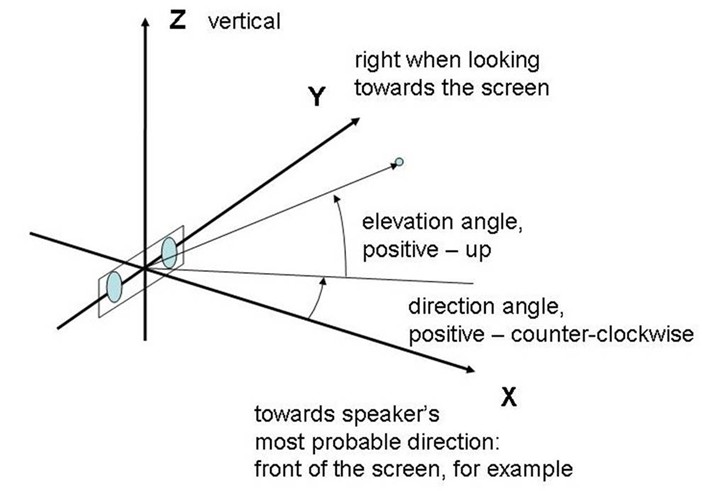

**Relevant Information for Geometry Descriptor:**

The KSAUDIO\_MICROPHONE\_COORDINATES structure would appear as follows:

<table style="width:100%;">
<colgroup>
<col width="14%" />
<col width="14%" />
<col width="14%" />
<col width="14%" />
<col width="14%" />
<col width="14%" />
<col width="14%" />
</colgroup>
<thead>
<tr class="header">
<th> </th>
<th>Mic Type</th>
<th>x</th>
<th>y</th>
<th>z</th>
<th>Elevation Angle</th>
<th>Direction Angle</th>
</tr>
</thead>
<tbody>
<tr class="odd">
<td>
<strong>Member Name</strong>
</td>
<td>
usType
</td>
<td>
wXCoord
</td>
<td>
xYCoord
</td>
<td>
wZCoord
</td>
<td>
wVerticalAngle
</td>
<td>
wHorizontalAngle
</td>
</tr>
<tr class="even">
<td>
<strong>Mic0</strong>
</td>
<td>
1
</td>
<td>
0
</td>
<td>
-45
</td>
<td>
0
</td>
<td>
0
</td>
<td>
0
</td>
</tr>
<tr class="odd">
<td>
<strong>Mic1</strong>
</td>
<td>
1
</td>
<td>
0
</td>
<td>
45
</td>
<td>
0
</td>
<td>
0
</td>
<td>
0
</td>
</tr>
</tbody>
</table>

 

-   The coordinates for Mic0 and Mic1 are relative to the virtual microphone, i.e., \[0,0,0\]. Therefore, the coordinates of these channels define where the origin, or virtual microphone would appear on the device.
-   Mic0 is 45mm to the left of the desired Y-Origin (Y = -45), and Mic1 is 45mm to the right of the desired Y-Origin (Y = 45). Their porting is also located at the same point along the x-axis, which is coincidental with the desired virtual microphone location (therefore X = 0 for both Mic0 and Mic1).
-   The microphones are both pointing forwards to the user (parallel to x-axis, perpendicular to y and z axes). Therefore, vertical and horizontal angles are both zero (like the virtual microphone). Note that the values used for angle are expressed in 1/10000th of a radian, e.g., +45 degrees = 0.7854 rad \*10000 = 7854.

When running the test toolchain, one should then see the following output in OEMVerificationOutput.txt:

 

The KSAUDIO\_MIC\_ARRAY\_GEOMETRY structure would appear as follows:

<table>
<colgroup>
<col width="25%" />
<col width="25%" />
<col width="25%" />
<col width="25%" />
</colgroup>
<thead>
<tr class="header">
<th>Field</th>
<th>Member Name</th>
<th>Example Description</th>
<th>Example Value</th>
</tr>
</thead>
<tbody>
<tr class="odd">
<td>
<strong>Version</strong>
</td>
<td>
usVersion
</td>
<td>
Version # of our Array
</td>
<td>
0x0100
</td>
</tr>
<tr class="even">
<td>
<strong>Array Type</strong>
</td>
<td>
usMicArrayType
</td>
<td>
Linear Array
</td>
<td>
0
</td>
</tr>
<tr class="odd">
<td>
<strong>Array Vertical Angle Start</strong>
</td>
<td>
wVerticalAngleBegin
</td>
<td>
-70°
</td>
<td>
-12217
</td>
</tr>
<tr class="even">
<td>
<strong>Array Vertical Angle End</strong>
</td>
<td>
wVerticalAngleEnd
</td>
<td>
+70°
</td>
<td>
12217
</td>
</tr>
<tr class="odd">
<td>
<strong>Array Horizontal Angle Start</strong>
</td>
<td>
wHorizontalAngleBeing
</td>
<td>
-70°
</td>
<td>
-12217
</td>
</tr>
<tr class="even">
<td>
<strong>Array Horizontal Angle End</strong>
</td>
<td>
wHorizontalAngleEnd
</td>
<td>
+70°
</td>
<td>
12217
</td>
</tr>
<tr class="odd">
<td>
<strong>Low Frequency</strong>
</td>
<td>
usFrequencyBandLo
</td>
<td>
Effective lowest frequency in Hz
</td>
<td>
100
</td>
</tr>
<tr class="even">
<td>
<strong>High Frequency</strong>
</td>
<td>
usFrequencyBandHi
</td>
<td>
Effective highest frequency in Hz
</td>
<td>
8000
</td>
</tr>
<tr class="odd">
<td>
<strong>Number of Microphones</strong>
</td>
<td>
usNumberOfMicrophones
</td>
<td>
# of Mics in our array
</td>
<td>
2
</td>
</tr>
</tbody>
</table>

 

## Appendix D | 2016 Requirements

This section shows the requirements present in previous versions of this document, valid for OS release in 2016. The corresponding test setup is the same as for 2017 release and can be referred to in the Test Setup Recommendations documentation. The scenario definitions found in Section 2 remain applicable.

## **LEGACY** Device.SpeechRecognition

Testing a specific device for good speech recognition. Test data should be applied against the requirements for the applicable test category. Consult the test setup recommendations for further details.

<table>
    <tr>
        <th rowspan="2">Release</th>
        <th rowspan="2">People</th>
        <th rowspan="2">Scenario</th>
        <th colspan="2">Standard</th>
    </tr>
    <tr>
        <th>0 degrees</th>
        <th>50 degrees</th>
    </tr>
    <tr>
        <td rowspan="3">2016</td>
        <td rowspan="3">Male, Female</td>
        <td>Quiet</td>
        <td>90%</td>
        <td>n/a</td>
    </tr>
    <tr>
        <td>Noise (Medium)</td>
        <td>85%</td>
        <td>n/a</td>
    </tr>
    <tr>
        <td>Echo</td>
        <td>85%</td>
        <td>n/a</td>
    </tr>
</table>

 

## **LEGACY** Device.VoiceActivationOEM

Testing a specific device for good voice recognition accuracy (i.e., "Hey Cortana"). Test data should be applied against the requirements for the applicable test category. Consult the test setup recommendations for further details. This test assumes that any OEM speech recognition technology meets the Device.SpeechRecognition requirements.

<table>
    <tr>
        <th rowspan="2">Release</th>
        <th rowspan="2">People</th>
        <th rowspan="2">Scenario</th>
        <th colspan="2">Standard</th>
    </tr>
    <tr>
        <th>0 degrees</th>
        <th>50 degrees</th>
    </tr>
    <tr>
        <td rowspan="3">2016</td>
        <td rowspan="3">Male, Female</td>
        <td>Quiet</td>
        <td>90%</td>
        <td>n/a</td>
    </tr>
    <tr>
        <td>Noise (Medium)</td>
        <td>90%</td>
        <td>n/a</td>
    </tr>
    <tr>
        <td>Echo</td>
        <td>90%</td>
        <td>n/a</td>
    </tr>
</table>

 

## **LEGACY** Device.VoiceActivation.CA.Platform

Testing a platform for voice recognition correct accepts. This test is not required to be run by OEMs. The Correct Accept test is run for every supported locale. The score is required to pass for Male and Female.

<table>
    <tr>
        <th rowspan="2">Release</th>
        <th rowspan="2">People</th>
        <th rowspan="2">Scenario</th>
        <th colspan="2">Standard</th>
    </tr>
    <tr>
        <th>0 degrees</th>
        <th>50 degrees</th>
    </tr>
    <tr>
        <td rowspan="3">2016</td>
        <td rowspan="3">Male, Female</td>
        <td>Quiet</td>
        <td>90%</td>
        <td>n/a</td>
    </tr>
    <tr>
        <td>Noise (Medium)</td>
        <td>90%</td>
        <td>n/a</td>
    </tr>
    <tr>
        <td>Echo</td>
        <td>90%</td>
        <td>n/a</td>
    </tr>
</table>
 

## **LEGACY** Device.VoiceActivation.FA.Platform

Testing a platform for voice recognition false accepts. This test is not required to be run by OEMs.

<table>
<colgroup>
<col width="50%" />
<col width="50%" />
</colgroup>
<thead>
<tr class="header">
<th>Release</th>
<th>People</th>
</tr>
</thead>
<tbody>
<tr class="odd">
<td>
2016
</td>
<td>
&lt;= 2 FA per 85 hours of continuous speech
</td>
</tr>
</tbody>
</table>

 

The False Accept test is run for every supported locale.

 

 

