# Speech Platform: Input Device Test Setup, version 2.1

 

 

**Microsoft Corporation Technical Documentation License Agreement (Standard)**

 

**READ THIS!** THIS IS A LEGAL AGREEMENT BETWEEN MICROSOFT CORPORATION ("MICROSOFT") AND THE RECIPIENT OF THESE MATERIALS, WHETHER AN INDIVIDUAL OR AN ENTITY ("YOU"). IF YOU HAVE ACCESSED THIS AGREEMENT IN THE PROCESS OF DOWNLOADING MATERIALS ("MATERIALS") FROM A MICROSOFT WEB SITE, BY CLICKING "I ACCEPT", DOWNLOADING, USING OR PROVIDING FEEDBACK ON THE MATERIALS, YOU AGREE TO THESE TERMS. IF THIS AGREEMENT IS ATTACHED TO MATERIALS, BY ACCESSING, USING OR PROVIDING FEEDBACK ON THE ATTACHED MATERIALS, YOU AGREE TO THESE TERMS.
1.  For good and valuable consideration, the receipt and sufficiency of which are acknowledged, You and Microsoft agree as follows:

    -   If You are an authorized representative of the corporation or other entity designated below ("**Company**"), and such Company has executed a Microsoft Corporation Non-Disclosure Agreement that is not limited to a specific subject matter or event ("**Microsoft NDA**"), You represent that You have authority to act on behalf of Company and agree that the Confidential Information, as defined in the Microsoft NDA, is subject to the terms and conditions of the Microsoft NDA and that Company will treat the Confidential Information accordingly;

    -   If You are an individual, and have executed a Microsoft NDA, You agree that the Confidential Information, as defined in the Microsoft NDA, is subject to the terms and conditions of the Microsoft NDA and that You will treat the Confidential Information accordingly; or

    -   If a Microsoft NDA has not been executed, You (if You are an individual), or Company (if You are an authorized representative of Company), as applicable, agrees: (a) to refrain from disclosing or distributing the Confidential Information to any third party for five (5) years from the date of disclosure of the Confidential Information by Microsoft to Company/You; (b) to refrain from reproducing or summarizing the Confidential Information; and (c) to take reasonable security precautions, at least as great as the precautions it takes to protect its own confidential information, but no less than reasonable care, to keep confidential the Confidential Information. You/Company, however, may disclose Confidential Information in accordance with a judicial or other governmental order, provided You/Company either (i) gives Microsoft reasonable notice prior to such disclosure and to allow Microsoft a reasonable opportunity to seek a protective order or equivalent, or (ii) obtains written assurance from the applicable judicial or governmental entity that it will afford the Confidential Information the highest level of protection afforded under applicable law or regulation. Confidential Information shall not include any information, however designated, that: (i) is or subsequently becomes publicly available without Your/Company's breach of any obligation owed to Microsoft; (ii) became known to You/Company prior to Microsoft's disclosure of such information to You/Company pursuant to the terms of this Agreement; (iii) became known to You/Company from a source other than Microsoft other than by the breach of an obligation of confidentiality owed to Microsoft; or (iv) is independently developed by You/Company. For purposes of this paragraph, "Confidential Information" means nonpublic information that Microsoft designates as being confidential or which, under the circumstances surrounding disclosure ought to be treated as confidential by Recipient. "Confidential Information" includes, without limitation, information in tangible or intangible form relating to and/or including released or unreleased Microsoft software or hardware products, the marketing or promotion of any Microsoft product, Microsoft's business policies or practices, and information received from others that Microsoft is obligated to treat as confidential.

2.  You may review these Materials only (a) as a reference to assist You in planning and designing Your product, service or technology ("Product") to interface with a Microsoft Product as described in these Materials; and (b) to provide feedback on these Materials to Microsoft. All other rights are retained by Microsoft; this agreement does not give You rights under any Microsoft patents. You may not (i) duplicate any part of these Materials, (ii) remove this agreement or any notices from these Materials, or (iii) give any part of these Materials, or assign or otherwise provide Your rights under this agreement, to anyone else.

3.  These Materials may contain preliminary information or inaccuracies, and may not correctly represent any associated Microsoft Product as commercially released. All Materials are provided entirely "AS IS." To the extent permitted by law, MICROSOFT MAKES NO WARRANTY OF ANY KIND, DISCLAIMS ALL EXPRESS, IMPLIED AND STATUTORY WARRANTIES, AND ASSUMES NO LIABILITY TO YOU FOR ANY DAMAGES OF ANY TYPE IN CONNECTION WITH THESE MATERIALS OR ANY INTELLECTUAL PROPERTY IN THEM.

4.  If You are an entity and (a) merge into another entity or (b) a controlling ownership interest in You changes, Your right to use these Materials automatically terminates and You must destroy them.

5.  You have no obligation to give Microsoft any suggestions, comments or other feedback ("Feedback") relating to these Materials. However, any Feedback you voluntarily provide may be used in Microsoft Products and related specifications or other documentation (collectively, "Microsoft Offerings") which in turn may be relied upon by other third parties to develop their own Products. Accordingly, if You do give Microsoft Feedback on any version of these Materials or the Microsoft Offerings to which they apply, You agree: (a) Microsoft may freely use, reproduce, license, distribute, and otherwise commercialize Your Feedback in any Microsoft Offering; (b) You also grant third parties, without charge, only those patent rights necessary to enable other Products to use or interface with any specific parts of a Microsoft Product that incorporate Your Feedback; and (c) You will not give Microsoft any Feedback (i) that You have reason to believe is subject to any patent, copyright or other intellectual property claim or right of any third party; or (ii) subject to license terms which seek to require any Microsoft Offering incorporating or derived from such Feedback, or other Microsoft intellectual property, to be licensed to or otherwise shared with any third party.

6.  Microsoft has no obligation to maintain confidentiality of any Microsoft Offering, but otherwise the confidentiality of Your Feedback, including Your identity as the source of such Feedback, is governed by Your NDA.

7.  This agreement is governed by the laws of the State of Washington. Any dispute involving it must be brought in the federal or state superior courts located in King County, Washington, and You waive any defenses allowing the dispute to be litigated elsewhere. If there is litigation, the losing party must pay the other party's reasonable attorneys' fees, costs and other expenses. If any part of this agreement is unenforceable, it will be considered modified to the extent necessary to make it enforceable, and the remainder shall continue in effect. This agreement is the entire agreement between You and Microsoft concerning these Materials; it may be changed only by a written document signed by both You and Microsoft.

 

## SECTION 0 | DISCLAIMER

**Disclaimer**: This document is provided "as-is". Information and views expressed in this document, including URL and other Internet website references, may change without notice. Some information relates to pre-released products which may be substantially modified before commercially released. Microsoft makes no warranties, express or implied, with respect to the information provided here. You bear the risk of using it.

Some examples depicted herein are provided for illustration only and are fictitious. No real association or connection is intended or should be inferred.

All recommendations and criteria within this document are approximate guidelines only, and not guarantees of speech recognition performance for all devices under real-world conditions. Speech recognition is a complex machine learning process, imperfect by nature. It is not guaranteed that Cortana and Speech Recognition will work well for your device, even if all premium recommendations are met.

### Definitions

The following acronyms and definitions are used in this specification.

<table>
<colgroup>
<col width="50%" />
<col width="50%" />
</colgroup>
<thead>
<tr class="header">
<th>TITLE</th>
<th>DEFINITION</th>
</tr>
</thead>
<tbody>
<tr class="odd">
<td>
<strong>ANSI</strong>
</td>
<td>
American National Standards Institute
</td>
</tr>
<tr class="even">
<td>
<strong>BGN</strong>
</td>
<td>
Background Noise
</td>
</tr>
<tr class="odd">
<td>
<strong>DAW</strong>
</td>
<td>
Digital Audio Workstation
</td>
</tr>
<tr class="even">
<td>
<strong>dB(A) or dBSPL(A)</strong>
</td>
<td>
decibels Sound Pressure Level, A-Weighted

Where level = 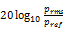, 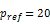 μPa. A-Weighting per IEC 61672:2003 standard.
</td>
</tr>
<tr class="odd">
<td>
<strong>dBFS (or dBov)</strong>
</td>
<td>
Decibel full scale =  where <em>Sref</em> = the RMS of a full scale digital sine wave.

The signal level of a digital signal relative to its overload or maximum level is given by dBov. This is also commonly referred to as dBFS (Full Scale).

For example, a rectangular function with only the positive or negative maximum number has a level of 0 dBov; For a maximum scale digital sine signal the peak level is 0 dBov and RMS is -3.01 dBov. (ITU-T G.100.1).
</td>
</tr>
<tr class="even">
<td>
<strong>DUT</strong>
</td>
<td>
Device Under Test
</td>
</tr>
<tr class="odd">
<td>
<strong>ETSI</strong>
</td>
<td>
European Telecommunications Standards Institute
</td>
</tr>
<tr class="even">
<td>
<strong>HATS</strong>
</td>
<td>
Head and Torso Simulator - described in ITU-T Recommendation P.58
</td>
</tr>
<tr class="odd">
<td>
<strong>HMD</strong>
</td>
<td>
Head Mounted Device (e.g., headsets, virtual reality or augmented reality headsets)
</td>
</tr>
<tr class="even">
<td>
<strong>IEC</strong>
</td>
<td>
International Electrotechnical Commission
</td>
</tr>
<tr class="odd">
<td>
<strong>IHV</strong>
</td>
<td>
Independent Hardware Vendor
</td>
</tr>
<tr class="even">
<td>
<strong>ITU</strong>
</td>
<td>
International Telegraph Union

UN agency for information and communication standards
</td>
</tr>
<tr class="odd">
<td>
<strong>KWS</strong>
</td>
<td>
Key Word Spotter
</td>
</tr>
<tr class="even">
<td>
<strong>LA</strong><strong>eq</strong>
</td>
<td>
Equivalent Continuous Sound Pressure Level, A-Weighted, evaluated over time, containing the same energy as the time-varying sound.
</td>
</tr>
<tr class="odd">
<td>
<strong>LRP</strong>
</td>
<td>
Listener Reference Point

The position of a user's ear relative, and subsequently, measurement microphone for a device under test. If HATS is used, this is the drum reference point.
</td>
</tr>
<tr class="even">
<td>
<strong>MRP</strong>
</td>
<td>
Mouth Reference Point

Location 25mm in front of the lip plane of the artificial mouth, and location in which speech level is calibrated. See ITU-T P.51 or manufacturer specifications for more details.
</td>
</tr>
<tr class="odd">
<td>
<strong>SLM</strong>
</td>
<td>
Sound Level Meter
</td>
</tr>
</tbody>
</table>

 

## SECTION 1 | PURPOSE

The Speech Platform powers all of the speech experiences in Windows 10 such as Cortana and Dictation.

This document provides testing setup recommendations for audio input devices intended for use with Microsoft’s Speech Platform. 
Recommendations provided are limited to design parameters that directly influence:

1. Speech Recognition Accuracy
2. Behavior of Speech Processing Algorithms

The recommendations in this document *are not part of a logo program, nor are required for device certification*. Instead, the contents of this document are intended to provide helpful guidelines and best practices for device design.

## SECTION 2 | TEST CONDITIONS

The test conditions define the environment parameters and equipment capabilities recommended when measuring devices according to the Speech Platform Input Device Recommendations.

### Test Equipment

The following test equipment is required in order to perform the test cases described by **Device.SpeechRecognition** and **Device.VoiceActivationOEM**:

<table>
<tr>
<th>Test Equipment</th>
<th>Requirement</th>
<th>Recommended Solution</th>
</tr>
<tr>
    <td>Measurement Microphone</td>
    <td>Free Field; Class 1 (IEC 61672)</td>
    <td>NTI M2230</td>
</tr>
<tr>
    <td>Sound Level Meter (SLM)</td>
    <td>IEC 61672-1</td>
    <td>NTI XL2</td>
</tr>
<tr>
    <td>Mouth Simulator + Amplifier</td>
    <td rowspan="2">ITU-T Rec. P.51   +-0.5 dB, 160-8k Hz, 3rd Octave</td>
    <td>B&amp;K 4227A/GRAS 44AB (built-in amps)</td>
</tr>
<tr>
    <td><i>EQ for Mouth Simulator</i></td>
    <td>31-Band Graphic EQ</td>
</tr>
<tr>
    <td>BGN Speakers + Amplifiers (x4)</td>
    <td rowspan="2">+-3 dB, 160-8k Hz, 3rd Octave</td>
    <td>Neumann KH120 A (active)</td>
</tr>
<tr>
    <td><i>EQ for speakers (x4)</i></td>
    <td>31-Band Graphic EQ</td>
</tr>
<tr>
    <td>Multichannel Soundcard</td>
    <td>5+ Channels Output</td>
    <td>RME Fireface 802 or UFX</td>
</tr>
</table>

The requirements for test equipment connectivity and signal flow are illustrated below:

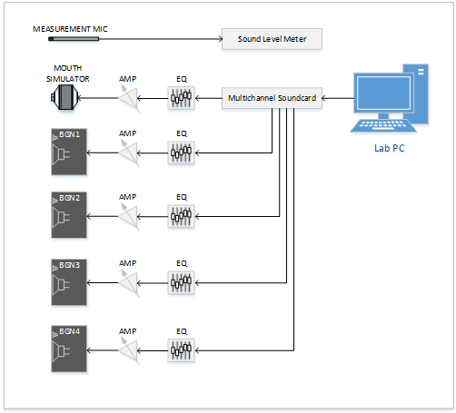

### Test Environment

For tests performed against **Device.SpeechRecognition** and **Device.VoiceActivationOEM**, a reverberant room that follows the guidelines below is required:

<table>
<colgroup>
<col width="50%" />
<col width="50%" />
</colgroup>
<thead>
<tr class="header">
<th>Test Environment</th>
<th>Recommendation</th>
</tr>
</thead>
<tbody>
<tr class="odd">
<td>
<strong>Dimensions</strong>
</td>
<td>
<strong>Min</strong>: 2.7m x 3.7m, <strong>Max</strong>: 3.5m x 4.4m, <strong>Height:</strong>&gt; 2.2m
</td>
</tr>
<tr class="even">
<td>
<strong>Noise Floor</strong>
</td>
<td>
<strong>Target</strong>&lt; 28 dBSPL(A), <strong>Max</strong> 35 dBSPL(A)
</td>
</tr>
<tr class="odd">
<td>
<strong>Reverberation Time</strong>
</td>
<td>
0.15s <= <strong>RT60avg</strong><= 0.4s, Octave Bands 125-8000Hz  Within the limits defined by the graph and table below:
</td>
</tr>
</tbody>
</table>

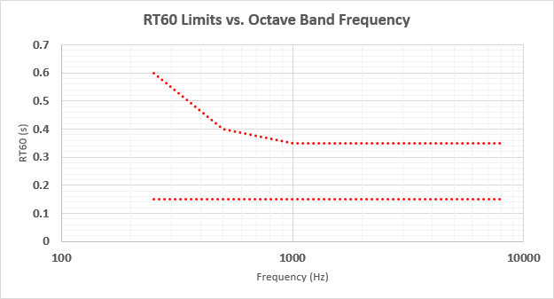

<table>
    <tr>
        <th>Octave Band (Hz)</th>
        <th>Lower Limit (ms)</th>
        <th>Upper Limit (ms)</th>
    </tr>
    <tr>
        <td>250</td>
        <td rowspan="6">150</td>
        <td>600</td>
    </tr>
    <tr>
        <td>500</td>
        <td>400</td>
    </tr>
    <tr>
        <td>1000</td>
        <td rowspan="4">350</td>
    </tr>
    <tr>
        <td>2000</td>
    </tr>
    <tr>
        <td>4000</td>
    </tr>
    <tr>
        <td>8000</td>
    </tr>
</table>

This room definition is based on the [ETSI ES 202 396-1 : Section 6](http://aka.ms/es202-396-1) specification, with slight modifications that include a reduced upper limit for reverberation time.  Reverberation time can be reduced through the installation of removable or fixed absorptive (i.e. acoustic foam) panels covering reflective surfaces.

For tests performed against **Device.Audio.Acoustics**, an anechoic chamber is recommended.

### Test Room Setup Topology

The required test setup is shown below:

**Top View:**

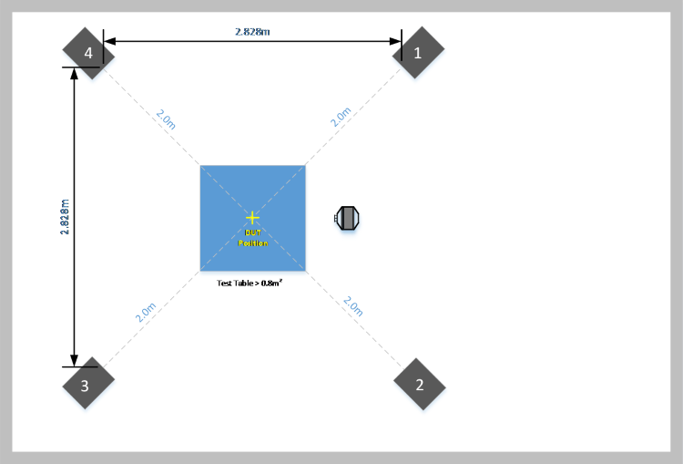

**DUT Position** is 30cm above the center of the table, while maintaining a 2m distance from each BGN speaker.

The side view of BGN test setup and microphone calibration position (i.e. "DUT Position" is shown below):

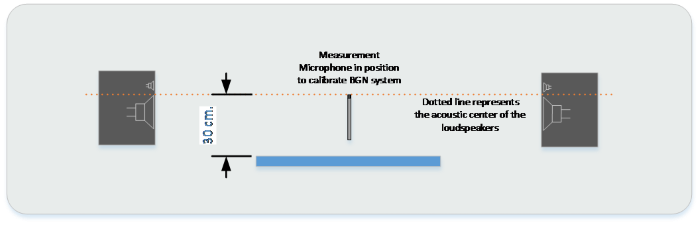

Consult the manufacturer specifications to determine the acoustic center of BGN loudspeakers. 

## SECTION 3 | TEST EQUIPMENT CALIBRATION

This section describes the process to calibrate test equipment as configured per Section 2.

### Calibration files

Two 6-channel calibration files are provided in order to equalize and adjust playback levels for both the mouth simulator and the background noise speakers.  The channel mapping requirements for these two files is as follows:

| .WAV File Output Channel | Mapping/Connection | Purpose                         |
| ------------------------ | ------------------ | ------------------------------- |
| 1                        | Mouth Simulator    | Speech/Talker Material Playback |
| 2                        | &lt;none&gt;       | Intentionally Empty             |
| 3                        | BGN 1              | BGN Playback, Speaker 1         |
| 4                        | BGN 2              | BGN Playback, Speaker 2         |
| 5                        | BGN 3              | BGN Playback, Speaker 3         |
| 6                        | BGN 4              | BGN Playback, Speaker 4         |

### Calibration Procedure

The following steps describe how to calibrate the equipment for Speech Platform testing:

<table>
    <tr>
        <th>STEP 1</th>
        <th>VERIFY ROOM NOISE FLOOR</th>
    </tr>
    <tr>
        <td>MEASURE</td>
        <td>
            <ol>
                <li>Position the Measurement Mic (connected to SLM) @ DUT Position</li>
                <li>On the SLM, run the LAeq for > 30s</li>
                <li>Ensure that the room noise floor is:
                    <ul><li><b>Target</b> < 28 dBSPL(A), <b>Max</b> 35 dBSPL(A)</li></ul></li>
            </ol>
        </td>
    </tr>
</table>

<table>
    <tr>
        <th>STEP 2</th>
        <th>MOUTH SIMULATOR</th>
    </tr>
    <tr>
        <td>SETUP</td>
        <td>
            <ol>
                <li>Position the Measurement Mic (connected to SLM) @ MRP</li>
                <li><b>MUTE Output Channels 2 to 6</b> of the Multichannel Soundcard</li>
            </ol>
        </td>
    </tr>
    <tr>
        <td>EQUALIZATION</td>
        <td>
            <ol>
                <li>Play back (in looped mode) the file <i>"EQCalibration.wav"</i> via the LabPC:</li>
                <li>On the SLM, run LAeq for > 30s and adjust soundcard output to achieve ~ 89 dB(A)</li>
                <li>On the SLM, run the 1/3rd Octave RTA Measurement</li>
                <li>Adjust the EQ connected to the mouth simulator in order to achieve:
                    <ul><li><b>± 0.5 dB, 160-8000Hz per 3rd Octave Band</b></li></ul></li>
            </ol>
        </td>
    </tr>
    <tr>
        <td>LEVEL CALIBRATION</td>
        <td>
            <ol>
                <li>Play back (in looped mode) the file <i>"LevelCalibration.wav"</i> via the LabPC:</li>
                <li>On the SLM, run LAeq for > 30s and adjust playback level to achieve 89 ± 0.5 dB(A)</li>
            </ol>
        </td>
    </tr>
</table>

<table>
    <tr>
        <th>STEP 3</th>
        <th>BACKGROUND NOISE SYSTEM</th>
    </tr>
    <tr>
        <td>SETUP</td>
        <td>
            <ol>
                <li>Position the Measurement Mic (connected to SLM) @ DUT Position (per Section 2)</li>
            </ol>
        </td>
    </tr>
    <tr>
        <td>EQUALIZATION</td>
        <td>
            <ol>
                <li><b>MUTE all Output Channels except for BGN Speaker 1</b> (e.g. Channel 3)</li>
                <li>Play back (in looped mode) the file <i>"EQCalibration.wav"</i> via the LabPC:</li>
                <li>On the SLM, run LAeq for > 30s and adjust soundcard output to achieve ~ 57 dB(A)</li>
                <li>On the SLM, run the 1/3rd Octave RTA Measurement</li>
                <li>Adjust the EQ connected to the mouth simulator in order to achieve:
                    <ul><li><b>± 3 dB, 160-8000Hz per 3rd Octave Band</b></li></ul></li>
                <li>Repeat for each additional individual BGN Speaker channel by <b>unmuting the channel under test and muting all of the remaining channels</b></li>
            </ol>
        </td>
    </tr>
    <tr>
        <td>LEVEL MATCHING</td>
        <td>
            <ol>
                <li><b>MUTE all Output Channels except for BGN Speaker 1</b> (e.g. Channel 3)</li>
                <li>Play back (in looped mode) the file <i>"LevelCalibration.wav"</i> via the LabPC:</li>
                <li>On the SLM, run LAeq for > 30s and adjust soundcard output to achieve 51 ± 0.5 dB(A)</li>
                <li>Repeat for each additional individual BGN Speaker channel by <b>unmuting the channel under test and muting all of the remaining channels</b></li>
            </ol>
        </td>
    </tr>
    <tr>
        <td>LEVEL CALIBRATION</td>
        <td>
            <ol>
                <li><b>MUTE Output Channels 1+2</b></li>
                <li>Play back (in looped mode) the file <i>"LevelCalibration.wav"</i> via the LabPC:</li>
                <li>On the SLM, run LAeq for > 30s and adjust output level of Multichannel Soundcard equally for Channels 3-6 to achieve 57 ± 0.5 dB(A)</li>
            </ol>
            
<b>NOTE:</b> The Level Calibration should step should apply the same gain change to each channel.  The level matching of each channel (individually) shall be preserved.

        </td>
    </tr>
</table>

## SECTION 4 | TEST SIGNALS AND LEVELS

This section describes the stimulus signals used during tests against the Speech Platform Recommendations.

### Test Signals

The test signals required to validate a device against the Speech Platform are listed in the table below:

**Device.SpeechRecognition** Test Cases:

| Stimulus               | Generator         | Filename                    | Channel(s) |
| ---------------------- | ----------------- | --------------------------- | ---------- |
| Speech Accuracy Talker | Mouth Simulator   | SpeechTalkerAndAmbient.wav* | 1          |
| Ambient Noise Playback | BGN System        | SpeechTalkerAndAmbient.wav* | 3-6        |
| Echo Playback          | Device Under Test | Echo.wav                    | 1+2        |
*Created using MH Acoustics Technology

**Device.VoiceActivationOEM** Test Cases:

| Stimulus                | Generator       | Filename                 | Channel(s) |
| ----------------------- | --------------- | ------------------------ | ---------- |
| Voice Activation Talker | Mouth Simulator | KWSTalkerAndAmbient.wav* | 1          |
| Ambient Noise Playback  | BGN System      | KWSTalkerAndAmbient.wav* | 3-6        |
| Echo Playback           | DUT Speakers    | Echo.wav                 | 1+2        |
*Created using MH Acoustics Technology

### Verify Mouth Simulator Level @ DUT Position

Each test scenario in the speech platform specification has a defined talker level at MRP.  In order to ensure lab alignment with the specification and room requirements, an additional verification step will calibrate the level of the mouth simulator at the DUT Position.

Adjust the talker level at the MRP, and then verify at the DUT position.  Adjust the mouth simulator level at the DUT position accordingly to match the results in the "Step 2" column in the table below:

| **Category**         | **Step 1: Verify Talker Level @ MRP** | **Step 2: Verify (and Adjust) Talker Level @ DUT Position** |
| -------------------- | ------------------------------------- | ----------------------------------------------------------- |
| **Near Field, 0.5m** | 89 ± 0.5 dBSPL(A)                     | 68 ± 0.5 dBSPL(A)                                           |
| **Near Field, 0.8m** | 89 ± 0.5 dBSPL(A)                     | 62 ± 0.5 dBSPL(A)                                           |
| **Far Field, 2m**    | 95 ± 0.5 dBSPL(A)                     | 63 ± 0.5 dBSPL(A)                                           |
| **HMD**              | 89 ± 0.5 dBSPL(A)                     | N/A                                                         |

If the results in Step 2 are very different than the requirements in the table above, ensure that the mouth simulator has been appropriately equalized and calibrated by the equipment manufacturer, and ensure that the requirements for the test room in Section 2 are met.

### Adjust Echo Playback Level @ Listener Reference Position

Each device scenario in the speech platform specification has a defined level and listener reference position for calibrating the level of echo playback.

Position the measurement microphone at the LRP, as shown in Section 5.

Echo is calibrated by playing back the file EchoCalibration.wav on a device for 30s, and measured using LAeq (dBSPL(A)).

| **Category**         | **Listener Reference Position (LRP)** | **Echo Level, dBSPL(A)\*** |
| -------------------- | ------------------------------------- | -------------------------- |
| **Near Field, 0.5m** | 0.5m                                  | 70                         |
| **Near Field, 0.8m** | 0.8m                                  | 70                         |
| **Far Field, 2m**    | 0.8m                                  | 70                         |
| **HMD**              | HATS Right Ear DRP**                  | 76                         |
\***NOTE:** devices that cannot meet 70 dB(A) @ LRP must be set to max. volume and be ≥ 64 dB(A) to pass.

\*\***NOTE:** No correction filters shall be applied (e.g. DRP/ERP, Diffuse Field, Free Field, ID, etc.)

## SECTION 5 | TEST POSITIONS

**The DUT shall be placed relative to the MRP and LRP, during all tests, in what is deemed to be a typical ("normal") scenario/use case.  However, the minimum distance for a typical tablet/laptop is to be 50cm.**

The IHV owns the scenarios for their device. The recommendations here are intended to provide the IHV with guidelines to validate their device against speech recognition functionality. _Each device only needs to be evaluated against one chosen test position and associated requirements (near field standard, near field premium or far field premium)_, though IHVs may find use in experimenting with various positions.

Scenario definition includes considerations like the following:

-	Distance of MRP to microphone (array)
-	Orientation of MRP to microphone (array)
-	Placement of the boom arm on headset devices
-	Coverage/pressure of the earpiece(s) on the ear simulators for headset devices 
-	Location of loudspeaker(s) relative to the microphones and HATS
-	Device placement environment e.g. on a table, in free air, on a TV, on a HATS

For additional guidance on typical device usage modality and test setups, reference Section 5 in the Skype / Lync Audio Specification [http://technet.microsoft.com/en-us/office/dn788953](http://technet.microsoft.com/en-us/office/dn788953)

### Standard Near Field (0.5m) Test Positions

Laptop or similar devices shall be positioned on a tabletop surface relative to MRP as shown below:

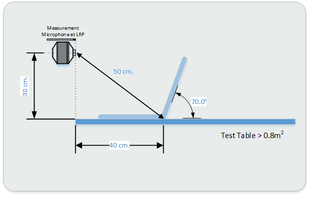

For webcam devices tested as standard near field category, the following setup shall be used, with the constraint that the height of the monitor that the webcam rests upon is no taller than 50cm and the webcam is centered in its typical resting position on top of the screen (e.g. a 27" monitor is recommended):

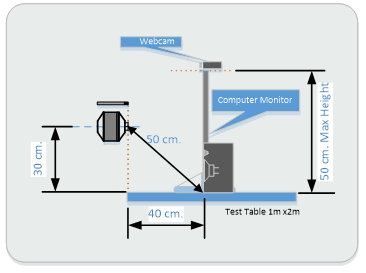

In order to test echo scenarios, stereo speakers are required.  However, they must not be separated any further than 76cm from inner edge to inner edge.  For best results, low distortion, high bandwidth speakers (e.g. Neumann KH120) are recommended that are driven by a test PC with a low latency interface (e.g. Surface Pro 4 headset jack "line out" to self-powered speakers such as the Neumann KH120).  The SDNR recommendations as described in Audio.Acoustics within the Speech Platform Recommendations may be used to assess suitability for measurement.

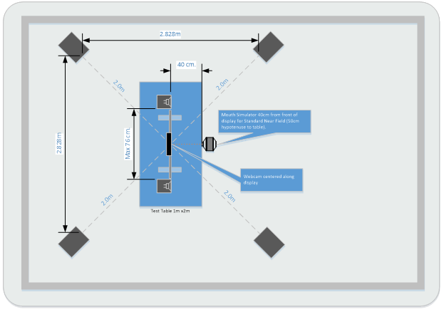

### Premium Near Field (0.8m) Test Positions

When choosing to test laptops against the premium near-field specification, the test setup shall be as below, with the test distance of 80cm aligned with the hinge fulcrum of the laptop/detachable PC:

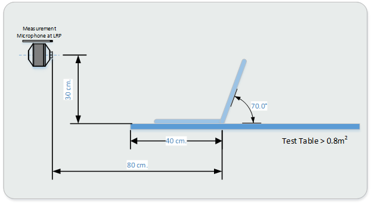

All-in-One or Desktop PCs with integrated microphone arrays shall be tested at a distance of 80cm from MRP and LRP to the front of the display, on a table as shown below:

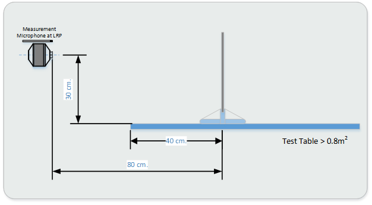

For webcam devices tested as premium near field category, the following setup shall be used, with the constraint that the height of the monitor that the webcam rests upon is no taller than 50cm and the webcam is centered in its typical resting position on top of the screen (e.g. a 27" monitor is recommended):

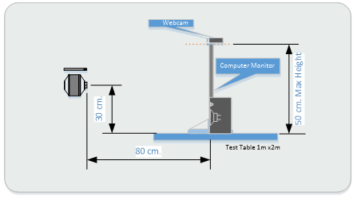

In order to test echo scenarios, stereo speakers are required.  However, they must not be separated any further than 76cm from inner edge to inner edge.  For best results, low distortion, high bandwidth speakers (e.g. Neumann KH120) are recommended that are driven by a test PC with a low latency interface (e.g. Surface Pro 4 headset jack "line out" to self-powered speakers such as the Neumann KH120).  The SDNR recommendations as described in Audio.Acoustics within the Speech Platform Recommendations may be used to assess suitability for measurement.  

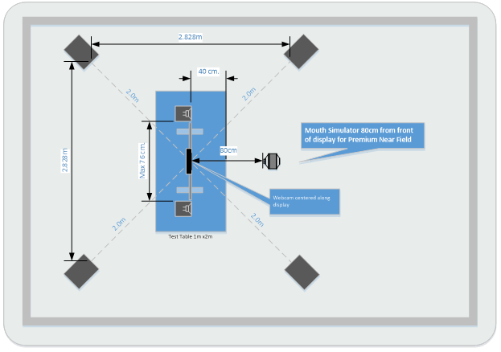

### Head Mounted Devices

An ITU-T P.58 compliant HATS is recommended for testing Head Mounted Devices (HMDs).  

Headsets and Head Mounted Devices will be placed on HATS and adjusted to resemble, as closely as possible, the positioning on a real human. For movable microphones (e.g. "booms"), the microphone should be placed as close as the design will reasonably allow to MRP.

For headset devices, the earpiece should be coupled with the HATS ear in a typical wearing position with an effort to center the earpiece over the drum reference point and maintain a seal around the pinna.

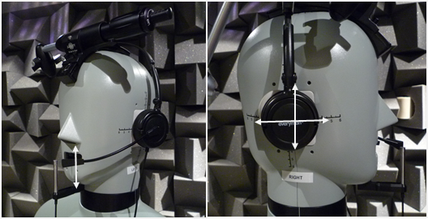

For Virtual/Augmented Reality devices, the device should be placed as per a normal wearing position.  It is recommended that the tester provide a means of documenting or marking the wearing position on HATS as to ensure repeatability.

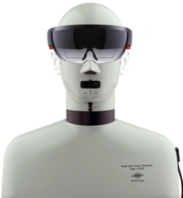

### Premium Far Field (4m) Devices

Far field (i.e. 4m) devices such as integrated mic arrays in a screen device, mic arrays which sit on top of a screen or surface shall be tested as shown below, with the test distance from MRP and LRP to the front plane of the screen or mic array at 4m:

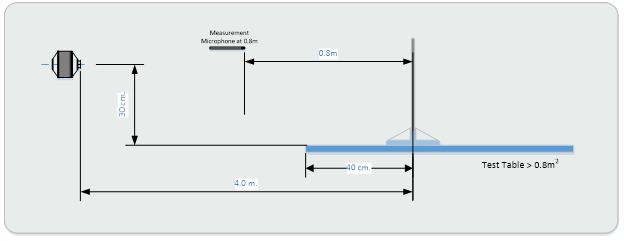

The specification defines test cases for devices intended for use in far field (i.e. 4m) conditions.  As many test environments may not be sufficiently large to test in 4m, a 2m test distance can be used with test signals/levels adjusted to simulate a 4m test distance as described.  The test setup when using the 2m (simulated 4m) test setup is simply modified as below:

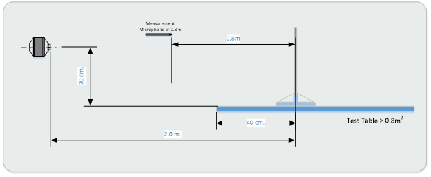

### FA Test Setup Topology

The recommended setup for conducting false accept (FA) testing is illustrated in the diagram below.  The device is centered in the table as described per device categories in previous sections:

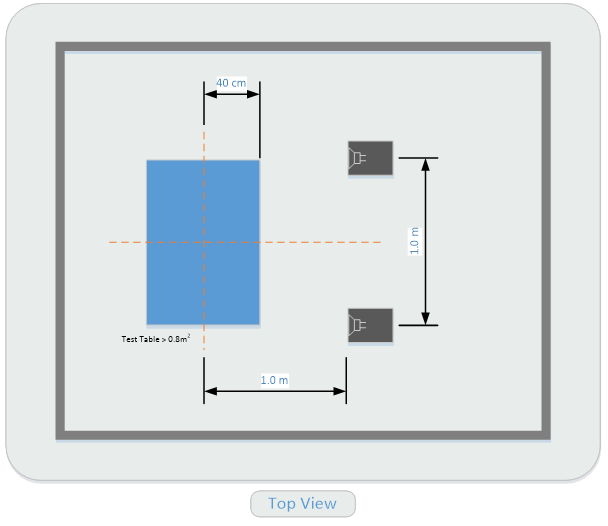

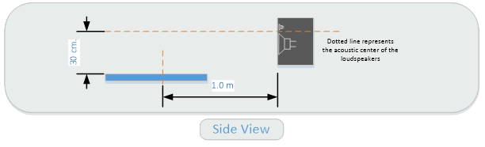

 

## SECTION 6 | MEASUREMENT PROCEDURE

The following section contains the procedure to for testing a device against the **Device.SpeechRecognition** and **Device.VoiceActivationOEM** recommendations.

### Preparing for testing

The **OEMverificationx86** application is a tool that indicates which test script the system is currently configured to use. The tool is used as follows:

1. Copy the files from the toolchain folder _"SpeechPlatform-OnLabPC"_ to the test room Lab PC.
2. Copy the files from the toolchain folder _"SpeechPlatform-OnDevice"_ to the DUT PC.
3. Install the score utility (see Appendix B) on an x64 Win8.x/Win10 machine (not the DUT PC).
4. Ensure test equipment is set up as described in Section 2.
5. Ensure test equipment is calibrated as described in Section 3.
6. Ensure the test signal levels are set appropriately for the desired test scenario as described in Section 4.
7. Position the device under test as described in Section 5.
8. Ensure that the device under test is configured with the correct and intended geometry descriptor information, default processing pipeline, and default mic gain. See the Speech Platform Input Device Recommendations 

### Device.SpeechRecognition | Test Procedure

1. Mute the output channels for each scenario as described in the table below
2. On the DUT PC, run **SpeechRecordings.cmd _foldername_**, where *_foldername_* is a user-specified unique session for each iteration of a scenario described in the table below.
3. On the Lab PC, play back SpeechTalkerAndAmbient.wav within ~3s of starting the recording
4. For ECHO SCENARIOS ONLY, play back Echo.wav on the DUT PC.

**NOTE: Echo playback must not start until 1-2s after the alignment chirp plays back from the speech input file!**

| **Scenario**   | **Lab PC Output Channels MUTED** | **DUT Echo File Playback**             |
| -------------- | -------------------------------- | -------------------------------------- |
| **Quiet**      | 3-6                              | No                                     |
| **Noise**      | None                             | No                                     |
| **Echo**       | 3-6                              | Yes, 1-2s after Talker Alignment Chirp |
| **Echo+Noise** | None                             | Yes, 1-2s after Talker Alignment Chirp |

Note: The script **ScriptRecordings.cmd** is used to capture the default processed data from the device. For OEMs who wish to conduct experiments for offline processing on unprocessed data, the script **RawRecordings.cmd** is provided. Unprocessed data should not be scored and evaluate against this specification.

### Device.SpeechRecognition | Generating Test Results

1. Create a folder where the scoring results output shall be saved
2. From that folder, open a command prompt
3. Type **score _parent foldername_**, where _parent foldername_ contains individual session sub-folders to be scored
 

### Preparing DUT for Device.VoiceActivationOEM

The following additional steps must be followed to prepare a device for Device.VoiceActivationOEM testing:

1. Set up the DUT PC with Cortana signed in to a test account
2. Enable "Hey Cortana" in settings
3. Ensure that the system language settings are set to EN-US English

### Device.VoiceActivationOEM | Test Procedure

1. Mute the output channels for each scenario as described in the table below
2. On the DUT PC, under an Admin-level command prompt, run **KWSCapture-EnUS.cmd _foldername_**, where _foldername_ is a user-specified unique session for each iteration of a scenario described in the table below.
3. On the Lab PC, play back **KWSTalkerAndAmbient.wav** within ~3s after the command prompt displays: 
> `Capturing for 625 seconds...`
4. For _ECHO SCENARIOS ONLY_, play back **Echo.wav** on the DUT PC.

**NOTE: Echo playback must not start until 1-2s after the alignment chirp plays back from the speech input file!**

| **Scenario**   | **Lab PC Output Channels MUTED** | **DUT Echo File Playback**             |
| -------------- | -------------------------------- | -------------------------------------- |
| **Quiet**      | 3-6                              | No                                     |
| **Noise**      | None                             | No                                     |
| **Echo**       | 3-6                              | Yes, 1-2s after Talker Alignment Chirp |
| **Echo+Noise** | None                             | Yes, 1-2s after Talker Alignment Chirp |

### Device.VoiceActivationOEM | Generating Test Results

1. Create a folder where the scoring results output shall be saved
2. From that folder, open a command prompt
3. Type **score _parent foldername_**, where _parent foldername_ contains individual session sub-folders to be scored

## Appendix A | References

### References

<table>
<colgroup>
<col width="50%" />
<col width="50%" />
</colgroup>
<thead>
<tr class="header">
<th>Title</th>
<th>Link</th>
</tr>
</thead>
<tbody>
<tr class="odd">
<td>
<strong>ETSI EG 202 396-1</strong>
</td>
<td>
[http://www.etsi.org/deliver/etsi_ES/202300_202399/20239601/01.04.01_60/ES_20239601v010401p.pdf](http://www.etsi.org/deliver/etsi_ES/202300_202399/20239601/01.04.01_60/ES_20239601v010401p.pdf)
</td>
</tr>
<tr class="even">
<td>
<strong>Skype Lync Unified HW v2</strong>
</td>
<td>
[https://technet.microsoft.com/office/dn788953.aspx](https://technet.microsoft.com/office/dn788953.aspx)
</td>
</tr>
<tr class="odd">
<td>
<strong>Speech Platform Input Device Recommendations</strong>
</td>
<td>
Provided to Windows Licensees
</td>
</tr>
</tbody>
</table>

 

## Appendix B | TOOLCHAIN

The following appendix provides detailed information for executable and script components provided in the Speech Platform toolchain.  

All stimulus and calibration .wav files provided in the toolchain are described in Section 4 of this document.

### System Requirements

The device under test must be running Windows 10 with the Creators Edition Update or newer.

To verify the version of Windows, press Windows Key + R, and execute "winver.exe".

The OS build version must be 15004.XXXX or newer.

### Determining Configuration: OEM or Microsoft Processing

Starting with the Windows Creators Edition update, the Speech category stream is guaranteed to have audio processing (e.g. echo cancellation, noise suppression, adaptive gain control).

Audio processing is provided by either:

1. The new in-box Microsoft AEC APO
2. OEM/IHV Technology

If a provided audio driver:

- Supports Speech mode, and
- Enumerates Acoustic Echo Cancellation (AEC) and Noise Suppression (NS) as DSP effects, and
- Has valid microphone geometry (if the capture stream has >1 channel)

then OEM/IHV processing will be used, and the in-box Microsoft Adaptive Gain Control (AGC) APO will be inserted at the end of the OEM\IHV Processing.

Otherwise, the in-box Microsoft AEC APO will be used for processing.

To determine the current state of the device under test:

1. Run **OEMVerification.exe** from the Speech Platform Toolchain on the DUT PC.
2. If the MS pipeline is configured as default "MS Processing Expected to be used" will be returned
3. If the OEM pipeline is configured as default "OEM Processing Expected to be used" will be returned

### Toolchain Executables and Description

<table>
    <tr>
        <th>File (Executable)</th><th>Description</th>
    </tr>
    <tr>
        <td>ApplyDefaultMicGain.exe</td><td>
Sets the device microphone gain to the default value (described in the REGKEY KHLM\Software\Microsoft\Speech_OneCore\AudioInput\MicWiz\DefaultDefaultMicGain) in preparation for microphone stream capture.

Executed by SpeechRecordings.cmd and RawRecordings.cmd scripts
</td>
    </tr>
    <tr>
        <td>AecApoRecorder.exe</td>
        <td>
Records an audio input stream from either RAW or SPEECH pins directly from WASAPI.  Can also record speaker loopback.

Executed by SpeechRecordings.cmd and RawRecordings.cmd scripts
</td>
    </tr>
    <tr>
        <td>KWSMetricsCapture.exe</td>
        <td>
            
Counts Keyword Spotting (KWS) "Accepts" and "Rejects" and outputs time stamps for each during a provided time interval.

            
Executed by KWSCapture-EnUS.cmd script

        </td>
    </tr>
    <tr>
        <td>OEMVerification.exe	</td>
        <td>
            
Provides configuration parameters of the device under test such as the processing configuration, device parameters, DDIs for sensitivity, SNR and big buffer, microphone geometry, and microphone selected.

            
<b>NOTE:</b> Run the OEMVerification.exe prior to conducting tests to ensure the device and driver is configured correctly and as expected.

        </td>
    </tr>
</table>

### Toolchain Scripts and Description

<table>
    <tr>
        <th>File (Component)</th><th>Description</th>
    </tr>
    <tr>
        <td>KWSCapture-EnUS.cmd</td>
        <td>
            <ol>
                <li>Requires the user to provide a folder name to store data (i.e. "KWSCapture-EnUS.cmd C:\TestData1", and creates it if it does not exist</li>
                <li>Saves a KWS.txt file to be used by the score utility to determine region/language tested</li>
                <li>Executes a count of Keyword "Accepts" and "Rejects" for 10 minutes</li>
            </ol>
            
The returned "metrics.txt" file will be used by the score utility to compute a Voice Activation score (%)

        </td>
    </tr>
    <tr>
        <td>SpeechRecordings.cmd</td>
        <td>
            <ol>
                <li>Requires the user to provide a folder name to store data (i.e. "SpeechRecordings.cmd C:\TestData1", and creates it if it does not exist
                <li>Sets the device microphone gain to the default REGKEY value</li>
                <li>Records a 10-min Speech (processed) microphone stream to WAV</li>
                <li>Captures device configuration information</li>
            </ol>
            
The returned "Mic.wav" file will be used by the score utility to provide a Speech Accuracy score (%)

        </td>
    </tr>
    <tr>
        <td>RawRecordings.cmd</td>
        <td>
            <ol>
                <li>Requires the user to provide a folder name to store data (i.e. "RawRecordings.cmd C:\TestData1", and creates it if it does not exist</li>
                <li>Sets the device microphone gain to the default REGKEY value</li>
                <li>Records a 10-min RAW (unprocessed) microphone stream to WAV while simultaneously recording the speaker loopback stream for offline processing</li>
                <li>Captures device configuration information</li>
            </ol>
            
<b>NOTE:</b> the recordings for this script should not be used for speech scoring, and are only provided for OEMs who wish to conduct experiments for off-line processing

        </td>
    </tr>
    <tr>
        <td>ApplyForceMSProcessing.cmd</td>
        <td>
            
This registry key switches from OEM/IHV processing to MS processing. Apply this registry key only if your device uses OEM/IHV processing by default.

            <ol>
                <li>Before applying the registry key, run OEMVerification.exe</li>
                <li>Verify output shows "OEM Processing expected to be used"</li>
                <li>Apply the registry key (run the script) at an Admin cmd prompt</li>
                <li>Uninstall the audio driver:
                    <ol>
                        <li>Open Device Manager -> Sound, Video and Game Controllers</li>
                        <li>Find the audio device</li>
                        <li>Right-click -> Uninstall <b>*Do NOT check the box "delete the driver software for this device"</b></li>
                        <li>Your PC may restart</li>
                    </ol></li>
                <li>Re-install the audio driver for the change to take effect:
                    <ol><li>In the top menu, select Action -> <b>Scan for Hardware Changes</b>. This will install the driver. This may occur automatically.</li></ol></li>
                <li>Run OEMVerification.exe and verify output shows "MS Processing expected to be used"</li>
            </ol>
        </td>
    </tr>
    <tr>
        <td>DeleteForceMSProcessing.cmd</td>
        <td>
            
Removes the registry key applied to force MS processing, and revert to OEM/IHV processing by default.

            <ol>
                <li>Before applying the registry key, run OEMVerification.exe</li>
                <li>Verify output shows "MS Processing expected to be used"</li>
                <li>Remove the registry key (run the script) at an Admin cmd prompt</li>
                <li>Uninstall the audio driver:
                    <ol>
                        <li>Open Device Manager -> Sound, Video and Game Controllers</li>
                        <li>Find the audio device</li>
                        <li>Right-click -> Uninstall <b>*Do NOT check the box "delete the driver software for this device"</b></li>
                        <li>Your PC may restart</li>
                    </ol></li>
                <li>Re-install the audio driver for the change to take effect:
                    <ol><li>In the top menu, select Action -> <b>Scan for Hardware Changes</b>. This will install the driver. This may occur automatically.</li></ol></li>
                <li>Run OEMVerification.exe and verify output shows "OEM Processing expected to be used"</li>
            </ol>
        </td>
    </tr>
</table>

### Hardware Developer Center

For ease of uploading results to the Hardware Developer Center (https://sysdev.microsoft.com), it is recommended that the folder name provided to the recording script be descriptive of the run, e.g.:

`SpeechRecordings.cmd 10Min-EchoCancellation`

This will make the results clearer to your representative. 

### Scoring Utility

Installation details for the Score Utility are provided in the readme.txt with the installer.

To score recorded sessions:

1. Store the output folders of the previously provided recorded utility in a central folder *_FOO_*
2. In a user mode CMD window, create a new directory *_Test Output Folder_*
3. cd *_Test Output Folder_*
4. score *_Full Path to FOO_*

A run and score will be provided for each recorded output subfolder under <FOO> and will be in the folder output *_Test Output Folder_*.

Note: it is strongly recommended to use a naming convention that reflects the scenario of each recording, e.g.:

- PrototypeDevice-2m-Quiet-50degrees
- HeadsetABC-HMD-NoiseLoud

### Scoring Utility Examples

**Example directory tree view FOO == Central Recording Folder**

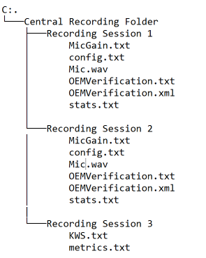

**Example Score Command Line**

`score "c:\Central Recording Folder"`

**Example Output from Score Command**

`c:\Test Output Folder>Score "c:\Loc\Central Recording Folder"`

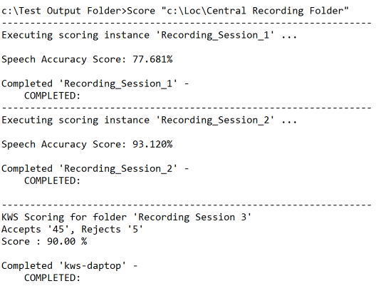

**Example Directory View of C:\<Test Output Folder>**

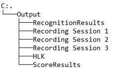