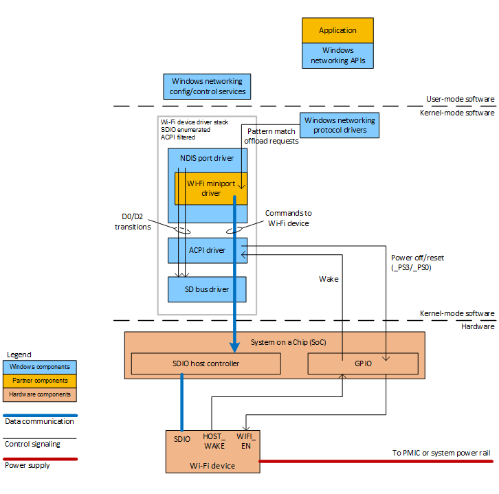
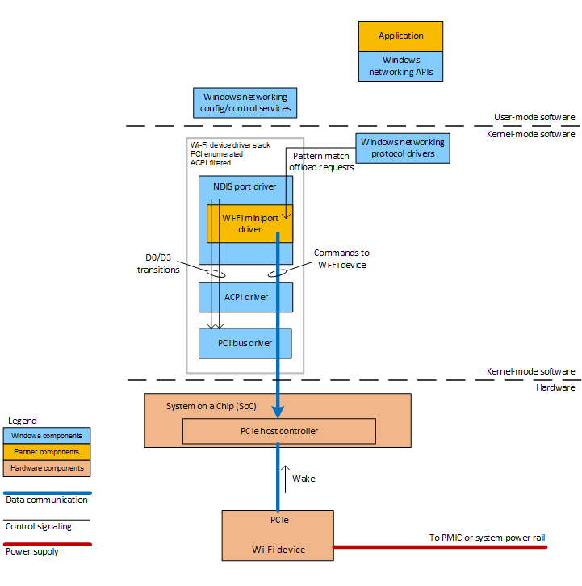

# Wi-Fi power management for modern standby platforms


In a Windows hardware platform that implements the [modern standby power model](modern-standby.md), the Wi-Fi device maintains its connection to the network while the platform is in the modern standby power state. Correct power management of the Wi-Fi device—both during modern standby and when the display is turned on—is essential to achieving long battery life.

Wi-Fi is a ubiquitous, medium-range wireless technology that enables high-bandwidth, low-latency communication between computer systems, devices, and the Internet.

Every Windows hardware platform that supports modern standby must be equipped with either a Wi-Fi device or a mobile broadband (MBB) device. Because Wi-Fi integration is more common and widespread, it is expected that the Wi-Fi device will be enabled and connected nearly all of the time.

## Overview


A Wi-Fi device in a modern standby platform must support several key power-management features to reduce power consumption by both the device and the platform as a whole.

The first feature—called *power save mode*—allows the Wi-Fi device to reduce its power consumption while it remains connected to the access point. Power save mode reduces power consumption at the cost of increased data transfer latency. Power save mode is expected to always be enabled when the platform is running on battery power, except when low-latency connections are required (for example, for VOIP calls). For more information, see [Wi-Fi Auto Power Save Mode](https://msdn.microsoft.com/library/windows/hardware/hh440282).

The second key power-management feature is *pattern-match wake*. This feature allows Windows to arm the Wi-Fi device to wake the System on a Chip (SoC) when the Wi-Fi device detects a network packet that matches a stored pattern. Pattern-match wake is operational only during modern standby. While pattern-match wake is enabled, the Wi-Fi device operates in a very low-power mode and listens for incoming data destined for specific system services or registered applications (for example, push notifications and email). Meanwhile, the other components in the hardware platform are in a low-power state. For more information, see [Network Wake-Up Events](https://msdn.microsoft.com/library/windows/hardware/ff568375).

In addition, Wi-Fi devices in a modern standby platform must support the following run-time power-management features:

-   [Radio on/off state](https://msdn.microsoft.com/library/windows/hardware/ff570427)
-   [Network list offload (NLO)](https://msdn.microsoft.com/library/windows/hardware/hh440295)
-   [ARP/NS offload](https://msdn.microsoft.com/library/windows/hardware/ff570391)
-   [D0 packet coalescing](https://msdn.microsoft.com/library/windows/hardware/hh440141)
-   [Dynamic DTIM management](https://msdn.microsoft.com/library/windows/hardware/ff569152)
-   A set of Wi-Fi connectivity triggers, which include [wake-on-AP-disconnect](https://msdn.microsoft.com/library/windows/hardware/ff568375)

This article provides design guidance for Wi-Fi devices in a modern standby platform that are connected to the SoC over the Secure Digital Input/output (I/O) (SDIO) or PCI Express (PCIe) bus, or physically integrated into the SoC itself. Microsoft has not tested Wi-Fi devices that connect via Universal Serial Bus (USB) in modern standby platforms and publishes no design guidance for such devices.

The Wi-Fi device is managed by a Wi-Fi miniport driver, which the Wi-Fi device vendor provides. Windows issues power-management requests ([NDIS OIDs](https://msdn.microsoft.com/library/windows/hardware/ff564784)) to the device to configure power save mode and pattern-match wake. Windows enables and disables pattern-match wake as the platform enters and exits modern standby. The Wi-Fi miniport driver handles these requests by configuring the Wi-Fi device over the SDIO, PCIe, or proprietary SoC bus.

The Wi-Fi device in a modern standby platform is almost always powered on and is expected to be highly power efficient. When no data is being transferred over the Wi-Fi link and power save mode is enabled, the Wi-Fi device should consume less than 10 milliwatts on average. If the user has set the radio on/off state to *off* by enabling airplane mode or by explicitly turning off Wi-Fi in the Windows **Settings** application, the Wi-Fi device must consume less than 1 milliwatt on average.

## Device power-management modes


The Wi-Fi device must support several power-management modes. As described in the following table, each mode is a combination of device activity, network connectivity, and enablement of pattern-match wake. This table assumes that the Wi-Fi device is constantly connected to a single access point that has WPA2-Personal security, except in disconnected-sleep mode and power-removed mode.

<table style="width:100%;">
<colgroup>
<col width="16%" />
<col width="16%" />
<col width="16%" />
<col width="16%" />
<col width="16%" />
<col width="16%" />
</colgroup>
<thead>
<tr class="header">
<th>Device power-management mode</th>
<th>Description</th>
<th>Device power state</th>
<th>Average power consumption</th>
<th>Exit latency to active</th>
<th>Transition mechanism</th>
</tr>
</thead>
<tbody>
<tr class="odd">
<td>Active mode</td>
<td>The Wi-Fi device is connected to the network and is actively transmitting data.</td>
<td>D0</td>
<td>&lt;= 750 milliwatts</td>
<td>N/A</td>
<td><ul>
<li>The Wi-Fi device hardware autonomously transitions from connected-idle mode to active mode.</li>
<li>The power consumption of the device in the active mode will be a factor of the wireless technology (that is, 802.11a/b/g/n), distance to the access point, quantity of data transmitted, etc.</li>
</ul></td>
</tr>
<tr class="even">
<td>Connected-idle mode</td>
<td>The Wi-Fi device is connected to the network, but is not actively transmitting data.</td>
<td>D0</td>
<td>&lt;= 25 milliwatts</td>
<td>&lt;= 100 milliseconds</td>
<td><ul>
<li>The Wi-Fi device hardware must transition autonomously between active mode and connected-idle mode.</li>
<li>If the Wi-Fi device was previously in the connected-sleep, disconnected-sleep, or radio-off mode, NDIS will send an [OID_PNP_SET_POWER](https://msdn.microsoft.com/library/windows/hardware/ff569780) request with an [<strong>NDIS_DEVICE_POWER_STATE</strong>](https://msdn.microsoft.com/library/windows/hardware/gg602135) value of NdisDeviceStateD0.</li>
<li>To instruct the Wi-Fi miniport to enable [power save mode](https://msdn.microsoft.com/library/windows/hardware/hh440282), NDIS will send an [OID_DOT11_POWER_MGMT_REQUEST](https://msdn.microsoft.com/library/windows/hardware/ff569402) request.</li>
</ul></td>
</tr>
<tr class="odd">
<td>Connected-sleep mode</td>
<td>The Wi-Fi device is connected to the access point, but the remainder of the platform is in a very low-power state. Pattern-match wake is enabled so that the Wi-Fi device wakes the SoC on a specific set of incoming network packets.</td>
<td>D2 for SDIO; D3 for PCIe</td>
<td>&lt;= 10 milliwatts</td>
<td>&lt;= 300 milliseconds</td>
<td><ul>
<li>Before the Wi-Fi device leaves D0, NDIS will send an [OID_PM_ADD_WOL_PATTERN](https://msdn.microsoft.com/library/windows/hardware/ff569764) request to instruct the Wi-Fi miniport driver to add wake-on-LAN patterns.</li>
<li>To instruct the Wi-Fi miniport driver to enable pattern-match wake, NDIS will send an [OID_PM_PARAMETERS](https://msdn.microsoft.com/library/windows/hardware/ff569768) request.</li>
<li>NDIS will send an [OID_PNP_SET_POWER](https://msdn.microsoft.com/library/windows/hardware/ff569780) request with an [<strong>NDIS_DEVICE_POWER_STATE</strong>](https://msdn.microsoft.com/library/windows/hardware/gg602135) value of NdisDeviceStateD2 (for SDIO) or NdisDeviceStateD3 (for PCIe).</li>
</ul></td>
</tr>
<tr class="even">
<td>Disconnected-sleep mode</td>
<td>The Wi-Fi device is powered but is not connected to an access point, because no preferred access point is within range. The remainder of the platform is in a very low-power state. Pattern-match wake is enabled and the Network Offload List is plumbed to the Wi-Fi device. The Wi-Fi device uses the Network Offload List to periodically scan for preferred networks to connect to.</td>
<td>D2 for SDIO; D3 for PCIe</td>
<td>&lt;= 10 milliwatts</td>
<td>&lt;= 300 milliseconds</td>
<td><ul>
<li>The Wi-Fi device uses the [network offload list](https://msdn.microsoft.com/library/windows/hardware/hh451787) to periodically scan for preferred networks to connect to.</li>
<li>If a matching network is found during these periodic scans, the Wi-Fi device will wake the SoC.</li>
</ul></td>
</tr>
<tr class="odd">
<td>Radio-off mode</td>
<td>The Wi-Fi device still has power applied, but the radio (RF components) has been powered down.</td>
<td>D0 or D2</td>
<td>&lt;= 1 milliwatt</td>
<td>&lt;= 2 seconds</td>
<td><ul>
<li>While in D0, NDIS will send an [OID_DOT11_NIC_POWER_STATE](https://msdn.microsoft.com/library/windows/hardware/ff569392) request with a value of FALSE, indicating the radio should be powered off.</li>
</ul></td>
</tr>
<tr class="even">
<td>Power-removed mode (wake disabled)</td>
<td>The Wi-Fi device has been completely powered down.</td>
<td>D3</td>
<td>&lt;= 1 milliwatt</td>
<td>&lt;= 5 seconds</td>
<td><ul>
<li>NDIS will send an [OID_PNP_SET_POWER](https://msdn.microsoft.com/library/windows/hardware/ff569780) request with an [<strong>NDIS_DEVICE_POWER_STATE</strong>](https://msdn.microsoft.com/library/windows/hardware/gg602135) value of NdisDeviceStateD3.</li>
<li>If the Wi-Fi device is connected to SDIO or PCIe, the system ACPI firmware will remove power from or reset the Wi-Fi device by using a GPIO line from the SoC to the Wi-Fi device.</li>
<li>If the Wi-Fi device is integrated into the SoC, the system firmware is responsible for powering off or resetting the Wi-Fi device by using a proprietary mechanism.</li>
</ul></td>
</tr>
</tbody>
</table>

 

Windows 8, Windows 8.1, and Windows 10 support modern standby on off-SoC Wi-Fi devices that connect via the SDIO bus. Windows 8.1 additionally supports modern standby on off-SoC Wi-Fi devices that connect via the PCIe bus.

For SDIO-connected devices, D2 is the deepest wakeable device power state for modern standby. For PCIe-connected devices, D3 (more specifically, the D3hot substate) is the deepest wakeable device power state for modern standby.

In some Wi-Fi device designs, the Wi-Fi device shares analog and RF circuitry with the Bluetooth and optional FM radio communication devices. In these Wi-Fi device designs, there must not be a power state dependency between the Wi-Fi device and the other integrated communications devices. The Wi-Fi device must have internal power gating circuitry to ensure an average power consumption of less than 1 milliwatt in the radio-off mode.

## <a href="" id="software-power"></a>Software power-management mechanisms


Power management of the Wi-Fi device is primarily based on the NDIS commands that the Wi-Fi miniport driver receives from the Windows networking subsystem. The Wi-Fi miniport driver is responsible for translating these NDIS commands (called OID requests) to device-specific messages to send to the Wi-Fi device over the I/O bus.

Developing an NDIS driver is a complex task whose scope is beyond Wi-Fi device power management. For help in understanding this section, review the [Native 802.11 Wireless LAN](https://msdn.microsoft.com/library/windows/hardware/ff560689) topic. If you are a Wi-Fi developer, you should become familiar with the set of networking device tests in the [Windows Hardware Certification Kit](http://msdn.microsoft.com/library/windows/hardware/jj124227.aspx) and use these tests as the de facto reference for ensuring that a Wi-Fi device and its Wi-Fi miniport driver are operating correctly.

The Wi-Fi device is expected to always be powered on and connected to a network, except when a modern standby platform is in the S5 (shutdown) system power state. Therefore, correct power management of the Wi-Fi device is critical to system battery life both during modern standby and when the display is turned on. The power-management mode of the Wi-Fi device might change frequently as the device responds to software requests to scan for new networks, or the device itself detects that the access point has been disconnected. The software power-management mechanisms and resulting power consumption described in the following discussion assume that the Wi-Fi device is connected to a single access point that has reasonable signal strength.

The Wi-Fi miniport driver must enable the following key power-management features to ensure that the Wi-Fi device is power-efficient both during modern standby and when the display is turned on:

-   Power save mode
-   Pattern-match wake

The following paragraphs discuss the requirements for these two features in detail.

In addition to power save mode and pattern-match wake, the Wi-Fi device and the Wi-Fi miniport driver must support several other features. For more information, see [Other requirements for Wi-Fi power management](#other-requirements).

**Power save mode**

The 802.11 specification describes a [Wi-Fi automatic power save mode](https://msdn.microsoft.com/library/windows/hardware/hh440282) (aka *power-save polling*) for Wi-Fi networks. In this mode, the Wi-Fi radio skips polling for a subset of broadcast beacons, thereby reducing the device's average power consumption. Windows requires the Wi-Fi device to enable power save mode when the device is in the active (D0), connected-idle (D0), or connected-sleep (D2 for SDIO; D3 for PCIe) power-management mode. Power save mode is not meaningful when the Wi-Fi device is in the radio-off power-management mode.

The Wi-Fi miniport driver must support and enable power save mode when the Wi-Fi device is in the following power-management modes:

-   Active (D0)
-   Connected-idle (D0)
-   Connected-sleep (D2/D3)

The Wi-Fi miniport driver must report to Windows that it supports auto-negotiation of power save mode by setting the **bAutoPowerSaveMode** member of the [**DOT11\_EXTSTA\_ATTRIBUTES**](https://msdn.microsoft.com/library/windows/hardware/ff547688) structure to TRUE. In response to this setting, Windows will send an [OID\_DOT11\_POWER\_MGMT\_MODE\_AUTO\_ENABLED](https://msdn.microsoft.com/library/windows/hardware/hh451788) request to the Wi-Fi miniport driver. This request instructs the driver to automatically enable power save mode. The Wi-Fi miniport driver must use the capabilities of the remote access point and the Wi-Fi device itself to determine the correct power-saving level to enable.

When automatic power save mode is enabled, Windows may send an [OID\_DOT11\_POWER\_MGMT\_REQUEST](https://msdn.microsoft.com/library/windows/hardware/ff569402) request to the Wi-Fi miniport driver. This message specifies one of four defined power-saving levels. The power-saving level in this message must be treated as a hint to the Wi-Fi miniport driver for the power savings expectation of the operating system or user at the current time. The value returned by the OID\_DOT11\_POWER\_MGMT\_REQUEST request can be used when the driver cannot detect that the remote access point supports power save mode.

**Pattern-match wake**

Windows requires all networking devices in a modern standby platform to support pattern-match wake. This feature enables the network device to monitor the network connection for interesting packets (by comparing incoming packets to patterns stored in the device) while the SoC or chipset is powered off, and to wake the main processor on the SoC or chipset when a matching pattern is detected. This ability to offload Wi-Fi processing from the main processor is key to achieving low-power operation in modern standby. Before the platform enters modern standby and the Wi-Fi device transitions to the connected-sleep (D2 for SDIO; D3 for PCIe) mode, Windows sends the Wi-Fi miniport driver a collection of interesting patterns that the Wi-Fi device must watch for.

Pattern-match wake is the key enabling feature for modern standby. Pattern-match wake is enabled when the Wi-Fi device is in connected-sleep (D2/D3) mode. Before the Wi-Fi device enters this mode, Windows instructs the device to ignore all network packets except for those that match a specified set of patterns. Windows builds the matching patterns based on the services and applications (for example, push notifications and email) that are currently in use. Offloading pattern matching to the Wi-Fi device allows the rest of the hardware platform either to be turned off or to operate in a low-power mode. Meanwhile, the Wi-Fi device stays turned on, waiting for important incoming network traffic.

To support pattern-match wake, the Wi-Fi miniport driver must first advertise that it supports the connected-sleep (D2/D3) mode and that it is capable of waking the system from the D2/D3 power state. To advertise pattern-match wake support, the Wi-Fi miniport driver must do the following:

-   Set the NDIS\_PM\_WOL\_BITMAP\_PATTERN bit in the **SupportedWoLPacketPatterns** member of the [**NDIS\_PM\_CAPABILITIES**](https://msdn.microsoft.com/library/windows/hardware/ff566748) structure to indicate that the Wi-Fi device supports waking the SoC based on bitmap pattern detection.
-   Set the **MinPatternWakeUp** member of the **NDIS\_PM\_CAPABILITIES** structure to NdisDeviceStateD2 (for SDIO) or NdisDeviceStateD3 (for PCIe) to indicate that the Wi-Fi device can wake the SoC when the device is in the D2/D3 power state and a matching pattern is detected.
-   Set the **NumTotalWoLPatterns** member of the **NDIS\_PM\_CAPABILITIES** structure to a value of 22 decimal (or greater). This value indicates that Windows can program the Wi-Fi device with up to 22 (or more) unique matching patterns to wake the SoC.
-   Set the NDIS\_PM\_WAKE\_PACKET\_INDICATION\_SUPPORTED bit in the **Flags** member of the **NDIS\_PM\_CAPABILITIES** structure. This flag indicates that the Wi-Fi device supports storage and retrieval of the packet that caused the Wi-Fi device to wake the SoC.

When Windows first detects that a system service or hosted application requires pattern-match wake support, it will send the [OID\_PM\_ADD\_WOL\_PATTERN](https://msdn.microsoft.com/library/windows/hardware/ff569764) request to the Wi-Fi miniport driver to specify the pattern to be matched. This request is sent well before the Wi-Fi device is transitioned to the connected-sleep (D2/D3) mode.

*Entering connected standby with pattern-match wake enabled*

When the hardware platform enters modern standby, Windows will transition the Wi-Fi device to the connected-sleep (D2 for SDIO; D3 for PCIe) mode by sending an [OID\_PNP\_SET\_POWER](https://msdn.microsoft.com/library/windows/hardware/ff569780) request that specifies a device power state of NdisDeviceStateD2 (for SDIO) or NdisDeviceStateD3 (for PCIe). In response to this request, the Wi-Fi miniport driver must do the following:

1.  Stop sending any new I/O requests to the underlying bus driver or hardware. If the Wi-Fi device is outside the SoC and connected via SDIO, the underlying bus driver will be the Windows SD bus driver, Sdbus.sys. If the Wi-Fi device is outside the SoC and connected via PCIe, the underlying bus driver will be the Windows PCI bus driver, Pci.sys. If the Wi-Fi device is integrated into the SoC, the underlying bus driver will be provided by the SoC vendor.
2.  Wait for all in-flight I/O requests, and complete all queued I/O requests.
3.  Program the Wi-Fi device for all configured wake patterns and wake events.
4.  Transition the Wi-Fi device to the correct low-power state (D2/D3) for connected-sleep mode.
5.  If the Wi-Fi device is outside the SoC and attached via an SDIO bus:

    1.  Configure the Wi-Fi device to wake the SoC using the out-of-band GPIO wake interrupt. (For more information, see [Supported hardware power configurations](#supportedhw).)
    2.  Mask the Wi-Fi device interrupts and cancel all related timers. The Wi-Fi miniport driver must set the [**SDP\_FUNCTION\_INT\_ENABLE**](https://msdn.microsoft.com/library/windows/hardware/ff537927) property to FALSE by calling the [**SdBusSubmitRequest**](https://msdn.microsoft.com/library/windows/hardware/ff537909) routine.
    3.  Instruct the SD bus driver to stop forwarding Wi-Fi device interrupts. The Wi-Fi miniport driver must set the [**SDP\_SET\_CARD\_INTERRUPT\_FORWARD**](https://msdn.microsoft.com/library/windows/hardware/ff537927) property to FALSE by calling the **SdBusSubmitRequest** routine.
    4.  Complete the [OID\_PNP\_SET\_POWER](https://msdn.microsoft.com/library/windows/hardware/ff569780) request for the NdisDeviceStateD2 state.

6.  If the Wi-Fi device is outside the SoC and attached via the PCIe bus:

    1.  Configure the Wi-Fi device to wake the system in accordance with the PCIe standard (using PM\_PME messages; this is discussed in further detail in the following section.)
    2.  Mask the Wi-Fi device interrupts. The Wi-Fi miniport driver must disconnect interrupts by calling the [**IoDisconnectInterruptEx**](https://msdn.microsoft.com/library/windows/hardware/ff549093) routine.
    3.  Complete the [OID\_PNP\_SET\_POWER](https://msdn.microsoft.com/library/windows/hardware/ff569780) request for the NdisDeviceStateD3 state.

When the Wi-Fi device is in the connected-sleep mode, the device is expected to maintain its connection to the associated Wi-Fi network, to check for matching wake patterns, and to wake the SoC when network state changes occur. For example, the Wi-Fi device must be able to wake the SoC if the access point is suddenly disassociated.

### <a href="" id="block-diagram"></a>

The following figure shows the configuration of software and hardware components to support a Wi-Fi device that is external to the SoC and that communicates with the SoC through an SDIO bus.



*Exiting modern standby for a matching pattern*

When the Wi-Fi device detects a packet with a matching pattern, it must first save this packet in local non-volatile storage for later retrieval by the Wi-Fi miniport driver. Windows will have the driver retrieve information about the packet so that the appropriate system service or application can be notified of the incoming packet.

Next, the Wi-Fi device must generate an interrupt to wake the SoC.

If the Wi-Fi device is located outside of the SoC on an SDIO port, the interrupt should be delivered through the out-of-band GPIO interrupt and cause the SoC to wake. The ACPI subsystem then determines that the GPIO interrupt for the Wi-Fi device has caused the SoC to wake, and will respond by completing a wait-wake IRP (an [**IRP\_MN\_WAIT\_WAKE**](https://msdn.microsoft.com/library/windows/hardware/ff551766) request) that the NDIS port driver automatically left pending in the ACPI driver on behalf of the Wi-Fi miniport driver.

If the Wi-Fi device is located outside the SoC on a PCIe bus, and the ACPI firmware grants control of native PCIe features to the operating system, wake events are handled according to the PCIe specification, by using the following steps:

1.  When the Wi-Fi device goes to a low-power state, the NDIS port driver automatically sends a wait-wake IRP down the Wi-Fi driver stack to the inbox PCI bus driver, Pci.sys (not the ACPI driver, Acpi.sys), which marks the IRP as pending in anticipation of a future wake event.
2.  When the Wi-Fi device needs to wake, it should generate a WAKE notification to the root of the PCIe hierarchy. To do so, the device sends an in-band PM\_PME message over the PCIe bus.
3.  The wake notification is routed to the root port of the PCIe hierarchy above the Wi-Fi device. The root port will be in the D0 power state and is expected to generate a PME interrupt to the inbox PCI bus driver, Pci.sys.
4.  The PCI bus driver on the root port brings the entire device hierarchy beneath that root port back to D0.
5.  The PCI bus driver examines the PME\_Status bit of each device in the hierarchy to determine if it issued a WAKE notification. If the Wi-Fi device's PMEStatus bit is set, the PCI bus driver then completes any outstanding wait-wake IRPs that are pending for that device, which causes the IRP pended in step 1 to return to NDIS.

For more information, see [Low Power for Wake on LAN](https://msdn.microsoft.com/library/windows/hardware/ff557077).

If the Wi-Fi device is integrated into the SoC, the operation of the device is similar to that described for the off-SoC, SDIO-port implementation. The SoC vendor must describe the device in the DSDT table in the ACPI firmware. The ACPI subsystem will then enumerate the Wi-Fi device and complete the wait-wake IRP. We recommend that system integrators who use SoCs that have integrated Wi-Fi devices work closely with the SoC vendor on Wi-Fi device integration and driver development.

When the wait-wake IRP is completed, NDIS will first send a D0 IRP (an [**IRP\_MN\_SET\_POWER**](https://msdn.microsoft.com/library/windows/hardware/ff551744) request of type **DevicePowerState**) down the stack to the bus driver. Before completing the D0 IRP, NDIS will send the Wi-Fi miniport driver an [OID\_PNP\_SET\_POWER](https://msdn.microsoft.com/library/windows/hardware/ff569780) request with a target state of NdisDeviceStateD0. In response, the Wi-Fi miniport driver must do the following:

1.  Inspect the Wi-Fi device hardware to determine the reason for the wake interrupt. The Wi-Fi miniport driver must notify NDIS of the reason for the wake interrupt by generating an [**NDIS\_STATUS\_PM\_WAKE\_REASON**](https://msdn.microsoft.com/library/windows/hardware/hh439808) status event. If the wake interrupt is caused by an incoming network packet, the driver must pass this packet to NDIS through the regular NDIS data path before the driver passing any other received packets to NDIS.
2.  Restore any register state or other hardware context needed to complete the Wi-Fi device's transition to connected-idle (D0) mode.
3.  If the Wi-Fi device is external to the SoC and connected via SDIO, the Wi-Fi miniport driver must:

    1.  Instruct the SD bus driver to forward interrupts to the Wi-Fi miniport driver. The Wi-Fi miniport driver must set the [**SDP\_SET\_CARD\_INTERRUPT\_FORWARD**](https://msdn.microsoft.com/library/windows/hardware/ff537927) property to TRUE by calling the [**SdBusSubmitRequest**](https://msdn.microsoft.com/library/windows/hardware/ff537909) routine.
    2.  Mask the Wi-Fi device interrupts. The Wi-Fi miniport driver must set the [**SDP\_FUNCTION\_INT\_ENABLE**](https://msdn.microsoft.com/library/windows/hardware/ff537927) property to TRUE by calling the **SdBusSubmitRequest** routine.

4.  Complete the **IRP\_MN\_SET\_POWER** request.

Pattern-match wake and the ability to wake the SoC from a low-power idle state are essential to maintaining network connectivity during modern standby. Wi-Fi driver developers should work closely with Microsoft to develop a Wi-Fi miniport driver that implements these required features.

### <a href="" id="other-requirements"></a>Other requirements for Wi-Fi power management

In addition to power save mode and pattern-match wake, the Wi-Fi device and miniport driver must support several other run-time power-management features for Wi-Fi devices in modern standby platforms. These features are essential for reducing power consumption in the Wi-Fi device and overall hardware platform. As previously discussed, the Wi-Fi device and miniport driver must support the following features:

-   Radio on/off state
-   Network list offload (NLO)
-   ARP/NS offload
-   D0 packet coalescing
-   Dynamic DTIM management
-   A set of Wi-Fi connectivity triggers, which include wake-on-AP-disconnect

**Radio on/off state**

The Wi-Fi miniport driver must respond to Windows requests to change the radio on/off state for the Wi-Fi device. The user can change the radio on/off state to *off* by enabling airplane mode or by explicitly turning off Wi-Fi in the Windows **Settings** application.

When the user changes the radio on/off state of the Wi-Fi device to *off*, Windows sends the Wi-Fi miniport driver an [OID\_DOT11\_NIC\_POWER\_STATE](https://msdn.microsoft.com/library/windows/hardware/ff569392) request with a value of FALSE. In response, the Wi-Fi miniport driver must use an in-band message to remove power from the radio (RF subsystem) in the Wi-Fi device and place the device in a power state that consumes no more than 1 milliwatt on average.

When the user changes the radio on/off state of the Wi-Fi device to *on*, Windows sends the Wi-Fi miniport driver an OID\_DOT11\_NIC\_POWER\_STATE request with a value of TRUE. In response, the Wi-Fi miniport driver must use an in-band message to apply power to the radio in the Wi-Fi device and return the device to the connected-idle power mode.

When the radio on/off state of the Wi-Fi device is set to *off*, the Wi-Fi device can be in either the D0 or D2 power state. NDIS will always transition the Wi-Fi device to the D0 power state before notifying the Wi-Fi miniport driver of a change in the radio on/off state. If the user has previously set the radio on/off state to *off*, the Wi-Fi miniport driver does not need to take any specific action when the hardware platform enters modern standby. If the radio on/off state is set to *off*, the radio will remain off in modern standby, and, after the system exits modern standby, the radio on/off state will still be set to *off* until the user changes the state to *on*.

**Network list offload (NLO)**

The network list offload (NLO) feature enables Wi-Fi profile information to be copied to local storage in the Wi-Fi device. Instead of scanning all available channels for all access points, the Wi-Fi device uses this profile information to scan a limited number of channels for preferred networks, thereby reducing the power consumed by the Wi-Fi device. The Wi-Fi device and Wi-Fi miniport driver in a modern standby platform must support network list offload. This support includes handling [OID\_DOT11\_OFFLOAD\_NETWORK\_LIST](https://msdn.microsoft.com/library/windows/hardware/hh451787) requests.

To advertise NLO capability, the Wi-Fi miniport driver must set the NDIS\_WLAN\_WAKE\_ON\_NLO\_DISCOVERY\_SUPPORTED flag in the **MediaSpecificWakeUpEvents** member of the [**NDIS\_PM\_CAPABILITIES**](https://msdn.microsoft.com/library/windows/hardware/ff566748) structure.

**ARP/NS offload**

The Wi-Fi miniport driver and Wi-Fi device must support ARP/NS offload, which allows the Wi-Fi device to autonomously respond to common network requests. The ARP/NS offload feature avoids waking the SoC for common network requests that have simple and predictable responses. To indicate support for ARP/NS offload, the Wi-Fi miniport driver must set the NDIS\_PM\_PROTOCOL\_OFFLOAD\_ARP\_SUPPORTED and NDIS\_PM\_PROTOCOL\_OFFLOAD\_NS\_SUPPORTED flags in the **SupportedProtocolOffloads** member of the **NDIS\_PM\_CAPABILITIES** structure.

Additionally, the Wi-Fi miniport driver and Wi-Fi device must support at least one IPv4 ARP offload address and at least two IPv6 NS offload addresses. The Wi-Fi miniport driver must set the **NumArpOffloadIPv4Addresses** member of the **NDIS\_PM\_CAPABILITIES** structure to a value of 1 or greater. The Wi-Fi miniport driver must set the value of the **NumNSOffloadIPv6Addresses** member of the **NDIS\_PM\_CAPABILITIES** structure to a value of 2 or greater. Windows uses the [OID\_PM\_ADD\_PROTOCOL\_OFFLOAD](https://msdn.microsoft.com/library/windows/hardware/ff569763) request to supply the ARP and NS offload addresses to the Wi-Fi miniport driver.

**D0 packet coalescing**

The Wi-Fi device and Wi-Fi miniport driver must support D0 packet coalescing, which is a feature that enables the Wi-Fi device to batch common, low-priority network packets for batched retrieval by the SoC. This feature reduces the overall quantity and frequency of core chipset interrupts so that the SoC can stay longer in lower-power states, thereby extending battery life. The Wi-Fi miniport driver advertises support for D0 packet coalescing by setting several values in the [**NDIS\_RECEIVE\_FILTER\_CAPABILITIES**](https://msdn.microsoft.com/library/windows/hardware/ff566864) structure.

The following table summarizes the D0 packet-coalescing capabilities that the Wi-Fi device is required to support and the Wi-Fi miniport driver is required to report. The Wi-Fi miniport driver must specify these capabilities in the **NDIS\_RECEIVE\_FILTER\_CAPABILITIES** structure. Each row of the table shows the minimum value required for a particular member of this structure. NDIS will send [OID\_RECEIVE\_FILTER\_SET\_FILTER](https://msdn.microsoft.com/library/windows/hardware/ff569795) requests to the Wi-Fi miniport driver to set the packet-coalescing filters. The packet-coalescing filters indicate which packets are required to be batched in a coalescing buffer on the Wi-Fi device.

<table>
<colgroup>
<col width="50%" />
<col width="50%" />
</colgroup>
<thead>
<tr class="header">
<th>Member</th>
<th>Minimum value</th>
</tr>
</thead>
<tbody>
<tr class="odd">
<td><strong>SupportedQueueProperties</strong></td>
<td><p>NDIS_RECEIVE_FILTER_PACKET_COALESCING_SUPPORTED_ON_DEFAULT_QUEUE</p>
<div class="alert">
<strong>Note</strong>  This flag must always be present in the [<strong>HardwareReceiveFilterCapabilities</strong>](https://msdn.microsoft.com/library/windows/hardware/ff565924) to indicate the hardware capability. This flag must be present in the <strong>CurrentReceiveFilterCapabilities</strong> if and only if the [*PacketCoalescing](https://msdn.microsoft.com/library/windows/hardware/hh440217) advanced keyword is nonzero.
</div>
<div>
 
</div></td>
</tr>
<tr class="even">
<td><strong>EnabledFilterTypes</strong></td>
<td>NDIS_RECEIVE_FILTER_PACKET_COALESCING_FILTERS_ENABLED</td>
</tr>
<tr class="odd">
<td><strong>SupportedFilterTests</strong></td>
<td>NDIS_RECEIVE_FILTER_TEST_HEADER_FIELD_EQUAL_SUPPORTED | NDIS_RECEIVE_FILTER_TEST_HEADER_FIELD_NOT_EQUAL_SUPPORTED | NDIS_RECEIVE_FILTER_TEST_HEADER_FIELD_MASK_EQUAL_SUPPORTED</td>
</tr>
<tr class="even">
<td><strong>SupportedHeaders</strong></td>
<td>NDIS_RECEIVE_FILTER_MAC_HEADER_SUPPORTED | NDIS_RECEIVE_FILTER_ARP_HEADER_SUPPORTED | NDIS_RECEIVE_FILTER_IPV4_HEADER_SUPPORTED | NDIS_RECEIVE_FILTER_IPV6_HEADER_SUPPORTED | NDIS_RECEIVE_FILTER_UDP_HEADER_SUPPORTED</td>
</tr>
<tr class="odd">
<td><strong>SupportedMacHeaderFields</strong></td>
<td>NDIS_RECEIVE_FILTER_MAC_HEADER_DEST_ADDR_SUPPORTED | NDIS_RECEIVE_FILTER_MAC_HEADER_PROTOCOL_SUPPORTED | NDIS_RECEIVE_FILTER_MAC_HEADER_PACKET_TYPE_SUPPORTED</td>
</tr>
<tr class="even">
<td><strong>SupportedARPHeaderFields</strong></td>
<td>NDIS_RECEIVE_FILTER_ARP_HEADER_OPERATION_SUPPORTED | NDIS_RECEIVE_FILTER_ARP_HEADER_SPA_SUPPORTED | NDIS_RECEIVE_FILTER_ARP_HEADER_TPA_SUPPORTED</td>
</tr>
<tr class="odd">
<td><strong>SupportedIPv4HeaderFields</strong></td>
<td>NDIS_RECEIVE_FILTER_IPV4_HEADER_PROTOCOL_SUPPORTED</td>
</tr>
<tr class="even">
<td><strong>SupportedIPv6HeaderFields</strong></td>
<td>NDIS_RECEIVE_FILTER_IPV6_HEADER_PROTOCOL_SUPPORTED</td>
</tr>
<tr class="odd">
<td><strong>SupportedUdpHeaderFields</strong></td>
<td>NDIS_RECEIVE_FILTER_UDP_HEADER_DEST_PORT_SUPPORTED</td>
</tr>
<tr class="even">
<td><strong>MaxFieldTestsPerPacketCoalescingFilter</strong></td>
<td>5</td>
</tr>
<tr class="odd">
<td><strong>MaxPacketCoalescingFilters</strong></td>
<td>10</td>
</tr>
</tbody>
</table>

 

NDIS sends [OID\_RECEIVE\_FILTER\_CLEAR\_FILTER](https://msdn.microsoft.com/library/windows/hardware/ff569785) requests to clear previously set packet-coalescing filters when these filters are no longer required. NDIS might set and clear individual packet-coalescing filters dynamically. The Wi-Fi miniport driver is required to keep track of the current set of packet-coalescing filters at all times, but can apply coalescing only when the Wi-Fi device is in the D0 power state (and is in either active mode or connected-idle mode).

**Dynamic DTIM configuration**

The Wi-Fi miniport driver must support dynamic configuration of the *delivery traffic indication message* (DTIM) interval. Dynamically adjusting the DTIM interval to a larger value during connected-sleep (D2 for SDIO; D3 for PCIe) mode allows the Wi-Fi device to consume very little power while continuously maintaining a connection to the access point. The additional latency that results from the longer DTIM interval is not critical in connected-sleep (D2/D3) mode.

The Wi-Fi miniport driver should support dynamic DTIM intervals by implementing the following guidance:

-   The Wi-Fi device (in STA mode) must advertise a listen interval value of 10 to the access point. This value will force the access point to cache data for the Wi-Fi client for 10 beacon intervals.
-   To prepare the Wi-Fi device to enter connected-sleep (D2/D3) mode, the driver must change the length of the DTIM interval to approximately 500 milliseconds. The DTIM value to specify depends on the value of the normal *traffic indication message* (TIM). For example, if the TIM is currently 100 milliseconds, the Wi-Fi device should use a DTIM value of 5 (for an interval of 500 milliseconds). If the TIM is currently 300 milliseconds, the Wi-Fi device should use a DTIM value of 2 (for an interval of 600 milliseconds).

When the Wi-Fi device transitions back to the connected-idle (D0) mode, the Wi-Fi device must revert to the original DTIM of that was negotiated with the access point.

**Wi-Fi connectivity wake triggers**

When the Wi-Fi device is connected to a network during modern standby, the Wi-Fi device and the Wi-Fi miniport driver must also support waking the SoC based on a set of Wi-Fi connectivity wake triggers. The requirements are as follows:

-   Perform GTK (WPA/WPA2) and IGTK refresh (WPA2) while in modern standby.
-   Support waking on GTK and IGTK handshake errors.
-   Support waking when an 802.1x EAP-Request/Identity packet is received.
-   Support waking when a four-way handshake request is received.
-   Support wake-on-association-lost with current access point.

Waking the SoC on these Wi-Fi specific events allows Windows to be notified when Wi-Fi connectivity is in jeopardy or when the Wi-Fi device loses connectivity to the associated access point. In response, Windows might instruct the Wi-Fi miniport driver and device to connect to an alternate Wi-Fi network. Or, Windows might instead use the mobile broadband (MBB) radio to establish a connection. The Wi-Fi miniport driver must specify each of these wake trigger capabilities (for example, by setting the NDIS\_WLAN\_WAKE\_ON\_AP\_ASSOCIATION\_LOST\_SUPPORTED flag) in the **SupportedWakeUpEvents** member of the [**NDIS\_PM\_CAPABILITIES**](https://msdn.microsoft.com/library/windows/hardware/ff566748) structure.

## <a href="" id="supportedhw"></a>Supported hardware power configurations


Windows supports three hardware power-management configurations for the Wi-Fi device in a modern standby platform. The Wi-Fi device either must be located outside the SoC and attached via SDIO or PCIe, or must be physically integrated into the SoC chip and attached via a proprietary internal bus.

The system designer must not use a USB bus connection to integrate a Wi-Fi device in a modern standby platform.

**Outside the SoC, attached via SDIO**

In this configuration, which is shown in the [preceding block diagram](#block-diagram), the Wi-Fi device is located outside of the SoC and is connected to the SoC through an SDIO bus. The Wi-Fi device might have one or more pins connected to GPIO pins on the SoC. The Wi-Fi device must be either attached to a power rail that is always powered on, or directly connected to the power-management IC (PMIC).

The Wi-Fi device must be able to generate a wake interrupt over an out-of-band signal line routed from an interrupt output pin on the Wi-Fi device to a GPIO pin on the SoC. The interrupt line from the device must be connected to an always-on GPIO pin on the SoC so that the Wi-Fi device's wake signal can wake the SoC from its lowest power state during modern standby. The system integrator must use the ACPI GpioInt macro to describe the GPIO interrupt connection under the Wi-Fi device in the ACPI namespace. The **Shared** field of the GpioInt macro must be set to ExclusiveAndWake to indicate that the GPIO interrupt is capable of waking the system from sleep. The ExclusiveAndWake setting enables the ACPI driver to automatically complete the wait-wake IRP for the Wi-Fi device, and to return the device to connected-idle (D0) mode if the device is in connected-sleep (D2) mode when it interrupts the SoC. The ACPI firmware must indicate that the Wi-Fi device can wake the platform from connected-sleep (D2) mode. To do so, the system integrator must include both \_S4W and \_S0W objects in the ACPI namespace under the Wi-Fi device, as shown in the following example:

``` syntax
    Name(_S0W, 2)
    Name(_S4W, 2)
```

The value 2 in this example indicates the D2 device power state.

As an option, the Wi-Fi device can have an input pin that accepts an enable or reset signal from a GPIO output pin on the SoC. The GPIO pin is controlled by system firmware. The GPIO pin can be switched to completely power down or reset the Wi-Fi device. If such a GPIO pin is used to enable or reset the Wi-Fi device, the system integrator must expose this pin in a GPIO operation region. The system integrator must also include \_PS0 and \_PS3 control methods under the Wi-Fi device in the ACPI namespace.

The implementation of the \_PS3 method must power down or reset the Wi-Fi device by changing the state of the GPIO output pin through the GPIO operation region. If the Wi-Fi device has specific reset timing requirements, the system integrator must implement these requirements in ACPI firmware by using the ACPI Sleep method to delay execution or to hold the reset line to the required signal level for some specified time.

The implementation of the \_PS0 control method must reliably apply power to the Wi-Fi device and make the device operational.

**Outside the SoC, attached via PCIe**

In this configuration, the Wi-Fi device is located outside of the SoC and attached to the PCIe bus. The device is in the D3 device power state when it operates in connected-sleep mode or disconnected-sleep mode. While in D3, the device remains in the D3hot substate and does not enter the D3cold substate. The Wi-Fi device must be attached to a system power rail that is always powered on or is directly connected to the system power management IC (PMIC).

**Note**  • The Wi-Fi hardware should use PCI architectural means of generating a wake event (PME).

 

When in D3, the device must be able to signal a wake event by sending a PM\_PME message that propagates in-band over the PCIe bus. The wake event will generate an interrupt from the PCIe root port, and this interrupt will be handled by the inbox PCI bus driver, Pci.sys.

To grant the operating system control over native PCIe features, the ACPI firmware must include an \_OSC control method in the ACPI namespace. In addition, the ACPI namespace must include an \_S0W object to indicate that the Wi-Fi device can wake the platform from connected-sleep mode or disconnected-sleep mode. This object must be located under the Wi-Fi device in the ACPI namespace, and declared as shown in the following example:

``` syntax
    Name(_S0W, 3)
```

The following figure shows the configuration of software and hardware components to support a Wi-Fi device that is external to the SoC and that communicates with the SoC through the PCIe bus.



**Integrated into the SoC**

If the Wi-Fi device is integrated into the SoC, tight coupling between the Wi-Fi miniport driver and a proprietary SoC bus driver is required. The implementation of this driver is outside of the scope of this document. However, the Wi-Fi miniport driver must implement all of the features described in [Software power-management mechanisms](#software-power).

The system integrator should contact the SoC vendor for ACPI implementation details for Wi-Fi devices that are directly integrated into the SoC.

## <a href="" id="testing"></a>Testing and validation


Testing and validation of the Wi-Fi device should focus on directly measuring power consumption and verifying that pattern-match wake works correctly.

The direct measurement of device power consumption is a critical part of testing and validation for a Wi-Fi device. Because the Wi-Fi device is almost always powered on when the platform is not in the S5 (shutown) system power state, the system integrator must test and validate Wi-Fi power consumption in a number of different system scenarios and configurations. We recommend directly measuring the power consumption of the Wi-Fi device for the two types of connections shown in the following table.

<table>
<colgroup>
<col width="33%" />
<col width="33%" />
<col width="33%" />
</colgroup>
<thead>
<tr class="header">
<th>Scenario</th>
<th>Target average power</th>
<th>Comments</th>
</tr>
</thead>
<tbody>
<tr class="odd">
<td><strong>Airplane mode, radio off</strong>
<ul>
<li>Screen on, D0 state</li>
</ul></td>
<td>&lt;= 1 milliwatt</td>
<td>The radio might be turned off both when the display is on and during modern standby. When the radio is off, the power consumption must be no more than 1 milliwatt on average for both D0 and D2.</td>
</tr>
<tr class="even">
<td><strong>Screen on, idle</strong>
<ul>
<li>Power save mode enabled on automatic</li>
<li>No active data transfers</li>
<li>DTIM configured to access point support</li>
<li>WPA2-Personal security</li>
</ul></td>
<td>&lt;= 10 milliwatts</td>
<td>Testing should be performed with the Wi-Fi device connected to a variety of consumer and commercial Wi-Fi access points.</td>
</tr>
<tr class="odd">
<td><strong>Connected sleep</strong>
<ul>
<li>Screen off, pattern-match wake enabled, D2 state</li>
<li>DTIM configured to 5</li>
<li>WPA2-Personal security</li>
</ul></td>
<td>&lt;= 10 milliwatts</td>
<td></td>
</tr>
</tbody>
</table>

 

## <a href="" id="checklist"></a>Power-management checklist


System integrators and SoC vendors should use the checklist below to verify that their Wi-Fi device and Wi-Fi miniport power-management design are compatible with Windows 8 and Windows 8.1.

**Note**  The [Windows Hardware Certification Kit](http://msdn.microsoft.com/library/windows/hardware/jj124227.aspx) includes an extensive set of Wi-Fi driver tests to help ensure the Wi-Fi device is compatible with Windows 8 and Windows 8.1. Wi-Fi device vendors and Wi-Fi miniport driver developers are encouraged to review the Windows Hardware Certification Kit tests and use them to validate their driver implementation as early as possible in the design cycle.

 

-   The Wi-Fi device vendor must develop a driver that does the following:

    -   Supports pattern-match wake.
    -   Supports power save mode.
    -   Supports radio on/off.
    -   Supports network list offload (NLO).
    -   Supports D0 packet coalescing.
    -   Supports wake-on-AP-disconnect and additional Wi-Fi wake triggers.
    -   Supports ARP/NS offload.
    -   Supports dynamic DTIM configuration.
    -   Passes all applicable networking tests in the Windows Hardware Certification Kit.
-   If the Wi-Fi device is located outside of the SoC and attached via SDIO, the system integrator must develop the hardware and firmware for the Wi-Fi device to do the following:

    -   Route the Wi-Fi wake interrupt from the Wi-Fi device to an always-on GPIO pin on the SoC.
    -   Include the GPIOInt macro under the Wi-Fi device in the ACPI namespace with the Shared field set to ExclusiveAndWake.
    -   Include the \_S4W object under the Wi-Fi device in the ACPI namespace with a deepest wake state of 0x2 for D2. Specify as "Name(\_S4W, 2)".
    -   Include the \_S0W object under the Wi-Fi device in the ACPI namespace with a deepest wake state of 0x2 for D2. Specify as "Name(\_S0W, 2)".
    -   Route any power-enable or reset signal from a GPIO output pin on the SoC to the Wi-Fi device.
    -   Describe the optional power-enable or reset GPIO output pin in a GPIO operation region.
    -   Provide \_PS3 and \_PS0 control methods and/or \_PR*n* power resource references. These entries should be under the Wi-Fi device in the ACPI namespace.
    -   Implement the \_PS3 method or power resource methods to remove power from the Wi-Fi device.
    -   Implement the \_PS0 method or power resource methods to restore power to the Wi-Fi device.
    -   Include any device-specific power-on or reset sequencing timing in the implementation of the \_PS3 and \_PS0 methods. ACPI method execution can be delayed by using the Sleep method.
-   If the Wi-Fi device is located outside of the SoC and attached via PCIe, the system integrator must develop the hardware and firmware for the Wi-Fi device to do the following:

    -   Include an \_OSC control method in the ACPI namespace to grant the operating system control over native PCIe features.

        Include the \_S4W object under the Wi-Fi device in the ACPI namespace with a deepest wake state of 0x3 for D3. Specify as "Name(\_S4W, 3)".

-   The system integrator must test and validate correct power management of the Wi-Fi device by doing the following:

    -   Verify that the average power consumption of the Wi-Fi device in radio-off mode is less than 1 milliwatt.
    -   Verify that the average power consumption of the Wi-Fi device is less than 10 milliwatts when the device is in connected-sleep (D2 for SDIO; D3 for PCIe) mode or connected-idle (D0) mode and is not actively transmitting any data.
    -   Verify that the Wi-Fi miniport correctly supports pattern-match wake and is capable of waking the SoC from its deepest idle state when a matching pattern is detected.
    -   Verify that the Wi-Fi device can wake the SoC from its deepest idle state when the device loses its connection to the associated access point.
    -   Verify that the Wi-Fi device does not generate spurious wakes to the SoC.
    -   Use the tests provided in the Windows Hardware Certification Kit to verify that the Wi-Fi device correctly implements network list offload (NLO), ARP/NS offload, and D0 packet coalescing.

 

 


