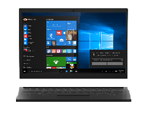
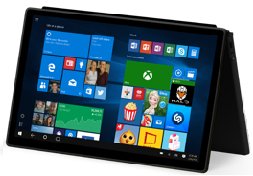

# 2-in-1

A 2-in-1 form factor is an evolution of the traditional notebook, also know as a convertible notebook that comes in two styles: detachable and convertible. Its key feature is the ability to convert from a traditional notebook to a tablet mode. Convertibles are typically more like a notebook that transforms into a tablet. Detachables are typically more like a tablet with a high quality keyboard base or attachment. Windows 10 for desktop editions (Home, Pro, Enterprise, and Education) introduces a new feature called Continuum that takes advantage of a 2-in-1s unique design. The feature will adjust the user experience based on what mode the device is in. Listed below are a few recommended hardware configurations.
<table>
<tbody valign="top">
<tr>
<td colspan="2"/>
<td>

Entry 2-in-1

Detachable

</td>
<td>

Mainstream 2-in-1

</td>
<td>

Premium 2-in-1

</td>
</tr>
<tr>
<td colspan="2">
Key Features
</td>
<td>

[Cortana](../device-experiences/cortana.md)

[Continuum](../device-experiences/continuum.md)

[Windows Hello](../device-experiences/windows-hello.md)

[Wired and Wireless Docking and Casting (USB-C; Miracast)](../device-experiences/docking.md)

[Inking/Pen Support](../component-guidelines/pen-devices.md)

</td>
<td>

[Cortana](../device-experiences/cortana.md)

[Continuum](../device-experiences/continuum.md)

[Windows Hello](../device-experiences/windows-hello.md)

[Wired and Wireless Docking and Casting (USB-C; Miracast)](../device-experiences/docking.md)

[Inking/Pen Support](../component-guidelines/pen-devices.md)

</td>
<td>

[Cortana](../device-experiences/cortana.md)

[Continuum](../device-experiences/continuum.md)

[Windows Hello](../device-experiences/windows-hello.md)

[Long battery life (12+ hours)](../component-guidelines/battery.md)

[Wired and Wireless Docking and Casting (USB-C; Miracast)](../device-experiences/docking.md)

[Inking/Pen Support](../component-guidelines/pen-devices.md)

[Precision Touchpad](../component-guidelines/precision-touchpad-devices.md)

</td>
</tr>
<tr>
<td colspan="2">
Operating System
</td>
<td>
Windows 10 for desktop editions
</td>
<td>
Windows 10 for desktop editions
</td>
<td>
Windows 10 for desktop editions
</td>
</tr>
<tr>
<td rowspan="7">
[Recommended Components](../component-guidelines/components.md)
</td>
<td>
CPU
</td>
<td>
Mobile to mid-tier x86
</td>
<td>
Mid-range x86
</td>
<td>
Premium x86
</td>
</tr>
<tr>
<td>
RAM/Storage
</td>
<td>
2GB+/32GB+ or 320GB+ HDD
</td>
<td>
4GB+ / 32GB+ with SD slot
</td>
<td>
4-16GB / 64GB- 1TB SSD
</td>
</tr>
<tr>
<td>
Display
</td>
<td>
10.1” – 13.3”/ HD+ Touch
</td>
<td>
10.1-12.5” / FHD+
</td>
<td>
11.6”-14” / FHD-4K / Touch
</td>
</tr>
<tr>
<td>
Dimensions
</td>
<td>
&lt;10mm & &lt;.6kg (Tablet)
</td>
<td>
&lt;18mm & &lt;1.36kgs w/ keyboard
</td>
<td>
&lt;16mm & &lt;1.36kg (combined w/ keyboard)
</td>
</tr>
<tr>
<td>
Battery
</td>
<td>
8+ hours
</td>
<td>
8+ hours
</td>
<td>
12+ hours
</td>
</tr>
<tr>
<td>
Connectivity
</td>
<td>
802.11ac, 1 USB 3.0, HDMI, BT LE, LTE option
</td>
<td>
802.11ac, USB 3.0, HDMI, BT LE, NFC, LTE option
</td>
<td>
802.11ac, 2+ USB 3.x, BT LE, LTE option
</td>
</tr>
<tr>
<td>
Audio/Video
</td>
<td>
Front & rear cameras, speakers, headphones, full array mics
</td>
<td>
Front & rear cameras, speakers, headphones, full array mics
</td>
<td>
Stereo Speaker, full array microphones, HD Webcam
</td>
</tr>
</tbody>
</table>

 

 

