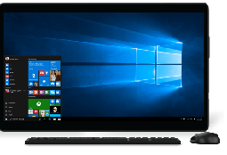

# All-in-one

The All-in-one (AIO) form factor is an evolution of the traditional desktop with the benefit of taking up less space. It combines all the system components and display into one chassis, similar to a tablet. Listed below are a few recommended hardware configurations.
<table>
<tbody valign="top">
<tr>
<td colspan="2"/>
<td>

Portable All-in-one

</td>
<td>

Premium All-in-one

</td>
</tr>
<tr>
<td colspan="2">
Key Features
</td>
<td>

Portable (&lt;5lbs, thin)

[Cortana](../device-experiences/cortana.md)

[Windows Hello](../device-experiences/windows-hello.md)

[Battery Life (6+ hours)](../component-guidelines/battery.md)

Multi User Multi Touch Apps (Sensors, hinge design for “lay-flat,” 10-point touch)

</td>
<td>

High-DPI (4K) & Multi-Monitor Support

[Cortana](../device-experiences/cortana.md)

[Windows Hello](../device-experiences/windows-hello.md)

[Inking/Pen Support](../component-guidelines/pen-devices.md)

Multi User Multi Touch Apps

</td>
</tr>
<tr>
<td colspan="2">
Operating System
</td>
<td>
Windows 10 for desktop editions (Home, Pro, Enterprise, and Education)
</td>
<td>
Windows 10 for desktop editions
</td>
</tr>
<tr>
<td rowspan="7">
[Recommended Components](../component-guidelines/components.md)
</td>
<td>
CPU
</td>
<td>
Mid-tier x86 w/CS
</td>
<td>
High-end x86
</td>
</tr>
<tr>
<td>
RAM/Storage
</td>
<td>
2GB+/320GB+ HDD or 64GB+ SSD
</td>
<td>
8GB+ / 256GB+ SSD or 1TB+ HDD
</td>
</tr>
<tr>
<td>
Display
</td>
<td>
17”-21”/HD Touch
</td>
<td>
21”-30” / FHD or QHD Touch, DX12
</td>
</tr>
<tr>
<td>
Dimensions
</td>
<td>
&lt;21mm & &lt;2.3kg
</td>
<td>
Sleek design
</td>
</tr>
<tr>
<td>
Battery
</td>
<td>
6+ hours
</td>
<td>
-
</td>
</tr>
<tr>
<td>
Connectivity
</td>
<td>
802.11ac, USB 3.0, HDMI, BT LE
</td>
<td>
802.11ac, 1 USB 3.0, HDMI, BT LE
</td>
</tr>
<tr>
<td>
Audio/Video
</td>
<td>
HD Webcam
</td>
<td>
HD Webcam, Premium Speakers, full array microphones
</td>
</tr>
</tbody>
</table>