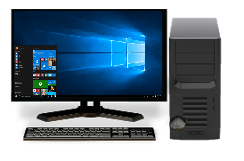
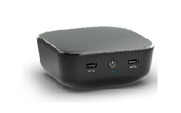

# Desktop PC

A desktop PC form factor traditionally comes in an upright tower or small desktop chassis. Listed below are a few recommended hardware configurations.
<table>
<tbody valign="top">
<tr>
<td colspan="2"/>
<td>

Mainstream Desktop

</td>
<td>

Mini PC Desktop

</td>
</tr>
<tr>
<td colspan="2">
Key Features
</td>
<td>
Full PC Experience (Core performance, legacy ports, optical disk drive )
</td>
<td>
Full PC Experience (Core performance with optimal storage)
</td>
</tr>
<tr>
<td colspan="2">
Operating System
</td>
<td>
Windows 10 for desktop editions (Home, Pro, Enterprise, and Education)
</td>
<td>
Windows 10 for desktop editions
</td>
</tr>
<tr>
<td rowspan="5">
[Recommended Components](../component-guidelines/components.md)
</td>
<td>
CPU
</td>
<td>
Mid-range x86
</td>
<td>
Mid-range x86
</td>
</tr>
<tr>
<td>
RAM/Storage
</td>
<td>
4GB+ / 32GB+ SSD or 500GB+ HDD
</td>
<td>
4GB / 32+ GB SSD or 320GB+ HDD
</td>
</tr>
<tr>
<td>
Display
</td>
<td>
Multi-Monitor Support
</td>
<td>
-
</td>
</tr>
<tr>
<td>
Dimensions
</td>
<td>
-
</td>
<td>
&lt;2.5L compact size
</td>
</tr>
<tr>
<td>
Connectivity
</td>
<td>
802.11ac, USB 3.0, HDMI, BT
</td>
<td>
802.11ac, USB 3.0, HDMI, BT LE
</td>
</tr>
</tbody>
</table>