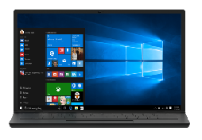

# Notebook

A notebook is a portable clamshell device with an attached keyboard. The notebook industry continues to grow with a wide range of options from inexpensive notebooks, mainstream notebooks to gaming notebooks. The advances in technology and manufacturing have brought notebooks closer to desktops. Listed below are a few recommended hardware configurations.
<table>
<tbody valign="top">
<tr>
<td colspan="2"/>
<td>

Entry Notebook

</td>
<td>

Mainstream Notebook

</td>
<td>

Premium Ultra-slim Notebook

</td>
<td>

Workstation Notebook

</td>
<td>

Gaming Notebook

</td>
</tr>
<tr>
<td colspan="2">
Key Features
</td>
<td>

[Cortana](../device-experiences/cortana.md)

[Windows Hello](../device-experiences/windows-hello.md)

[Battery Life 8+ hours](../component-guidelines/battery.md)

[Precision Touchpad](../component-guidelines/precision-touchpad-devices.md)

</td>
<td>

[Cortana](../device-experiences/cortana.md)

[Wired and Wireless Docking and Casting (USB-C; Miracast)](../device-experiences/docking.md)

[Inking/Pen Support](../component-guidelines/pen-devices.md)

[Precision Touchpad](../component-guidelines/precision-touchpad-devices.md)

</td>
<td>

High-DPI (4K)

[Cortana](../device-experiences/cortana.md)

[Long battery life (12+ hours)](../component-guidelines/battery.md)

[Wired and Wireless Docking and Casting (USB-C; Miracast)](../device-experiences/docking.md)

[Windows Hello](../device-experiences/windows-hello.md)

[Precision Touchpad](../component-guidelines/precision-touchpad-devices.md)

</td>
<td>

[Cortana](../device-experiences/cortana.md)

[Wired and Wireless Docking and Casting (USB-C; Miracast)](../device-experiences/docking.md)

[Inking/Pen Support](../component-guidelines/pen-devices.md)

[Precision Touchpad](../component-guidelines/precision-touchpad-devices.md)

</td>
<td>

Premium Audio/Visual experience (DX12, 4K support (display, chipset), premium speakers, Chipset support PlayReady, H/W DRM, H.265 H/W (decord/encord) )

[Cortana](../device-experiences/cortana.md)

Xbox content/Controller/Xbox Live

[Windows Hello](../device-experiences/windows-hello.md)

[Precision Touchpad](../component-guidelines/precision-touchpad-devices.md)

</td>
</tr>
<tr>
<td colspan="2">
Operating System
</td>
<td>
Windows 10 for desktop editions (Home, Pro, Enterprise, and Education)
</td>
<td>
Windows 10 for desktop editions
</td>
<td>
Windows 10 for desktop editions
</td>
<td>
Windows 10 for desktop editions
</td>
<td>
Windows 10 for desktop editions
</td>
</tr>
<tr>
<td rowspan="7">
[Recommended Components](../component-guidelines/components.md)
</td>
<td>
CPU
</td>
<td>
Mid-tier x86
</td>
<td>
Mid-range x86
</td>
<td>
Premium high-end x86
</td>
<td>
Premium high-end x86
</td>
<td>
Premium high-end x86
</td>
</tr>
<tr>
<td>
RAM/Storage
</td>
<td>
2GB+ / 32GB+ eMMC or SSD + SD Card
</td>
<td>
4GB+ / 500GB+ HDD
</td>
<td>
8GB/256GB SSD or 1TB HD w/SSD cache
</td>
<td>
8+GB / 256GB+ SSD or 750GB – 1TB+ HDD + SSD Cache
</td>
<td>
8GB+ / 1TB+ HDD + SSD Cache
</td>
</tr>
<tr>
<td>

Display

</td>
<td>

11.6”+ / HD+ non-touch

</td>
<td>

14.1” – 15.6” / FHD+ Touch

</td>
<td>

11.6”-12.5” display w/touch; FHD-WQHD, zero-bezel

</td>
<td>

14” / FHD+

</td>
<td>

14”-19” / FHD – 4K

Discrete DX12 GPU with 2GB-4GB

</td>
</tr>
<tr>
<td>
Dimensions
</td>
<td>
&lt;18mm & &lt;1.36kg
</td>
<td>
&lt;19mm & 1.8kg
</td>
<td>
&lt;15mm & &lt;.51kgs
</td>
<td>
&lt;20mm & &lt;1.5kg
</td>
<td>
&lt;20mm & &lt;1.5kg
</td>
</tr>
<tr>
<td>
Battery
</td>
<td>
8+ hours
</td>
<td>
6+ hours
</td>
<td>
12+ hours
</td>
<td>
-
</td>
<td>
-
</td>
</tr>
<tr>
<td>
Connectivity
</td>
<td>
802.11ac, 1 USB 3.0, HDMI, BT LE
</td>
<td>
802.11ac, USB 3.0, HDMI, BT LE, NFC
</td>
<td>
802.11ac, 2+ USB 3.x, HDMI, BT LE, LTE
</td>
<td>
802.11ac, 1 USB 3.0, HDMI, BT LE
</td>
<td>
802.11ac, 1 USB 3.0, HDMI, BT LE, LTE
</td>
</tr>
<tr>
<td>
Audio/Video
</td>
<td>
Stereo Speaker, full array mics, HD Webcam
</td>
<td>
Webcam, speakers, headphones
</td>
<td>
Stereo Speaker, full array microphones, HD Webcam
</td>
<td>
Premium sound, HD Webcam, full array microphones
</td>
<td>
Premium sound, HD Webcam, full array microphones
</td>
</tr>
</tbody>
</table>