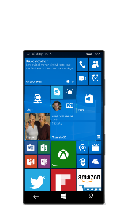
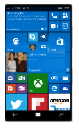

# Smartphone

Smartphones come in a wide range of sizes from low cost phones, small tablets (phablets) and industrial handheld devices. A typical smartphone combines cellular connectivity, a touch screen, rechargeable power source, and other components into a single chassis. Windows 10 Mobile can support a wide range of small form factors devices. Listed below are a few recommended hardware configurations.
<table>
<tbody valign="top">
<tr>
<td colspan="2"/>
<td>

Value Phone

</td>
<td>

Premium Phone

</td>
<td>

Value Phablet

</td>
</tr>
<tr>
<td colspan="2">
Key Features
</td>
<td>

Low cost

[Cortana](../device-experiences/cortana.md)

</td>
<td>

[Cortana](../device-experiences/cortana.md)

[Windows Hello](../device-experiences/windows-hello.md)

[Continuum for Phones](../device-experiences/continuum-phone.md)

</td>
<td>

[Cortana](../device-experiences/cortana.md)

[Windows Hello](../device-experiences/windows-hello.md)

</td>
</tr>
<tr>
<td colspan="2">
Operating System
</td>
<td>
Windows 10 Mobile
</td>
<td>
Windows 10 Mobile
</td>
<td>
Windows 10 Mobile
</td>
</tr>
<tr>
<td rowspan="7">
[Recommended Components](../component-guidelines/components.md)
</td>
<td>
CPU
</td>
<td>
Supported entry SoC
</td>
<td>
Supported premium SoC
</td>
<td>
Mid tier supported SoC
</td>
</tr>
<tr>
<td>
RAM/Storage
</td>
<td>
1GB / 8GB with SD slot
</td>
<td>
2-4GB / 32-64GB with SD slot
</td>
<td>
2GB / 16GB with SD slot
</td>
</tr>
<tr>
<td>
Display
</td>
<td>
3.5”-5”+ / WVGA -FWVGA-qHD\*
</td>
<td>
4.5-5.5”+ / FHD-WQHD
</td>
<td>
5.5”-7”/720p+
</td>
</tr>
<tr>
<td>
Dimensions
</td>
<td>
&lt;10.5mm & &lt;135g
</td>
<td>
&lt;7.5mm & &lt;160g
</td>
<td>
&lt;10mm & &lt;175g
</td>
</tr>
<tr>
<td>
Battery
</td>
<td>
1400 mAh+ (1 day active use)
</td>
<td>
2500+ mAh ( 1 day active use)
</td>
<td>
3000 mAh+ ( 1 day active use)
</td>
</tr>
<tr>
<td>
Connectivity
</td>
<td>
3G (LTE/Cat 3)/802.11b/g/n, microUSB, 3.5mm jack, BT LE
</td>
<td>
LTE/Cat 4+ /802.11b/g/n/ac 2x2, USB, 3.5mm jack, BT LE, NFC
</td>
<td>
LTE/Cat 3 /802.11b/g/n/ac 2x2, USB 3.0 type-c, 3.5mm jack, BT LE, NFC
</td>
</tr>
<tr>
<td>
Camera+
</td>
<td>
5MP, .3MP FFC
</td>
<td>
20MP with OIS/Flash; 5MP FFC
</td>
<td>
5MP, .3MP FFC
</td>
</tr>
</tbody>
</table>

\* qHD requires &gt;512MB memory

Research the Windows Mobile options and partner with a registered Windows phone manufacturer to build a device utilizing your brand. For more information, see [Windows 10 Hardware Developer Programs (http://go.microsoft.com/fwlink/?LinkId=618212)](http://go.microsoft.com/fwlink/?LinkId=618212).