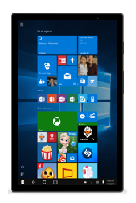
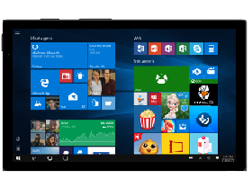

# Tablet

Tablets are a versatile form factor that overlap the smartphone and notebook industry. A tablet device combines a touch screen, rechargeable power source, and other components into a single chassis with an optional attachable keyboard. Listed below are a few recommended hardware configurations.
<table>
<tbody valign="top">
<tr>
<td colspan="2"/>
<td>

7" Tablet

</td>
<td>

8" Tablet

</td>
<td>

Large Tablet

</td>
</tr>
<tr>
<td colspan="2">
Key Features
</td>
<td>

Low cost

[Cortana](../device-experiences/cortana.md)

[Continuum for Phones](../device-experiences/continuum-phone.md)

</td>
<td>

[Battery Life 8+ hours](../component-guidelines/battery.md)

[Cortana](../device-experiences/cortana.md)

[Wired and Wireless Docking and Casting (USB-C; Miracast)](../device-experiences/docking.md)

</td>
<td>

Ruggedized for Commercial/EDU use

[Cortana](../device-experiences/cortana.md)

[Inking/Pen Support](../component-guidelines/pen-devices.md)

[Windows Hello](../device-experiences/windows-hello.md)

[Wired and Wireless Docking and Casting (USB-C; Miracast)](../device-experiences/docking.md)

</td>
</tr>
<tr>
<td colspan="2">
Operating System
</td>
<td>
Windows 10 Mobile
</td>
<td>
Windows 10 for desktop editions (Home, Pro, Enterprise, and Education)
</td>
<td>
Windows 10 for desktop editions
</td>
</tr>
<tr>
<td rowspan="7">
[Recommended Components](../component-guidelines/components.md)
</td>
<td>
CPU
</td>
<td>
Supported entry SoC
</td>
<td>
Entry x86
</td>
<td>
Entry x86
</td>
</tr>
<tr>
<td>
RAM/Storage
</td>
<td>
1-2GB/8-32GB eMMC w/SD card
</td>
<td>
1GB+ / 32GB+ SSD
</td>
<td>
4GB+ / 32GB+ SSD
</td>
</tr>
<tr>
<td>
Display
</td>
<td>
7” 480x800 or 1280x720 w/touch
</td>
<td>
8” / HD+
</td>
<td>
10.1” – 12.5” / FHD+
</td>
</tr>
<tr>
<td>
Dimensions
</td>
<td>
&lt;9mm & &lt;.36kg
</td>
<td>
&lt;9mm & &lt;.6kg
</td>
<td>
-
</td>
</tr>
<tr>
<td>
Battery
</td>
<td>
10+ hours
</td>
<td>
8+ hours
</td>
<td>
8+ hours
</td>
</tr>
<tr>
<td>
Connectivity
</td>
<td>
802.11ac+, 1 micro USB 2.0, mini HDMI, BT, LTE option
</td>
<td>
802.11ac, USB 3.0, HDMI, BT LE, NFC, LTE Option
</td>
<td>
802.11ac, USB 3.0, HDMI, BT LE, NFC, LTE Option
</td>
</tr>
<tr>
<td>
Audio/Video
</td>
<td>
Front camera, speakers, headphones
</td>
<td>
Front camera, speakers, headphones, full array microphones
</td>
<td>
Front & rear camera, speakers, headphones, full array microphones
</td>
</tr>
</tbody>
</table>

Research the Windows Mobile options and partner with a registered Windows phone manufacturer to build a device utilizing your brand. For more information, see [Windows 10 Hardware Developer Programs (http://go.microsoft.com/fwlink/?LinkId=618212)](http://go.microsoft.com/fwlink/?LinkId=618212).