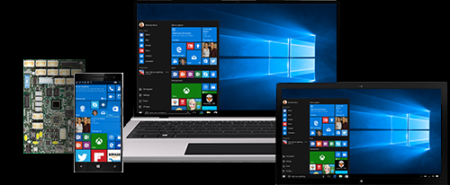

# Design Windows 10 devices

Building a great Windows 10 device starts with selecting the right components. Understanding the difference between minimum and optimal hardware requirements will ensure the best usability and performance. To take advantage of the latest features like Cortana and Continuum, your hardware must meet specific requirements to ensure an optimal device experience.

## Form factors

Windows 10 supports a wide range of devices—from phones, to tablets and laptops, to All-in-one or desktop devices. See [Form factors](form-factors/form-factors.md) to choose your device and learn more info about creating great Windows devices.

## Design guidelines

The minimum hardware requirements specification defines the minimum hardware requirements necessary to boot and run Windows 10, update and service Windows 10, and provide a baseline user experience that is comparable with similar devices and computers.

Minimum hardware requirements enable OEMs, ODMs, SoC vendors, and other component vendors to make early design decisions for devices and computers that will run Windows 10.

[Review the minimum hardware requirements](minimum/minimum-hardware-requirements-overview.md)

Build devices that take full advantage of the latest Windows 10 features. To get started learn how the feature works and then choose the right hardware.

[Learn more about the latest Windows 10 features](device-experiences/device-experiences-scenarios.md)

Building a great device for Windows means with selecting the right components. Microsoft makes recommendations to help you put together the best system for running Windows 10.

[Learn more about individual component guidelines](component-guidelines/components.md)

We provide tests that help you deliver systems, software and hardware products that are compatible with Windows and run reliably on Windows 10. We also give you the opportunity to promote your product on Microsoft’s Certified Products List and with the Windows logo.

[Learn more about the Windows Hardware Compatibility Program](compatibility/1703/index.md)