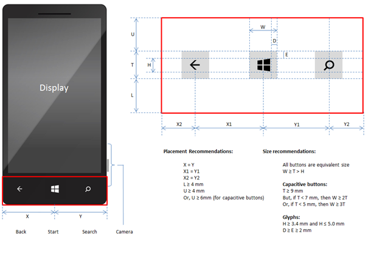
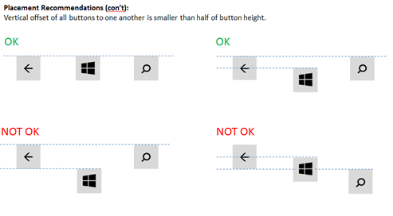

# Minimum hardware requirements

## Section 1.0 - Introduction

### 1.1 Overview

This specification defines the minimum hardware requirements for Windows 10 and all types of devices or computers designed for this release (Windows 10, version 1703). Microsoft will build and test the Windows 10 OS against the requirements described in this specification.

### 1.1.1 Purpose of this specification

This specification defines the minimum hardware requirements necessary to:

-   Boot and run Windows 10.
-   Update and service Windows 10.
-   Provide a baseline user experience that is comparable with similar devices and computers.

The goal of this specification is to enable OEMs, ODMs, SoC vendors, and other component vendors to make early design decisions for devices and computers that will run Windows 10.

This specification does not provide compatibility and certification requirements for devices and computers that run Windows 10 or implementation guidance for exceptional user experiences. Microsoft will provide this guidance in other documents at a later date.

### 1.1.2 Windows operating systems

Windows is available in the following editions.

**Table 1:** Windows operating systems

<table>
<colgroup>
<col width="50%" />
<col width="50%" />
</colgroup>
<thead>
<tr class="header">
<th>OS</th>
<th>Definition</th>
</tr>
</thead>
<tbody>
<tr class="odd">
<td>Windows 10 Mobile</td>
<td>
An OS that is designed for mobility. This OS runs Universal Windows apps and existing Windows Phone Store apps.
</td>
</tr>
<tr class="even">
<td>Windows 10 Mobile Enterprise</td>
<td>
An edition of Windows 10 Mobile built for enterprise devices that need flexibility in chassis implementation, long term servicing lifecycle and enables the enterprise to manage platform updates.

<strong>Note</strong>  In this specification, most requirements that apply to Windows 10 Mobile also apply to Windows 10 Mobile Enterprise . Any additional requirements or exceptions are explicitly called out where applicable.

 

</td>
</tr>
<tr class="odd">
<td>Windows 10 for desktop editions (Home, Pro, Enterprise, and Education)</td>
<td>
An OS that is designed for performing traditional PC tasks that uses the desktop experience. This OS runs native Win32 apps, Universal Windows apps, and existing apps from the Windows Store.
</td>
</tr>
<tr class="even">
<td>Windows 10 Enterprise</td>
<td>
An edition of Windows 10 desktop for industry devices that supports advanced lockdown capabilities, Windows desktop application and Windows apps support for standard industry devices, large tablets and stationary computing devices

Note: In this specification, all requirements that apply to Windows 10 for desktop editions also apply to Windows 10 Enterprise. There are no additional requirements unique to Windows 10 Enterprise.
</td>
</tr>
<tr class="odd">
<td>Windows Server 2016</td>
<td>
An OS that is designed and optimized for use on servers.
</td>
</tr>
<tr class="even">
<td>Windows 10 IoT Core (IoT Core)</td>
<td>
An OS built for ARM, x86 and x64 that enables building low cost, small footprint devices that support Universal Apps.
</td>
</tr>
</tbody>
</table>

 

### 1.1.3 Device types supported by Windows

Table 2 lists the device types that run Windows and the operating system editions that can run on them. In cases where the requirements for an OS differ based on the device type, this specification points out those differences.

**Table 2:** Device types for Windows 10 and Server 2016

<table>
<colgroup>
<col width="25%" />
<col width="25%" />
<col width="25%" />
<col width="25%" />
</colgroup>
<thead>
<tr class="header">
<th>Device type</th>
<th>Definition</th>
<th>Supported processor types</th>
<th>Supported Windows operating systems</th>
</tr>
</thead>
<tbody>
<tr class="odd">
<td>Phone</td>
<td>A handheld device that combines cellular connectivity, a touch screen, rechargeable power source, and other components into a single chassis.</td>
<td>ARM (32-bit)</td>
<td>Windows 10 Mobile</td>
</tr>
<tr class="even">
<td>Tablet</td>
<td>A device that combines a display, rechargeable power source, and other components into a single chassis. An attachable keyboard is optional.</td>
<td>x86 or x64 processors and SoCs</td>
<td>Windows 10 for desktop editions</td>
</tr>
<tr class="odd">
<td>Laptop</td>
<td>A clamshell device with an attached keyboard.</td>
<td>x86 or x64 processors and SoCs</td>
<td>Windows 10 for desktop editions</td>
</tr>
<tr class="even">
<td>2-in-1</td>
<td>A device that combines a display, rechargeable power source, and pointing device into a single chassis together with a mechanically attached keyboard.</td>
<td>x86 or x64 processors and SoCs</td>
<td>Windows 10 for desktop editions</td>
</tr>
<tr class="odd">
<td>All-in-one</td>
<td>
One of the following:

<ul>
<li>Fixed all-in-one PC. Integrates a display with other hardware components in a single chassis.</li>
<li>Portable all-in-one PC. Integrates a display and a battery with other hardware components in a single chassis for home or office portability.</li>
</ul></td>
<td>x86 or x64 processors and SoCs</td>
<td>Windows 10 for desktop editions</td>
</tr>
<tr class="even">
<td>Desktop PC</td>
<td>Traditional desktop PCs</td>
<td>x86 or x64 processors and SoCs</td>
<td>Windows 10 for desktop editions</td>
</tr>
<tr class="odd">
<td>Server</td>
<td>Traditional server computers, to include pedestal, micro, rack mount, blade, high density/modular, partitionable, SoC</td>
<td>x64 processors</td>
<td>Windows Server 2016</td>
</tr>
<tr class="even">
<td>Small footprint IoT device</td>
<td>Small footprint, purpose built devices like gateways with or without display support</td>
<td>ARM (32-bit only) SoCs, x86 or x64 processors and SoCs</td>
<td>IoT Core</td>
</tr>
</tbody>
</table>

 

For example form factor configurations, see [Form factors](../form-factors/form-factors.md).

### 1.1.4 Organization of this specification

This specification is organized into the following sections:

-   Section 1.2 provides a high-level overview of hardware requirements for all Windows 10 operating systems, with a focus on required or optional components.
-   The following sections provide detailed requirements that are unique to each OS:
    -   Section 2.0: Minimum hardware requirements for Windows 10 Mobile
    -   Section 3.0: Minimum hardware requirements for Windows 10 for desktop editions
    -   Section 4.0: Minimum hardware requirements for Windows Server 2016
    -   Section 5.0: Minimum hardware requirements for IoT Core
-   Section 6.0 provides additional component requirements that are not unique to a specific edition of the Windows 10 operating system.

### 1.1.5 Specification updates

Updates to this specification may be released in the future as requirements change.

### 1.1.6 Design verification and compliance

Ultimately, the device manufacturer is responsible for complying with all applicable laws and regulations. If a device manufacturer identifies a requirement in this specification or the related documents that is inconsistent with an applicable law or regulation, the device manufacturer is responsible for notifying Microsoft of this inconsistency and recommending a compliant modification.

### 1.2 Minimum hardware requirements summary for Windows 10

Table 3 summarizes the hardware requirements for all Windows 10 operating systems.

**Note**  In this table, all requirements in the Windows 10 Mobile column also apply to Windows 10 Mobile Enterprise, except where specified otherwise. All requirements in the Windows 10 for desktop editions column also apply to Windows 10 Enterprise.

 

**Table 3:** Minimum hardware requirements summary

<table>
<tr>
<th rowspan="2" colspan="2">Components</th>
<th colspan="4">  Operating system</th>
</tr>
<tr>
<th>Windows 10 Mobile</th>
<th>Windows 10 for desktop editions</th>
<th>Windows Server 2016</th>
<th>IoT Core</th>
</tr>
<tr>
<td colspan="2"><b>Processor</b></td>
<td>

One of the SoCs listed in section 2.1

</td>
<td>

1 GHz or faster processor or SoC

For details, see 3.1

</td>
<td>

1.4 GHz or faster 64-bit processor or SoC

For details, see 4.1

</td>
<td>

400 MHz or faster x86, x64 processor or ARM SoC

For details, see 5.1

</td>
</tr>
<tr>
<td colspan="2"><b>RAM</b></td>
<td>

1 GB or higher 

For details, see 2.2

</td>
<td>

1 GB for 32-bit OS

2 GB for 64-bit OS

For details, see 3.2

</td>
<td>

512 MB

For details, see 4.3

</td>
<td>

256 MB available to the OS for devices without display support

512 MB available to the OS for devices with display support, depending on resolution

For details, see 5.2

</td>
</tr>
<tr>
<td colspan="2"><b>Storage</b></td>
<td>

8 GB flash storage

For details, see 2.3

</td>
<td>

16 GB for 32-bit OS

20 GB for 64-bit OS

For details, see 3.3

</td>
<td>

60 GB

For details, see 4.4

</td>
<td>

2 GB

For details, see 5.3

</td>
</tr>
<tr>
<td rowspan="2"><b>Security</b></td>
<td><b>Trusted Platform Module (TPM)</b></td>
<td>

Required

For details, see 2.8

</td>
<td>

Required

For details, see 3.7

</td>
<td>

Optional

For details, see 4.7

</td>
<td>

Optional

For details, see 5.4

</td>
</tr>
<tr>
<td><b>UEFI Secure Boot</b></td>
<td>

Required

</td>
<td>

Required

</td>
<td>

Optional

</td>
<td>

Optional

</td>
</tr>
<tr>
<td rowspan="3"><b>Display</b></td>
<td><b>Screen</b></td>
<td>

Less than 9-inches

</td>
<td>

7-inches or greater required for tablets, 2-in-1s, laptops, and All-in-one

Optional for desktop PCs

</td>
<td>

Optional

</td>
<td>

Optional

For details, see 5.5

</td>
</tr>
<tr>
<td><b>Resolution</b></td>
<td>

WVGA, FWVGA, WXGA, qHD, 720p (HD), or 1080p (FHD), WQHD

For details, see 2.4

</td>
<td>

SVGA (800 x 600) or higher

For details, see 3.4

</td>
<td>

XGA (1024 x 768) or higher

For details, see 4.5

</td>
<td>

Design dependent

</td>
</tr>
<tr>
<td><b>Bit depth</b></td>
<td>

32 bits of color per pixel

</td>
<td>

32 bits of color per pixel

</td>
<td>

32 bits of color per pixel

</td>
<td>

Design dependent

</td>
</tr>
<tr>
<td colspan="2"><b>Touch, touch pad, and active pen</b>
For details, see 6.1

</td>
<td>

Optional

</td>
<td>

Optional

</td>
<td>

Optional

</td>
<td>

Optional

</td>
</tr>
<tr>
<td rowspan="2"><b>Camera</b>
For details, see 6.2.1

</td>
<td><b>Rear-facing camera</b></td>
<td>

Required for phones that run Windows 10 Mobile

Optional for other devices that run Windows 10 Mobile and for any devices that run Windows 10 Mobile Enterprise

</td>
<td>

Optional

</td>
<td>

Optional

</td>
<td>

Optional

</td>
</tr>
<tr>
<td><b>Forward-facing camera</b></td>
<td>

Optional

</td>
<td>

Optional

</td>
<td>

Optional

</td>
<td>

Optional

</td>
</tr>
<tr>
<td rowspan="6"><b>Audio</b>
For details, see 6.2.2

</td>
<td><b>Audio codec</b></td>
<td>

Required for phones

Optional for other devices

</td>
<td>

Optional

</td>
<td>

Optional

</td>
<td>

Optional

</td>
</tr>
<tr>
<td><b>Primary microphone</b></td>
<td>

Required for phones

Optional for other devices

</td>
<td>

Optional

</td>
<td>

Optional

</td>
<td>

Optional

</td>
</tr>
<tr>
<td><b>Secondary microphone</b></td>
<td>

Optional

</td>
<td>

Optional

</td>
<td>

Optional

</td>
<td>

Optional

</td>
</tr>
<tr>
<td><b>Dynamic noise suppression</b></td>
<td>

Optional

</td>
<td>

Optional

</td>
<td>

Optional

</td>
<td>

Optional

</td>
</tr>
<tr>
<td><b>Loudspeaker</b></td>
<td>

Required for phones that run Windows 10 Mobile

Optional for other devices that run Windows 10 Mobile and for any devices that run Windows 10 Mobile Enterprise

</td>
<td>

Optional

</td>
<td>

Optional

</td>
<td>

Optional

</td>
</tr>
<tr>
<td><b>Earpiece</b></td>
<td>

Required for phones

Optional for other devices

</td>
<td>

Optional

</td>
<td>

Optional

</td>
<td>

Optional

</td>
</tr>
<tr>
<td rowspan="7"><b>Wireless</b>
For details, see 6.3

</td>
<td><b>2G / 2.5G / 3G (UMTS/EvDO) / 4G (HSPA) cellular radio</b></td>
<td>

Required for phones

Optional for other devices

</td>
<td>

Optional

</td>
<td>

Optional

</td>
<td>

Optional (data only; no voice support)

</td>
</tr>
<tr>
<td><b>LTE cellular radio</b></td>
<td>

Optional

</td>
<td>

Optional

</td>
<td>

Optional

</td>
<td>

Optional (data only; no voice support)

</td>
</tr>
<tr>
<td><b>Bluetooth</b></td>
<td>

Optional

</td>
<td>

Optional

</td>
<td>

Not Supported

</td>
<td>

Optional

</td>
</tr>
<tr>
<td><b>Wi-Fi</b></td>
<td>

Required for phones

Optional for other devices

</td>
<td>

Optional

</td>
<td>

Optional

</td>
<td>

Optional

</td>
</tr>
<tr>
<td><b>A-GNSS</b></td>
<td>

Required for phones

Optional for other devices

</td>
<td>

Optional

</td>
<td>

Optional

</td>
<td>

Optional

</td>
</tr>
<tr>
<td><b>FM radio</b></td>
<td>

Optional

</td>
<td>

Not supported

</td>
<td>

Not supported

</td>
<td>

Optional

</td>
</tr>
<tr>
<td><b>NFC</b></td>
<td>

Optional

</td>
<td>

Optional

</td>
<td>

Optional

</td>
<td>

Optional

</td>
</tr>
<tr>
<td colspan="2"><b>Networking</b></td>
<td>

Wi-Fi and cellular is required for phones

At least one option for network connectivity is required for other devices (such as Wi-Fi)

</td>
<td>

At least one option for network connectivity is required (such as Wi-Fi or an Ethernet adapter)

</td>
<td>

The following are required:<ul>
<li>A Gigabit Ethernet adapter</li>
<li>A network adapter that supports PXE</li>
</ul>

</td>
<td>

Optional

</td>
</tr>
<tr>
<td rowspan="5"><b>Sensors</b>
For details, see 6.4 

</td>
<td><b>Accelerometer</b></td>
<td>

Optional

</td>
<td>

Optional

</td>
<td>

Optional

</td>
<td>

Optional

</td>
</tr>
<tr>
<td><b>Magnetometer</b></td>
<td>

Optional

</td>
<td>

Optional

</td>
<td>

Optional

</td>
<td>

Optional

</td>
</tr>
<tr>
<td><b>Ambient light sensor</b></td>
<td>

Optional

For details, see 2.5.1

</td>
<td>

Optional

</td>
<td>

Optional

</td>
<td>

Optional

</td>
</tr>
<tr>
<td><b>Proximity sensor</b></td>
<td>

Optional

</td>
<td>

Optional

</td>
<td>

Optional

</td>
<td>

Optional

</td>
</tr>
<tr>
<td><b>Gyroscope</b></td>
<td>

Optional

</td>
<td>

Optional

</td>
<td>

Optional

</td>
<td>

Optional

</td>
</tr>
<tr>
<td rowspan="2"><b>Notification</b>
For details, see 6.5

</td>
<td><b>Vibration mechanism</b></td>
<td>

Required for phones

Optional

Optional for other devices

</td>
<td>

Optional

</td>
<td>

Optional

</td>
<td>

Optional

</td>
</tr>
<tr>
<td><b>NLED</b></td>
<td></td>
<td>

Optional

</td>
<td>

Optional

</td>
<td>

Optional

</td>
</tr>
<tr>
<td rowspan="6"><b>Hardware buttons</b></td>
<td><b>Power</b></td>
<td rowspan="6">

See 2.6 for the required, optional, and not supported buttons

See 6.6 for button behavior requirements

</td>
<td rowspan="6">

See 3.6 for the required, optional, and not supported buttons

See 6.6 for button behavior requirements

</td>
<td rowspan="6">

Power button is required, all other buttons are not supported

See 6.6 for button behavior requirements

</td>
<td rowspan="6">

All buttons are optional

See 6.6 for button behavior requirements

</td>
</tr>
<tr>
<td><b>Volume Up / Volume Down</b></td>
</tr>
<tr>
<td><b>Start</b></td>
</tr>
<tr>
<td><b>Back / Search</b></td>
</tr>
<tr>
<td><b>Camera</b></td>
</tr>
<tr>
<td><b>Rotation lock</b></td>
</tr>
<tr>
<td rowspan="5"><b>Connectors</b>
For details, see 6.7

</td>
<td><b>USB</b></td>
<td>

Optional

</td>
<td>

Optional

</td>
<td>

Optional

</td>
<td>

Optional

</td>
</tr>
<tr>
<td><b>Headphone / headset jack</b></td>
<td>

Required for phones

Optional for other devices

</td>
<td>

Optional

</td>
<td>

Optional

</td>
<td>

Optional

</td>
</tr>
<tr>
<td><b>Micro SD card slot</b></td>
<td>

Optional

</td>
<td>

Optional

</td>
<td>

Optional

</td>
<td>

Optional

</td>
</tr>
<tr>
<td><b>Video output</b></td>
<td>

Optional

</td>
<td>

At least one video output port is required for desktop PCs

Optional for other devices

</td>
<td>

Optional

</td>
<td>

Optional

</td>
</tr>
<tr>
<td><b>SIM slot</b></td>
<td>

Required for phones

Optional for other devices

</td>
<td>

Optional

</td>
<td>

Optional

</td>
<td>

Optional

</td>
</tr>
</table>

 

## Section 2.0 - Minimum hardware requirements for Windows 10 Mobile

This section provides detailed hardware requirements that apply to any device that runs Windows 10 Mobile. See Table 2 for the list of devices that can run Windows 10 Mobile. For additional component requirements that may also apply, see Section 6.

**Note**  Throughout this specification, all requirements for Windows 10 Mobile also apply to Windows 10 Mobile Enterprise except where specified otherwise.

 

### 2.1 SoC

Table 4 lists the supported SoCs for devices that run Windows 10 Mobile. Any official variants that are available from the SoC vendor (for example, a version of the SoC with a higher clock speed) are also supported.

**Table 4:** SoCs with integrated modems supported in devices that run Windows 10 Mobile

<table>
<colgroup>
<col width="50%" />
<col width="50%" />
</colgroup>
<thead>
<tr class="header">
<th>Manufacturer</th>
<th>SoC</th>
</tr>
</thead>
<tbody>
<tr class="odd">
<td>
Qualcomm Technologies, Inc.
</td>
<td>
Snapdragon 820, 810, 808, 617, 210
</td>
</tr>
</tbody>
</table>

 

Table 5 lists the additional supported SoCs for devices that run Windows 10 Mobile Enterprise . These SoCs do not have cellular support, and are intended for devices that either use Wi-Fi only or do not have network connectivity. Devices that run the Windows 10 Mobile Enterprise can use any of the SoCs listed in Table 4 and Table 5.

**Table 5:** Wi-Fi only SoCs supported in devices that run Windows 10 Mobile Enterprise

<table>
<colgroup>
<col width="50%" />
<col width="50%" />
</colgroup>
<thead>
<tr class="header">
<th>Manufacturer</th>
<th>SoC</th>
</tr>
</thead>
<tbody>
<tr class="odd">
<td>
Qualcomm Technologies, Inc.
</td>
<td>
Snapdragon 810, 808, 617, 210 (All: APQ variants only)
</td>
</tr>
</tbody>
</table>

 

Existing Windows Phones that include the SoCs listed in Table 6 can be updated to Windows 10 Mobile.

**Table 6:** SoCs supported in Windows Phones that can be updated to Windows 10 Mobile

<table>
<colgroup>
<col width="50%" />
<col width="50%" />
</colgroup>
<thead>
<tr class="header">
<th>Manufacturer</th>
<th>SoC</th>
</tr>
</thead>
<tbody>
<tr class="odd">
<td>
Qualcomm Technologies, Inc.
</td>
<td>
Snapdragon 810, 808, 801, 800, 617, 410, 400, 210, 200, S4 Plus
</td>
</tr>
</tbody>
</table>

 

### 2.2 Memory

The RAM requirements for devices that run Windows 10 Mobile are listed in Table 7.

**Table 7:** RAM requirements for devices that run Windows 10 Mobile

<table>
<colgroup>
<col width="33%" />
<col width="33%" />
<col width="33%" />
</colgroup>
<thead>
<tr class="header">
<th>Display resolution</th>
<th>Baseline RAM requirements</th>
<th>Maximum RAM carve-out by SoC vendor/OEM components</th>
</tr>
</thead>
<tbody>
<tr class="odd">
<td>
2560 x 1440 (WQHD)
</td>
<td>≥ 3 GB</td>
<td>&lt;= 135 MB*</td>
</tr>
<tr class="even">
<td>
1920 x 1080 (FHD)
</td>
<td>≥ 2 GB</td>
<td>&lt;= 115 MB</td>
</tr>
<tr class="odd">
<td>
960 x 540 (qHD)

1280 x 720 (HD/720p)

1280 x 768

800 x 480 (WVGA) to

854 x 480 (FWVGA)
</td>
<td>≥ 1 GB</td>
<td>&lt;= 115 MB</td>
</tr>
</tbody>
</table>

 

\*An additional 350MB of carve-out is allowed if an OEM chooses to enable hardware-based DRM functionality.

### 2.3 Storage

### 2.3.1 Flash type and layout

Devices that run Windows 10 Mobile must include a minimum of 8GB of nonremovable flash storage, and they must implement a flash storage system using an e•MMC or UFS and optional SD card. See section 6.7.3 for additional requirements for the micro SD card slot.

The e•MMC must use a 512-byte sector size and be configured with a minimum 512 KB Replay Protected Memory Block (RPMB).

The UFS must use a 4K sector size and be configured with a minimum 512 KB Replay Protected Memory Block (RPMB).

The layout of the flash system store is specified by Microsoft and the SoC vendor. OEMs must not add partitions or remove partitions from this layout.

### 2.3.2 Free up space for update

Devices that run Windows 10 Mobile must include sufficient free space in the system and user partitions for future updates of OEM-owned components. For more information, see the Windows 10 Partner Documentation when it is available.

### 2.3.3 User flash

Devices that run Windows 10 Mobile must include a user partition of size 1 GB or more of internal nonremovable e•MMC or UFS storage.

### 2.3.4 SD card

If an SD card is included in a device that runs Windows 10 Mobile, the SD card must support the SD Association’s SD 2.0 or SD 3.0 specifications [(http://www.sdcard.org/)](http://www.sdcard.org/). The SD 3.0 specification is backward compatible with SD 2.0.

**Note**  To ensure successful upgrade, it is recommended that a device with 8 GB of nonremovable flash storage includes an SD card slot.

 

### 2.3.5 Flash memory performance

The minimum read/write speeds for e•MMC components in devices that run Windows 10 Mobile must meet or exceed the rates listed in Table 8. No minimum performance requirements are specified for an SD card.

**Table 8:** e•MMC and UFS performance requirements

| Read throughput (MBps)¹ | Write throughput (MBps)² | Read IOPS³ | Write IOPS ⁴ | Latency⁵                                                                                                                                                                                                                                                                                 |
|-------------------------|--------------------------|------------|--------------|------------------------------------------------------------------------------------------------------------------------------------------------------------------------------------------------------------------------------------------------------------------------------------------|
| 10                      | 6                        | 700        | 50           | When using the storage assessment tool (StorageAssessment.exe) provided in the Hardware Lab Kit (HLK), no operations can exceed a latency of 500 milliseconds, and the number of operations with a latency of 100 milliseconds or longer should be less than 5% of the total operations. |

 

¹ Throughput measured via sustained linear read operations of 64-KB blocks with 16 KB alignment over at least 100 MB sector range in the phone.

² Throughput measured via sustained linear write operations of 64-KB blocks with 16 KB alignment over at least 100 MB sector range in the phone.

³ IOPS measured via sustained random read operations of 4-KB blocks with 4 KB alignment over at least 100 MB sector range in the phone.

⁴ IOPS measured via sustained random write operations of 4-KB blocks with 4 KB alignment over at least 100 MB sector range in the phone.

⁵Latency is the time that is required for a single I/O operation to be completed on the device. Specifically, this is calculated as the lesser of these:

-   The time from when the I/O is issued to the e•MMC device until the I/O is completed.
-   For queued requests, the time from the completion of the previous I/O until the completion of the current I/O.

### 2.4 Display

### 2.4.1 Resolution, bit depth, and size

The phone display must support one of the resolution and size options shown in Table 9.

**Table 9:** Windows 10 Mobile supported display

<table>
<colgroup>
<col width="25%" />
<col width="25%" />
<col width="25%" />
<col width="25%" />
</colgroup>
<thead>
<tr class="header">
<th>Display type</th>
<th>Resolution</th>
<th>Aspect Ratio</th>
<th>Diagonal size</th>
</tr>
</thead>
<tbody>
<tr class="odd">
<td>WQHD (QHD)</td>
<td>2560x1440</td>
<td>16:9</td>
<td>5” to 7”</td>
</tr>
<tr class="even">
<td>1080p (FHD)</td>
<td>1920 x1080</td>
<td>16:9</td>
<td>3.7” to 7”</td>
</tr>
<tr class="odd">
<td>720p (HD)</td>
<td>1280 x 720</td>
<td>16:9</td>
<td>3.7” to 7”</td>
</tr>
<tr class="even">
<td>WXGA</td>
<td>1280 x 768</td>
<td>15:9</td>
<td>
3.5” to 5”,

6.01&quot; to 7&quot;
</td>
</tr>
<tr class="odd">
<td>WXGA⁶</td>
<td>1280 x 800</td>
<td>16:10</td>
<td>6.01&quot; to > 9&quot;</td>
</tr>
<tr class="even">
<td>XGA</td>
<td>1027 x 768</td>
<td>4:3</td>
<td>7&quot; to > 9&quot;</td>
</tr>
<tr class="odd">
<td>WSVGA</td>
<td>1027 x 600</td>
<td>17:10</td>
<td>7&quot; to > 9&quot;</td>
</tr>
<tr class="even">
<td>qHD⁷</td>
<td>960 x 540</td>
<td>16:9</td>
<td>3.7” to 6”</td>
</tr>
<tr class="odd">
<td>FWVGA⁸</td>
<td>854 x 480</td>
<td>16:9</td>
<td>3.5” to 5”</td>
</tr>
<tr class="even">
<td>WVGA</td>
<td>800 x 480</td>
<td>16:9</td>
<td>3.5” to 5”</td>
</tr>
</tbody>
</table>

 

⁶This resolution is not natively supported. Windows Phone 10 supports WXGA 1280 x 800 displays by rendering the UI at 1280 x 768 resolution (15:9 aspect ratio) and displaying pillarboxes for the unused pixels.

⁷Windows Phone 10 supports native qHD resolution in addition to scaling from HD or WVGA to qHD.

⁸FWVGA resolutions always have software navigation buttons enabled.

### 2.4.2 Pixel aspect ratio

Display pixels in devices that run Windows 10 Mobile must be square—that is, have an aspect ratio of 1:1.

### 2.4.3 Refresh rate for display panel hardware

The display panel hardware in devices that run Windows 10 Mobile must support an update and refresh rate of 59.97 ±0.03 Hz. The range for smart panels (panels that support self-refresh) is extended to 59.97 ±3.0 Hz at room temperature (25˚C). Update rate is defined as the rate at which new frames can be sent to the display hardware. The refresh rate is defined as the number of times in a second that display hardware draws the data. This specification applies for all display configurations and all supported overlay modes (primary + secondary).

### 2.4.4 Display brightness levels

All displays in devices that run Windows 10 Mobile must support a minimum of 16 levels of brightness.

### 2.5 Sensors

### 2.5.1 Ambient light sensor

If the device includes an ambient light sensor, it must support a reporting rate of ≥4 Hz.

### 2.6 Hardware buttons

Table 10lists the required, optional, and not supported hardware buttons for devices that run Windows 10 Mobile and Windows 10 Mobile Enterprise .

All other buttons not included in this table, including custom hardware buttons specified by the OEM, are optional. See section 6.6 for additional requirements about hardware button behavior.

**Table 10:** Button implementation requirements for Windows 10 Mobile and Windows 10 Mobile Enterprise

| Operating system             | Power    | Volume Up/ Volume Down | Start                                                                        | Back/Search                                                                  | Camera   | Rotation lock |
|------------------------------|----------|------------------------|------------------------------------------------------------------------------|------------------------------------------------------------------------------|----------|---------------|
| Windows 10 Mobile            | Required | Required               | Required for phones that use a WVGA display⁶ Optional for all other devices⁷ | Required for phones that use a WVGA display⁶ Optional for all other devices⁷ | Optional | Not supported |
| Windows 10 Mobile Enterprise | Required | Required               | Optional                                                                     | Optional                                                                     | Optional | Not supported |

 

⁶ Phones that use a WVGA display must include Start, Back, and Search buttons that are implemented in hardware (as mechanical or capacitive buttons). For phones that use a non-WVGA display, hardware-implemented Start, Back, and Search buttons are optional. If the OEM chooses to not include hardware-implemented Start, Back, and Search buttons on a phone that uses a non-WVGA display, the OEM must configure the OS to render these buttons via software. For more information, see the Windows 10 Partner Documentation when it is available.

⁷ For phones that use a non-WVGA display, see the previous footnote. For tablets and other devices, software-rendered Start, Back, and Search buttons are always available through the OS.

### 2.6.1 Button placement requirements for phones that run Windows 10 Mobile

This section provides button placement requirements that are specific to phones that run Windows 10 Mobile. These requirements do not apply to any other device that runs Windows 10 Mobile or Windows 10 Mobile Enterprise . Figure 1 shows the placement of the Back, Start, and Search controls for phones.

**Figure 1:** Button placement for phones

The Start, Back, and Search buttons must be in alignment as shown in Figure 2.

**Figure 2:** Button vertical offset restrictions for phones

### 2.6.1.1 Start, Back, and Search button placement

The Search, Start, and Back buttons must be placed directly below the display.

Button locations in relation to one another are as follows:

-   Start is located below the display, centered horizontally on the phone.
-   Back is located to the left of Start.
-   Search is located to the right of Start.

Additional buttons, text, logos, or graphics must not be placed on the front of the phone in the area surrounding the Start, Back, and Search buttons, defined as:

-   The area to the left or right of the three buttons, horizontally.
-   The area within 4 mm of the top and bottom of the three buttons, vertically.

Figure 1 shows the disallowed region, which is outlined in red.

### 2.6.1.2 Power button placement

The Power button must not be placed in the disallowed region on the front of the phone, which is outlined in red in Figure 1.

### 2.6.1.3 Volume Up and Volume Down button placement

The Volume Up and Volume Down buttons must not overlap the zone that contains the Search, Start, and Back buttons.

### 2.6.1.4 Camera button placement

If a camera button is implemented, the requirements for positioning it on the phone are as follows:

-   The camera button must be positioned so that it enables natural landscape left camera behavior.
-   The camera button must be positioned to facilitate camera operation with the right index finger while holding the phone in landscape left orientation.
-   The camera button must not be placed on the face of the phone.

### 2.6.1.5 Start, Back, and Search buttons with FWVGA

On phones that use an FWVGA display panel, the following button options are available.

-   You can choose not to include mechanical or capacitive Start, Back, and Search buttons. In this case, the Windows Phone OS reserves the bottom 54 scan lines to render the Start, Back, and Search buttons through software.
-   You can include mechanical or capacitive Start, Back, and Search buttons. In this case, the OEM must select from the Windows Phone natively supported resolutions (WVGA for scale-up, and HD for scale-down), and the display driver will then scale the output. Selecting FWVGA with mechanical or capacitive buttons without scaling to a different resolution is not supported.

**Note**  Phones that use a combination of an FWVGA display and the MSM8x10 or MSM8x12 applications processor must use software-rendered Start, Back, and Search buttons. Mechanical or capacitive Start, Back, and Search buttons are not supported on these phones.

 

### 2.7 Accessibility

In regions where TTY support is required by regulation, phones that run Windows 10 Mobile must support a TTY mode for compatibility with standard TTY text devices plugged in through the 3.5-mm headset jack. In regions where hearing aid compatibility (HAC) is required by regulation, the minimum HAC device rating considered hearing-aid compatible is M3 or T3.

For additional accessibility guidance, see section 6.9.

### 2.8 Trusted Platform Module (TPM)

Devices that run Windows 10 Mobile must include a Trusted Platform Module (TPM) that implements version 2.0 of the TPM specification. The TPM can be a firmware-based solution integrated into the SoC or included as a discrete component in the device. The TPM 2.0 must meet the following requirements:

-   An EK certificate must be either pre-provisioned to the TPM by the hardware vendor or be capable of being retrieved by the device during the first boot experience.
-   It must ship with SHA-256 PCR banks and implement PCRs 0 through 23 for SHA-256. Note it is acceptable to ship TPMs with a single switchable PCR bank that can be used for both SHA-1 and SHA-256 measurements.
-   It must support TPM2\_HMAC command.

For detailed TPM information, see [Trusted Platform Module Technology Overview](http://go.microsoft.com/fwlink/?LinkId=624832) on TechNet.

## Section 3.0 - Minimum hardware requirements for Windows 10 for desktop editions

This section provides detailed hardware requirements that apply to any device that runs Windows 10 for desktop editions. See Table 2 for the list of devices that can run Windows 10 for desktop editions. For additional component requirements that may also apply, see section 6.0.

**Note**  Throughout this specification, all requirements for Windows 10 for desktop editions also apply to Windows 10 Enterprise.

 

### 3.1 Processor

Devices that run Windows 10 for desktop editions require a 1 GHz or faster processor or SoC that meets the following requirements:

-   Compatible with the x86 or x64 instruction set.
-   Supports PAE, NX and SSE2.
-   Supports CMPXCHG16b, LAHF/SAHF, and PrefetchW for 64-bit OS installation

### 3.2 Memory

Devices that run Windows 10 for desktop editions must meet the RAM requirements shown in Table 11.

**Table 11:** RAM requirements for devices that run Windows 10 for desktop editions

| OS architecture | RAM requirement |
|-----------------|-----------------|
| 32-bit          | &gt;= 1 GB      |
| 64-bit          | &gt;= 2 GB      |

 

### 3.3 Storage

### 3.3.1 Storage device size

Devices that run Windows 10 for desktop editions must include a storage device that meets the size requirements shown in Table 12.

**Table 12:** Storage size requirements for devices that run Windows 10 for desktop editions

| OS architecture | Storage capacity |
|-----------------|------------------|
| 32-bit          | &gt;= 16 GB      |
| 64-bit          | &gt;= 20 GB      |

 

### 3.3.2 Storage controller

Storage controllers used in devices that run Windows 10 for desktop editions must meet the following requirements:

-   Storage controllers must support booting using the Extensible Firmware Interface (EFI) and implement device paths as defined in EDD-3.
-   Storage host controllers and adapters must meet the requirements for the device protocol used and any requirements related to the device storage bus type.
-   Bus-attached controllers must implement the correct class/subclass code as specified in the PCI Codes and Assignments v1.6 specification.

### 3.4 Display and graphics

### 3.4.1 Resolution, bit depth, and size

Windows 10 for desktop editions supports a minimum display resolution of SVGA (800 x 600) with a depth of 32 bits on each output simultaneously, and a minimum diagonal display size of 7-inches or larger. Tablets, 2-in-1s, and laptops that run Windows 10 for desktop editions must include a display that meets the minimum requirements listed earlier. A display is optional for desktop PC's that run Windows 10 for desktop editions.

### 3.4.2 Graphics

Devices that run Windows 10 for desktop editions must include a GPU that supports DirectX 9 or later.

### 3.5 Networking

Devices that run Windows 10 for desktop editions must include at least one network connectivity option, such as Wi-Fi or an Ethernet adapter.

### 3.6 Hardware buttons

Table 13 lists the required, optional, and not supported hardware buttons for devices that run Windows 10 for desktop editions. All other buttons not included in this table, including custom hardware buttons specified by the OEM, are optional. See section 6.6 for additional requirements about hardware button behavior.

**Table 13:** Button implementation requirements for Windows 10 for desktop editions

| Device type   | Power button | Volume Up/ Volume Down button                                                  | Start button | Back/Search button | Camera button | Rotation lock button |
|---------------|--------------|--------------------------------------------------------------------------------|--------------|--------------------|---------------|----------------------|
| Tablets       | Required     | Required                                                                       | Optional⁸    | Not supported      | Not supported | Optional             |
| Other devices | Required     | Required for devices with detachable keyboards. Optional for all other devices | Optional⁸    | Not supported      | Not supported | Optional             |

 

⁸ A software-rendered Start button is always available through the OS.

### 3.7 Trusted Platform Module (TPM)

As of July 28, 2016, all new device models, lines or series must implement and be in compliance with the International Standard ISO/IEC 11889:2015 or the Trusted Computing Group TPM 2.0 Library and a component which implements the TPM 2.0 must be present and enabled by default from this effective date.

The following requirements must be met:

-   All TPM configurations must comply with local laws and regulations.
-   Firmware-based components that implement TPM capabilities must implement version 2.0 of the TPM specification.
-   An EK certificate must either be pre-provisioned to the TPM by the hardware vendor or be capable of being retrieved by the device during the first boot experience.
-   It must ship with SHA-256 PCR banks and implement PCRs 0 through 23 for SHA-256. Note that it is acceptable to ship TPMs with a single switchable PCR bank that can be utilized for SHA-256 measurements.
-   It must support TPM2\_HMAC command.

A UEFI firmware option to turn off the TPM is not required. OEM systems for special purpose commercial systems, custom order, and customer systems with a custom image are not required to ship with a TPM support enabled.

For detailed TPM information, see [Trusted Platform Module Technology Overview](http://go.microsoft.com/fwlink/?LinkId=624832) on TechNet, and for TPM 1.2 and 2.0 version comparisons, see [TPM recommendations](https://technet.microsoft.com/library/mt604232.aspx), also on TechNet.

## Section 4.0 - Minimum hardware requirements for Windows Server 2016

This section provides detailed hardware requirements that apply only to computers that run Windows Server 2016. For additional component requirements that may also apply, see section 6.0.

### 4.1 Processor

Computers that run Windows Server 2016 require a 64-bit 1.4 GHz or faster processor or SoC that meets the following requirements:

-   Compatible with the x64 instruction set.
-   Supports NX and DEP.
-   Supports CMPXCHG16b, LAHF/SAHF, and PrefetchW.
-   Supports Second Level Address Translation (EPT or NPT).

### 4.2 Buses

Computers that run Windows Server 2016 must support PCI Express natively.

### 4.3 Memory

Computers that run Windows Server 2016 must include at least 512 MB RAM. The RAM must use ECC or similar technology to prevent single-bit errors from causing system failure.

### 4.4 Storage

### 4.4.1 Storage device size

Computers that run Windows Server 2016 must include a 60 GB or larger storage device.

### 4.4.2 Storage controller

Computers that run Windows Server 2016 must include a Windows Compatible storage adapter that is compliant with the PCI Express architecture specification. Persistent storage devices on servers classified as hard disk drives must not be PATA. Windows Server 2016 does not allow ATA/PATA/IDE/EIDE for boot, page, or data drives.

### 4.5 Display and graphics

### 4.5.1 Resolution and bit depth

Windows Server 2016installation option of Server with Desktop Experience supports a minimum display resolution of XGA (1024 x 768) with a depth of 32 bits on each output simultaneously. The Nano Server installation option only requires VGA support if you want to use the Recovery Console locally.

### 4.5.2 Graphics

A GPU is optional for computers that run Windows Server 2016. If a GPU is included, it must support DirectX 9 or later.

### 4.6 Networking

Computers that run Windows Server 2016 must include the following in a Windows Compatible driver:

-   A Gigabit Ethernet adapter
-   A network adapter that is compliant with the PCI Express architecture specification.
-   A network adapter that supports Pre-boot Execution Environment (PXE). The network adapter may optionally support network debugging (KDNet).

### 4.7 Trusted Platform Module (TPM)

For devices or computers that run Windows Server 2016, a Trusted Platform Module (TPM) is optional. If a TPM is implemented, the following requirements must be met:

-   Hardware-based TPMs must implement either version 1.2 or 2.0 of the TPM specification.
-   Firmware-based TPMs must implement 2.0 of the TPM specification.
-   If the TPM implements version 2.0, the TPM must meet the following requirements:
    -   An EK certificate must either be pre-provisioned to the TPM by the HW vendor or be capable of being retrieved by the device during the first boot experience.
    -   It must ship with SHA-256 PCR banks and implement PCRs 0 through 23 for SHA-256. Note that it is acceptable to ship TPMs with a single switchable PCR bank that can be utilized for both SHA-1 and SHA-256 measurements.

A UEFI firmware option to turn off the TPM is not required.

For detailed TPM information, see [Trusted Platform Module Technology Overview](http://go.microsoft.com/fwlink/?LinkId=624832) on TechNet.

## Section 5.0 - Minimum hardware requirements for IoT Core

This section provides detailed hardware requirements that apply only to devices that run IoT Core. For additional component requirements that may also apply, see section 6.0.

### 5.1 Processor

Devices that run IoT Core require an ARM SoC or x86, x64 processor/SoC that meets the following requirements:

-   x86/x64 processor/SoC:
    -   400 MHz or faster.
    -   Compatible with the x86 or x64 instruction set.
    -   Supports PAE, NX and SSE2.
    -   Supports CMPXCHG16b, LAHF/SAHF, and PrefetchW for 64-bit OS installation
-   ARM SoCs:
    -   Compatible with the ARMv7 instruction set

**Note**  Faster processor performance may be required based on the design and functionality of the device.

For a sample of enabled SoCs, see [Enabled SoCs](https://developer.microsoft.com/en-us/windows/iot/explore/SoC). 

 

### 5.2 Memory

Devices that run IoT Core must meet the RAM requirements shown in Table 14.

**Table 14:** RAM requirements for devices that run IoT Core

| Display support         | RAM requirement\*                |
|-------------------------|----------------------------------|
| Without display support | &gt;= 256 MB available to the OS |
| With display support    | &gt;= 512 MB available to the OS   (&gt;= 768 MB for 64bit Processors)|

\*Available RAM needed after any carve-out by SoC vendor/OEM components. A minimum of 512 MB of RAM is required for update functionalilty. Additional RAM may be required based on the design and functionality of the device and display resolution.

### 5.3 Storage

Devices that run IoT Core must include a minimum of 2 GB of storage.

**Note**: A minimum of 1GB of storage is to remain free for update functionality. Additional storage may be required based on the design and functionality of the device.

 

### 5.4 Trusted Platform Module (TPM)

As of July 28, 2016, Windows 10 Mobile Enterprise editions based on IoT Mobile licensing for all new devices and platforms must implement and be in compliance with the TPM 2.0 ISO/IEC 11889 standard with either an integrated firmware-based solution or included as a discrete component. IoT Core requirements for TPM 2.0 are optional.

TPM 2.0 must meet the following requirements:

-   An EK certificate must either be pre-provisioned to the TPM by the hardware vendor or be capable of being retrieved by the device during the first boot experience.
-   It must ship with a SHA-256 PCR bank and implement PCRs 0 through 23 for SHA-256. Note it is acceptable to ship TPMs with a single switchable PCR bank that can be used for both SHA-1 and SHA-256 measurements.

TPM 2.0 will be required for IoT Core in a future release

For detailed TPM information, see [Trusted Platform Module Technology Overview](http://go.microsoft.com/fwlink/?LinkId=624832) on TechNet.

## 5.5 graphics

A GPU is optional for computers that run Windows 10 IoT Core. If a GPU is included, it must support DirectX 9 or later.

## Section 6.0 - Shared minimum hardware requirements for components

This section provides minimum requirements for components that apply to more than one OS or device type. For each component in this section, the specified requirements apply if the component is implemented for a given device.

Refer to Table 3 to determine whether the components in this section are required or optional for each OS and device type.

### 6.1 Touch, touch pad, and active pen

If a touch solution, a precision touch pad solution, or an active pen solution is implemented, the solution must meet the requirements in Table 15. For additional guidance about user experience and compatibility, refer to the related content in the Hardware Lab Kit.

**Table 15:** Touch, precision touch pad, and active pen requirements for Windows 10

<table>
<colgroup>
<col width="50%" />
<col width="50%" />
</colgroup>
<thead>
<tr class="header">
<th>Requirement</th>
<th>Description</th>
</tr>
</thead>
<tbody>
<tr class="odd">
<td>HID compliance</td>
<td>
The solution must be HID compliant per the Windows specification for touch digitizer reporting, active pen digitizer reporting, or precision touchpad digitizer reporting, as appropriate⁹. Solutions that are not HID compliant will not function with Windows 10.

The solution must provide input data by using one of the following options:

<ul>
<li>One of the bus-specific HID miniport drivers included with Windows (USB, I2C or Bluetooth). For this scenario, the touch solution must follow the bus-specific HID requirements.¹⁰</li>
<li>A third-party HID miniport driver.</li>
</ul>

<strong>Note</strong>  For Windows 10 for desktop editions and Windows Server 2016, using one of the HID miniport drivers included with Windows is recommended to help ensure compatibility and serviceability.

 

</td>
</tr>
<tr class="even">
<td>Servicing</td>
<td>
All necessary bus drivers and third-party HID miniport drivers (if applicable) for the solution must be available on Windows Update, part of the factory image, and functional in Windows PE.

<strong>Note</strong>  This requirement is applicable only to Windows 10 for desktop editions and Windows Server 2016.

 

</td>
</tr>
<tr class="odd">
<td>Contact reports</td>
<td>
The solution must report all genuine contacts to the operating system. The solution must not generate false contact reports (also known as ghost points), whether the device is running on AC or DC power.

False contact reports render a device unusable and may prevent the user from successfully servicing or performing basic interactions with the device.
</td>
</tr>
<tr class="even">
<td>Simultaneous contact reporting</td>
<td>
For gestures such as zoom and pinch to be enabled, a touch or precision touch pad digitizer must be able to detect, track, and report at least 2 contacts simultaneously. For additional guidance about accessibility compliance, user experience and compatibility for simultaneous contact reporting, please refer to the related content in the Hardware Lab Kit.

<strong>Note</strong>  This requirement does not apply to active pens.

 

</td>
</tr>
</tbody>
</table>

 

⁹For the reporting requirements, see the set of topics at [https://msdn.microsoft.com/library/windows/hardware/mt604233.aspx](https://msdn.microsoft.com/library/windows/hardware/mt604233.aspx).

¹⁰For HID over I2C requirements, see[http://msdn.microsoft.com/library/windows/hardware/Dn642101.aspx]( http://msdn.microsoft.com/library/windows/hardware/Dn642101.aspx). For HID over Bluetooth requirements, see <http://developer.bluetooth.org/TechnologyOverview/Documents/HID_SPEC.pdf>.

### 6.2 Multimedia

### 6.2.1 Camera

If a camera is implemented, it must meet the requirements in this section.

### 6.2.1.1 Camera specifications

The camera must support the following requirements:

-   The camera must have a resolution of VGA or better.
-   For camera button specifications, see section 6.6.3 "Camera button behavior."
-   The camera must support auto exposure (AE) and auto white balance (AWB).

Autofocus is optional, but highly recommended for rear-facing cameras.

Functional specifications for the camera are shown in Table 16 (for still pictures) and Table 17 (for video).

**Table 16:** Camera still-capture functional specifications

| Parameter                       | Minimum requirement                                                                                                                                                                                                                                                                                       |
|---------------------------------|-----------------------------------------------------------------------------------------------------------------------------------------------------------------------------------------------------------------------------------------------------------------------------------------------------------|
| Still image resolution          | 640 x 480 (VGA)                                                                                                                                                                                                                                                                                           |
| Viewfinder (preview) resolution | 640 x 480 (VGA) with frame rate ≥ 15 FPS (for rear-facing and forward-facing camera) with lighting ≥ 200 lux. In low light conditions the frame rate should maintain a minimum of 10 FPS for all supported resolutions. For higher resolutions, the device must support the same frame rate requirements. |
| Pixel aspect ratio              | 1:1 (square pixels)                                                                                                                                                                                                                                                                                       |
| Defective pixels¹¹              | 0 defective pixels in center 50% image; &lt; 10 minor defective pixels outside center 50% image                                                                                                                                                                                                           |
| Autofocus range¹²               | 10 cm to infinity                                                                                                                                                                                                                                                                                         |

 

¹¹ Minor defect: pixel deviates \[10,20\] gray levels from neighboring pixels when imaging black, white, and 18% gray images. Major defect: pixel deviates &gt;20 gray levels from neighboring pixels when imaging black, white, and 18% gray images.

¹² This requirement applies only if autofocus is available.

**Table 17:** Camera video functional specifications

| Parameter                       | Minimum requirement                                                                                                                                                                                                     |
|---------------------------------|-------------------------------------------------------------------------------------------------------------------------------------------------------------------------------------------------------------------------|
| Video capture resolution        | 640 x 480 (VGA)                                                                                                                                                                                                         |
| Viewfinder (preview) resolution | 640 x 480 (VGA) with frame rate ≥ 15 FPS (for rear-facing and forward-facing camera) with lighting ≥ 200 lux. In low light conditions the frame rate should maintain a minimum of 10 FPS for all supported resolutions. |
| Defective pixels¹³              | 0 defective pixels in center 50% image; &lt;10 minor defective pixels outside center 50% image                                                                                                                          |
| Autofocus range¹²               | 10 cm to infinity                                                                                                                                                                                                       |

 

¹³Minor defect: pixel deviates \[10,20\] gray levels from neighboring pixels when imaging black, white, and 18% gray images. Major defect: pixel deviates &gt;20 gray levels from neighboring pixels when imaging black, white, and 18% gray images.

### 6.2.1.2 Camera flash

A camera flash is optional. If implemented, functional specifications for the camera flash are shown in Table 18.

**Table 18:** Camera flash requirements

| Parameter           | Minimum requirement                                                                                                         |
|---------------------|-----------------------------------------------------------------------------------------------------------------------------|
| Flash type          | Either a xenon or an LED electronic flash . In the case of a Xenon flash, a mechanical shutter for the camera is mandatory. |
| Control             | On, Off, and Auto modes are required.                                                                                       |
| Positional accuracy | Flash peak w/in 15% of frame center.                                                                                        |

 

### 6.2.1.3 Additional Cameras

Any camera present on the device in addition to the primary camera must meet all the requirements outlined in this section if they are used for still image or video capture. The requirements do not apply to cameras used exclusively to implement functionality other than still image or video capture.

### 6.2.2 Audio

### 6.2.2.1 Audio decode and encode

Windows 10 provides several software audio encoders and decoders. The supplied codecs must not be removed or modified. OEMs may add software or hardware audio decoders or encoders not provided by Microsoft.

### 6.2.2.2 Audio codec hardware

If audio render or capture is implemented, the audio codec hardware must meet the following requirements:

-   The codec must support at least one of the following bit depths and containers:
    -   8 bit (unsigned) integer
    -   16 bit integer
    -   20 bit integer in a 24 bit container
    -   24 bit integer
    -   24 bit integer in a 32 bit container
    -   32 bit integer
-   The codec must support at least one of the following channel configurations:
    -   (mono)
    -   (stereo)
    -   2.1
    -   3.1
    -   4.0
    -   5.0
    -   5.1
    -   7.1
-   The samples must be either integer or IEEE 754 float.
-   If the device supports both input and output capabilities, the audio device must support independent selection of formats and support concurrent streaming at arbitrarily selected formats subject to resource limitation.

### 6.2.2.3 Audio routing

If audio is implemented on a device with cellular support, the device must route audio output between the sources and destinations shown in Table 18. For each destination, the routing requirement applies only if the device includes the destination component.

**Note**  All the audio routing destinations in Table 19 are required on phones.

 

**Note**  **Table 19:** Audio output routing requirements for devices with cellular support

| Destination                  | Cellular RX source | Mix of Cellular RX and Cellular TX source¹⁵ |
|------------------------------|--------------------|---------------------------------------------|
| Handset Speaker              | Required           | N/A                                         |
| Loudspeaker                  | Required           | N/A                                         |
| Wired headset/headphone      | Required           | N/A                                         |
| Bluetooth Hands-Free Profile | Required           | N/A                                         |
| Processor                    | Optional           | Required                                    |

 

¹⁵ Mix of cellular RX and TX is required for voice call recording.

If audio is implemented on a device with cellular support, the device must route audio input between the sources shown in Table 20 and cellular TX. For each source, the routing requirement applies only if the device includes the source component.

**Table 20:** Audio input routing requirements for devices with cellular support

| Source                                  | Destination – Cellular TX |
|-----------------------------------------|---------------------------|
| Handset microphone                      | Required                  |
| Wired headset microphone                | Required                  |
| Bluetooth Hands-Free Profile microphone | Required                  |
| Processor                               | Optional                  |

 

If audio is implemented on a device with FM stereo support, the device must route audio output between the FM stereo and the destinations shown in Table 21. For each destination, the routing requirement applies only if the device includes the destination component.

**Note**  All the audio routing destinations in Table 21 are required on phones.

 

**Note**  **Table 21:** Audio output routing requirements for devices with FM stereo

| Destination              | Source – FM stereo |
|--------------------------|--------------------|
| Loudspeaker              | Required           |
| Wired headset microphone | Required           |
| Processor                | Optional           |

 

### 6.3 Wireless communications

6.3 Wireless communications Devices running Windows 10 must meet the wireless communication requirements in this section.

### 6.3.1 Cellular

If cellular connectivity is implemented, it may be provided by a modem that is integrated into the SoC, or by a modem that is attached to the device internally or externally as a dongle (for devices that do not use a SoC).

For devices that use a modem that is integrated into the SoC, the following requirements apply:

-   Only the SoCs listed in Table 4 and Table 6 are supported.
-   The device must use the Microsoft Radio Interface Layer (RIL) and Mobile Broadband (MBB) interfaces as the only interface to the modem.
-   Cellular voice is supported only on one internal modem using the Microsoft RIL. Use of an external modem for these purposes is not allowed. Only one modem is supported through the RIL for cellular voice support.

For devices that use an off-SoC modem:

-   Data-only modems must comply with the MBIM 1.0 (or later) specification.
-   Modems that support data and voice must comply with the Microsoft RIL and MBB specifications.

If cellular connectivity is implemented, the modem must support at least one of the following technologies:

-   HSPA with 3.6 Mbps (minimum) downlink and 2 Mbps (minimum) uplink speed
-   HSPA+ with 7.2 Mbps (minimum) downlink and 2 Mbps (minimum) uplink speed
-   CDMA2000 1xEV-DO Rev. A
-   CDMA2000 3xEV-DO Rev. B
-   LTE Category 1,2 (minimum)
-   TD-SCDMA
-   TD-LTE
-   SGLTE

Modems that support GSM/GPRS/EDGE only are not allowed.

### 6.3.2 Bluetooth

If Bluetooth is implemented, the solution must comply with the Bluetooth 4.0 specification and include support for the Bluetooth Low Energy protocol.

### 6.3.3 Wi-Fi

If Wi-Fi is implemented, the solution must support at least 802.11b/g.

### 6.3.4 A-GNSS

If Assisted Global Navigation Satellite System (A-GNSS) is implemented on a device with cellular support, the receiver must support a Secure User Plane Location implementation that complies with the following specifications:

-   OMA-ERP-SUPL-V2\_0-20120417-A
-   3GPP TS 34.171
-   3GPP TS 36.355
-   TIA/EIA/IS-801-B

**Note**  The TIA/EIA/IS-801-B specification is optional unless it is required by the mobile operator. Microsoft expects that only mobile operators with CDMA networks will require compliance with this specification.

 

For a device with CDMA support for China, the A-GNSS receiver must also support GNSS User Plane 1X, complying with:

-   TIA/EIA/IS-801-1 and IS-801-B
-   gpsOne Mobile Station Sensor Interface Application TCP/IP Wrapper Interface Specification, September 24, 2002, document number CL93-V2246-1 Rev. B, for the support of V2 User Plane Location for CDMA

Support for GLONASS, BeiDou, Gallileo and QZSS are optional. Note that support for some of these constellations are required in certain countries but not others. OEMS should select a GNSS chip with the most suitable constellation support for the country in which the device will be sold.

The OEM must follow the latest silicon vendor guidelines to optimize A-GNSS performance and power consumption.

### 6.3.5 FM radio

If FM radio is implemented, the mobile device must be able to mix audio generated by the application processor with FM audio. Table 22 shows additional technical requirements for the FM radio.

**Table 22:** FM radio technical requirements

<table>
<tr>
<th colspan="2">Required tuning features</th>
</tr>
<tr>
<td>Band support</td>
<td>Worldwide (76 MHz to 108 MHz) with 50 kHz, 100 kHz and 200 kHz spacing</td>
</tr>
<tr>
<td>Programmable channel spacing</td>
<td>50 kHz, 100 kHz, or 200 kHz spacing</td>
</tr>
<tr>
<td>Seek tuning</td>
<td>Required</td>
</tr>
<tr>
<td>FM chip initialization or power-on time</td>
<td>≤2 sec </td>
</tr>
<tr>
<td>Sweep time (Total time taken to an automatic search to sweep from 88 to 108 MHz or 76 to 90 MHz—or reverse direction—assuming no channels found)</td>
<td>

≤16 sec (with 50 kHz spacing)

≤8 sec (with 100 kHz spacing)

≤4 sec (with 200 kHz spacing)

</td>
</tr>
<tr>
<th colspan="2">Required additional features</th>
</tr>
<tr>
<td>FM antenna</td>
<td>Required</td>
</tr>
<tr>
<td>RDS/RBDS text display</td>
<td>Hardware must supply “error-corrected information words” as specified in Section 5 of the RDS specification: IEC 62106 Edition 2.0, 2009-07</td>
</tr>
</table>

 

### 6.3.6 Near Field Communication (NFC)

If implemented, the NFC implementation must meet the following requirements:

-   The NFC controller must support peer-to-peer exchange as specified by NFC Forum.
-   The NFC controller must support reader/writer mode, in which the device accesses the information stored in passive tags.
-   The NFC controller must support all three technology types specified by the NFC Forum on the RF layer:
    -   ISO/IEC 14443-A
    -   ISO/IEC 14443-B
    -   ISO/IEC 18092 (Felica)
-   In reader/writer mode, the NFC controller must support interoperation with the tag types specified by the NFC Forum (currently NFC Forum Tag Types 1–4).
-   If Card Emulation is implemented, the NFC controller must be connected to the default (slot 0) UICC slot by using SWP-line as specified by the ETSI. If you cannot connect the SWP line to slot 0 due to physical limitations, the OEM must indicate the slot value to which it is connected by using registry settings. 
### 6.4 Sensors

### 6.4.1 Accelerometer

If the device includes an accelerometer sensor, it must support three-axis.

### 6.4.2 Proximity sensor

If the non-desktop device includes a proximity sensor, it must be oriented to sense objects that are close to the device display or resting on the top of the device display.

**Note**  Devices may use the touch controller as a capacitive-based proximity sensing solution instead of an infrared-based proximity sensor.

 

### 6.4.3 Gyroscope

If the device includes a gyroscope sensor, it must support three-axis.

### 6.4.4 Magnetometer

If the device includes a magnetometer, it must support three-axis.

### 6.5 Hardware notifications

Phones that run Windows 10 Mobile must include a vibration mechanism such as a vibration motor, vibration speaker, or haptics transducer controllable by the OS. A vibration mechanism is optional for other devices that run Windows 10. If a vibration mechanism is implemented for devices other than phones, the mechanism is not required to be controllable by the OS.

Devices that run Windows 10 may optionally include notification LEDs (NLEDs).

### 6.6 Hardware button behavior

This section provides behavior requirements for hardware buttons. To determine which hardware buttons are required or optional for each OS and device, see the "Hardware buttons" row in Table 3 and sections 2.6 (for Windows 10 Mobile) and 3.6 (for Windows 10 for desktop editions).

**Note**  The requirements in this section do not apply to Windows 10 Mobile Enterprise. Microsoft recommends that buttons implemented on devices running Windows 10 Mobile Enterprise comply with the requirements in this section, but compliance is not required.

 

### 6.6.1 Button wake up requirements for devices that support low-power idle states

On devices that support low-power idle states, certain hardware buttons must be able to interrupt and wake up the device's application processor from its lowest supported idle state as shown in Table 23. This capability is needed for the OS power policy manager to control when a button press is processed and when it is ignored. This capability does not require the display to come on. A supported device must meet both of the following requirements:

-   They run Windows 10 Mobile or Windows 10 for desktop editions.
-   The LOW\_POWER\_S0\_IDLE\_CAPABLE flag is set in the Fixed ACPI Hardware Table (FADT).

**Table 23:** List of wake-up sources for devices that support low-power idle states

<table>
<colgroup>
<col width="33%" />
<col width="33%" />
<col width="33%" />
</colgroup>
<thead>
<tr class="header">
<th>Source (action)</th>
<th>Source type</th>
<th>Wake-up capability</th>
</tr>
</thead>
<tbody>
<tr class="odd">
<td>Camera button (full press)</td>
<td>Button</td>
<td>
Required

<strong>Note</strong>  Wake-up on a full press of the camera button is optional for devices that run Windows 10 Mobile Enterprise .

 

</td>
</tr>
<tr class="even">
<td>Camera button (half press of a dual-action button, if implemented)</td>
<td>Button</td>
<td>Optional</td>
</tr>
<tr class="odd">
<td>Volume Up/Down buttons</td>
<td>Button</td>
<td>Required if an audio stream is active to adjust the volume.</td>
</tr>
<tr class="even">
<td>Start button</td>
<td>Button</td>
<td>Optional</td>
</tr>
<tr class="odd">
<td>Headset remote Volume Up button</td>
<td>Button on the wired headset accessory</td>
<td>Required if an audio stream is active to adjust the volume.</td>
</tr>
<tr class="even">
<td>Headset remote middle button</td>
<td>Button on the wired headset accessory</td>
<td>Required</td>
</tr>
<tr class="odd">
<td>Headset remote Volume Down button</td>
<td>Button on the wired headset accessory</td>
<td>Required if an audio stream is active to adjust the volume.</td>
</tr>
<tr class="even">
<td>Power button</td>
<td>Button</td>
<td>Required</td>
</tr>
<tr class="odd">
<td>Search button</td>
<td>Button</td>
<td>Optional</td>
</tr>
<tr class="even">
<td>Back button</td>
<td>Button</td>
<td>Optional</td>
</tr>
<tr class="odd">
<td>Rotation lock</td>
<td>Button/slider</td>
<td>Optional</td>
</tr>
</tbody>
</table>

 

### 6.6.2 Power button behavior

If the Power button is implemented, it must meet the following requirements:

-   When the device is off, pressing the power button must turn on the device. In addition, the device must show activity when it is turned on (such as vibrating or turning on the display).
-   The device must implement a hardware timer to allow for either turning off the device or power cycling the device (turning off the device and then turning it on again) regardless of the current state of the device. This must be implemented by using at least one of the following options:

    -   Press and hold the Power button.
    -   Press and hold the Power button and the Volume Down button at the same time.

    Either of these button options must start the hardware timer. The duration of the timer must be as follows:

    -   For devices that run Windows 10 for desktop editions and support low power idle states, the timer must be 10 seconds.
    -   For devices that run Windows 10 for desktop editions but do not support low power idle states, or for devices that run Windows Server 2016, the timer must be 4 seconds.
    -   For devices that run Windows 10 Mobile, the timer must be 10 seconds.

    For a definition of a device that supports low power idle states, see 6.6.1.

    Releasing any of the buttons used to start the timer must stop the timer. Upon expiration of the timer, the device must either power cycle or turn off the device.

    **Note**  We recommend that the Power and Volume Down combination be used to start a power cycle on devices where the display is the only sign of life (for example, devices with no fan or LED).

     

### 6.6.3 Camera button behavior

If a dedicated camera button is implemented, it can be a dual-action camera button with the ability to detect “half-press” and “full-press” as distinct separate actions or a single-action camera button that does not support a "half-press" functionality.

### 6.6.4 Rotation lock button behavior

A screen rotation lock button can be implemented. The rotation lock button can either be a press button or a slider that is stateless as long as there is no mechanical position.

### 6.7 Connectors

For each of the connector types listed in this section, the following requirements apply to any device that includes the connector type.

### 6.7.1 USB

USB is optional for all devices and computers that run Windows 10. Windows 10 supports the following USB controllers:

-   Function controllers
-   Host controllers
-   Dual-role OTG controllers

Guidance about supporting USB function and host controllers will be provided in the Windows 10 Partner Documentation when it is available.

### 6.7.2 Headphone/headset

If the device includes a 3.5-mm stereo headphone/headset jack, it must meet the following requirements:

-   It must provide stereo output.
-   It must detect insertion and removal of the headphone/headset and generate an interrupt to the OS.
-   It must wake the device if the device is in connected standby mode.

Additionally, if the device supports a headset with a microphone, it must communicate the presence or absence of the headset microphone to the OS.

### 6.7.3 SD card slot

If the device includes an SD card slot, it must meet the following requirements:

-   The SD card slot must be able to support the operation of an SD 3.0 compliant SD card. All SD 3.0 specification requirements [(http://www.sdcard.org/)](http://www.sdcard.org/) such as supply voltage must be met.
-   The SD card slot may optionally support hot swap, that is, insertion or removal while the device is turned on.
-   If the slot supports hot swap, all card insertion/removal events must be reported to the OS and must be wake-up sources for the device. Neither OEM hardware circuitry nor device driver software must take any observable custom actions, such as waking up the device display, based on SD card insertion or removal.
-   If the slot does not support hot swap, it must be designed so that the card cannot be inserted or removed while the device is in normal operation. For example, it could be obstructed by the battery to make it impossible to insert or remove the card when the battery is present.

### 6.7.4 SIM slot

If the device supports a single SIM card, it must include one SIM slot. If the device supports dual SIM, it must include two SIM slots.

If the device includes two SIM slots, we recommend that OEMs include a numbered label for each slot. Some parts of the OS UI refer to the SIM slots by number, and including these labels will help provide a more consistent user experience.

The SIM slots are radio technology agnostic.

### 6.7.5 Video output

For a list of device types and operating systems where a video output port is required, optional, or not supported, see Table 3.

Devices that run Windows 10 must be compliant with the Microsoft WMDRM/PlayReady® Compliance Rules and Robustness Rules with respect to output protections.

Windows 10 supports the following video output ports on devices where a video output port is required or optional:

-   HDMI
-   DVI
-   DisplayPort
-   HD-15 (typical VGA connection)
-   S-Video
-   Component
-   Composite

### 6.8 UEFI and Secure Boot

Windows 10 for desktop editions and Windows 10 Mobile and IoT Core must boot into UEFI mode by default and ship with UEFI Secure Boot enabled. System firmware must be compliant with the UEFI Specification Version 2.3.1 or higher.

OEM systems for special purpose commercial systems, build to order, and customer systems with a custom image are not required to ship with UEFI Secure Boot enabled.

Windows 10 for desktop editions and IoT Core systems can optionally support the ability to disable Secure Boot via firmware setup. Windows 10 Mobile systems must not implement the ability to disable Secure Boot. Windows 10 for desktop editions and Windows 10 Mobile systems must implement measurements into PCR \[7\].

**Note**  No systems should allow programmatic disabling of Secure Boot during boot services or after exiting EFI boot services.

 

### 6.9 Accessibility

Most Windows 10 operating systems include the Narrator screen reader feature for accessibility. For Narrator to work correctly on a device that uses touch for the primary means of user input, the device must include a touch controller that can report at least four simultaneous contacts. OEMs should be aware of this when planning devices for markets with accessibility requirements. 

Where providing user input or output device connection points, provide at least one input and/or output connection that conforms to an industry standard non-proprietary format, directly or through the use of commercially available adapters. 

Numeric keys arranged in a rectangular keypad layout must have the number five key tactilely distinct from the other keys. If key repeat is supported, the delay before repeat must be adjustable to 2 seconds or more.  Keystroke should be adjustable of at least 0.5 seconds. And, the status of all locking or toggle controls must be discernible visually and either through touch or sound.   

All mechanically operated controls and keys shall comply with accessibility standards.  In other words, all controls and keys for the normal operation of a desktop or portable computer must be accessible. This includes the keyboard, keypad, power switch, reset button, unlocking controls for docking stations, and release buttons for expansion cards and drives. 

Hardware controls need to balance between the need to prevent accidental activation, especially for users with tremors or limited coordination, and the need to allow activation without using excessive force.  The force required to activate controls and keys shall be 5 lbs. (22.2 N) maximum. In other words, mechanically operated controls must be usable with one hand, without particular motions (twisting of the wrist, tight grasping, pinching) or considerable exertion (more than five pounds of force).

Provide a means to discern without vision each operable part of the experience such that users of all abilities are able to manipulate and control a device as expected. Example, visually impaired users should be able to operate the device.

Where hardware is intended for shared use and speech output is available, a tactile indication of the means to initiate the speech mode of operation shall be provided. 

Architecturally installed or free-standing non-portable products intended to be used in one location must have all controls necessary to access full functionality positioned for users with limited reach (such as for people who use wheelchairs). 

Do not use color as the only visual means of conveying information. Do not use color in a way that requires the user to discriminate between hues, indicate an action, prompt a response, or distinguish a visual element. 

## Section 7.0 Glossary: Terms and abbreviations

| Term   | Definition                                  |
|--------|---------------------------------------------|
| 3GPP   | Third Generation Partnership Project        |
| A-GNSS | Assisted Global Navigation Satellite System |
| ARM    | Advanced RISC Machines                      |
| CDMA   | Code Division Multiple Access               |
| DDI    | Display Driver Interface                    |
| DEP    | Data Execution Prevention                   |
| DH     | Device host                                 |
| e•MMC  | Embedded MultiMediaCard                     |
| EPT    | Extended Page Tables                        |
| EV-DO  | Evolution-Data Optimized                    |
| FHD    | Full High-Definition                        |
| GDI    | Graphics Device Interface                   |
| GPRS   | General Packet Radio System                 |
| GPS    | Global Positioning System                   |
| GSM    | Global System for Mobile Communication      |
| HAC    | Hearing Aid Compatibility                   |
| HSPA   | High-Speed Packet Access                    |
| LTE    | Long-Term Evolution                         |
| Mbps   | Mega (1,000.000) bits per second            |
| MBps   | Mega (1,000,000) Bytes per second           |
| NPT    | Nested Page Tables                          |
| NX     | No-eXecute processor feature                |
| OEM    | Original Equipment Manufacturer             |
| OMA    | Open Mobile Alliance                        |
| PAE    | Physical Address Extension                  |
| qHD    | Quad High-Definition                        |
| RAM    | Random Access Memory                        |
| RBDS   | Radio Broadcast Data System                 |
| RDS    | Radio Data System                           |
| RIL    | Microsoft Radio Interface Layer             |
| SD     | Secure Digital card                         |
| SE     | Secure Element                              |
| SOC    | System on a chip                            |
| SSE2   | Streaming SIMD Extensions 2                 |
| SUPL   | Secure User Plane Location                  |
| SWP    | Single wire protocol                        |
| TPM    | Trusted Platform Module                     |
| TTY    | Teletypewriter                              |
| UEFI   | Unified Extensible Firmware Interface       |
| UI     | User Interface                              |
| UFS    | Universal Flash Storage                     |
| UICC   | Universal Integrated Circuit Card           |
| UMTS   | Universal Mobile Telecommunications System  |
| USB    | Universal Serial Bus                        |

 

 

 

