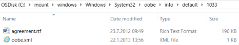

# Lab 8: Add branding and license agreements

You can add your own branding and license terms to Windows. 

For multi-region or multi-language images, you can create region specific license terms. These display to the user during the first login experience, based on the region or language that they choose. 

Note: If the license terms are included, the OEM must include a version of the license terms in each language that is preinstalled onto the PC. A license term text must be an .**rtf** file, saved as .**rtf** format.

Use the examples in the [USB-B.zip](http://download.microsoft.com/download/5/8/4/5844EE21-4EF5-45B7-8D36-31619017B76A/USB-B.zip) key.

## <span id="Create_license_files"></span>Create license files

1.  Create folders under a working folder, for example:

    `C:\mount\windows\Windows\System32\oobe\info\default\` 

2.  Add subfolders for each language using the **[Language Decimal Identifier](available-language-packs-for-windows.md)** corresponding the language. Do this step for each language pack added to the Windows image.

    For example, if en-us and de-de language packs are added to the Windows image, add a folder named “1033” (representing en-us language) under C:\mount\windows\Windows\System32\oobe\info\default\. Then add a folder named “1031” (representing de-de language) under the same directory.

    ```syntax
    md c:\mount\windows\windows\system32\oobe\info\default\1033
    md c:\mount\windows\windows\system32\oobe\info\default\1031
    ```

3.  Create license terms documents using the .rtf file format for each language specified. Move each license term document to the corresponding language folder. For example:

    ```syntax
    C:\mount\windows\Windows\System32\oobe\info\default\1033\agreement.rtf  (English version)
    C:\mount\windows\Windows\System32\oobe\info\default\1031\agreement.rtf  (German version)
    ```
    
    Samples are in C:\USB-B\resources\agreement.rtf
    
4.  Create an **oobe.xml** file to specify the agreement.rtf file path.

    ```syntax
    <?xml version="1.0" encoding="utf-8"?>
    <FirstExperience>
      <oobe>
        <oem>
	      <eulafilename>agreement.rtf</eulafilename>
        </oem>
      </oobe>
    </FirstExperience>
    ```

5.  Copy **oobe.xml file** to each language folder.

    ```syntax
    Copy e:\configset\oobe.xml c:\mount\windows\windows\system32\oobe\info\default\1033
    Copy e:\configset\oobe.xml c:\mount\windows\windows\system32\oobe\info\default\1031
    ```

6.  For Chinese Hong Kong, add the following OOBE.xml file. (In Windows 10 version 1607, the Chinese Hong Kong language pack was merged into the Chinese Taiwan language pack, so for this region, these steps are now required).

    File: c:\mount\windows\Windows\System32\OOBE\Info\OOBE.xml
    
    ```syntax
    <?xml version="1.0" encoding="utf-8" ?>
    <FirstExperience>
      <oobe>
        <defaults>
          <location>104</location>
        </defaults>
      </oobe>
    </FirstExperience>
    ```

7.  Verify that each language folder contains an **oobe.xml** file and an **agreement.rtf** file in that corresponding language.

    

### <span id="Create_image_files"></span>Create image info file
1.  Create an **csup.txt** file to specify when the Windows image was created. This file must include the date that the image was created, in the form of 'MM-DD-YYYY', with no other characters, on a single line at the top of the file.

    ```syntax
    12-31-2016
    ```

### <span id="Mount_the_image"></span>Mount the image

Use the steps from [Lab 3: Add device drivers (.inf-style)](add-device-drivers.md) to mount the image. The short version:

1.  Open the command line as an administrator (**Start** > type **deployment** > right-click **Deployment and Imaging Tools Environment** > **Run as administrator**.)

2.  Make a backup of the file (`copy "C:\Images\Win10_x64\sources\install.wim" C:\Images\install-backup.wim`)

3.  Mount the image (`md C:\mount\windows`, then `Dism /Mount-Image /ImageFile:"C:\Images\install.wim" /Index:1 /MountDir:"C:\mount\windows" /Optimize`)

### <span id="Add_the_license files"></span>Add the license and image info files

1.  Copy the answer file into the image into the \\Windows\\System32\\oobe\\ folder. Create the folder if it doesn’t exist.

    ``` syntax
    MkDir c:\mount\windows\windows\system32\oobe
    xcopy C:\oobe \c:\mount\windows\windows\system32\oobe /s
    ```
    
2.  Copy the image info file into the image.

    ``` syntax
    xcopy C:\temp\CSUP.txt c:\mount\windows\windows\csup.txt
    ```

### <span id="Add_custom_logo_and_wallpapaer"></span>Add a custom logo and wallpaper

Learn how to apply the logo using the [User Experience Windows Engineering Guide (UX WEG)](https://myoem.microsoft.com/oem/myoem/en/topics/Licensing/roylicres/ost2016/Pages/DP-UXWEGWin10.aspx) and for logo resolution requirements. 

1.  Copy the logo files into the image into the \\Windows\\System32\\OEM\\ folder. Create the folder if it doesn’t exist.

    ``` syntax
    MkDir c:\mount\windows\windows\system32\OEM
    Copy C:\OEM c:\mount\windows\windows\system32\OEM
    ```

## <span id="Unmount_the_images"></span> Unmount the images

1.  Close all applications that might access files from the image.

2.  Commit the changes and unmount the Windows image:

    ``` syntax
    Dism /Unmount-Image /MountDir:"C:\mount\windows" /Commit
    ```

    where *C* is the drive letter of the drive that contains the image.

    This process may take several minutes.

## <span id="Try_it_out"></span>Try it out

**Apply the image to a new PC**
Use the steps from [Lab 2: Deploy Windows using a script](deploy-windows-with-a-script-sxs.md) to copy the image to the storage USB drive, apply the Windows image and the recovery image, and boot it up. The short version:

1.  Copy the image file to the storage drive.
2.  [Boot the reference device to Windows PE using the Windows PE USB key](install-windows-pe-sxs.md).
3.  Find the drive letter of the storage drive (`diskpart, list volume, exit`).
4.  Apply the image: `D:\ApplyImage.bat D:\Images\install.wim`.
5.  Disconnect the drives, then reboot (`exit`).
	
**Verify license terms**

Log into the system as if you were a new user. Select your language or region of required. The correct license terms should show up during this first login experience.

Next steps: [Lab 9: Make changes from Windows (audit mode)](prepare-a-snapshot-of-the-pc-generalize-and-capture-windows-images-blue-sxs.md)