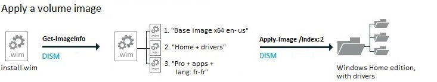

# Append, apply, and export volume images with a Windows Image (.wim) file

Manage multiple Windows images by combining them into a single .wim file. A single .wim file can take a fraction of the drive space that multiple .wim files can take. 

When you combine two or more Windows image files into a single .wim, any files that are duplicated between the images are only stored once.

  

Run these commands using DISM from a command prompt with administrator privileges.

## <span id="multiple_windows_images_in_a_.wim_file"></span><span id="MULTIPLE_WINDOWS_IMAGES_IN_A_.WIM_FILE"></span>Multiple Windows Images in a .wim file

**Combine images: append a volume image to an existing image**

Example: append an image of the D drive to an existing image called install.wim. Each new image receives a new index number, starting from 1.

``` syntax
Dism /Append-Image /ImageFile:"C:\images\install.wim /CaptureDir:D:\ /Name:"Home + drivers"
 ```

**See a list of the volume images contained in a .WIM file**

``` syntax
Dism /Get-ImageInfo /ImageFile:"C:\images\install.wim"
```

**Apply a volume image from the .WIM file**

You can refer to an image either by image name or image index number. Examples:

``` syntax
Dism /Apply-Image /ImageFile:"C:\images\install.wim" /Index:2 /ApplyDir:D:\

Dism /Apply-Image /ImageFile:"C:\images\install.wim" /Name:"Home + drivers" /ApplyDir:D:\
```

**Extract an image from the .WIM file**

Create a new .WIM file that includes only the files you need from a single volume image, for example, when [creating recovery media](create-media-to-run-push-button-reset-features-s14.md). The destination .WIM file starts with a new index number: 1.

Examples:

``` syntax
Dism /Export-Image /SourceImageFile:"C:\images\install.wim" /SourceIndex:2 /DestinationImageFile:"C:\resetmedia_amd64\media\sources\install.wim"

Dism /Export-Image /SourceImageFile:"C:\images\install.wim" /SourceName:"Home + drivers" /DestinationImageFile:"C:\resetmedia_amd64\media\sources\install.wim"
```

For more information, see [DISM Image Management Command-Line Options](dism-image-management-command-line-options-s14.md).

## <span id="related_topics"></span>Related topics

[Capture Images of Hard Disk Partitions Using DISM](capture-images-of-hard-disk-partitions-using-dism.md)

[DISM Image Management Command-Line Options](dism-image-management-command-line-options-s14.md)
