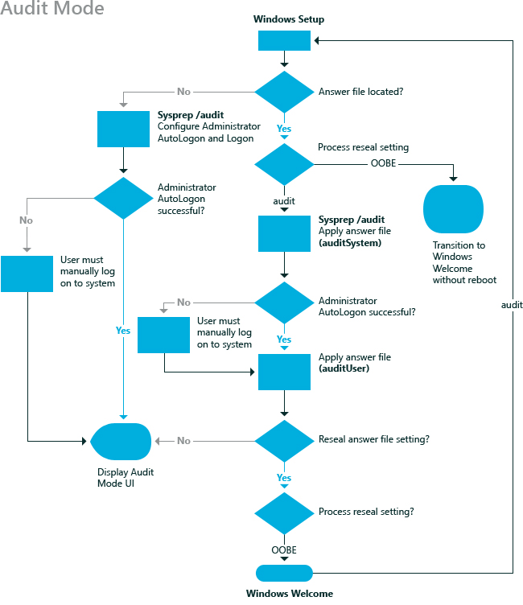

# auditSystem

The **auditSystem** configuration pass processes unattended Windows® Setup settings in system context in audit mode. The **auditSystem** configuration pass runs immediately before the [auditUser](audituser.md) configuration pass, which is used to apply settings in user context. When Windows boots to audit mode, the **auditSystem** configuration pass and the auditUser unattended Windows Setup settings are processed.

Audit mode enables OEMs and corporations to install additional device drivers, applications, and other updates to a master Windows image. By using audit mode, you can maintain fewer images because you can create a reference image with a minimal set of drivers and applications. The reference image can then be updated with additional drivers during audit mode. Additionally, you can then test and resolve any issues related to malfunctioning or incorrectly installed devices on the Windows image before shipping the computer to a customer. Audit mode is optional.

The following diagram shows when the **auditSystem** configuration pass is processed in audit mode.

The **auditSystem** configuration pass runs only when you configure Windows Setup to boot into audit mode. You can boot to audit mode by using the **sysprep** command with the **audit** option, or the **sysprep** command with the **generalize** and **audit** options, or you can specify the **Reseal** setting in the Microsoft-Windows-Deployment component. For more information, see [Audit Mode Overview](audit-mode-overview.md) and [Boot Windows to Audit Mode or OOBE](boot-windows-to-audit-mode-or-oobe.md).

## Related topics

[How Configuration Passes Work](how-configuration-passes-work.md)

[auditUser](audituser.md)

[generalize](generalize.md)

[offlineServicing](offlineservicing.md)

[oobeSystem](oobesystem.md)

[specialize](specialize.md)

[windowsPE](windowspe.md)

 

 

