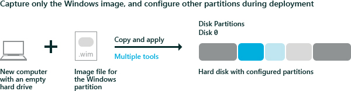

# Capture and Apply Windows, System, and Recovery Partitions


Capture a Windows image (.WIM) file and use it to deploy Windows to new devices.

Rather than capturing each partition, you can capture just the Windows partition into an image, and then use the files from that image to set up the rest of the partitions on the drive.

The following diagram illustrates this process:



**Prepare to capture the image**

-   Generalize the Windows image, so it can be deployed to other devices. For more information, see [Sysprep (Generalize) a Windows installation](sysprep--generalize--a-windows-installation.md).

**Capture the image**

1.  Boot the device using [Windows PE](winpe-intro.md).

2.  Optional: speed up the image capture by setting the power scheme to High performance:

    ``` syntax
    powercfg /s 8c5e7fda-e8bf-4a96-9a85-a6e23a8c635c
    ```

3.  Capture the Windows partition. For example:

    ``` syntax
    Dism /Capture-Image /ImageFile:"D:\fabrikam.wim" /CaptureDir:C:\ /Name:Fabrikam
    ```

    Where D: is a USB flash drive or other file storage location.

## <span id="Applying_the_image"></span><span id="applying_the_image"></span><span id="APPLYING_THE_IMAGE"></span>Applying the image


Here's a few ways to apply the image:

**Apply the image manually**

1.  On the destination device, use a DiskPart script to configure and format your hard drive partitions. For more information, see [Configure UEFI/GPT-Based Hard Drive Partitions](configure-uefigpt-based-hard-drive-partitions.md) or [Configure BIOS/MBR-Based Hard Drive Partitions](configure-biosmbr-based-hard-drive-partitions.md).

    **Note**  
    If you apply an image to a volume that has an existing Windows installation, files from the previous installation may not be deleted. Format the volume by using a tool such as DiskPart before you apply the new image. For example:

    ``` 
    diskpart /s D:\CreatePartitions-UEFI.txt
    ```
    Where D: is a USB flash drive or other file storage location.

    In these **DiskPart** examples, the partitions are assigned the letters: System=S, Windows=W, and Recovery=R.

    We recommend changing the Windows drive letter to a letter that’s near the end of the alphabet, such as W, to avoid drive letter conflicts. Do not use X, because this drive letter is reserved for Windows PE. After the device reboots, the Windows partition is assigned the letter C, and the other partitions don’t receive drive letters.

    If you reboot, Windows PE reassigns disk letters alphabetically, starting with the letter C, without regard to the configuration in Windows Setup. This configuration can change based on the presence of different drives, such as USB flash drives.

2.  Optional: speed up the image capture by setting the power scheme to High performance:

    ``` syntax
    powercfg /s 8c5e7fda-e8bf-4a96-9a85-a6e23a8c635c
    ```

3.  Apply the image to the Windows partition:

    ``` syntax
    dism /Apply-Image /ImageFile:D:\install.wim /Index:1 /ApplyDir:W:\
    ```

    where W: is the Windows partition.

4.  Configure the system partition by using the BCDBoot tool. This tool copies and configures system partition files by using files from the Windows partition. For example:

    ``` syntax
    W:\Windows\System32\bcdboot W:\Windows /s S:
    ```

5.  Copy the Windows Recovery Environment (RE) tools into the recovery tools partition.

    ``` syntax
    md R:\Recovery\WindowsRE
    copy C:\Windows\System32\Recovery\winre.wim R:\Recovery\WindowsRE\winre.wim
    ```

    Where R: is the recovery partition

6.  Register the location of the WindowsRE tools by using REAgentC.

    ``` syntax
    W:\Windows\System32\reagentc /setreimage /path R:\Recovery\WindowsRE /target W:\Windows
    ```

**Apply the image using a script**

1.  Prerequisite: Create DiskPart scripts to deploy your images. For samples, get: [CreatePartitions-UEFI.txt](configure-uefigpt-based-hard-drive-partitions.md) or [CreatePartitions-BIOS.txt](configure-biosmbr-based-hard-drive-partitions.md).

2.  Copy the following script into Notepad, and then save the file as ApplyImage.bat:

    ``` syntax
    rem == ApplyImage.bat ==

    rem == These commands deploy a specified Windows
    rem    image file to the Windows partition, and configure
    rem    the system partition.

    rem    Usage:   ApplyImage WimFileName 
    rem    Example: ApplyImage E:\Images\ThinImage.wim ==

    rem == Set high-performance power scheme to speed deployment ==
    call powercfg /s 8c5e7fda-e8bf-4a96-9a85-a6e23a8c635c

    rem == Apply the image to the Windows partition ==
    dism /Apply-Image /ImageFile:%1 /Index:1 /ApplyDir:W:\

    rem == Copy boot files to the System partition ==
    W:\Windows\System32\bcdboot W:\Windows /s S:

    :rem == Copy the Windows RE image to the
    :rem    Windows RE Tools partition ==
    md R:\Recovery\WindowsRE
    xcopy /h W:\Windows\System32\Recovery\Winre.wim R:\Recovery\WindowsRE\

    :rem == Register the location of the recovery tools ==
    W:\Windows\System32\Reagentc /Setreimage /Path R:\Recovery\WindowsRE /Target W:\Windows

    :rem == Verify the configuration status of the images. ==
    W:\Windows\System32\Reagentc /Info /Target W:\Windows
    ```

3.  On the destination computer, run the Diskpart and ApplyImage scripts to apply the image to the computer and set up the system, Windows, and recovery partitions. For example:

    ``` syntax
    diskpart /s D:\CreatePartitions-UEFI.txt
    ApplyImage E:\Images\ThinImage.wim
    ```

    where D:\\Images\\ThinImage.wim is the name of your Windows image file.

    **Note**  If the DISM /Apply-Image command fails, make sure you’re using a [supported version of DISM](dism-supported-platforms.md) for that Windows image. For example, to apply a Windows 10 image, you’ll need the Windows 10 version of DISM.

     

**Capture and apply individual partitions (BIOS devices only)**

1.  On your reference device, capture each of the partitions individually using DISM /Capture-Image and then apply them to your destination devices using DISM /Apply-Image.

    This method allows you flexibility in setting up your system partition. Note, for UEFI-based devices, do not capture and apply the EFI system partition or the MSR partition – these are managed by the device.

2.  Use the BCDBoot command to set up the system partition.

    ``` syntax
    bcdboot C:\Windows
    ```

**Capture and apply the entire drive**

-   **** You can use the Full Flash Update (FFU) file format to capture and apply the entire drive. To learn more, see [Deploy Windows using Full Flash Update (FFU)](deploy-windows-using-full-flash-update--ffu.md).

## <span id="related_topics"></span>Related topics


[Configure UEFI/GPT-Based Hard Drive Partitions](configure-uefigpt-based-hard-drive-partitions.md)

[Configure BIOS/MBR-Based Hard Drive Partitions](configure-biosmbr-based-hard-drive-partitions.md)

[BCDboot Command-Line Options](bcdboot-command-line-options-techref-di.md)

[REAgentC Command-Line Options](reagentc-command-line-options.md)

 

 


