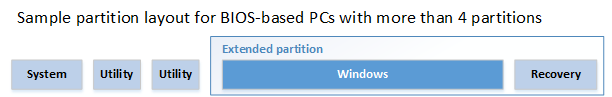

# Configure More than Four Partitions on a BIOS/MBR-Based Hard Disk


This topic describes how to configure more than four disk partitions when you deploy Windows on BIOS and master boot record (MBR)-based devices.

## <span id="DiskPartitionRules"></span><span id="diskpartitionrules"></span><span id="DISKPARTITIONRULES"></span>Disk partition rules


-   On BIOS-based systems, you can designate one of the four standard partitions as an *extended partition*.

    An extended partition is a special partition that can be divided into additional partitions that are called *logical partitions*. An extended partition cannot store files. An extended partition does not receive a partition ID.

-   You can include as many logical partitions as your disk can hold.

    Logical partitions can store files. You can use a logical partition as the Windows partition.

For additional disk partition rules for BIOS-based systems, see [Configure BIOS/MBR-Based Hard Drive Partitions](configure-biosmbr-based-hard-drive-partitions.md).

**Recommendations**

1.  Add system and utility partitions before you add the Windows partition.

2.  Add the recovery tools partition immediately after the Windows partition. When you use this partition order, then when future updates to the recovery tools are needed, the partition can be resized automatically.

**Sample partition layout:**



## <span id="ConfiguringPartitionsUsingDiskPart"></span><span id="configuringpartitionsusingdiskpart"></span><span id="CONFIGURINGPARTITIONSUSINGDISKPART"></span>Configuring disk partitions by using a DiskPart script in Windows PE


For image-based deployment, boot the device by using Windows PE, and then use the DiskPart tool to create the partition structures on your destination devices. For more information, see [Apply Images Using DISM](apply-images-using-dism.md).

**Note**  
Windows PE reassigns disk letters alphabetically, beginning with the letter "C", without regard to the configuration in Windows Setup. This configuration can change based on the presence of different drives, including USB flash drives.

In these DiskPart examples, the partitions are assigned the letters "U", "V", "S", "W", and "R" to avoid drive-letter conflicts. After the device reboots, Windows PE automatically assigns the letter "C" to the Windows partition. The Utility1, Utility2, system, and recovery image partitions do not receive drive letters.

 

The following steps describe how to partition your hard drives and prepare to apply images. You can use the code in the sections that follow to complete these steps.

**To partition hard drives and prepare to apply images**

1.  Save the code in the following sections as a text file (PrepareMyPartitions.txt) on a USB flash drive.

2.  Use Windows PE to boot the destination device.

3.  Use the `DiskPart /s F:\PrepareMyPartitions.txt` command, where *F*: is the letter of the USB flash drive, to partition the drives.

## <span id="Sample_code"></span><span id="sample_code"></span><span id="SAMPLE_CODE"></span>Sample code


Save the following code as "PrepareMyPartitions.txt", and then run the script by using the DiskPart tool to automate the configuration of the Utility1, Utility2, system, extended, Windows, and recovery tools partitions:

``` syntax
select disk 0
clean
rem == 1. System partition ======================
create partition primary size=100
format quick fs=ntfs label="System"
assign letter="S"
active
rem == 2. Utility partition =====================
create partition primary size=100
format quick fs=ntfs label="Utility1"
assign letter="U"
set id=27
rem == 3. Utility partition =====================
create partition primary size=200
format quick fs=ntfs label="Utility2"
assign letter="V"
set id=27
rem == 4. Extended partition ====================
create partition extended
rem == 4a. Windows partition ====================
rem ==    a. Create the Windows partition =======
create partition logical
rem ==    b. Create space for the recovery tools  
shrink minimum=500
rem       ** NOTE: Update this size to match the
rem                size of the recovery tools 
rem                (winre.wim)                 **
rem ==    c. Prepare the Windows partition ====== 
format quick fs=ntfs label="Windows"
assign letter="C"
rem == 4b. Recovery tools partition ==============
create partition logical
format quick fs=ntfs label="Recovery"
assign letter="R"
set id=27
list volume
exit
```

## <span id="Next_Steps"></span><span id="next_steps"></span><span id="NEXT_STEPS"></span>Next Steps


After you create the partitions, you can use a deployment script to apply the Windows images on the newly created partitions. For more information, see [Capture and Apply Windows, System, and Recovery Partitions](capture-and-apply-windows-system-and-recovery-partitions.md).

## <span id="related_topics"></span>Related topics


[Configure BIOS/MBR-Based Hard Drive Partitions](configure-biosmbr-based-hard-drive-partitions.md)

 

 


