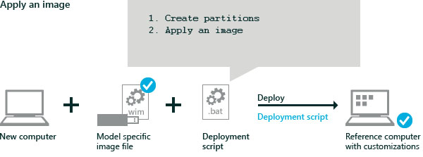

# Lab 2: Deploy Windows using a script

You can use scripts to take a Windows image and deploy Windows onto new PCs quickly. You can modify these scripts to change the size of the drive partitions, or to completely automate deployment. 

## <span id="Get_the_image"></span>Step 1: Mount the image

1.  On your technician PC, right-click the .img file for Windows 10, version 1703 Home from the X21-08790 DVD, and select **Mount**. This loads the files to a temporary drive letter (example, D:).

2.  Extract the Home edition. The X21-34314 image includes both  Professional and Home editions. (Index 1=Professional, Index 2=Home). We recommend starting with the Home edition, because you can upgrade your images later from Home to Professional using DISM commands, but you can't downgrade. 

    ``` syntax
    Dism /Get-ImageInfo /ImageFile:"D:\sources\install.wim"

    md E:\images

    Dism /Export-Image /SourceImageFile:"D:\sources\install.wim" /SourceIndex:2 /DestinationImageFile:"E:\Images\install.wim"
	```

	where D: is the drive from the Windows ISO and E: is the USB storage drive. 

## <span id="Copy_the_deployment_scripts"></span>Step 2: Copy the deployment scripts to the root of the USB storage drive

Copy the [sample scripts](windows-deployment-sample-scripts-sxs.md) to the root of the USB storage drive.
[Download a copy here](http://go.microsoft.com/fwlink/p/?LinkId=800657)

## <span id="Apply_the_image"></span>Step 3: Apply the Windows image using a script

Use deployment scripts to apply the image onto a test device. These scripts set up the hard drive partitions and add the files from the Windows image to the partitions.

The sample scripts include steps that detect the firmware type (the newer UEFI-based BIOS, or the legacy BIOS). Some UEFI-based devices include support for the older legacy BIOS. For more info, see [UEFI Firmware](http://go.microsoft.com/fwlink/?LinkId=526945).



1.  [Boot the reference device to Windows PE using the Windows PE USB key](install-windows-pe-sxs.md).

2.  Take out the Windows PE USB key and put in the Storage USB key.
	
3.  Find the drive letters of the USB key by using diskpart:

    ``` syntax
    diskpart
    DISKPART> list volume
    DISKPART> exit
    ```

    For example, the drives can be lettered like this: C = Windows; D = USB storage drive.

4.  Format the primary hard drive, create the partitions, and apply the image by using the pre-made [sample scripts](windows-deployment-sample-scripts-sxs.md). 

    The script **ApplyImage.bat** uses the diskpart scripts: CreatePartitions-UEFI.txt and CreatePartitions-BIOS.txt to create the partitions and define the partition layout. These scripts must be placed in the same folder. You can update these scripts to change the partition sizes.

    ``` syntax
    D:
    D:\ApplyImage.bat D:\Images\install.wim
    ```

    When prompted by the script: 
    
    1.  Select an image index number. For the Home/Pro edition, the Pro edition is index 1, the Home edition is index 2. 
    2.  Press Y to format the drive.
    3.  Press Y to select [Compact OS](compact-os.md), or N to select a non-compacted OS:
        -   **Y**: Applies the image using Compact OS. This is best for devices with solid-state drives and drives with limited free space.
        -   **N**: Applies the image as a fully-uncompressed image. This is best for high-performance devices or devices that use traditional hard drives with rotational media.
    4.  Press N to indicate the image does not include extended attributes (EA).

    The scripts apply the image to the drive, and then finishes.
	
## <span id="Apply_desktop_applications"></span>Step 4: Apply desktop applications

**Skip this step** until you've completed [Lab 10: Add desktop applications and settings with siloed provisioning packages (SPPs)](add-desktop-apps-with-spps-sxs.md). This step adds Windows desktop applications to your images. This must be done before adding the recovery image.

1.  Apply desktop applications.

    ```syntax
    D:\ADKTools\amd64\WimMountAdkSetupAmd64.exe /Install /q
    D:\ADKTools\amd64\DISM.exe /ImagePath:C:\ /Apply-SiloedPackage /PackagePath:E:\SPPs\office16_base.spp /PackagePath:E:\SPPs\office16_fr-fr.spp /PackagePath:E:\SPPs\office16_de-de.spp
	```

## <span id="Apply_the_recovery_image"></span>Step 5: Set up the system recovery tools

**Optional: skip this step** until you've completed [Lab 12: Update the recovery image](update-the-recovery-image.md). 

Include a recovery image for your final images, but it's not required for these early testing steps. 

1.  Apply the Windows Recovery Environment (Windows RE) image. These tools help repair common causes of unbootable operating systems. The image is stored in a separate drive partition. The script **ApplyRecovery.bat** uses the diskpart scripts: HidePartitions-UEFI.txt and HidePartitions-BIOS.txt to set up this partition. These scripts must be placed in the same folder as ApplyRecovery.bat.

	```syntax
	D:\ApplyRecovery.bat
	```

## <span id="Reboot"></span>Step 6: Reboot

Disconnect the drives, then reboot (`exit`).

The PC should reboot into Windows. While you’re waiting for the preparation phase to complete, go back to your technician PC and continue with the lab.

**Troubleshooting**: If the device does not boot, turn on the device, and press the key that opens the boot-device selection menu (for example, the **Esc** key). Select the hard drive as your boot device, and continue.

**Optional: Test the recovery image**
1.  Complete the first logon experience like a regular user.
2.  Select **Start** &gt; **Settings** &gt; **Update & security** &gt; **Recovery** &gt; under **Reset this PC**, click **Get started** > **Remove everything** > **Just remove my files** > **Next**.
3.  After Windows completes the reset,  Windows should go back to the original welcome screens as if there were no user account on the device.

**Next Steps**
[Lab 3: Add device drivers (.inf-style)](add-device-drivers.md) (includes basics on mounting images)

