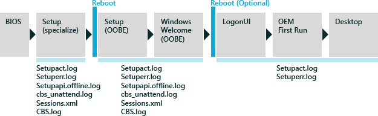
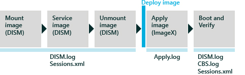

# Deployment Troubleshooting and Log Files

The following section describes the relationship between common deployment scenarios and their associated log files. Windows® deployment is a highly customizable process, which has the potential for many points of failure. Identifying the specific point of failure you have encountered begins with understanding how the underlying technologies work.

## Windows Setup Scenario

This scenario begins with completing Windows Setup on a new computer, so that you arrive at the desktop. This scenario is most common when you are creating a reference image. This process is also known as the *first user experience*.

As shown in the following illustration, the key to solving failures is identifying where you are in the installation process and when a failure occurs. Because you are creating a new installation, the hard drive is not initially available, so Windows Setup writes logs into memory, specifically in a Windows PE session (X:\\Windows). After the hard drive is formatted, Setup continues logging directly onto the new hard drive (C:\\Windows). Log files created during the Windows PE session are temporary.

When a failure occurs in Windows Setup, review the entries in the Setuperr.log file first, then the Setupact.log file second, and then other log files as needed.

### Windows Setup-Related Log Files

<table>
<colgroup>
<col width="33%" />
<col width="33%" />
<col width="33%" />
</colgroup>
<thead>
<tr class="header">
<th align="left">Log file</th>
<th align="left">Description</th>
<th align="left">Location</th>
</tr>
</thead>
<tbody>
<tr class="odd">
<td align="left">
Setupact.log
</td>
<td align="left">
Primary log file for most errors that occur during the Windows installation process. There are several instances of the Setupact.log file, depending on what point in the installation process the failure occurs. It is important to know which version of the Setupact.log file to look at, based on the phase you are in.
</td>
<td align="left">
<strong>Setup (specialize):</strong> X:\Windows\panther

<strong>Setup (OOBE), LogonUI, OEM First Run:</strong>%windir%\panther

<strong>Out-Of-Box Experience (OOBE):</strong> %windir%\panther\unattendGC
</td>
</tr>
<tr class="even">
<td align="left">
Setuperr.log
</td>
<td align="left">
High-level list of errors that occurred during the <strong>specialize</strong> phase of Setup. The Setuperr.log file does not provide any specific details.
</td>
<td align="left">
<strong>Setup (specialize):</strong> %windir%\panther

<strong>Setup (specialize):</strong> %windir%\panther

<strong>Setup (OOBE), LogonUI, OEM First Run:</strong> %windir%\panther
</td>
</tr>
<tr class="odd">
<td align="left">
Setupapi.offline.log
</td>
<td align="left">
Driver failures during the Component Specialization sub-phase of the Setup <strong>specialize</strong> phase.
</td>
<td align="left">
%windir%\inf
</td>
</tr>
<tr class="even">
<td align="left">
Cbs_unattend.log
</td>
<td align="left">
Unattended-setup servicing failures.
</td>
<td align="left">
%windir%\panther
</td>
</tr>
<tr class="odd">
<td align="left">
Setupapi.dev.log
</td>
<td align="left">
Driver failures during the <strong>oobe</strong> phase of Setup.
</td>
<td align="left">
%windir%\inf
</td>
</tr>
<tr class="even">
<td align="left">
Sessions.xml
</td>
<td align="left">
An XML-based transaction log file that tracks all servicing activity, based on session id, client, status, tasks, and actions. If necessary, the Sessions.log file will point to the DISM.log and CBS.log files for more details.
</td>
<td align="left">
%windir%\servicing\sessions
</td>
</tr>
<tr class="odd">
<td align="left">
CBS.log
</td>
<td align="left">
Servicing log file that provides more details about offline-servicing failures.
</td>
<td align="left">
%windir%\panther
</td>
</tr>
</tbody>
</table>

 

## Offline Servicing Scenario

This scenario involves adding and removing updates, drivers, and language packs, and configuring other settings, without booting Windows. Offline servicing is an efficient way to manage existing images that are stored on a server, because it eliminates the need for recreating updated images. You can perform offline servicing on an image that is mounted or applied to a drive or directory.

The Deployment Image Servicing and Management (DISM) tool is the primary tool for all offline-servicing tasks. DISM runs from a command prompt from Windows PE or a running Windows operating system. If a failure occurs when executing a DISM command, the tool will provide an immediate response, and log the issue in the DISM.log file. The Session.xml file is a transaction log file that captures all servicing activities on the target operating system. The Session.xml file can be used in conjunction with the DISM.log file to determine points of failures and the required servicing activity.

When a failure occurs in offline servicing, look at the DISM.log file first for specific errors. If the DISM.log file doesn’t contain any errors, review the Sessions.xml log file second, and then the CBS.log file.

### Offline Servicing Related Log Files

<table>
<colgroup>
<col width="33%" />
<col width="33%" />
<col width="33%" />
</colgroup>
<thead>
<tr class="header">
<th align="left">Log file</th>
<th align="left">Description</th>
<th align="left">Location</th>
</tr>
</thead>
<tbody>
<tr class="odd">
<td align="left">
DISM.log
</td>
<td align="left">
Primary log file for all offline actions using DISM.
</td>
<td align="left">
%windir%\logs\dism

You can also create the DISM log file in a different location by using the <strong>/LogPath</strong> option. The level of data written to the log file can also be controlled by using the <strong>/LogLevel</strong> option.
</td>
</tr>
<tr class="even">
<td align="left">
Sessions.xml
</td>
<td align="left">
An XML-based transaction log that tracks all servicing activity, based on session id, client, status, tasks, and actions. If necessary, the Sessions.log file will point to the DISM.log and CBS.log files for more details.
</td>
<td align="left">
%windir%\servicing\sessions
</td>
</tr>
</tbody>
</table>

 

To learn more about offline servicing, see [Understanding Servicing Strategies](understanding-servicing-strategies.md).

## Online Servicing Scenario

This scenario is servicing a running operating system. This scenario involves booting the computer to audit mode to add drivers, applications, and other packages. Online servicing is ideal for drivers if the driver packages have co-installers or application dependencies. It is also efficient when the majority of your servicing packages have installers, the updates are in either .msi or KB.exe file formats, or the applications rely on Windows-installed services and technologies (such as the .NET Framework or full plug and play support).

Like offline servicing, all logging is captured in the DISM.log, CBS.log, and Sessions.xml files. If a failure occurs when executing a DISM command, the tool will provide immediate response as well as log the issue in the DISM.log file. The Session.xml file is a transaction log file that captures all servicing activities on the target operating system. The Session.xml file can be used in conjunction with the DISM.log file to determine points of failures and the required servicing activities.

When a failure occurs in offline servicing, look at the DISM.log file for specific errors. If the DISM.log file doesn’t contain any errors, review the Sessions.xml log file and then the CBS.log file.

### Online Servicing-Related Log Files

<table>
<colgroup>
<col width="33%" />
<col width="33%" />
<col width="33%" />
</colgroup>
<thead>
<tr class="header">
<th align="left">Log file</th>
<th align="left">Description</th>
<th align="left">Location</th>
</tr>
</thead>
<tbody>
<tr class="odd">
<td align="left">
DISM.log
</td>
<td align="left">
Primary log file for all online actions using DISM. If necessary, DISM.log will point to CBS.log for more details.
</td>
<td align="left">
%windir%\logs\dism

You can also point DISM log file to a different location by using the /LogPath command option. The log data can also be controlled by using the /LogLevel command option.
</td>
</tr>
<tr class="even">
<td align="left">
CBS.log
</td>
<td align="left">
Secondary log file that provides more details about an online servicing failure. DISM.log will reference CBS.log for more details.
</td>
<td align="left">
%windir%\logs\cbs
</td>
</tr>
<tr class="odd">
<td align="left">
Sessions.xml
</td>
<td align="left">
An xml based transaction log that tracks all servicing activity based on session id, client, status, tasks, and actions. If necessary, Sessions.log will point to DISM.log and CBS.log for more details.
</td>
<td align="left">
%windir%\servicing\sessions
</td>
</tr>
</tbody>
</table>

 

To learn more about offline servicing, see [Understanding Servicing Strategies](understanding-servicing-strategies.md).

 

 

