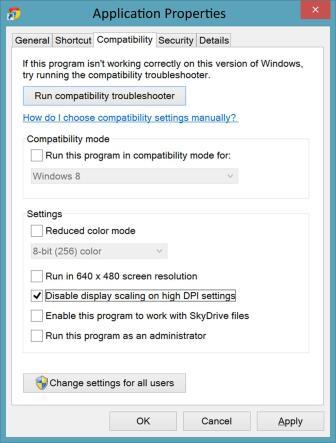
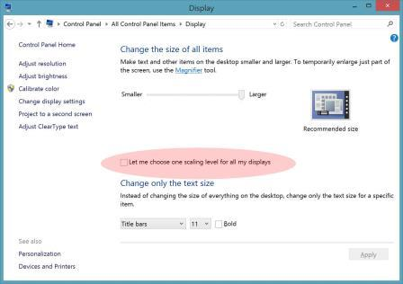

# Fixing blurry text in Windows 8.1 for IT Professionals

Windows® desktop apps fall broadly into two classes: apps that are *DPI-aware* and those that are not. DPI-aware apps actively let Windows know during application launch that they are capable of scaling themselves to work well on a high DPI display. These apps include: Internet Explorer, Office, Firefox, and .NET 2.0+ (including WPF) apps. These apps generally work well across a wide range of scale factors. Therefore, if your enterprise line of business apps are also DPI-aware, your users should not have a problem with any Windows 8.1 displays or scale factors.

However, if an application is not DPI aware, and is running on a high DPI display, Windows scales the app by applying bitmap scaling to the application output. This ensures that the application is the correct size on a high DPI display. In most instances this will result in crisp and usable applications, but in some instances, the result is less crisp and might have a slightly fuzzy or blurry appearance because of the bitmap scaling.

**In this topic:**

-   [How to tell if an application is not DPI-aware](#recognize)

-   [What you can do about apps that aren’t DPI-aware](#unaware)

-   [Tell Windows not to scale an app that’s not DPI-aware](#dontscale)

## How to tell if an application is not DPI-aware

Use the [Process Explorer tool](http://go.microsoft.com/fwlink/p/?linkid=204774) to determine if an app is DPI-aware. *Figure 1 Process Explorer* shows this utility in use, with the column for **DPI Awareness** enabled. (By default, process explorer does not show the **DPI Awareness** column. To turn this column on, click the **View** menu, click **Select Columns**, check the box for **DPI Awareness**, and click **OK**.) The column titled **DPI Awareness** tells you whether a particular process is aware of DPI or not.

**Figure 1 Process Explorer**

Windows 8.1 distinguishes between three classes of applications.

**Table 1 DPI Awareness Apps**

<table>
<colgroup>
<col width="33%" />
<col width="33%" />
<col width="33%" />
</colgroup>
<thead>
<tr class="header">
<th align="left">DPI awareness</th>
<th align="left">Examples</th>
<th align="left">Behavior</th>
</tr>
</thead>
<tbody>
<tr class="odd">
<td align="left">
Unaware
</td>
<td align="left">
<strong>Mmc.exe</strong> (Microsoft Management Console and its plugins)
</td>
<td align="left">
Windows bitmap scales the application to any high DPI displays that are attached to the system; can be fuzzy at 125% and 150% scale factors.
</td>
</tr>
<tr class="even">
<td align="left">
System-aware
</td>
<td align="left">
Office apps
</td>
<td align="left">
Application scales itself at launch to the system DPI (usually the same as the primary display DPI); Windows scales the app to any displays that do not match this.
</td>
</tr>
<tr class="odd">
<td align="left">
Per-monitor-aware
</td>
<td align="left">
Internet Explorer 11
</td>
<td align="left">
Application dynamically scales itself to the display DPI.
</td>
</tr>
</tbody>
</table>

 

## What you can do about apps that aren’t DPI-aware

### Run the latest version of the app or ask the application vendor to update their app to be DPI aware

Microsoft recommends that all applications become DPI-aware. It is possible that newer versions of your applications are already DPI-aware. If they are not, you can ask your app vendor to update their app to be DPI aware. Microsoft provides developer resources that can help them update their app, including the following:

-   [Making Your Desktop Apps Shine on High- DPI Displays (BUILD 2013 presentation)](http://go.microsoft.com/fwlink/p/?linkid=329827)

-   [Writing DPI-Aware Desktop Applications in Windows 8.1](http://go.microsoft.com/fwlink/p/?LinkID=307061)

-   [Dynamic DPI sample](http://go.microsoft.com/fwlink/p/?linkid=329826)

### Tell Windows not to scale an app that’s not DPI-aware

In the cases where users cannot deal with the bitmap scaling of apps that aren’t DPI-aware (for example, 125% scaling and fuzzy applications), individual Windows desktop applications can be shimmed to not be scaled. Users can do this by using the **Compatibility** tab of the application’s **Properties** UI. For example, *Figure 2 Application Properties* shows how a user can disable bitmap scaling:

**Figure 2 Application Properties**

You can manage bulk-shimming of applications by using the Compatadmin tool, which is available in the Application Compatibility Toolkit that is included in the Windows Assessment and Deployment Kit (ADK). You can download the Windows ADK from [Windows Assessment and Deployment Kit (ADK) for Windows® 8](http://go.microsoft.com/fwlink/p/?linkid=288775). For more information about how to use the Compatadmin tool, see [How to use the Compatibility Administrator utility in Windows](http://go.microsoft.com/fwlink/p/?linkid=329828).

**Important**  
Disabling display scaling can result in content that is too small to be read or interacted with reliably; it can also produce visual artifacts such as clipped or overlapped content. These issues depend on details of how the app was written. Consequently, we recommend only changing this setting if absolutely required. This shim should not be applied to apps that do not require it, or to devices that do not require it.

 

### Use Windows 8 DPI scaling (not generally recommended)

Windows 8.1 includes a Windows 8 compatibility scaling mode that can be deployed to address all visual blurring issues with certain displays. Note that using the compatibility mode turns off all the benefits of the Windows 8.1 DPI features. This method should only be used as a last resort, if the enterprise environment includes too many apps that aren’t DPI-aware to be mitigated by applying application shimming. Users can access this mode in the DPI CPL UI by checking the box that says **Let me choose one scaling level for all my displays**:

**Figure 3 Scaling Level Option**

This setting can also be applied during deployment if you have many specific apps that need remediation and you plan a large scale roll-out to low or mid-density displays. You can customize your image in Audit mode before deployment. See [Audit Mode Overview](http://go.microsoft.com/fwlink/p/?linkid=214469). See also the next section that explains how to programmatically perform device detection and registry customization.

### Understanding high DPI, display types, and Windows scaling

Windows 8.1 scales apps that aren’t DPI-aware dynamically by resizing the bitmap generated by the application. Bitmap scaling works best when scaled at integer multiples (for example, 1x, 2x, 3x), but can have visual artifacts that are often perceived as blurry/fuzzy at non-integer multiples (for example, 125%, 150%.)

Windows supports a full spectrum of screen sizes, resolutions, and therefore DPI. There will be some DPI ranges that result in less than optimal Windows scaling for apps that aren’t DPI-aware.

*Table 2 Scaling Values* describes the possible issues that users can encounter at different Windows scaling values:

**Table 2 Scaling Values**

<table>
<colgroup>
<col width="20%" />
<col width="20%" />
<col width="20%" />
<col width="20%" />
<col width="20%" />
</colgroup>
<thead>
<tr class="header">
<th align="left">Scale factor</th>
<th align="left">100% mainstream</th>
<th align="left">125% value</th>
<th align="left">150% premium</th>
<th align="left">200% premium</th>
</tr>
</thead>
<tbody>
<tr class="odd">
<td align="left">
Scaling benefit
</td>
<td align="left">
N/A
</td>
<td align="left">
Small size improvement
</td>
<td align="left">
Significant size improvement
</td>
<td align="left">
Critical size improvement
</td>
</tr>
<tr class="even">
<td align="left">
Bitmap scaling of unaware apps
</td>
<td align="left">
N/A
</td>
<td align="left">
Most noticeable fuzziness
</td>
<td align="left">
Less noticeable fuzziness
</td>
<td align="left">
Clear and crisp
</td>
</tr>
<tr class="odd">
<td align="left">
Scaling of aware apps
</td>
<td align="left">
N/A
</td>
<td align="left">
Clear and crisp
</td>
<td align="left">
Clear and crisp
</td>
<td align="left">
Clear and crisp
</td>
</tr>
</tbody>
</table>

 

As shown in the preceding table, most of the issues manifest at the 125% scaling ratio. For this reason, any mitigation should target apps that aren’t DPI-aware on 125% scaling systems only.

For information about how to identify 125% systems or how to revert to Windows 8 scaling behavior for a 125% system, see [DPI-related APIs and registry settings](dpi-related-apis-and-registry-settings.md).

## Related topics

[High DPI Support for IT Professionals](high-dpi-support-for-it-professionals.md)

 

 

