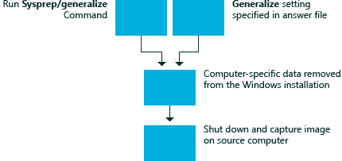

# generalize

The **generalize** configuration pass of Windows® Setup is used to create a Windows reference image that can be used throughout an organization. Settings in the **generalize** configuration pass enable you to automate the behavior for all deployments of this reference image. In comparison, settings applied in the [specialize](specialize.md) configuration pass enable you to override behavior for a single, specific deployment.

When a system is generalized, specific configuration data for a given installation of Windows is removed. For example, during the **generalize** configuration pass, the unique security ID (SID) and other hardware-specific settings are removed from the image.

The **generalize** configuration pass runs only when you use the **Sysprep** command with the **/generalize** option. Answer file settings in the `<generalize>` section of an answer file are applied to the system before **Sysprep** generalization occurs. The system then shuts down.

The following diagram shows the process of the **generalize** configuration pass.

The [specialize](specialize.md) configuration pass runs immediately after the next time that the system boots. When you run **Sysprep**, you can decide whether Windows will boot to audit mode or Windows Welcome by specifying **/audit** or **/oobe**. The **specialize** configuration pass always runs after a computer has been generalized, regardless of whether the computer is configured to boot to audit mode or Windows Welcome.

Any method of moving or copying a Windows image to a new computer must be prepared with the **sysprep /generalize** command. For more information, see [Sysprep (Generalize) a Windows installation](sysprep--generalize--a-windows-installation.md).

## Related topics

[How Configuration Passes Work](how-configuration-passes-work.md)

[auditSystem](auditsystem.md)

[auditUser](audituser.md)

[offlineServicing](offlineservicing.md)

[oobeSystem](oobesystem.md)

[specialize](specialize.md)

[windowsPE](windowspe.md)

 

 

