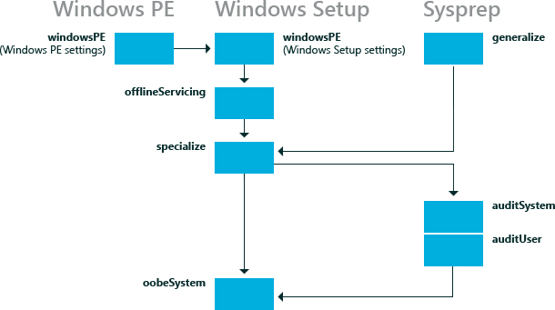

# How Configuration Passes Work


Configuration passes are the phases of a Windows® installation during which you can customize an image. Windows unattended installation settings can be applied in one or more configuration passes, depending on the setting you use. Understanding how and when configuration passes run is very important in developing a Windows deployment strategy.

In this topic:

-   [Understanding Configuration Passes](#understand)

-   [Configuring Device Drivers](#configdevice)

-   [Configuring International Settings](#configintsettings)

-   [Examples](#examples)

## <span id="understand"></span><span id="UNDERSTAND"></span>Understanding Configuration Passes


The following diagram shows the relationship between the configuration passes relative to the different deployment tools.



Not all configuration passes run in a particular installation of Windows. Some configuration passes, such as **auditSystem** and **auditUser**, run only if you boot the computer to audit mode. Most Windows Setup unattend settings can be added to either the **specialize** or the **oobeSystem** configuration pass. The other configuration passes can also be useful in certain situations. The following table describes each of the configuration passes.

<table>
<colgroup>
<col width="33%" />
<col width="33%" />
<col width="33%" />
</colgroup>
<thead>
<tr class="header">
<th align="left">Configuration pass</th>
<th align="left">Description</th>
<th align="left">Configuration pass runs when</th>
</tr>
</thead>
<tbody>
<tr class="odd">
<td align="left"><p><strong>windowsPE</strong></p></td>
<td align="left"><p>Many aspects of the installation process can be automated during the <strong>windowsPE</strong> configuration pass. In this pass you can configure:</p>
<ul>
<li><p>Windows PE options</p>
<p>These options can include specifying the location of the Windows PE log file, which enables networking or a Windows PE page file.</p></li>
<li><p>Windows Setup options</p>
<p>These options can include specifying the Windows image to install and configuring a disk on the destination computer.</p></li>
</ul>
<p>During this configuration pass, the Windows image is copied to the destination computer after the settings in the <strong>windowsPE</strong> configuration pass are processed.</p>
<p>If your installation of Windows PE requires boot-critical drivers to access the local hard disk drive or a network, use this configuration pass to add drivers to the Windows PE driver store and to reflect the required boot-critical drivers</p></td>
<td align="left"><p>One of the following occurs:</p>
<ul>
<li><p>Booting the Windows Setup media</p></li>
<li><p>Starting Windows Setup from a previous Windows installation</p></li>
</ul>
<p>The Windows PE options are applied only when you are running Windows Setup from a Windows PE environment. The Windows Setup options are applied when it runs from either Windows PE or a previous Windows installation.</p></td>
</tr>
<tr class="even">
<td align="left"><p><strong>offlineServicing</strong></p></td>
<td align="left"><p>This configuration pass is used to apply updates, drivers, or language packs to a Windows image.</p>
<p>During Windows Setup, the Windows image is applied to a hard disk and any settings in the <strong>offlineServicing</strong> section of an answer file are then applied to that image before the computer reboots.</p>
<p>During this configuration pass, you can add drivers to a Windows image before the image starts. This enables you to install and process out-of-box device drivers during Windows Setup.</p>
<p>This configuration pass is also used to apply updates to a Windows image during servicing scenarios.</p></td>
<td align="left"><ul>
<li><p>Automatically after the <strong>windowsPE</strong> configuration pass and before the computer reboots.</p></li>
<li><p>During servicing scenarios when you specify an answer file by using the Deployment Image Servicing and Management tool (Dism.exe).</p></li>
</ul></td>
</tr>
<tr class="odd">
<td align="left"><p><strong>specialize</strong></p></td>
<td align="left"><p>This configuration pass is used to create and configure information in the Windows image, and is specific to the hardware that the Windows image is installing to.</p>
<p>After the Windows image boots for the first time, the <strong>specialize</strong> configuration pass runs. During this pass, unique security IDs (SIDs) are created. Additionally, you can configure many Windows features, including network settings, international settings, and domain information.</p>
<p>The answer file settings for the <strong>specialize</strong> pass appear in audit mode. When a computer boots to audit mode, the <strong>auditSystem</strong> pass runs, and the computer processes the auditUser settings.</p></td>
<td align="left"><ul>
<li><p>Automatically when the Windows image boots for the first time.</p></li>
<li><p>On the next boot after you run the <strong>sysprep</strong> command with the <strong>/generalize</strong> option.</p></li>
</ul></td>
</tr>
<tr class="even">
<td align="left"><p><strong>generalize</strong></p></td>
<td align="left"><p>During this configuration pass, computer-specific information is removed from the Windows installation enabling you to capture and reapply the Windows image to different computers. For example, during this pass, the unique security ID (SID), unique device drivers, and other hardware-specific settings are removed from the image.</p>
<p>This configuration pass enables you to minimally configure the <strong>sysprep /generalize</strong> command, in addition to configuring other Windows settings that must persist on your master image.</p>
<p>After the <strong>generalize</strong> pass finishes, the next time that Windows image boots, the <strong>specialize</strong> configuration pass runs. If you want to retain the unique device drivers that are installed to your Windows installation, you can use the Microsoft-Windows-PnpSysprep | <code>PersistAllDeviceInstalls</code> setting. If this setting is configured, unique device drivers are not removed from the installation.</p></td>
<td align="left"><ul>
<li><p>The following setting is configured: Microsoft-Windows-Deployment | <code>Generalize</code>.</p></li>
</ul>
<p>- or -</p>
<ul>
<li><p>Run the <strong>sysprep /generalize</strong> command.</p></li>
</ul></td>
</tr>
<tr class="odd">
<td align="left"><p><strong>auditSystem</strong></p></td>
<td align="left"><p>During this configuration pass, settings are processed when Windows is running in system context, before a user logs onto the computer in Aaudit mode.</p>
<p>This pass is typically used to make additional configurations to an installation, such as installing out-of-box device drivers.</p>
<p>This pass runs only when a computer is configured to boot to audit mode.</p></td>
<td align="left"><ul>
<li><p>The following unattended Setup setting is configured: Microsoft-Windows-Deployment | Reseal | <code> Mode</code>=<strong>Audit</strong>.</p></li>
</ul>
<p>- or -</p>
<ul>
<li><p>Run the <strong>sysprep</strong> command with the <strong>/audit</strong> option.</p></li>
</ul></td>
</tr>
<tr class="even">
<td align="left"><p><strong>auditUser</strong></p></td>
<td align="left"><p>This pass processes unattended Setup settings, after a user logs onto the computer in audit mode.</p>
<p>This pass is typically used to run custom commands or configure Windows Shell options.</p>
<p>This pass runs only when a computer is configured to boot to audit mode.</p></td>
<td align="left"><ul>
<li><p>The following unattended Setup setting is configured: Microsoft-Windows-Deployment | Reseal | <code> Mode</code>=<strong>Audit</strong>.</p></li>
</ul>
<p>- or -</p>
<ul>
<li><p>Run the <strong>sysprep</strong> command with the <strong>/audit</strong> option.</p></li>
</ul></td>
</tr>
<tr class="odd">
<td align="left"><p><strong>oobeSystem</strong></p></td>
<td align="left"><p>During this configuration pass, settings are applied to Windows before Windows Welcome starts.</p>
<p>This pass is typically used to configure Windows Shell options, create user accounts, and specify language and locale settings.</p>
<p>The answer file settings for the <strong>oobeSystem</strong> pass appear in Windows Welcome, also known as OOBE. These settings do not appear in audit mode.</p></td>
<td align="left"><ul>
<li><p>The following setting is configured: Microsoft-Windows-Deployment | <code>Reseal</code> | <code>Mode</code>=<strong>OOBE</strong></p></li>
</ul>
<p>- or -</p>
<ul>
<li><p>Run the <strong>sysprep</strong> command with the <strong>/OOBE</strong> option.</p></li>
</ul></td>
</tr>
</tbody>
</table>

 

For more information about Windows components and settings that can be added to an answer file, see the Unattended Windows Setup Reference Guide. For more information about logging, see [Deployment Troubleshooting and Log Files](deployment-troubleshooting-and-log-files.md) and [Windows Setup Log Files and Event Logs](windows-setup-log-files-and-event-logs.md).

## <span id="configDevice"></span><span id="configdevice"></span><span id="CONFIGDEVICE"></span>Configuring Device Drivers


To add out-of-box, boot-critical drivers during an unattended installation, you must make sure that the boot-critical driver is available on preinstallation media. Boot-critical drivers should be added during the **windowsPE** configuration pass. All drivers are staged in the driver store, but only boot-critical drivers are reflected or installed in the offline Windows image in addition to the Windows PE image. Non-boot-critical drivers can be added to the **offlineServicing** configuration pass. This makes sure that boot-critical drivers are available and when the computer boots, the driver will load.

For more information, see [Device Drivers and Deployment Overview](device-drivers-and-deployment-overview.md).

## <span id="configIntSettings"></span><span id="configintsettings"></span><span id="CONFIGINTSETTINGS"></span>Configuring International Settings


International settings are available in multiple configuration passes, to enable you to customize the Windows image based on customer requirements and different deployment scenarios.

For example, if you build a computer in the United States (which would be an en-US international setting), you might perform all your tests in English. However, if you intend to deliver the computer to France and need Windows to boot in French, you can add the fr-FR language pack, if the language pack is not already installed, and then configure the Microsoft-Windows-International-Core component to apply fr-FR settings during the **specialize** configuration pass. When the computer boots, the installation will display English text. However, after the specialize configuration pass finishes, French text will be displayed.

You can use DISM to configure the language settings of a Windows image (either online or offline). For more information, see [DISM Languages and International Servicing Command-Line Options](dism-languages-and-international-servicing-command-line-options.md).

By default, Windows Welcome displays a Regional Settings user interface (UI) page for the end user to select default language, locale, and input settings. You can preconfigure the settings on this UI page by specifying language and locale settings in the **oobeSystem** configuration pass in the Microsoft-Windows-International-Core component. If settings are set in **oobeSystem** configuration pass, the Regional Settings page is skipped. If language settings are configured during specialize, the Regional Settings page will be displayed.

For more information, see [Add Language Packs to Windows](add-language-packs-to-windows.md).

## <span id="Examples"></span><span id="examples"></span><span id="EXAMPLES"></span>Examples


The following sections describe sample deployment scenarios and describe when configuration passes run.

### <span id="To_run_Windows_Setup"></span><span id="to_run_windows_setup"></span><span id="TO_RUN_WINDOWS_SETUP"></span>To run Windows Setup

In this scenario, you install Windows to a new computer. You start with the Windows product media and an answer file.

1.  Run Windows Setup and specify an answer file. Windows Setup starts.

2.  The **windowsPE** configuration pass runs. Settings in the `<settings pass="windowsPE">` section of an answer file are processed. There are two different types of settings that you can configure during the **windowsPE** configuration pass: Settings that apply to the Windows PE environment, such as the display resolution and log file locations for Windows PE. You can also specify settings that apply to the Windows installation, such as configuring disk partitions or enabling dynamic updates.

    -   The Windows PE-specific settings in an answer file are applied only when you are running Windows Setup from a Windows PE environment.

    -   The Windows Setup options in the **windowsPE** configuration pass are applied when it runs from either Windows PE or a previous Windows installation.

3.  After the Windows image is copied to the hard disk, the **offlineServicing** configuration pass runs. Any settings in the `<servicing>` and `<settings pass="offlineServicing">` section of an answer file are applied to the Windows image. Typically, the actions in this configuration pass install or remove packages, language packs, or device drivers.

4.  The system restarts and Windows Setup runs the **specialize** configuration pass. At this point, settings in the `<settings pass="specialize">` section of the answer file are processed.

5.  After Windows Setup completes, the computer restarts. Then, the **oobeSystem** configuration pass runs and settings in the `<settings pass="oobeSystem>` section of an answer file are processed.

    **Note**  
    You can create a separate content file called Oobe.xml that you can use to customize Windows Welcome, Getting Started, and ISP sign up. Using Oobe.xml is useful for organizing these customizations, because it enables you to maintain a single file that lists all of the branding, license terms, and signup opportunities for multiple countries, regions and/or languages. For more information, see [Configure Oobe.xml](configure-oobexml.md). Generally, Oobe.xml is used by OEMs and System Builders. However some aspects of Oobe.xml might also benefit corporate deployment scenarios.

     

6.  Windows Welcome starts and you can begin using the computer.

### <span id="To_run_the_Sysprep__generalize__shutdown_command"></span><span id="to_run_the_sysprep__generalize__shutdown_command"></span><span id="TO_RUN_THE_SYSPREP__GENERALIZE__SHUTDOWN_COMMAND"></span>To run the Sysprep /generalize /shutdown command

In this scenario, you will create a reference Windows image to use throughout your environment. You start with a customized Windows installation.

1.  Run the **sysprep** command with the **/generalize /shutdown /oobe** options, to create a master image, configure the computer to boot to Windows Welcome, and then shut down the computer.

2.  The settings in the `<settings pass="generalize">` section of an answer file are applied.

    -   If you did not specify an answer file with the **Sysprep** command, the answer file cached to the computer will be used. For more information about how to use answer files, see [Windows Setup Automation Overview](windows-setup-automation-overview.md).

    -   If you specified an answer file with the **sysprep** command, that answer file is cached to the %WINDIR%\\Panther directory of the Windows installation and will be used on subsequent configuration passes.

3.  The computer shuts down, enabling you to boot to Windows PE or another operating system and capture the image. The next time the Windows image boots, the **specialize** configuration pass will run and Windows will boot the computer to Windows Welcome.

### <span id="Using_a_Script_to_Deploy_a_Windows_Image"></span><span id="using_a_script_to_deploy_a_windows_image"></span><span id="USING_A_SCRIPT_TO_DEPLOY_A_WINDOWS_IMAGE"></span>Using a Script to Deploy a Windows Image

In this scenario, you boot the computer with a master image on which the **sysprep /generalize /shutdown /oobe** command was run and the image was captured. You start with a master image, Windows PE and the DISM tool.

1.  Apply the master image to a computer by using the **dism** command with the **/apply-image** option.

2.  Boot the computer with the master image. Windows starts.

3.  The **specialize** configuration pass runs. Settings in the `<settings pass="specialize">` section of the answer file are processed.

4.  The computer restarts.

5.  The **oobeSystem** configuration pass runs. Settings in the `<settings pass="oobeSystem">` section of the answer file are processed.

6.  Windows Welcome starts and you can begin using your computer.

### <span id="To_boot_Windows_to_audit_mode"></span><span id="to_boot_windows_to_audit_mode"></span><span id="TO_BOOT_WINDOWS_TO_AUDIT_MODE"></span>To boot Windows to audit mode

In this scenario, you boot a Windows image that is configured to start in audit mode. Audit mode is useful for adding custom applications, drivers, and other updates to a master image. You can configure a Windows image to boot the computer to audit mode by configuring the following setting in an answer file: Microsoft-Windows-Deployment | Reseal | `Mode`=**Audit** or, run the **Sysprep** command with the **/audit** option.

1.  Configure the Windows image to boot the computer to audit mode. In this scenario, run the **sysprep** command with the **/audit /reboot** options.

2.  Windows reboots the computer.

3.  The **auditSystem** configuration pass runs. Settings in the `<settings pass="auditSystem">` section of the answer file are processed.

4.  The Built-in administrator account is enabled.

5.  The **auditUser** configuration pass runs. Settings in the `<settings pass="auditUser">` section of the answer file are processed.

6.  The desktop appears.

The next time that you reboot the computer, it will boot to audit mode again.

To configure the computer to boot to Windows Welcome, you must use the **sysprep** command with the **/oobe** option, or configure the Microsoft-Windows-Deployment | Reseal | `Mode` setting to **oobe** in an answer file.

### <span id="To_run_DISM_against_an_offline_Windows_image"></span><span id="to_run_dism_against_an_offline_windows_image"></span><span id="TO_RUN_DISM_AGAINST_AN_OFFLINE_WINDOWS_IMAGE"></span>To run DISM against an offline Windows image

In this scenario, you run DISM against an offline Windows image.

1.  Run DISM tool against an offline Windows image and specify an answer file. For example, to list the package in an offline Windows image, use the following command:

    ``` syntax
    Dism /image:C:\test\offline /Get-Packages
    ```

2.  Settings in the `<servicing>` and `<settings pass="offlineServicing">` sections of an answer file are applied to the Windows image. The next time that you boot your computer, the packages and settings are processed.

For more information, see [DISM Image Management Command-Line Options](dism-image-management-command-line-options-s14.md).

### <span id="To_use_DISM_on_a_running_Windows_image"></span><span id="to_use_dism_on_a_running_windows_image"></span><span id="TO_USE_DISM_ON_A_RUNNING_WINDOWS_IMAGE"></span>To use DISM on a running Windows image

In this scenario, you run the DISM tool against a running Windows installation.

-   Run DISM against an online Windows image and specify an answer file. For example, to list driver information in a Windows image, use the following command:

    ``` syntax
    Dism /online /Get-Drivers
    ```

    **Important**  
    When you use DISM with an answer file against an online Windows installation, the answer file should contain only the elements in the **offlineServicing** configuration pass. This is because some settings in the **specialize** configuration pass might be applied to the online Windows installation.

     

In some instances, you might be required to restart your computer. For example, if you add a language pack to your Windows installation, you must reboot the computer.

## <span id="related_topics"></span>Related topics


[auditSystem](auditsystem.md)

[auditUser](audituser.md)

[generalize](generalize.md)

[offlineServicing](offlineservicing.md)

[oobeSystem](oobesystem.md)

[specialize](specialize.md)

[windowsPE](windowspe.md)

 

 


