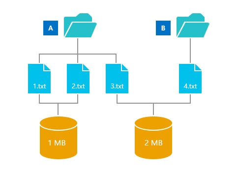

# Manage the Component Store

“Why is WinSxS so large?” has been asked by many Windows users. While this question has been discussed in blog posts, this topic goes into a little more details about the concepts behind the component store (specifically the WinSxS folder) and then provides links to topics that highlight ways to better manage the size of the WinSxS folder.

The short answer is that the WinSxS folder isn’t as large as it may appear at first glance because size calculations can include Windows binaries located elsewhere which makes the WinSxS folder seem larger than it really is.

## The Windows component store and WinSxS folder

The WinSxS folder is located in the Windows folder, for example **c:\\Windows\\WinSxS**. It’s the location for Windows Component Store files. The Windows Component Store is used to support the functions needed for the customization and updating of Windows. Here are some examples of how the Windows Component Store files are used:

-   Using Windows Update to install new component versions. This keeps systems secure and up-to-date.

-   Enabling or disabling Windows features.

-   Adding roles or features using Server Manager.

-   Moving systems between different Windows Editions.

-   System recovery from corruption or boot failures

-   Uninstalling problematic updates

-   Running programs using side-by-side assemblies

The Windows Component Store was first introduced in Windows XP to support side by side assemblies. Beginning in Windows Vista, the component store was enhanced to track and service all of the components that make up the operating system. Those different operating system components track objects such as files, directories, registry keys, and services. Specific versions of components are then collected together into packages. Packages are used by Windows Update and DISM to update Windows. The components and packages used in a Windows installation are processed by the Windows Component Store. Determining the size of the Windows Component Store is complicated by the fact that many of the files are used by Windows from directories outside the Windows Component Store using a technique known as *hard linking*. In such cases, the files from a component version appear both inside and outside the Windows Component Store. By using *hard linking* Windows is able to appear to keep multiple copies of the same file without actually taking the added space for multiple copies.

## Hard links

A hard link is a file system object which allows two files to refer to the same location on disk. This means that more than one file can refer to the same data and changes to that data in one file are reflected in the other files. This complicates notions of directory size as can be seen using the following example:

1.  Directory A has three files: 1.txt, 2.txt, and 3.txt

2.  Directory B has one file: 4.txt

3.  Files 1.txt and 2.txt are hard linked together and contain 1MB of data.

4.  Files 3.txt and 4.txt are also hard linked together and contain 2MB of data.

In this example, you can see that the hard links enable multiple files to refer to the same set of data.

Now what is the size of directory A?

The answer depends on what you plan to do with directory A:

1.  If you read the files in the directory A then the size of all the files that are read is the sum of each file size. In this example, that would be 4 MB.

2.  If you copy all the files from directory A to a new location, then the amount of data copied is the sum of all data hard linked from the files. In this example, that would be 3 MB.

3.  If you are trying to free up space by deleting the directory A, you will only see a reduction in size for the files that are hard linked only by directory A. In this example, this amounts to a savings of 1 MB.

Back to the question of how much space is used by the Windows Component Store, and specifically the WinSxS folder. The third answer in the directory A example, most closely matches how much extra space is used. Files hard linked to the rest of the system are required for system operations, so they should not be counted, and files hard linked to multiple locations within the component store should only have the size stored on disk counted.

## Managing the Windows Component Store

You can use new features in Windows 8.1 and Windows Server 2012 R2 to manage the Windows Component Store:

[Determine the Actual Size of the WinSxS Folder](determine-the-actual-size-of-the-winsxs-folder.md)

[Clean Up the WinSxS Folder](clean-up-the-winsxs-folder.md)

[Reduce the Size of the Component Store in an Offline Windows Image](reduce-the-size-of-the-component-store-in-an-offline-windows-image.md)

## Related topics

[Where Did My Space Go? (blog post)](http://blogs.technet.com/b/askcore/archive/2013/03/01/where-did-my-space-go.aspx)

[More on hard links](http://blogs.technet.com/b/joscon/archive/2011/08/26/more-on-hard-links.aspx)

[NTFS Metafiles blog post](http://blogs.technet.com/b/askcore/archive/2009/12/30/ntfs-metafiles.aspx)

[How to create and manipulate NTFS junction points](http://support.microsoft.com/kb/205524)

 

 

