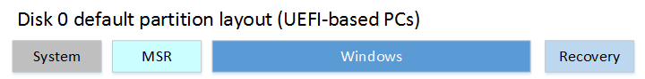
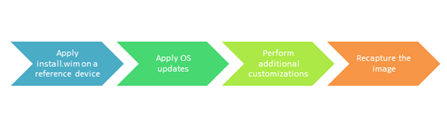

# Manufacturing Windows Engineering Guide (WEG)

The Manufacturing WEG provides original equipment manufacturer (OEM) and ODM partners with a roadmap of the ideal manufacturing process for Windows 10 devices, with guidance for potential pitfalls and opportunities to streamline the process. 

## Manufacturing overview

Many decisions that affect manufacturability are made early in the engineering effort of a new device, so careful consideration should be made to ensure the lowest overhead production process is selected. Every extra minute spent on the manufacturing floor equates to extra cost for the final product. The Manufacturing WEG is intended to provide OEM and ODM partners with a roadmap of the ideal manufacturing process that brings together software and hardware on the factory floor. This WEG also provides opportunities to streamline the process and guidance for how to plan for and avoid common problems. Our manufacturing and deployment recommendations are meant to help you: 

- Optimize the image disk footprint on desktops
- Enable Windows deployment on small capacity disks on desktops
- Shorten image deployment time
- Simplify the imaging process
- Simplify OEM Activation (OA3) injection/reporting process on desktops. Mobile devices do not require activation.
- Test and calibrate the device on the assembly line
- Support other key scenarios to build great devices

For this document, a generic version of the desktop manufacturing process would look like this:


The manufacturing process for mobile devices would look like this:


The Manufacturing WEG is not intended to communicate the [Windows Minimum Hardware Requirements](https://msdn.microsoft.com/library/windows/hardware/dn915086.aspx) or OEM Policy Document (OPD). The WHCR and OPD documents take precedence over any information in the Manufacturing WEG. You must comply with WHCR and OPD.

## Overall considerations

### Manufacturing path

There are two general manufacturing paths you can take depending on your business—Build to Stock (BTS) and Build to Order (BTO). As you review the guidelines in this document, consider the manufacturing path for the device in order to prioritize investments in each phase and save as much time as possible for your customized process. 

For a walkthrough using desktop devices, see our [manufacturing end-to-end lab](http://go.microsoft.com/fwlink/p/?LinkId=526101).

For mobile devices, you must use the BTS manufacturing path.

### Build to order (BTO)

BTO devices start with a basic image and then receive the majority of their customizations during the manufacturing process.

The primary advantage is the flexible software bill of materials, which allows for late-breaking changes. The drawbacks include a more complex image creation and manufacturing process, extra time on the factory floor, and growing image sizes. 

### Build to stock (BTS)

BTS devices have images that are customized almost entirely in the lab. BTS processes are simpler to plan and produce, are faster on the factory floor, have higher quality control, and have a controlled disk size. BTS devices still need to allow for late breaking changes on the factory floor. For desktop editions of Windows 10, many of these changes can be done using offline servicing.

### Push-button reset

The push-button reset tools no longer require a separate full-system recovery image on a separate partition. This can save several gigabytes of space. When users need to refresh or reset the device, they’ll be able to keep their installed Windows updates, rather than downloading and installing them all again. They’ll also keep all of the customizations that you’ve provided. 

The new partition layout resembles the traditional partition layouts from Windows 8.1, except the Windows RE partition is now moved to the end of the drive, and there is no longer a need for a separate full-system recovery partition.



For more information, see [Push-button reset](push-button-reset-overview.md)

Push-button reset is not supported on mobile devices. Instead, you should do a factory reset.

### Compact OS

You can now run the entire operating system, including your preloaded Windows desktop applications, using compressed files, by using the Compact OS and single-instancing features. These features replace the WIM Boot feature from Windows 8.1 Update 1, and can help maintain a smaller disk footprint over time. 

Although the Compact OS is supported for all devices, we recommend using Compact OS only on devices with solid-state drives, because of the slower performance of rotational drives. 

For more information, see [Compact OS, single-instancing, and image optimization](compact-os.md).

Compact OS is not supported on mobile devices.

### Provisioning packages

To save time while building images, you can now capture and apply desktop Windows applications during image deployment by using provisioning packages. This saves the time-consuming steps of generalizing and recapturing the entire image, and allows you to quickly deploy BTO devices.

### Language packs

Instead of adding full language packs, save space by adding the resources you need for the desktop device by choosing individual packages for display strings, handwriting, speech, and text-to-speech. Later, if your user needs additional language capabilities, Windows can download the packages as needed. 

Language and regional SKU decisions can greatly impact the disk footprint and complexity of the image creation system. Care should be taken to limit the amount and types of language packs included with each image. 

Mobile devices use a worldwide image so all languages are included in every image.

### Driver co-installers

Drivers are generally a very small portion of the disk footprint, however, the co-installers or desktop device apps that accompany the drivers can add hundreds of megabytes. Carefully consider if the device(s) require the accompanying Classic Windows application to be fully functional.

### Hardware components

Hardware decisions can also affect the manufacturing process. Besides the challenges to the physical assembly of the hardware, the inclusion or exclusion of certain devices can make the factory process more difficult. For example, if touch screens and sensors are included they must be calibrated on each device. If you exclude devices such as ethernet ports, you can’t use PXE boot, which can mean extra costs.

### Antimalware apps

**Recommendation:** Configure your devices to avoid full scan of the disk during first sign-in. Please work with your Antimalware vendor to determine best practices for limiting this scan.

We have seen several instances where antimalware tools are doing a full disk scan during the user’s first sign-in. The scanning competes with critical tasks occurring during the first sign-in process, resulting in very slow first sign-in, a degraded Start experience and slow system performance. 

For Windows Defender, this can be configured by adding unique identifiers to your images. To learn more, see [Configure a Trusted Image Identifier for Windows Defender](http://go.microsoft.com/fwlink/?LinkId=532775).

### Windows Defender

## Pre-factory floor image updates

Golden images are generally handed off to the ODM from the OEM before production begins. These images almost always require some updating. When you update the golden image, you won’t have to perform the updates on each device. This leads to less time on the factory floor for each device and increases quality. 

Updates to the image can include drivers, Windows Updates, software, OEM customizations, and app packages (.appx).

### Considerations

If you update images using offline servicing, you’ll need to periodically maintain the images. The time saved on the factory floor should make it worthwhile.

### Goals

Reduce time spent per unit on the factory floor and decrease the amounts of errata on production devices.

### Implementation

On a BTO system, some optional drivers and some optional apps may need to be applied at the software download station to accommodate the device. These modifications should be minimized in order to decrease the likelihood of error and to improve manufacturing time.

### Image creation

The overall golden desktop image creation process in OEM image labs is similar to the existing process.



To avoid compatibility issues, use the new version of Windows PE when working on the reference device in the image creation lab. 


### Region-specific policy for Skype removal on desktop

Windows-provided apps are included in all Windows images by default. These apps cannot be modified except where explicitly stated in the Windows OEM Policy Document (OPD).

If you are required to remove the inbox Skype app due to policy requirements, you can use the DISM.exe tool or the DISM Windows PowerShell cmdlets to remove the app. For more information about this policy requirement, see the most recent OEM Policy Document. 

To remove Skype online in audit mode from Windows PowerShell:

```syntax
get-provisionedappxpackage -online | where-object {$_.displayname -eq "Microsoft.SkypeApp"} | Remove-ProvisionedAppxPackage -online
```

To remove Skype offline with Windows PowerShell:

```syntax
get-provisionedappxpackage -path c:\mount | where-object {$_.displayname -eq "Microsoft.SkypeApp"} | Remove-ProvisionedAppxPackage
```

To remove Skype offline using Dism.exe:

1. Get the full package name:

    ```syntax
    Dism.exe /image:<Windows_volume> /get-provisionedappxpackages
    ```
2. Remove the package, using the <PackageName> from the Microsoft.SkypeApp listing:

    ```syntax
    Dism.exe /image:<Windows_volume> /remove-provisionedappxpackage /PackageName:<PackageName>
    ```
    
We recommend using the Windows 10 version of Windows Preinstallation Environment (WinPE).

Note: If you use the Windows 8 version of WinPE, then after any servicing operation, you must update the timestamps of the files; otherwise you may not be able to activate the image using the OEM Activation 3.0 licensing method. In addition, the in-box licensing diagnostic tool, licensingdiag.exe, will report that the image has been tampered with. 

To resolve this problem, after any servicing operation run from the Windows 8 version of WinPE, the OEM must run: 

```syntax
dir %windir%\System32\catroot\{F750E6C3-38EE-11D1-85E5-00C04FC295EE}
```

### Language pack updates

After installing a new language, you must reinstall any APPX bundles and inbox Windows apps to support the new languages. Otherwise, the APPX bundles won’t include support for the new languages.

### Apps in Audit mode

After installing a new language, you must reinstall any APPX bundles and inbox Windows apps to support the new languages. Otherwise, the APPX bundles won’t include support for the new languages.

To disable the app readiness service offline:

1.	Create a .reg file where HKLM\Software\Microsoft\Windows\CurrentVersion\AppReadiness DisableInAuditMode is set to a value of 1.
2.	Mount the Windows image. For example:
    
    ```syntax
    Dism /Mount-Image /ImageFile:"C:\Images\ModelSpecificImage.wim" /Name:"Fabrikam" /MountDir:"C:\mount\windows" /Optimize
    ```
    
3.	Load the registry hive. For example:
    
    ```syntax
    reg load hklm\LoadedHive C:\mount\Windows\System32\config\SYSTEM
    ```
    
4.	Add the registry value. For example, using a .reg file from your USB stick:
    
    ```syntax
    regedit /s e:\registry\regFile.reg
    ```
    
5.	Unload the hive.

    ```syntax
    reg unload hklm\LoadedHive
    ```
    
6.	Unmount the Windows image, committing changes. For example:

    ```syntax
    Dism /Unmount-Image /MountDir:"C:\mount\windows" /Commit
    ```
    
It is recommended that you disable the service offline before entering audit mode. But you can also disable it online in audit mode. You must generalize the image after you disable the service.
To disable the app readiness service online:

1. In audit mode, start `regedit`.
2. Navigate to HKLM\Software\Microsoft\Windows\CurrentVersion\AppReadiness DisableInAuditMode. 
3. Set the value of the key to 1.

Run Sysprep generalize before continuing.

## SMT / Assembly phase

Devices need to be calibrated for the best customer experience and to pass the Windows Hardware Lab Kit tests.

### Implementation

- Calibrations
    - Sensors
    - Touchpad
    - Touchscreen
    - RF
    - Camera

Set the time to UTC and implement ACPI changes detailed below.

## Hardware test and run-in phase

We recommend testing on a full version of Windows. This lets you test final hardware/software interactions as the user will see them.

### Considerations

Using the full version of Windows that you will be shipping with allows testing and validation in the exact same environment that the end user will be seeing. Windows PE is not a supported operating system for test – it is designed to be used only as a deployment vehicle.

### Goals

Deliver the highest quality product possible, while keeping manufacturing times at the absolute minimum.

### Implementation

The installation of the test OS can be handled a variety of ways. Since the test OS has less churn than the shipping OS the image can be laid down on the disk at any time, which can reduce the amount of time spent applying the image on the factory floor. Options include having the image pre-flashed from the IHV, or using disk duplication on site.

**Important**: Disable TPM (Trusted Platform Module) auto-provisioning when booting into a test OS to ensure both good performance and to make sure the user’s OS has ownership of the module. To do this in Windows, you need to set the following registry keys: 

```syntax
[HKLM\System\CurrentControlSet\Services\Tpm\WMI\NoAutoProvision] (REG_DWORD) to 1
[HKEY_LOCAL_MACHINE\SYSTEM\CurrentControlSet\Services\TPM\WMI]
"NoAutoProvision"=dword:00000001
```

## Software download phase

### Considerations

Care should be taken to minimize the amount of time spent on this phase. While some long durations are unavoidable (such as BTO customizations), we encourage our partners to calculate the costs vs. benfits of streamlining as much as possible. 

### Goals

Create an efficient and resilient imaging system with a minimum amount of overhead. Move as many steps as possible to the Pre-Factory Floor Image Updates. 

### Implementation

1. Boot the machine to WinPE. To deploy Compact OS, you’ll need to use the Windows 10 version of WinPE. You can boot WinPE in a variety of ways:

    - Using PXE
    - Using a USB stick
    - Preinstalling WinPE on the hard disk 
    
2. Create the hard drive partition structure using diskpart. 

    ```syntax
    diskpart /s F:\CreatePartitions-UEFI.txt
    ```
    
    For more information, see [UEFI/GPT-based hard drive partitions](configure-uefigpt-based-hard-drive-partitions.md)
    
3. Apply the images that you created using DISM to the Windows partitions. 

    ```syntax
    ApplyImage F:\Images\ThinImage.wim
    ```
    
    For more information, see [Capture and Apply Windows, System, and Recovery Partitions](capture-and-apply-windows-system-and-recovery-partitions.md).
    
    Optional: Use the same image as a recovery image on a separate USB flash drive. This USB disk no longer needs to be sourced from an authorized replicator. For more info, see [Create media to run push-button reset features](create-media-to-run-push-button-reset-features-s14.md).

4.	Boot the device into audit mode.

    - Make any final image modifications. This is where many BTO modifications are made.
    - If APPX apps were installed before additional language packs were added, reinstall the apps so they can support the new languages. This includes inbox applications. 
    - Microsoft strongly advises that OEMs run DISM with the /StartComponentCleanup /resetbase flags to gain additional free disk space.
    - Ensure .NET Framework apps are compiled by running the following commands
        
        ```syntax
        C:\Windows\Microsoft.NET\Framework\v4.0.30319\ngen.exe update /queue
        C:\Windows\Microsoft.NET\Framework\v4.0.30319\ngen.exe eqi
        ```
        
        On 64-bit machines, do the same for 64-bit CLR:

        ```syntax
        C:\Windows\Microsoft.NET\Framework64\v4.0.30319\ngen.exe update /queue
        C:\Windows\Microsoft.NET\Framework64\v4.0.30319\ngen.exe eqi
        ```
        
    - Create the OA3 computer build report (CBR) using OAtool.exe, inject the key into firmware, and validate the provisioning.
    - If you’re using Windows Preinstallation Environment (WinPE) 5.x, fix the timestamps. (This step is not necessary if you’re using WinPE for Windows 10).

        ```syntax
        dir %windir%\System32\catroot\{F750E6C3-38EE-11D1-85E5-00C04FC295EE}
        ``` 
        
    - Run Sysprep /oobe to prepare the system for the end user.
    - Enable Secure Boot (if implemented).
 
## Quality assurance phase

Quality assurance should be run on a sample of machines throughout the production run to ensure all customizations have been successfully installed. This QA pass should also be used to validate the OA3 implementation.

### Considerations

Once the system has gone through OOBE for this QA pass, it will need to be reset in order to assure the end-user experience is excellent. 

### Goals

Assure a good customer experience and reduce time spent rebuilding machine.

### Implementation

The device should return to the production line to be re-imaged.

## Remanufacturing

Once the device has passed through OOBE (for any reason) the device needs to be reimaged. In the factory, the device can simply be added back onto the Software Download Station after the TPM has been cleared (if equipped). 

If the device needs to be serviced in the field by a 3rd party, then Push Button Reset should be used. This will guarantee the machine is returned back to the full factory configuration while still remaining simple to execute. 

### Considerations

While PBR has all the functions needed for factory remanufacturing, it does not provide the ability to script the actions and does not provide actionable error codes needed for automation that would be necessary in large scale production.

### Goals

Ensure a good customer experience, while protecting the user data.

### Implementation

To clear the TPM use the following commands:

```syntax
$Tpm = Get-WmiObject -class Win32_Tpm -namespace "root\CIMv2\Security\MicrosoftTpm"
$Tpm.SetPhysicalPresenceRequest(22)
```

To use Windows PE, you’ll need a customized Windows PE image with:

- SOC-specific drivers for ftpm.
- Optional components: SecureStartup, WMI, PowerShell, and .NET Framework.

## Manufacturing checklist

### Windows 10 manufacturing task timeline

You can use this checklist to plan your manufacturing tasks.

<table width="97%">
<thead>
<tr>
<td>
<p><strong>Task</strong></p>
</td>
<td>
<p><strong>Pre-EV phase</strong></p>
</td>
<td>
<p><strong>EV phase</strong></p>
</td>
<td>
<p><strong>DV phase</strong></p>
</td>
<td>
<p><strong>PV phase</strong></p>
</td>
</tr>
</thead>
<tbody>
<tr>
<td>
<p><strong>Prerequisite manufacturing work:</strong></p>
</td>
<td>
<p><strong>Pre-EV</strong></p>
</td>
<td>
<p><strong>EV</strong></p>
</td>
<td>
<p><strong>DV</strong></p>
</td>
<td>
<p><strong>PV</strong></p>
</td>
</tr>
<tr>
<td>
<p>ODM chosen?</p>
</td>
<td></td>
<td>
<p>-</p>
</td>
<td>
<p>-</p>
</td>
<td>
<p>-</p>
</td>
</tr>
<tr>
<td>
<p>OEM access to Windows&nbsp;10?</p>
</td>
<td></td>
<td>
<p>-</p>
</td>
<td>
<p>-</p>
</td>
<td>
<p>-</p>
</td>
</tr>
<tr>
<td>
<p>ODM access to Windows&nbsp;10?</p>
</td>
<td></td>
<td>
<p>-</p>
</td>
<td>
<p>-</p>
</td>
<td>
<p>-</p>
</td>
</tr>
<tr>
<td>
<p>OEM access to Manufacturing WEG?</p>
</td>
<td></td>
<td>
<p>-</p>
</td>
<td>
<p>-</p>
</td>
<td>
<p>-</p>
</td>
</tr>
<tr>
<td>
<p>ODM access to Manufacturing WEG?</p>
</td>
<td></td>
<td>
<p>-</p>
</td>
<td>
<p>-</p>
</td>
<td>
<p>-</p>
</td>
</tr>
<tr>
<td>
<p>ODM points of contact identified?</p>
</td>
<td></td>
<td>
<p>-</p>
</td>
<td>
<p>-</p>
</td>
<td>
<p>-</p>
</td>
</tr>
<tr>
<td>
<p>OEM points of contact identified?</p>
</td>
<td></td>
<td>
<p>-</p>
</td>
<td>
<p>-</p>
</td>
<td>
<p>-</p>
</td>
</tr>
<tr>
<td>
<p>ODM kick-off?</p>
</td>
<td></td>
<td>
<p>-</p>
</td>
<td>
<p>-</p>
</td>
<td>
<p>-</p>
</td>
</tr>
<tr>
<td>
<p>OEM kick-off?</p>
</td>
<td></td>
<td>
<p>-</p>
</td>
<td>
<p>-</p>
</td>
<td>
<p>-</p>
</td>
</tr>
<tr>
<td>
<p>Regular manufacturing call?</p>
</td>
<td>
<p>-</p>
</td>
<td></td>
<td>
<p>-</p>
</td>
<td>
<p>-</p>
</td>
</tr>
<tr>
<td>
<p><strong>Deployment:</strong></p>
</td>
<td>
<p><strong>Pre-EV</strong></p>
</td>
<td>
<p><strong>EV</strong></p>
</td>
<td>
<p><strong>DV</strong></p>
</td>
<td>
<p><strong>PV</strong></p>
</td>
</tr>
<tr>
<td>
<p>OEM understanding of deployment concepts</p>
</td>
<td></td>
<td>
<p>-</p>
</td>
<td>
<p>-</p>
</td>
<td>
<p>-</p>
</td>
</tr>
<tr>
<td>
<p>ODM understanding of deployment concepts</p>
</td>
<td></td>
<td>
<p>-</p>
</td>
<td>
<p>-</p>
</td>
<td>
<p>-</p>
</td>
</tr>
<tr>
<td>
<p>Using Windows&nbsp;10 DISM</p>
</td>
<td>
<p>-</p>
</td>
<td></td>
<td>
<p>-</p>
</td>
<td>
<p>-</p>
</td>
</tr>
<tr>
<td>
<p>Using Windows&nbsp;10 Windows PE</p>
</td>
<td>
<p>-</p>
</td>
<td></td>
<td>
<p>-</p>
</td>
<td>
<p>-</p>
</td>
</tr>
<tr>
<td>
<p>Extended attributes applied via DISM</p>
</td>
<td>
<p>-</p>
</td>
<td></td>
<td>
<p>-</p>
</td>
<td>
<p>-</p>
</td>
</tr>
<tr>
<td>
<p>WinSxS check being run? /AnalyzeComponentStore</p>
</td>
<td>
<p>-</p>
</td>
<td></td>
<td>
<p>-</p>
</td>
<td>
<p>-</p>
</td>
</tr>
<tr>
<td>
<p>Image is cleaned up? (DISM /Cleanup-Image /StartComponentCleanup /ResetBase)</p>
</td>
<td>
<p>-</p>
</td>
<td></td>
<td>
<p>-</p>
</td>
<td>
<p>-</p>
</td>
</tr>
<tr>
<td>
<p>Push-button reset</p>
</td>
<td>
<p><strong>Pre-EV</strong></p>
</td>
<td>
<p><strong>EV</strong></p>
</td>
<td>
<p><strong>DV</strong></p>
</td>
<td>
<p><strong>PV</strong></p>
</td>
</tr>
<tr>
<td>
<p>OEM understanding of push-button reset concepts</p>
</td>
<td>
<p>-</p>
</td>
<td></td>
<td>
<p>-</p>
</td>
<td>
<p>-</p>
</td>
</tr>
<tr>
<td>
<p>ODM understanding of push-button reset concepts</p>
</td>
<td>
<p>-</p>
</td>
<td></td>
<td>
<p>-</p>
</td>
<td>
<p>-</p>
</td>
</tr>
<tr>
<td>
<p>Recommended partition layout to use for Windows RE and push-button reset?</p>
</td>
<td>
<p>-</p>
</td>
<td>
<p>-</p>
</td>
<td></td>
<td>
<p>-</p>
</td>
</tr>
<tr>
<td>
<p>If a non-standard partition layout is used, is bare-metal recovery configured?</p>
</td>
<td>
<p>-</p>
</td>
<td>
<p>-</p>
</td>
<td></td>
<td>
<p>-</p>
</td>
</tr>
<tr>
<td>
<p>Recovery image ACL settings correct?</p>
</td>
<td>
<p>-</p>
</td>
<td>
<p>-</p>
</td>
<td></td>
<td>
<p>-</p>
</td>
</tr>
<tr>
<td>
<p>Refresh/reset time is within guidelines?</p>
</td>
<td>
<p>-</p>
</td>
<td>
<p>-</p>
</td>
<td>
<p>-</p>
</td>
<td></td>
</tr>
<tr>
<td>
<p><strong>Windows RE:</strong></p>
</td>
<td>
<p><strong>Pre-EV</strong></p>
</td>
<td>
<p><strong>EV</strong></p>
</td>
<td>
<p><strong>DV</strong></p>
</td>
<td>
<p><strong>PV</strong></p>
</td>
</tr>
<tr>
<td>
<p>OEM understanding of Windows RE concepts</p>
</td>
<td>
<p>-</p>
</td>
<td></td>
<td>
<p>-</p>
</td>
<td>
<p>-</p>
</td>
</tr>
<tr>
<td>
<p>ODM understanding of Windows RE concepts</p>
</td>
<td>
<p>-</p>
</td>
<td></td>
<td>
<p>-</p>
</td>
<td>
<p>-</p>
</td>
</tr>
<tr>
<td>
<p>Windows RE is enabled</p>
</td>
<td>
<p>-</p>
</td>
<td>
<p>-</p>
</td>
<td></td>
<td>
<p>-</p>
</td>
</tr>
<tr>
<td>
<p>Windows RE location is correct</p>
</td>
<td>
<p>-</p>
</td>
<td>
<p>-</p>
</td>
<td></td>
<td>
<p>-</p>
</td>
</tr>
<tr>
<td>
<p>BCD GUID for Windows RE matches Windows RE GUID entry in Reagent.xml</p>
</td>
<td>
<p>-</p>
</td>
<td>
<p>-</p>
</td>
<td></td>
<td>
<p>-</p>
</td>
</tr>
<tr>
<td>
<p>Image index is correct</p>
</td>
<td>
<p>-</p>
</td>
<td>
<p>-</p>
</td>
<td></td>
<td>
<p>-</p>
</td>
</tr>
<tr>
<td>
<p><strong>Manufacturing:</strong></p>
</td>
<td>
<p><strong>Pre-EV</strong></p>
</td>
<td>
<p><strong>EV</strong></p>
</td>
<td>
<p><strong>DV</strong></p>
</td>
<td>
<p><strong>PV</strong></p>
</td>
</tr>
<tr>
<td>
<p>Windows RE partition size (MB) and position on selected disk</p>
</td>
<td>
<p>-</p>
</td>
<td></td>
<td>
<p>-</p>
</td>
<td>
<p>-</p>
</td>
</tr>
<tr>
<td>
<p>Test partition uses full Windows</p>
</td>
<td>
<p>-</p>
</td>
<td>
<p>-</p>
</td>
<td></td>
<td>
<p>-</p>
</td>
</tr>
<tr>
<td>
<p>Image deployment via [NIC] or [duplication]</p>
</td>
<td>
<p>-</p>
</td>
<td></td>
<td>
<p>-</p>
</td>
<td>
<p>-</p>
</td>
</tr>
<tr>
<td>
<p>OPM key provisioning plan done?</p>
</td>
<td>
<p>-</p>
</td>
<td></td>
<td>
<p>-</p>
</td>
<td>
<p>-</p>
</td>
</tr>
<tr>
<td>
<p>Language packs per SKU</p>
</td>
<td>
<p>-</p>
</td>
<td>
<p>-</p>
</td>
<td></td>
<td>
<p>-</p>
</td>
</tr>
<tr>
<td>
<p><strong>Secure boot:</strong></p>
</td>
<td>
<p><strong>Pre-EV</strong></p>
</td>
<td>
<p><strong>EV</strong></p>
</td>
<td>
<p><strong>DV</strong></p>
</td>
<td>
<p><strong>PV</strong></p>
</td>
</tr>
<tr>
<td>
<p>OEM understanding of security concepts</p>
</td>
<td></td>
<td>
<p>-</p>
</td>
<td>
<p>-</p>
</td>
<td>
<p>-</p>
</td>
</tr>
<tr>
<td>
<p>ODM understanding of security concepts</p>
</td>
<td></td>
<td>
<p>-</p>
</td>
<td>
<p>-</p>
</td>
<td>
<p>-</p>
</td>
</tr>
<tr>
<td>
<p>Secure boot process tested with preproduction signing?</p>
</td>
<td>
<p>-</p>
</td>
<td>
<p>-</p>
</td>
<td></td>
<td>
<p>-</p>
</td>
</tr>
<tr>
<td>
<p>Watermark off?</p>
</td>
<td>
<p>-</p>
</td>
<td>
<p>-</p>
</td>
<td>
<p>-</p>
</td>
<td></td>
</tr>
<tr>
<td>
<p>Drivers signed from IHV/ISV?</p>
</td>
<td>
<p>-</p>
</td>
<td>
<p>-</p>
</td>
<td>
<p>-</p>
</td>
<td></td>
</tr>
<tr>
<td>
<p>Drivers signed by Microsoft?</p>
</td>
<td>
<p>-</p>
</td>
<td>
<p>-</p>
</td>
<td>
<p>-</p>
</td>
<td></td>
</tr>
<tr>
<td>
<p>Re-manufacturing process complete [factory]</p>
</td>
<td>
<p>-</p>
</td>
<td>
<p>-</p>
</td>
<td></td>
<td>
<p>-</p>
</td>
</tr>
<tr>
<td>
<p>Re-manufacturing process complete [field service]</p>
</td>
<td>
<p>-</p>
</td>
<td>
<p>-</p>
</td>
<td></td>
<td>
<p>-</p>
</td>
</tr>
<tr>
<td>
<p>Secure boot and debug policy plans vetted by FT</p>
</td>
<td>
<p>-</p>
</td>
<td></td>
<td>-</td>
<td>
<p>-</p>
</td>
</tr>
<tr>
<td>
<p><strong>OA 3.0:</strong></p>
</td>
<td>
<p><strong>Pre-EV</strong></p>
</td>
<td>
<p><strong>EV</strong></p>
</td>
<td>
<p><strong>DV</strong></p>
</td>
<td>
<p><strong>PV</strong></p>
</td>
</tr>
<tr>
<td>
<p>Using updated OA3tool.exe</p>
</td>
<td>
<p>-</p>
</td>
<td>
<p>-</p>
</td>
<td></td>
<td>
<p>-</p>
</td>
</tr>
<tr>
<td>
<p>Validate image/key offline</p>
</td>
<td>
<p>-</p>
</td>
<td>
<p>-</p>
</td>
<td></td>
<td>
<p>-</p>
</td>
</tr>
<tr>
<td>
<p>Injection done in `[Windows PE][Windows]`</p><p>Refer to the OEM Activation 3.0 section.</p>
</td>
<td>
<p>-</p>
</td>
<td>
<p>-</p>
</td>
<td></td>
<td>
<p>-</p>
</td>
</tr>
</tbody>
</table>

## Appendix

### Small disk footprint optimization

The basic disk footprint of Windows 10 x86 with Office and 2GB of RAM will contain: 

<table width="97%">
<tbody>
<tr>
<td>
<p>Windows (w/Office), Page file, hiberfile, swapfile, and two language packs</p>
</td>
<td>
<p>11.7GB</p>
</td>
</tr>
<tr>
<td>
<p>WinRE</p>
</td>
<td>
<p>500MB</p>
</td>
</tr>
<tr>
<td>
<p>System Partitions (MSR, ESP)</p>
</td>
<td>
<p>428MB</p>
</td>
</tr>
<tr>
<td>
<p>Total</p>
</td>
<td>
<p>~23GB</p>
</td>
</tr>
<tr>
<td>
<p>Available space for OEM customizations on a 32GB (29GB usable) device</p>
</td>
<td>
<p>~6GB</p>
</td>
</tr>
</tbody>
</table>

Assumptions:

- Disk footprint calculated using GetDiskFreeSpaceEx() 
- Data is collected immediately after OS setup, prior to NGEN running, prior to Idle Tasks. 
- Measurement includes pagefiles
- Windows Update is disabled
- Build has multiple runs; the max footprint is used in this report
- Drive capacity is converted into Base-2 sizes:32GB == 32,000,000,000 bytes == 30518MiB (or 29GiB).

### Language packs

Language packs comprise some of the largest disk space additions an OEM is likely to make. A language with all its optional components included can be estimated at 275MB each (size varies based on language) while Office language packs can be estimated at 300MB (also depending on language).

Windows will trim unused language packs once the end-user selects a primary language during OOBE. After they're removed, these languages won't be available through push-button reset.

In order to maintain a smaller disk footprint, consider reducing the amount of languages installed on each shipping SKU. 

### Servicing

Adding Windows Update KB packages can add significantly to the size of the disk. To reduce the footprint of an image after adding updates:

1.	Install KB and reboot if prompted
2.	From an elevated command prompt, run the following commands:

    ```syntax
    dism.exe /online /cleanup-image /startcomponent
    ```
    
3.	Restart the device.

### Real Time Clock (RTC)

The RTC is a battery-backed time source that stores and maintains system time when a device is powered off. ACPI 5.0 defines the Time & Alarm device which abstracts the underlying hardware device which maintains platform time. The ACPI Time & Alarm device is the preferred way to set and query platform time in Windows, even on a system with a traditional CMOS based RTC. The ACPI interface provides the time zone bias for the time value obtained from or written to the RTC. This extra field of information addresses a longstanding issue with the CMOS based RTC, where an operating system does not know how to interpret the time read from the hardware clock.

#### Factory floor considerations

Windows queries RTC to update the system time when:

- No time synchronization service is available.
- The machine enters sleep (S3) or hibernate (S4) power state.
- Kernel Debugger is enabled. 

OEMs typically provision the RTC in Local Time (LT) for devices shipped with Windows 7. Windows 7 exclusively uses the CMOS time interface to get RTC time, which is interpreted as LT. In Windows 8, we added support for the ACPI Time & Alarm device, but Windows 8 also uses the CMOS RTC, if it is available, and treats the time returned from it as LT. This behavior (related to the CMOS RTC interface) is incompatible with most non-Windows operating systems. Also, hosting providers like Azure want to use UTC time in their virtualized hardware to simplify management and migration of guests that might have a number of different time zones. 

To address these concerns, Microsoft will be transitioning away from using the CMOS RTC interface and primarily relying on the ACPI Time & Alarm device. 

For OEMs, the guidance is:

- Implement the ACPI Time & Alarm device.
- Set “CMOS RTC Not Present” flag in Fixed ACPI Description Table (FADT) . The underlying hardware can still be the CMOS backed RTC, however Windows will only use the ACPI Time & Alarm Device if this flag is set.
- It is not recommended for the platform firmware to update the RTC across a daylight saving boundary. If it does, however, the firmware needs to ensure coordinated universal time (UTC) can always be calculated by adding the time zone bias to the time value, i.e., UTC = LT + TZ. Windows will ignore the DST field received from the _GRT control method. 
- Invalidate TZ (set to 0x7FF) through firmware if RTC time is ever updated through CMOS RTC interface. 

### Ensuring a good first sign-in experience

The Windows team has seen a number of issues blocking good performance of user’s first experience with Windows, and the following guidance should address common issues when preparing OS Images for your customers. 

#### Antimalware tools scanning disk during first sign-in

We have seen several instances where antimalware tools are doing a full disk scan during the user’s first sign-in. The scanning competes with critical tasks occurring during the first sign-in process, resulting in very slow first sign-in, a degraded Start experience and slow system performance. 

**Recommendation**: Devices should be configured to avoid full scan of the disk during first sign-in. Specific guidance for AV solutions should be provided by the AV Vendor. 

#### Windows Defender

Add unique identifiers to your images to prevent Windows Defender from re-scanning all of the files you provided in the original disk image. To learn more, see [Configure a Trusted Image Identifier for Windows Defender](http://go.microsoft.com/fwlink/?LinkId=532775).

#### Running NGEN commands

Native image GENeration is a task compiling .NET framework’s MSIL (virtual machine code) into native images (platform specific executables). Generally it improves CLR application startup time by more than an order of magnitude. See [The Performance Benefits of NGen](http://go.microsoft.com/fwlink/?LinkId=532790) for more details. 

**Recommendation**: Follow these instructions to ensure .NET Framework apps are compiled. Please run the following commands after installing all OS updates: 

On 32-bit, x86 ,or ARM devices:

```syntax
C:\Windows\Microsoft.NET\Framework\v4.0.30319\ngen.exe update /queue
C:\Windows\Microsoft.NET\Framework\v4.0.30319\ngen.exe eqi
```

On 64-bit devices, do this for both versions of the .NET framework:

```syntax
C:\Windows\Microsoft.NET\Framework\v4.0.30319\ngen.exe update /queue
C:\Windows\Microsoft.NET\Framework\v4.0.30319\ngen.exe eqi
C:\Windows\Microsoft.NET\Framework64\v4.0.30319\ngen.exe update /queue
C:\Windows\Microsoft.NET\Framework64\v4.0.30319\ngen.exe eqi
```

#### Graphics drivers

A Windows device should ship with the correct DirectX Graphics Driver for the system hardware. Failing to install the correct driver results in a fallback to a software-based graphics driver. This results in degraded experiences with Windows, including slower first sign-in performance.

**Recommendation**: Install the correct graphics driver for your hardware while in audit mode.

### Frequently asked questions

#### Windows PE

- **Question**: Can I use the new WinPE to deploy, maintain and service previous Windows versions?

    **Answer**: Updates to WinPE will not affect the currently supported Windows versions. You can use the updated WinPE to deploy previous Windows versions including Windows 7.

-	**Question**: Do I have to migrate to the new deployment tools available as part of Windows 10?

    **Answer**: No you don’t. You only need to update to the newer version of the deployment tools (WinPE, DISM) if you want to implement Compact OS.

- **Question**: How does disk footprint optimization impact my PXE environment?

    **Answer**: You only need to update your PXE environment to the newer version of the deployment tools (WinPE, DISM) if you are executing an “apply” while in your PXE environment. If you are only executing a download (file copy from server to client), you don’t have to update your PXE environment.

#### Push-button recovery (PBR) and Windows Recovery Environment (WinRE)

- **Question**: Will WinRE also be updated?

    **Answer**: Yes, a new WinRE.wim is needed.
    
- **Question**: Can the user still create a PBR USB key?

    **Answer**: Yes. If the default partition layout is used, then no additional setup is required by the OEM to enable this.

#### Storage

- **Question**: Do you only support solid state disks?

    **Answer**: No, we now support solid-state and traditional rotational media. We recommend that single-instancing is only used on solid-state disks, due to performance issues.

- **Question**: Can I use single-instancing of provisioning packages on a dual disk configuration (HDD + SSD)?

    **Answer**: Single-instancing can only be implemented on the same disk.
    
#### Disk footprint

- **Question**: How will you delete the language packs that the user does not choose during OOBE?

    **Answer**: The language packs are deleted from the device, and will no longer be available during push-button recovery operations.
    
- **Question**: How are you calculating disk size? For example, you report a disk size of 14.8 GB on a 16 GB disk.

    **Answer**: The disk capacity is converted into Base-2. For example, 16,000,000,000 (billion bytes) is equal to ~14.8 GB.

- **Question**: Can I only use Compact OS on small devices, such as those with 1 GB RAM and 16 GB disk?

    **Answer**: Compact OS can be applied to any 32-bit or 64-bit platform with >=16GB of solid state storage.

- **Question**: Do you recommend using 16 GB disk on a 64-bit platform running 64-bit Windows?

    **Answer**: We recommend a minimum disk capacity of 32 GB for 64-bit Windows. 

#### Imaging and deployment

- **Question**: What are the changes to the DISM command to support Compact OS?

    **Answer**: You can use DISM /Apply-Image … /Compact and /Apply-CustomDataImage. For more info, see [DISM Image Management Command-Line Options](http://go.microsoft.com/fwlink/?LinkId=532791).

- **Question**: Does Compact OS support both GPT and MBR partition layout?

    **Answer**: Yes.

- **Question**: Is an updated OA3 tool required with Windows 10?
    
    **Answer**: Yes.

- **Question**: Can I still use Windows SIM, unattend answer files and settings with Windows 10?

    **Answer**: Yes, though some settings may have changed. See [Changed answer file settings from Windows 8.1 and Windows Server 2012 R2](http://go.microsoft.com/fwlink/?LinkId=532812).

#### Language Packs and apps

- **Question**: Can we use multiple language packs?

    **Answer**: Yes, however, we strongly recommend that you validate the disk footprint impact of the number of languages (Windows, Office, drivers and apps) per image. 

- **Question**: Is there a change in how I install language packs?

    **Answer**: Yes, you'll apply the base lp.cab in the same way as you did before in order to get multiple UI options, but to be able to enter text or get support, you'll need to add optional language components. For more info, see [Add Language Packs to Windows](http://go.microsoft.com/fwlink/?LinkId=532792).
    
- **Question**: Is there a change in how I install desktop or Windows Store apps?

    **Answer**: There is no change in how you install desktop or Windows Store apps from Windows 8.1.

- **Question**: What is the user experience on a multi-language configuration or when a user adds an additional language pack?

    **Answer**: Language packs will continue to work the same way they do in previous versions of Windows.
    
- **Question**: Are there compatibility concerns with desktop apps?

    **Answer**: The type of apps listed below will need to be carefully validated. 
    
    - Full volume encryption tools should not encrypt WIM images to limit performance impact. Such tools should check integrity of the unencrypted WIM to prevent tampering.
    - Any tool that writes system files can be affected:
        - Imaging applications should perform block-level backup and restore of ALL volumes.
        - Faulty/Incomplete restore-operations can render a system unbootable.
        - Encryption/Back-Up/Defrag tools may unintentionally inflate system files. 

- **Question**: Is Compact OS also applicable to Windows Embedded?

    **Answer**: The Compact OS implementation and feature design we shared is limited to Windows 10 for desktop editions (Home, Pro, and Enterprise) . However, you should contact your Windows Embedded representative and ask about their disk footprint optimization plan.

#### Policy

- **Question**: Is there a change to the existing 10 GB free disk space policy requirement? 

    **Answer**: Refer to the updated Windows Hardware Compatibility Requirements.

#### Servicing

- **Question**: How will upgrade work especially on the recovery image with disk footprint optimization?

    **Answer**: Upgrade will continue to work.


