# OEM Windows Desktop Deployment and Imaging Lab

Getting ready to build and test Windows 10 desktop PCs? This lab shows you the steps to take to make and deploy Windows images. We'll show you the tools to use and the commands to run to setup an end-to-end deployment. The commands can be scripted, helping you quickly customize new images for specific markets to meet your customers' needs.

If you're an OEM, you can also use the [Express Deployment Tool](http://aka.ms/edt) (EDT) to build a custom Windows deployment. The EDT simplifies the process of installing and configuring Windows for a consistent brand and customized end-user experience. 

We'll walk you through the process of building a customized Windows deployment. Here's what we'll cover:

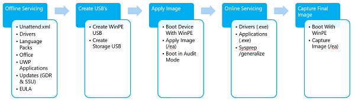

We'll start by giving an overview of the deployment process, and show you what to consider when planning your deployment.

Then we'll [build a customized bootable WinPE drive](#install-and-customize-windows-pe). We'll cover the steps for:
    
- Preparing and mounting a WinPE image
- Adding packages
- Adding drivers
- Creating WinPE media

Next we'll move onto customizing your Windows image. We'll start with [offline customizations](#customize-your-windows-image) to a mounted Windows image, where we'll cover:

- Adding Drivers
- Adding Languages
- Adding Updates
- Reinstalling inbox apps
- Preinstalling Microsoft Office
- Adding tiles to the Start Layout
- Setup OOBE to display a custom EULA
- Configuring and using answer files to customize Windows Setup

We'll finish customizing the Windows image by [deploying your image to a PC and then booting into Audit mode](#use-a-deployment-script-to-apply-your-image) and finish making changes, including:
- Making changes in Audit mode
- Preparing Push Button Reset

Finally, we'll [Finalize and Capture your image, verify everything works, and prepare your image for deployment](#finalize-and-capture-your-image).
- Finalizing the image

Let's get started!

## Planning: Customizing reference images for different audiences

Instead of having one device design that tries to fit everyone, Windows image management tools help you tailor device designs to meet the specific needs of various customers.

To get started, we recommend choosing a hardware design that targets a specific audience, market, or price point. Build base images for this design and test it. Next, modify the base images to create designs for for different audiences, include branding, logos, languages, and apps.

### Device types

Consider creating separate designs for different device types, such as low-cost or performance laptops, or low-cost or performance desktops. Each of these styles has different sets of critical differentiators, such as battery life or graphics performance.

Although Windows includes base drivers for many common devices, some hardware requires specialized device drivers that must be installed and occasionally updated.

Many drivers are designed to be installed offline without booting the Windows image.

Use Windows Assessment tools to make sure that the apps and hardware that you're installing can perform well in a variety of circumstances.

### OA 3.0

This document is intended for OEMs deploying systems with OEM Activation 3.0 (OA 3.0) enabled. For OEMs deploying systems without OEM activation, pay attention to the samples marked as non-OA.

### Architecture

If you plan to build devices with both 64-bit and 32-bit (x86) chipsets and architectures, you'll need separate base images. You'll also need different versions of drivers, packages, and updates.

### Retail customers and business customers

If you're building designs for both retail and business customers, you can start with a single base edition such as Windows 10 Home or Windows 10 Pro, and then later upgrade it to a higher edition such as Windows 10 Enterprise, as needed. Once you've built a higher edition, however, you can't downgrade it to the lower edition. For more info, see [Windows Upgrade Paths](http://go.microsoft.com/fwlink/?LinkId=526838).

If you're building devices to sell to retail customers, you'll need to meet a set of minimum requirements. For info, see the Licensing and Policy guidance on the [Device Partner Center](http://go.microsoft.com/fwlink/?LinkId=131358).

If you're building devices for businesses, you'll have fewer restrictions. IT professionals can customize their devices in all sorts of ways. However, you should consider the implications of IT policies, as well as customer needs such as migrating data, activating security tools, and managing volume license agreements and product keys.

### Regions

Consider creating different base images for different regions.

The resource files for Windows and other apps like Microsoft Office can be large - some resources like localized handwriting and speech recognition resources are several hundred megabytes.

To save drive space, we've split up the language packs. This can help you preload more languages for your customers or save space on your image. For example, to target a large region, you may preload the basic language components such as text and user interface files for many areas within the region, but only include the handwriting recognition for devices with pens, or only include voice and speech tools for Cortana on devices with integrated microphones. Users can download these components later as needed.

### Sample plan

This lab uses the following three sample hardware configurations.

| Hardware Configuration:      | 1            | 1B                  | 2                                 |
|------------------------------|--------------|---------------------|-----------------------------------|
| Form factor                  | Small tablet | 2-in-1              | Notebook                          |
| Architecture                 | x86          | x86                 | x64                               |
| RAM                          | 1 GB         | 2 GB                | 4 GB                              |
| Disk capacity and type       | 16 GB eMMC   | 32 GB eMMC          | 500 GB HDD                        |
| Disk compression used        | Yes          | No                  | No                                |
| Display size                 | 8”           | 10”                 | 14”                               |
| Windows SKU                  | Home         | Pro                 | Home                              |
| Region/Language(s)           | EN-US        | EN-US, FR-FR, ES-ES | EN-GB, DE-DE, FR-FR, ES-ES, ZH-CN |
| Cortana                      | Yes          | Yes                 | Yes                               |
| Inbox apps (Universal)       | Yes          | Yes                 | Yes                               |
| Pen                          | No           | Yes                 | No                                |
| Office (Universal)           | Yes          | Yes                 | Yes                               |
| Windows desktop applications | No           | Yes                 | Yes                               |
| Office 2016                  | No           | Yes                 | Yes                               |
| Compact OS                   | Yes          | Yes                 | No                                |
 
 Notes:
- We can build an image for Hardware Configuration 1B by using Hardware Configuration 1 as a base image.
- We can't build Hardware Configuration 2 from either Hardware Configuration 1 or 1B, because they use a different architecture.

## Get the tools needed to customize Windows

Here's what you'll need to start testing and deploying devices:

### PCs

Here's how we'll refer to them:

-   **Technician PC**: Your work PC. This PC should have at least 15GB of free space for installing the [Windows Assessment and Deployment Kit (Windows ADK)](http://go.microsoft.com/fwlink/?LinkId=526803) and working with Windows images. 

    We recommend using Windows 10 for this PC. The minimum requirement is Windows 7 SP1, though this requires additional tools or workarounds for tasks such as running PowerShell scripts and mounting .ISO images.

    For most tasks, you can use either an x86 or x64 PC. If you're creating x86 images, you'll need an x86-based PC (or virtual machine) for a one-time task of [generating a catalog file](update-windows-settings-and-scripts-create-your-own-answer-file-sxs.md) when you modify your answer file with Windows SIM.

-   **Reference PC**: A test PC or tablet that represents all of the devices in a single model line; for example, the *Fabrikam Notebook PC Series 1*. This device must meet the Windows 10 minimum hardware requirements.

    You'll reformat this device as part of the walkthrough.

### Storage

-   **WinPE USB key**: We'll refer to this as _WinPE_. Must be at least 512MB and at most 32GB. This drive will be formatted, so save your data off of it first. It shouldn't be a Windows-to-Go key or a key marked as a non-removable drive.

-   **Storage USB key**: We'll refer to this as _USB-B_. A second USB key or an external USB hard drive for storing files. Minimum free space: 8GB, using NTFS, ExFAT, or any other file system that allows files over 4GB.  If your hardware allows it, use USB 3.0 keys/drives and USB 3.0 ports to speed up file copy procedures. Note, some USB 3.0 keys don't work with some USB 2.0 ports. We won't be reformatting this drive, so as long as you have enough free space, you can reuse an existing storage drive.

### Software

Copy the following source files to the technician PC, rather than using external sources like network shares or removable drives. This reduces the risk of interrupting the build process from a temporary network issue or from disconnecting the USB device.

To complete this guide, get the recommended downloads in this section from <https://www.microsoftoem.com>. 

The version numbers of the Windows ADK, the Windows image you're deploying, and the languages and features you're adding must match.

If you're building a 64-bit image, make sure that you're following the steps that are marked for 64-bit. If you're working with a 32-bit image, follow the steps for 32-bit.

#### Windows 10, version 1703

|             |                                                      |
| ----------- | ---------------------------------------------------- |
| X21-34314   | Windows Home 10, version 1703 32/64 English OPK      |
| X21-34317   | Windows Home SL 10, version 1703 32/64 English OPK   |
| X21-34321   | Windows Pro 10, version 1703 32/64 English OPK       |


#### Customizations: Windows updates, languages, features, apps, and Microsoft Office

|             |                                                     |
| ----------- | --------------------------------------------------- |
| X21-34323   | Win 10 1703 32/64 MultiLang OPK LangPackAll/LIP     |
| X21-34324   | Win 10 1703 32/64 MultiLang OPK Feat on Demand      |
| X21-34329   | Win 10 1607 32/64 MultiLang OPK App Update          |
| X20-98485   | Office Mobile MultiLang v1.3 OPK                    |
| X21-32422   | Office 2016 v16.3 Deployment Tool for OEM OPK       |
| X21-05414   | Office 2016 v16.3 English OPK                       |
| X21-32392   | Office v16.3 English OPK                            |
| X21-32396   | Office v16.3 German OPK |

#### Windows Assessment and Deployment Kit (ADK) for Windows 10, version 1703

Download the [Windows ADK for Windows 10, version 1703](https://developer.microsoft.com/windows/hardware/windows-assessment-deployment-kit#winADK).

#### Drivers

We also discuss how to add hardware drivers and other Windows apps in this guide. If you need to add additional drivers to your image, you'll need to contact your hardware or software manufacturers.

#### Sample files

Download the lab samples from [USB-B.zip](http://download.microsoft.com/download/5/8/4/5844EE21-4EF5-45B7-8D36-31619017B76A/USB-B.zip), and extract the files to the _USB-B_ drive.

- The deployment steps in this guide depend on the sample configuration files included in USB-B. You can download USB-B.zip from the Microsoft Download Center.

- The contents of the configuration files included in USB-B are examples that you may change according to your branding and manufacturing choices. However, file names and hierarchy of the folders and files must be the same as demonstrated below in order to align your deployment procedure with this guide.

**Note**: _USB-B_ has to be an NTFS-formatted drive.

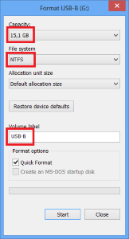 


### Product keys

Get the default product keys for each Windows version from the Kit Guide Windows 10 Default Manufacturing Key OEM PDF, which is on the ISO with the Windows image.

Get the distribution product keys that match the Windows 10 image.

## Prepare your lab environment

You have your tools ready to go. Now we'll setup your lab.


### Install the Windows ADK for Windows 10

The Windows ADK is a collection of tools and documentation that OEMs, ODMs, and IT Professionals use to customize, assess, and deploy Windows operating systems to new computers. Deployment tools enable you to customize, manage, and deploy Windows images. Deployment tools can be used to automate Windows deployments, elminating the need for user interaction during Windows setup.

Important: OEM must use the matching version of ADK for the images being customized. If building an image using RTM image use Windows 10 RTM ADK. If using Windows 10 1703 image use Windows 10 1703 ADK.

1.  If you have a previous version of the Windows Assessment and Deployment Kit (ADK), uninstall it.

2.  Download the version of the [Windows ADK](https://developer.microsoft.com/windows/hardware/windows-assessment-deployment-kit#winADK) that matches the version of Windows that you’re installing. **Run** the installer.

3.  Click **Next** &gt; **Next** &gt; **Accept** to accept the defaults and to join the Customer Experience Improvement Program.

4.  Select the following tools:

    -   **Deployment Tools**

    -   **Windows Preinstallation Environment (Windows PE)**

    -   **User State Migration Tool (USMT)**

    For these labs, you won't need any of the other options installed. You can clear those check boxes.

5.  Click **Install**, and then click **Yes** to confirm. This may take a few minutes.

6.  When the installation is finished, click **Close**.


## Install and customize Windows PE

Windows Preinstallation Environment (WinPE) is a small, command-line based operating system. You can use it to capture, update, and optimize Windows images, which you'll do in later sections. In this section, you'll prepare a basic WinPE image on a bootable USB flash drive and try it out.

The Windows PE USB must be at least 512MB and at most 32GB. Don't use a Windows-to-Go key or a key marked as a non-removable drive.

### Prepare WinPE

1.  On your technician PC, start the **Deployment and Imaging Tools Environment**  as an administrator:
    -  Click **Start**, type **Deployment and Imaging Tools Environment**. Right-click **Deployment and Imaging Tools Environment** and select **Run as administrator**.

2.  Copy the base WinPE files into a new folder:

    ``` syntax
    copype amd64 C:\winpe_amd64
    ```

    Repeat if you’re also deploying x86 devices:

    ``` syntax
    copype x86 C:\winpe_x86
    ```

   **Troubleshooting**: If this doesn't work, make sure you're in the Deployment and Imaging Tools Environment, and not the standard command prompt. 
	
### Add components to WinPE

You can customize a WinPE image (boot.wim) by adding additional packages and languages, called [optional components (OCs)](winpe-add-packages--optional-components-reference.md). Optional components are available as part of the ADK. 

Here are some examples of what you can add to your WinPE image with OCs:

- **Add a video or network driver**. (WinPE includes generic video and network drivers, but in some cases, additional drivers are needed to show the screen or connect to the network.). To learn more, see [WinPE: Add drivers](winpe-add-drivers.md).

- **Add PowerShell scripting support**. To learn more, see [WinPE: Adding Windows PowerShell support to Windows PE](winpe-adding-powershell-support-to-windows-pe.md). PowerShell scripts are not included in this lab.

- **Set the power scheme to high-performance**. Speeds deployment. Note, our sample deployment scripts already set this scheme automatically. See  [WinPE: Mount and Customize: High Performance](winpe-mount-and-customize.md#highperformance).

- **Optimize WinPE**: Recommended for devices with limited RAM and storage (for example, 1GB RAM/16GB storage). After you add drivers or other customizations to Windows PE, see [WinPE: Optimize and shrink the image](winpe-optimize.md) to help reduce the boot time.

#### Mount your WinPE image

To customize your WinPE image, you have to mount your image before you can work with it. Mounting an image extracts the contents of an image file to a location where it can be viewed and modified. Throughout this lab we'll use DISM to mount and modify images. DISM comes with Windows, but we'll be using the version that is installed by the ADK, which we'll access through the Deployment and imaging tools environment.

You can find boot.wim in the files that you copies with copype.cmd.

Let's mount the image:

1. On your technician PC, open the **Deployment and imaging tools environment** as an administrator. You can find this in the Start menu under Windows Kits. If you don't see it, make sure you've installed the Windows ADK.

2. If you're using an x64 Windows 10 image, mount the image:

```
Dism /mount-image /imagefile:c:\WinPE_amd64\media\sources\boot.wim /index:1 /mountdir:c:\winpe_amd64\mount
```

If you're using an x86 Windows 10 image:

```
Dism /mount-image /imagefile:c:\WinPE_x86\media\sources\boot.wim /index:1 /mountdir:c:\winpe_x86\mount
```

#### Add packages, dependencies, and language packs to WinPE (optional)

Use `Dism /Add-Package` to add packages to your WinPE image. Some packages have dependencies and require other packages to be installed. For these packages, you'll have to install the dependencies before you add the a package. For example, if you want to use Powershell in WinPE, you have to install the NetFx as well as the language-specific OCs. You can find OC CABs in `C:\Program Files (x86)\Windows Kits\10\Assessment and Deployment Kit\Windows Preinstallation Environment\<arch>\WinPE_OCs\`. Here's how to add Powershell support for en-us:

**Note:** Only add additional packages when necessary. The more packages you add, the greater the impact to boot time and performance.

If you're using an x64 Windows 10 image:

```
dism /image:C:\winpe_amd64\mount /Add-Package /PackagePath:"C:\Program Files (x86)\Windows Kits\10\Assessment and Deployment Kit\Windows Preinstallation Environment\amd64\WinPE_OCs\WinPE-NetFx.cab"
dism /image:C:\winpe_amd64\mount /Add-Package /PackagePath:"C:\Program Files (x86)\Windows Kits\10\Assessment and Deployment Kit\Windows Preinstallation Environment\amd64\WinPE_OCs\en-us\WinPE-NetFx_en-us.cab"
```

If you're using an x86 Windows 10 image:

```
dism /image:C:\winpe_x86\mount /Add-Package /PackagePath:"C:\Program Files (x86)\Windows Kits\10\Assessment and Deployment Kit\Windows Preinstallation Environment\x86\WinPE_OCs\WinPE-NetFx.cab"
dism /image:C:\winpe_x86\mount /Add-Package /PackagePath:"C:\Program Files (x86)\Windows Kits\10\Assessment and Deployment Kit\Windows Preinstallation Environment\x86\WinPE_OCs\en-us\WinPE-NetFx_en-us.cab"
```

#### Add drivers to WinPE (Optional)

If you need to add drivers to WinPE, you'll use `Dism /Add-Driver`. You'll only need to do this if WinPE doesn't have the drivers available for your hardware. 

Here's how to add drivers to WinPE:

**Note:** This method requires inf-based drivers. We recommend getting INF based drivers from your hardware Vendor.

If you're working with an x64 Windows 10 image:

```
dism /image:C:\winpe_amd64\mount /Add-Driver /driver:"C:\Out-of-Box Drivers\mydriver.inf"
```

If you're using an x86 Windows 10 image:

```
dism /image:C:\winpe_x86\mount /Add-Driver /driver:"C:\Out-of-Box Drivers\mydriver.inf"
```


**Note:** To install all of the drivers in a folder and all its subfolders use the /recurse option. For example:

For an x64 Windows 10 image:

```
Dism /Image:C:\Winpe_amd64 /Add-Driver /Driver:c:\drivers /Recurse
```

If you're using an x86 Windows 10 image:

```
Dism /Image:C:\Winpe_x86 /Add-Driver /Driver:c:\drivers /Recurse
```

### Cleanup your WinPE image

Run `dism /cleanup-image` to reduce the disk and memory footprint of WinPE and increase compatibility with a wide range of devices:

For x64 Windows 10:

```
DISM /image:c:\winpe_amd64\mount /Cleanup-image /StartComponentCleanup /ResetBase
```

For x86 Windows 10 images:

```
DISM /image:c:\winpe_x86\mount /Cleanup-image /StartComponentCleanup /ResetBase
```

### Commit your changes and unmount your image

If you've added extra files in your WinPE image, you can delete them to reduce your image size and improve performance. When you're done working with your image, you can commit your changes and unmount your image. Then copy your image back into your WinPE folder:

For x64 Windows 10 images:

```
dism /unmount-image /mountdir:c:\winpe_amd64\mount /commit
dism /export-image /sourceimagefile:c:\winpe_amd64\media\sources\boot.wim /sourceindex:1 /DestinationImageFile:c:\winpe_amd64\mount\boot2.wim
Del c:\winpe_amd64\media\sources\boot.wim
Copy c:\winpe_amd64\mount\boot2.wim c:\winpe_amd64\media\sources\boot.wim
```

For x86 Windows 10 images:

```
dism /unmount-image /mountdir:c:\winpe_x86\mount /commit
dism /export-image /sourceimagefile:c:\winpe_x86\media\sources\boot.wim /sourceindex:1 /DestinationImageFile:c:\winpe_x86\mount\boot2.wim
Del c:\winpe_x86\media\sources\boot.wim
Copy c:\winpe_x86\mount\boot2.wim c:\winpe_x86\media\sources\boot.wim
```

### Create a bootable WinPE drive

Now that you've updated your WinPE image to have everything it needs to work with the PCs in your environment, you can make a bootable WinPE drive. From the Deployment and Imaging Tools Environment:

1.  Connect _WinPE_ to your technician PC.

2.  Copy WinPE to the USB drive:

    For x64 WinPE:

    ``` syntax
    MakeWinPEMedia /UFD C:\winpe_amd64 D:
    ```
    Where D: is the letter of the _WinPE_ drive.

    When prompted, press **Y** to format the drive and install WinPE.

    For x86 WinPE:

    ``` syntax
    MakeWinPEMedia /UFD C:\winpe_x86 D:
    ```
    Where D: is the letter of the USB drive.

    When prompted, press **Y** to format the drive and install WinPE.

3.  In File Explorer, right-click the drive and select **Eject**.

### Boot your reference PC to WinPE

1.  Connect the _WinPE_ USB drive to your reference device.

2.  Turn off the reference device, and then boot to the USB drive. You usually do this by powering on the device and quickly pressing a key (for example, the **Esc** key or the **Volume up** key).

    **Note**   On some devices, you might need to go into the boot menus to choose the USB drive. If you're given a choice between booting in UEFI mode or BIOS mode, choose UEFI mode. To learn more, see [Boot to UEFI Mode or Legacy BIOS mode](http://go.microsoft.com/fwlink/?LinkId=526943).
    If the device does not boot from the USB drive, see the troubleshooting tips in [WinPE: Create USB Bootable drive](http://go.microsoft.com/fwlink/?LinkId=526944).

    WinPE starts at a command line, and runs **wpeinit** to set up the system. This can take a few minutes.

Leave this PC booted to Windows PE for now. 

## Customize your Windows image

Now that you have your WinPE image customized for your deployment, we'll get into how to get your Windows image ready for deployment. The process is similar to how we changed our WinPE image, but Windows has many additional customization options.

### Mount a Windows image 

In this section we'll cover how to mount Windows images on your technician PC. Mounting a Windows image is the same process that we used to mount the WinPE image earlier. When we mount our Windows image (install.wim), we'll be able to access a second image, WinRe.wim, which is the image that supports recovery scenarios. Updating install.wim and WinRE.wim at the same time helps you keep the two images in sync, which ensures that recovery goes as expected.

**Note**:You may need to disable Secure Boot to start working with image.

Before we continue, make sure that you've created your _USB-B_ drive. We showed you how to set it up in the Get the tools you need section.

Start working with your images:

First copy the install.wim from your Windows installation media to _USB-B_. Install.wim includes both Home and Professional images. We'll export the Home image from install.wim, and then work with that image during this lab.

1.	Insert _USB-B_ into your technician computer.
2.	Mount the Windows 10 1703 Home .img from the X21-34314 Win Home 10 1703 32-BIT/X64 English OPK.
3.	From the mounted image, copy D:\sources\install.wim to _USB-B_:\images. (Where D: is the drive letter of the mounted image.)
4.	From the Start menu, open Windows Kits, open the Deployment and Imaging Tools Environment.   
5.	Right click on the Deployment and Imaging Tools Environment and run as Administrator.
6.	Export the Home edition (index 2) from the install.wim as basicimage.wim and delete the original _USB-B_\images\install.wim:

    ```
    Dism /export-image /sourceimagefile:e:\images\install.wim /sourceindex:2 /destinationimagefile:e:\images\basicimage.wim
    Del e:\images\install.wim
    ```
Now that you have your image exported, you can mount it.

1.	Mount BasicImage.wim. 

    ```
    Md C:\mount\windows
    Dism /Mount-Wim /WimFile:E:\images\basicimage.wim /index:1 /MountDir:C:\mount\windows
    ```

    (where E:\ is the drive letter of _USB-B_)

2.	Mount the Windows RE Image file from your mounted image.

    ```
    Md c:\mount\winre 
    Dism /Mount-Wim /WimFile:C:\mount\windows\Windows\System32\Recovery\winre.wim /index:1 /MountDir:C:\mount\winre
    ```

    Troubleshoot: If winre.wim cannot be seen under the specified directory, use the following command to set the file visible:

    ```
    attrib -h -a -s C:\mount\windows\Windows\System32\Recovery\winre.wim
    ```

    Troubleshoot: If mounting operation fails, make sure the Windows 10 version of DISM is the one installed with the Windows ADK is being used and not an older version from the Technician Computer. Do not mount images to protected folders, such as the User\Documents folder.  If DISM processes are interrupted, consider temporarily disconnecting from the network and disabling virus protection.

## Add drivers and languages to a mounted image

In the following sections we'll cover some ways that you can modify your mounted Windows image. First, we'll show you how to add drivers and language packs.

### Drivers

Add drivers to an image to ensure that all hardware in a PC is setup properly when Windows boots for the first time.

**Note:** When creating several devices with identical hardware configurations, you can speed up installation time and first boot-up time by maintaining driver configurations when capturing a Windows image.

1.	Add a single driver that includes an .inf file. In this example, we're using a driver named media1.inf:
	
    ```
    Dism /Add-Driver /Image:"C:\mount\windows" /Driver:"C:\Drivers\PnP.Media.V1\media1.inf"
    ```
    Where "C:\Drivers\PnP.Media.V1\media1.inf" is the base .inf file in your driver package.

2.	If you want to add an entire folder of drivers, you can use the /Recurse option. This adds all .inf drivers in the folder and all its subfolders.

> **Warning**: While /Recurse can be handy, it's easy to bloat your image with it. Some driver packages include multiple .inf driver packages, which often share payload files from the same folder. During installation, each .inf driver package is expanded into a separate folder, each with a copy of the payload files. We've seen cases where a popular driver in a 900MB folder added 10GB to images when added with the /Recurse option.

    ```
    Dism /Add-Driver /Image:"C:\mount\windows" /Driver:c:\drivers /Recurse 
    ```

3.	Verify that the drivers are part of the image:
    ```
	Dism /Get-Drivers /Image:"C:\mount\windows"
    ```
    Check the list of packages and verify that the list contains the drivers you added.

### Languages

**Notes**

- **Add languages before major updates**. Major updates include hotfixes, general distribution releases, or service packs. If you add a language later, you'll need to reinstall the updates.
- **Add major updates before apps**. These apps include universal Windows apps and desktop applications. If you add an update later, you'll need to reinstall the apps. We'll show you how to add these later in Lab 6: Add universal Windows apps
- **Add your languages to your recovery image, too**: Many common languages can be added to your recovery image. We'll show you how to add these later in Lab 12: Update the recovery image.

Always use language packs and Features-On-Demand (FOD) packages that match the language and platform of the Windows image.

Features on demand (FODs) are Windows feature packages that can be added at any time. When a user needs a new feature, they can request the feature package from Windows Update. OEMs can preinstall these features to enable them on their devices out of the box.

Common features include language resources like handwriting recognition. Some of these features are required to enable full Cortana functionality.

The following table shows the types of language packages and components available for Windows 10:

| Component     | Sample file name                                 | Dependencies | Description                                    |
| ------------- | ------------------------------------------------ | ------------ | ---------------------------------------------- |
| Language pack | Microsoft-Windows-Client-Language-Pack_x64_es-es | None         | UI text, including basic Cortana capabilities. | 
| Language interface pack| 	Microsoft-Windows-Client-Language-Interface-Pack_x64_ca-es | 	Requires a specific fully-localized or partially-localized language pack. Example: ca-ES requires es-ES.| 	UI text, including basic Cortana capabilities. To learn more, see Available Language Packs for Windows.| 
| Basic| Microsoft-Windows-LanguageFeatures-Basic-fr-fr-Package| 	None| 	Spell checking, text prediction, word breaking, and hyphenation if available for the language. <p> You must add this component before adding any of the following components.<p>| 
| Fonts| 	Microsoft-Windows-LanguageFeatures-Fonts-Thai-Package	| None| 	Fonts required for some regions. Example, th-TH requires the Thai font pack.| 
| Optical character recognition| 	Microsoft-Windows-LanguageFeatures-OCR-fr-fr-Package| 	Basic| 	Recognizes and outputs text in an image.| 
| Handwriting recognition| 	Microsoft-Windows-LanguageFeatures-Handwriting-fr-fr-Package| 	Basic| 	Enables handwriting recognition for devices with pen input.| 
| Text-to-speech| 	Microsoft-Windows-LanguageFeatures-TextToSpeech-fr-fr-Package| 	Basic	| Enables text to speech, used by Cortana and Narrator.| 
| Speech recognition| 	Microsoft-Windows-LanguageFeatures-Speech-fr-fr-Package	| Basic, Text-To-Speech recognition| 	Recognizes voice input, used by Cortana and Windows Speech | Recognition.| 
| Retail Demo experience| 	Microsoft-Windows-RetailDemo-OfflineContent-Content-fr-fr-Package| 	Basic	| Retail Demo Experience (RDX)| 

#### Add or change languages

In this section, we'll add languages and Features On Demand to your Windows image. We'll add the German (de-de) language pack, then we'll add the Japanese (ja-jp) language. Japanese is an example of a language that requires additional font support. 

**Important**: If you install an update (hotfix, general distribution release [GDR], or service pack [SP]) that contains language-dependent resources prior to installing a language pack, the language-specific changes in the update won't be applied when you add the language pack. You need to reinstall the update to apply language-specific changes. To avoid reinstalling updates, install language packs before installing updates.

Language updates have a specific order they need to be installed in. For example, to enable Cortana, install, in order: **Microsoft-Windows-Client-Language-Pack**, then **–Basic,** then **–Fonts,** then **–TextToSpeech,** and then **–Speech,**. If you’re not sure of the dependencies, it’s OK to put them all in the same folder, and then add them all using  `DISM /Add-Package`.

Make sure that you are using language packs and features on demand that match the architecture of the image you are working with. Below we'll give examples of using both 64-bit and 32-bit, but you only have to install the lps and FODs that match the architecture that you're using.

1.	Add German language package and Feature on Demand language packages.

    For 64-bit Windows, use the language packs and features on demand from the 64-bit ISOs:
    ```
    Dism /Add-Package /Image:C:\mount\windows /PackagePath:E:\LanguagePacks\x64\Microsoft-Windows-Client-Language-Pack_x64_de-de.cab /PackagePath:E:\LanguageFeaturePacks\x64\Microsoft-Windows-LanguageFeatures-Basic-de-de-Package.cab /PackagePath:E:\LanguageFeaturePacks\x64\Microsoft-Windows-LanguageFeatures-OCR-de-de-Package.cab /PackagePath:E:\LanguageFeaturePacks\x64\Microsoft-Windows-LanguageFeatures-Handwriting-de-de-Package.cab /PackagePath:E:\LanguageFeaturePacks\x64\Microsoft-Windows-LanguageFeatures-TextToSpeech-de-de-Package.cab /PackagePath:E:\LanguageFeaturePacks\x64\Microsoft-Windows-LanguageFeatures-Speech-de-de-Package.cab /packagepath:e:\LanguageFeaturePacks\x64\Microsoft-Windows-RetailDemo-OfflineContent-Content-de-de-Package.cab
    ```
    Where E: is the drive letter of the mounted ISO.

    For 32-bit Windows, use the language packs and features on demand from the 32-bit ISOs:
    ```
    Dism /Add-Package /Image:C:\mount\windows /PackagePath:E:\LanguagePacks\x86\Microsoft-Windows-Client-Language-Pack_x86_de-de.cab /PackagePath:E:\LanguageFeaturePacks\x86\Microsoft-Windows-LanguageFeatures-Basic-de-de-Package.cab /PackagePath:E:\LanguageFeaturePacks\x86\Microsoft-Windows-LanguageFeatures-OCR-de-de-Package.cab /PackagePath:E:\LanguageFeaturePacks\x86\Microsoft-Windows-LanguageFeatures-Handwriting-de-de-Package.cab /PackagePath:E:\LanguageFeaturePacks\x86\Microsoft-Windows-LanguageFeatures-TextToSpeech-de-de-Package.cab /PackagePath:E:\LanguageFeaturePacks\x86\Microsoft-Windows-LanguageFeatures-Speech-de-de-Package.cab /packagepath:E:\LanguageFeaturePacks\x86\Microsoft-Windows-RetailDemo-OfflineContent-Content-de-de-Package.cab
    ```

2. (Optional) Add Japanese language packs and features on demand.

    In Windows 10, some language-specific fonts were separated out into different canguage .cab files. In this section, we'll add the ja-JP language along with support for Japanese fonts.

    For 64-bit Windows, use the language packs and features on demand from the 64-bit ISOs:
    ```
    Dism /Add-Package /Image:C:\mount\windows /PackagePath:E:\LanguagePacks\x64\Microsoft-Windows-Client-Language-Pack_x64_ja-jp.cab /PackagePath:E:\LanguageFeaturePacks\x64\Microsoft-Windows-LanguageFeatures-Basic-ja-jp-Package.cab /PackagePath:E:\LanguageFeaturePacks\x64\Microsoft-Windows-LanguageFeatures-OCR-ja-jp-Package.cab /PackagePath:E:\LanguageFeaturePacks\x64\Microsoft-Windows-LanguageFeatures-Handwriting-ja-jp-Package.cab /PackagePath:E:\LanguageFeaturePacks\x64\Microsoft-Windows-LanguageFeatures-TextToSpeech-ja-jp-Package.cab /PackagePath:E:\LanguageFeaturePacks\x64\Microsoft-Windows-LanguageFeatures-Speech-ja-jp-Package.cab /PackagePath:E:\LanguageFeaturePacks\x64\Microsoft-Windows-LanguageFeatures-Fonts-Jpan-Package.cab /packagepath:E:\LanguageFeaturePacks\x64\Microsoft-Windows-RetailDemo-OfflineContent-Content-ja-jp-Package.cab
    ```
    
    For 32-bit Windows, use the language packs and features on demand from the 32-bit ISOs:
    ```
    Dism /Add-Package /Image:C:\mount\windows /PackagePath:E:\LanguagePacks\x86\Microsoft-Windows-Client-Language-Pack_x86_ja-jp.cab /PackagePath:E:\LanguageFeaturePacks\x86\Microsoft-Windows-LanguageFeatures-Basic-ja-jp-Package.cab /PackagePath:E:\LanguageFeaturePacks\x86\Microsoft-Windows-LanguageFeatures-OCR-ja-jp-Package.cab /PackagePath:E:\LanguageFeaturePacks\x86\Microsoft-Windows-LanguageFeatures-Handwriting-ja-jp-Package.cab /PackagePath:E:\LanguageFeaturePacks\x86\Microsoft-Windows-LanguageFeatures-TextToSpeech-ja-jp-Package.cab /PackagePath:E:\LanguageFeaturePacks\x86\Microsoft-Windows-LanguageFeatures-Speech-ja-jp-Package.cab /PackagePath:E:\LanguageFeaturePacks\x86\Microsoft-Windows-LanguageFeatures-Fonts-Jpan-Package.cab /packagepath:E:\LanguageFeaturePacks\x86\Microsoft-Windows-RetailDemo-OfflineContent-Content-ja-jp-Package.cab
    ```

#### Add languages to Windows RE

Here we'll show you how to add languages to WinRE. Adding languages to WinRE ensures that the language that a customer expects is available in recovery scenarios. 

WinRE uses the same language packs as WinPE. You can find these language packs on the language pack ISO.

1. Add German language packages

    For 64-bit Windows, use the language packs and features on demand from the 64-bit ISOs:
    ```
    Dism /image:C:\mount\winre /add-package /packagepath:"E:\LanguagePacks\Windows Preinstallation Environment\x64\de-de\lp.cab" 
    Dism /image:C:\mount\winre /add-package /packagepath:"E:\LanguagePacks\Windows Preinstallation Environment\x64\de-de\WinPE-Rejuv_de-de.cab" 
    Dism /image:C:\mount\winre /add-package /packagepath:"E:\LanguagePacks\Windows Preinstallation Environment\x64\de-de\WinPE-EnhancedStorage_de-de.cab" 
    Dism /image:C:\mount\winre /add-package /packagepath:"E:\LanguagePacks\Windows Preinstallation Environment\x64\de-de\WinPE-Scripting_de-de.cab" 
    Dism /image:C:\mount\winre /add-package /packagepath:"E:\LanguagePacks\Windows Preinstallation Environment\x64\de-de\WinPE-SecureStartup_de-de.cab" 
    Dism /image:C:\mount\winre /add-package /packagepath:"E:\LanguagePacks\Windows Preinstallation Environment\x64\de-de\WinPE-SRT_de-de.cab" 
    Dism /image:C:\mount\winre /add-package /packagepath:"E:\LanguagePacks\Windows Preinstallation Environment\x64\de-de\WinPE-WDS-Tools_de-de.cab" 
    Dism /image:C:\mount\winre /add-package /packagepath:"E:\LanguagePacks\Windows Preinstallation Environment\x64\de-de\WinPE-WMI_de-de.cab" 
    Dism /image:C:\mount\winre /add-package /packagepath:"E:\LanguagePacks\Windows Preinstallation Environment\x64\de-de\WinPE-StorageWMI_de-de.cab" 
    Dism /image:C:\mount\winre /add-package /packagepath:"E:\LanguagePacks\Windows Preinstallation Environment\x64\de-de\WinPE-HTA_de-de.cab"
    ```

    For 32-bit Windows, use the language packs and features on demand from the 32-bit ISOs:
    ```
    Dism /image:C:\mount\winre /add-package /packagepath:"E:\LanguagePacks\Windows Preinstallation Environment\x86\de-de\lp.cab" 
    Dism /image:C:\mount\winre /add-package /packagepath:"E:\LanguagePacks\Windows Preinstallation Environment\x86\de-de\WinPE-Rejuv_de-de.cab" 
    Dism /image:C:\mount\winre /add-package /packagepath:"E:\LanguagePacks\Windows Preinstallation Environment\x86\de-de\WinPE-EnhancedStorage_de-de.cab" 
    Dism /image:C:\mount\winre /add-package /packagepath:"E:\LanguagePacks\Windows Preinstallation Environment\x86\de-de\WinPE-Scripting_de-de.cab" 
    Dism /image:C:\mount\winre /add-package /packagepath:"E:\LanguagePacks\Windows Preinstallation Environment\x86\de-de\WinPE-SecureStartup_de-de.cab" 
    Dism /image:C:\mount\winre /add-package /packagepath:"E:\LanguagePacks\Windows Preinstallation Environment\x86\de-de\WinPE-SRT_de-de.cab" 
    Dism /image:C:\mount\winre /add-package /packagepath:"E:\LanguagePacks\Windows Preinstallation Environment\x86\de-de\WinPE-WDS-Tools_de-de.cab" 
    Dism /image:C:\mount\winre /add-package /packagepath:"E:\LanguagePacks\Windows Preinstallation Environment\x86\de-de\WinPE-WMI_de-de.cab" 
    Dism /image:C:\mount\winre /add-package /packagepath:"E:\LanguagePacks\Windows Preinstallation Environment\x86\de-de\WinPE-StorageWMI_de-de.cab" 
    Dism /image:C:\mount\winre /add-package /packagepath:"E:\LanguagePacks\Windows Preinstallation Environment\x86\de-de\WinPE-HTA_de-de.cab"
    ```

2. (Optional) Add Japanese language packs and font support to WinRE. Note that for Japanese, we will add an additional cab that is for font support.

    For 64-bit Windows, use the language packs and features on demand from the 64-bit ISOs:
    ```
    Dism /image:C:\mount\winre /add-package /packagepath:"E:\LanguagePacks\Windows Preinstallation Environment\x64\ja-jp\lp.cab" 
    Dism /image:C:\mount\winre /add-package /packagepath:"E:\LanguagePacks\Windows Preinstallation Environment\x64\ja-jp\WinPE-Rejuv_ja-jp.cab" 
    Dism /image:C:\mount\winre /add-package /packagepath:"E:\LanguagePacks\Windows Preinstallation Environment\x64\ja-jp\WinPE-EnhancedStorage_ja-jp.cab" 
    Dism /image:C:\mount\winre /add-package /packagepath:"E:\LanguagePacks\Windows Preinstallation Environment\x64\ja-jp\WinPE-Scripting_ja-jp.cab" 
    Dism /image:C:\mount\winre /add-package /packagepath:"E:\LanguagePacks\Windows Preinstallation Environment\x64\ja-jp\WinPE-SecureStartup_ja-jp.cab" 
    Dism /image:C:\mount\winre /add-package /packagepath:"E:\LanguagePacks\Windows Preinstallation Environment\x64\ja-jp\WinPE-SRT_ja-jp.cab" 
    Dism /image:C:\mount\winre /add-package /packagepath:"E:\LanguagePacks\Windows Preinstallation Environment\x64\ja-jp\WinPE-WDS-Tools_ja-jp.cab" 
    Dism /image:C:\mount\winre /add-package /packagepath:"E:\LanguagePacks\Windows Preinstallation Environment\x64\ja-jp\WinPE-WMI_ja-jp.cab" 
    Dism /image:C:\mount\winre /add-package /packagepath:"E:\LanguagePacks\Windows Preinstallation Environment\x64\ja-jp\WinPE-StorageWMI_ja-jp.cab" 
    Dism /image:C:\mount\winre /add-package /packagepath:"E:\LanguagePacks\Windows Preinstallation Environment\x64\ja-jp\WinPE-HTA_ja-jp.cab"
    Dism /image:C:\mount\winre /add-package /packagepath:"E:\LanguagePacks\Windows Preinstallation Environment\x64\ja-jp\WinPE-FontSupport-JA-JP.cab"
    ```

    For 32-bit Windows, use the language packs and features on demand from the 32-bit ISOs:
    ```
    Dism /image:C:\mount\winre /add-package /packagepath:"E:\LanguagePacks\Windows Preinstallation Environment\x86\ja-jp\lp.cab" 
    Dism /image:C:\mount\winre /add-package /packagepath:"E:\LanguagePacks\Windows Preinstallation Environment\x86\ja-jp\WinPE-Rejuv_ja-jp.cab" 
    Dism /image:C:\mount\winre /add-package /packagepath:"E:\LanguagePacks\Windows Preinstallation Environment\x86\ja-jp\WinPE-EnhancedStorage_ja-jp.cab" 
    Dism /image:C:\mount\winre /add-package /packagepath:"E:\LanguagePacks\Windows Preinstallation Environment\x86\ja-jp\WinPE-Scripting_ja-jp.cab" 
    Dism /image:C:\mount\winre /add-package /packagepath:"E:\LanguagePacks\Windows Preinstallation Environment\x86\ja-jp\WinPE-SecureStartup_ja-jp.cab" 
    Dism /image:C:\mount\winre /add-package /packagepath:"E:\LanguagePacks\Windows Preinstallation Environment\x86\ja-jp\WinPE-SRT_ja-jp.cab"
    Dism /image:C:\mount\winre /add-package /packagepath:"E:\LanguagePacks\Windows Preinstallation Environment\x86\ja-jp\WinPE-WDS-Tools_ja-jp.cab"
    Dism /image:C:\mount\winre /add-package /packagepath:"E:\LanguagePacks\Windows Preinstallation Environment\x86\ja-jp\WinPE-WMI_ja-jp.cab"
    Dism /image:C:\mount\winre /add-package /packagepath:"E:\LanguagePacks\Windows Preinstallation Environment\x86\ja-jp\WinPE-StorageWMI_ja-jp.cab"
    Dism /image:C:\mount\winre /add-package /packagepath:"E:\LanguagePacks\Windows Preinstallation Environment\x86\ja-jp\WinPE-HTA_ja-jp.cab"
    Dism /image:C:\mount\winre /add-package /packagepath:"E:\LanguagePacks\Windows Preinstallation Environment\x86\ja-jp\WinPE-FontSupport-JA-JP.cab"
    ```

#### Configure language settings

This section covers how to change the default language and timezone of your mounted Windows image.

1.	Use Dism to set the default language of the image. We'll set the default language to German, since we added it into our image in the previous steps.:
```
Dism /Image:C:\mount\windows /Set-AllIntl:de-DE
Dism /Image:C:\mount\winre /Set-AllIntl:de-DE
```

2.	Verify your changes

```
Dism /Image:C:\mount\windows /Get-Intl
```

3.	Set the timezone for the region of the default language applied

```
Dism /Image:C:\mount\windows /set-timezone:"W. Europe Standard Time"
```

#### Remove the base language from the image

This section covers removing a language from the Windows image. 

Now that our image has been set to use German as the default language, we can remove the English language features from it and make it a non-English image. To remove en-US completely from the image, you'll have to remove several components. 

**Note**: Don't remove the English base language if you are shipping a PC in English.

For removing the language components from a 64-bit image:

```
dism /image:"c:\mount\windows" /remove-package /packagename:Microsoft-Windows-Client-LanguagePack-Package~31bf3856ad364e35~amd64~en-US~10.0.15063.0 /packagename:Microsoft-Windows-LanguageFeatures-Basic-en-us-Package~31bf3856ad364e35~amd64~~10.0.15063.0 /packagename:Microsoft-Windows-LanguageFeatures-Handwriting-en-us-Package~31bf3856ad364e35~amd64~~10.0.15063.0 /packagename:Microsoft-Windows-LanguageFeatures-OCR-en-us-Package~31bf3856ad364e35~amd64~~10.0.15063.0 /packagename:Microsoft-Windows-LanguageFeatures-Speech-en-us-Package~31bf3856ad364e35~amd64~~10.0.15063.0 /packagename:Microsoft-Windows-LanguageFeatures-TextToSpeech-en-us-Package~31bf3856ad364e35~amd64~~10.0.15063.0 /packagename:Microsoft-Windows-RetailDemo-OfflineContent-Content-en-us-Package~31bf3856ad364e35~amd64~~10.0.15063.0
```

For removing language components from a 32-bit image:

```
dism /image:"c:\mount\windows" /remove-package /packagename:Microsoft-Windows-Client-LanguagePack-Package~31bf3856ad364e35~x86~en-US~10.0.15063.0 /packagename:Microsoft-Windows-LanguageFeatures-Basic-en-us-Package~31bf3856ad364e35~x86~~10.0.15063.0 /packagename:Microsoft-Windows-LanguageFeatures-Handwriting-en-us-Package~31bf3856ad364e35~x86~~10.0.15063.0 /packagename:Microsoft-Windows-LanguageFeatures-OCR-en-us-Package~31bf3856ad364e35~x86~~10.0.15063.0 /packagename:Microsoft-Windows-LanguageFeatures-Speech-en-us-Package~31bf3856ad364e35~x86~~10.0.15063.0 /packagename:Microsoft-Windows-LanguageFeatures-TextToSpeech-en-us-Package~31bf3856ad364e35~x86~~10.0.15063.0 /packagename:Microsoft-Windows-RetailDemo-OfflineContent-Content-en-us-Package~31bf3856ad364e35~x86~~10.0.15063.0
```

Troubleshooting: If an error occurs when running these commands, try the command again on the package that failed.

Example:

```
Error: 0x800f0825
Package Microsoft-Windows-LanguageFeatures-Basic-en-us-Package may have failed due to pending updates to servicing components in the image. 
```

If the command completes with errors, check the DISM log file. at C:\windows\Logs\DISM\dism.log.

#### Remove the base languages from WinRE (Optional)

Similar to removing the base language in install.wim, we can remove the base language from WinRE as well.

For removing language components from a 64-bit image:
```
Dism /image:"c:\mount\winre" /remove-package /packagename:Microsoft-Windows-WinPE-LanguagePack-Package~31bf3856ad364e35~amd64~en-US~10.0.15063.0 /packagename:WinPE-EnhancedStorage-Package~31bf3856ad364e35~amd64~en-US~10.0.15063.0 /packagename:WinPE-HTA-Package~31bf3856ad364e35~amd64~en-US~10.0.15063.0 /packagename:WinPE-Rejuv-Package~31bf3856ad364e35~amd64~en-US~10.0.15063.0 /packagename:WinPE-Scripting-Package~31bf3856ad364e35~amd64~en-US~10.0.15063.0 /packagename:WinPE-SecureStartup-Package~31bf3856ad364e35~amd64~en-US~10.0.15063.0 /packagename:WinPE-SRT-Package~31bf3856ad364e35~amd64~en-US~10.0.15063.0 /packagename:WinPE-StorageWMI-Package~31bf3856ad364e35~amd64~en-US~10.0.15063.0 /packagename:WinPE-WDS-Tools-Package~31bf3856ad364e35~amd64~en-US~10.0.15063.0 /packagename:WinPE-WMI-Package~31bf3856ad364e35~amd64~en-US~10.0.15063.0
```

For removing language components from a 32-bit image:

```
Dism /image:"c:\mount\winre" /remove-package /packagename:Microsoft-Windows-WinPE-LanguagePack-Package~31bf3856ad364e35~x86~en-US~10.0.15063.0 /packagename:WinPE-EnhancedStorage-Package~31bf3856ad364e35~x86~en-US~10.0.15063.0 /packagename:WinPE-HTA-Package~31bf3856ad364e35~x86~en-US~10.0.15063.0 /packagename:WinPE-Rejuv-Package~31bf3856ad364e35~x86~en-US~10.0.15063.0 /packagename:WinPE-Scripting-Package~31bf3856ad364e35~x86~en-US~10.0.15063.0 /packagename:WinPE-SecureStartup-Package~31bf3856ad364e35~x86~en-US~10.0.15063.0 /packagename:WinPE-SRT-Package~31bf3856ad364e35~x86~en-US~10.0.15063.0 /packagename:WinPE-StorageWMI-Package~31bf3856ad364e35~x86~en-US~10.0.15063.0 /packagename:WinPE-WDS-Tools-Package~31bf3856ad364e35~x86~en-US~10.0.15063.0 /packagename:WinPE-WMI-Package~31bf3856ad364e35~x86~en-US~10.0.15063.0
```

## Add updates to your image

While your image is mounted, you can add Windows updates. The process is similar to the one we used to add drivers earlier.

Notes: 

- **Add languages before major updates**. Major updates include hotfixes, general distribution releases, or service packs. If you add a language later, you'll need to re-add the updates.
- **Add major updates before apps**. These apps include universal Windows apps and desktop applications. If you add an update later, you'll need to re-add the apps.
- **For major updates, update the recovery image too**: These may include hotfixes, general distribution releases, service packs, or other pre-release updates. We'll show you how to update these later in Lab 12: Update the recovery image.
- If **Servicing Stack Update (SSU) is required**, you'll have to apply it before applying the most recent General Distribution Release (GDR, currently KB3200970) or any future GDRs.


### Add a Windows update package

Use Dism to apply the latest servicing stack update (SSU) and general distribution release (GDR) as well as any prerequisite KB updates. You can find KB updates in the following locations:

GDR: [http://aka.ms/win10releaseinfo](http://aka.ms/win10releaseinfo)

SSU: [https://msdn.microsoft.com/en-us/windows/hardware/commercialize/manufacture/whats-new-in-windows-manufacturing](https://msdn.microsoft.com/en-us/windows/hardware/commercialize/manufacture/whats-new-in-windows-manufacturing)

KB Files: [http://catalog.update.microsoft.com](http://catalog.update.microsoft.com)

> **Important**: If you install an update (hotfix, general distribution release [GDR], or service pack [SP]) that contains language-dependent resources prior to installing a language pack, the language-specific changes in the update won't be applied when you add the language pack. You need to reinstall the update to apply language-specific changes. To avoid reinstalling updates, install language packs before installing updates.

1. Get a Windows update package. For example, grab the [latest cumulative update listed in Windows 10 update history from the Microsoft Update catalog](http://www.catalog.update.microsoft.com/Search.aspx?q=Cumulative+update). Extract the .msu file update to a folder, for example, E:\updates\windows10.0-kb4016240-x64_0e60aebeb151d4b3598e4cfa9b4ccb1fc80e6e4d.msu. Make sure that your update matches the architecture of the image you are working with.


    To learn more, see https://myoem.microsoft.com/oem/myoem/en/product/winemb/pages/comm-ms-updt-ctlg-trnstn.aspx.

2. Add the msu to your mounted image using `dism /add-package`.

    For 64-bit images:

    ```
    Dism /Add-Package /Image:C:\mount\windows /PackagePath:"E:\updates\windows10.0-kb4016871-x64_27dfce9dbd92670711822de2f5f5ce0151551b7d.msu"
    ```

    For 32-bit images:
    ```
    Dism /Add-Package /Image:C:\mount\windows /PackagePath:"E:\updates\windows10.0-kb4016240-x86_7c7fcf0d4018e4244561cde531c3fb583d9f3051.msu"
    ```

**Note:** Each package is typically a new KB that increases the build revision number of Windows. You can find the revision number of windows in the following registry key: 

HKEY_LOCAL_MACHINE\SOFTWARE\Microsoft\Windows NT\CurrentVersion\UBR

### Add Update packages to WinRE

In this section, we cover how to add updates to the WinRE image.

> **Important:** You have to apply cumulative updates to your WinRE image in addition to your Windows image.  Because updates are cumulative, when a new update is installed, old updates can be removed. The WinRE optimization that we cover later in the lab will remove unnecessary updates which will keep the WinRE image from growing in size.

To apply the update that you downloaded in the previous section to your WinRE image, you have to run `dism /add-package` to apply the update to the mounted WinRE image.

For 64-bit Windows:

```
Dism /Add-Package /Image:C:\mount\winre /PackagePath:"E:\updates\windows10.0-kb4016871-x64_27dfce9dbd92670711822de2f5f5ce0151551b7d.msu"
```

For 32-bit Windows:

```
Dism /Add-Package /Image:C:\mount\windows /PackagePath:"E:\updates\windows10.0-kb4016240-x86_7c7fcf0d4018e4244561cde531c3fb583d9f3051.msu"
```

## Service inbox apps

In this section we'll show you how to service Windows 10 inbox apps in your mounted image. You'll need to reinstall inbox apps after you install language packs.

**Note:** Starting with Windows 10, version 1703, app bundles contain only dependency packages that pertain to the app. You don't have to check the prov.xml to see which dependencies to install. Install all dependency packages found in the app's folder.

Starting with Windows 10, version 1703, inbox apps won't get monthly updates. Download the supplemental OPK from the Software Order Center.

1. Mount the inbox apps ISO. You can do this by double-clicking on the inbox apps iso in File Explorer.
2. From the mounted inbox apps ISO, copy the folder that matches your architecture to _USB-B_\Apps.
3. Use DISM to reinstall inbox apps. You no longer have to uninstall inbox apps prior to reinstalling them. You'll have to run reinstallation commands for each inbox app. Here is an example of how to reinstall one inbox app, the 3D Builder app:

For 64-bit Windows:

```
DISM /image:c:\mount\windows /add-ProvisionedAppxPackage /packagepath:e:\apps\amd64\Microsoft.3DBuilder_8wekyb3d8bbwe.appxbundle /licensepath:e:\apps\amd64\Microsoft.3DBuilder_8wekyb3d8bbwe.xml /dependencypackagepath:e:\apps\amd64\Microsoft.VCLibs.x64.14.00.appx /dependencypackagepath:e:\apps\amd64\Microsoft.VCLibs.x86.14.00.appx
```

For 32-bit Windows:

```
DISM /image:c:\mount\windows /add-ProvisionedAppxPackage /packagepath:e:\apps\x86\Microsoft.3DBuilder_8wekyb3d8bbwe.appxbundle /licensepath:e:\apps\x86\Microsoft.3DBuilder_8wekyb3d8bbwe.xml /dependencypackagepath:e:\apps\x86\Microsoft.VCLibs.x86.14.00.appx 
```

## Add Windows Universal Office Mobile (if applicable)

You can preinstall Office single image (with or without perpetual or subscription license) or Office Mobile. Office single image is for devices with screen sizes larger than 10.1”. Office Mobile is for devices with screen size of 10.1” and smaller. For devices with a single fixed storage drive and less than 32 GB storage, you can preinstall Office Mobile regardless of the screen size. Only preinstall one version of Office on a PC.

We'll cover how to preinstall Office single image later in the audit mode section. Here's how to add Universal Office Mobile:

1. Download the latest update of the Office Mobile package. Check the Software Order Center at microsoftoem.com for the latest version.
2. Extract the Universal Office file to _USB-B_\Unversal_Office
    
    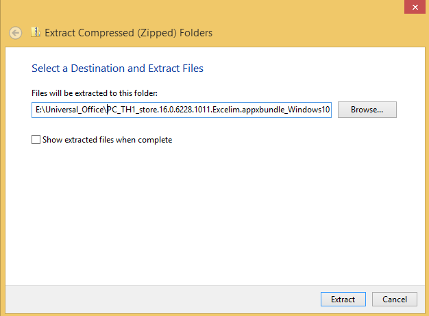

3. Run the following DISM commands. If you are using a newer version of Office than we use in the examples, make sure that the filenames in the command are accurate:

```
dism /image:"c:\mount\windows" /add-provisionedappxpackage /packagepath:"e:\Universal_office\PC_TH1_store.16.0.6228.1011.Excelim.appxbundle_Windows10_PreinstallKit\1b0569bd5fbd41d6bf0669beb013073c.appxbundle" /dependencypackagepath:"e:\Universal_office\PC_TH1_store.16.0.6228.1011.Excelim.appxbundle_Windows10_PreinstallKit\Microsoft.VCLibs.140.00_14.0.22929.0_x86__8wekyb3d8bbwe.appx" /licensepath:"e:\Universal_office\PC_TH1_store.16.0.6228.1011.Excelim.appxbundle_Windows10_PreinstallKit\1b0569bd5fbd41d6bf0669beb013073c_License1.xml"
dism /image:"c:\mount\windows" /add-provisionedappxpackage /packagepath:"e:\Universal_office\PC_TH1_store.16.0.6228.1011.Pptim.appxbundle_Windows10_PreinstallKit\7f255062294a415a974b4958961df056.appxbundle" /dependencypackagepath:"e:\Universal_office\PC_TH1_store.16.0.6228.1011.Pptim.appxbundle_Windows10_PreinstallKit\Microsoft.VCLibs.140.00_14.0.22929.0_x86__8wekyb3d8bbwe.appx" /licensepath:"e:\Universal_office\PC_TH1_store.16.0.6228.1011.Pptim.appxbundle_Windows10_PreinstallKit\7f255062294a415a974b4958961df056_License1.xml"
dism /image:"c:\mount\windows" /add-provisionedappxpackage /packagepath:"e:\Universal_office\PC_TH1_store.16.0.6228.1011.Wordim.appxbundle_Windows10_PreinstallKit\532f710ca9d34f0aae6af4abe0af0592.appxbundle" /dependencypackagepath:"e:\Universal_office\PC_TH1_store.16.0.6228.1011.Wordim.appxbundle_Windows10_PreinstallKit\Microsoft.VCLibs.140.00_14.0.22929.0_x86__8wekyb3d8bbwe.appx" /licensepath:"e:\Universal_office\PC_TH1_store.16.0.6228.1011.Wordim.appxbundle_Windows10_PreinstallKit\532f710ca9d34f0aae6af4abe0af0592_License1.xml"
```

## Modify the Start layout

The Start tile layout in Windows 10 provides OEMs the ability to append tiles to the default Start layout to include Web links, secondary tiles, classic Windows applications, and universal Windows apps. OEMs can use this layout to make it applicable to multiple regions or markets without duplicating a lot of the work. In addition, OEMs can add up to three default apps to the frequently used apps section in the system area, which delivers system-driven lists, including important or frequently accessed system locations and recently installed apps.

To take advantage of the new features, and to have the most robust and complete Start customization experience for Windows 10, consider creating a LayoutModification.xml file. This file specifies how the OEM tiles should be laid out in Start. For more information about how to customize the new Start layout, see the topic Customize the Windows 10 Start screen in the Windows 10 Partner Documentation or on MSDN.

To get you started, we've provided a sample file called layoutmodification.xml in the files you extracted to _Data._ We recommend using this file for this lab. You can find it in _USB-B_\StartLayout.

The Sample LayoutModification.xml shows two groups called “Fabrikam Group 1” and “Fabrikam Group 2”, which contain tiles that will be applied if the device country/region matches what’s specified in Region (in this case, the regions are Germany and United States). Each group contains three tiles and the various elements you need to use depending on the tile that you want to pin to Start.  

Keep the following in mind when creating your LayoutModification.xml file: 

- If you are pinning a Classic Windows application using the start:DesktopApplicationTile tag and you don’t know the application’s application user model ID, you need to create a .lnk file in a legacy Start Menu directory before first boot. 
- If you use the start:DesktopApplicationTile tag to pin a legacy .url shortcut to Start, you must create a .url file and add this file to a legacy Start Menu directory before first boot. 

For the above scenarios, you can use the following directories to put the .url or .lnk files: 
- %APPDATA%\Microsoft\Windows\Start Menu\Programs\
- %ALLUSERSPROFILE%\Microsoft\Windows\Start Menu\Programs\ 

**Note:** The sample layoutmodification.xml contains Office Mobile apps. If you aren't preinstalling Office Mobile, be sure to remove Office Mobile from the layout by removing the element </AppendOfficeSuite> as well as the start tiles with Office applications.

1. Copy layoutmodification.xml to your mounted Windows image, in the c:\mount\windows\users\default\AppData\Local\Microsoft\Windows\Shell\ folder. If the file already exists, replace the existing file with the new one,
2. If you pinned tiles that require .url or .lnk files, add the files to the following legacy Start Menu directories:

- %APPDATA%\Microsoft\Windows\Start Menu\Programs\
- %ALLUSERSPROFILE%\Microsoft\Windows\Start Menu\Programs\

    ```
    copy e:\StartLayout\Bing.url "C:\mount\windows\ProgramData\Microsoft\Windows\Start Menu\Programs"
    copy e:\StartLayout\Paint.lnk "c:\mount\windows\ProgramData\Microsoft\Windows\Start Menu\Programs"
    copy E:\StartLayout\Bing.url "c:\mount\windows\users\All Users\Microsoft\Windows\Start Menu\Programs"
    copy E:\StartLayout\Paint.lnk "C:\Mount\Windows\Users\All Users\Microsoft\Windows\Start Menu\Programs"
    ```

    **Note:** If you don’t create a LayoutModification.xml file and you use the Unattend Start settings, Windows will take the first 12 SquareTiles or DesktoporSquareTiles settings in the Unattend file. Windows will place these tiles automatically in newly-created groups at the end of Start. The first six tiles are placed in the first OEM group and the second set of six tiles are placed in the second OEM group. If OEMName is specified in the Unattend file, OEMName is used to name the OEM groups are created.


## Add a license agreement and info file

### Add an OEM-specific license

In this section, we'll cover how an OEM can add their own license terms during OOBE.

**Note:** If the license terms are included, the OEM must include a version of the license terms in each language that is preinstalled onto the PC. A license term text must be an .rtf file, saved as .rtf format.

To begin adding license terms, you'll have to create folders for your license files, and then configure OOBE to show the license on first boot.

1.	Create folders for you system languages under the following directory: C:\mount\windows\Windows\System32\oobe\info\default\ 

2.	Name each folder under C:\mount\windows\Windows\System32\oobe\info\default\ directory as the Language Decimal Identifier corresponding the language. Do this step for each language pack that's in the Windows image.

    **Note:**  Please see [this link to see complete list of language decimal identifiers of corresponding languages](available-language-packs-for-windows.md).

    For example: If en-us and de-de language packs are added to the Windows image, add a folder named “1033” (representing en-us language) in C:\mount\windows\Windows\System32\oobe\info\default\. Then add a folder named “1031” (de-de language) under the same C:\mount\windows\Windows\System32\oobe\info\default\ directory.

     ```
     MD c:\mount\windows\windows\system32\oobe\info\default\1031
     MD c:\mount\windows\windows\system32\oobe\info\default\1033
     ```

4.	Create a license terms file for each language you have in your image, and copy them to the language-specific oobe folder.

    For example: Move the English agreement.rtf file to C:\mount\windows\Windows\System32\oobe\info\default\1033\ directory and move the German agreement.rtf to C:\mount\windows\Windows\System32\oobe\info\default\1031\. 

    ```
    copy E:\resources\english-agreement.rtf c:\mount\windows\windows\system32\oobe\info\default\1033\agreement.rtf
    copy E:\resources\german-agreement.rtf c:\mount\windows\windows\system32\oobe\info\default\1031\agreement.rtf
    ```

5.	Create oobe.xml file to specify the agreement.rtf file path. Below you can see a sample oobe.xml which is located at _USB-B_\ConfigSet\oobe.xml

    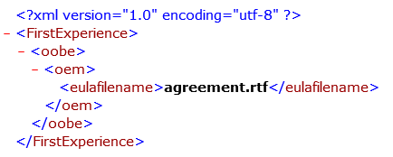

6.	Copy oobe.xml file to each language folder. 

    -	For example: Copy oobe.xml to C:\mount\windows\Windows\System32\oobe\info\default\1033\, which has a file called agreement.rtf in English. To add the German agreement, copy oobe.xml to C:\mount\windows\Windows\System32\oobe\info\default\1031\ directory, which has the German agreement.rtf file.

    ```
    copy e:\configset\oobe.xml c:\mount\windows\windows\system32\oobe\info\default\1033
    copy e:\configset\oobe.xml c:\mount\windows\windows\system32\oobe\info\default\1031
    ```

7.	Now each language folder has an oobe.xml file and an agreement.rtf file in that corresponding language.

When the image first boots into OOBE, it will display the license agreement.

 
### Create an image info file and add it to your image

1.	Create an csup.txt file to specify when the Windows image was created. This file must include the date that the image was created, in the form of 'MM-DD-YYYY', with no other characters, on a single line at the top of the file.
	
    ```
    03-17-2017
    ```

2.	Copy the image info file into the mounted image.

    ```
    xcopy C:\temp\CSUP.txt c:\mount\windows\windows\csup.txt
    ```

## Work with Answer Files

An "answer file" is an XML-based file that contains setting definitions and values to use during Windows Setup. In an answer file, you specify various setup options, including how to partition disks, the location of the Windows image to install, and the product key to apply. Values that apply to the Windows installation, such as the names of user accounts, display settings, and Internet Explorer Favorites can also be specified. The answer file for Setup is typically called Unattend.xml.

You can create a new answer file (unattend.xml) that has the settings you need to deploy a PC. You can use Windows SIM that was installed as part of the ADK to create and modify unattend files. We recommended using the following answer files because they cover most the required settings in the Windows OEM Policy Document (OPD) Document. Copy the unattend file to the Panther folder so it can be processed during Windows setup: 

- For OA 3.0 systems: 

```
md c:\mount\windows\windows\panther
copy /y E:\AnswerFiles\OA3.0\Unattend.xml C:\Mount\Windows\Windows\Panther 
```

(where E:\ is USB-B)

- For non-OA 3.0 systems: 

```
nd c:\mount\windows\Windows\panther
copy /y E:\AnswerFiles\Non_OA3.0\Unattend.xml C:\Mount\Windows\Windows\Panther
```

(where E:\ is USB-B)


### Add a custom logo and wallpaper

In this section we'll show you how to use an answer file (unattend.xml) to add a custom logo and wallpaper to your Windows image.

To learn about Windows customizations, see the Windows 10, version 1703 OEM Policy Document (OPD).  

We've provided some image files for the wallpaper and logo that are referenced in the sample unattend file that you copied earlier. You can find the sample image files at _USB-B_\configset\\$oem$\system32\OEM.

1.	View the unattend file that you copied to the Panther folder in a text editor. Check the path to the logo and wallpaper files.
2.	Copy the files into the mounted image

```
md c:\mount\windows\windows\system32\OEM
copy E:\configset\$oem$\$$\system32\OEM c:\mount\windows\windows\system32\OEM
```
Where E:\ is _USB-B_.

## Optimize WinRE

1.	Increase the scratchspace size of the WinRE image.

    ```
    Dism /image:c:\mount\winre /set-scratchspace:512
    ```

2.	Cleanup unused files and reduce size of winre.wim

    ```
    dism /image:"c:\mount\winre" /Cleanup-Image /StartComponentCleanup /Resetbase
    ```

### Unmount your images

1.	Close all applications that might be accessing files from the image, including File Explorer.
2.	Commit the changes and unmount the Windows RE image:

    ```
    Dism /Unmount-Image /MountDir:"C:\mount\winre" /Commit
    ```
    where C is the drive letter of the drive that contains the image.
    
    This process can take a few minutes.
    
3.	Make a backup copy of the updated Windows RE image. We'll use the backup copy of WinRE later in the lab:  

    ``` 
    dism /export-image /sourceimagefile:c:\mount\windows\windows\system32\recovery\winre.wim /sourceindex:1 /DestinationImageFile:e:\images\winre_bak.wim
    Del c:\mount\windows\windows\system32\recovery\winre.wim
    Copy e:\images\winre_bak.wim c:\mount\windows\windows\system32\recovery\winre.wim
    ```
    When prompted, specify `F` for file

    Troubleshoot: If you cannot see winre.wim under the specified directory, use the following command to set the file visible:
    ```
    attrib -h -a -s C:\mount\windows\Windows\System32\Recovery\winre.wim
    ```

4.	Check the new size of the Windows RE image:

    ```
    Dir "C:\mount\windows\Windows\System32\Recovery\winre.wim"
    ```

    Follow the below partition layout size chart to determine the size of your recovery partition in createpartitions-<firmware>.txt files. The amount of free space left is after you copy winre.wim to the hidden partition.
Please reference Disk Partition rules for more information.

    | Partition Size   | Free space          |
    | ---------------- | ------------------- |
    | Less than 500 MB | Minimum 50 MB free  |
    | 500 MB or larger | Minimum 320 MB free |

    - If the partition is larger than 1 GB, we recommend that it should have at least 1 GB free. 

5.	Commit the changes and unmount the Windows image:
    ```
    Dism /Unmount-Image /MountDir:"C:\mount\windows" /Commit
    ```

Where C is the drive letter of the drive that contains the image. This process may take several minutes.

## Deploy your images to a new PC

In this section we'll prepare a PC for deployment by booting into WinPE, creating a partition layout, and then deploying your image.

### Boot to WinPE

If you're not already booted into WinPE on the device you're deploying your image to, boot into WinPE:

1.	Connect the _WINPE_ drive and boot the reference computer.
2.	After WinPE has been booted connect _USB-B_.
3.	At the X:\Windows\system32> command line, type `diskpart` and press Enter.
4.	At the \DISKPART> command line type `list volume`.
5.	In the “Label” column, note the letter of the volume under the “Ltr” column. This is the drive letter of your USB key. (example E) 
6.	Type exit to quit Diskpart


### Use a deployment script to apply your image

Run a script to create partitions and apply your image. We'll use walkthrough-deploy.bat in _USB-B_\deployment to do this for us.

Important: As of Windows 10, version 1607, the Recovery partition must be the next partition after the Windows partition. This ensures that winre.wim can be kept up-to-date during life of the device. 

On your reference PC:

1. In WinPE, run walkthroughdeploy.bat from the USB-B\deployment folder, specifying the image you want to deploy:
    ```
    E:\Deployment\walkthrough-deploy.bat E:\images\basicimage.wim
    ```
    **Note:** There are several pauses in the script. You will be prompted Y/N for the Apply operation if this is Compact OS deployment.

2. When the script finishes, type exit to reboot the PC into the new Windows installation.

3. The PC will boot into OOBE. Press `Ctrl+Shift+F3` to boot into Audit mode.

    **Note:** Only use compact OS on Flash drive based devices as compact OS performance is heavily dependent on the storage device capabilities. Compact OS is NOT recommending on rotational devices. Please reference Compact OS for more information.

## Make changes from Windows (audit mode)

Now that you have made changes to your offline image, you can apply your image to a PC and use audit mode to customize Windows using the familiar Windows environment. In audit mode, you can add Windows desktop applications, change system settings, add data, and run scripts to get your image ready for to be captured.

To make sure your audit mode changes are included in the recovery image, you'll need to capture these changes into a provisioning package using ScanState. This image gets used by the system recovery tools to restore your changes if things go wrong. You can optionally save drive space by running the applications directly from the compressed recovery files; this is known as single-instancing.

If you want to capture the changes in an image and apply it to other devices, you'll need to use the Sysprep tool to generalize the image.

### Apps and Store opportunities

Through Windows 10 and the Windows Store, you have tremendous opportunities for brand and device differentiation, revenue creation, and customer access. 

Windows Store apps are at the center of the Windows 10 experience. They are Windows universal apps, so you can build apps for desktops, tablets, or phones that run Windows 10. As an OEM, you can provide an engaging customer experience and increase brand loyalty by providing a great set of value-added software and services along with the high-quality hardware that you build.

For more information please refer to Windows Store Program 2016 Guide - 2016 Final Clean and Apps and Store Windows Engineering Guide (WEG)

**Important:** The key below must be set in Audit mode.

You have to change a registry setting to add your OEM ID. If you're an OEM Windows Store Program participant, contact PartnerOps@microsoft.com to get your OEM ID. 

| Item   | Location in Registry                                                                               |
| ------ | -------------------------------------------------------------------------------------------------- |
| OEMID  | HKEY\_LOCAL_MACHINE\Software\Microsoft\Windows\CurrentVersion\Store, (REG_SZ) OEMID                |
| SCM ID | HKEY\_LOCAL_MACHINE\Software\Microsoft\Windows\CurrentVersion\Store, (REG_SZ) StoreContentModifier |

OEMID

1.	Run regedit.exe from command prompt
2.	Navigate to HKEY_LOCAL_MACHINE\Software\Microsoft\Windows\CurrentVersion\Store
3.	Right click under (Defalut) -> click new
4.	Click String Value
5.	Type OEMID
6.	Double click OEMID and enter OEM name in Value data: text field

SCMID

1.	Run regedit.exe from command prompt
2.	Navigate to HKEY_LOCAL_MACHINE\Software\Microsoft\Windows\CurrentVersion\Store
3.	Right click under (Defalut) -> click new
4.	Click String Value
5.	Type StoreContentModifier
6.	Double click StoreContentModifier and enter OEM name in Value data: text field


**Important**: The OEMID registry key is not restored automatically during PBR in Windows 10. Please refer to the scanstate section of this guide on how to restore the OEMID registry key during PBR operation.

## Preload Microsoft Office
This section covers pre-loading Office v16.3.

### Prepare Microsoft Office v16.3 for installation

This section provides information for licensed OEMs about how to use the Office Deployment Tool to preinstall Office 2016 on Windows PCs.

**Note:** This guide doesn’t cover the PIPC scenarios for OEMs in Japan. 

To complete this section, you'll need the Office Deployment Tool (X21-05453 Office 2016 v16.3 Deployment tool for OEM OPK), and Office V16.3 in a specific language. We'll use Enligh X21-05453 for this lab.

**On your technician PC:**

1.	Mount the ISO for the Office deployment tool and copy the files to E:\OfficeV16.3\ (Where E: is _USB-B_).
2.	Double click e:\OfficeV16.3\officedeploymenttool.exe
3.	Provide folder path to extract files E:\OfficeV16.3

Setup.exe and configuration.xml are extracted to E:\OfficeV16.3

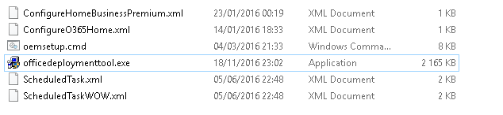
 
4.	Mount your language-specific Office ISO, and copy the Office folder to E:\OfficeV16.3 (Where E: is USB-B).

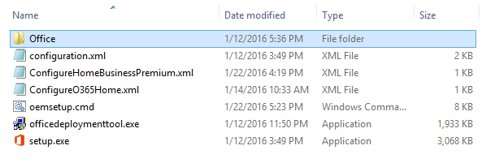 

[Optional] if you applied a language interface pack you may want to add the language pack for Office 2016 as well. We'll show you how to add German language support.

a.	Mount “X21-32396 Office v16.3 German OPK”.
b.	Copy the office folder to E:\OfficeV16.3
c.	Skip replacing duplicate files in the copy so that only the German languages are copied.
d.	Run `Notepad E:\Officev16.3\ConfigureO365Home.xml`.
e.	Add a language ID and verify SourcePath as in screen shot below

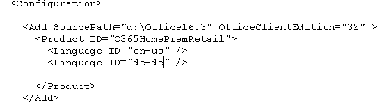
 
5.	Save and close ConfigureO365Home.xml
6.	Unplug _USB-B_ from technician computer

### Install Office 2016

**On your reference PC:**

1.	Plug _USB-B_ into reference computer which is in Audit mode.
2.	Find the drive letter for _USB-B_, We'll use E:\.
3.	Notepad ConfigureO365Home.xml
4.	Configure the SourcePath to point to USB-B E:\Officev16.3
 
    **Note:** the only Product ID that needs to be specified in the configuration.xml file is O365HomePremRetail. If the user enters a key for another product, such as for Office Home & Student 2016, then Office will automatically be configured as the product associated with that key.

5.	Close and Save ConfigureO365Home.xml
6.	Open command prompt and navigate to d:\Officev16.3
7.	Run setup.exe with the /configure option.

    ```
    setup.exe /configure ConfigureO365Home.xml
    ```

### Pin Office tiles to the Start Menu

You'll have to pin Office tiles to the start menu. If you don't pin them, Windows will remove the Office pins during OOBE boot phase.

Note: You must be using at least version 10.0.10586.0 of Windows 10. The following steps don’t work with earlier versions of Windows 10.

1.	Open C:\Users\Default\AppData\Local\Microsoft\Windows\Shell\layoutmodification.xml in notepad.
2.	Add <AppendOfficeSuiteChoice Choice="Desktop2016" /> to layoutmodification.xml as you see highlighted below:

    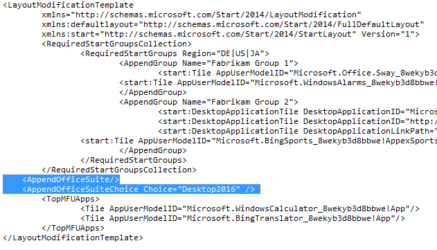
 
    **Note:** The Choice attribute is new. This allows different versions of Office to be pinned to the Start screen at the same time. For now, Desktop2016 is the only valid value. 

3.	Save and close layoutmodification.xml.

    **Note:** for recovery, the layoutmodification.xml will need to be copied during recovery. Refer to section 10.3

4.	Copy to the recovery folder. This will ensure that your taskbar pins will remain through recovery scenarios.
    ```
    C:\Users\Default\AppData\Local\Microsoft\Windows\Shell\layoutmodification.xml c:\recovery\OEM
    ```

When the PC is finished going through OOBE and is showing the desktop, the start menu will have the 3 tiles appended to start menu in image below:

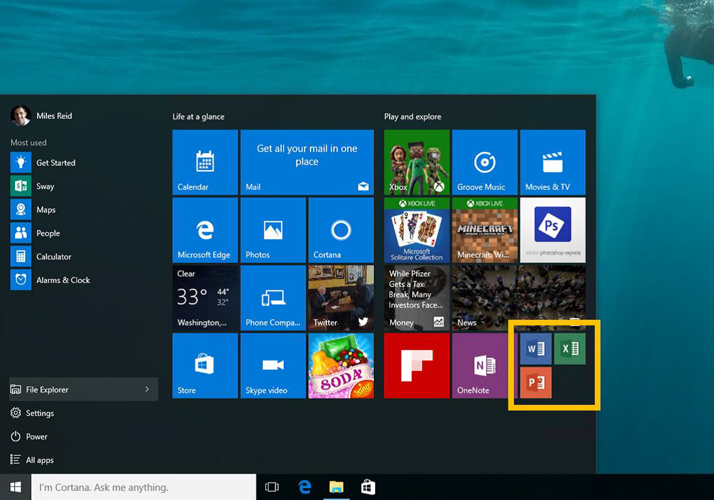

### Microsoft Office 2016: Configure setup experience for the user

After you install Office on the device, you also need to configure the setup experience for the user. This is the experience the user sees when they open an Office app for the first time on the device. This also is intended to ensure that Office is properly licensed and activated.

| Setup mode | Description |   
| ---------- | ----------- |
| OEM	| In this mode, a customer can choose to try, buy, or activate Office with an existing account, PIN, or product key.<p> This mode doesn’t support Activation for Office (AFO) or AFO late binding. Therefore, if you choose this mode, you need to provide the customer with an Activation Card (formerly called a product key card or a Microsoft Product Identifier (MPI) card). |
| OEMTA |	This mode supports the try, buy, or activate experience of the OEM mode as well as supporting AFO and AFO late binding.<p> This mode supports Office activation through the device’s Windows product key, which means the customer wouldn’t need to enter a 5x5 product key code. |

OEM Mode – Provide user with activation card

1. In command prompt go to drive letter for USB-B\Officev16.2
2. Type and run oemsetup.cmd Mode=OEM Referral=####

OEMTA Mode – Activation is done through the device’s Windows product key

Type and run oemsetup.cmd Mode=OEMTA Referral=####

### Verify Customizations in Audit Mode

We don't recommend connecting your PC to the internet during manufacturing, and also don't recommend isntalling updates from Windows Update in audit mode because it will likely generate an error during sysprep.

1.	After setup has finished, the computer logs into Windows in Audit mode automatically as an Administrator.
2.	Verify the changes from the answer file (see manufacturer name, support phone number and other customizations) are present.


## Prepare your image for Push Button Reset

This section provides guidance for setting up the recovery environment for Push Button Reset (PBR) scenarios.

Please reference Push-button reset and Windows Recovery Environment (Windows RE) and Hard Drives and Partitions for more information.

Push-button reset, is a built-in recovery tool which allows users to recover the OS while preserving their data and important customizations, without having to back-up their data in advance. It reduces the need for custom recovery applications by providing users with more recovery options and the ability to fix their own PCs with confidence. 

In Windows 10, the Push-button reset features have been updated to include the following improvements: 

The Push-button reset user experience offers customization opportunities. Manufacturers can insert custom scripts, install applications or preserve additional data at available extensibility points. 
The following Push-button reset features are available to users with Windows 10 PCs: 

  - Refresh your PC 

    Fixes software problems by reinstalling the OS while preserving the user data, user accounts, and important settings. All other preinstalled customizations are restored to their factory state. In Windows 10, this feature no longer preserves user-acquired Universal Windows apps. 

  - Reset your PC

    Prepares the PC for recycling or for transfer of ownership by reinstalling the OS, removing all user accounts and contents (e.g. data, Classic Windows applications, and Universal Windows apps), and restoring preinstalled customizations to their factory state. 

  - Bare metal recovery 

    Restores the default or preconfigured partition layout on the system disk, and reinstalls the OS and preinstalled customizations from external media.

### Prepare ScanState 

To start working with Push Button Reset, you'll need to copy ScanState to _Data_.

Use scanstate to capture Classic Windows applications and settings on your image.

**Note**: You'll use your technician PC to prepare ScanState. 

1.	On Technician PC Insert USB-B
2.	Open Deployment and Imaging tools command prompt as administrator
3.	Run the copydandi.cmd script file pointing to USB-B key

    OEMs using an x64 Windows 10 image, make x64 Scanstate directory

    ```
    Copydandi.cmd amd64 e:\scanstate_amd64
    ```
    Where E: is the letter of USB-B drive.

    If you're using an x86 Windows 10 image, make x86 Scanstate directory:

    ```
    Copydandi.cmd x86 e:\scanstate_x86
    ```

    Where E: is the letter of USB-B drive.

### Create a Scanstate migration file

In this section, you'll create a configuration file that will restore files and registry keys during Push-button reset.

Create a migration XML file used to restore registry values manually entered during manufacturing process. The sample below restores the OEMID registry value set earlier in this document.

**Note:** USB-B\recovery\recoveryimage\regrecover.xml already contains the registry values. You can use this file instead of creating a new file.

1. Open notepad
2. Copy and paste the following xml into Notepad. This tells ScanState to migrate the OEMID registry key:
    ```
    <migration urlid="http://www.microsoft.com/migration/1.0/migxmlext/test">
         <component type="System" context="UserAndSystem">
              <displayName>OEMID</displayName> 
            <role role="Settings">
                <rules>
                    <include>
                        <objectSet>
                            <pattern type="Registry">HKLM\Software\Microsoft\Windows\CurrentVersion\Store [OEMID]</pattern> 
                        </objectSet>
                    </include>
                </rules>
            </role>
        </component>
    </migration>
    ```

3. Save the file as regerecover.xml.

### Create recovery package using Scanstate

**On your reference PC:**

Use ScanState to capture installed customizations into a provisioning package, and then save it to c:\Recovery\customizations. We'll use samples from _USB-B_\Recovery\RecoveryImage to create the provisioning package.

**Important:** For PBR to work properly, packages have to be .ppkg files that are stored in C:\Recovery\Customizations.

1.	Create the recovery OEM folder and copy contents of USB-B\Recovery\RecoveryImage

    **Important:** To retain the customized start layout menu during recovery the layoutmodification.xml needs to be copied again during recovery process. We'll copy it here and then use EnableCustomizations.cmd to copy it during recovery.
    ```
    Copy E:\Recovery\recoveryimage c:\recovery\OEM
    Copy E:\StartLayout\layoutmodification.xml c:\recovery\OEM
    ```

2.	Run ScanState to gather app and customizations

    For x64 Windows 10 PCs:

    ```
    mkdir c:\recovery\customizations
    E:\ScanState_amd64\scanstate.exe /apps /ppkg C:\Recovery\Customizations\apps.ppkg /i:c:\recovery\oem\regrecover.xml /config:E:\scanstate_amd64\Config_AppsAndSettings.xml /o /c /v:13 /l:C:\ScanState.log
    ```

    Where E: is the drive letter of USB-B

    For x86 Windows 10 PCs:
    ```
    E:\ScanState_x86\scanstate.exe /apps /ppkg C:\Recovery\Customizations\apps.ppkg /i:c:\recovery\oem\regrecover.xml /config:e:\scanstate_x86\Config_AppsAndSettings.xml /o /c /v:13 /l:C:\ScanState.log
    ```

    Where E: is the drive letter of USB-B

3. When ScanState completes successfully, delete scanstate.log and miglog.xml files:
    ```
    del c:\scanstate.log
    del c:\miglog.xml
    ```

### Create Extensibility scripts to restore additional settings

You can customize the Push-button reset experience by configuring extensibility points. This enables you to run custom scripts, install additional applications, or preserve additional user, application, or registry data.

During recovery, PBR calls EnableCustomizations.cmd which we'll configure to do 2 things:

1.	Copy the unattend.xml file used for initial deployment to the \windows\panther.
2.	Copy the layoutmodification.xml to the system.

**Note:** The Win10DepWhiPapForOEMsv1.01July2015 sample extensibility script used a command which no longer is needed. Please use the extensibility script from USB-B as sample for point for creating a new extensibility script.

This will restore the additional layout settings from these 2 answer files during PBR. 

**Important:** Recovery scripts and unattend.xml must be copied to c:\Recovery\OEM for PBR to pickup and restore settings defined in the unattend.xml.

### Copy unattend.xml files for restoring settings

For OA 3.0 systems:

```
Copy e:\AnswerFiles\oa3.0\unattendsysprep.xml c:\Recovery\OEM\unattend.xml
```

For non-OA 3.0 systems:

```
Copy e:\AnswerFiles\non_oa3.0\unattendsysprep.xml c:\Recovery\OEM\unattend.xml
```

### Copy winre.wim backup
During the deployment winre.wim file is moved. Before capturing a final image, the backup winre.wim we created must be copied back, or the recovery environment will not work in the final image deployment.

```
Copy e:\images\winre_bak.wim c:\windows\system32\recovery\winre.wim
```

### Reseal the image

In this section, we'll use sysprep.exe to reseal our image and get it ready for factory deployment.

1.	Delete installation folders and files that have been created of the preloaded applications which are for example, C:\Office-SingleImagev15.4-Setup. These folders can increase the size of a captured .wim file.
2.	If the SysPrep Tool is open, close it and open Command Prompt in Administrator mode.
3.	Generalize the image by using answer file with additional settings:

```
C:\Windows\System32\Sysprep\sysprep /oobe /generalize /unattend:c:\recovery\oem\Unattend.xml /shutdown
```

## Finalize and Capture your image

We'll show you how to finalize and capture a factory image for mass deployment. To start this section, make sure your reference machine is shutdown after running sysprep in the previous section.

1.	Connect “USB” and boot the Reference computer into WinPE.
2.	After WinPE has been booted connect USB-B

    **Troubleshooting:** 

    - If the reference PC boots from its internal HDD, Windows will enter the specialize and OOBE passes. You won't be able to capture a stable and generalized image if any of the configuration passes have completed. If either of those passes have completed, you'll need To generalize the image again. You can do with in Audit Mode (\<Ctrl>+\<Shift>+\<F3> during OOBE). In Audit mode, run the Sysprep command from above. Make sure the PC boots to WinPE on the next restart.

    - If the system still boots to the internal HDD, check the PC's boot priority. Make sure that the USB has a higher boot priority than the internal hard drive.

3.	Identify Windows Partition Drive letter using diskpart.

    a. At the X:\windows\system32> prompt, type diskpart and press the <Enter> key to start Diskpart.

    b. At the \DISKPART> prompt type `list volume`.

    c. Under the “Label” column, locate the volume that is labeled “Windows”.

    d. Note what letter it is has been assigned under the “Ltr” column (Example: C).  This is the USB key's drive letter.

    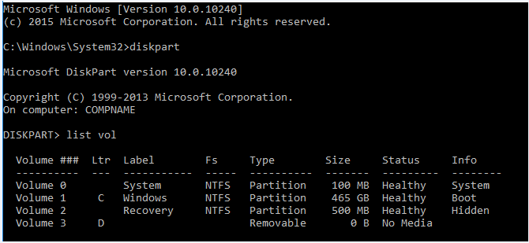

    e. Type exit to quit Diskpart.

### (CompactOS Only) Convert installed customizations

This section shows how to reduce the size of ScanState packages.

**Important:** Only do this step if you are deploying to a device with limited storage. Single instancing impacts the launch performance of some desktop applications.

Please reference Compact OS for more information.

To reduce the size of your ScanState recovery packages, run the following command from WinPE on your reference device:

```
DISM /Apply-CustomDataImage /CustomDataImage:C:\Recovery\Customizations\apps.ppkg /ImagePath:C:\ /SingleInstance
```

### Optimize your image with DISM

Running Dism with the  `/resetbase` optimizes your image in several ways:

- It marks installed packages (KB Updates) as permanent so that recovery and Push Button Reset is performed,  packages are included in a refresh/reset.
- Superseded packages are removed.
- Package updates are compressed to save space.

The `/defer` option is new in Windows 10 version 1703. This switch skips the compression action while running `/resetbase`. The compression is done in a lower-priority thread after a device reaches the desktop. This improves the performance of running `/resetbase` on factory floor, but also means the image will be slightly larger than not running it.

> **Important:** By default, non-major updates (e.g. ZDPs, KB’s, LCUs) are not restored. To ensure that updates preinstalled during manufacturing are not discarded after recovery, they should be marked as permanent by using the /Cleanup-Image command in DISM with the /StartComponentCleanup and /ResetBase options. Updates marked as permanent are always restored during recovery. 

#### Run DISM /resetbase

Run Dism with the `/resetbase` option to configure your Windows image to include installed packages in recovery:

Option 1: Run /resetbase with compression on

```
MD c:\scratchdir
Dism /Cleanup-Image /Image:C:\ /StartComponentCleanup /resetbase /scratchdir:c:\scratchdir
RD c:\scratchdir 
```

Option 2: Run /resetbase /defer turning compression off

```
MD c:\scratchdir
Dism /Cleanup-Image /Image:C:\ /StartComponentCleanup /resetbase /defer /scratchdir:c:\scratchdir
RD c:\scratchdir 
```

## Capture your image

In this section, we'll tell you how to capture your sysprepped image. 

**On your reference PC:**

1.	Identify Windows Partition Drive letter.

    a. At the X:\windows\system32> prompt, type diskpart and press the <Enter> key to start Diskpart. 

    b. At the \DISKPART> prompt type list volume

    c. Under the “Label” column, locate the volume that is labeled “Windows”

    d. Note what letter it is has been assigned under the “Ltr” column (Example: C).  This is the drive letter that needs to be used 

    e. Type exit to quit Diskpart

2.	Capture the image of the windows partition to USB-B. This process takes several minutes. 

    Note: We recommend using a cache directory when running DISM. In this step we'll create scratchdir on the USB-B key for temporary files, but you can choose any hard drive with available space for your scratch directory. 

    ```
    MD e:\scratchdir
    Dism /Capture-Image /CaptureDir:C:\ /ImageFile:E:\Images\CustomImage.wim /Name:"CustomImage" /scratchdir:e:\scratchdir
    ```
This captures an image called CustomImage.wim to E:\Images. When the image capture is complete, you can shut down your reference PC.

## Verify your final image

In this section, we'll cover how to deploy your captured image for testing and verification.

### Deploy your image to the reference device


1. Boot the PC you want to test your image on into WinPE.
2. Run walkthrough-deploy.cmd to deploy the finalimage.wim

```
E:\Deployment\walkthrough-deploy.cmd E:\Images\FinalImage.wim
```
3. Type `exit` to close WinPE and restart the PC.

### Validate the configuration

Your PC will restart and boot into Windows for the first time.

1. In OOBE, create a dummy user which will be deleted later.
2. Verify that any applications and offline customizations are still in your image and working properly.
    
    Some things to check are:

    - Taskbar 
    - Pinned Apps
    - Desktop Wallpaper is set to display the right image
    - OEM Information displays correctly
    - OEM App ID registry key is set
    - Default Theme is the one you chose
    - Store apps start properly
    - Desktop applications start ok  
    - Desktop applications applied via SPP start ok


### Verify Recovery

1.	Verify that your customizations are restored after recovery, and that they continue to function by running the Refresh your PC and Reset your PC features from the following entry points: 
 - Settings 
    a.	From the Start Menu, click Settings, 
    b.	In the Settings app, click Update & security, and then click Recovery. 
    c.	Click the Get Started button under Reset this PC and follow the on-screen instructions.

 - Windows RE 
    a.	From the Choose an option screen in Windows RE, click Troubleshoot 
    b.	Click Reset this PC and then follow the on-screen instructions 

2.	Verify that recovery media can be created, and verify its functionality by running the bare metal recovery feature: 
    a.	Launch Create a recovery drive from Control Panel 
    b.	Follow the on-screen instructions to create the USB recovery drive 
    c. Boot the PC from the USB recovery drive 
    d. From the Choose an option screen, click Troubleshoot 
    e. Click Recover from a drive and then follow the on-screen instructions 

**Note:** The Push-button reset UI has been redesigned in Windows 10. The Keep my files option in the UI now corresponds to the Refresh your PC feature. Remove everything corresponds to the Reset your PC feature.

## Optimize final image and set editions

At this point, you have a Windows Home image that is almost ready for deployment. In this section, we'll show you how to put the finishing touches on your image. We'll copy your image, and then upgrade the edition on the copied image.  Then we'll optimize your final master images. Then you'll have two images ready for deployment.


1.	Export your image so you can upgrade it to Windows Professional. This will export a copy of your image to a new file.

    ```
    dism /export-image /sourceimagefile:e:\images\finalimage.wim /sourceindex:1 /DestinationImageFile:C:\images\MasterImage_Pro.wim
    ```

2.	Export your home image to cleanup unused packages in the Home image. 
    ```
    dism /export-image /sourceimagefile:e:\images\finalimage.wim /sourceindex:1 /DestinationImageFile:C:\images\MasterImage_Home.wim
    ```

3.	Mount MasterImage_Pro.wim for upgrading the edition
    ```
    Dism /mount-wim /wimfile:e:\images\MasterImage_Pro.wim /mountdir:c:\mount\windows /index:1
    ```

4.	Check for available editions within the mounted WIM with `dism /get-targeteditions`.
    ```
    Dism /image:c:\mount\windows /get-targeteditions

    Editions that can be upgraded to:

    Target Edition : Professional
    Target Edition : Education
    ```

5.	Upgrade your image to Professional Edition.
```
Dism /image:c:\mount\windows /set-edition:Professional
```

6.	Cleanup the upgraded image.
    ```
    Dism /image:c:\mount\windows /cleanup-image /startcomponentcleanup /resetbase
    ```

7.	Use notepad to edit the unattend files. Change the product key to the default Professional product key in c:\mount\windows\recovery\OEM\Unattendsysprep.xml and c:\mount\windows\Windows\panther\unattend.xml 
    ```
    Notepad c:\mount\windows\recovery\oem\unattend.xml
    Notepad c:\mount\windows\windows\panther\unattend.xml
    ```

8.	Unmount the image
    ```
    Dism /unmount-wim /mountdir:c:\mount\windows
    ```

9.	Remove unused packages and create your Master Professional image
    ```
    Dism /export-image /sourceimagefile:e:\images\FinalImage_ProSku.wim /sourceindex:1 /destinationimagefile:e:\images\MasterImage_Pro.wim
    Del e:\images\FinalImage.wim
    Copy c:\images\MasterImage_Home.wim e:\images
    ```

## Final shipment

You have to boot a PC at least once to allow the specialize configuration pass of Windows Setup to complete before shipping a PC.

The specialize configuration pass adds hardware-specific information to the PC and is complete when Windows OOBE appears.

Reference the OEM Policy Documentation for more details.

### Reducing Disk Footprints

Throughout this guide, we have shown a few places where you can reduce the disk footprint:

- Using Dism /cleanup-image /resetbase
- Using Dism /export-image
- Using Compact OS
- Using Compact OS with Single Instancing

This section shows a few more ways you can gain additional free space.

#### Reducing and turning off Hiberfile

Reducing and turning off hiberfile can return between 400MB to 1.5GB OS space on the deployed OS.

**Reducing Hiberfile by 30%**

When you run sysprep.exe with unattend.xml, you can add a FirstLogonCommand that will reduce hiberfile:

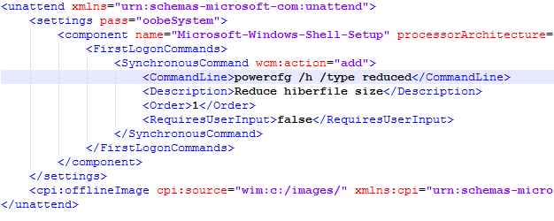
 
**Turn Off Hiberfile**

When you run sysprep.exe with unattend.xml, you can add a FirstLogonCommand that will turn off hiberfile:

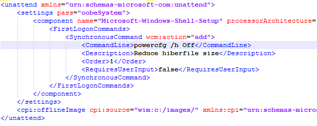

Capture your image with the unattend.xml file that contains these settings. 

### Disk footprint with optimizations

The table below shows additional space saved by using compact OS, Single instancing, and reducing or turning Off Hiberfile on 2GB (x86) and 4GB (x64).

| FootPrint type               | Windows 10 Home x86 2GB memory | Windows 10 Home x64 4GB Memory |
| ---------------------------- | ------------------------------ | ------------------------------ |
| Base Footprint               | 11.68GB (Additional Space)     | 15.06GB (Additional Space)     |
| Compact, no single instancing | 8.85GB (>2.75GB)               | 11.3GB  (>3.7GB)               |
| Compact, single instanced     | 7.66GB (>4GB)                  | 10.09GB (>4.75GB)              |
| Hiberfile off, no compact     | 10.87GB (>825MB)               | 13.48GB (>1.5GB)               |
| Hiberfile reduced, no compact | 11.27GB (>400MB)               | 14.15GB (>930MB)               |

### Troubleshooting deployment issues

Windows deployment generates many logs. To diagnose deployment issues, a script that gathers logs is included on USB-B. This script copies all relevant logs, which can then be sent to OTSQR when reporting a deployment issue. To run the log:

1.	Insert USB-B into the device with the deployment issue
2.	Open command prompt in Administrator mode
3.	Navigate to drive letter of USB-B (ex. E:\) in command prompt
4.	CD to E:\Resources
5.	Run script GatherLogs.cmd

The script should return Success message and give a path to the folder to .zip.

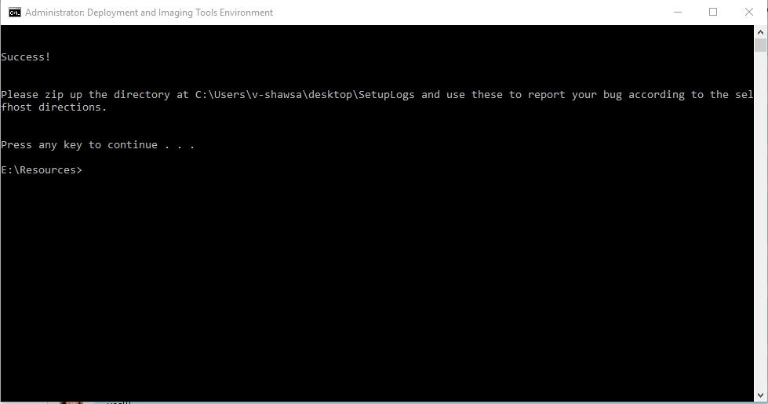
 


