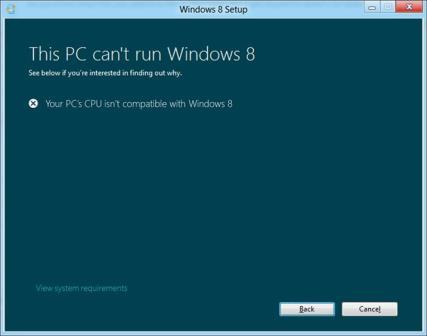

# PAE/NX/SSE2 Support Requirement Guide for Windows 8


This topic describes processor support for the PAE/NX/SSE2 requirement in Windows 8, and error cases and scenarios that customers can encounter when computers do not meet the requirement.

This content applies to Windows 8 and Windows Server® 2012.

**In this topic:**

-   [Overview](#overview)

-   [Scope of implications](#scope)

-   [Support requirements](#support)

-   [FAQs](#faq)

## <span id="overview"></span><span id="OVERVIEW"></span>Overview


### <span id="No-eXecute__NX_"></span><span id="no-execute__nx_"></span><span id="NO-EXECUTE__NX_"></span>No-eXecute (NX)

No-eXecute (NX) is a processor feature that allows memory pages to be marked as non-executable. The feature enables the CPU to help guard the system from attacks by malicious software. The NX feature prevents executable malicious software code from being put in accessible regions of memory. Windows 8 requires that systems have processors that support NX, and NX must be turned on for important security safeguards to function effectively and to avoid potential security vulnerabilities.

In this topic, the term *NX* refers specifically to the NX processor bit that is defined by AMD, or the equivalent XD processor bit that is defined by Intel for the Data Execution Prevention (DEP) feature support in Microsoft Windows.

DEP helps prevent malicious code execution from data pages. The 32-bit version of Windows uses one of the following features for DEP support:

-   The AMD-defined No-eXecute (NX) page protection processor feature

-   The Intel-defined eXecute Disable (XD) bit feature

To use these processor features, the x86 (32-bit) processor must be running in Physical Address Extension (PAE) mode. The 64-bit version of Windows uses the NX processor feature on 64-bit extensions and certain values of the access rights Page Table Entry (PTE) field on Intel Itanium Processor Family (IPF) processors.

In addition to DEP, the Address Space Layout Randomization (ASLR) moves executable images into random locations when a system boots, thereby making it harder for malicious code to operate predictably. ASLR and DEP are effective only when they are used together. NX must be enabled for these two important Windows security safeguards to remain effective. For more information, see [Windows ISV Software Security Defenses](http://go.microsoft.com/fwlink/p/?LinkId=698535).

### <span id="Physical_Address_Extension__PAE_"></span><span id="physical_address_extension__pae_"></span><span id="PHYSICAL_ADDRESS_EXTENSION__PAE_"></span>Physical Address Extension (PAE)

The processor must be running in Physical Address Extension (PAE) mode to use the NX processor feature. PAE is a processor feature that enables x86 processors to access more than 4 GB of physical memory on capable versions of Windows. The Intel Itanium and x64 processor architectures can access more than 4 GB of physical memory natively, and do not provide the equivalent of PAE. PAE is supported by 32-bit versions of Windows running on x86-based systems only.

When DEP is enabled on a system that has a processor that supports the NX feature, PAE is automatically enabled.

### <span id="Streaming_SIMD_Extensions_2__SSE2_"></span><span id="streaming_simd_extensions_2__sse2_"></span><span id="STREAMING_SIMD_EXTENSIONS_2__SSE2_"></span>Streaming SIMD Extensions 2 (SSE2)

All processors that support NX also support Streaming SIMD Extensions 2 (SSE2). SSE2 is an Intel Single Instruction Multiple Data (SIMD) processor supplementary instruction set. AMD also includes SSE2 support with Opteron and Athlon 64 ranges of AMD64 processors. All processors that support NX also support SSE2. Many Windows 8 applications have code paths that have the SSE2 instruction set. SSE2 is a requirement for Windows 8.

## <span id="scope"></span><span id="SCOPE"></span>Scope of implications


All modern processors support NX. NX can be turned off in the BIOS. Based on available telemetry data, it appears that one percent of the systems that are running Windows® 7 have NX turned off because of a misconfiguration in the BIOS setting.

NX requires PAE-capable processors on 32-bit version of Windows. All 64-bit processors support NX because they are Address Windowing Extensions (AWE)-aware. Therefore, the issue of older 32-bit processors that are not PAE-capable has no WOA implications or Windows Server implications (Windows Server 2012 is 64-bit only). The processor requirement won't impact customers on modern systems, or on systems that meet logo requirements for Windows 7 because these systems have PAE-capable 32-bit processors that support NX and enable NX to be turned on. Only a small set of customers who have Windows 7 running on very old 32-bit processors without PAE/NX support are impacted.

Windows 8 and Windows Server 2012 require PAE. This requirement impacts a small number of customers who have older hardware that does not support PAE. Failures occur when Windows 8 is installed on misconfigured Virtual Machines (VMs). Windows Setup fails the installation with error 0xc0000260 and rolls back to Windows 7.

Visual Studio emits SSE2 instructions by default. Applications that contact these instructions crash on systems that have older processors that do not support SSE2, as described in [SSE2 instructions generated when /arch:SSE is specified](http://connect.microsoft.com/VisualStudio/feedback/details/565959).

## <span id="support"></span><span id="SUPPORT"></span>Support requirements


This section describes the measures that ensure that processors on systems that are running Windows 8 meet PAE, NX, and SSE2 support requirements.

### <span id="Windows_8_Logo_requirement"></span><span id="windows_8_logo_requirement"></span><span id="WINDOWS_8_LOGO_REQUIREMENT"></span>Windows 8 Logo requirement

Windows 8 Hardware Certification Requirement requires that all drivers must operate normally together with Execution Protection to ensure proper device and driver system behavior. Drivers must not execute code out of the stack, paged pool, and session pool. Drivers must not fail to load when PAE mode is enabled. The system firmware must have NX on and DEP policy must not be set to **Always Off**. A certification test is included to certify that a system meets this NX support requirement.

For more information, see [Windows Hardware Certification Requirements](http://go.microsoft.com/fwlink/p/?linkid=329939).

### <span id="Hardware_compatibility_check_in_Windows_Setup"></span><span id="hardware_compatibility_check_in_windows_setup"></span><span id="HARDWARE_COMPATIBILITY_CHECK_IN_WINDOWS_SETUP"></span>Hardware compatibility check in Windows Setup

Windows Setup has a hardware compatibility check for PAE, NX, and SSE2 support on the install system. Systems that fail the requirement of processor support for PAE, NX, and SSE2 are reported as hard blocks for Windows 8 in the compatibility issue report, and display the message: **Your PC's CPU isn't compatible with Windows 8**.



**Figure 1 CPU Incompatibility Error Message**

**Note**  
This support requirement check is available in the new Windows Setup and Upgrade Assistant only. Windows 8 includes an alternate version of Windows Setup in the sources folder of the installation media, which does not include this check. Customers who try to use this alternate version of Windows Setup on a system that does not meet the PAE/NX/SSE2 support requirements encounter an error during the Setup process and roll back to the previous operating system.

In a boot from media or a network installation such as Windows Deployment Services (WDS), no compatibility check occurs during Windows Setup. For these scenarios, a system without NX or SSE2 support will result in a bugcheck (that is described in the following **Kernel enhancement** section) when Setup tries to boot Windows.

 

### <span id="Kernel_enhancement"></span><span id="kernel_enhancement"></span><span id="KERNEL_ENHANCEMENT"></span>Kernel enhancement

To meet the Windows 8 requirement for NX feature and SSE2 instructions support, the Windows 8 kernel checks for these features during initialization. Systems that do not support NX or SSE2 cannot initialize a Windows 8 kernel. Systems that can disable NX in firmware have that option overridden; therefore, misconfigured firmware does not cause boot to fail. An attempt to boot a system that does not have NX or SSE2 support results in a bugcheck. Users get the UNSUPPORTED\_PROCESSOR code (0x0000005D) error, together with four lines of information on a 32-bit system:

-   Line 1 – a code indicating a feature is missing and an identifier for the CPU

-   Lines 2-4 – Vendor ID strings

On a 64-bit system, the bugcheck shows the same UNSUPPORTED\_PROCESSOR code as on a 32-bit system, together with the following four lines of information:

-   Line 1 – the contents of the standard features register

-   Line 2 – the contents of the extended features register

-   Lines 3-4 – both 0

## <span id="faq"></span><span id="FAQ"></span>FAQs


### <span id="supportnx"></span><span id="SUPPORTNX"></span>How do I know if my system supports NX or SSE2?

You can use the [Coreinfo](http://go.microsoft.com/fwlink/p/?linkid=246771) command-line utility to get a system’s processor information and review PAE, NX, and SSE2 entries in the output list. A **\*** character displays next to a supported feature name. A **-** character displays if the feature is not supported. For example:

``` syntax
Coreinfo v3.04 - Dump information on system CPU and memory topology
Copyright (C) 2008-2012 Mark Russinovich
Sysinternals - www.sysinternals.com

AMD Athlon(tm) 64 X2 Dual Core Processor 4600+
x86 Family 15 Model 75 Stepping 2, AuthenticAMD
HTT*       Hyperthreading enabled
HYPERVISOR      -       Hypervisor is present
VMX             -       Supports Intel hardware-assisted virtualization
SVM             *       Supports AMD hardware-assisted virtualization
EM64T           *       Supports 64-bit mode

SMX             -       Supports Intel trusted execution
SKINIT          -       Supports AMD SKINIT
EIST            -       Supports Enhanced Intel Speedstep

NX              *       Supports no-execute page protection
PAGE1GB         -       Supports 1 GB large pages
PAE             *       Supports > 32-bit physical addresses
PAT             *       Supports Page Attribute Table
PSE             *       Supports 4 MB pages
PSE36           *       Supports > 32-bit address 4 MB pages
PGE             *       Supports global bit in page tables
SS              -       Supports bus snooping for cache operations
VME             *       Supports Virtual-8086 mode

FPU             *       Implements i387 floating point instructions
MMX             *       Supports MMX instruction set
MMXEXT          *       Implements AMD MMX extensions
3DNOW           *       Supports 3DNow! instructions
3DNOWEXT        *       Supports 3DNow! extension instructions
SSE             *       Supports Streaming SIMD Extensions
SSE2            *       Supports Streaming SIMD Extensions 2
SSE3            *       Supports Streaming SIMD Extensions 3
SSSE3           -       Supports Supplemental SIMD Extensions 3
SSE4.1          -       Supports Streaming SIMD Extensions 4.1
SSE4.2          -       Supports Streaming SIMD Extensions 4.2
……..
……..
```

If PAE is displayed as not supported in Coreinfo output, this means that the system has a processor that is not PAE-capable, and cannot support NX. If PAE is shown as supported, but NX is displayed as not supported in Coreinfo output:

-   Consult the feature set that is published by the CPU manufacturer to determine if NX is supported by the processor on the system.

-   If the processor has NX support, then the system might have a misconfigured BIOS setting for the NX support option.

### <span id="turnonnx"></span><span id="TURNONNX"></span>If NX is supported on my system, how do I turn on NX?

On a system that has the NX support, see the system manufacturer’s guide to go into the BIOS settings option and look for the NX or XD settings under the **Security** tab to turn on the NX support. If the BIOS setting for NX support is not available on the system, you might need to contact the manufacturer to update the BIOS.

**Note**  
On a 64-bit system, if NX is supported by the system, the system configuration settings do not allow setting DEP policy to be set to **Always Off**. For more information about system-wide configuration of DEP, see [A detailed description of the Data Execution Prevention (DEP) feature in Windows XP Service Pack 2, Windows XP Tablet PC Edition 2005, and Windows Server 2003](http://support.microsoft.com/kb/875352).

 

For Windows 8, processors on a system must support NX and SSE2 for the system to boot successfully. If a system has the support but the settings are misconfigured, the options are overridden before the kernel boots up the system.

### <span id="What_should_I_do_when_Windows_8_failed_to_install_on_a_VM_with_error_0x0000260_"></span><span id="what_should_i_do_when_windows_8_failed_to_install_on_a_vm_with_error_0x0000260_"></span><span id="WHAT_SHOULD_I_DO_WHEN_WINDOWS_8_FAILED_TO_INSTALL_ON_A_VM_WITH_ERROR_0X0000260_"></span>What should I do when Windows 8 failed to install on a VM with error 0x0000260?

If a VM is hosted on a system that supports NX, you must enable PAE/NX in the VM settings or configuration manager when you set up the Windows 8 VM. See the virtualization product installation guide for instructions on how to enable PAE/NX for the VM.

**Note**  
If you tried to install Windows 8 on a VM that is hosted on a system that is running a version of Windows that has NX disabled, you must follow the instructions in [How do I know if my system supports NX or SSE2?](#supportnx) and [If NX is supported on my system, how do I turn on NX?](#turnonnx) to enable NX on the system before PAE/NX can be enabled for the VM.

 

 

 


