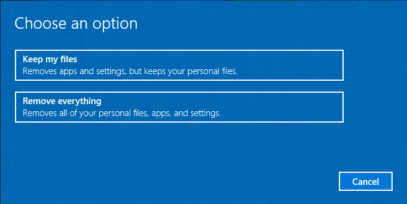

# Push-button reset

This topic is intended for original equipment manufacturers (OEMs) who want to add push-button reset features to their Windows 10 desktop computer manufacturing processes. If you are a user who wants to reset a computer that runs Windows 10, see [Recovery options in Windows 10](http://windows.microsoft.com/en-us/windows-10/windows-10-recovery-options).

Push-button reset is a recovery tool that repairs the OS while preserving data and important customizations. It reduces the need for custom recovery applications by providing users with more recovery options and the ability to fix their own PCs with confidence.

Push-button reset is included in Windows 10 for desktop editions (Home, Pro, Enterprise, and Education), and was introduced in Windows 8.

## What's new for Windows 10

In Windows 10, Version 1703, Push-button reset has been updated to include the folowing change:

-   **Use default config files when using ScanState to capture customizations:**  Starting with Windows 10 Version 1703, you have to use the `/config` option with ScanState when capturing customizations. Use only one of the default configuration files included with the Assessment and Deployment Kit (ADK). These files are:

    - **Config_AppsAndSettings.xml** – Use this configuration file to specify that both desktop applications and OS settings should be captured by the ScanState tool. 
    - **Config_AppsOnly.xml** – Use this configuration file to specify that only desktop applications should be captured by the ScanState tool. Since desktop applications are not always well-defined, this configuration file does not guarantee that all setting related to desktop applications are captured.
    - **Config_SettingsOnly.xml** – Use this configuration file to specify that only OS settings should be captured by the ScanState tool.

     You can modify these configuration files by setting the migrate attribute for specific components to *no*, but components that are already excluded from capture/migration in the default configuration files must remain excluded.

Previous versions of Windows 10 provided the following improvements to push-button reset:

-   **Improved reliability:** When you start push-button reset features from the Settings app, Windows scans the system files in the Windows Component Store for corruptions. If it finds corrupt files and can download replacements through Windows Update, it fixes the problem automatically. Although this increases the overall recovery time, it improves the reliability of the PC.
-   **Recover from failed resets:** In Windows 10, Version 1507, and Windows 10, Version 1511, failures that occur during Reset this PC almost always rendered the PC unbootable/unrecoverable. This feature has been redesigned in the Anniversary Update to support limited rollback if a problem occurs while the PC is in Windows RE.
-   **Recovery options when booted from recovery media:** When the PC is booted from recovery media, the Refresh this PC and Reset this PC features are no longer supported. The only Push-button reset feature available when booted from media is bare metal recovery (i.e. Recover from a drive).
-   **Image-less recovery**: Push-button reset no longer require or support a separate recovery image on a local partition or on media. This significantly reduces the disk space needed to support the features, and makes recovery possible even on devices with limited storage capacity.
-   **Recovers to an updated state**: Push-button reset features now recover the Operating System (OS) and drivers (including device applets that are installed as part of INF-based driver packages) to an updated state. This reduces the amount of time users have to spend reinstalling the OS updates and drivers after performing a recovery.

The Push-button reset user experience continues to offer customization opportunities. Manufacturers can insert custom scripts, install applications or preserve additional data at available extensibility points.

The following Push-button reset features are available to users with Windows 10 PCs and devices:

-   **Refresh your PC** Fixes software problems by reinstalling the OS while preserving the user data, user accounts, and important settings. All other preinstalled customizations are restored to their factory state. In Windows 10, this feature no longer preserves user-acquired Windows apps.
-   **Reset your PC** Prepares the PC for recycling or for transfer of ownership by reinstalling the OS, removing all user accounts and contents (e.g. data, Windows desktop applications, and Universal Windows apps), and restoring preinstalled customizations to their factory state.
-   **Bare metal recovery** Restores the default or preconfigured partition layout on the system disk, and reinstalls the OS and preinstalled customizations from external media.

<table>
<colgroup>
<col width="50%" />
<col width="50%" />
</colgroup>
<thead>
<tr class="header">
<th align="left">Content type</th>
<th align="left">References</th>
</tr>
</thead>
<tbody>
<tr class="odd">
<td align="left">
<strong>Overview</strong>
</td>
<td align="left">
[How push-button reset features work](how-push-button-reset-features-work.md) | [Recovery strategy for common customizations](recovery-strategy-for-common-customizations.md) | [Siloed provisoning packages](siloed-provisioning-packages.md) 
</td>
</tr>
<tr class="even">
<td align="left">
<strong>Hard drive setup</strong>
</td>
<td align="left">
[Hard Drives and Partitions](hard-drives-and-partitions.md) | [UEFI/GPT-based hard drive partitions](configure-uefigpt-based-hard-drive-partitions.md) | [BIOS/MBR-based hard drive partitions](configure-biosmbr-based-hard-drive-partitions.md)
</td>
</tr>
<tr class="odd">
<td align="left">
<strong>Operations</strong>
</td>
<td align="left">
[Deploy push-button reset features using ScanState](deploy-push-button-reset-features.md) | [Bare metal reset/recovery: enable your users to create recovery media](bare-metal-resetrecovery-enable-your-users-to-create-media-and-to-recover-hard-drive-space.md) | [Bare metal reset/recovery: create recovery media while deploying new devices](create-media-to-run-push-button-reset-features-s14.md) | [Add a script to push-button reset features](add-a-script-to-push-button-reset-features.md) | [Create a provisioning package with Windows desktop applications](combine-provisioning-packages-into-a-new-image.md) 
</td>
</tr>
<tr class="even">
<td align="left">
<strong>Configuration files</strong>
</td>
<td align="left">
[ResetConfig XML reference](resetconfig-xml-reference-s14.md)
</td>
</tr>
<tr class="odd">
<td align="left">
<strong>Technologies used by push-button reset</strong>
</td>
<td align="left">
[Windows Recovery Environment](windows-recovery-environment--windows-re--technical-reference.md) | [Windows PE (WinPE)](winpe-intro.md) | [ScanState](deploy-push-button-reset-features.md)
</td>
</tr>
</tbody>
</table>

 

 

 

