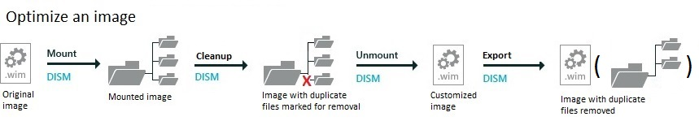

# Lab 13: Shrink your image size

Optimize your Windows image to save space on the PC, to speed up transfers to new devices, and to make it easier to store.

To do this, we'll use DISM tools that check for duplicate files. We'll mark the files for removal. These files won't be removed until we export the image. 

   

## <span id="Mount_the_images"></span>Mount the images

**Step 1: Mount the Windows image**

Use the steps from [Lab 3: Add device drivers (.inf-style)](add-device-drivers.md) to mount the Windows image. The short version:

1.  Open the command line as an administrator (**Start** > type **deployment** > right-click **Deployment and Imaging Tools Environment** > **Run as administrator**.)

2.  Make a backup of the file (`copy "C:\Images\Win10_x64\sources\install.wim" C:\Images\install-backup.wim`)

3.  Mount the image (`md C:\mount\windows`, then `Dism /Mount-Image /ImageFile:"C:\Images\install.wim" /Index:1 /MountDir:"C:\mount\windows" /Optimize`)

## <span id="Optimizing_the_image_part_1"></span><span id="optimizing_the_image_part_1"></span><span id="OPTIMIZING_THE_IMAGE_PART_1"></span>Step 2: Optimizing the image, part 1 (optional)

After adding a language or Windows update package, you can reduce the size of the image size by checking for duplicate files and marking the older versions as superseded.

1.  Optimize the image:

    ``` syntax
    Dism /Image:c:\mount\windows /Cleanup-Image /StartComponentCleanup /ResetBase
    ```

2.  Later, you'll export the image to remove the superseded files.

## <span id="BKMK_SaveImage"></span><span id="bkmk_saveimage"></span><span id="BKMK_SAVEIMAGE"></span>Step 3: Unmount the Windows image


-   Unmount and save the image:

    ``` syntax
    Dism /Unmount-Image /MountDir:C:\mount\windows /Commit
    ```

## <span id="Optimizing_the_image_part_2"></span><span id="optimizing_the_image_part_2"></span><span id="OPTIMIZING_THE_IMAGE_PART_2"></span>Step 4: Optimizing the image, part 2 (optional)

If you've optimized the image, you'll need to export the image in order to see a change in the file size. During the export process, DISM removes files that were superseded.

1.  Export the Windows image into a new image file.

    ``` syntax
    Dism /Export-Image /SourceImageFile:"C:\Images\Win10_x64\sources\install.wim" /SourceIndex:1 /DestinationImageFile:"C:\Images\Win10_x64\sources\install-optimized.wim"
    ```

**Next steps**

*  When you're managing multiple Windows images, you can save even more space by combining them together. Learn how: [Append a Volume Image to an Existing Image Using DISM](append-a-volume-image-to-an-existing-image-using-dism--s14.md).
