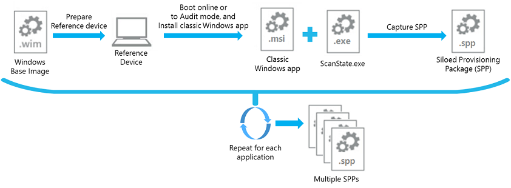
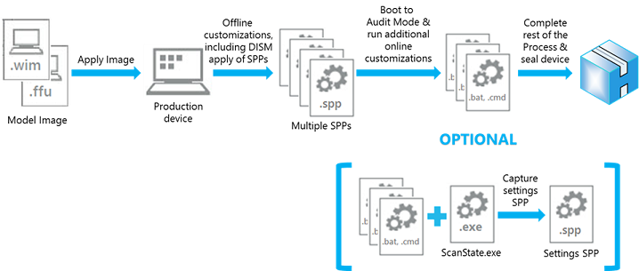
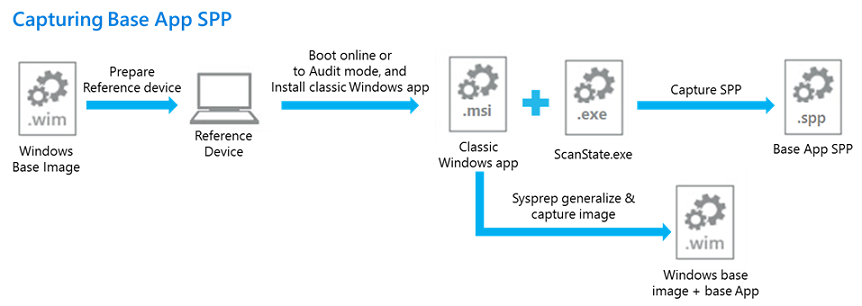
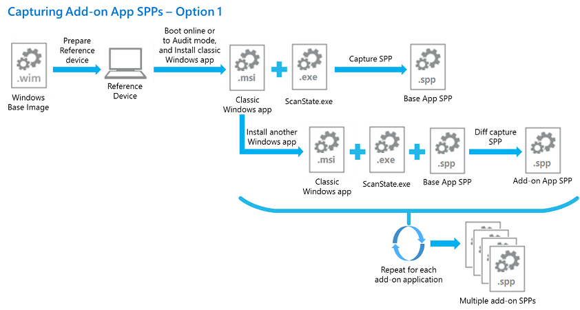
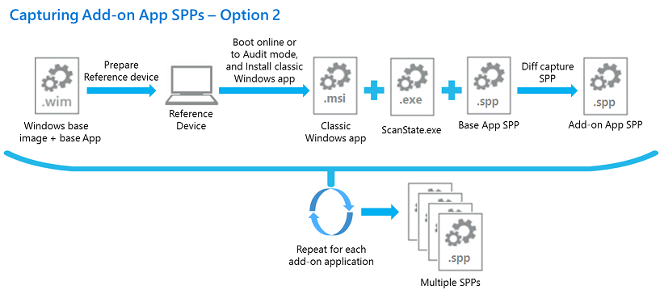
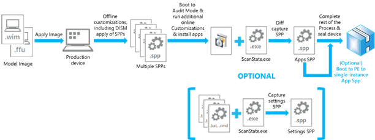

# Siloed provisioning packages

Siloed provisioning packages are a new type of provisioning package that is available for Windows 10, version 1607. Where traditional provisioning packages can capture all classic Windows applications and settings that are installed with a Windows image, a siloed provisioning package can capture classic Windows applications individually, drivers plus applications, settings, or capture add-ons for provisioning packages that were captured previously. This provides more flexibility for the manufacturing process and helps reduce the time required to build Windows-based computers in the factory.

## Performance comparison

The following table shows a comparison between using the Office installer vs using siloed provisioning packages in a typical factory floor process.  When using the siloed provisioning packages to install Office, the base Office en-us package, along with the add-on Office fr-fr and Office de-de packages are captured using the User State Migration Tool (USMT) ScanState.exe utility as a one-time process in the imaging lab.
The data in the following table was derived from a sample run on a VM with Windows 10, version 1607 desktop image.  The actual time savings at the factory floor will vary based on the number and size of applications being installed and the hardware spec of physical devices.  The time savings can be calculated by:

(time to Sysprep & boot to Audit mode + time to install applications + time to capture applications in a PPKG + _<optional_> time to single-instance the PPKG) – (time to apply SPPs + time to Sysprep & boot to Audit mode)

| Phase/Task | Factory process using Office installer | Factory process using siloed provisioning packages |
|------------|----------------------------------------|----------------------------------------------------|
| Apply image to the device | 4 min.                  | 4 min.                                             |
| Install language packs – fr-fr & de-de | 20 min.    | 20 min.                                            |
| Run BCDBoot.exe | negligible                        | negligible                                         |
| Run DISM to apply siloed Office en-us base, Office fr-fr, and Office de-de packages | N/A | 3 min.       |
| Run Sysprep & boot to Audit mode |10 min.           | 19 min.                                            |
| Install Office 2016 en-us, fr-fr, & de-de | 12 min. | N/A                                                |
| Run ScanState to capture Office into provisioning package (for PBR) | 10 min. | N/A                      |
| (Optional – for low disk space) Single-instancing Office files captured in the provisioning package | 7 min. | N/A |
| **Total**  | **56-63 min.**                         | **46 min.**                                        |
| **Overall application install time** |              | **45-65% faster**                                  |
| **Overall E2E deployment time** |                   | **18-30% faster**                                  |

## Work with siloed provisioning packages
To create and deploy siloed provisioning packages, you'll need to copy binaries from various folders in the ADK install location that enable DISM and ScanState to work with SPPs. To facilitate the copy process, a script (CopyDandI.cmd) is included in the Windows ADK when 'Deployment Tools' option is selected at install. Run the script to copy all necessary files to an output folder, for example D:\ADKTools:  

```
<%Windows ADK install root%>\Deployment Tools\CopyDandI.cmd amd64 D:\ADKTools
```

Before you use DISM, you'll need to copy the ADK tools again to a non-removable drive on the destination device. Copying the file to a non-removable location avoids an error associated with installing DISM from removable drives.

```
xcopy D:\ADKTools\ W:\ADKTools\ /s
```
You'll then have to install the tools:

```
W:\ADKTools\amd64\WimMountAdkSetupAmd64.exe /Install /q
```

And then run DISM from that location:
```
W:\ADKTools\amd64\DISM.exe /Apply-SiloedPackage /ImagePath:C:\ /PackagePath:e:\repository\SPP_base.spp /PackagePath:e:\repository\SPP_AddOn1.spp /PackagePath:e:\repository\SPP_AddOn2.spp
```
You'll use ScanState to capture siloed provisioning packages from a booted Windows installation, and DISM to apply SPPs to an applied Windows image from WinPE. 

For the full walkthrough, see [Lab 10: Add desktop applications and settings with siloed provisioning packages](add-desktop-apps-with-spps-sxs.md).

## Create siloed provisioning packages

This section covers how to use ScanState.exe from the Windows desktop to create siloed provisioning packages that contain applications, system settings, and drivers.

**Recommendations:**
- Use a clean Windows installation. This prevents any potentially unwanted settings from being included in the package.

- Use virtual machines with checkpoints to quickly capture SPPs and then revert to a clean Windows installation.

### Configuration files

ScanState for Windows 10, version 1607 can now capture individual Windows desktop applications, and by default only captures components from the Windows namespace. You can choose what gets captured by using /apps by using configuration files. The configuration files that are installed with the Windows Assessment and Deployment Toolkit, along with the User State Migration Tool (USMT), is here:

*<%Windows ADK install root%>*\User State Migration Tool\\*<arch*>\

Customize these files to capture more or fewer components in the siloed provisioning package:

| Configuration file | Usage |
|--------------------|-------|
| Config_AppsOnly.xml | Captures Windows desktop applications and application settings, without other non-relevant settings. <p> This is typically used to create an inventory of applications that can be deployed in the final factory floor process. |
| Config_SettingsOnly.xml | Captures only system settings. <p> This is typically used to create an inventory of applications that can be deployed in the final factory floor process. |
| Config_AppsAndSettingsOnly.xml | Captures both desktop applications and system settings. <p> This can be used either while creating an inventory of applications or as the last step in the factory floor process. |


### Capture Windows desktop applications

The following example uses a configuration file to create a siloed provisioning package that contains Windows desktop applications installed on a reference device:

```syntax
ScanState.exe /apps:-sysdrive /o /v:13 /config:Config_AppsOnly.xml /ppkg e:\repository\SPP_base.spp /l:C:\Scanstate.log
```

Here are what the parameters for the above command mean:

| Parameter  | Description |
| ----------------------------- | ----------------------- |
| /apps  | Tells ScanState to capture desktop applications.  |
| -sysdrive (or +sysdrive) | Tells ScanState to ignore all the folders outside the Windows namespace. For example, if there is a folder c:\Folder, that folder will be captured when running with /apps (or /apps:+sysdrive) but it will not be captured when running with /apps:-sysdrive. </p> Typically you use +sysdrive if you want to capture the entire state of the machine into a single siloed provisioning package; use –sysdrive if you want to capture a single application (or a small group of applications). </p> The Windows namespace is the set of folders created by a Windows installation, typically: <ul><li> %systemdrive%\Users <li> %systemdrive%\ProgramData <li> %systemdrive%\Program Files <li> %systemdrive%\Program Files (x86) <li> %systemdrive%\Windows <li> %systemdrive%\Inetpub |
| /o | Overwrites any existing data in the store. If not specified, ScanState will fail if the store already contains data. |
| /v:13 | Produces a MigLog.xml file that indicates what gets captured. |
| /diff | Used with the /apps command option to capture application add-on components relative to parent applications already captured in siloed provisioning packages. |
| /l:ScanState.log | Tells ScanState where to save log files. When used in combination with `/v:13`, ScanState will save MigLog.xml to the same folder as ScanState.log |

### Capture add-on components

You can use /diff to create a siloed provisioning package that captures components relative to parent applications already captured in a siloed provisioning package. To use /diff, you must specify a SPP to compare the capture against: 

```syntax
ScanState.exe /apps:-sysdrive /o /v:13 /config:Config_AppsOnly.xml /diff:e:\repository\SPP_base.spp /ppkg e:\repository\SPP_AddOn1.spp
```

### Capture system settings

In a scenario where all deployment tasks for a device are complete and no Windows desktop applications have been installed, you can use ScanState to capture system settings that have not been captured in any other SPP by using Config_SettingsOnly.xml. The SPP can be placed directly into the recovery folder during capture for use during Push-Button Reset.

The following example creates a siloed provisioning package of only system settings on a device, and places it into the recovery folder: 
```syntax
ScanState.exe /apps:-appfiles /o /v:13 /config:Config_SettingsOnly.xml /ppkg %systemdrive%\Recovery\Customizations\systemsettings.spp
```

### Capture system settings and Windows desktop applications in the same package

Config_AppsAndSettingsOnly.xml is intended to capture Windows desktop applications and system settings that are installed last-minute, so they can be placed in the recovery folder for use during PBR.
For example, after a device is booted into Audit mode on the factory floor, additional Win32 apps are installed and need to be captured. In this case, you have two options:

- Capture the additional apps and their relevant settings in one .spp using the /diff switch and Config_AppsOnly.xml. Then capture the system settings in a separate .spp using the Config_SettingsOnly.xml.
- Capture the additional apps and the system settings into one SPP using the /diff switch and Config_AppsAndSettings.xml.

Config_AppsAndSettingsOnly.xml can also be used when you want to capture all apps and settings into one .spp file, for use in an imaging lab or on the factory floor. 


### Capture drivers

This section covers how to capture different types of drivers with ScanState.

#### Types of drivers

ScanState for Windows 10, version 1607 captures 3rd-party drivers when you use the /drivers switch. By default, ScanState.exe captures all 3rd party drivers, but can also capture a subset of drivers based on .inf name, manufacturer, or class. Some driver types, like filter drivers, may not be captured when using /drivers. In this case, run Scanstate.exe with using /apps. 
The /drivers switch can also be used in combination with /apps in situations where you want to capture drivers and their associated management software, such as for printers or video cards.

**Hardware drivers**

To capture drivers that are installed using an .inf file, use the /drivers switch. It’s not necessary to use the /apps switch.

To capture drivers that are installed using another method (for example, a setup.exe file), use both /drivers and /apps. This ensures that both the driver package and all Windows desktop applications and settings created by setup for that driver are captured at the same time. To filter out other driver packages, use the arguments that are in combination with /drivers.


**Other drivers**

Drivers such as filter drivers are not captured using the /drivers switch. To capture these types of drivers, use only the /apps switch.

#### Capture drivers by using patterns

Because ScanState.exe captures all 3rd-party drivers by default when using `ScanState.exe /drivers`, if you want to capture only certain drivers, you have to use patterns to narrow the number of captured drivers. ScanState processes commands left to right, so the last pattern specified in a command will take precedence over previous patterns in the same command. For example, if you want to only capture a specific set of drivers, you would first exclude all drivers from capture, and then include specific drivers. Since the arguments are processed in order, the drivers specified after the exclusion of all drivers will be captured.

Here are the patterns you can use to select which drivers will be captured:

| Pattern | Description |
|---------|-------------|
| +n | Selects drivers to be included based on inf name |
| -n | Selects drivers to be excluded based on inf name |
| +p | Selects drivers to be included based on publisher name |
| -p | Selects drivers to be excluded based on publisher name |
| +c | Selects drivers to be included based on class name or class GUID |
| -c | Selects drivers to be excluded based on class name or class GUID |

The following example uses a pattern to create a siloed provisioning package that contains drivers of a specific class.

```
ScanState.exe /drivers:-n:* /drivers:+c:{4d36e96f-e325-11ce-bfc1-08002be10318} /ppkg e:\repository\drivers.spp
```

Here are what the parameters for the above command mean:

| Parameter | Description |
|---------|-------------|
| /drivers | Tells ScanState to capture 3rd party drivers. |
| -n:* | Removes all drivers from capture. |
| +c:{4d36e96f-e325-11ce-bfc1-08002be10318} | Adds drivers of a particular class back into the capture. |
| /ppkg | Specifies that the output will be a ppkg. This is required for use with /drivers.| 

### Capture Applications and Drivers in the same SPP

You can use the /apps and /drivers switches in the same command to create SPPs that contain both applications and drivers.

The following is an example of capturing a siloed provisioning package that contains Windows desktop applications and drivers with only with a specific class GUID.

```
ScanState.exe /drivers:-n:* /drivers:+c:{4d36e96f-e325-11ce-bfc1-08002be10318} /apps:-sysdrive /o /v:13 /config:Config_AppsOnly.xml /ppkg e:\repository\apps_and_drivers.spp
```


## Apply siloed provisioning packages

 This section covers how to use DISM from WinPE to apply siloed provisioning packages. 
 
 DISM supports applying siloed provisioning packages to a Windows image through a new DISM provider, which is only available through the Windows ADK. You can get this version of DISM by using CopyDandI.cmd.

### Limitations

The functionality for applying siloed provisioning packages using DISM is limited to support the following scenarios:

- The DISM SiloedPackageProvider is not included in the Windows image, nor is it included in Windows PE, version 1607.  The Windows ADK version of DISM must be installed on the servicing host, and then launch DISM.exe from the Windows ADK installed location.  On a host that is not supported by Windows ADK installer, such as Windows PE, the required binaries can be copied to the host using the CopyDandI.cmd script in *<%Windows ADK install root%>\Deployment Tools*.
- DISM only supports applying siloed provisioning packages to a Windows image that has been applied at the root of a disk volume on a device, e.g. “C:\”.  It does not support applying siloed provisioning packages to a Windows image that is mounted for offline servicing.  The typical scenario is booting the device to Windows PE, and running the Windows ADK version of DISM in Windows PE to apply siloed provisioning packages after the Windows image has been applied to the device.
- The DISM command to apply siloed provisioning packages to a Windows image (DISM Apply-SiloedPackage) can be run only once.  All of the siloed provisioning packages to be applied to the Windows image must be specified in the right order in a single command operation. The order of the installation will be preserved, so the packages can be restored in the same order during PBR.
- If additional siloed provisioning packages need to be applied to a Windows desktop image that has already gone through the entire deployment process with using DISM to apply a set of siloed provisioning packages, the image can be Sysprep generalized and captured as a new model image.  DISM can then be run again to apply more siloed provisioning packages when this new model image is deployed onto other devices.
- Siloed provisioning packages must be applied to the same operating system architecture that they were captured on. For example, capturing an app on an x86 operating system in an .spp and applying it to an x64 operating system is not supported.  
- Siloed provisioning packages can be applied to other editions of Windows. For example, an application captured on Windows 10 Enterprise can be applied to Windows 10 Pro.
- Windows 10, Version 1607, does not support applying siloed provisioning packages on a generalized image that is set to boot into Audit mode. If booting into Audit mode is required, use Unattend.xml to reseal to Audit mode.

### Use DISM to apply siloed provisioning packages

The following example uses DISM that is created by CopyDandI.cmd to apply a base SPP, as well as two add-on SPPs:

```syntax
DISM.exe /Apply-SiloedPackage /ImagePath:C:\ /PackagePath:e:\repository\BaseSPP.spp /PackagePath:e:\repository\SPP_AddOn1.spp /PackagePath:e:\repository\SPP_AddOn2.spp
```
For syntax, see [DISM Image Management Command-Line Options](dism-image-management-command-line-options-s14.md), or run ``` DISM.exe /Apply-SiloedPackage /? ``` from the target location of CopyDandI.cmd.

All of the siloed provisioning packages applied by DISM will be placed in %systemdrive%\Recovery\Customizations folder.  

### Saving drive space: single-instancing is automatic on compact OS

When DISM applies siloed provisioning packages to the OS image that has been applied as Compact OS on a device, by default the packages will be applied with application files single-instanced (using WIMBoot v1 style) on the device.

To single-instance your siloed provisioning packages on devices without Compact OS image, use DISM /Apply-CustomDataImage while the device is booted into Windows PE.

```syntax
DISM.exe /ImagePath:C:\ /Apply-CustomDataImage /CustomDataImage:C:\Recovery\Customizations\myApp.spp /SingleInstance 
```

The /Apply-SiloedPackage command works with both traditional provisioning packages and siloed provisioning packages (.spp).
-If you create provisioning packages in audit mode, you can choose to single-instance contents by using the DISM /Apply-CustomDataImage /SingleInstance command. To learn more see Lab 1g: Make changes from Windows (audit mode).

### Push-button reset

When using ScanState to capture traditional provisioning packages, only one package with all the applications and system settings can be placed in %systemdrive%\Recovery\Customizations folder.  During push-button reset (PBR), the single provisioning package is processed to restore the applications and system settings.

Beginning with Windows 10, version 1607, applications can be captured in multiple siloed provisioning packages and system settings can also be captured in a separate siloed provisioning package. As a result, PBR is enhanced to allow multiple siloed provisioning packages to be applied, in the preserved order in which they were applied using Dism /Apply-Siloed Package. The packages can then be queued and processed in the right order during PBR to restore the applications and system settings captured in these packages. If the packages were applied using single-instancing, it will be honored when PBR restores them to the device. 

Single-instancing can occur automatically if Compact OS is used, or manually. 

- If you use WinPE, then applying an image as Compact OS, then apply SPPs to it, Windows automatically single-instances the contents of the package. To learn more, see [Lab 10: Add desktop applications and settings with siloed provisioning packages (SPPs)](add-desktop-apps-with-spps-sxs.md)
- If you create provisioning packages in audit mode, you can choose to single-instance the contents by using the DISM /Apply-CustomDataImage /SingleInstance command. To learn more, see  [Lab 9: Make changes from Windows (audit mode)](prepare-a-snapshot-of-the-pc-generalize-and-capture-windows-images-blue-sxs.md).

## Scenarios for using siloed provisioning packages

This section covers scenarios using siloed provisioning packages. 

### Capturing and applying independent applications

A Microsoft partner can capture siloed provisioning packages of individual classic Windows applications while in the imaging lab, and then install any combination of siloed provisioning packages in a customized order at factory floor. For example, a partner could capture siloed provisioning packages for a PDF reader application and an antivirus program, and then install those program packages on a specific device model at factory floor.



1.	Clean install Windows 10, version 1607 on a reference device.
2.	At the desktop, install antivirus software.
3.	Run ScanState.exe to capture an antivirus software siloed provisioning package.
4.	Wipe and clean install the reference device
5.	Repeat steps 2-4 for the PDF reader application.

Alternatively, the siloed provisioning packages can be captured using a VM instead of a physical device:

1.	Create a VM and boot it online using a Windows 10, version 1607 VHD/VHDX image.
2.	Create a checkpoint of the clean OS installation on the VM.
3.	At the desktop, install the antivirus software.
4.	Run ScanState.exe to capture an antivirus software siloed provisioning package.
5.	Revert the VM to the checkpoint.
6.	At the desktop, install the PDF reader application.
7.	Run ScanState.exe to capture the PDF reader application siloed provisioning package.



1.	On the target device, boot to Windows PE, and apply the Windows 10, version 1607, desktop image.
2.	While in Windows PE, run DISM /Apply-SiloedPackage command with the PDF reader and antivirus program packages to apply the application files in the packages onto the applied desktop image.
3.	Complete the rest of the offline customization tasks.
4.	Go through first boot and run through specialize to get to Audit mode.
5.	Complete the online customization/configuration tasks.
6.	(Optional) While in Audit mode, run ScanState to capture only the system settings into siloed provisioning package and place it in the recovery folder.
7.	Complete the rest of the factory floor tasks and shutdown/seal the product.

### Capturing and applying applications with dependencies 

A Microsoft partner can use diff capture support to generate supplemental (or add-on) siloed provisioning packages that are relevant to a previously captured parent siloed provisioning package.  The siloed provisioning packages can then be installed on devices at factory floor, with parent package first followed by combinations of supplemental packages in the customized order. 

For example. you could capture the antivirus program base siloed provisioning package, and then diff capture an antivirus program patch (MSP) siloed provisioning packages using the base package as the parent.  At the factory floor, the antivirus program base package and a selection of patch packages, specified in the desired order, can then be installed on a specific model device.







1.	Clean install Windows 10, version 1607 on a reference device.
2.	At the desktop, install the antivirus application.
3.	Sysprep generalize and capture the OS image from the reference device.
4.	Run ScanState.exe to capture your antivirus base siloed provisioning package.
5.	Install antivirus software program patches.
6.	Run ScanState.exe to diff capture the antivirus software program patches in a siloed provisioning package using the antivirus base package.
7.	Either continue using the diff switch with the already captured base and program patches packages to capture another antivirus program patch siloed provisioning package:
    1. Install additional antivirus software program patches.
    2. Run ScanState.exe to diff capture the additional program patches siloed provisioning package using antivirus base package and the first program patches SPPs.
8. Or wipe and start clean again on the reference device to diff capture another antivirus softare siloed provisioning package:
    1. Wipe and clean install the reference device using the OS image captured in step 3.
    2. At the desktop, install antivirus software.
    3. Run ScanState.exe to diff capture antivirus software program patches siloed provisioning package using the antivirus base package captured in step 4.
9. Repeat either step 7 or 8 to capture any additional antivirus program patch siloed provisioning packages.

Alternatively, the siloed provisioning packages can be captured using VM instead of a physical device.  When using a VM:

1.	Create a VM and boot it online using a Windows 10, version 1607 VHD/VHDX image.
2.	At the desktop, install the antivirus application.
3.	Create a checkpoint of the OS installation with the antivirus software on the VM.
4.	Run ScanState.exe to capture your antivirus base siloed provisioning package.
5.	Install antivirus software program patches.
6.	Run ScanState.exe to diff capture the antivirus software program patches in a siloed provisioning package using the antivirus base package.
7.	Either continue using diff switch with the already captured base and language packages to capture another Office 2016 language siloed provisioning package:
    1. Install additional antivirus software program patches.
    2. Run ScanState.exe to diff capture the additional program patches siloed provisioning package using antivirus base package and the first program patches SPPs.
8.	Or restart the VM to diff capture another antivirus software program patch siloed provisioning package:
    1. Revert the VM to the checkpoint generated in step 3.
    2. At the desktop, install antivirus softare.
    3. Run ScanState.exe to diff capture antivirus software program patches siloed provisioning package using the antivirus base package captured in step 4.
9.	Repeat either step 7 or 8 to capture any additional antivirus program patch siloed provisioning packages.

Siloed provisioning packages can also capture applications with dependencies. For example, to capture multiple apps that depend on .NET Framework:

1.	Create a VM and boot it online using a Window 10, version 1607 VHD/VHDX image.
2.	Install .NET Framework. 
3.	Create a checkpoint of the of the OS installation with .NET Framework.
4.	Capture a base .spp, for example, DotNet.spp.
5.	Install App1, capture it as App1.spp, using /diff:DotNet.spp.
6.	Revert the VM to the checkpoint created in Step 3.
7.	Install App2, capture it as App2.spp, using /diff:DotNet.spp.

To preserve the dependency, apply the packages in this order:

- DotNet.spp, App1.spp, App2.spp

-or-

- DotNet.spp, App2.spp, App1.spp

The important point is DotNet.spp must be applied first. 

### Capturing an Application with associated device drivers

A Microsoft partner can capture a siloed provisioning package of individual classic Windows applications that have hardware drivers associated with them while in the imaging lab, and then install any combination of siloed provisioning packages in a customized order at factory floor. For example, a partner could capture a siloed provisioning package for Microsoft Mouse and Keyboard Center that contains both application and driver files.
 
1.	Clean install Windows 10, version 1607 on a reference device.
2.	At the desktop, install Microsoft Mouse and Keyboard Center.
3.	Run ScanState.exe to capture Mouse and Keyboard Center siloed provisioning package, using both the /apps and /drivers switches.
4.	Wipe and clean install the reference device 
5.	On the target device, boot to Windows PE, and apply the Windows 10, version 1607, desktop image.
6.	While in Windows PE, run DISM /Apply-SiloedPackage command with the Microsoft Mouse and Keyboard Center package to apply the application and driver files in the packages onto the applied desktop image.
7.	Complete the rest of the offline customization tasks.
8.	Go through first boot and run through specialize to get to Audit mode.
9.	Complete the online customization/configuration tasks.
10.	(Optional) While in Audit mode, run ScanState to capture only the system settings into siloed provisioning package and place it in the recovery folder.
11.	Complete the rest of the factory floor tasks and shutdown/reseal the product.


### Capturing and applying applications for BTO model

In the BTO model, last minute customizations on the factory floor could include installing additional classic Windows applications on to a customized image.  If any classic Windows applications were not captured in siloed provisioning packages in the imaging lab, the factory floor process will then include the tasks shown in the following diagram:



1.	On the target device, boot to Windows PE, and apply Windows 10, version 1607 desktop image.
2.	While in Windows PE, run DISM /Apply-SiloedPackage command specifying all the siloed provisioning packages to apply the application files in the packages onto the applied desktop image.
3.	Complete the rest of the offline customization tasks.
4.	Go through first boot and run through specialize to get to Audit mode.
5.	Online install of classic Windows applications in Audit mode.
6.	Complete the online customization/configuration tasks.
7.	Run ScanState.exe to diff capture the applications installed in step 5 into a single siloed provisioning package, using the siloed provisioning packages for the applications already installed in the base model image as a reference.
8.	(Optional) Run ScanState to capture only the system settings into siloed provisioning package and place it in the recovery folder.
9.	(Optional) Boot the device to Windows PE, and run the DISM command to single-instance the application files in the siloed provisioning package captured in step 7.
10.	Complete the rest of the factory floor tasks and shutdown/seal the product.

**Preferred process guidelines for BTO model**: As described in the preceding steps, the diff capture support provides flexibility to allow installing a classic Windows applications at the factory floor as last minute customizations. However, the diff capture operation may take some time to complete, depending on the number and the size of the siloed provisioning packages it needs to diff against. There is also overhead cost for the other steps in the process. Therefore, the preferred guideline for installing a classic Windows application in the BTO model is to incur the onetime cost of capturing the siloed provisioning packages for these applications in the imaging lab. They can then be applied on the factory floor as needed for last-minute customizations.   

## Related topics

[WinPE: Create USB bootable drive](winpe-create-usb-bootable-drive.md)

[Lab 9: Make changes from Windows (audit mode)](prepare-a-snapshot-of-the-pc-generalize-and-capture-windows-images-blue-sxs.md)

[Lab 10: Add desktop applications and settings with siloed provisioning packages (SPPs)](add-desktop-apps-with-spps-sxs.md)

