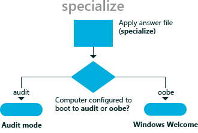

# specialize

During the **specialize** configuration pass of Windows® Setup, computer-specific information for the image is applied. For example, you can configure network settings, international settings, and domain information.

The **specialize** configuration pass is used together with the [generalize](generalize.md) configuration pass. The generalize pass is used to create a Windows reference image that can be used throughout an organization. From this basic Windows reference image, you can add additional customizations that apply to different divisions in an organization or to different installations of Windows. Any method of moving or copying a Windows image to a new computer must be prepared with the **sysprep /generalize** command. For more information, see [Sysprep (System Preparation) Overview](sysprep--system-preparation--overview.md) and [Sysprep Command-Line Options](sysprep-command-line-options.md).

The following diagram illustrates how the **specialize** configuration pass is used to apply these specific customizations.

For example, during the **specialize** configuration pass, you can specify different home pages in Internet Explorer® for different departments or branches in your business. This setting will then override the default home page.

## Related topics

[How Configuration Passes Work](how-configuration-passes-work.md)

[auditSystem](auditsystem.md)

[auditUser](audituser.md)

[generalize](generalize.md)

[offlineServicing](offlineservicing.md)

[oobeSystem](oobesystem.md)

[windowsPE](windowspe.md)

 

 

