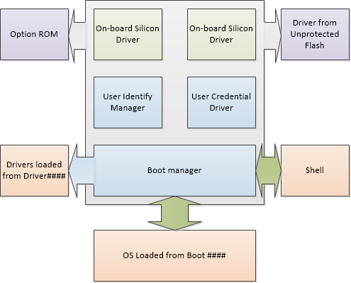

# UEFI Validation Option ROM Guidance


Vishal Manan, Architect, OEM Consulting, <vmanan@microsoft.com>

Jeremiah Cox, Sr. SDET, Windows Security & Identity Team, [jerecox@microsoft.com](mailto:%20jerecox@microsoft.com)

Tony Lin, Engineering Service Engineer, TW-WIN Plan Ecosystem, [tolin@microsoft.com](mailto:%20tolin@microsoft.com)

Version 1.3

This document helps OEMs and ODMs validate that their firmware checks the signatures of its option ROM as part of the Secure Boot chain of trust.

This guide assumes you know the fundamentals of UEFI, basic understanding of Secure Boot (Chapters 1, 2, 13, 20 and 27 of the UEFI specification), and PKI security model.

On this page:

-   [Introduction](#introduction)

-   [1. UEFI and Option ROMs](#uefiandoptionroms)

-   [2. Problem statement](#problemstatement)

-   [3. Who is affected?](#whoisaffected)

-   [4. How to test for it?](#howtotestforit)

-   [5. How to fix it](#howtofixit)

-   [6. Resources](#resources)

-   [Appendix A: Alternate approach to testing using unsigned option ROM drivers](#alternateapproachtotestingusingunsignedoptionromdrivers)

-   [Appendix B: Scripts for enabling Secure Boot with NULL db](#scriptsforenablingsecurebootwithnulldb)

## <span id="Introduction"></span><span id="introduction"></span><span id="INTRODUCTION"></span>Introduction


Option ROMs (or OpROMs) are firmware run by the PC BIOS during platform initialization. They are usually stored on a plug-in card, though they can reside on the system board.

Devices that typically require option ROMs are video cards, network adapters, and storage drivers for RAID modules. These option ROMs also typically provide firmware drivers to the PC.

They include a variety of types of firmware drivers, including legacy PC-AT, Open Firmware, and EFI option ROMs. Examples of firmware drivers include Video BIOS on video cards, PXE boot drivers for Ethernet adapters, and storage drivers on RAID controllers. These devices typically have Option ROMs that provide firmware drivers.

The Unified Extensible Firmware Interface (UEFI) has support for Legacy mode option ROMs.

As per latest UEFI specification (currently at 2.3.1 Errata C – section 2.5.1.2), ISA (legacy) option ROMs are not a part of the UEFI Specification. For the purposes of this discussion, only PCI-based UEFI-compatible option ROMs will be considered.

Option ROMs can be used when it's not be possible to embed a device's firmware in the PC firmware. When the option ROM carries the driver, the IHV can leverage that driver, and keep the driver and device in one place.

This document talks about why you need to validate option ROMs and shows some techniques of doing it.

### <span id="Supporting_both_UEFI_BIOS_and_Legacy_BIOS"></span><span id="supporting_both_uefi_bios_and_legacy_bios"></span><span id="SUPPORTING_BOTH_UEFI_BIOS_AND_LEGACY_BIOS"></span>Supporting both UEFI BIOS and Legacy BIOS

Many manufacturers create devices that include option ROMs and firmware for many types of PCs. Common combos include:

-   Legacy ROM Only

-   UEFI Native OpROM

-   Legacy ROM + UEFI EBC OpROM

-   Legacy ROM + UEFI x64 OpROM

-   Legacy ROM + UEFI x64 + UEFI IA32

-   Legacy ROM + UEFI x64 + UEFI IA32 + UEFI EBC OpROM

UEFI BIOS can load and execute legacy firmware drivers when a Compatibility Support Module (CSM) is enabled. Note that when Secure Boot is enabled, execution of the Compatibility Support Module and legacy ROMs is prohibited because legacy firmware drivers do not support authentication.If the Option ROM format in the BIOS configuration is set to legacy ROM, it will always use the legacy ROM on the device.

If the Option ROM format is set to **UEFI Compatible**, it will use the newer EFI ROM if one is present and the legacy ROM if one is not.

UEFI drivers are necessary for many of the new firmware level security features as well as to enable UEFI boot sequences. For example, installing Windows from an optical disk which is attached to a non-UEFI compatible storage controller is not possible when a system is booting in UEFI mode when Secure Boot is enabled.

## <span id="UEFIandOptionROMs"></span><span id="uefiandoptionroms"></span><span id="UEFIANDOPTIONROMS"></span>1. UEFI and Option ROMs




*Figure 2: UEFI Driver Security Consideration, Source: UEFI 2.3.1 Errata C*

**From Section 31.1.4 from the UEFI 2.3.1 Errata C:**

Since the UEFI user profile details a number of security-related privileges, it is important that the User Identity Manager and User Credential Providers and the environment in which they execute are trusted.

This includes:

-   Protecting the storage area where these drivers are stored.

-   Protecting the means by which these drivers are selected.

-   Protecting the execution environment of these drivers from unverified drivers.

-   The data structures used by these drivers should not be corrupted by unauthorized drivers while they are still being used.

Components like User Identity Manager, the User Credential drivers and on board drivers maybe located in a secure location like write-protected flash drive which is trusted by platform policy.

Some other drivers may reside on an unprotected storage locations like option ROMs or a hard drive partition and may be easily replaced. These drivers must be verified.

For example, either the default platform policy must successfully be able to verify drivers listed in the Driver\#\#\#\# load options, or else the user must be identified prior to processing these drivers. Otherwise, the driver execution should be deferred. If the user profile is changed through a subsequent call to Identify () or through dynamic authentication, the Driver\#\#\#\# options may not be processed again.

The user profile database is closed using different UEFI signal events based on whether it can be protected.

UEFI Drivers & UEFI option ROMs will only be executed for devices in the boot path.

PCI spec allows multiple option ROM images on the same device. These option ROMS could be Legacy x86 & UEFI. UEFI firmware sets platform policy for picking the option ROM. That can make the optional adapter's ROM execute as its own control device.

The firmware verifies signatures during BDS and DXE phases. The sequence of events is as follows:

1.  Initialize PCI and derivative Buses

2.  Probe PCI Devices for option ROMs

3.  Found option ROMs are mapped in memory

4.  DXE phase loads any UEFI drivers in ROMs

UEFI option ROMs can be anywhere in memory. The default is to let the ROM on the card manage the device. UEFI allows platform to control policy around what option ROM controls what device using EFI\_PLATFORM\_DRIVER\_OVERRIDE. UEFI supports option ROMs to register a configuration interface.

On a PC with Secure Boot enabled, option ROM drivers pose a security threat if they are not signed or not validated. Signature validation for option ROMs is a WHCK requirement. The same is true while servicing option ROMs to make sure that the update is validated prior to installation.

From the UEFI 2.3.1 Eratta C specification:

9. Mandatory. **Signed Firmware Code Integrity Check**. Firmware that is installed by the OEM and is either read-only or protected by a secure firmware update process, as defined above, may be considered protected. **Systems shall verify that all unprotected firmware components, UEFI drivers, and UEFI applications are sigend using minimum RSA-2048 with SHA-256 (MD5 and SHA-1 are prohibited)**, and verify that UEFI applications and drivers that are not signed as per these requirements will fail to run (this is the default policy for acceptable signature algorithms). If an images signature is not found in the authorized database, or is found in the forbidden database, the image must not be started, and instead, information about it shall be placed in the Image Execution Information Table.11. Mandatory. **Verify Signature of all Boot Apps and Boot Loaders.** Upon power-on, the platform shall start executing boot firmware and use public key cryptography as per algorithm policy to verify the signatures of all images in the boot sequence up-to and including the Windows Boot Manager.

## <span id="ProblemStatement"></span><span id="problemstatement"></span><span id="PROBLEMSTATEMENT"></span>2. Problem statement


Some builds of Secure Boot-enabled UEFI BIOS, including Tiano Core, did not by default authenticate UEFI option ROMs because signed UEFI option ROMs were not available during Secure Boot development. This exposes an attack surface/vulnerability in UEFI Secure Boot.

### <span id="2.1._Vulnerability"></span><span id="2.1._vulnerability"></span><span id="2.1._VULNERABILITY"></span>2.1. Vulnerability

This vulnerability was still present in EDK II and UDK2010 as of August 2013. The source maintainers are aware of the issue and a bug is filed. Any firmware derived from EDK II and UDK2010 should verify how Option ROM verification is managed. Option ROM verification behavior is controlled by a PCD value `PcdOptionRomImageVerificationPolicy` in the EDK II SecurityPkg package.

The source code for the TianoCore vulnerability is SecurityPkg\\SecurityPkg.dec file:

``` syntax
## Pcd for OptionRom.
  #  Image verification policy settings:
  #  ALWAYS_EXECUTE                         0x00000000
  #  NEVER_EXECUTE                          0x00000001
  #  ALLOW_EXECUTE_ON_SECURITY_VIOLATION    0x00000002
  #  DEFER_EXECUTE_ON_SECURITY_VIOLATION    0x00000003
  #  DENY_EXECUTE_ON_SECURITY_VIOLATION     0x00000004
  #  QUERY_USER_ON_SECURITY_VIOLATION       0x00000005
gEfiSecurityPkgTokenSpaceGuid.PcdOptionRomImageVerificationPolicy|0x00|UINT32|0x00000001
```

The default value (0x00) is ALWAYS\_EXECUTE, which does not properly perform verification of signed drivers in Option ROMs for add-in peripherals. This is not an ideal value for any system implementing UEFI Secure Boot functionality.

Recommended Value (Best Security): `DENY_EXECUTE_ON_SECURITY_VIOLATION (0x04)`

Recommended Value (Best Flexibility): `QUERY_USER_ON_SECURITY_VIOLATION (0x05)`

In EDK II & UDK2010, proper coding practice uses an override mechanism to modify PCD values for platform firmware. Therefore, the value for `PcdOptionRomImageVerificationPolicy` should not be changed in `SecurityPkg\SecurityPkg.dec`. The override value should be set in the platform’s DSC file. An example is shown below using Nt32Pkg\\Nt32Pkg.dsc:

``` syntax
[PcdsFixedAtBuild]
gEfiSecurityPkgTokenSpaceGuid.PcdOptionRomImageVerificationPolicy|0x04
```

The PCD override should be placed under the `[PcdsFixedAtBuild]` section of the DSC file. The exact mechanism for overriding parameters may differ depending on BIOS vendor tools.

**Note**  
This vulnerability may exist in early implementations of UEFI Secure Boot BIOS from independent BIOS vendors. Contact your BIOS vendor to determine if your version may be impacted.

 

## <span id="WhoIsAffected"></span><span id="whoisaffected"></span><span id="WHOISAFFECTED"></span>3. Who is affected?


A UEFI PC which implements Secure Boot and has a UEFI option ROM driver which is not signed. Furthermore, the firmware for compatibility to get the existing cards working may have a security vulnerability which doesn’t verify option ROMs.

**Laptops, netbooks, ultrabooks, & tablets: most are not affected**. Option ROMs are typically present on backplane buses such as PCI/e, ISA, and their derivatives (ExpressCard, miniPCI, CardBus, PCCard, LPC, ThunderBolt etc). If a laptop has none of these exposed, then its attack surface is greatly reduced. Moreover, it is likely UEFI drivers for onboard laptop components are integrated into the core BIOS firmware volume, not located on a separate option ROM. Thus most laptops are not at risk. Also, when Legacy option ROMs are disabled, it looks like UEFI only supports PCI-based option ROMs.

However, if you have a desktop, motherboard or a server which has a UEFI BIOS and implement Secure Boot, you may be affected. On a server’s dedicated RAID controller, or add-in storage controller for SATA, FC etc. or Ethernet PCIe network cards may have option ROMs. Add-in controllers supporting a wide array of functionality on servers are common so this especially applies to the server space.

This can potentially affect 32-bit and 64-bit PCs, both class 2 and class 3.

If a Secure Boot platform supports option ROMs from devices not permanently attached to the platform and it supports the ability to authenticate those option ROMs, then it must support the option ROM validation methods described in Network Protocols — UDP and MTFTP and the authenticated EFI variables described in UEFI specification 2.3.1 Errata C Section 7.2.

## <span id="HowToTestForIt"></span><span id="howtotestforit"></span><span id="HOWTOTESTFORIT"></span>4. How to test for it?


If you are developing the firmware and it is based on Tiano Core please check for vulnerability mentioned in the section 2.1. If you are using another IBV’s firmware please check with them. Or you could do the test it yourself as mentioned below.

You will need the following:

-   PC under test with UEFI firmware

-   PCI device with Option ROM on the PC under test (like a video card)

-   Make sure Secure Boot is enabled

Steps for testing:

1.  Insert a UEFI add on PCI card with UEFI Option ROM to the PC under test.

    If you are using a PCI video card for testing, hookup an external monitor.

2.  Enable Secure Boot with the settings below:

    -   PK: Your PK or self-signed Test PK

    -   KEK: MS KEK, PK-signed Fabrikam test KEK or another KEK

    -   DB: NULL. (This must be NULL.)

    -   DBX: NULL.

    -   SecureBoot: The UEFI variable should be set to true

3.  Reboot the PC

4.  Expect the following result:

    -   If the UEFI firmware is implemented correctly, the UEFI option ROM driver wouldn’t load since the presence of an option ROM will make the firmware check the “Db” for a certificate. Since the “Db” is NULL the UEFI driver will fail to load. For example, if you are using the video card to test, you will see that nothing shows up on display.

    -   If the firmware isn’t implemented correctly, UEFI driver will load from the option ROM since the firmware doesn’t check for signatures in “Db”. For example, if you are using the video card for test, you will see that the monitor hooked to the option ROM card will have display.

**Note**  
It doesn’t matter if the UEFI option ROM driver is signed or not, the option ROM will not load when DB is null and SB is enabled (PK and KEK are enrolled).

 

Please refer to sample scripts available in the WHCK for generating the PK and KEK. You can download the scripts from here: <http://go.microsoft.com/fwlink/?LinkId=321292> . Appendix B has sample scripts and more details.

You can also reference Appendix A for another approach to performing the above test. This approach doesn’t require setting the DB to Null but needs an unsigned UEFI option ROM driver from the IHV.

## <span id="HowToFixIt"></span><span id="howtofixit"></span><span id="HOWTOFIXIT"></span>5. How to fix it


If the above test fails, work with your IBV to acquire the necessary versions and configure them to validate option ROMs. Make sure that the firmware passes the test. For PCs which have shipped you will need to do a secure firmware update. Please refer to [NIST publication 800-147](http://go.microsoft.com/fwlink/p/?linkid=321186) and/or see [Windows 8.1 Secure Boot Key Creation and Management Guidance](windows-secure-boot-key-creation-and-management-guidance.md).

You can test the PC and leverage Windows HCK as a test tool (not a certification tool) for testing the secure firmware update.

### <span id="5.1._Signing_the_driver"></span><span id="5.1._signing_the_driver"></span><span id="5.1._SIGNING_THE_DRIVER"></span>5.1. Signing the driver

In case you find that you may have unsigned drivers on UEFI option ROMs please read below on how to fix that.

Sign each option ROM driver individually. That will break the format of the PCI Option ROM. You only need to sign the UEFI driver before creating the combined Option ROM.

Before inserting the UEFI driver in the OpROM, sign the UEFI image and test it with Secure Boot ON & OFF at the UEFI Shell (load/unload the driver file). Then put the signed driver into the combined option ROM.

You can direct your IHV to Microsoft SysDev center to get their UEFI option ROMs signed through a service available through SysDev center.

### <span id="5.2._Validation_of_update"></span><span id="5.2._validation_of_update"></span><span id="5.2._VALIDATION_OF_UPDATE"></span>5.2. Validation of update

Run the test you mentioned above to verify that the vulnerability does not exist. Use the HCK tests to ensure that there are no functional regressions.

## <span id="Resources"></span><span id="resources"></span><span id="RESOURCES"></span>6. Resources


-   UEFI Platform Initialization Specification, Volume 5 Standards, 1.2.1 Errata A: <http://go.microsoft.com/fwlink/p/?linkid=220187>

-   Relevant info from UEFI 2.3.1 spec:

    -   2.5.1: Legacy Option ROM Issues

    -   10: Protocols –UEFI Driver Model

    -   13.4.2: PCI Option ROMs

    -   20: EFI Byte Code Virtual Machine

    -   28: HII Overview

    -   29: HII Protocols

    -   30: HII Configuration Processing and Browser Protocol

-   [UEFI Forum Learning Center](http://go.microsoft.com/fwlink/p/?LinkId=321289)

-   [UEFI IHV resources @ intel.com](http://go.microsoft.com/fwlink/?LinkId=321290)

-   Use the [TianoCore edk2-devel mailing list](http://go.microsoft.com/fwlink/?LinkId=398276) for support from other UEFI developers

-   TechNet: [Best Practices for Enterprise Security: Security strategies](http://go.microsoft.com/fwlink/p/?linkid=321288)

-   [UEFI specification](http://go.microsoft.com/fwlink/p/?LinkID=220187) errata C

-   [Trusted Computing Group](http://go.microsoft.com/fwlink/p/?LinkID=78378)

-   [Tianocore UEFI Development Kit](http://go.microsoft.com/fwlink/?LinkId=398277)

-   [UEFI Firmware](uefi-firmware.md)

-   [Intel Press: Beyond BIOS 2nd Edition](http://go.microsoft.com/fwlink/?LinkId=398278)

-   [Windows 8.1 Secure Boot Key Creation and Management Guidance](windows-secure-boot-key-creation-and-management-guidance.md)

-   [Validating Windows UEFI Firmware Update Platform Functionality](http://go.microsoft.com/fwlink/?LinkId=321291)

## <span id="AlternateApproachToTestingUsingUnsignedOptionROMDrivers"></span><span id="alternateapproachtotestingusingunsignedoptionromdrivers"></span><span id="ALTERNATEAPPROACHTOTESTINGUSINGUNSIGNEDOPTIONROMDRIVERS"></span>Appendix A: Alternate approach to testing using unsigned option ROM drivers


This approach relies on getting tools from IHV to make sure that the UEFI option ROM driver is signed.

You will need the following:

-   PC under test with UEFI firmware

-   PCI device with an unsigned Option ROM driver attached to the PC under test (like a Video card)

-   Make sure Secure Boot is enabled

-   Option IHV tools to detect signature on option ROM driver if it isn’t apparent that the option ROM driver is signed or not

If the firmware is implemented correctly, and the option ROM is unsigned the card should fail the check by firmware and not load the driver on the card. The PC should report an error code such as **EFI\_IMAGE\_EXECUTION\_AUTH\_SIG\_FOUND**. In case you are using a video card, you may see that the PC shows just a black screen since the option ROM driver didn’t load.

If the firmware is implemented incorrectly, this test would work.

## <span id="ScriptsForEnablingSecureBootWithNULLdb"></span><span id="scriptsforenablingsecurebootwithnulldb"></span><span id="SCRIPTSFORENABLINGSECUREBOOTWITHNULLDB"></span>Appendix B: Scripts for enabling Secure Boot with NULL db


You can either use your current set of Secure Boot variables (PK and KEK) or generate test ones for testing this.

Below are steps used to generate the test PK, KEK and setting Db to NULL. Make sure that Secure Boot is not enabled; otherwise these steps would require signed UEFI bin files.

**Note**  
We set the Secure Boot variable – Db, KEK and PK in reverse order so we don’t have to sign the UEFI bin files.

 

Prior to this step the PC should be in setup mode.

1.  **Create KEK and PK certificates**

    This step requires the makecert.exe tool available in the [Windows SDK](http://go.microsoft.com/fwlink/?LinkId=271979).

    ``` syntax
    MakeCert.exe -cy authority -len 2048 -m 60 -a sha256  -pe -ss my -n "CN=DO NOT SHIP - Fabrikam Test KEK CA" Fabrikam_Test_KEK_CA.cer
    MakeCert.exe -cy authority -len 2048 -m 60 -a sha256  -pe -ss my -n "CN=DO NOT SHIP - Fabrikam Test PK" TestPK.cer
    ```

2.  **Script to generate test PK**

    You can either use your own PK or leverage the scripts from the WHCK for this <http://go.microsoft.com/fwlink/?LinkId=321292>

    A sample is provided below.

        # this scripts demonstrates how to format the Platform key 
        # NOTE The PK is actually set in the Enable_OEM_SecureBoot.ps1 script 
        Import-Module secureboot
        $d = (pwd).Path

        ###############################################################################
        # Complete the following parameters
        ###############################################################################

        $certname = "TestPK"
        # TODO change this path to where you have the PK.cer file 
        # This is where you plugin the certificate generated by the HSM 
        $certpath = $d + "\" + $certname + ".cer"

        # Each signature has an owner SignatureOwner, which is a GUID identifying the agent which inserted the signature in the database. 
        # Agents might include the operating PC or an OEM-supplied driver or application. 
        # Agents may examine this field to understand whether they should manage the signature or not.
        # TODO replace with OEM SignatureOwner GUID.
        # You can use tools like Guidgen.exe tool in SDK or a similar tool to generate a GUID
        $sigowner = "55555555-5555-5555-5555-555555555555"

        $var = "PK"
        $efi_guid = "{8BE4DF61-93CA-11d2-AA0D-00E098032B8C}"
        $append = $false

        ###############################################################################
        # Everything else is calculated
        ###############################################################################

        # Workaround relative path bug
        # TODO substitute OEM with your OEM name 
        $siglist =  $certname + "_SigList.bin"
        $serialization = $certname + "_SigList_Serialization_for_" + $var + ".bin"
        $signature = $serialization + ".p7"

        $appendstring = "set_" 
        $attribute = "0x27"
        $example = "Example_SetVariable_Data-" + $certname + "_" + $appendstring + $var + ".bin" 

        Format-SecureBootUEFI -Name $var -SignatureOwner $sigowner -ContentFilePath $siglist -FormatWithCert -Certificate $certpath -SignableFilePath $serialization -Time 2011-05-21T13:30:00Z  -AppendWrite:$append

        # OutputFilePath - Specifies the name of the file created that contains the contents of what is set. 
        # If this parameter is specified, then the content are not actually set, just stored into this file.
        # Please note if -OutputFilePath is provided the PK is not set like in this case. The master script sets it at the end.

        # Time - you can change the time below as long as it isn't in the future. Nothing wrong with keeping it as is.
        
        Set-SecureBootUEFI -Name $var -Time 2011-05-21T13:30:00Z -ContentFilePath $siglist  -OutputFilePath $example -AppendWrite:$append
    

3.  **Generate test KEK or use your own OEM KEK**

    You can leverage your own OEM KEK or scripts from the WHCK for this. You can also use the Fabrikam\_PK\_SigList.bin from <http://go.microsoft.com/fwlink/?LinkId=321292> instead of generating your own test KEK.

    A sample is provided below.

        # script to add option OEM KEK
        Import-Module secureboot
        $d = (pwd).Path

        ###############################################################################
        # Complete the following parameters
        ###############################################################################

        $certname = "Fabrikam_Test_KEK_CA"
        # TODO change this path to where you have the PK.cer file 
        # This is where you plugin the certificate generated by the HSM 
        $certpath = $d + "\" + $certname + ".cer"

        # TODO change this path to where you have the OEM_KEK.cer file 
        # Each signature has an owner SignatureOwner, which is a GUID identifying the agent which inserted the signature in the database. 
        # Agents might include the operating system or an OEM-supplied driver or application. 
        # Agents may examine this field to understand whether they should manage the signature or not.
        # TODO replace with OEM SignatureOwner GUID.
        # You can use tools like Guidgen.exe tool in SDK or a similar tool to generate a GUID
        
        $sigowner = "00000000-0000-0000-0000-000000000000"

        $var = "KEK"
        $efi_guid = "{8BE4DF61-93CA-11d2-AA0D-00E098032B8C}"
        $append = $false

        ###############################################################################
        # Everything else is calculated
        ###############################################################################

        $siglist = $certname + "_SigList.bin"
        $serialization = $certname + "_SigList_Serialization_for_" + $var + ".bin"
        $signature = $serialization + ".p7"
        if ($append -eq $false) 
        { 
            $appendstring = "set_" 
            $attribute = "0x27"
        } else 
        {   
            $appendstring = "append_" 
            $attribute = "0x67"
        }
        $example = "Example_SetVariable_Data-" + $certname + "_" + $appendstring + $var + ".bin" 

        Format-SecureBootUEFI -Name $var -SignatureOwner $sigowner -ContentFilePath $siglist -FormatWithCert -CertificateFilePath $certpath -SignableFilePath $serialization -Time 2011-05-21T13:30:00Z -AppendWrite:$append 

        # -Time You can change the time below as long as it isn't in the future. Nothing wrong with keeping it as is.
        
        Set-SecureBootUEFI -Name $var -Time 2011-05-21T13:30:00Z -ContentFilePath $siglist -OutputFilePath $example -AppendWrite:$append
    

4.  **Set Db to Null and set KEK and PK**

    The first thing this script does is set the Db to Null.

    **Note**  
    Please keep in mind if the Fabrikam Test KEK CA is the only KEK CA present (meaning there is no Windows KEK CA), the PC may boot into Windows RE.
    
        # Prior to script execution, run "Set-ExecutionPolicy Bypass -Force"
        
        Import-Module secureboot
        try 
        {
            Write-Host "Deleting db..."
            Set-SecureBootUEFI -Name db -Time "2011-06-06T13:30:00Z" -Content $null
        }
        catch
        {
        }
        Write-Host "Setting Fabrikam KEK..."
        Set-SecureBootUEFI -Time 2011-05-21T13:30:00Z  -ContentFilePath Fabrikam_Test_KEK_CA_SigList.bin  -Name KEK

        Write-Host "Setting self-signed Test PK..."
        Set-SecureBootUEFI -Time 2011-05-21T13:30:00Z -ContentFilePath TestPK_SigList.bin  -Name PK

        Write-Host "`n... operation complete.  `nSetupMode should now be 0 and SecureBoot should also be 0. Reboot and verify that Windows is correctly authenticated, and that SecureBoot changes to 1."

5.  **Plug in the option ROM card and test**

    The test should either pass or fail based on firmware correctness. For example:

    If the option ROM in the firmware is implemented correctly, and you are using a video card for testing, then there should be no display to the attached monitor.

    However, if you are using incorrect firmware, the video card should have output on the display.

## <span id="related_topics"></span>Related topics


[Windows Secure Boot Key Creation and Management Guidance](windows-secure-boot-key-creation-and-management-guidance.md)

[Secure Boot Overview](secure-boot-overview.md)

[Validating Windows UEFI Firmware Update Platform Functionality](validating-windows-uefi-firmware-update-platform-functionality.md)

 

 


