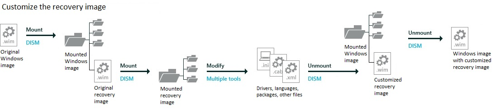

# Lab 12: Update the recovery image

If the system can't boot to the Windows image, it will fail over to the Windows Recovery Environment (WinRE). WinRE can repair common causes of unbootable operating systems. WinRE is based on Windows Preinstallation Environment (WinPE), and to make it work for your customers, you can add drivers, languages, Windows PE Optional Components, and other troubleshooting and diagnostic tools. 

The WinRE image is included inside the Windows 10 and Windows Server 2016 images, and is eventually copied to the Windows RE tools partition on the destination PC or device. To modify it, you'll mount the Windows image, then mount the WinRE image inside it. Make your changes, unmount the WinRE image, then unmount the Windows image. 



You should update your recovery image to ensure a consistent recovery experience whenever you:
* Add boot-critical .inf-style drivers, such as the graphics and storage drivers for [Lab 1: Install Windows PE](install-windows-pe-sxs.md).
* Add major updates to Windows, like general distribution releases ([Lab 5: Add updates and upgrade the edition](servicing-the-image-with-windows-updates-sxs.md)).   
* Add new languages, like you did in [Lab 4: Add languages](add-drivers-langs-universal-apps-sxs.md).  (This isn’t always possible, as not all languages have Windows RE equivalents.)

 **Notes**  
 -  This lab assumes you’d rather keep winre.wim inside of install.wim to keep your languages and drivers in sync. If you’d like to save a bit of time on the factory floor, and if you’re OK managing these images separately, you may prefer to remove winre.wim from the image and apply it separately.

 -  If a Servicing Stack Update (SSU) is available, you'll have to install it before applying the most recent General Distribution Release (GDR, currently KB4016871) or any future GDRs.

## <span id="Mount_the_Windows_image"></span>Step 1: Mount the Windows image

Use the steps from [Lab 3: Add device drivers (.inf-style)](add-device-drivers.md) to mount the Windows image. The short version:

1.  Open the command line as an administrator (**Start** > type **deployment** > right-click **Deployment and Imaging Tools Environment** > **Run as administrator**.)

2.  Make a backup of the file (`copy "C:\Images\Win10_x64\sources\install.wim" "C:\Images\install-backup.wim"`)

3.  Mount the image (`md C:\mount\windows`, then `Dism /Mount-Image /ImageFile:"C:\Images\install.wim" /Index:1 /MountDir:"C:\mount\windows" /Optimize`)

## <span id="Mount_the_recovery_image"></span>Step 2: Mount the recovery image

-   Mount the Windows RE image file. 

    ``` syntax
    md C:\mount\winre
    ```

    ``` syntax
    Dism /Mount-Image /ImageFile:"C:\mount\windows\Windows\System32\Recovery\winre.wim" /Index:1 /MountDir:"C:\mount\winre"
    ```

    Where *C* is the drive letter of the drive that contains the image.

    This step can take several minutes.

    **Troubleshooting**: If winre.wim cannot be seen under the specified directory, use the following command to set the file visible:

    `attrib -h -a -s C:\mount\windows\Windows\System32\Recovery\winre.wim`

## <span id="Add_drivers_to_the_image"></span>Step 3: Add boot-critical drivers to WinRE

1.  Add any .inf-style drivers needed for your hardware.

    ``` syntax
    Dism /Add-Driver /Image:"C:\mount\winre" /Driver:"C:\Drivers\PnP.Media.V1\media1.inf" /LogPath=C:\mount\dism.log
    ```

    Example: Add a collection of drivers from a folder and its subfolders, use the /Recurse option:

    ``` syntax
    Dism /Add-Driver /Image:"C:\mount\winre" /Driver:"C:\Drivers\SampleDrivers" /Recurse /LogPath=C:\mount\dism.log
    ```

## <span id="Add_updates_to_the_image"></span>Step 4: Add updates to the image

1.  Get a Windows update package. Use the same update package that you used for Windows in [Lab 5: Add updates and upgrade the edition](servicing-the-image-with-windows-updates-sxs.md). For example, grab the latest cumulative update listed in [Windows 10 update history](https://support.microsoft.com/en-us/help/12387/windows-10-update-history) from the [Microsoft Update catalog](http://www.catalog.update.microsoft.com/). Extract the .msu file update to a folder, for example, C:\\WindowsUpdates\\windows10.0-kb3194798-x64_8bc6befc7b3c51f94ae70b8d1d9a249bb4b5e108.msu.

2.  Add the updates to the image. For packages with dependencies, make sure you install the packages in order. If you’re not sure of the dependencies, it’s OK to put them all in the same folder, and then add them all using the same DISM /Add-Package command by adding multiple /PackagePath items.

    Example: adding a cumulative update:

    ``` syntax
    Dism /Add-Package /Image:"C:\mount\winre" /PackagePath="C:\WindowsUpdates\windows10.0-kb3194798-x64_8bc6befc7b3c51f94ae70b8d1d9a249bb4b5e108.msu"  /LogPath=C:\mount\dism.log
    ```

    Example: adding multiple updates:

    ``` syntax
    Dism /Add-Package /Image:"C:\mount\winre" /PackagePath="C:\WindowsUpdates\windows10.0-kb00001-x64.msu" /PackagePath="C:\WindowsUpdates\windows10.0-kb00002-x64.msu" /PackagePath="C:\WindowsUpdates\windows10.0-kb00003-x64.msu" /LogPath=C:\mount\dism.log
    ```

## <span id="Add_languages_to_the_image"></span>Step 5: Add languages to the image

If the PC runs into trouble, your users may not be able to read/understand the recovery screens unless you add the appropriate language resources into WinRE.

1.  Add languages. These languages are included with the Windows ADK. You must use a matching version of the Windows ADK to service the Windows RE image.

    **Note**  Windows RE now requires the WinPE-HTA package, this is new for Windows 10.

    **Note**  The WinPE-WiFi-Package is not language-specific and does not need to be added when adding other languages. This is new for Windows 10.

    ``` syntax
    Dism /Add-Package /Image:C:\mount\winre /PackagePath:"C:\Program Files (x86)\Windows Kits\10\Assessment and Deployment Kit\Windows Preinstallation Environment\amd64\WinPE_OCs\fr-fr\lp.cab" 

    Dism /Add-Package /Image:C:\mount\winre /PackagePath:"C:\Program Files (x86)\Windows Kits\10\Assessment and Deployment Kit\Windows Preinstallation Environment\amd64\WinPE_OCs\fr-fr\WinPE-Rejuv_fr-fr.cab"

    Dism /Add-Package /Image:C:\mount\winre /PackagePath:"C:\Program Files (x86)\Windows Kits\10\Assessment and Deployment Kit\Windows Preinstallation Environment\amd64\WinPE_OCs\fr-fr\WinPE-EnhancedStorage_fr-fr.cab"

    Dism /Add-Package /Image:C:\mount\winre /PackagePath:"C:\Program Files (x86)\Windows Kits\10\Assessment and Deployment Kit\Windows Preinstallation Environment\amd64\WinPE_OCs\fr-fr\WinPE-Scripting_fr-fr.cab"

    Dism /Add-Package /Image:C:\mount\winre /PackagePath:"C:\Program Files (x86)\Windows Kits\10\Assessment and Deployment Kit\Windows Preinstallation Environment\amd64\WinPE_OCs\fr-fr\WinPE-SecureStartup_fr-fr.cab"

    Dism /Add-Package /Image:C:\mount\winre /PackagePath:"C:\Program Files (x86)\Windows Kits\10\Assessment and Deployment Kit\Windows Preinstallation Environment\amd64\WinPE_OCs\fr-fr\WinPE-SRT_fr-fr.cab"

    Dism /Add-Package /Image:C:\mount\winre /PackagePath:"C:\Program Files (x86)\Windows Kits\10\Assessment and Deployment Kit\Windows Preinstallation Environment\amd64\WinPE_OCs\fr-fr\WinPE-WDS-Tools_fr-fr.cab"

    Dism /Add-Package /Image:C:\mount\winre /PackagePath:"C:\Program Files (x86)\Windows Kits\10\Assessment and Deployment Kit\Windows Preinstallation Environment\amd64\WinPE_OCs\fr-fr\WinPE-WMI_fr-fr.cab"

    Dism /Add-Package /Image:C:\mount\winre /PackagePath:"C:\Program Files (x86)\Windows Kits\10\Assessment and Deployment Kit\Windows Preinstallation Environment\amd64\WinPE_OCs\fr-fr\WinPE-StorageWMI_fr-fr.cab"

    Dism /Add-Package /Image:C:\mount\winre /PackagePath:"C:\Program Files (x86)\Windows Kits\10\Assessment and Deployment Kit\Windows Preinstallation Environment\amd64\WinPE_OCs\fr-fr\WinPE-HTA_fr-fr.cab"
    ```

2.  Set the default recovery language to match the preferred language for your customers.

    ``` syntax
    Dism /Set-AllIntl:fr-fr /Image:C:\mount\winre
    ```

3.  Optional: Remove languages from Windows RE (only needed for non-English regions)

    When you remove languages from Windows, remove them from Windows RE to save space.

    You can either use the /PackagePath switch (which requires a matching version of Windows and the Windows ADK) or the /PackageName switch (which requires identifying the package including the version number).

    Example:

    ``` syntax
    Dism /Remove-Package /Image:"C:\mount\winre" /PackageName:WinPE-Rejuv-Package~31bf3856ad364e35~amd64~en-US~10.0.15063.0 /LogPath=C:\mount\dism.fod2.log
    Dism /Remove-Package /Image:"C:\mount\winre" /PackageName:WinPE-HTA-Package~31bf3856ad364e35~amd64~en-US~10.0.15063.0 /LogPath=C:\mount\dism.fod2.log
    Dism /Remove-Package /Image:"C:\mount\winre" /PackageName:WinPE-StorageWMI-Package~31bf3856ad364e35~amd64~en-US~10.0.15063.0 /LogPath=C:\mount\dism.fod2.log
    Dism /Remove-Package /Image:"C:\mount\winre" /PackageName:WinPE-WMI-Package~31bf3856ad364e35~amd64~en-US~10.0.15063.0 /LogPath=C:\mount\dism.fod2.log
    Dism /Remove-Package /Image:"C:\mount\winre" /PackageName:WinPE-WDS-Tools-Package~31bf3856ad364e35~amd64~en-US~10.0.15063.0 /LogPath=C:\mount\dism.fod2.log
    Dism /Remove-Package /Image:"C:\mount\winre" /PackageName:WinPE-SRT-Package~31bf3856ad364e35~amd64~en-US~10.0.15063.0 /LogPath=C:\mount\dism.fod2.log
    Dism /Remove-Package /Image:"C:\mount\winre" /PackageName:WinPE-SecureStartup-Package~31bf3856ad364e35~amd64~en-US~10.0.15063.0 /LogPath=C:\mount\dism.fod2.log
    Dism /Remove-Package /Image:"C:\mount\winre" /PackageName:WinPE-Scripting-Package~31bf3856ad364e35~amd64~en-US~10.0.15063.0 /LogPath=C:\mount\dism.fod2.log
    Dism /Remove-Package /Image:"C:\mount\winre" /PackageName:WinPE-EnhancedStorage-Package~31bf3856ad364e35~amd64~en-US~10.0.15063.0 /LogPath=C:\mount\dism.fod2.log
    Dism /Remove-Package /Image:"C:\mount\winre" /PackageName:Microsoft-Windows-WinPE-LanguagePack-Package~31bf3856ad364e35~amd64~en-US~10.0.15063.0 /LogPath=C:\mount\dism.fod2.log
    ```

4.  Verify that the language packages are part of the image:

    ``` syntax
    Dism /Get-Packages /Image:"C:\mount\winre"
    ```

    where *C* is the drive letter of the drive that contains the image.

5.  Review the resulting list of packages and verify that the list contains the package. For example:

    ``` syntax
    Package Identity : Microsoft-Windows-WinPE-Rejuv_fr-fr ...  fr-FR~10.0.15063.0
    State : Installed
    ```

## <span id="Keeping_Windows_settings_through_a_recovery"></span><span id="keeping_windows_settings_through_a_recovery"></span><span id="KEEPING_WINDOWS_SETTINGS_THROUGH_A_RECOVERY"></span>Keeping Windows settings through a recovery

Windows doesn't automatically save settings created through unattend.xml setup files, nor Windows Start Menu customizations created with LayoutModification.xml during a full-system reset, nor first-login info from oobe.xml.

To make sure your customizations are saved:

1.  Save copies of unattend.xml, LayoutModification.xml, plus your Windows\System32\Info\OOBE folder, in C:\\Recovery\\OEM\\.

2.  Add scripts that restore these settings: ResetConfig.xml and EnableCustomizations.cmd, in C:\\Recovery\\OEM\\.  Get these from [Sample scripts: Keeping Windows settings through a recovery](windows-deployment-sample-scripts-sxs.md#Keeping_Windows_settings_through_a_recovery). 


## <span id="Optimizing_the_image_part_1"></span><span id="optimizing_the_image_part_1"></span><span id="OPTIMIZING_THE_IMAGE_PART_1"></span>Step 6: Optimizing the image, part 1 (optional)

After adding a language or Windows update package, you can reduce the size of the final Windows RE package by checking for duplicate files and marking the older versions as superseded.

1.  Optimize the image:

    ``` syntax
    Dism /Cleanup-Image /Image:c:\mount\winre /StartComponentCleanup /ResetBase
    ```

    Later, you'll export the image to remove the superseded files.

2.	Increase scratch space size to speed up recovery:

    ``` syntax
    Dism /Set-ScratchSpace:512 /Image:c:\mount\winre
    ```

## <span id="BKMK_SaveImage"></span><span id="bkmk_saveimage"></span><span id="BKMK_SAVEIMAGE"></span>Step 7: Unmount the WinRE image

-   Unmount and save the image:

    ``` syntax
    Dism /Unmount-Image /MountDir:C:\mount\winre /Commit
    ```

## <span id="Optimizing_the_image_part_2"></span><span id="optimizing_the_image_part_2"></span><span id="OPTIMIZING_THE_IMAGE_PART_2"></span>Step 8: Optimizing the image, part 2 (optional)


If you've optimized the image, you'll need to export the image in order to see a change in the file size. During the export process, DISM removes files that were superseded.

1.  Export the Windows RE image into a new Windows image file.

    ``` syntax
    Dism /Export-Image /SourceImageFile:c:\mount\windows\windows\system32\recovery\winre.wim /SourceIndex:1 /DestinationImageFile:c:\mount\winre-optimized.wim
    ```

2.  Replace the old Windows RE image with the newly-optimized image.

    ``` syntax
    del c:\mount\windows\windows\system32\recovery\winre.wim

    copy c:\mount\winre-optimized.wim c:\mount\windows\windows\system32\recovery\winre.wim
    ```

4.  Check the new size of the Windows RE image.

    ``` syntax
    Dir "C:\mount\windows\Windows\System32\Recovery\winre.wim"
    ```

    Adjust the size of the deployment scripts so they includes enough room for winre.wim plus some free space.

    **Note** If WinRE.wim is more than 470,000,000 bytes, this step is required. 
    
    a.  Convert the file size into megabytes (size in bytes ÷ 1048576 = size in MB).

    b.  Calculate free space needed for the WinRE partition based on the [Disk partition rules](http://go.microsoft.com/fwlink/?LinkId=526950). WinRE.wim file size: 
        -  Up to 450MB: You'll need 50MB free space.  (450MB used + 50 free = 500MB)
        -  450MB-680MB: You'll need 320MB free space.
        -  Over 680MB:  You'll need 1024MB free space.

    c.  Modify the deployment scripts: [CreatePartitions-UEFI.txt](windows-deployment-sample-scripts-sxs.md#CreatePartitions-UEFI.txt) and [CreatePartitions-BIOS.txt](windows-deployment-sample-scripts-sxs.md#CreatePartitions-BIOS.txt) with the new values. Example:

    ``` syntax
    rem == 3. Windows RE tools partition ===============
    create partition primary size=465
    ```

5.  Commit the changes and unmount the Windows image:

    ``` syntax
    Dism /Unmount-Image /MountDir:"C:\mount\windows" /Commit
    ```

    where *C* is the drive letter of the drive that contains the image.

    This process may take several minutes.

## <span id="Try_it_out"></span>Try it out

**Step 9: Apply the image to a new PC**
Use the steps from [Lab 2: Deploy Windows using a script](deploy-windows-with-a-script-sxs.md) to copy the image to the storage USB drive, apply the Windows image and the recovery image, and boot it up. 

Note, you'll now include the steps to add the recovery image:

The short version:

1.  Copy the image file to the storage drive.

2.  [Boot the reference device to Windows PE using the Windows PE USB key](install-windows-pe-sxs.md).

3.  Find the drive letter of the storage drive (`diskpart, list volume, exit`).

4.  Apply the image: `D:\ApplyImage.bat D:\Images\install.wim`.

5.  Apply the recovery image: `D:\ApplyRecovery.bat`
	
    Note: To test a different recovery image, add it the same way, specifying the recovery image: 
    ``` syntax
	D:\ApplyRecovery.bat D:\Images\winre_custom.wim
	```

5.  Disconnect the drives, then reboot (`exit`).
	
**Step 10: Verify drivers and packages**
1.  After the PC boots, either create a new user account, or else press Ctrl+Shift+F3 to reboot into the built-in administrator account (This is also known as audit mode).

2.  Click the **Start** button, click the Power icon, then hold down the **Shift key** and select **Restart**.

    If the boot-critical drivers have been successfully applied, you should see the Windows recovery environment.

    If languages have been successfully added, you'll either see the new language (for a single language image) or be prompted for your language (for a multi-language image). 
	
Next step: [Lab 13: Shrink your image size](shrink-your-image-size.md)