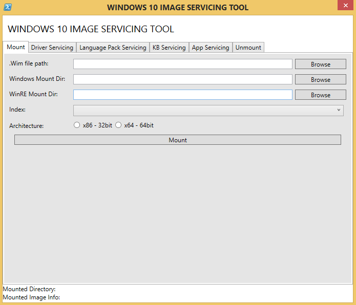

author: kpacquer
Description: 'Windows Imaging Servicing Tool'
MSHAttr: 'PreferredLib:/library'
title: 'Windows Imaging Servicing Tool'
ms.author: windows-hardware-design-content
ms.date: 05/02/2017
ms.topic: article
ms.prod: windows-hardware
ms.technology: windows-oem
---

# Windows Imaging and Servicing Tool (Windows IST)

Windows IST is a utility developed using Powershell and helps an OEM to add, remove and update languages, preload applications faster, and apply existing updates in an automated environment. 

Windows IST is supported on Windows 10, and is built using DISM and PowerShell commands.

Important: Windows IST only covers preloading of both the app packages and app bundles but not the pinning. OEMs must arrange their answer and layoutmodification files manually for the apps they  install. Not pinning the apps will result in removal of the apps during OOBE.

- This is a “Use it at your own risk” and “As-is” tool.  
- OEM partners can use this for evaluation.
- It is not production code and can be used for demo purposes only.
- To suggest any improvements please contact [OTSQR@microsoft.com](mailto:OTSQR@microsoft.com)

Please refer to the Windows10_1607_IST.ps1 PowerShell script found in [USB-B.zip](http://download.microsoft.com/download/5/8/4/5844EE21-4EF5-45B7-8D36-31619017B76A/USB-B.zip) at: USB-B\Windows10_IST\Windows10_1607_IST.ps1

Before running the tool allow PowerShell scripts execution policy by running PowerShell in elevated permission and typing in:

```syntax
Set-ExecutionPolicy UNRESTRICTED
```

1.	Run the script file (Windows10_IST tool) by right clicking and selecting “Run with PowerShell”. After the tool launches proceed with the in-tool instructions.

