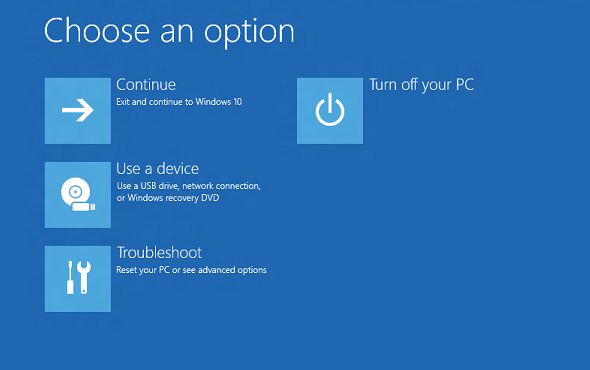

# Windows Recovery Environment (Windows RE)

Windows Recovery Environment (WinRE) is a recovery environment that can repair common causes of unbootable operating systems. WinRE is based on Windows Preinstallation Environment (Windows PE), and can be customized with additional drivers, languages, Windows PE Optional Components, and other troubleshooting and diagnostic tools. By default, WinRE is preloaded into the Windows 10 for desktop editions (Home, Pro, Enterprise, and Education) and Windows Server 2016 installations.

## What's new with WinRE for Windows 10?

-   By default, if you install Windows using media created from Windows Imaging and Configuration Designer (ICD), you'll get a dedicated WinRE tools partition on both UEFI and BIOS-based devices, located immediately after the Windows partition. This allows Windows to replace and resize the partition as needed. (If you install Windows by using Windows Setup, you'll get the same partition layout that you did in Windows 8.1.)
-   If you [add a custom tool to the WinRE boot options menu](add-a-custom-tool-to-the-windows-re-boot-options-menu.md), it can only use optional components that are already in the default WinRE tools. For example, if you have a app from Windows 8 that depended on the .NET optional components, you'll need to rewrite the app for Windows 10.
-   If you [add a custom tool to the WinRE boot options menu](add-a-custom-tool-to-the-windows-re-boot-options-menu.md), it must be placed in the \\Sources\\Recovery\\Tools folder so that it can continue to work after future WinRE upgrades.
-   When adding languages to the push-button reset tools, you'll now need to add the WinPE-HTA optional component.

## Tools

WinRE includes these tools:

-   **Automatic repair and other troubleshooting tools**. For more info, see [Windows RE Troubleshooting Features](windows-re-troubleshooting-features.md).
-   **Push-button reset** (Windows 10 for desktop editions , Windows 8.1 and Windows 8 only). This tool enables your users to repair their own PCs quickly while preserving their data and important customizations, without having to back up data in advance. For more info, see [Push-Button Reset Overview](push-button-reset-overview.md).
-   **System image recovery** (Windows Server 2016, Windows Server 2012 R2 and Windows Server 2012 only). This tool restores the entire hard drive. For more info, see [Recover the Operating System or Full Server](http://go.microsoft.com/fwlink/p/?LinkID=225039).

In addition, you can create your own custom recovery solution by using the [Windows Imaging API](http://go.microsoft.com/fwlink/p/?LinkId=245837), or by using the [Deployment Image Servicing and Management (DISM) API](http://go.microsoft.com/fwlink/p/?LinkID=245836).

## Entry points into WinRE

Your users can access WinRE features through the **Boot Options** menu, which can be launched from Windows in a few different ways:

-   From the login screen, click Shutdown, then hold down the Shift key while selecting **Restart**.
-   In Windows 10, select **Start** &gt; **Settings** &gt; **Update & security** &gt; **Recovery** &gt; under **Advanced Startup**, click **Restart now**.
-   Boot to recovery media.
-   Use a [hardware recovery button (or button combination)](add-a-hardware-recovery-button-to-start-windows-re.md) configured by the OEM.

After any of these actions is performed, all user sessions are signed off and the **Boot Options** menu is displayed. If your users select a WinRE feature from this menu, the PC restarts into WinRE and the selected feature is launched.

WinRE starts automatically after detecting the following issues:

-   Two consecutive failed attempts to start Windows.
-   Two consecutive unexpected shutdowns that occur within two minutes of boot completion.
-   A Secure Boot error (except for issues related to Bootmgr.efi).
-   A BitLocker error on touch-only devices.

### Boot options menu

This menu enables your users to perform these actions:

-   Start recovery, troubleshooting, and diagnostic tools.
-   Boot from a device (UEFI only).
-   Access the **Firmware** menu (UEFI only).
-   Choose which operating system to boot, if multiple operating systems are installed on the PC.

**Note**  
You can add one custom tool to the **Boot options** menu. Otherwise, these menus can't be further customized. For more info, see [Add a Custom Tool to the Windows RE Boot Options Menu](add-a-custom-tool-to-the-windows-re-boot-options-menu.md).

 

## Security considerations

When working with WinRE, be aware of these security considerations:

-   If users open the **Boot options** menu from Windows and select a WinRE tool, they must provide the user name and password of a local user account with administrator rights.
-   By default, networking is disabled in WinRE. You can turn on networking when you need it. However, we recommend that you disable networking when you don't need connectivity.

## Customizing WinRE

You can customize WinRE by adding packages (Windows PE Optional Components), languages, drivers, and custom diagnostic or troubleshooting tools. The base WinRE image includes these Windows PE Optional Components:

-   Microsoft-Windows-Foundation-Package
-   WinPE-EnhancedStorage
-   WinPE-Rejuv
-   WinPE-Scripting
-   WinPE-SecureStartup
-   WinPE-Setup
-   WinPE-SRT
-   WinPE-WDS-Tools
-   WinPE-WMI
-   WinPE-StorageWMI-Package (added to the base image in Windows 8.1 and Windows Server 2012 R2)
-   WinPE-HTA (added to the base image in Windows 10)

**Note**  
The number of packages, languages, and drivers is limited by the amount of memory available on the PC. For performance reasons, we recommend that you minimize the number of languages, drivers, and tools that you add to the image.

 

## Hard drive partitions

When you install Windows by using Windows Setup, WinRE is configured like this:

1.  During Windows Setup, Windows prepares the hard drive partitions to support WinRE.
2.  Windows initially places the WinRE image file (winre.wim) in the Windows partition, in the \\Windows\\System32\\Recovery folder.

    Before delivering the PC to your customer, you can modify or replace the WinRE image file to include additional languages, drivers, or packages.

3.  During the specialize configuration pass, the WinRE image file is copied into the recovery tools partition, so that the device can boot to the recovery tools even if there's a problem with the Windows partition.

When you deploy Windows by applying images, you must manually configure the hard drive partitions. When WinRE is installed on a hard drive, the partition must be formatted as NTFS.

Add the baseline WinRE tools image (winre.wim) to a separate partition from the Windows and data partitions. This enables your users to use WinRE even if the Windows partition is encrypted with Windows BitLocker Drive Encryption. It also prevents your users from accidentally modifying or removing the WinRE tools.

We recommend that you store the recovery tools in a dedicated partition, directly after the Windows partition.

For more info about configuring hard drive partitions, see [Configure UEFI/GPT-Based Hard Drive Partitions](configure-uefigpt-based-hard-drive-partitions.md) or [Configure BIOS/MBR-Based Hard Drive Partitions](configure-biosmbr-based-hard-drive-partitions.md).

## Memory requirements

In order to boot Windows RE directly from memory (also known as RAM disk boot), a contiguous portion of physical memory (RAM) which can hold the entire Windows RE image (winre.wim) must be available. To optimize memory use, manufacturers should ensure that their firmware reserves memory locations either at the beginning or at the end of the physical memory address space.

## See also

<table>
<colgroup>
<col width="50%" />
<col width="50%" />
</colgroup>
<thead>
<tr class="header">
<th align="left">Content type</th>
<th align="left">References</th>
</tr>
</thead>
<tbody>
<tr class="odd">
<td align="left">
<strong>Deployment</strong>
</td>
<td align="left">
[Customize Windows RE](customize-windows-re.md) | [Deploy Windows RE](deploy-windows-re.md)
</td>
</tr>
<tr class="even">
<td align="left">
<strong>Operations</strong>
</td>
<td align="left">
[REAgentC Command-Line Options](reagentc-command-line-options.md)
</td>
</tr>
<tr class="odd">
<td align="left">
<strong>Troubleshooting</strong>
</td>
<td align="left">
[Windows RE Troubleshooting Features](windows-re-troubleshooting-features.md)
</td>
</tr>
<tr class="even">
<td align="left">
<strong>Add-on tools</strong>
</td>
<td align="left">
[Add a Custom Tool to the Windows RE Boot Options Menu](add-a-custom-tool-to-the-windows-re-boot-options-menu.md) | [Add a Hardware Recovery Button to Start Windows RE](add-a-hardware-recovery-button-to-start-windows-re.md) | [Push-Button Reset Overview](push-button-reset-overview.md)
</td>
</tr>
</tbody>
</table>

 
