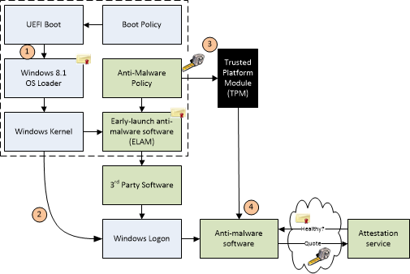
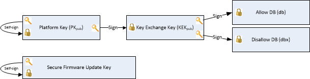
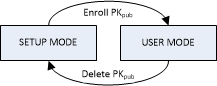

# Windows Secure Boot Key Creation and Management Guidance


**Vishal Manan, Architect, OEM Consulting**, <vmanan@microsoft.com>

**Arie van der Hoeven, Architect, OEM Consulting**, <ariev@microsoft.com>

This document helps guide OEMs and ODMs in creation and management of the Secure Boot keys and certificates in a manufacturing environment. It addresses questions related to creation, storage and retrieval of Platform Keys (PKs), secure firmware update keys, and third party Key Exchange Keys (KEKs).

**Note:** These steps are not specific to PC OEMs. Enterprises and customers can also use these steps to configure their servers to support Secure Boot. 

Windows requirements for UEFI and Secure Boot can be found in the [Windows Hardware Certification Requirements](http://go.microsoft.com/fwlink/p/?linkid=320504). This paper does not introduce new requirements or represent an official Windows program. It is intended as guidance beyond certification requirements, to assist in building efficient and secure processes for creating and managing Secure Boot Keys. This is important because UEFI Secure Boot is based on the usage of Public Key Infrastructure to authenticate code before allowed to execute.

The reader is expected to know the fundamentals of UEFI, basic understanding of Secure Boot (Chapter 27 of the [UEFI specification](http://go.microsoft.com/fwlink/p/?LinkID=220187)), and PKI security model.

Requirements, tests, and tools validating Secure Boot on Windows are available today through the [Windows Hardware Certification Kit (HCK)](http://go.microsoft.com/fwlink/p/?linkid=254893). However, these HCK resources do not address creation and management of keys for Windows deployments. This paper addresses key management as a resource to help guide partners through deployment of the keys used by the firmware. It is not intended as prescriptive guidance and does not include any new requirements.

On this page:

-   [1. Secure Boot, Windows and Key Management](#securebootkeymanagement) contains information on boot security and PKI architecture as it applies to Windows and Secure Boot.

-   [2. Key Management Solutions](#keymanagementsolutions) is intended to help partners design a key management and design solution that fits their needs.

-   [3. Summary and Resources](#summaryandresources) includes appendices, checklists, APIs, and other references.

This document serves as a starting point in developing customer ready PCs, factory deployment tools and key security best practices.

## <span id="SecureBootKeyManagement"></span><span id="securebootkeymanagement"></span><span id="SECUREBOOTKEYMANAGEMENT"></span>1. Secure Boot, Windows and Key Management


The UEFI (Unified Extensible Firmware Interface) specification defines a firmware execution authentication process called Secure Boot. As an industry standard, Secure Boot defines how platform firmware manages certificates, authenticates firmware, and how the operating system interfaces with this process.

Secure Boot is based on the Public Key Infrastructure (PKI) process to authenticate modules before they are allowed to execute. These modules can include firmware drivers, option ROMs, UEFI drivers on disk, UEFI applications, or UEFI boot loaders. Through image authentication before execution, Secure Boot reduces the risk of pre-boot malware attacks such as rootkits. Microsoft relies on UEFI Secure Boot in Windows 8 and above as part of its Trusted Boot security architecture to improve platform security for our customers. Secure Boot is required for Windows 8 and above client PCs, and for Windows Server 2016 as defined in the Windows Hardware Compatibility Requirements.

The Secure Boot process works as follows and as shown in Figure 1:

1.  **Firmware Boot Components:** The firmware verifies the OS loader is trusted (Windows or another trusted operating system.)

2.  **Windows boot components: BootMgr, WinLoad, Windows Kernel Startup.** Windows boot components verify the signature on each component. Any non-trusted components will not be loaded and instead will trigger Secure Boot remediation.

    -   **Antivirus and Antimalware Software initialization:** This software is checked for a special signature issued by Microsoft verifying that it is a trusted boot critical driver, and will launch early in the boot process.

    -   **Boot Critical Driver initialization:** The signatures on all Boot-critical drivers are checked as part of Secure Boot verification in WinLoad.

3.  **Additional OS Initialization**

4.  **Windows Logon Screen**



*Figure 1: Windows Trusted Boot Architecture*

Implementation of UEFI Secure Boot is part of Microsoft’s Trusted Boot Architecture, introduced in Windows 8.1. A growing trend in the evolution of malware exploits is targeting the boot path as a preferred attack vector. This class of attack has been difficult to guard against, since antimalware products can be disabled by malicious software that prevents them from loading entirely. With Windows Trusted Boot architecture and its establishment of a root of trust with Secure Boot, the customer is protected from malicious code executing in the boot path by ensuring that only signed, certified “known good” code and boot loaders can execute before the operating system itself loads.

### <span id="1.1_Public-Key_Infrastructure__PKI__and_Secure_Boot"></span><span id="1.1_public-key_infrastructure__pki__and_secure_boot"></span><span id="1.1_PUBLIC-KEY_INFRASTRUCTURE__PKI__AND_SECURE_BOOT"></span>1.1 Public-Key Infrastructure (PKI) and Secure Boot

The PKI establishes authenticity and trust in a system. Secure Boot leverages PKI for two high-level purposes:

1.  During boot to determine if early boot modules are trusted for execution.

2.  To authenticate requests to service requests include modification of Secure Boot databases and updates to platform firmware.

A PKI consists of:

-   A certificate authority (CA) that issues the digital certificates.

-   A registration authority which verifies the identity of users requesting a certificate from the CA.

-   A central directory in which to store and index keys.

-   A certificate management system.

### <span id="1.2_Public_Key_Cryptography"></span><span id="1.2_public_key_cryptography"></span><span id="1.2_PUBLIC_KEY_CRYPTOGRAPHY"></span>1.2 Public Key Cryptography

Public key cryptography uses a pair of mathematically related cryptographic keys, known as the public and private key. If you know one of the keys, you cannot easily calculate what the other one is. If one key is used to encrypt information, then only the corresponding key can decrypt that information. For Secure Boot, the private key is used to digitally sign code and the public key is used to verify the signature on that code to prove its authenticity. If a private key is compromised, then systems with corresponding public keys are no longer secure. This can lead to boot kit attacks and will damage the reputation of the entity responsible for ensuring the security of the private key.

In a Secure Boot public key system you have the following:

-   **1.2.1 RSA 2048 Encryption**

    RSA-2048 is an asymmetric cryptographic algorithm. The space needed to store an RSA-2048 modulus in raw form is 2048 bits.

-   **1.2.2 Self-signed certificate**

    A certificate signed by the private key that matches the public key of the certificate is known as a self-signed certificate. Root certification authority (CA) certificates fall into this category.

-   **1.2.3 Certification Authority**

    The certification authority (CA) issues signed certificates that affirm the identity of the certificate subject and bind that identity to the public key contained in the certificate. The CA signs the certificate by using its private key. It issues the corresponding public key to all interested parties in a self-signed root CA certificate.

    In Secure Boot, Certification Authorities (CAs) include the OEM (or their delegates) and Microsoft. The CAs generate the key pairs that form the root of trust and then use the private keys to sign legitimate operations such as allowed early boot EFI modules and firmware servicing requests. The corresponding public keys are shipped embedded into the UEFI firmware on Secure Boot-enabled PCs and are used to verify these operations.

    (More information on usage of CAs and key exchanges is readily available on the internet which relates to the Secure Boot model.)

-   **1.2.4 Public Key**

    The public Platform Key ships on the PC and is accessible or “public”. In this document we will use the suffix “pub” to denote public key. For example, PKpub denotes the public half of the PK.

-   **1.2.5 Private Key**

    For PKI to work the private key needs to be securely managed. It should be accessible to a few highly trusted individuals in an organization and located in a physically secure location with strong access policy restrictions in place. In this document we will use the suffix “priv” to denote private key. For example, the PKpriv indicates private half of the PK.

-   **1.2.6 Certificates**

    The primary use for digital certificates is to verify the origin of signed data, such as binaries etc. A common use of certificates is for internet message security using Transport Layer Security (TLS) or Secure Sockets Layer (SSL). Verifying the signed data with a certificate lets the recipient know the origin of the data and if it has been altered in transit.

    A digital certificate in general contains, at a high level, a distinguished name (DN), a public key, and a signature. The DN identifies an entity -- a company, for example -- that holds the private key that matches the public key of the certificate. Signing the certificate with a private key and placing the signature in the certificate ties the private key to the public key.

    Certificates can contain some other types of data. For example, an X.509 certificate includes the format of the certificate, the serial number of the certificate, the algorithm used to sign the certificate, the name of the CA that issued the certificate, the name and public key of the entity requesting the certificate, and the CA's signature.

-   **1.2.7 Chaining certificates**

    From: [Certificate chains](http://go.microsoft.com/fwlink/?LinkId=321183):

    

    *Figure 2: Three-certificate chain*

    User certificates are often signed by a different private key, such as a private key of the CA. This constitutes a two-certificate chain. Verifying that a user certificate is genuine involves verifying its signature, which requires the public key of the CA, from its certificate. But before the public key of the CA can be used, the enclosing CA certificate needs to be verified. Because the CA certificate is self-signed, the CA public key is used to verify the certificate.

    A user certificate need not be signed by the private key of the root CA. It could be signed by the private key of an intermediary whose certificate is signed by the private key of the CA. This is an instance of a three-certificate chain: user certificate, intermediary certificate, and CA certificate. But more than one intermediary can be part of the chain, so certificate chains can be of any length.

### <span id="1.3_Secure_Boot_PKI_requirements"></span><span id="1.3_secure_boot_pki_requirements"></span><span id="1.3_SECURE_BOOT_PKI_REQUIREMENTS"></span>1.3 Secure Boot PKI requirements

The UEFI-defined root of trust consists of the Platform Key and any keys an OEM or ODM includes in the firmware core. Pre-UEFI security and a root of trust are not addressed by the UEFI Secure Boot process, but instead by National Institute of Standards and Technology (NIST), and Trusted Computing Group (TCG) publications referenced in this paper.

-   **1.3.1 Secure Boot requirements**

    You’ll need to consider the following parameters for implementing Secure Boot:

    -   Customer requirements

    -   Windows Hardware Compatibility requirements

    -   Key generation and management requirements.

    You would need to pick hardware for Secure Boot key management like Hardware Security Modules (HSMs), consider special requirements on PCs to ship to governments and other agencies and finally the process of creating, populating and managing the life cycle of various Secure Boot keys.

-   **1.3.2 Secure Boot related keys**

    The keys used for Secure Boot are below:

    

    *Figure 3: Keys related to Secure Boot*

    Figure 3 above represents the signatures and keys in a PC with Secure Boot. The platform is secured through a platform key that the OEM installs in firmware during manufacturing. Other keys are used by Secure Boot to protect access to databases that store keys to allow or disallow execution of firmware.

    The authorized database (db) contains public keys and certificates that represent trusted firmware components and operating system loaders. The forbidden signature database (dbx) contains hashes of malicious and vulnerable components as well as compromised keys and certificates and blocks execution of those malicious components. The strength of these policies is based on signing firmware using Authenticode and Public Key Infrastructure (PKI). PKI is a well-established process for creating, managing, and revoking certificates that establish trust during information exchange. PKI is at the core of the security model for Secure Boot.

    Below are more details on these keys.

-   **1.3.3 Platform Key (PK)**

    As per section 27.5.1 of the UEFI 2.3.1 Errata C, the platform key establishes a trust relationship between the platform owner and the platform firmware. The platform owner enrolls the public half of the key (PKpub) into the platform firmware as specified in **Section 7.2.1 of the UEFI 2.3.1 Errata C**. This step moves the platform into user mode from setup mode. Microsoft recommends that the Platform Key be of type **EFI\_CERT\_X509\_GUID** with public key algorithm RSA, public key length of 2048 bits, and signature algorithm sha256RSA. The platform owner may use type **EFI\_CERT\_RSA2048\_GUID** if storage space is a concern. Public keys are used to check signatures as described earlier in this document. The platform owner can later use the private half of the key (PKpriv):

    -   To change platform ownership you must put the firmware into UEFI defined **setup mode** which disables Secure Boot. We recommend reverting to setup mode only if there is a need to do this during manufacturing.
    
    -   For desktop PC, OEMs manage PK and necessary PKI associated with it. For Servers, OEMs by default manage PK and necessary PKI. Enterprise customers or Server customers can also customize PK, replacing the OEM-trusted PK with a custom-proprietary PK to lock down the trust in UEFI Secure Boot firmware to itself.

    **1.3.3.1 To enroll or update a Key Exchange Key (KEK) Enrolling the Platform Key**

    The platform owner enrolls the public half of the Platform Key (**PKpub**) by calling the UEFI Boot Service SetVariable() as specified in Section 7.2.1 of UEFI Spec 2.3.1 errata C, and resetting the platform. If the platform is in setup mode, then the new **PKpub** shall be signed with its **PKpriv** counterpart. If the platform is in user mode, then the new **PKpub** must be signed with the current **PKpriv**. If the PK is of type **EFI\_CERT\_X509\_GUID**, then this must be signed by the immediate **PKpriv**, not a private key of any certificate issued under the PK.

    **1.3.3.2 Clearing the Platform Key**

    The platform owner clears the public half of the Platform Key (**PKpub**) by calling the UEFI Boot Ser¬vice SetVariable() with a variable size of 0 and resetting the platform. If the platform is in setup mode, then the empty variable does not need to be authenticated. If the platform is in user mode, then the empty variable must be signed with the current **PKpriv**; see Section 7.2(Variable Services) under [UEFI specification](http://go.microsoft.com/fwlink/p/?LinkID=220187) 2.3.1 Errata C for details. It is strongly recommended that the production PKpriv never be used to sign a package to reset the platform since this allows Secure Boot to be disabled programmatically. This is primarily a pre-production test scenario.

    The platform key may also be cleared using a secure platform-specific method. In this case, the global variable Setup Mode must also be updated to 1.

    

    *Figure 4: Platform Key State diagram*

    **1.3.3.3 PK generation**

    As per UEFI recommendations, the public key must be stored in non-volatile storage which is tamper and delete resistant on the PC. The Private keys stay secure at Partner or in the OEM’s Security Office and only the public key is loaded onto the platform. There are more details under section 2.2.1 and 2.3.

    The number of PK generated is at the discretion of the Platform owner (OEM). These keys could be:

    1.  **One per PC**. Having one unique key for each device. This may be required for government agencies, financial institutions, or other server customers with high-security needs. It may require additional storage and crypto processing power to generate private and public keys for large numbers of PCs. This adds the complexity of mapping devices with their corresponding PK when pushing out firmware updates to the devices in the future. There are a few different HSM solutions available to manage large number of keys based on the HSM vendor. For more info, see [Secure Boot Key Generation Using HSM](http://go.microsoft.com/fwlink/?LinkId=321184).

    2.  **One per model**. Having one key per PC model. The tradeoff here is that if a key is compromised all the machines within the same model would be vulnerable. This is recommended by Microsoft for desktop PCs.

    3.  **One per product line**. If a key is compromised a whole product line would be vulnerable.

    4.  **One per OEM**. While this may be the simplest to set up, if the key is compromised, every PC you manufacture would be vulnerable. To speed up operation on the factory floor, the PK and potentially other keys could be pre-generated and stored in a safe location. These could be later retrieved and used in the assembly line. Chapters 2 and 3 have more details.

    **1.3.3.4 Rekeying the PK**

    This may be needed if the PK gets compromised or as a requirement by a customer that for security reasons may decide to enroll their own PK.

    Rekeying could be done either for a model or PC based on what method was selected to create PK. All the newer PCs will get signed with the newly created PK.

    Updating the PK on a production PC would require either a variable update signed with the existing PK that replaces the PK or a firmware update package. An OEM could also create a SetVariable() package and distribute that with a simple application such as PowerShell that just changes the PK. The firmware update package would be signed by the secure firmware update key and verified by firmware. If doing a firmware update to update the PK, care should be taken to ensure the KEK, db, and dbx are preserved.

    On all PCs, it is recommended to not use the PK as the secure firmware update key. If the PKpriv is compromised then so is the secure firmware update key (since they are the same). In this case the update to enroll a new PKpub might not be possible since the process of updating has also been compromised.

    On SOCs PCs, there is another reason to not use the PK as the secure firmware update key. This is because the secure firmware update key is permanently burnt into fuses on PCs that meet Windows Hardware Certification requirements.

-   **1.3.4 Key Exchange Key (KEK)**Key exchange keys establish a trust relationship between the operating system and the platform firmware. Each operating system (and potentially, each 3rd party application which need to communicate with platform firmware) enrolls a public key (**KEKpub**) into the platform firmware.

    **1.3.4.1 Enrolling Key Exchange Keys**

    Key exchange keys are stored in a signature database as described in [1.4 Signature Databases (Db and Dbx)](#signaturedatabase). The signature database is stored as an authenticated UEFI variable.

    The platform owner enrolls the key exchange keys by either calling SetVariable() as specified in Section 7.2(Variable Services) under [UEFI specification](http://go.microsoft.com/fwlink/p/?LinkID=220187) 2.3.1 Errata C. with the EFI\_VARIABLE\_APPEND\_WRITE attribute set and the Data parameter containing the new key(s), or by reading the database using GetVariable(), appending the new key exchange key to the existing keys and then writing the database using SetVariable()as specified in Section 7.2(Variable Services) under [UEFI specification](http://go.microsoft.com/fwlink/p/?LinkID=220187) 2.3.1 Errata C without the EFI\_VARIABLE\_APPEND\_WRITE attribute set.

    If the platform is in setup mode, the signature database variable does not need to be signed but the parameters to the SetVariable() call shall still be prepared as specified for authenticated variables in Section 7.2.1. If the platform is in user mode, the signature database must be signed with the current PKpriv

    **1.3.4.2 Clearing the KEK**

    It is possible to “clear” (delete) the KEK. Note that if the PK is not installed on the platform, “clear” requests are not required to be signed. If they are signed, then to clear the KEK requires a PK-signed package, and to clear either db or dbx requires a package signed by any entity present in the KEK.

    **1.3.4.3 Microsoft KEK**

    The Microsoft KEK is required to enable revocation of bad images by updating the dbx and potentially for updating db to prepare for newer Windows signed images.

    Include the Microsoft Corporation KEK CA 2011 in the KEK database, with the following values:

    -   SHA-1 cert hash: `31 59 0b fd 89 c9 d7 4e d0 87 df ac 66 33 4b 39 31 25 4b 30`.

    -   SignatureOwner GUID: `{77fa9abd-0359-4d32-bd60-28f4e78f784b}`.

    -   Microsoft will provide the certificate to partners and it can be added either as an **EFI\_CERT\_X509\_GUID** or an **EFI\_CERT\_RSA2048\_GUID** type signature.

    The Microsoft KEK certificate can be downloaded from: <http://go.microsoft.com/fwlink/?LinkId=321185>.

    **1.3.4.4 KEKDefault** The platform vendor may provide a default set of Key Exchange Keys in the KEKDefault variable. Please reference [UEFI specification](http://go.microsoft.com/fwlink/p/?LinkID=220187) section 27.3.3 for more information.

    **1.3.4.5 OEM/3rd party KEK - adding multiple KEK**

    Customers and Platform Owners don’t need to have their own KEK. On non-Windows RT PCs the OEM may have additional KEKs to allow additional OEM or a trusted 3rd party control of the db and dbx.
 
-   **1.3.5 Secure Boot firmware update key**The Secure firmware update key is used to sign the firmware when it needs to be updated. This key has to have a minimum key strength of RSA-2048. All firmware updates must be signed securely by the OEM, their trusted delegate such as the ODM or IBV (Independent BIOS Vendor), or by a secure signing service.

    As per [NIST publication 800-147 Field Firmware Update](http://go.microsoft.com/fwlink/?LinkId=321186) must support all elements of guidelines:

    Any update to the firmware flash store must be signed by creator.

    Firmware must check signature of the update.

-   **1.3.6 Creation of keys for Secure Firmware Update**

    The same key will be used to sign all firmware updates since the public half will be residing on the PC. You could also sign the firmware update with a key which chains to Secure Firmware update key.

    There could be one key per PC like PK or one per model or one per product line. If there is one key per PC that would mean that millions of unique update packages will need to be generated. Please consider based on resource availability what method would work for you. Having a key per model or product line is a good compromise.

    The Secure Firmware Update public key (or its hash to save space) would be stored in some protected storage on the platform – generally protected flash (PC) or one-time-programmable fuses (SOC).

    If only the hash of this key is stored (to save space), then the firmware update will include the key, and the first stage of the update process will be verifying that the public key in the update matches the hash stored on the platform.

    Capsules are a means by which the OS can pass data to UEFI environment across a reboot. Windows calls the UEFI UpdateCapsule() to deliver system and PC firmware updates. At boot time prior to calling ExitBootServices(),Windows will pass in any new firmware updates found in the Windows Driver Store into UpdateCapsule(). UEFI system firmware can use this process to update system and PC firmware. By leveraging this Windows firmware support an OEM can rely on the same common format and process for updating firmware for both system and PC firmware. Firmware must implement the ACPI ESRT table in order to support UEFI UpdateCapsule() for Windows.

    For details on implementing support for the Windows UEFI Firmware Update Platform consult the following documentation: Windows UEFI Firmware Update Platform.

    Update capsules can be in memory or on the disk. Windows supports in memory updates.

    **1.3.6.1 Capsule (Capsule-in-Memory)**

    Following is the flow of events for an In-memory update capsule to work.

    1.  A capsule is put in memory by an application in the OS

    2.  Mailbox event is set to inform BIOS of pending update

    3.  PC reboots, verifies the capsule image and update is performed by the BIOS

-   **1.3.7 Workflow of a typical firmware update**

    1.  Download and install the firmware driver.

    2.  Reboot.

    3.  OS Loader detects and verifies the firmware.

    4.  OS Loader passes a binary blob to UEFI.

    5.  UEFI performs the firmware update (This process is owned by the silicon vendor).

    6.  OS Loader detection completes successfully.

    7.  OS finishes booting.

### <span id="SignatureDatabase"></span><span id="signaturedatabase"></span><span id="SIGNATUREDATABASE"></span>1.4 Signature Databases (Db and Dbx)

-   **1.4.1 Allowed Signature database (db)**

    The contents of the EFI \_IMAGE\_SECURITY\_DATABASE db control what images are trusted when verifying loaded images. The database may contain multiple certificates, keys, and hashes in order to identify allowed images.

    The **Microsoft Windows Production PCA 2011** with a SHA-1 Cert Hash of `58 0a 6f 4c c4 e4 b6 69 b9 eb dc 1b 2b 3e 08 7b 80 d0 67 8d` must be included in db in order to allow the Windows OS Loader to load. The Windows CA can be downloaded from here: <http://go.microsoft.com/fwlink/p/?linkid=321192>.

    On non-Windows RT PCs the OEM should consider including the **Microsoft Corporation UEFI CA 2011** with a SHA-1 Certificate Hash of `46 de f6 3b 5c e6 1c f8 ba 0d e2 e6 63 9c 10 19 d0 ed 14 f3`. Signing UEFI drivers and applications with this certificate will allow UEFI drivers and applications from 3rd parties to run on the PC without requiring additional steps for the user. The UEFI CA can be downloaded from here: <http://go.microsoft.com/fwlink/p/?linkid=321194>.

    On non-Windows RT PCs the OEM may also have additional items in the db to allow other operating systems or OEM-approved UEFI drivers or apps, but these images must not compromise the security of the PC in any way.

-   **1.4.2 DbDefault**: The platform vendor may provide a default set of entries for the Signature Database in the dbDefault variable. For more information see section 27.5.3 in the UEFI specification.

-   **1.4.3 Forbidden Signature Database (dbx)**

    The contents of **EFI\_IMAGE\_SIGNATURE\_DATABASE1** dbx must be checked when verifying images before checking db and any matches must prevent the image from executing. The database may contain multiple certificates, keys, and hashes in order to identify forbidden images. The Windows Hardware Certification Requirements state that a dbx must be present, so any dummy value, such as the SHA-256 hash of `0`, may be used as a safe placeholder until such time as Microsoft begins delivering dbx updates. [Click Here](http://www.uefi.org/revocationlistfile) to download the latest UEFI revocation list from Microsoft.

-   **1.4.4 DbxDefault**: The platform vendor may provide a default set of entries for the Signature Database in the dbxDefault variable. For more information see section 27.5.3 in the UEFI specification.

### <span id="1.5_Keys_Required_for_Secure_Boot_on_all_PCs"></span><span id="1.5_keys_required_for_secure_boot_on_all_pcs"></span><span id="1.5_KEYS_REQUIRED_FOR_SECURE_BOOT_ON_ALL_PCS"></span>1.5 Keys Required for Secure Boot on all PCs

<table>
<colgroup>
<col width="25%" />
<col width="25%" />
<col width="25%" />
<col width="25%" />
</colgroup>
<thead>
<tr class="header">
<th align="left">Key/db Name</th>
<th align="left">Variable</th>
<th align="left">Owner</th>
<th align="left">Notes</th>
</tr>
</thead>
<tbody>
<tr class="odd">
<td align="left"><p>PKpub</p></td>
<td align="left"><p>PK</p></td>
<td align="left"><p>OEM</p></td>
<td align="left"><p>PK – 1 only. Must be RSA 2048 or stronger.</p></td>
</tr>
<tr class="even">
<td align="left"><p>Microsoft Corporation KEK CA 2011</p></td>
<td align="left"><p>KEK</p></td>
<td align="left"><p>Microsoft</p></td>
<td align="left"><p>Allows updates to db and dbx:</p>
<p>[http://go.microsoft.com/fwlink/p/?linkid=321185](http://go.microsoft.com/fwlink/p/?linkid=321185).</p></td>
</tr>
<tr class="odd">
<td align="left"><p>Microsoft Windows Production CA 2011</p></td>
<td align="left"><p>db</p></td>
<td align="left"><p>Microsoft</p></td>
<td align="left"><p>This CA in the Signature Database (db) allows Windows to boot: [http://go.microsoft.com/fwlink/?LinkId=321192](http://go.microsoft.com/fwlink/?LinkId=321192).</p></td>
</tr>
<tr class="even">
<td align="left"><p>Forbidden Signature Database</p></td>
<td align="left"><p>dbx</p></td>
<td align="left"><p>Microsoft</p></td>
<td align="left"><p>List of known bad Keys, CAs or images from Microsoft</p></td>
</tr>
<tr class="odd">
<td align="left"><p>Secure firmware update key</p></td>
<td align="left"><p></p></td>
<td align="left"><p>OEM</p></td>
<td align="left"><p>Recommendation is to have this key be different from PK</p></td>
</tr>
</tbody>
</table>

 

*Table 1: Keys/db needed for Secure Boot*


## <span id="KeyManagementSolutions"></span><span id="keymanagementsolutions"></span><span id="KEYMANAGEMENTSOLUTIONS"></span>2. Key Management Solutions


Below are given some of the metrics we used for comparison.

### <span id="2.1_Metrics_used"></span><span id="2.1_metrics_used"></span><span id="2.1_METRICS_USED"></span>2.1 Metrics used

The following metrics can help you select a HSM PC based on the requirements of [UEFI specification](http://go.microsoft.com/fwlink/p/?LinkID=220187) 2.3.1 Errata C and your needs.

**Public Key Infrastructure (PKI) related**

-   Does it support RSA 2048 or higher? - The [UEFI specification](http://go.microsoft.com/fwlink/p/?LinkID=220187) 2.3.1 Errata C recommends the keys to be RSA-2048 or better.

-   Does it have the ability to generate keys and sign?

-   How many keys can it store? Does it store keys on HSM or an attached server?

-   Authentication method for key retrieval.

    Some PCs support multiple authentication entities to be present for key retrieval.

**Pricing**

-   What is the price point? HSMs can range in price from $1,500 to $70,000 depending on available features.

**Manufacturing environment**

-   Speed of operation on factory floor. Crypto processors can speed up key creation and access.

-   Ease of setup, deployment, maintenance.

-   Skillset and training required?

-   Network access for backup and High Availability

**Standards and Compliance**

-   What level of FIPS compliance does it have? Is it tamper resistant?

-   Support for other standards, for example, MS crypto APIs.

-   Does it meet government and other agency requirements?

**Reliability and disaster recovery**

-   Does it allow for Key Backup?

    Backups can be stored both onsite in a safe location that is a different physical location than the CA computer and HSM and /or at an offsite location.

-   Does it allow for High Availability for disaster recovery?

### <span id="2.2_Key_Management_Options"></span><span id="2.2_key_management_options"></span><span id="2.2_KEY_MANAGEMENT_OPTIONS"></span>2.2 Key Management Options

-   **2.2.1 Hardware Security Module (HSM)**

    Based on the above criteria this is probably the most suitable and secure solution. Most HSM have FIPS 140-2 level 3 compliance. FIPS 140-2 level 3 compliance is strict on authentication and requires that keys are not exported or imported from the HSM.

    They support multiple ways of key storage. They could be stored either locally on the HSM itself or on the server attached to the HSM. On the server the keys are encrypted and stored and is preferable for solutions which requires lots of keys to be stored.

    The cryptographic module security policy shall specify a physical security policy, including physical security mechanisms that are implemented in a cryptographic module such as, tamper-evident seals, locks, tamper response and zeroization switches, and alarms. It also allows specifying actions required by the operator(s) to ensure that physical security is maintained such as periodic inspection of tamper-evident seals or testing of tamper response and zeroization switches.

    **2.2.1.1 Network HSM**

    This solution is the best in its class in terms of security, adherence to standards, key generation, storage and retrieval. Most of these PCs support high availability and have ability to backup keys.

    The costs of these products can be in tens of thousands of dollars based on the extra services they offer.

    **2.2.1.2 Standalone HSM**

    These work great with standalone servers. One can use Microsoft CAPI and CNG or any other secure API supported by HSM. These HSMs come in variety of form factors supporting USB, PCIe and PCMCIA buses.

    They optionally support key backup and high availability.

-   **2.2.2 Custom solutions providers**

    Public Key cryptography can be challenging and require understanding of cryptographic concepts which maybe new. There are custom solution providers who could help with the getting Secure Boot to work in the manufacturing environment.

    There are varieties of custom solutions offered by BIOS vendors, HSM companies and PKI consulting companies to get Secure Boot PKI working in the manufacturing environment.

    Some of the providers are listed below:

    **2.2.2.1 BIOS vendors**

    There are some BIOS vendors which may be able to provide custom solutions.

    **2.2.2.2 HSM vendors**

    Some HSM vendors may be able to provide custom consulting. For more info, see [Secure Boot Key Generation and Signing Using HSM (Example)](secure-boot-key-generation-and-signing-using-hsm--example.md).

-   **2.2.3 Trusted Platform Module (TPM)**

    A Trusted Platform Module (TPM) is a hardware chip on the motherboard that stores cryptographic keys used for encryption. Many computers include a TPM, but if the PC doesn’t include it, it is not feasible to add one. Once enabled, the Trusted Platform Module can help secure full disk encryption products such as Microsoft BitLocker capabilities. It keeps hard drives locked, or sealed, until the PC completes a system verification or authentication process.

    The TPM can generate, store, and protect keys used in the encryption and decryption process.

    The drawbacks of TPMs are that it may not have fast crypto processors to speed up processing in the manufacturing environment. They also are not suitable for storing large number of keys. Backup and high availability and standards compliance to FIPS 140-2 level 3 may not be available.

-   **2.2.4 Smart Cards**

    A smart card can generate and store keys. They do share some features which HSM support like authentication and tamper proofing, but they don’t include much key storage or backup. They require manual intervention and may not be suitable for automation and use in production environment as the performance maybe low.

    The drawbacks of Smart cards are similar to TPMs. They may not have fast crypto processors to speed up processing in the manufacturing environment. They also are not suitable for storing large number of keys. Backup and high availability and standards compliance to FIPS 140-2 level 3 may not be available.

-   **2.2.5 Extended Validation Certificate**

    EV Certificates are high assurance certificates whose private keys are stored in hardware tokens. This helps establish stronger key management practices. EV certificates have the same drawbacks as Smart cards.     

-   **2.2.6 Software-centric approaches (NOT RECOMMENDED)**

    Use crypto APIs for key management. This may involve storing a key in a key container on an encrypted hard drive and possible for additional sandboxing and security use a Virtual machine.

    These solutions are not as secure as using an HSM and expose a higher attack vector.

    **2.2.6.1 Makecert (NOT RECOMMENDED)**

    Makecert is a Microsoft tool and can be used as follows for key generation. To make sure that the attack surface is minimized you may need to “air gap” the PC. The PC that has the PKpriv on should not be connected to the network. It should be in a secure location and ideally should at least use a smart card reader if not a real HSM.

    ``` syntax
    makecert -pe -ss MY -$ individual -n "CN=your name here" -len 2048 -r
    ```

    For more info, see [Certificate Creation Tool (Makecert.exe)](http://go.microsoft.com/fwlink/p/?linkid=211849).

    This solution is not recommended.

### <span id="2.3_HSM_Key_generation_and_storage_for_Secure_Boot_keys"></span><span id="2.3_hsm_key_generation_and_storage_for_secure_boot_keys"></span><span id="2.3_HSM_KEY_GENERATION_AND_STORAGE_FOR_SECURE_BOOT_KEYS"></span>2.3 HSM Key generation and storage for Secure Boot keys

-   **2.3.1 Storing Private keys**

    The space requirement for each RSA-2048 key is 2048 bits. The actual location of the storage of the keys depends on the solution chosen. HSM are a good way of storing keys.

    The physical location of the PCs on the factory floor would need to be a protected area with limited user access like a secure cage.

    Depending on your requirements these keys could also be stored in a diverse geographical location or backed up in a different location.

    The rekeying requirements for these keys could vary based on the customer (see Appendix A for Federal bridge certificate authority rekeying guidelines).

    These could be done once per year. You may need to have access to these keys for up to 30 years (depending on the rekeying requirements etc.).

-   **2.3.2 Retrieving the private Keys**

    The keys may need to be retrieved for many reasons.

    1.  The PK may need to be retrieved to issue an updated PK due to it being compromised or to adhere to government /other agency regulations.

    2.  KEKpri will be used to update the db and dbx.

    3.  Secure firmware update key –pri will be used to sign newer updates.

-   **2.3.3 Authentication**

    As per FIPS 140-2 authentication is based on level of access.

    **Level 2**

    Security Level 2 requires, at a minimum, role-based authentication in which a cryptographic module authenticates the authorization of an operator to assume a specific role and perform a corresponding set of services.

    **Level 3**

    Security Level 3 requires identity-based authentication mechanisms, enhancing the security provided by the role-based authentication mechanisms specified for Security Level 2. A cryptographic module authenticates the identity of an operator and verifies that the identified operator is authorized to assume a specific role and perform a corresponding set of services.

    PCs like HSM’s support Security Level 3, which requires identity-based “k of m authentication”. This means k entities are given access to the HSM with a token but at a given point at least k out of the m tokens need to be present for authentication to work to get access to private keys from HSM.

    For example, you could have 3 out of 5 tokens should be authenticated to access HSM. Those members could be the security officers, transaction authorizer and/or members from Executive Management.

    **HSM Tokens**

    You could have a policy on the HSM which require the token to be present:

    -   Locally

    -   Remotely

    -   Configured to be automated

    As a good practice, please use a combination of token and per token password.

### <span id="2.4_Secure_Boot_and_3rd_party_signing"></span><span id="2.4_secure_boot_and_3rd_party_signing"></span><span id="2.4_SECURE_BOOT_AND_3RD_PARTY_SIGNING"></span>2.4 Secure Boot and 3rd party signing

-   **2.4.1 UEFI driver signing**

    UEFI Drivers must be signed by a CA or key in the db as described elsewhere in the document, or have the hash of the driver image included in db. Microsoft will be providing a UEFI driver signing service similar to the WHQL driver signing service using the **Microsoft Corporation UEFI CA 2011**. Any drivers signed by this will run seamlessly on any PCs that include the Microsoft UEFI CA. It is also possible for an OEM to sign trusted drivers and include the OEM CA in the db, or to include hashes of the drivers in the db. In all cases a UEFI driver (Option ROM) shall not execute if it is not trusted in the db.

    Any drivers that are included in the system firmware image do not need to be re-verified. Being part of the overall system image provides sufficient assurance that the driver is trusted on the PC.

    Microsoft has this made available to anyone who wants to sign UEFI drivers. This certificate is part of the Windows HCK Secure Boot tests. Follow [this blog]((https://blogs.msdn.microsoft.com/windows_hardware_certification/2013/12/03/microsoft-uefi-ca-signing-policy-updates/) to read more about UEFI CA signing policy and updates.

-   **2.4.2 Boot loaders**

    The Microsoft UEFI driver signing certificate can be used for signing other OSs. For example, Fedora’s Linux boot loader will be signed by it.

    This solution doesn’t require any more certificates to be added to the key Db. In addition to being cost effective, it can be used for any Linux distribution. This solution would work for any hardware which supports Windows so it is useful for a wide range of hardware.

    The UEFI-CA can be downloaded from here: <http://go.microsoft.com/fwlink/p/?LinkID=321194>. The following links have more information on Windows HCK UEFI signing and submission:

    -   [Windows Dev Center Hardware Dashboard](http://go.microsoft.com/fwlink/p/?LinkID=321287)

    -   [Windows Certification Dashboard Administration](http://go.microsoft.com/fwlink/?LinkId=321286)

    -   [UEFI Firmware Signing](http://go.microsoft.com/fwlink/?LinkId=321285)

    -   [Windows Hardware Certification blog: UEFI signing CA update](http://go.microsoft.com/fwlink/p/?linkid=398267)

## <span id="SummaryAndResources"></span><span id="summaryandresources"></span><span id="SUMMARYANDRESOURCES"></span>3. Summary and Resources


This section intends to summarize the above sections and show a step by step approach:

1.  **Establish a secure CA or identify a partner to securely generate and store keys**

    If you are not using a 3rd party solution:

    1.  **Install and configure the HSM software on the HSM server.** Check your HSM reference manual for installation instructions. The server will either be connected to a standalone or network HSM.

        For info about HSM configuration, see Section 2.2.1, 2.3 and Appendix C.

        Most HSMs offer FIPS 140-2 level 2 and 3 compliance. Configure the HSM for either level 2 or level 3 compliance. Level 3 compliance has stricter requirements around authentication and key access and hence is more secure. Level 3 is recommended.

    2.  **Configure HSM for High Availability, Backup and Authentication.** Check your HSM reference manual.

        Follow HSM provider guidelines on setting up HSM for High Availability and backup.

        Also, Network HSMs typically have multiple network ports to segregate traffic; allowing a server to communicate with network HSMs on a network separate from the regular production network.

        Once team members who are part of the security team have been identified and tokens assigned to them. You will need to setup HSM hardware for k-of-m authentication.

    3.  **Secure Boot Keys and certificate pre-generation.** See Sections 1.3 to 1.5

        Use HSM APIs to pre-generate (generate in advance) the PK and Firmware Update Key and certificates.

        Required - PK (recommend 1 per model), Firmware Update key (recommend 1 per model), Microsoft KEK, Db, DbxNOTE: The Microsoft KEK, db, and dbx don’t have to be generated by the OEM and are mentioned for completeness.Optional - OEM/3rd party KEK db, dbx and any other keys which would go into OEM Db.

2.  **Apply a Windows image to the PC.**

3.  **Install Microsoft db and dbx**. See Section 1.3.6 and [Appendix B – Secure Boot APIs](#securebootapis).

    1.  Install the **Microsoft Windows Production PCA 2011** into db.

    2.  Install an empty dbx if Microsoft does not provide one. Windows will automatically update DBX to the latest DBX through Windows Update on first reboot.

    **Note**  
    Use PowerShell cmdlets which are part of the Windows HCK tests or use methods provided by BIOS vendor.

     

4.  **Install Microsoft KEK**. See Section 1.3.3.

    Install Microsoft KEK into the UEFI KEK database

    **Caution**  
    Use PowerShell cmdlets which are part of the Windows HCK tests or use methods provided by BIOS vendor.

     

5.  **Optional step - OEM/3rd party secure boot components**. See Section 1.3.4 and 1.4.

    1.  Identify if you have need for creating a OEM/3rd party KEK, db and dbx.

    2.  Sign OEM/3rd party db and dbx with OEM/3rd party KEK(generated earlier) using HSM API.

    3.  Install OEM/3rd party KEK, db and dbx.

6.  **UEFI driver signing** – See Section 2.4.

    If supporting add-in cards or other UEFI drivers/apps/bootloaders, install **Microsoft Corporation UEFI CA 2011** into UEFI db.

7.  **Secure boot firmware update key** - See Section 1.3.5.

    1.  Non-Windows RT PCs only: Install the Secure firmware update public key or its hash to save space.

    2.  On SoC only, you may need to do something different, for example, burn Secure firmware update key: public or its hash.

8.  **Enabling Secure Boot**. See [Appendix B – Secure Boot APIs](#securebootapis).

    1.  Install the OEM/ODM PKpub (certificate preferred, but key is okay) into the UEFI PK.

    2.  Enroll the PK using Secure Boot API. The PC should be now enabled for Secure Boot.

    **Note**  
    If you install the PK at the end, the MS KEK, db, dbx don’t need to be signed – no SignerInfo must be present. This is a shortcut.

     

9.  **Testing Secure Boot**: Execute any proprietary tests and Windows HCK tests as per instructions. See [Appendix B – Secure Boot APIs](#securebootapis).

10. **Ship platform**: The PKpriv will likely never be used again, keep it safe.

11. **Servicing**: Future firmware updates are securely signed with the Secure Firmware Update “private” key using the signing service.

### <span id="3.1_Resources"></span><span id="3.1_resources"></span><span id="3.1_RESOURCES"></span>3.1 Resources

Security Strategies White Paper - <http://go.microsoft.com/fwlink/p/?linkid=321288>

Windows HCK Submission -<http://go.microsoft.com/fwlink/p/?linkid=321287>

## <span id="SecureBootPKIChecklist"></span><span id="securebootpkichecklist"></span><span id="SECUREBOOTPKICHECKLIST"></span>Appendix A – Secure Boot PKI checklist for manufacturing


Below is a high-level checklist summarizing the steps needed for enabling Secure Boot on non-Windows RT PCs.

**Setting up Secure Boot**

1.  Define security strategy (identify threats, define proactive and reactive strategy) as per the white paper in section 4.

2.  Identify security team as per the white paper in section 4.

3.  Establish a secure CA or identify a partner (recommended solution) to securely generate and store keys.

4.  Identify policy for how frequently you will be rekeying keys. This may depend on if you have any special customer requirements like governments or other agencies.

5.  Have a contingency plan in case the Secure Boot Key is compromised.

6.  Identify how many PK and other keys will you be generating as per section 1.3.3 and 1.5.

    This will be based on customer base, key storage solution and security of PCs.

    You can skip steps 7-8 if you are using the recommended solution of using a 3rd party for key management.

7.  Procure server and hardware for key management. – network or standalone HSM per section 2.2.1. Consider whether you will need one or several HSMs for high availability and your key back up strategy.

8.  Identify at least 3-4 team members who will have an authentication token for authentication on HSM.

9.  Use HSM or 3rd party to pre-generate Secure Boot-related keys and certificates. The keys will depend on the PC type: SoC, Windows RT or non-Windows RT. For more info, see Sections 1.3 through 1.5.

10. Populate the firmware with the appropriate keys.

11. Enroll the Secure Boot Platform Key to enable Secure Boot. See Appendix B for more details.

12. Execute any proprietary tests and HCK Secure Boot tests as per instructions. See Appendix B for more details.

13. Ship the PC. The PKpriv will likely never be used again, keep it safe.

**Servicing (Updating firmware)**

You may need to update firmware for several reasons such as updating an UEFI component or fixing Secure Boot key compromise or periodic rekeying of Secure Boot keys.

For more info, see Section 1.3.5 and section 1.3.6.

## <span id="SecureBootAPIs"></span><span id="securebootapis"></span><span id="SECUREBOOTAPIS"></span>Appendix B – Secure Boot APIs


1.  **Secure Boot API**

    The following APIs are related to UEFI/Secure Boot:

    1.  [GetFirmwareEnvironmentVariableEx](http://go.microsoft.com/fwlink/?LinkId=398262): Retrieves the value of the specified firmware environment variable.

    2.  [SetFirmwareEnvironmentVariableEx](http://go.microsoft.com/fwlink/?LinkId=398263): Sets the value of the specified firmware environment variable.

    3.  [GetFirmwareType](http://go.microsoft.com/fwlink/?LinkId=398264): Retrieves the firmware type.

2.  **Setting PK**

    Use the Set-SecureBootUEFI cmdlet to turn on Secure Boot. After your code sets the PK, system enforcement of Secure Boot does not take effect until the next reboot. Prior to the reboot, your code could call GetFirmwareEnvironmentVariableEx() or the PowerShell cmdlet: Get-SecureBootUEFI to confirm the contents of the Secure Boot databases.

3.  **Verification**

    You can use Msinfo32.exe or PowerShell cmdlets to check Secure Boot variable state. There is no WMI interface. You could also test by having someone insert an incorrectly-signed bootable USB stick (for example, from the Windows HCK Secure Boot Manual Logo Test) and verify that it fails to boot.

4.  **Secure Boot Powershell Cmdlets**

    -   **Confirm-SecureBootUEFI**: Is UEFI Secure Boot “ON”, True or False?

        SetupMode == 0 && SecureBoot == 1

    -   **Set-SecureBootUEFI**: Set or Append authenticated SecureBoot UEFI variables

    -   **Get-SecureBootUEFI**: Get authenticated SecureBoot UEFI variable values

    -   **Format-SecureBootUEFI**: Creates EFI\_SIGNATURE\_LISTs & EFI\_VARIABLE\_AUTHENTICATION\_2 serializations

5.  **Windows HCK and Secure Boot Instructions**

    The following steps apply to system tests and non-class driver PC tests.

    1.  Disable Secure Boot protections.

        Enter your BIOS configuration and disable Secure Boot.

    2.  Install the HCK Client software.

    3.  Run all of the Windows HCK tests, except for the following:

        -   BitLocker TPM and Recovery password tests with PCR\[7\]

        -   BitLocker TPM and Recovery password tests for ARM PCs with Secure Boot

        -   Secure Boot Logo Test

        -   Secure Boot Manual Logo Test

    4.  Enter your BIOS configuration, enable Secure Boot, and restore Secure Boot to the Default configuration.

    5.  Run the following BitLocker and Secure Boot tests:

        -   BitLocker TPM and Recovery password tests with PCR\[7\]

        -   BitLocker TPM and Recovery password tests for ARM PCs with Secure Boot

        -   Secure Boot Logo Test (automated)

    6.  Enter the BIOS configuration and clear the Secure Boot configuration. This restores the PC to Setup Mode by deleting PK and other keys.

        **Note**  
        Support for clearing is required for x86/x64 PCs.

         

    7.  Run the Secure Boot Manual Logo Test.

        **Note**  
        Secure Boot requires Windows HCK signed or VeriSign drivers on non-Windows RT PCs

         

6.  **Windows HCK Secure Boot Logo Test (automated)**

    This test will check for proper out-of-box Secure Boot configuration. This includes:

    -   Secure Boot is Enabled.

    -   The PK is not a known, test PK.

    -   KEK contains the production Microsoft KEK.

    -   db contains the production Windows CA.

    -   dbx present.

    -   Many 1kB variables are created/deleted.

    -   A 32kB variable is created/deleted.

7.  **Windows HCK Secure Boot manual test folder layout**

    The Windows HCK Secure Boot Manual Logo test folder layout is described below:

    -   `“\Test”` folder has the following:

        -   Manufacturing and Servicing Test

        -   Programmatically Enable Secure Boot in test configuration

        -   Servicing Tests

        -   Append a cert to db, verify function

        -   Append a hash to dbx, verify function

        -   Append a cert to dbx, verify function

        -   Append 600+ hashes to dbx, verify size

        -   Programmatically change the PK

    -   `“\Generate”` folder has scripts which show the following:

        -   How test certificates were created

        -   The test certificates and private keys are included

        -   How all of the tests were created

        -   Turning certificates and hashes into signed packages

        -   You can run this yourself, substitute your own certificates

    -   `“\certs”` folder has all of the certificates you need to boot Windows:

        **Note**  
        Please don’t use the methodology used in “ManualTests\\generate\\TestCerts” to generate keys and certificates. This is meant for Windows HCK test purposes only. It uses keys which are stored on disk which is very insecure and not recommended. This is not meant for use in a production environment.

         

    -   `“ManualTests\example\OutOfBox”` folder has scripts which you can leverage for installation of Secure Boot on production PCs.

        The “ManualTests\\generate\\tests\\subcreate\_outofbox\_example.ps1” demonstrates how these examples were generated and have “TODO” sections when a partner can substitute their PK and other metadata.

8.  **Windows HCK UEFI signing and submission**

    The following links have more information:

    -   [Hardware Developer Center Dashboard](http://go.microsoft.com/fwlink/p/?linkid=321287)

    -   [UEFI Firmware Signing](http://go.microsoft.com/fwlink/p/?linkid=321285)

    -   [Windows Certification Dashboard Administration](http://go.microsoft.com/fwlink/p/?linkid=321286)

    -   [Windows Hardware Certification blog: Microsoft UEFI CA Signing policy updates](http://go.microsoft.com/fwlink/?LinkId=398267)

## <span id="FBCACertificatePolicyAssuranceMappings"></span><span id="fbcacertificatepolicyassurancemappings"></span><span id="FBCACERTIFICATEPOLICYASSURANCEMAPPINGS"></span>Appendix C – Federal Bridge Certification Authority Certificate Policy Assurance Mappings


1.  **Rudimentary**

    This level provides the lowest degree of assurance concerning identity of the individual. One of the primary functions of this level is to provide data integrity to the information being signed. This level is relevant to environments in which the risk of malicious activity is considered to be low. It is not suitable for transactions requiring authentication, and is generally insufficient for transactions requiring confidentiality, but may be used for the latter where certificates having higher levels of assurance are unavailable.

2.  **Basic**

    This level provides a basic level of assurance relevant to environments where there are risks and consequences of data compromise, but they are not considered to be of major significance. This may include access to private information where the likelihood of malicious access is not high. It is assumed at this security level that users are not likely to be malicious.

3.  **Medium**

    This level is relevant to environments where risks and consequences of data compromise are moderate. This may include transactions having substantial monetary value or risk of fraud, or involving access to private information where the likelihood of malicious access is substantial.

4.  **High**

    This level is appropriate for use where the threats to data are high, or the consequences of the failure of security services are high. This may include very high value transactions or high levels of fraud risk.

## <span id="related_topics"></span>Related topics


[Secure Boot Key Generation and Signing Using HSM (Example)](secure-boot-key-generation-and-signing-using-hsm--example.md)

[UEFI Validation Option ROM Validation Guidance](uefi-validation-option-rom-validation-guidance.md)

[Secure Boot Overview](secure-boot-overview.md)

 

 


