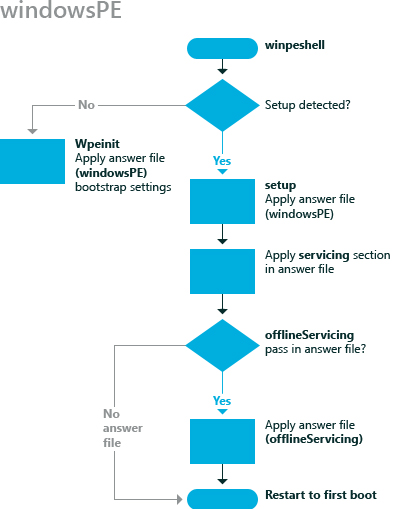

# windowsPE

The **windowsPE** configuration pass is used to configure settings specific to Windows® Preinstallation Environment (Windows PE) in addition to settings that apply to installation.

For example, you can specify the display resolution of Windows PE, where to save a log file, and other Windows PE-related settings.

The following diagram illustrates the **windowsPE** configuration pass.

The **windowsPE** configuration pass also enables you to specify Windows Setup-related settings, including:

-   Partition and format a hard disk.

-   Select a specific Windows image to install, the path of that image, and any credentials required to access that image.

-   Select a partition on the destination computer where you install Windows.

-   Apply a product key and administrator password.

-   Run specific commands during Windows Setup.

## Related topics

[How Configuration Passes Work](how-configuration-passes-work.md)

[auditSystem](auditsystem.md)

[auditUser](audituser.md)

[generalize](generalize.md)

[offlineServicing](offlineservicing.md)

[oobeSystem](oobesystem.md)

 

 

