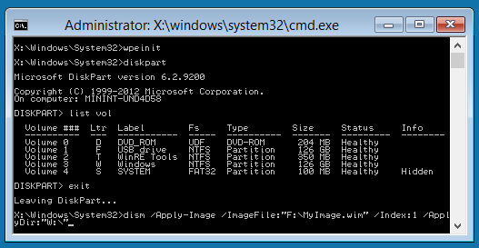

# Windows PE (WinPE)

Windows PE (WinPE) for Windows 10 is a small operating system used to install, deploy, and repair Windows 10 for desktop editions (Home, Pro, Enterprise, and Education), Windows Server 2016, and other Windows operating systems. From Windows PE, you can:

-   Set up your hard drive before installing Windows.
-   Install Windows by using apps or scripts from a network or a local drive.
-   Capture and apply Windows images.
-   Modify the Windows operating system while it's not running.
-   Set up automatic recovery tools.
-   Recover data from unbootable devices.
-   Add your own custom shell or GUI to automate these kinds of tasks.

## Where do I download it?

To get Windows PE, use the installer built into the Windows Assessment and Deployment Kit (Windows ADK). For more info, see [WinPE: Create USB Bootable drive](winpe-create-usb-bootable-drive.md), [WinPE: Create a Boot CD, DVD, ISO, or VHD](winpe-create-a-boot-cd-dvd-iso-or-vhd.md), or see the [Demo: Installing Windows PE on a USB Drive](http://go.microsoft.com/fwlink/?LinkId=279081).

## Support for many Windows features

Windows PE runs the Windows command line environment, and supports these Windows features:

-   **Batch files and scripts**, including support for Windows Script Host (WSH), and ActiveX Data Objects (ADO), and optional support for PowerShell.
-   **Applications**, including Win32 application programming interfaces (APIs) and optional support for HTML Applications (HTA).
-   **Drivers**, including a generic set of drivers that can run networking, graphics, and mass storage devices.
-   **Image capturing and servicing**, including Deployment Image Servicing and Management (DISM).
-   **Networking**, including connecting to file servers using TCP/IP and NetBIOS over TCP/IP via LAN.
-   **Storage**, including NTFS, DiskPart, and BCDBoot.
-   **Security tools**, including optional support for BitLocker and the Trusted Platform Module (TPM), Secure Boot, and other tools.
-   **Hyper-V**, including VHD files, mouse integration, mass storage and network drivers that allow Windows PE to run in a hypervisor.

## Hardware requirements

Windows PE has the same requirements as Windows with these exceptions:

-   No hard drive is required. You can run Windows PE entirely from memory.
-   The base version requires only 512MB of memory. (If you add drivers, packages, or apps, you'll need more memory.)
-   In order to boot Windows PE directly from memory (also known as RAM disk boot), a contiguous portion of physical memory (RAM) which can hold the entire Windows PE (WIM) image must be available. To optimize memory use, manufacturers should ensure that their firmware reserves memory locations either at the beginning or at the end of the physical memory address space.

The 32-bit version of Windows PE can boot 32-bit UEFI and BIOS PCs, and 64-bit BIOS PCs.

The 64-bit version of Windows PE can boot 64-bit UEFI and BIOS PCs.

## Limitations

Windows PE is not a general-purpose operating system. It may not be used for any purpose other than deployment and recovery. It should not be used as a thin client or an embedded operating system. There are other Microsoft products, such as Windows Embedded CE, which may be used for these purposes.

To prevent its use as a production operating system, Windows PE automatically stops running the shell and restarts after 72 hours of continuous use. This period is not configurable.

When Windows PE reboots, all changes are lost, including changes to drivers, drive letters, and the Windows PE registry. To make lasting changes, see [WinPE: Mount and Customize](winpe-mount-and-customize.md).

The default Windows PE installation uses the FAT32 file format, which poses its own limitations, including a maximum 4GB file size and maximum 32GB drive size. To learn more, see [WinPE: Use a single USB key for WinPE and a WIM file (.wim)](winpe--use-a-single-usb-key-for-winpe-and-a-wim-file---wim.md).

Windows PE does not support any of the following:

-   File server or Terminal Server use.
-   Joining to a network domain.
-   Connecting to an IPv4 network from Windows PE on an IPv6 network.
-   Remote Desktop.
-   .MSI installation files.
-   Booting from a path that contains non-English characters.
-   Running 64-bit apps on the 32-bit version of Windows PE.
-   Adding bundled app packages through DISM (.appxbundle packages).

**Note**  In general, use the latest version of WinPE to deploy Windows. If you are using customized WinPE for Windows 10 images, you may prefer to continue using your existing Windows PE image and run the latest version of DISM from a network location. To learn more, see [Copy DISM to Another Computer](copy-dism-to-another-computer.md).

 

**Notes on running Windows Setup in Windows PE:**

-   You can use the 32-bit versions of Windows PE and Windows Setup to install 64-bit versions of Windows. For more information, see [Windows Setup Supported Platforms and Cross-Platform Deployments](windows-setup-supported-platforms-and-cross-platform-deployments.md).
-   Although Windows PE supports dynamic disks, Windows Setup does not. If you install Windows to a dynamic disk created in Windows PE, the dynamic disks won't be available in Windows.
-   For UEFI-based PCs that support both UEFI and legacy BIOS modes, Windows PE needs to be booted in the correct mode in order to correctly install Windows. For more info, see [WinPE: Boot in UEFI or legacy BIOS mode](winpe-boot-in-uefi-or-legacy-bios-mode.md).

## See also

<table>
<colgroup>
<col width="50%" />
<col width="50%" />
</colgroup>
<thead>
<tr class="header">
<th align="left">Content type</th>
<th align="left">References</th>
</tr>
</thead>
<tbody>
<tr class="odd">
<td align="left">
<strong>Product evaluation</strong>
</td>
<td align="left">
[What's New in Windows PE](whats-new-in-windows-pe-s14.md)
</td>
</tr>
<tr class="even">
<td align="left">
<strong>Deployment</strong>
</td>
<td align="left">
[WinPE: Create USB Bootable drive](winpe-create-usb-bootable-drive.md) | [Demo: Installing Windows PE on a USB Drive](http://go.microsoft.com/fwlink/?LinkId=279081) | [WinPE: Create a Boot CD, DVD, ISO, or VHD](winpe-create-a-boot-cd-dvd-iso-or-vhd.md) | [WinPE: Install on a Hard Drive (Flat Boot or Non-RAM)](winpe-install-on-a-hard-drive--flat-boot-or-non-ram.md) | [WinPE: Boot in UEFI or legacy BIOS mode](winpe-boot-in-uefi-or-legacy-bios-mode.md) | [Boot to UEFI Mode or Legacy BIOS mode](boot-to-uefi-mode-or-legacy-bios-mode.md) | [WinPE: Use a single USB key for WinPE and a WIM file (.wim)](winpe--use-a-single-usb-key-for-winpe-and-a-wim-file---wim.md)
</td>
</tr>
<tr class="odd">
<td align="left">
<strong>Operations</strong>
</td>
<td align="left">
[WinPE: Mount and Customize](winpe-mount-and-customize.md) | [WinPE: Add drivers](winpe-add-drivers.md) | [WinPE: Storage Area Network (SAN) Policy](winpe-storage-area-network--san--policy.md) | [WinPE: Create Apps](winpe-create-apps.md) | [WinPE: Optimize and shrink the image](winpe-optimize.md)
</td>
</tr>
<tr class="even">
<td align="left">
<strong>Troubleshooting</strong>
</td>
<td align="left">
[WinPE Network Drivers: Initializing and adding drivers](winpe-network-drivers-initializing-and-adding-drivers.md) | [WinPE: Debug Apps](winpe-debug-apps.md) |
</td>
</tr>
<tr class="odd">
<td align="left">
<strong>Tools and settings</strong>
</td>
<td align="left">
[Copype Command-Line Options](copype-command-line-options.md) | [Drvload Command-Line Options](drvload-command-line-options.md) | [Makewinpemedia Command-Line Options](makewinpemedia-command-line-options.md) | [Wpeinit and Startnet.cmd: Using WinPE Startup Scripts](wpeinit-and-startnetcmd-using-winpe-startup-scripts.md) | [WinPE: Identify drive letters with a script](winpe-identify-drive-letters.md) | [Wpeutil Command-Line Options](wpeutil-command-line-options.md) | [WinPE: Add packages (Optional Components Reference)](winpe-add-packages--optional-components-reference.md)
</td>
</tr>
<tr class="even">
<td align="left">
<strong>Technologies based on Windows PE</strong>
</td>
<td align="left">
[Windows Setup](windows-setup-technical-reference.md) | [Windows Recovery Environment](windows-recovery-environment--windows-re--technical-reference.md) | [Diagnostic and Recovery Toolset](http://go.microsoft.com/fwlink/?LinkId=294156)
</td>
</tr>
</tbody>
</table>

 

 

 

