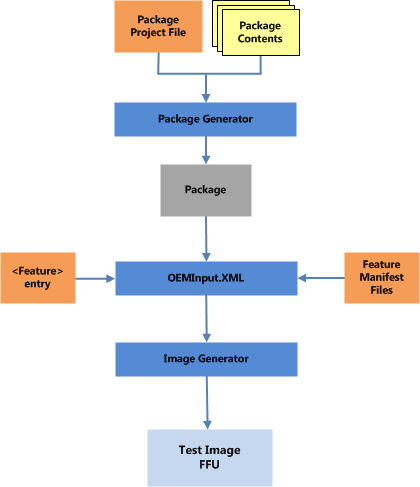

# Adding a driver to a test image


This topic shows you how to create a feature and add it to a test image.

## <a href="" id="process-overview---adding-a-driver-feature-to-a-test-image"></a>Process overview – adding a driver feature to a test image


To create a feature that contains a driver and add it to a test image, complete the following steps.

1.  [Create a test KMDF driver](#create-test)

2.  [Generate the driver package](#generate-the-driver)

3.  [Create a feature manifest file that references the package](#create-a-feature)

4.  [Add the feature to the OEMInput.xml file](#add-a-feature)

5.  [Generate, sign, and flash the image to the device](#generate-sign)

6.  [Verify that the KMDFDriver1 is on the device](#verify)

7.  [Verify that the driver loads using Windows debug](#windbg)

The following diagram summarizes the packaging and image generation elements that are used to add the driver to the device.



## <a href="" id="walkthrough---adding-a-driver-to-a-test-image"></a>Walkthrough – adding a driver to a test image


This topic describes the steps that you need to perform to add a driver to a test image. Before you can start this walkthrough, you must first create a simple KMDF driver.

This walkthrough assumes that you named the project *KmdfDriver1*.

### <a href="" id="create-test"></a>Create a test KMDF driver

To create a test KMDF driver, complete the following steps.

1.  In the **Solution Explorer** window, expand **KmdfDriver1** and then expand the **Source Files Folder**.

2.  Edit the "Driver.c" file by clicking it.

3.  Right after the variable declaration section, add the **IoReportRootDevice** routine as show below. The **IoReportRootDevice** routine reports a device that cannot be detected by a PnP bus driver to the PnP Manager. This allows the software-only driver to remain loaded.

    ``` syntax
    ...
    {
        WDF_DRIVER_CONFIG config;
        NTSTATUS status;
        WDF_OBJECT_ATTRIBUTES attributes;

       //
       // IoReportRootDevice routine reports a device that cannot be detected by 
       // a PnP bus driver to the PnP Manager. This allows our software-only
       // driver to remain loaded.  
      IoReportRootDevice(DriverObject);

        //
        // Initialize WPP tracing.
        //
        WPP_INIT_TRACING( DriverObject, RegistryPath );
        TraceEvents(TRACE_LEVEL_INFORMATION, TRACE_DRIVER, "%!FUNC! Entry");

    ... 
    ```

4.  Save Driver.c.

5.  To build your driver and create a driver package, choose **Build Solution** from the **Build** menu. Visual Studio displays the build progress in the **Output** window. (If the *Output* window is not visible, choose **Output** from the **View** menu.)

6.  To view the built driver package, navigate in Windows Explorer to your **KmdfDriver1** folder, and then to **ARM\\Win8.1Debug\\**. This directory contains the following files:

    -   KmdfDriver1.sys - A kernel-mode driver file.

    -   KmdfDriver1.inf - An information file that Windows uses to install the driver.

    -   KmdfDriver1.pdb – A file that contains the debug symbols that will be used for debugging.

    -   KmdfDriver1.cat - A catalog file that is not used in this walkthrough.

    There are also co-installer files for the Windows Driver Frameworks (WDF) that will not be used with Windows Phone.

7.  Because of the differences in Windows 10 Mobile INF files, we will not use the desktop INF file that is generated by Visual Studio.

    ``` syntax
    ;
    ; KmdfDriver1.inf
    ;
    [Version]
    Signature="$WINDOWS NT$"
    Class=System
    ClassGuid={4d36e97d-e325-11ce-bfc1-08002be10318}
    Provider=%MSFT%
    DriverVer=11/01/2012,1.00.00.00
    BootCritical=1

    [DestinationDirs]
    DefaultDestDir = 12

    [Manufacturer]
    %StdMfg%=KMDFDriver1_DevDesc, NTARM, NTx86

    ;*******************************
    ;** models section (required) **
    ;*******************************
    ; For ARM platforms
    [KMDFDriver1_DevDesc.NTARM]
    ; DisplayName      Section          DeviceId
    ; -----------      -------          --------
    %KMDFDriver1_DevDesc%=KMDFDriver1, Root\KMDFDriver1

    ; For Win2K+
    [KMDFDriver1_DevDesc.NTx86]
    ; DisplayName       Section          DeviceId
    ; -----------       -------          --------
    %KMDFDriver1_DevDesc%=KMDFDriver1, Root\KMDFDriver1

    ;********************************
    ;* ddinstall section (required) *
    ;********************************
    [KMDFDriver1.NT]
    CopyFiles=KMDFDriver1.NT.Copy

    [KMDFDriver1.NT.Copy]
    KMDFDriver1.sys

    ;-------------- Service installation

    [KMDFDriver1.NT.Services]
    AddService = KMDFDriver1, %SPSVCINST_ASSOCSERVICE%, KMDFDriver1_Service_Inst

    [KMDFDriver1_Service_Inst]
    DisplayName    = %KMDFDriver1_DevDesc%
    ServiceType    = %SERVICE_KERNEL_DRIVER%
    StartType      = %SERVICE_SYSTEM_START%
    ErrorControl   = %SERVICE_ERROR_NORMAL%
    ServiceBinary  = %12%\KMDFDriver1.sys


    [Strings]
    SPSVCINST_ASSOCSERVICE= 0x00000002
    MSFT = "Microsoft"
    KMDFDriver1_DevDesc = "KMDF Driver 1"
    SERVICE_KERNEL_DRIVER = 1
    SERVICE_AUTO_START = 2
    SERVICE_SYSTEM_START = 1
    SERVICE_BOOT_START = 0
    SERVICE_ERROR_NORMAL = 1
    ```

8.  Sign the driver using the following commands:

    ``` syntax
    C:>set SIGN_OEM=1 
    sign KMDFDriver1.sys 
    ```

### <a href="" id="generate-the-driver"></a>Generate a package that contains the driver

Generate a package that contains this driver by completing the following steps.

1.  Create a directory called *KMDFDriver1* and copy the KMDFDriver1.sys and KMDFDriver1.inf files that you created in Visual Studio, to that directory.

2.  Create a text file named *KmdfDriver1 .pkg.xml* that contains the following package definition XML.

    ``` syntax
    <?xml version="1.0" encoding="utf-8"?>
    <Package xmlns="urn:Microsoft.WindowsPhone/PackageSchema.v8.00"
      Owner="Contoso"
      OwnerType="OEM"     
      ReleaseType="Test"          
      Platform="DCD6000"          
      Component="Phone.Test.BaseOS"
      SubComponent="KmdfDriver1"
      Partition="MainOS"
      BinaryPartition="false">
      <Components>
        <OSComponent>
            <Files>
                <File Source="KmdfDriver1.sys" DestinationDir="$(runtime.system32)\drivers"/>
            </Files>
        </OSComponent>
        <Driver InfSource="KmdfDriver1.inf">
            <Reference Source="KmdfDriver1.sys"/>
        </Driver>
      </Components>
    </Package>
    ```

    You can update the owner and platform attributes to match the name of your organization name and the name of your device. These attribute changes will modify the name of the generated package.

    Specify the *Windows\\System32\\Drivers* directory on the device using the $(runtime.system32) macro.

3.  The next step is to generate the package by opening an administrator command prompt window.

4.  Display the environment variables by typing **SET** in the administrator command prompt window. Look for *WPDKCONTENTROOT* to confirm that the build environment is properly configured. You should see that WPDKCONTENTROOT is set. On a Windows 64-bit PC, the path should look similar to the following.

    ``` syntax
    ...
    WPDKCONTENTROOT=C:\Program Files (x86)\Windows Kits\10
    ```

5.  Generate the package using PkgGen. Provide the version number of 1.0.0.0. The /config parameter points to the location of the pkggen.cfg.xml file provided with the Windows DriverKit. The /hive parameter points to the location of the hive root.

    ``` syntax
    C:\KmdfDriver1>PkgGen KmdfDriver1.pkg.xml /version:1.0.0.0 /variables:"HIVE_ROOT=%WPDKCONTENTROOT%\CoreSystem" /config:"%WPDKCONTENTROOT%\Tools\bin\i386\pkggen.cfg.xml"
    ```

6.  If PkgGen creates the package successfully, it will display many lines of information as the registry entries are created based on the provided INF file. The last part of the output will be similar to the following.

    ``` syntax
    ... 
    info: Import Log: :      sto: Unloaded hive key '{bf1a281b-ad7b-4476-ac95-f47682
    990ce7}C:/Users/User1/AppData/Local/Temp/gs5gvfgc.pou/windows/system32/config/S
    OFTWARE'. Time = 0 ms
    info: Import Log: : <<<  Section end 2015/08/06 13:10:22.413
    info: Import Log: : <<<  [Exit status: SUCCESS]
    info: Import Log: :
    info: Import Log: :
    info: Import Log: : >>>  [Unload Offline Registry Hive - DRIVERS]
    info: Import Log: : >>>  Section start 2014/08/06 13:10:22.413
    info: Import Log: :        os: Version = 6.3.9600, Service Pack = 0.0, Suite = 0
    x0100, ProductType = 1, Architecture = x86
    info: Import Log: :       cmd: PkgGen  KmdfDriver1.pkg.xml /version:1.0.0.0 /var
    iables:"HIVE_ROOT=C:\Program Files (x86)\Windows Kits\10\CoreSystem" /con
    fig:"C:\Program Files (x86)\Windows Kits\10\Tools\bin\i386\pkggen.cfg.xml
    "
    info: Import Log: :      sto: Closed hive key '{bf1a281b-ad7b-4476-ac95-f4768299
    0ce7}C:/Users/User1/AppData/Local/Temp/gs5gvfgc.pou/windows/system32/config/DRI
    VERS'.
    info: Import Log: :      sto: Unloaded hive key '{bf1a281b-ad7b-4476-ac95-f47682
    990ce7}C:/Users/User1/AppData/Local/Temp/gs5gvfgc.pou/windows/system32/config/D
    RIVERS'. Time = 0 ms
    info: Import Log: : <<<  Section end 2014/08/06 13:10:22.513
    info: Import Log: : <<<  [Exit status: SUCCESS]
    info: Import Log: :
    info: Building package '.\Contoso.Phone.Test.BaseOS.KmdfDriver1.spkg'
    info: Adding file 'KmdfDriver1.sys' to package '.\Contoso.Phone.Test.BaseOS.Kmdf
    Driver1.spkg' as '\windows\System32\drivers\KmdfDriver1.sys'
    info: Adding file 'C:\Users\User1\AppData\Local\Temp\5bgjkx3p.j01\reg.reg' to p
    ackage '.\Contoso.Phone.Test.BaseOS.KmdfDriver1.spkg' as '\Windows\Packages\Regi
    stryFiles\Contoso.Phone.Test.BaseOS.KmdfDriver1.reg'
    info: Adding file 'C:\Users\User1\AppData\Local\Temp\5bgjkx3p.j01\regMultiSz.rg
    a' to package '.\Contoso.Phone.Test.BaseOS.KmdfDriver1.spkg' as '\Windows\Packag
    es\RegistryFiles\Contoso.Phone.Test.BaseOS.KmdfDriver1.rga'
    info: Done package ".\Contoso.Phone.Test.BaseOS.KmdfDriver1.spkg"
    info: Packages are generated to . successfully
    ```

For more information about working with packages, see [Creating packages](creating-mobile-packages.md).

### <a href="" id="create-a-feature"></a>Create a feature manifest file that references the package

Create a feature manifest file that will define a DRIVER1 OEM feature by completing the following steps.

1.  Create a feature manifest file named *OEMCustomAppFM.xml* in the following directory.

    ``` syntax
    %WPDKCONTENTROOT%\FMFiles
    ```

2.  Define the DRIVER1 feature by adding the following XML to the *OEMCustomDriverFM.xml* file. Update the package name to match the name of the package file generated in the previous step.

    ``` syntax
    <?xml version="1.0" encoding="utf-8"?>  
    <FeatureManifest xmlns:xsi="http://www.w3.org/2001/XMLSchema-instance" xmlns:xsd="http://www.w3.org/2001/XMLSchema" xmlns="http://schemas.microsoft.com/embedded/2004/10/ImageUpdate">  
    <!--  DRIVER1 FM File 7/31/2014   -->
      <Features>  
        <OEM>  
          <PackageFile Path="C:\KmdfDriver1\" Name="Contoso.Phone.Test.BaseOS.KmdfDriver1">  
            <FeatureIDs>  
              <FeatureID>DRIVER1</FeatureID>  
            </FeatureIDs>  
          </PackageFile>  
        </OEM>  
      </Features>  
    </FeatureManifest>
    ```

For more information about feature manifests, see [Feature manifest file contents](feature-manifest-file-contents.md).

### <a href="" id="add-a-feature"></a>Add the feature to the OEMInput.xml file

Add the DRIVER1 feature to the OEMInput.xml file by completing the following steps.

1.  This walkthrough assumes that you have an existing, functional test OEMInput file that enables TShell. For more information about creating test images, see [Building and flashing images](building-and-flashing-images.md). For more information about specifying optional features, see [Optional features for building images](optional-features-for-building-images.md).

    Confirm that that you are using a test image that has debugging enabled. For more information, see [Optional features for building images](optional-features-for-building-images.md).

2.  Edit the OEMinput.xml file to include the *OEMCustomAppFM.xml* feature manifest file that you created in the previous step. The XML will be similar to the following.

    ``` syntax
    ...
    <AdditionalFMs>
        ...
        <AdditionalFM>%WPDKCONTENTROOT%\FMFiles\OEMCustomDriverFM.xml</AdditionalFM>
      </AdditionalFMs>
    ```

3.  In the &lt;Features&gt; section of the OEMInput.xml file, add the new DRIVER1 feature to the list of existing features.

    ``` syntax
    <Features>
      <Microsoft>
       ...
      </Microsoft>
      <OEM>
        ...
        <Feature>DRIVER1</Feature>
      </OEM>
    </Features>
    ```

### <a href="" id="generate-sign"></a>Generate, sign, and flash the image to the device

Complete the following steps to generate, sign, and flash the image.

1.  Generate the image using ImgGen and the OEMInput.xml file that you customized in the previous step.

    ``` syntax
    C:\>ImgGen Flash.ffu OEMInput.xml "%WPDKCONTENTROOT%\10\MSPackages"
    ```

2.  Before you can sign images, you must first install the test OEM certificates on the PC by following the steps in [Set up the signing environment](https://msdn.microsoft.com/library/windows/hardware/dn789236).

3.  Sign the generated catalog using the Sign.cmd with the **/pk** option.

    ``` syntax
    C:\> Set SIGN_OEM=1
    C:\> Sign.cmd /pk TestSigned.cat
    ```

4.  Sign the FFU with the signed catalog file using ImageSigner.

    ``` syntax
    C:\> ImageSigner Sign Flash.FFU Flash.Cat
    ```

5.  Flash the image to the phone using FFUTool.

    ``` syntax
    C:\> FFUTool –Flash Flash.ffu
    ```

For more information about generating and flashing images, see [Building and flashing images](building-and-flashing-images.md).

### <a href="" id="verify"></a>Verify that the KMDFDriver1 is on the device

Verify that the KMDFDriver1 is present on the device by using TShell.

1.  Configure a TShell connection to test the image.

2.  Establish a connection to the device using the **Open-device** TShell command. Provide the MAC address of the device.

    ``` syntax
    PS C:\> Open-device 001122334455
    ```

3.  Confirm that the KMDFDriver1 is on the device by using the **Dir-Device** TShell command. The short form of the command, DirD, is shown.

    ``` syntax
    PS C:\> DirD \KMDFDriver1.sys /s
    ```

4.  You should see output similar to the following.

    ``` syntax
    Volume in drive C is MainOS
    Volume Serial Number is 965E-2180
    Directory of C:\windows\system32\DRIVERS
    04/21/2014  05:23 PM              8864 KMDFDriver1.sys
                   1 File(s)           8864 bytes
         Total Files Listed:
                   1 File(s)           8864 bytes
                   0 Dir(s)       409976832 bytes free
    ```

5.  Enable debug output for KdPrint(), KdPrintEx(), and DbgPrint() messages by setting a registry key. Set the registry key so that it is persistent across reboots (for non-retail images) by using the **RegD Add** TShell command.

    ``` syntax
    DEVICE C:\
    PS C:\Windows\system32> RegD Add "HKLM\SYSTEM\ControlSet001\Control\Session Manager\Debug Print Filter" /v DEFAULT /t REG_DWORD /d 0xFFFFFFFF

    The operation completed successfully.
    ```

6.  Confirm that registry key was set by using the **RegD Query** TShell command.

    ``` syntax
    DEVICE C:\
    PS C:\Windows\system32> RegD Query "HKLM\SYSTEM\ControlSet001\Control\Session Manager\Debug Print Filter"

    HKEY_LOCAL_MACHINE\SYSTEM\ControlSet001\Control\Session Manager\Debug Print Filter
        DEFAULT    REG_DWORD    0xffffffff
    ```

### <a href="" id="windbg"></a>Verify that the driver loads using Windows debug

To view the driver load process, complete the following steps to set a debug statement in the driver and connect the device to the kernel debugger.

1.  Open the driver project in Visual Studio.

2.  Add a debug break statement in Driver.c right after the variable declaration section of the DriverEntry routine.

    ``` syntax
       …
        WDF_DRIVER_CONFIG config;
        NTSTATUS status;
        WDF_OBJECT_ATTRIBUTES attributes;

        // Debug break statement to stop loading of OS 
        // Debugger must be attached to allow the device to boot
         __debugbreak();
    …
    ```

    **Warning**  
    The debug break statement will stop the phone from booting unless a debugger is attached to the device.

     

3.  Rebuild the project in Visual Studio.

4.  If necessary, copy the updated .sys file to the directory that you will use to create to generate the package.

5.  Then, repeat the steps described above to:

    1.  Generate an updated driver package.

    2.  Generate, sign, and flash the image.

    **Note**  
    It is also possible to update the version of the driver by including the driver version in the INF file and then using the IUTool to deploy the updated driver to the phone. For more information about using IUTool, see [IUTool.exe: Update packages on a phone](update-packages-on-a-phone-and-get-package-update-logs.md). This process is similar to the process that is used to create a driver update. For more information about that, see [Update a KMDF device driver](https://msdn.microsoft.com/windows/hardware/commercialize/service/mobile/update-a-kmdf-device-driver).

     

6.  Set up a KDNET over USB connection to the phone for debugging.

7.  Start the Windows debugger.

    ``` syntax
    windbg -k net:port=5000,key=1.2.3.4
    ```

8.  After the device has booted, it will hit the break point and code execution will stop. The debugger will indicate that break point has been hit.

9.  Set the symbol path to the location of the Windows Driver Kit symbols and reload the symbols.

    ``` syntax
    .SYMPATH+ C:\SYMBOLS
    .reload /f
    ```

10. Set the source path to the location of your .c source code that you created earlier in Visual Studio.

    ``` syntax
    .srcpath+ C:\KMDFDriver1\Source\
    ```

11. List the call stack by using the **k** command.

    ``` syntax
    0: kd> k
    # Child-SP RetAddr  Call Site
    00 85679c68 90fd2abe KMDFDriver1!DriverEntry+0xa
    01 85679ce0 90fd2b38 KMDFDriver1!FxDriverEntryWorker+0x6a
    02 85679d00 81770990 KMDFDriver1!FxDriverEntry+0x18
    *** ERROR: Symbol file could not be found.  Defaulted to export symbols for ntkrnlmp.exe - 
    03 85679d10 818f8004 nt!SeTokenIsAdmin+0x1790
    04 85679e10 8190d630 nt!KeFindConfigurationNextEntry+0x7c48
    05 85679e68 8185719e nt!KeHwPolicyLocateResource+0x4698
    06 85679e70 814c5e0c nt!IoReplacePartitionUnit+0x192
    07 85679e80 81460172 nt!IoAllocateIrp+0x57c
    08 85679ec8 00000000 nt!KiDispatchInterrupt+0x234a
    ```

    The call stack is the chain of function calls that have led to the current location of the program counter. The top function on the call stack is the current function, and the next function is the function that called the current function, and so on.

12. Display symbol information associated with KMDFDriver1 using the **x** command.

    ``` syntax
    0: kd> x KMDFDriver1!*
    90fd4750          KMDFDriver1!WdfDriverGlobals = 0x88ff4de8
    90fd4754          KMDFDriver1!WdfDriverStubDriverObject = 0x88fed768
    90fd4004          KMDFDriver1!__security_cookie_complement = 0x568f867
    90fd336c          KMDFDriver1!__gsfailure_xdata_end = <unknown base type 80000013>
    90fd33b4          KMDFDriver1!__memcpy_reverse_large_neon_xdata = <unknown base type 80000013>
    90fd30c0          KMDFDriver1!WPP_c0dfc8e231dc218098dc0c2ed20d6e73_Traceguids = struct _GUID [1]
    90fd30a0          KMDFDriver1!GUID_DEVINTERFACE_KmdfDriver1 = struct _GUID {e7a4cfb0-56d4-4234-bf60-fe627cb5e981}
    90fd474c          KMDFDriver1!WdfDriverStubDisplacedDriverUnload = 0x00000000
    90fd3370          KMDFDriver1!memcpy_xdata_prolog = <unknown base type 80000013>
    90fd3388          KMDFDriver1!__memcpy_forward_large_neon_xdata = <unknown base type 80000013>
    90fd4758          KMDFDriver1!WdfDriverStubOriginalWdfDriverMiniportUnload = 0x00000000
    ```

13. List information about the modules on KMDFDriver1 by using the **lm m** command.

    ``` syntax
    0: kd> lm m KMDFDriver1 v
    Browse full module list
    start    end        module name
    90fd1000 90fd9000   KMDFDriver1   (private pdb symbols)  c:\kmdfdriver1\KmdfDriver1.pdb
        Loaded symbol image file: KMDFDriver1.sys
        Image path: KMDFDriver1.sys
        Image name: KMDFDriver1.sys
        Browse all global symbols  functions  data
        Timestamp:        Thu Jul 31 14:39:34 2014 (53DAB796)
        CheckSum:         000037D2
        ImageSize:        00008000
        Translations:     0000.04b0 0000.04e4 0409.04b0 0409.04e
    ```

14. Load the WDF driver extensions using the **.load** command.

    ``` syntax
    .load C:\Program Files (x86)\Windows Kits\10\Debuggers\x86\winext\Wdfkd.dll
    ```

15. Confirm that the WDF debug extension is loaded by using the **!wdfkd.help** WDK driver extension help command.

    ``` syntax
    !wdfkd.help
    ```

16. Display information about the driver using the **!wdfkd.wdfdriverinfo** command.

    ``` syntax
    0: kd> !wdfkd.wdfdriverinfo KMDFDriver1
    ----------------------------------
    Default driver image name: KMDFDriver1
    WDF library image name: Wdf01000
    FxDriverGlobals  0x90584008
    WdfBindInfo      0x913d8008
       Version        v1.11
    Library module   0x8283b528
       ServiceName    \Registry\Machine\System\CurrentControlSet\Services\Wdf01000
       ImageName      Wdf01000
    ----------------------------------
    Driver Handles is NULL
    ```

17. End the debugging session using the **qd** quit and detach command.

    ``` syntax
    0: kd> qd
    ```

 

 

[Send comments about this topic to Microsoft](mailto:wsddocfb@microsoft.com?subject=Documentation%20feedback%20%5Bp_phFlashing\p_phFlashing%5D:%20Adding%20a%20driver%20to%20a%20test%20image%20%20RELEASE:%20%2810/4/2016%29&body=%0A%0APRIVACY%20STATEMENT%0A%0AWe%20use%20your%20feedback%20to%20improve%20the%20documentation.%20We%20don't%20use%20your%20email%20address%20for%20any%20other%20purpose,%20and%20we'll%20remove%20your%20email%20address%20from%20our%20system%20after%20the%20issue%20that%20you're%20reporting%20is%20fixed.%20While%20we're%20working%20to%20fix%20this%20issue,%20we%20might%20send%20you%20an%20email%20message%20to%20ask%20for%20more%20info.%20Later,%20we%20might%20also%20send%20you%20an%20email%20message%20to%20let%20you%20know%20that%20we've%20addressed%20your%20feedback.%0A%0AFor%20more%20info%20about%20Microsoft's%20privacy%20policy,%20see%20http://privacy.microsoft.com/default.aspx. "Send comments about this topic to Microsoft")


