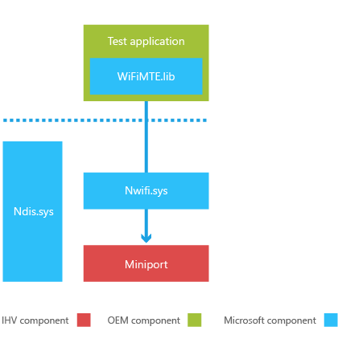

# Adding Wi-Fi manufacturing test support to the OID interface

To ensure that all device components are integrated, functioning correctly, calibrated properly, and meet all regulatory requirements, OEMs run a number of standard ad-hoc tests to ensure that any problems are found and corrected before the device goes to retail. These tests are also occasionally run at retail outlets to check for proper component operation. The implementation of these test interfaces and mechanisms is performed by hardware vendors (IHVs).

This section describes an extension to the existing [Wi-Fi OID documentation](http://msdn.microsoft.com/library/ff560670.aspx) so that IHVs can implement a standard set of interfaces that OEMs can use to create test applications.

## Assumptions

To perform these manufacturing tests, the device must be operating in a special operation mode called manufacturing mode. In manufacturing mode, only specific parts of the operating system are loaded in order to enable the proper execution of the component tests. Normal Wi-Fi operations, such as scanning and automatically connecting to networks, are disabled when the device is running in manufacturing mode.

Manufacturing mode can be entered in the manufacturing environment or during customer service. Writing to the Device Provisioning Partition (DPP) can only be performed in the manufacturing environment. If an OID that writes to the DPP is invoked in a non-manufacturing environment, the attempt to write to the DPP fails. Manufacturing operations should have only a transient effect on the system, and the state should not persist across reboots.

## Driver requirements

The Wi-Fi miniport driver must be able to operate in normal mode or manufacturing test mode, and it must be able to switch between modes at any time. The driver determines the appropriate mode during initialization by querying a specific registry key.

The following illustration shows the architecture of the manufacturing test environment.

## In this section

[Reporting operating mode capabilities](reporting-operating-mode-capabilities.md)  
Describes the requirements and behavior for reporting changes with drivers operating in manufacturing test mode.

[Supporting updated OID behavior in manufacturing mode](supporting-updated-oid-behavior-in-manufacturing-mode.md)  
Describes the updated OIDs that must be supported by the Wi-Fi miniport driver.

[Supporting existing OID commands in manufacturing mode](supporting-existing-oid-commands-in-manufacturing-mode.md)  
Describes the existing OIDs that must be supported by the Wi-Fi miniport driver.

[Supporting new OID commands for manufacturing mode](supporting-new-oid-commands-for-manufacturing-mode.md)  
Describes the new OIDs that must be supported by the Wi-Fi miniport driver.

[Supporting new callbacks for manufacturing mode](supporting-new-callbacks-for-manufacturing-mode.md)  
Describes the new OID callback that must be supported by the Wi-Fi miniport driver.

 

 

