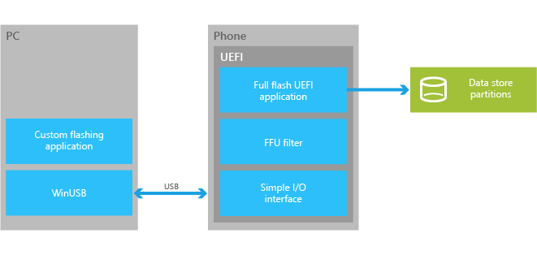
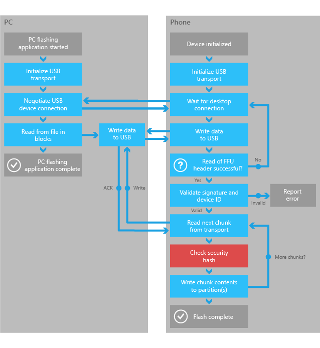

# Developing custom OEM flashing tools

OEMs can use the full flash update (FFU) image format and simple UEFI USB protocols to create custom flashing tools. An OEM custom flashing tool can integrate in with existing systems and support a range of scenarios discussed in [Flashing tools](flashing-tools.md).

## UEFI flashing application

The OEM must flash the device from a UEFI application using a specific image layout that is discussed in [FFU image format](ffu-image-format.md).

This diagram summarizes the communication flow from the PC flashing tool to the device using the UEFI simple Windows Phone I/O protocol.

For more info on available USB APIs see, [UEFI flashing protocols](https://msdn.microsoft.com/windows/hardware/dn917884.aspx).

## PC flashing application

The image is transferred to the device that is running the UEFI flashing application using a simple PC side client program. The PC application establishes a USB connection to the device and writes the data over that connection. The validation and verification of the image occurs in the UEFI flashing application running on the device.

The following diagram summarizes the overall flow of the OEM custom flashing PC application and the UEFI application.

**Note**  
This diagram illustrates one possible solution. The OEM is encouraged to modify this approach to create an optimal solution that best suits their needs.

 

## Checking SMBIOS values before flashing

To ensure that the correct image is flashed to the proper device, the OEM must check the SMBIOS system information structure values on the device. The check must confirm that the device platform ID values in the image, matches the SMBIOS system information structure values on the phone. Either the Manufacturer.Family.ProductName.Version or Manufacturer.Family.ProductName from SMBIOS must match the value in the image before flashing can proceed.

The device platform ID string is shown below.

**Manufacturer.Family.ProductName.Version**

### Engineering devices and blank device IDs

With a new engineering device, the OEM can use the SMBIOS values to determine if it is acceptable to flash an image that contains test signed certificates. The OEM may determine that test signed images may have blank system information structure values, where production signed images must have SMBIOS system information structure values that have been populated.

## Implementing signed image validation

FFU images contain elements such as hashes, signatures and catalogs, which must be used to validate the image. For more info, see [Implementing image integrity validation in custom flashing tools](implementing-image-integrity-validation-in-custom-flashing-tools.md).

## UEFI flashing protocols

[UEFI USB function protocol](https://msdn.microsoft.com/library/windows/hardware/dn789231)  
Describes the **EFI\_USBFN\_IO\_PROTOCOL**.

[UEFI simple I/O protocol](https://msdn.microsoft.com/library/windows/hardware/dn772121)  
Describes the **EFI\_SIMPLE\_WINPHONE\_IO\_PROTOCOL**.

[UEFI check signature protocol](https://msdn.microsoft.com/library/windows/hardware/dn772115)  
Describes the **EFI\_CHECKSIG\_PROTOCOL**.

## Related topics

[Flashing tools](flashing-tools.md)

[Manufacturing](index.md)

 

 

