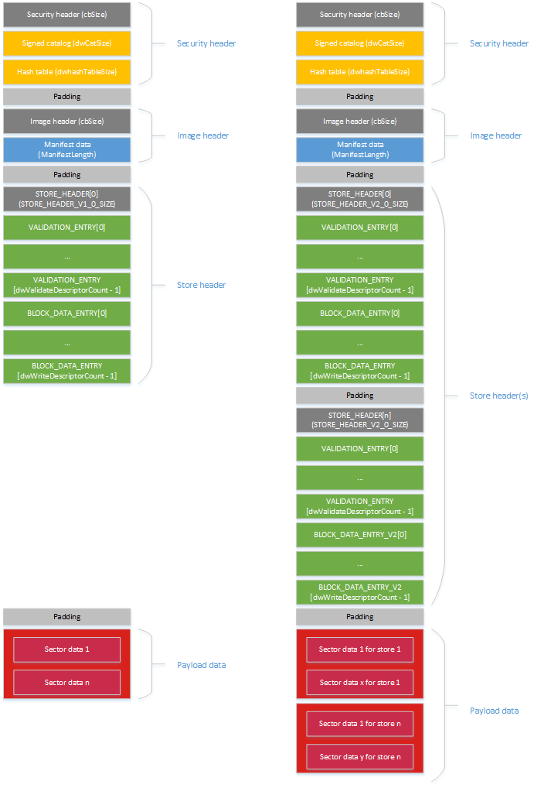

# FFU image format


The following diagram shows both V1 and V2 FFU format. A major changed introduced in V2 FFU format is the support for multiple data stores – each store contains sector-based data targeting a unique physical partition.



## <span id="Security_header_region"></span><span id="security_header_region"></span><span id="SECURITY_HEADER_REGION"></span>Security header region


<span id="cbSize"></span><span id="cbsize"></span><span id="CBSIZE"></span>cbSize  
The size of the SECURITY\_HEADER struct. Used in conjunction with the signature string to identify the FFU security header.

<span id="Signature_string"></span><span id="signature_string"></span><span id="SIGNATURE_STRING"></span>Signature string  
A hard-coded ASCII string of "SignedImage " that identifies this image as a secure FFU image.

<span id="Chunk_size_in_KB"></span><span id="chunk_size_in_kb"></span><span id="CHUNK_SIZE_IN_KB"></span>Chunk size in KB  
The size of chunks used to generate the hash table. Used to break the image up into hashable chunks for validation against the hash table entries and ensure the image has not been tampered with since creation.

<span id="Hash_algorithm_ID"></span><span id="hash_algorithm_id"></span><span id="HASH_ALGORITHM_ID"></span>Hash algorithm ID  
Defines which hash algorithm was used to generate the hash table.

<span id="Catalog_size"></span><span id="catalog_size"></span><span id="CATALOG_SIZE"></span>Catalog size  
The size in bytes of the catalog after the security header.

<span id="Hash_table_size"></span><span id="hash_table_size"></span><span id="HASH_TABLE_SIZE"></span>Hash table size  
The size in bytes of the hash table after the security header and catalog.

**Security header**, byte count: cbSize

``` syntax
#define SECURITY_SIGNATURE "SignedImage "

typedef struct _SECURITY_HEADER
{
    UINT32 cbSize;            // size of struct, overall
    BYTE   signature[12];     // "SignedImage "
    UINT32 dwChunkSizeInKb;   // size of a hashed chunk within the image
    UINT32 dwAlgId;           // algorithm used to hash
    UINT32 dwCatalogSize;     // size of catalog to validate
    UINT32 dwHashTableSize;   // size of hash table
} SECURITY_HEADER;
```

**Signed Catalog**, byte count: dwCatalogSize

A catalog file containing the hash of the hash table blob that will be signed and must match one of the certificates on the device. This approach allows checking for a signature up front without having the full image on the device before flashing. Streaming data is checked as it is received against the hash table entries.

**Hash table data**, byte count: dwHashTableSize

The actual hashes for each chunk of the base image. Chunk validation begins at the image header and ends at the end of the FFU.

**Padding** - next section starts on a chunk boundary, byte count: variable

After the hash table padding (blank space) is added to fill out to current chunk. This ensures that the full secure header, catalog, and hash table end at a chunk boundary and the actual image header and beyond are chunk aligned.

## <span id="Image_header_region"></span><span id="image_header_region"></span><span id="IMAGE_HEADER_REGION"></span>Image header region


<span id="cbSize"></span><span id="cbsize"></span><span id="CBSIZE"></span>cbSize  
The size in bytes of the ImageHeader struc. Used in conjunction with the signature string to identify the FFU image header.

<span id="Signature_string"></span><span id="signature_string"></span><span id="SIGNATURE_STRING"></span>Signature string  
A hard-coded string of "ImageFlash " that identifies this image as an FFU image.

<span id="Manifest_Length"></span><span id="manifest_length"></span><span id="MANIFEST_LENGTH"></span>Manifest Length  
The size in bytes of the manifest data immediately following the image header.

<span id="Chunk_size"></span><span id="chunk_size"></span><span id="CHUNK_SIZE"></span>Chunk size  
The size of chunks used to generate the hash table. Used to break the image up into hashable chunks for validation against the hash table entries and ensure the image has not been tampered with since creation. This should match the chunk size in the secure header. Used only during image validation.

**Image header**, byte count: cbSize

``` syntax
#define FFU_SIGNATURE "ImageFlash  "

typedef struct _IMAGE_HEADER
{
    DWORD  cbSize;           // sizeof(ImageHeader)
    BYTE   Signature[12];    // "ImageFlash  "
    DWORD  ManifestLength;   // in bytes
    DWORD  dwChunkSize;      // Used only during image generation.
} ImageHeader;
```

**Manifest data**, byte count: ManifestLength

The manifest contains the description of the device layout and the payload included in the FFU.

**Padding** byte count: variable

After the manifest padding (blank space) is added to fill out to current chunk. This ensures that the data that follows begins on a chunk boundary.

## <span id="Store_header_region"></span><span id="store_header_region"></span><span id="STORE_HEADER_REGION"></span>Store header region


### <span id="Store_header"></span><span id="store_header"></span><span id="STORE_HEADER"></span>Store header

<span id="Store_header__byte_count__STORE_HEADER_V1_0_SIZE__248_bytes_"></span><span id="store_header__byte_count__store_header_v1_0_size__248_bytes_"></span><span id="STORE_HEADER__BYTE_COUNT__STORE_HEADER_V1_0_SIZE__248_BYTES_"></span>**Store header**, byte count: STORE\_HEADER\_V1\_0\_SIZE (248 bytes)  
The store header contains metadata that describes the payload. This includes update type, validation size, data size, and versioning. Some information is redundant, but is included for convenience.

The store header contains the DWORD count/length fields that describe the validation & write descriptor sections.  This allows those sections to be copied out and processed later.

In V1 FFU format, you should see only one store header. In V2 FFU format, you should expect to see a number of store headers, depending on the value defined by the NumOfStores struct.

<span id="Validation_descriptor_region"></span><span id="validation_descriptor_region"></span><span id="VALIDATION_DESCRIPTOR_REGION"></span>Validation descriptor region  
The validation descriptor region is a collection of VALIDATION\_ENTRY structs.  There are dwValidateDescriptorCount of them, and the overall byte count of the region is dwValidateDescriptorLength.

<span id="Write_descriptor_region"></span><span id="write_descriptor_region"></span><span id="WRITE_DESCRIPTOR_REGION"></span>Write descriptor region  
The write descriptor region is a collection of BLOCK\_DATA\_ENTRY structs.  There are dwWriteDescriptorCount of them, and the overall size in bytes of the region is dwWriteDescriptorLength.

<span id="MajorVersion__MinorVersion"></span><span id="majorversion__minorversion"></span><span id="MAJORVERSION__MINORVERSION"></span>MajorVersion, MinorVersion  
Major and minor versions of the store header.

<span id="FullFlashMajorVersion__FullFlashMinorVersion_"></span><span id="fullflashmajorversion__fullflashminorversion_"></span><span id="FULLFLASHMAJORVERSION__FULLFLASHMINORVERSION_"></span>FullFlashMajorVersion, FullFlashMinorVersion   
Major and minor versions of the full flash update file format.

The following table shows the version values for V1 and V2 ffu image formats.

<table>
<colgroup>
<col width="33%" />
<col width="33%" />
<col width="33%" />
</colgroup>
<tbody>
<tr class="odd">
<td align="left"></td>
<td align="left">V1</td>
<td align="left">V2</td>
</tr>
<tr class="even">
<td align="left"><p>MajorVersion</p></td>
<td align="left"><p>1</p></td>
<td align="left"><p>2</p></td>
</tr>
<tr class="odd">
<td align="left"><p>MinorVersion</p></td>
<td align="left"><p>0</p></td>
<td align="left"><p>0</p></td>
</tr>
<tr class="even">
<td align="left"><p>FullFlashMajorVersion</p></td>
<td align="left"><p>2</p></td>
<td align="left"><p>2</p></td>
</tr>
<tr class="odd">
<td align="left"><p>FullFlashMinorVersion</p></td>
<td align="left"><p>0</p></td>
<td align="left"><p>0</p></td>
</tr>
</tbody>
</table>

 

**Note**  
-   The OEM should not flash the image to the device unless the version of the image matches these values.

 

<span id="NumOfStores__V2_only_"></span><span id="numofstores__v2_only_"></span><span id="NUMOFSTORES__V2_ONLY_"></span>NumOfStores (V2 only)  
Number of stores and their payloads in this FFU.

<span id="StoreIndex__V2_only_"></span><span id="storeindex__v2_only_"></span><span id="STOREINDEX__V2_ONLY_"></span>StoreIndex (V2 only)  
Current store index, starting from 1.

<span id="StorePayloadSize__V2_only_"></span><span id="storepayloadsize__v2_only_"></span><span id="STOREPAYLOADSIZE__V2_ONLY_"></span>StorePayloadSize (V2 only)  
Size of the store payload in bytes, excluding padding.

<span id="DevicePathLength__V2_only_"></span><span id="devicepathlength__v2_only_"></span><span id="DEVICEPATHLENGTH__V2_ONLY_"></span>DevicePathLength (V2 only)  
Size of the device path that follows, in characters, without including the terminating null character.

<span id="DevicePath__V2_only_"></span><span id="devicepath__v2_only_"></span><span id="DEVICEPATH__V2_ONLY_"></span>DevicePath (V2 only)  
Actual device path that the store is targeted for. This should be the same as device path retrieved from UEFI protocol: DEVICE\_PATH\_TO\_TEXT\_PROTOCOL. ConvertDevicePathToText()

``` syntax
typedef struct _STORE_HEADER
{
    UINT32 dwUpdateType; // indicates partial or full flash
    UINT16 MajorVersion, MinorVersion; // used to validate struct
    UINT16 FullFlashMajorVersion, FullFlashMinorVersion; // FFU version, i.e. the image format
    char szPlatformId[192]; // string which indicates what device this FFU is intended to be written to
    UINT32 dwBlockSizeInBytes; // size of an image block in bytes – the device’s actual sector size may differ
    UINT32 dwWriteDescriptorCount; // number of write descriptors to iterate through
    UINT32 dwWriteDescriptorLength; // total size of all the write descriptors, in bytes (included so they can be read out up front and interpreted later)
    UINT32 dwValidateDescriptorCount; // number of validation descriptors to check
    UINT32 dwValidateDescriptorLength; // total size of all the validation descriptors, in bytes
    UINT32 dwInitialTableIndex; // block index in the payload of the initial (invalid) GPT
    UINT32 dwInitialTableCount; // count of blocks for the initial GPT, i.e. the GPT spans blockArray[idx..(idx + count -1)]
    UINT32 dwFlashOnlyTableIndex; // first block index in the payload of the flash-only GPT (included so safe flashing can be accomplished)
    UINT32 dwFlashOnlyTableCount; // count of blocks in the flash-only GPT
    UINT32 dwFinalTableIndex; // index in the table of the real GPT
    UINT32 dwFinalTableCount; // number of blocks in the real GPT
    UINT16 NumOfStores; // Total number of stores (V2 only)
    UINT16 StoreIndex; // Current store index, 1-based (V2 only)
    UINT64 StorePayloadSize; // Payload data only, excludes padding (V2 only)
    UINT16 DevicePathLength; // Length of the device path (V2 only)
    CHAR16 DevicePath[1]; // Device path has no NUL at then end (V2 only)
} STORE_HEADER;
```

### <span id="Validation_Entries"></span><span id="validation_entries"></span><span id="VALIDATION_ENTRIES"></span>Validation Entries

**Validation entries**, element count: dwValidateDescriptorCount, byte count: dwValidateDescriptorLength

The validation section is used only for partial updates. It contains a set of VALIDATION\_ENTRY structs. Each validation entry contains a byte array and a range on disk to compare. If the data in the validation entry matches the data on disk, that validation entry is confirmed. If and only if all validation entries are confirmed, the partial update is safe to apply to the device.

**Validation entry**, byte count: variable

Each VALIDATION\_ENTRY struct describes a location on disk that whose data should match the byte array in that entry.

``` syntax
typedef struct _VALIDATION_ENTRY
{
    UINT32 dwSectorIndex;
    UINT32 dwSectorOffset;
    UINT32 dwByteCount;
    BYTE rgCompareData[1]; // size is dwByteCount
} VALIDATION_ENTRY;
```

### <span id="Block_data_entries"></span><span id="block_data_entries"></span><span id="BLOCK_DATA_ENTRIES"></span>Block data entries

**Block data entries**, element count: dwWriteDescriptorCount, byte count: dwWriteDescriptorLength

The block data entries describe how to write the data to disk. It is possible to write a single area of the disk more than once or to write the same data to multiple places on the disk, allowing for a compressed payload. The write descriptor region is composed of BLOCK\_DATA\_ENTRY structs. Each entry has a size and a byte array, and an array of locations to write to disk.

The fields **dwFlashOnlyTableIndex** and **dwFlashOnlyTableCount** are used to determine the last block entry that is necessary to lay out all of the partitions required to re-flash the device. If all of the blocks up to and including this block are successfully flashed to the device, the device can be re-flashed without requiring any silicon vendor or OEM code.

**Block data entry**, byte count: variable

Each block data entry describes a block of data in the store data section. Each entry describes the number of data blocks and the locations to which they should be written on disk. The accessMethod is used like the accessMethod in SetFilePointer, meaning that it gives meaning to the blockIndex.

``` syntax
enum DISK_ACCESS_METHOD
{
    DISK_BEGIN  = 0,
    DISK_END    = 2
};

typedef struct _DISK_LOCATION
{
    UINT32 dwDiskAccessMethod;
    UINT32 dwBlockIndex;
} DISK_LOCATION; 

typedef struct _BLOCK_DATA_ENTRY
{
    UINT32 dwLocationCount;
    UINT32 dwBlockCount;
    DISK_LOCATION rgDiskLocations[1];
} BLOCK_DATA_ENTRY;
```

### <span id="Padding"></span><span id="padding"></span><span id="PADDING"></span>Padding

**Padding** – to allow the next section to start on a block boundary, byte count: variable

## <span id="Image_payload_region"></span><span id="image_payload_region"></span><span id="IMAGE_PAYLOAD_REGION"></span>Image payload region


The payload of block data to be written to disk, byte count: variable.

This is an array of data blocks. Each data block consists of **BytesPerBlock** bytes, where **BytesPerBlock** is defined in the store header.

In V1 FFU format, you should see only one image payload region. in V2 FFU format, you should expect to see a number of image payload regions depending on the value defined by the NumOfStores struct.

## <span id="related_topics"></span>Related topics


[Flashing tools](flashing-tools.md)

 

 


