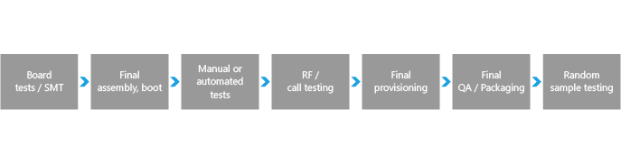
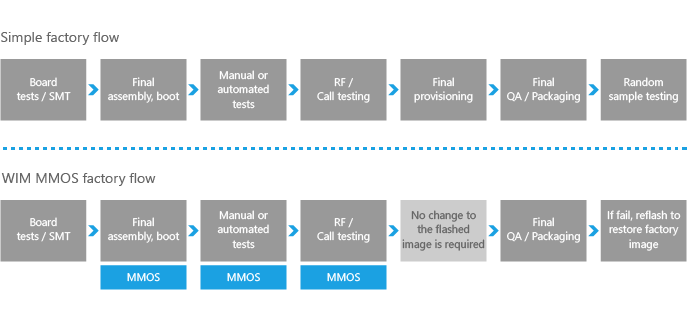
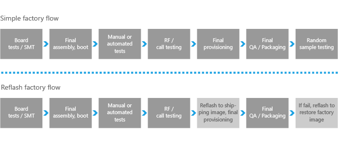

# Mobile manufacturing

After you have a completed the steps covered in the other guides to prepare the device, the focus shifts to preparing the device for the final retail configuration.

During this process, you set the final configuration values, remove debug logging, and optimize the OS for shipment. Next, you determine how the OS will be transferred to the device hardware in the manufacturing line.

## Manufacturing acronyms

Here are some common acronyms that might come in handy.

<table>
<colgroup>
<col width="50%" />
<col width="50%" />
</colgroup>
<tbody>
<tr class="odd">
<td align="left">
<strong>ATE</strong>
</td>
<td align="left">
automated test equipment
</td>
</tr>
<tr class="even">
<td align="left">
<strong>BER</strong>
</td>
<td align="left">
bit error rate
</td>
</tr>
<tr class="odd">
<td align="left">
<strong>BIST</strong>
</td>
<td align="left">
built-in self-test
</td>
</tr>
<tr class="even">
<td align="left">
<strong>COT</strong>
</td>
<td align="left">
cost of test
</td>
</tr>
<tr class="odd">
<td align="left">
<strong>CIT Testing</strong>
</td>
<td align="left">
computer interactive testing—semi-automated testing of the device. During this stage, the device is connected to a PC or workstation
</td>
</tr>
<tr class="even">
<td align="left">
<strong>DIB</strong>
</td>
<td align="left">
device interface board
</td>
</tr>
<tr class="odd">
<td align="left">
<strong>DFT</strong>
</td>
<td align="left">
designed for test
</td>
</tr>
<tr class="even">
<td align="left">
<strong>DUT</strong>
</td>
<td align="left">
device under test
</td>
</tr>
<tr class="odd">
<td align="left">
<strong>ESD</strong>
</td>
<td align="left">
electrostatic discharge
</td>
</tr>
<tr class="even">
<td align="left">
<strong>EVM</strong>
</td>
<td align="left">
error vector magnitude
</td>
</tr>
<tr class="odd">
<td align="left">
<strong>FA</strong>
</td>
<td align="left">
final assembly
</td>
</tr>
<tr class="even">
<td align="left">
<strong>FQC</strong>
</td>
<td align="left">
final quality check
</td>
</tr>
<tr class="odd">
<td align="left">
<strong>NIST</strong>
</td>
<td align="left">
National Institute of Standards and Technology
</td>
</tr>
<tr class="even">
<td align="left">
<strong>OOBT</strong>
</td>
<td align="left">
out-of-the-box test
</td>
</tr>
<tr class="odd">
<td align="left">
<strong>PIB</strong>
</td>
<td align="left">
probe interface board
</td>
</tr>
<tr class="even">
<td align="left">
<strong>RTC</strong>
</td>
<td align="left">
real-time clock—on-board hardware clock used to track the current time
</td>
</tr>
<tr class="odd">
<td align="left">
<strong>SCM</strong>
</td>
<td align="left">
subcontract manufacturer
</td>
</tr>
<tr class="even">
<td align="left">
<strong>SOC</strong>
</td>
<td align="left">
system on a chip
</td>
</tr>
<tr class="odd">
<td align="left">
<strong>UPH</strong>
</td>
<td align="left">
units per hour
</td>
</tr>
<tr class="even">
<td align="left">
<strong>UUT</strong>
</td>
<td align="left">
unit under test
</td>
</tr>
</tbody>
</table>

 

## General manufacturing guidance

The goal for Windows 10 Mobile is that partners are successful in establishing efficient and effective processes that span manufacturing, testing, and servicing. To that end, Microsoft will provide guidance on the tools and process that are used for manufacturing and support of a Windows 10 Mobile device. This guidance describes the tools and techniques that are available to OEMs during the manufacturing process.

-   [Manufacturing workflow](#manufacturing-workflow)

-   [Example test area by manufacturing phase](#example-test)

-   [Using a host computer to reboot a phone to flashing mode and get version information](using-a-host-computer-to-reboot-a-phone-to-flashing-mode-and-get-phone-version-information.md)

## Manufacturing security requirements

Final retail images must be configured to meet a set of security requirements. To help OEMs ensure that their retail images meet these requirements, Windows 10 Mobile automatically checks for some of these requirements during first boot. Other requirements must be verified by OEMs.

## Mobile deployment and imaging

Getting ready to build and test Windows 10 for mobile editions? Here's a lab that walks through building new mobile devices and customizing them to meet your customers' needs.

-   [Mobile deployment and imaging](mobile-deployment-and-imaging.md)

## Manufacturing mode of the full operating system

Manufacturing mode is a mode of the full operating system that can be used for manufacturing-related tasks, such as component and support testing.

-   [Manufacturing Mode](manufacturing-mode.md)

-   [Boot mode management UEFI protocol](boot-mode-management-uefi-protocol.md)

## Microsoft Manufacturing OS (MMOS)

Microsoft Manufacturing OS (MMOS) is an optimized configuration of the operating system that facilitates efficient manufacturing.

-   [Microsoft Manufacturing OS](microsoft-manufacturing-os.md)

-   [MMOS image definition](mmos-image-definition.md)

-   [Flash MMOS to the device](flash-mmos-to-the-phone.md)

-   [Develop MMOS test applications](develop-mmos-test-applications.md)

-   [Manufacturing test environment supported APIs](manufacturing-test-environment-supported-apis.md)

-   [Deploy and test a user-mode test application in MMOS](deploy-and-test-a-user-mode-test-application-in-mmos.md)

-   [Working with WIM MMOS images](working-with-wim-mmos-images.md)

## Flashing tools

You can develop a custom flashing tool to address the life cycle needs of the device

-   [Flashing tools](flashing-tools.md)

-   [Developing custom OEM flashing tools](developing-custom-oem-flashing-tools.md)

## Manufacturing workflow

OEMs need to determine the manufacturing process to use to implement MMOS in their manufacturing facilities.

To discuss the manufacturing process, a simplified model of the manufacturing line workflow will be used. Note that each OEM will have a unique process; this simplified model is used as a common reference point.

### Simple factory flow

**Board tests/SMT** – Image is flashed via gang programmer.

**Final assembly, Boot** – Marry board with plastic; the first time the device is booted on the manufacturing floor.

**Manual tests** – Line worker runs device tests such as sound, vibration, camera, keyboard, and so on.

**RF/Call testing** – Automated testing in which the device is tethered to enable power and the recording of test data.

**Final provisioning** – Automated process where IMEI data is written, customizations are loaded, and labeling is completed.

**Final QA/Packaging** – Final manual verification of the device, then packaging.

**Random sample testing** – A specified number of devices are removed from packaging and tested. If failures reach a certain threshold, the entire line may be recalled.

### Manufacturing process options

Each manufacturer has different techniques and tooling that they use to manufacture Windows 10 Mobile devices. Two options are described here, but the OEM is encouraged to combine approaches and innovate as needed. The best technical expertise regarding manufacturing resides with those who built the OEM manufacturing line. Select the guidance that works for your manufacturing processes and business.

A summary of two example manufacturing processes is provided here.

### Manufacturing process option 1: boot from WIM MMOS image

You can temporarily copy a WIM (Windows Imaging) Microsoft Manufacturing OS (MMOS) image over to a device and then boot to that image that is running in volatile RAM memory. For more information about MMOS, see [Microsoft Manufacturing OS](microsoft-manufacturing-os.md).

Because the test WIM MMOS image that will never ship is used on the device, this approach enables the provisioning of additional manufacturing tools (transports, extenders). Also, OEMs can use any functional native APIs in the test image. Additional factory test-only drivers or other software can be included in the WIM MMOS image.

One advantage of using this approach is that booting from a WIM Image in RAM is faster than flashing the image.

For more info, see [Working with WIM MMOS images](working-with-wim-mmos-images.md).

### Manufacturing process option 2: reflash the device

This process uses two images: one for factory testing, and a final golden image for the final shipping device. Like the MMOS WIM image, the test image that will never ship is used on the device. This mean that additional manufacturing tools (transports, extenders) can be included and manufacturing only native APIs can be called.

This approach makes it possible, if appropriate, to use a different version of the operating system for testing. This may be a useful interim measure as test applications are being migrated to Windows 10 Mobile.

One tradeoff in this approach is that the manufacturing line must be designed to accommodate the reflashing time that occurs near the end of the manufacturing process.

For more info on working with the flashing tools, see [Flashing tools](flashing-tools.md).

## Example test area by manufacturing phase

Test area by manufacturing phase is provided only as an example; each manufacturer may wish to sequence the tests differently.

**Modem testing (RF / cellular testing)**

<table>
<colgroup>
<col width="100%" />
</colgroup>
<tbody>
<tr class="odd">
<td align="left">
Modem RF calibration
</td>
</tr>
<tr class="even">
<td align="left">
Wi-Fi RX/TX Power
</td>
</tr>
<tr class="odd">
<td align="left">
Bluetooth RX/TX Power
</td>
</tr>
</tbody>
</table>

 

**Device testing**

<table>
<colgroup>
<col width="100%" />
</colgroup>
<tbody>
<tr class="odd">
<td align="left">
Display
</td>
</tr>
<tr class="even">
<td align="left">
Keypad
</td>
</tr>
<tr class="odd">
<td align="left">
SIM interface
</td>
</tr>
<tr class="even">
<td align="left">
Storage card
</td>
</tr>
<tr class="odd">
<td align="left">
Camera
</td>
</tr>
<tr class="even">
<td align="left">
RTC
</td>
</tr>
<tr class="odd">
<td align="left">
Speaker
</td>
</tr>
<tr class="even">
<td align="left">
Microphone
</td>
</tr>
<tr class="odd">
<td align="left">
Sensor – ALS
</td>
</tr>
<tr class="even">
<td align="left">
Sensor – Magnetometer
</td>
</tr>
<tr class="odd">
<td align="left">
Sensor – Proximity
</td>
</tr>
<tr class="even">
<td align="left">
Sensor – Accelerometer
</td>
</tr>
<tr class="odd">
<td align="left">
Handset interface
</td>
</tr>
<tr class="even">
<td align="left">
Power - stand by current
</td>
</tr>
</tbody>
</table>

 

**Device provisioning**

<table>
<colgroup>
<col width="100%" />
</colgroup>
<tbody>
<tr class="odd">
<td align="left">
IMEI
</td>
</tr>
<tr class="even">
<td align="left">
SIM Lock
</td>
</tr>
<tr class="odd">
<td align="left">
Bluetooth MAC
</td>
</tr>
<tr class="even">
<td align="left">
Sensors calibration
</td>
</tr>
<tr class="odd">
<td align="left">
Security provisioning
</td>
</tr>
<tr class="even">
<td align="left">
MO provisioning
</td>
</tr>
</tbody>
</table>

 

 

 

