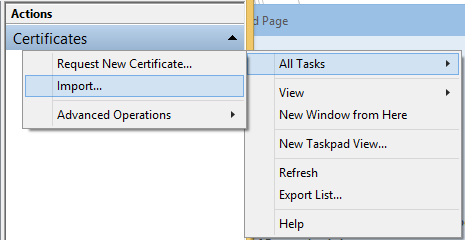
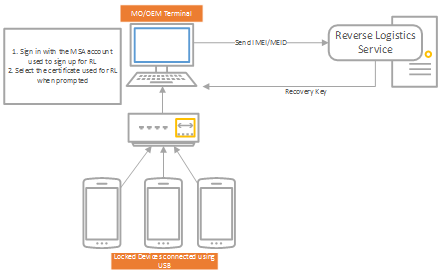

# Reset protection


Reset Protection helps you secure a device in case it is stolen. It must be enabled on the device during manufacturing time.

Reset Protection consists of the following parts:

-   **Reset and reactivation protection** – The stolen device cannot be reused by resetting or flashing the device. When a user performs a factory reset on the device, they will be asked to enter the Microsoft Account credentials that are associated with that device. Additionally, if the device is flashed with a new image and Reset Protection is turned on, the Microsoft Account credentials that were associated with that device is required to finish OOBE and use the device.
-   **Anti-rollback protection** – If Reset Protection is enabled, the stolen device cannot be flashed to an earlier version of the operating system that did not support Reset Protection.

To turn on Reset Protection, you must configure two secure UEFI variables:

-   **ANTI\_THEFT\_ENABLED** –This variable needs to be set with a value that will be provided by Microsoft and indicates that the device can support Reset Protection. The operating system enables Reset Protection on the device based on this setting. This variable is in the 1A597235-6378-4910-9F8B-720FEE9357A3 namespace.
-   **DBX** - This variable must contain the image hashes of the builds to which the device cannot be rolled back. These image hashes are provided by Microsoft. This variable is in the EFI\_IMAGE\_SECURITY\_DATABASE\_GUID namespace.

## <span id="Turn_on_Reset_Protection_in_your_images"></span><span id="turn_on_reset_protection_in_your_images"></span><span id="TURN_ON_RESET_PROTECTION_IN_YOUR_IMAGES"></span>Turn on Reset Protection in your images


There are two ways to turn on reset protection in your images:

**Option 1: Enable it by using oeminput.xml**

On retail devices, you enable Reset Protection by adding the RESET\_PROTECTION feature to the OEMInput.xml file. When you include this feature, the device’s UEFI secure boot keys for Reset Protection are provisioned as a scheduled task that will run once at first boot into main operating system and will not run again. For more info on the optional features that are available, see O[Optional features for building images](https://msdn.microsoft.com/library/windows/hardware/dn756780).

**Note**  If you’re building a test image, use RESET\_PROTECTION\_INTERNAL instead.

 

**Option 2: Enable when provisioning secure boot keys**

Reset Protection is enabled on a device by provisioning UEFI secure boot keys and is a two-step process:

1.  **Anti-Rollback provisioning** -- The DBX variable must be updated to contain the hashes for the builds that did not support Reset Protection. Specifically, the sample scripts that create PK, KEK, DB and DBX variables will be modified to add in the DBX variable the list of hashes provided by Microsoft. The list of hashes will be supplied by Microsoft in a file called **OEM\_RollbackHashes.bin**. The DBX variable must be signed with the OEM certificate.

    The following excerpt includes the changes to the script that creates the DBX variable:

    ``` syntax
    write-progress -activity "Making secure boot variables" -status "Creating DBX"
# add SHA256 hashes from the supplied file to the DBX variable
    $hashes = Get-Content .\OEM_RollbackHashes.bin
    format-sb-hashes "dbx" $ownerGuid $hashes
    ```

2.  **Reset and Reactivation Protection provisioning** -- After setting the DBX variable, you must also set the ANTI\_THEFT\_ENABLED authenticated variable. The content of this variable will be provided by Microsoft in the **OEM\_ResetProtection\_Enable\_Resource.bin** file. The name of the variable is ANTI\_THEFT\_ENABLED and the namespace GUID is 1A597235-6378-4910-9F8B-720FEE9357A3. You can set this in the same way as the secure boot keys.

## <span id="How_do_I_update_a_retail_image_with_Reset_Protection_"></span><span id="how_do_i_update_a_retail_image_with_reset_protection_"></span><span id="HOW_DO_I_UPDATE_A_RETAIL_IMAGE_WITH_RESET_PROTECTION_"></span>How do I update a retail image with Reset Protection?


When you submit an update, Reset Protection should not be included as part of the update. However, when you build image, Reset Protection should be included in the oeminput.xml file. We recommend the following steps to update a retail image with Reset Protection enabled:

1.  When you’re developing an image, the RESET\_PROTECTION optional feature should be included in the oeminput.xml file.
2.  Before you submit the packages for signing, you should remove the RESET\_PROTECTION optional feature from the oeminput.xml file.
3.  After you receive the packages signed by Microsoft, you must add the RESET\_PROTECTION optional feature back to your oeminput.xml file.

## <span id="Bootable_WIM_files_and_MMOS"></span><span id="bootable_wim_files_and_mmos"></span><span id="BOOTABLE_WIM_FILES_AND_MMOS"></span>Bootable WIM files and MMOS


When using Reset Protection on a device, the MMOS or bootable WIM files that support this device must be built on a version of the tools that support Reset Protection. We recommend that the version of the device image and the version of MMOS match.

## <span id="Reverse_logistics"></span><span id="reverse_logistics"></span><span id="REVERSE_LOGISTICS"></span>Reverse logistics


With reverse logistics, you can get information about the status of Reset Protection on a device, such as the device IMEI, or check if Reset Protection is currently enabled on the device. You can also use this to remove Reset Protection if you have the appropriate recovery key for that device. Reverse logistics can help you in refurbishment scenarios where Reset Protection is turned on, but you don’t have the Microsoft Account credentials that are required to turn it off. We’ve provided sample code on how to use reverse logistics in the [Portable Devices COM API Sample](https://code.msdn.microsoft.com/windowsdesktop/Portable-Devices-COM-API-fd4a5f7d).

### <span id="How_to_get_started_using_reverse_logistics"></span><span id="how_to_get_started_using_reverse_logistics"></span><span id="HOW_TO_GET_STARTED_USING_REVERSE_LOGISTICS"></span>How to get started using reverse logistics

In order to use Microsoft's automated reverse logistics program, organizations need to sign up for an account with the [Microsoft Dashboard](https://sysdev.microsoft.com/) and perform the following tasks:

-   Purchase an Authenticode signing certificate.
-   Install the certificate on all machines that will be used to submit requests.
-   Assign an administrator(s) to manage the program.
-   For each user in your company who will contribute submissions to the Dashboard, add the Microsoft account for the user and grant each user the **Reverse Logistics** permission. To grant permissions, click **Your Profile** and then click **Permissions.**

### <span id="Register_your_company"></span><span id="register_your_company"></span><span id="REGISTER_YOUR_COMPANY"></span>Register your company

Your company may already have an account with the Microsoft Dashboard. In that case, you will need to find the administrator of your account with the Dashboard. To find the administrator, click **Administration** and then click **My Administrators**. We recommend adding a reverse logistics manager as an additional administrator so it's easier to approve users' reverse logistics requests. The administrators responsibilities include approving requests to join the company, approving request for permissions, and removing users after they leave the company.For more information, see [Manage users and permissions](https://msdn.microsoft.com/library/windows/hardware/br230781.aspx).

If your company does not yet have an account with then Dashboard, here is how to get started:

-   [Get a code signing certificate](https://msdn.microsoft.com/library/windows/hardware/hh801887.aspx)
    -   In order to use revers logistics, you **must** purchase a standard class 3 certificate, NOT an EV certificate.
    -   Make sure you establish your company with the same name that you used to purchase the certificate. This is the name that will be exposed to users.
-   [Establish a company](https://msdn.microsoft.com/library/windows/hardware/br230795.aspx)

Make sure you save this certificate and that it is accessible. You will need to install it on multiple computers later in this section. We recommend that you save a copy of the certificate on a thumb drive, or something easily accessible.

### <span id="Add_users_for_your_company"></span><span id="add_users_for_your_company"></span><span id="ADD_USERS_FOR_YOUR_COMPANY"></span>Add users for your company

After you register your company, add other users who need reverse logistics permission:

-   The first person to register a company becomes an administrator for that company account.
-   Subsequent users need to register by using a Microsoft account. On the top right-hand corner of the [Dashboard](https://sysdev.microsoft.com/), click **Register** to add yourself to your company and request the **Reverse Logistics** permission under **Additional Permissions Request**.
-   The administrator receives notification and approves the request.

For more information about signing in to the Dashboard, see [Before you sign in](https://msdn.microsoft.com/library/windows/hardware/br230782.aspx).

### <span id="Set_up_your_workstation_for_reverse_logistics"></span><span id="set_up_your_workstation_for_reverse_logistics"></span><span id="SET_UP_YOUR_WORKSTATION_FOR_REVERSE_LOGISTICS"></span>Set up your workstation for reverse logistics

### <span id="Prerequistes"></span><span id="prerequistes"></span><span id="PREREQUISTES"></span>Prerequistes

-   You need a workstation that runs Windows 7 or later and has browser access to the internet.
-   Each reverse logistics submitter must have his or her own Microsoft account; account credentials should not be shared amongst multiple people.
-   Only computers that have the certificate installed locally will be able to perform reverse logistics.

### <span id="Process"></span><span id="process"></span><span id="PROCESS"></span>Process

1.  Plug in the thumb drive that contains the certificate you purchased.
2.  On each computer where you plan to submit reverse logistics requests, sign in as a local Administrator and install the code signing certificate:
    1.  Open a command prompt.
    2.  Type `mmc` and press ENTER.
    3.  On the **File** menu, click **Add/Remove Snap-in**.
    4.  Click **Add**.
    5.  In the **Add Standalone Snap-in** dialog box, select **Certificates**.
    6.  Click **Add**.
    7.  In the **Certificates Snap-in** dialog box, select **Computer account** and click **Next.**
    8.  In the **Select Computer** dialog box, click **Finish**.
    9.  On the **Add/Remove Snap-in** dialog box, click **OK**.
    10. In the **Console Root** window, click **Certificates (Local Computer)** to view the certificate stores for the computer.
    11. In the **Actions** pane, under Certificates, select **More Actions**, then **All Tasks**, and then **Import**:
    12. Click **Browse** and find the certificate you purchased.
    13. Click **OK**. The certificate should be installed in you **Personal** certificate store.

### <span id="Authentication_and_Use"></span><span id="authentication_and_use"></span><span id="AUTHENTICATION_AND_USE"></span>Authentication and Use

The next step is to create a client tool on a provisioned workstation to submit reverse logistics requests. You will need to create a third-party app with Microsoft account. The app will use a browser to allow a user to enter credentials using a Microsoft account website. That will grant access to your tool to get the appropriate token to call the Reverse Logistics API. For more information about how to build the app, see [Mobile and Windows desktop apps](https://msdn.microsoft.com/library/hh826529.aspx), and use "dds.reverse\_logistics" scope (instead of "wl.basic") to get the appropriate token.

After your tool has the token, it can call the Reverse Logistics API with that token, your client certificate, and the target IMEI in order to retrieve the recovery key for the target device.



### <span id="API_specification"></span><span id="api_specification"></span><span id="API_SPECIFICATION"></span>API specification

### <span id="Request"></span><span id="request"></span><span id="REQUEST"></span>Request

Reverse Logistics API endpoint:

POST <https://cs.dds.microsoft.com/Command/ExternalClientCert/AdministrativeUnprotect/%7BPartnerName%7D/%7BDeviceId%7D>

{PartnerName} should be replaced with an end-user readable string that will be included in an email to the user whose Microsoft account is protecting the phone.

{DeviceId} should be replaced with a string in one of the following formats (leaving the square brackets and replacing the text inside and including the curly braces):

-   ImeiOrMeid\[{IMEI or MEID of the device}\]
-   Duid\[{DUID of the device}\]

Include the Microsoft account user token in the “Authorization” header of the request.

The certificate provisioned with the Dashboard for your organization must be used as the client certificate for mutual HTTPS.

### <span id="Response"></span><span id="response"></span><span id="RESPONSE"></span>Response

```
{
  "UnprotectResult": "{UnprotectResult}"
  "RecoveryKey": "{RecoveryKey}"
}

UnprotectResult will be a string value of the enum specified below:

    /// <summary>
    /// Result of the unprotect operation
    /// </summary>
    public enum UnprotectResult
    {
        /// <summary>
        /// Device was not found in DDS
        /// </summary>
        DeviceNotFound,

        /// <summary>
        /// Device was already unprotected
        /// </summary>
        DeviceAlreadyUnprotected,

        /// <summary>
        /// Device has been unprotected
        /// </summary>
        DeviceUnprotected,

        /// <summary>
        /// IF we find more than 1 device, we don&#39;t currently have a way to resolve the conflict. So, we don&#39;t unprotect.
        /// </summary>
        MultipleDevicesFound,
    }
```

Response codes:

-   200: Success.
-   400: The request is malformed.
-   401: The request is unauthorized. Your organization may not be provisioned properly, the user may not be provisioned with the organization, or there may be a problem or mismatch with the client certificate or the Microsoft account user token. The response may include text giving a reason for the authorization problem.
-   404: The API path or device specified was not found.
-   500: An unexpected error. If this persists, contact Microsoft for resolution of the issue.
-   503: Storage error. If this persists, contact Microsoft for resolution of the issue.

 

 


